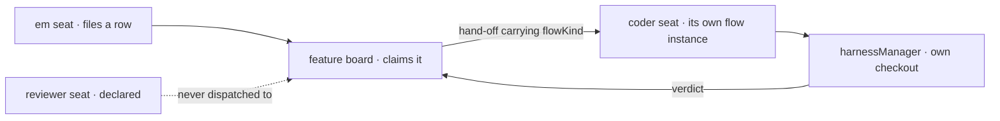

# FIX-1426 · DevForce Lab: first build slice

**Spec** · [Decisions](DECISIONS.md) · [Rules](BUSINESS-RULES.md) · [Plan](PLAN.md)

Feature · `goals/` only, no package changes · small · 1 PR · epic [FIX-1351](https://linear.app/fixpoint-labs/issue/FIX-1351)

## Five people, before and after

| Someone who… | Today | After |
|---|---|---|
| **owns the DevForce build-or-design call** | Has two proven halves and an assertion that they compose. Nothing to run | Runs one check and watches it go red when a seat stops getting its own files. The claim is falsifiable |
| **reads `docs/atlas/workforce.html` §03** | Reads the DevForce opinions and cannot tell which of them the code supports | The opinions the check covers are the ones that have a verdict log behind them. The rest are still marked proposed |
| **would build the DevForce Lab next** | Discovers at build time whether a board row can reach a declared seat | Knows before starting: it can, and knows the one extra thing a worker kind has to declare to make it legal |
| **writes a `WORKER.md` for a seat that codes** | No such seat exists. Every coding run is reached through hand-written TypeScript | Writes a file naming a kind, and a filed row wakes it into a supervised run |
| **runs the existing pentest lab** | Unaffected | Unaffected, byte for byte. This adds a directory beside it and changes nothing it touches |

DevForce is design-only under [D-12](https://linear.app/fixpoint-labs/issue/FIX-1410). Its central
claim — that Workforce's declaration surface and a supervised coding run are the same system — has
never been run. The two halves are each proven and have never met.

## What changes

![Today, two proven halves side by side with a dashed gap between them: the merged pentest lab, where a post reaches seats declared in Markdown and each answers with a line of text, and conductor with harness-manager, where a board row becomes a supervised run with its own checkout but the row reaches hand-written TypeScript. After, one band: an EM seat that names no harness files a row, a feature board claims and settles it, a coder seat declared in Markdown claims the row, and the run produces a commit](figures/what-changes.svg)

The dashed line is the whole issue. Left of it a seat's answer is text; right of it a run produces
a commit, but nothing a person declared is what the row reached. The bottom band is one row
crossing, and it is what the check grades.

**What an author writes — the seat that codes:**

```diff
+ # teams/eng/workers/coder/WORKER.md
+ ---
+ flow: coder
+ document: teams/eng/feature-brief
+ ---
+ Implement the row you are handed. Follow the team's commit style.
```

**And the seat that coordinates, which names no harness at all:**

```diff
+ # teams/eng/workers/em/WORKER.md
+ ---
+ flow: em
+ ---
+ File one row per feature on the board. Do not write code.
```

Nothing in either file names Claude Code, Codex or Cursor. The harness is one expression inside
the `coder` kind, exactly as it is one expression in `labs/conductor/src/flow.ts` today.

## How the row reaches the seat



The hand-off names the seat's instance id. The dashed edge is the silent probe: a third seat is
declared and must never be reached, which is what makes "the row went to the seat it named" a
graded claim rather than an absence.

## What stays as it is

- **Every package.** This adds `goals/devforce-lab/` and changes no framework surface. The check
  consumes `hireWorkforce`, `taskBoard` and `harnessManager` exactly as they ship.
- **`goals/pentest-lab/`.** Untouched. Re-shaping its kind authoring is [FIX-1427](https://linear.app/fixpoint-labs/issue/FIX-1427), already filed and in flight.
- **The DevForce Lab itself.** This is evidence under `goals/`, not the showcase D-12 describes.
  No MCP, no product team, no UI, no second board.
- **`docs/atlas/workforce.html`.** Three open PRs are already rewriting it; this slice does not.

## Sign off

1. **[D1](DECISIONS.md#d1) · The row reaches the seat's own flow instance, and the `coder` kind
   therefore declares the same logical board itself.** If wrong: a worker kind that can be given
   work is a heavier thing to declare than one that can answer — and we find out after the Lab is
   built on it. **Approved, and since ruled interim:** the Architect split board *authoring*
   (channel-attached, [FIX-1385](https://linear.app/fixpoint-labs/issue/FIX-1385)) from this
   cross-flow claim-gate tax (L1, soft→[FIX-1408](https://linear.app/fixpoint-labs/issue/FIX-1408)),
   so the extra declaration is a current tax to label, not a rule the Lab teaches. See
   [DECISIONS.md → Ruled after approval](DECISIONS.md#ruled-after-approval--the-interim-label).
2. **[D2](DECISIONS.md#d2) · Two checks, and the contract gate runs with no model at all.** If
   wrong: the evidence is one model-backed run, which stays green while a seat reads none of its
   own files, because a model improvises around a missing document.

**Open: one.** Whether this runs before the W3 epic closes is yours —
[DECISIONS.md → Open](DECISIONS.md#open) carries it in full. Number 1 is the one to weigh. The
reasoning and what lost is in [DECISIONS.md](DECISIONS.md); the cases are in
[BUSINESS-RULES.md](BUSINESS-RULES.md).
