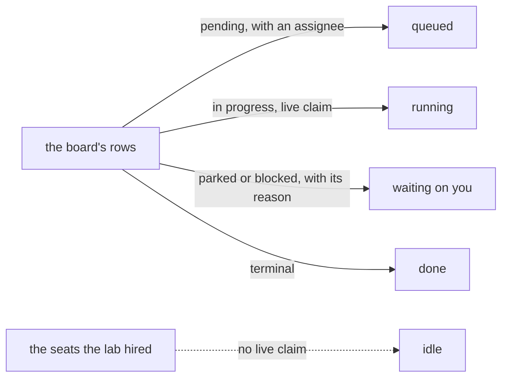

# FIX-1430 · Business rules

[Spec](SPEC.md) · [Decisions](DECISIONS.md) · **Rules** · [Plan](PLAN.md)

The cases as rules: what someone does, what happens, and which check proves it. A human reviews this page; the plan turns it into work. *Contract gate* is the model-free check; *goal check* is the model-backed run of the same host.

## Declaring the team

| # | When | Then | Proved by |
|---|---|---|---|
| BR-1 | The lab's tree is read and hired | Exactly four seats — one coordinator, three workers — on the kinds their own files name, one channel, and one ledger minted from the channel at `org` scope. No id is written in any file | Contract gate |
| BR-2 | The coordinator's own file names the task tools | It can file and assign. A twin tree that omits them hires cleanly and cannot file: the names resolve, the grant does not | Contract gate · a refusal tree and its corrected twin |
| BR-3 | A seat's own folder holds a block that declares a board, or anything org-scoped | The whole roster is refused at hire, naming the block. The lab does not widen the seat-tool fence to get a board tool into a folder | Contract gate · refusal tree |

## Filing and assigning

| # | When | Then | Proved by |
|---|---|---|---|
| BR-4 | The coordinator files four rows across three named assignees | Each row runs on the seat that assignee addresses, and on no other. **Negative control:** re-point one assignee at a different declared seat and watch this go red | Goal check |
| BR-5 | A row runs | It runs in its own session, whose parent is the session the row was filed from. Nothing carries the coordinator's transcript with it | Goal check · read off the session record |
| BR-6 | Two rows name the same assignee | The second stays `pending`, still holding that assignee, and runs when the seat frees. Nothing re-routes it to a free seat and nothing drops it | Goal check |
| BR-7 | A row is filed naming no assignee | Refused by name where it would have run. The lab declares no default worker, so a row for nobody is loud rather than quiet | Goal check · asserted on the refusal |
| BR-8 | Someone who is not a member of the channel files a row | Refused with the channel's own author-not-a-member reason, in the same words a refused post gets | Contract gate |
| BR-9 | The coordinator settles a row it never claimed | Allowed, exactly as the task tools allow it today. Recorded as observed behaviour rather than defended as a design | Contract gate |

## The queue the coordinator sees

| # | When | Then | Proved by |
|---|---|---|---|
| BR-10 | The queue is read | Four columns — queued, running, waiting on you, done — each a grouping of rows that already exist. No field is written to produce one | Contract gate · the ledger compared before and after a read |
| BR-11 | A seat holds a live claim | It reads busy; a seat holding none reads idle. Idle is the absence of a claim, never a stamp somebody writes | Contract gate |
| BR-12 | A row is parked or blocked | It appears under *waiting on you*, carrying the reason already on the row | Contract gate |
| BR-13 | The queue is read at any moment | The task status set has exactly the members it had before this issue | CI · asserted on the enum, not on a reading of it |

![A matrix of four queue columns against the row facts each is computed from. Queued reads status pending and the assignee. Running reads status in progress and a live claim. Waiting on you reads status parked or blocked and the reason already on the row. Done reads the terminal statuses. A fifth strip beneath shows seat idle derived from the absence of a live claim against the seats the lab hired. A heavy fence runs under the whole matrix, labelled nothing below this line is written, with the task status enum and the row fields drawn underneath it untouched.](figures/the-view.svg)

Read down a column to see every fact it is allowed to touch. Everything below the fence is read and never written, which is the whole content of BR-10 and [ER-11](https://github.com/fixpoint-labs/flow-state-dev/pull/1905). The mermaid below names the same four paths.

## What does not move

| # | When | Then | Proved by |
|---|---|---|---|
| BR-14 | This issue's diff is inspected | It touches `goals/` and nothing else. No published package gains a file, an export or a changeset ([D1](DECISIONS.md#d1)) | CI · a check over the diff, run rather than read |
| BR-15 | `goals/devforce-lab/` is run after this lands | Byte for byte as before. Its interim board shape and its two ledger declarations are untouched | Existing suite |
| BR-16 | Someone looks here for the nested cascade | It is not here. One hop: the channel's board, then the seat | Documented, not checked |
| BR-17 | The lab is run twice at two drain widths | Both runs are recorded, and neither is presented as the recommended setting ([D3](DECISIONS.md#d3)) | The comparison the lab writes out |

## Failure taxonomy

Everything about the **tree** is fatal at hire and collected: a bad seat folder, a missing tool grant or an undeclared board refuses the whole roster and names every problem, because a lab that boots short proves something other than what it claims. Everything about a **row** is a per-row outcome that leaves the ledger readable — an unroutable row refuses at the drain, a non-member's filing refuses at the channel, a failed row settles `errored` and stays visible in the queue. Nothing retries, because a retry would hide the thing the queue exists to show.

## Acceptance criteria this issue owns

A team declared entirely in files — one channel holding one board, one coordinator seat and three worker seats — takes in more work than it has seats. The coordinator files every row through the tools its own file grants it, names who each is for, and the rows run on those seats and no others, each in its own session parented to the coordinator's. The row that could not start immediately runs when a seat frees, without being re-routed. Throughout, the coordinator can say what is queued, what is running, what is waiting on a person, and what is done — every one of those read off rows that already existed.

That is [ER-20](https://github.com/fixpoint-labs/flow-state-dev/pull/1905) and [ER-21](https://github.com/fixpoint-labs/flow-state-dev/pull/1905) together, and it is the epic's exit gate. Nothing else in the set makes this sentence true or false.
