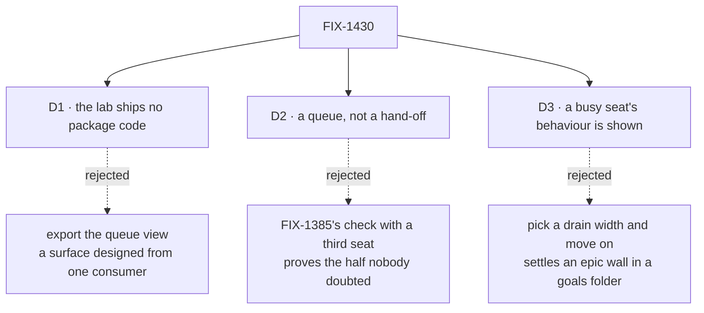

# FIX-1430 · Decisions

[Spec](SPEC.md) · **Decisions** · [Rules](BUSINESS-RULES.md) · [Plan](PLAN.md)

What was chosen, what lost, what each locks in. Three decisions are the sign-off surface. Calls this issue may not take — where a board lives, what an assignee is, which package format a capability arrives in — belong to [FIX-1385](https://github.com/fixpoint-labs/flow-state-dev/pull/1917), [FIX-1394](https://github.com/fixpoint-labs/flow-state-dev/pull/1915) and the epic.

## The tree

Solid edges are what you're signing. Dashed edges lost, and the label says why.

## D1 · The lab ships no package code; the queue columns stay lab-local

| | |
|---|---|
| **Instead of** | Exporting the columns from `orchestration` or `workforce` as the Layer 2 view surface |
| **Because** | This issue owns one epic rule and no surface. [ER-11](https://github.com/fixpoint-labs/flow-state-dev/pull/1905) calls a queue column a *view* rather than a status — a fence on where it may not live, not a commission to build a view package. One consumer is not a design input, and this lab is the only one. An export would also put the issue behind the W3 ship fence for no gain in evidence |
| **Locks in** | The next consumer that wants columns derives them again, and this lab's shape is a suggestion rather than a contract. If the view turns out to be the product we pay a second design pass — on two examples instead of one, which is the cheaper mistake |

## D2 · The proof is a queue, not a hand-off: more rows than seats, and the coordinator assigns through the tools it declared

| | |
|---|---|
| **Instead of** | Re-running FIX-1385's own goal check with a third seat and calling it the exit gate |
| **Because** | That check already shows a row filed by one seat and claimed by another — [ER-20](https://github.com/fixpoint-labs/flow-state-dev/pull/1905)'s first half, the half nobody doubted. Its second half is a coordinator *assigning* to named seats, and routing to the only seat on a board is indistinguishable from not routing. [ER-21](https://github.com/fixpoint-labs/flow-state-dev/pull/1905)'s columns say nothing until a row waits. Hence: several candidate seats, more rows than seats, and a coordinator filing through the model's door |
| **Locks in** | A slower check with more moving parts, and a flaky queue is a flaky exit gate. Worker seats therefore do small deterministic work and the model appears at one place only — how far that goes is [Q1](#q1) |

## D3 · What a busy seat does is shown, not chosen

| | |
|---|---|
| **Instead of** | Picking a drain width for the lab and letting that choice read as the recommended shape |
| **Because** | Whether a busy seat gets a second copy or work queues behind it is one of four session-policy walls the epic took back from FIX-1408 — and the epic named *this lab, running a queue deep enough to matter*, as what would settle it. Deciding it inside `goals/` settles an epic wall where nobody reads decisions ([ER-15](https://github.com/fixpoint-labs/flow-state-dev/pull/1905)) |
| **Locks in** | Two runs of one queue where one would do, and a reader looking for the recommended setting gets a comparison instead. When the epic rules, the lab is revisited to keep the ruled shape — the evidence costs a second visit, on purpose |

## Decided, not asked

- **No third `LabRoster`.** The lab reads its tree through whatever the package exports when it is built. FIX-1405 deletes the two copies that exist; a third while that is in flight is how a fourth appears.
- **Seat idle comes off the board's rows and the seats the lab hired**, not the live inventory — keeping blocking prerequisites at exactly one sibling.
- **No `defaultWorker`.** An unassigned row throws at the drain today. The lab shows that refusal rather than papering it, because "a row for nobody" is a case a queue meets.
- **The coordinator does not claim the rows it settles.** `taskTools` leaves an unclaimed settle unguarded on purpose; the lab records that rather than working around it.
- **Two checks over one host, differing by one block** — a model-free contract gate and a model-backed run. The devforce lab's shape, reused.
- **The channel's membership fence is consumed, not re-implemented.** A non-member filing is refused by the path a post already meets.

## Considered and dropped

| Alternative | Why not |
|---|---|
| **Grow `goals/devforce-lab` instead** | It is the epic's other evidence and carries a board shape labelled interim. Rewriting it mid-epic destroys the before/after that makes a one-line board legible |
| **A harness-backed coding run per row** | The devforce lab already owns row → supervised coding run. Re-proving it buys no new fact and buys a slow, flaky exit gate ([Q1](#q1)) |
| **Build the nested cascade here too** | Phase-2 inside W4, off the gate by the epic's D1. A gate has to be reachable on a schedule |
| **Read seat liveness from the live inventory** | A second blocking sibling for a fact the board already carries |
| **Let the coordinator dispatch seats directly, skipping the board** | That is today, and it is what the epic exists to replace |

## Open · one

### Does the exit gate close on routing proved, or on routing proved all the way into real work?

**In plain terms.** Either the demo ends at *the right worker picked up the right job and reported done*, or it ends at *the right worker picked up the right job, and here is the file it changed.*

**The trade-off.** The narrow reading makes the gate fast, deterministic and rerunnable on every change — but an outsider reading *work reaches a seat that runs it* may reasonably hear the wider one. The wide reading is closer to the words and costs a check that takes minutes, needs a scratch repository and a live harness, and fails for reasons unrelated to routing. A gate that goes red for unrelated reasons stops being one.

**My recommendation: the narrow one**, with worker seats doing small real work — writing a file the check reads back — rather than nothing. The wide claim is evidenced next door: `goals/devforce-lab/` shows a board row becoming a supervised coding run. What has never been shown is a *queue* crossing from a declared coordinator to declared seats, and that is the gap this issue was adopted to close.

**What would change my mind.** If the promise will be read publicly as *declare a team in Markdown and it ships code*, the two halves have to meet in one run at least once, and this is the cheapest place to make them meet.

**What being wrong costs.** Narrow when it was wide: the epic wraps on a claim narrower than it reads, and someone builds the wide check afterwards — a few days, nothing already built thrown away. Wide when it was narrow: the gate is slow and intermittently red from the day it lands, which is worse because it is permanent.

**Settled: none.** No claim here has been argued twice.

## How it got here

- **Draft** — framed as evidence rather than surface: owns one rule, builds no export, consumes four. The delta against FIX-1385's goal check was made explicit early, because repeating a sibling's check is the obvious way this issue fails quietly.
