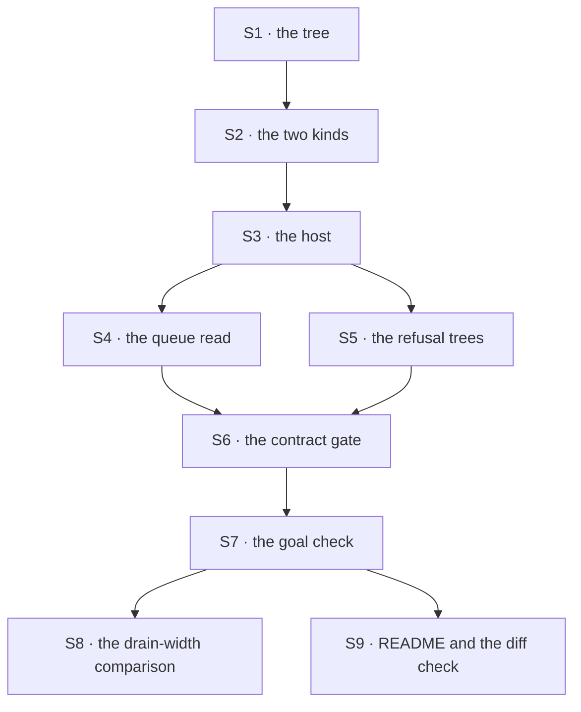

# FIX-1430 · Plan

[Spec](SPEC.md) · [Decisions](DECISIONS.md) · [Rules](BUSINESS-RULES.md) · **Plan**

For the implementing agent. IDs cross-reference [BUSINESS-RULES.md](BUSINESS-RULES.md) (BR-n) and [DECISIONS.md](DECISIONS.md) (D-n). `tdd`. One PR. Written against `d8e4c99`.

## What this consumes, and what it waits for

**From FIX-1394: neither the contract nor the implementation as a build input — only [ER-2](https://github.com/fixpoint-labs/flow-state-dev/pull/1905) as a fence.** The lab's seats carry instructions, skills and tools on surfaces that already shipped, and FIX-1394 changes none of them: its own spec ships no format and leaves today's behaviour byte for byte. Nothing to write against, nothing to wait for. What ER-2 binds is *authoring* — this lab invents no package shape — so all four of FIX-1394's possible answers, *don't collapse* included, leave it compatible. The worry that a ratify might not satisfy a proof needing the package to **exist** does not reach here: the proof needs no package.

**From FIX-1385: the implementation, landed.** `boards:` in a channel file, the minted ledger id, the channel's file and read actions, the task-tools resolver on the kind, the seat-side helper. A real blocking edge, not a contract one.

**Which side of [ER-14](https://github.com/fixpoint-labs/flow-state-dev/pull/1905) this sits on.** The one PR is on the **evidence** side: it adds no file to a published package (BR-14), so it is no W4 ship PR and the fence does not hold it. It still cannot go green until FIX-1385's board PRs have landed, and those *are* ship PRs the fence holds. Unfenced, and behind the fence in practice — spec now, build when the board surface exists.

## Surfaces

| ID | Role | Change | Rules |
|---|---|---|---|
| S1 | `goals/manager-queue-lab/lab/workforce/` · the tree | One team: a channel declaring one board, a coordinator seat naming the task tools in its own file, three worker seats | BR-1 BR-2 |
| S2 | The kinds, under `flows/workers/` | The coordinator's installs the task tools against the channel's ledger; the worker's declares the same ledger and drains it, one assignee key per worker seat, no default worker | BR-4 BR-5 BR-7 |
| S3 | `lab/host.mts` | Read the tree, build the kinds, hire, register, open the channel, hand back handles — through the package's own roster reader, **no third `LabRoster`** | BR-1 |
| S4 | `lab/queue.mts` | A pure read: rows plus the hired seats to four columns and per-seat idle. Writes nothing | BR-10 BR-11 BR-12 |
| S5 | `lab/refusal-trees/` | Two twins and their corrected pairs: a coordinator naming no task tools, a seat folder holding a block that declares the board | BR-2 BR-3 |
| S6 | The contract gate, model-free | The tree, both refusals, the columns, the enum, the diff check | BR-1–BR-3 BR-8–BR-14 |
| S7 | The goal check, model-backed | The coordinator decides who gets what: four rows across three assignees, so one assignee holds two | BR-4–BR-7 |
| S8 | The drain-width comparison | The same queue at two widths, written out as the epic's [ER-15](https://github.com/fixpoint-labs/flow-state-dev/pull/1905) evidence. Neither recommended | BR-17 |
| S9 | `lab/README.md` and the diff check | What the lab proves, what it does not, the check keeping it inside `goals/` | BR-14 BR-16 |

## Sequence



## Checks

| ID | After | Passes when |
|---|---|---|
| V1 | S3 | BR-1. **Negative control:** rename one seat's kind to an unregistered one, watch the whole roster refuse, restore it |
| V2 | S5 | BR-2 and BR-3, each against its corrected twin. Both asserted on the seat or block **named**, never on message text |
| V3 | S4 | BR-10, BR-11, BR-12. BR-10 by comparing the ledger before and after a queue read — a view that wrote something fails here |
| V4 | S6 | BR-13 on the enum itself; BR-14 as a check over this issue's diff, run rather than read; BR-8 and BR-9 through the channel |
| VG | S7 | **Goal, real path:** four rows, three assignees, three worker seats. Every row lands where its assignee points (BR-4), each in a session parented to the coordinator's (BR-5); the fourth waits, then runs (BR-6); a row naming nobody refuses loudly (BR-7). **Negative control:** re-point one assignee at a different declared seat and watch BR-4 go red |
| V5 | S8 | Both runs complete and both are recorded, with what each did to the waiting row (BR-17) |

**Every held-out fact is read out of the tree at run time**, as both existing labs do: a token that decides a check lives in one convention file and in none of the lab's code, so a different valid tree still passes a correct implementation.

## Pinned names · the only three

| Where | Name | Why pinned |
|---|---|---|
| The channel | `eng.queue`, holding `boards: [work]` | The ledger id is minted from it, and the checks address that id |
| The board's assignee keys | Deliberately **not** the seat ids — a distinct spelling for each | [ER-5](https://github.com/fixpoint-labs/flow-state-dev/pull/1905): an assignee is a routing key, not a seat. Identical spellings would let a check that conflates them pass |
| The lab root | `goals/manager-queue-lab/` | Cited from the epic, and by BR-14's diff check |

Everything else is yours, the column names included.

## Guardrails

| Rule | Because |
|---|---|
| The seat-tool fence is not widened, anywhere | It landed stricter than its own spec read, and a board tool in a seat folder is the shape that tempts a loosening. BR-3 is that temptation, as a refusal |
| Nothing under `goals/` is imported by anything under `packages/` | D1. A lab that becomes a dependency has stopped being evidence |
| Every column is derived on read, and the queue module holds no state | BR-10, and [ER-11](https://github.com/fixpoint-labs/flow-state-dev/pull/1905). A cached column is a second copy of the board |
| The assignee-to-seat map lives in the host, supplied by the caller, never read from the tree | It is the app's — and a supplied map is the only way VG's negative control can point an assignee at the wrong seat |
| No epic wall is answered in a comment in this folder | [ER-15](https://github.com/fixpoint-labs/flow-state-dev/pull/1905). Evidence goes up to the epic PR; decisions come back down |

## Docs

- **CREATE** `goals/manager-queue-lab/lab/README.md` — what the tree declares, what each check grades, what the drain-width comparison is for, and one paragraph on what this lab does **not** prove. *Voice risk:* writing it as a tutorial. It is evidence.
- **No `apps/docs` page and no package README change.** Teaching routing as something a team gets by attaching a board is [ER-22](https://github.com/fixpoint-labs/flow-state-dev/pull/1905), the epic's docs pass; FIX-1385 already carries the channels-page edit.
- **No changeset** (BP-022): `goals/` is private and no published package changes.

## Sketch · pseudocode, illustrative, react to the shape

```
the tree:      one channel declaring one board; a coordinator seat whose own
               file names the task tools; three worker seats

the host:      read the tree through the package's reader
               build the coordinator kind:  task tools -> this channel's ledger
               build the worker kind:       the same ledger, drained,
                                            one assignee key per worker seat
               hire, register, open the channel

the queue:     rows, and the seats we hired ->
                 queued         = pending, grouped by assignee
                 running        = in progress with a live claim
                 waiting-on-you = parked or blocked, with the row's own reason
                 done           = terminal
                 idle           = a hired seat holding no live claim
               reads only; writes nothing

the check:     coordinator files four rows across three assignees
               each row runs where its assignee points, and nowhere else
               the fourth waits, then runs
               a row naming nobody refuses at the drain
```

**POC: none.** The two premises underneath this — that a channel can hold a ledger a seat drains, and that a seat's declared task tools can be pointed at it — are FIX-1385's, and its plan records reading them in the code rather than running them. A POC here would re-derive a sibling's premise against a surface that does not exist yet. The premise this issue owns is the queue, and a queue POC over an unbuilt board is this lab, early.

## At implement time

- **Re-read the board surface as it actually landed**, not as [PR #1917](https://github.com/fixpoint-labs/flow-state-dev/pull/1917) specified it. The minted id, the seat-side helper's shape and where the task-tools resolver is installed are what move.
- **Check whether `readDeclaredRoster` has landed** (FIX-1405). If so, read the tree through it; if not, use the three readers directly, and still hand-roll nothing reusable.
- **Check the four returned session-policy walls** on the epic before wiring the dispatcher. Two are visible at this queue depth: whether a seat already running has its session reused, and what a busy seat does. If either has been ruled, follow it; otherwise show it and report up.
- **`goals/devforce-lab/` declares one ledger twice on purpose.** Interim, and not the shape to copy.

## Follow-ups

- **Whether a channel board should carry a default worker** is FIX-1385's surface, not this lab's. BR-7 shows what happens without one; file the question there.
- If the queue columns survive a second consumer, they are a candidate export. Not before ([D1](DECISIONS.md#d1)).
