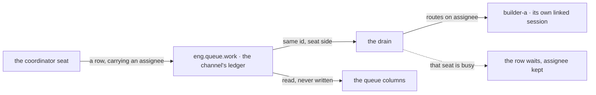

# FIX-1430 · Manager-queue lab — the proof that work reaches a seat

**Spec** · [Decisions](DECISIONS.md) · [Rules](BUSINESS-RULES.md) · [Plan](PLAN.md)

Feature (evidence) · `goals/` only · medium · 1 PR · epic [FIX-1407 · W4](https://github.com/fixpoint-labs/flow-state-dev/pull/1905)

## Five people, before and after

| Someone who… | Today | After |
|---|---|---|
| **has a declared team and work to hand out** | Hands it out one dispatch at a time, from code. Nothing shows what waits or who holds it | Files rows on the team's channel board, names who each is for, watches a queue |
| **asks whether routing actually works** | Two halves, proved alone and never together: a post reaching seats declared in Markdown, and a board row becoming a real run over a board written in TypeScript | One run, one tree of Markdown: a coordinator files, the board routes, three seats work |
| **wants to see what the team is waiting on** | Reads raw rows and counts them | Four columns — queued, running, waiting on you, done — each computed at read time, none stored |
| **files more work than the team has seats** | No shared queue to file it on | Rows wait, holding the seat they were filed for. Nothing is lost, nothing is re-routed |
| **wires a board for a team today** | Forty-odd lines of TypeScript per team, the ledger declared twice so the claim gate passes | One line in the channel's file. The old shape stays next door, so the two stand side by side |

**Why this one.** The epic's claim is one sentence: *work filed for a team reaches a seat that runs it.* Four of its five issues build surface for that sentence; none makes it true or false. We can ship a declarable board, a runtime roster and a package format and still never watch a row cross from the person who filed it to the seat that finished it — and a claim nobody has watched is an intention, not a result. This is where it gets run. It owns [ER-20](https://github.com/fixpoint-labs/flow-state-dev/pull/1905), the epic's exit gate, and nothing else.

It is a **lab**, the way `goals/pentest-lab/` is: a small tree of Markdown, a host that reads it, checks that grade what happened. Nothing it adds is importable. Written against landed code at `d8e4c99` and against the board surface [FIX-1385](https://github.com/fixpoint-labs/flow-state-dev/pull/1917) is specifying, which must merge before this can run.

## What changes

![Today and after, side by side. Today a team's board is about forty lines of TypeScript declared twice, once on the coordinator flow and once on the recipient so the claim gate passes, with one assignee key, one row, one hand-off and no queue. After, one boards line in the channel's own file mints the ledger, a coordinator seat files four rows through the board capability its kind composes, and rows route by assignee to three declared seats while a fourth waits behind a busy seat; four queue columns sit below as a read-time view over rows that already exist.](figures/what-changes.svg)

Left is what a team writes today, and it is code. Right is the same team written as files, with one more row in flight than there are seats to run it — the case the columns exist for.

**What the team's channel declares:**

```diff
  ---
  description: Where this team takes in work.
  members: [eng.manager, eng.builder-a, eng.builder-b, eng.builder-c]
+ boards: [work]
  ---
```

**What gives the coordinator the board — and it is not the coordinator's file:**

```diff
  const work = channelBoard("eng.queue", "work")   // the ledger the channel holds

  defineAgentWorkerFlow({
    kind: "coordinator",
+   uses: [createTaskToolsCapability(() => work)],
  })
```

Composing the capability is the grant. The eight task tools arrive as capability **controls**, which core exempts from a block's `tools:` fence and mints per resolver — so no `tools:` line can name them back in or fence them out, and a coordinator whose file says `tools: []` still holds the board ([FIX-1385 BR-17](https://github.com/fixpoint-labs/flow-state-dev/pull/1917)). All eight or none; narrowing the set is capability selection, parked on the epic. The seat-tool fence FIX-1416 landed is unwidened here because nothing here asks it for anything (BR-3).

So this team is declared in files down to the board's *existence* — one `boards:` line — but the coordinator's **grant** is still code, in its kind. That is the honest edge of "declared in Markdown", and the lab draws it rather than blurring it.

## How a row reaches a seat



One hop. The coordinator names no session, flow or seat instance — only an assignee on a row. The address map the app holds does the rest.

## What stays as it is

- **Every published package.** A folder under `goals/`, and nothing a consumer installs.
- **`goals/devforce-lab/`.** Its hand-rolled ledger stays, labelled interim where it lives. Editing evidence while it is being cited is a bad trade.
- **The task status set.** No new member, no new Layer 1 type: a column groups rows that already exist ([ER-11](https://github.com/fixpoint-labs/flow-state-dev/pull/1905)).
- **The nested cascade** — personal boards, request boards, a row that fans into rows. This issue's *other* half, phase-2 inside W4 and off this gate.
- **Which package format a capability arrives in.** FIX-1394 settles it; this lab authors no new one ([ER-2](https://github.com/fixpoint-labs/flow-state-dev/pull/1905)).

## Sign off

1. **[D1](DECISIONS.md#d1) · The lab ships no package code — the queue columns stay lab-local.** *If wrong:* a view surface is designed from one example, exported, then redesigned when a second consumer disagrees.
2. **[D2](DECISIONS.md#d2) · The proof is a queue, not a hand-off: more rows than seats, the coordinator assigning through the model's door on the channel's board.** *If wrong:* we re-run FIX-1385's own check with an extra seat, call it the exit gate, and prove the half of ER-20 nobody doubted.
3. **[D3](DECISIONS.md#d3) · What a busy seat does is shown, not chosen: the lab is wired to run at either drain width, and the comparison goes to the epic when it asks for it.** *If wrong:* a lab settles a policy the epic owns, in a folder nobody reads as a decision.

**Open: one** — how much realism ER-20 closes on ([Q1](DECISIONS.md#q1)). Number 2 is the one to weigh: it is what separates this from a second copy of a check that already exists. Reasoning and what lost: [DECISIONS.md](DECISIONS.md). The cases: [BUSINESS-RULES.md](BUSINESS-RULES.md).
