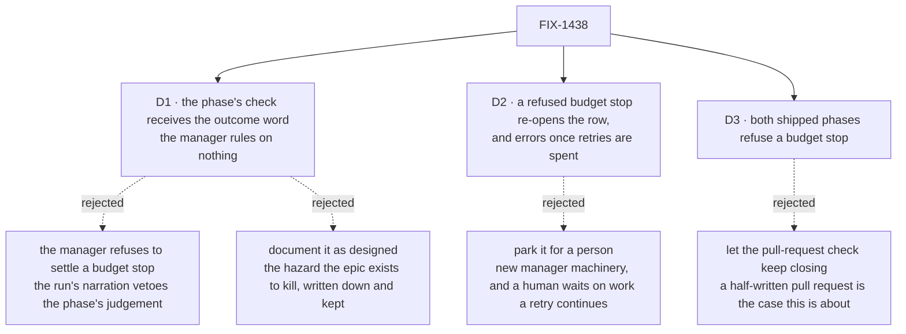

# FIX-1438 · Decisions

[Spec](SPEC.md) · **Decisions** · [Rules](BUSINESS-RULES.md) · [Plan](PLAN.md)

What was considered, what was chosen, why, and what each choice locks in. Three decisions are the sign-off surface. Everything else here is context for them.

## The tree

Solid edges are what you're signing. Dashed edges lost, and the label says why.

## D1 · The phase's completion check receives the run's outcome word; the manager still decides nothing on it

| | |
|---|---|
| **Instead of** | The manager comparing the outcome itself and refusing to settle a row whose run stopped at a limit |
| **Because** | What "done" means genuinely differs by phase, and only the phase knows it. A rule in the manager would let the run's own narration overrule the phase's judgement, so a pessimistic report would block work that really was finished. That inversion is the one thing the current design is built to avoid, and the issue locks it as out of bounds |
| **Locks in** | Every phase author now owns one more call, and the framework cannot make them take it. A phase that ignores the new fact closes rows on partial work exactly as today, silently. The contract, the two shipped phases, and the lab control are the whole of the teaching |

**What would change my mind:** a third and fourth phase shipping and both forgetting. At that point the evidence says the fact should be enforced rather than offered, and the right move is a manager-level default with an explicit opt-out — which is a different decision, taken with data rather than ahead of it. It is flagged in [PLAN.md](PLAN.md) → Follow-ups rather than built now.

The honest cost of this decision is that it does not, by itself, fix anything. It hands the fact down; [D3](#d3) is where the rows actually stop closing. Weighed against a central rule, that is the trade: the central rule fixes every phase at once and is wrong for the phase where a budget stop really did leave the job done.

## D2 · A refused budget stop re-opens the row with its reason attached, and errors once the retry budget is spent

| | |
|---|---|
| **Instead of** | Parking the row for a person to decide whether to continue, or minting a board word that means "partial" |
| **Because** | That path already exists, is already proved (a clean run that leaves no commit takes it today), and needs no new board vocabulary — which the issue locks. It is also the cheaper answer: a retry resumes the *same* coding session with a fresh budget, so the next attempt carries on rather than starting over. Waiting for a person is the expensive way to get a continuation the system can do unattended |
| **Locks in** | A budget stop spends a retry. An operator sees a row that came back, not a row waiting on them, and a run that keeps hitting its limit ends `errored` rather than as a question. If someone later wants a human in that loop, it is a new hold on an existing status, not a new status |

**What would change my mind:** evidence that a budget-stopped retry usually stops at the same place rather than continuing. Then the retries are pure spend and parking is worth its machinery. Today the resume path hands the previous attempt's confirmed session to the next one, which is what makes continuation the expected case.

## D3 · Both shipped phases refuse a budget stop — including the one whose completion check is "a pull request exists"

| | |
|---|---|
| **Instead of** | Refusing only in the lab's phase, where the check is weak ("any commit the base ref lacks"), and letting the pull-request check keep closing because a pull request is a real deliverable |
| **Because** | A run that opens the pull request early and then exhausts its budget is precisely the case this issue is about, and the pull request's existence says nothing about whether the branch under it is finished. The cost of refusing wrongly is one extra run that resumes the session, finds the work done, and closes the row; the cost of closing wrongly is a half-finished branch marked done, found by a person downstream |
| **Locks in** | Anyone running conductor on a tight budget pays one extra attempt per budget stop, including the ones that had genuinely finished. Reversing it later is a one-line change in the phase, not in the framework |

## Decided, not asked

- **The outcome travels as the word the run reported, never narrowed to a boolean or defaulted.** A word this framework version does not define must reach the check as itself; silently mapping an unknown word to `finished` is the same silent partial success in a new place.
- **Reporting nothing stays distinguishable from reporting `finished`.** The absent case is its own value, because a check that cannot tell them apart is the sometimes-absent field the manager's own contract already refuses.
- **The outcome is absent from the prompt builder's context, deliberately and always.** It is the mirror of the rule that keeps the previous attempt's reason off the completion check: a value that means "this attempt" in one place and "the last attempt" in another is a field that lies by position.
- **The manager reads the outcome for one thing only — to say which kind of stop a failure was, in the reason it writes on the re-opened row.** That is phrasing, not a decision.
- **The lab's `stopped-at-limit` control stops being special-cased.** It becomes an ordinary control, caught by the same assertion that catches the others.

## Considered and dropped

| Alternative | Why not |
|---|---|
| **Leave it as designed and document it** (the issue's option 1) | Defensible, and it is what the current contract implies. But it writes down the exact hazard this epic exists to remove, and it costs the only reproduction we have: the lab control would have to be rewritten to *expect* a row closing on partial work |
| **Distinguish "finished cleanly" from "finished the work" on the run record** (the issue's option 3) | The row still settles through the done-condition, so nothing about what an operator sees changes. It is option 1 with extra bookkeeping |
| **A manager-level rule: never settle a row whose run reported a limit** | Fixes every phase at once, and is wrong for the phase where the budget stop genuinely left the job complete. Rejected by the issue as an authority inversion, and by the reasoning in [D1](#d1) independently |
| **A new board status for a partial stop** | Locked out by the issue, and it would be a second answer to a question the existing statuses already answer |
| **Scope the completion check to this attempt instead** | A different fix for a different defect (a probe reporting on a branch an earlier attempt wrote), already considered and rejected in the manager's own contract as a clock-skew race |

**Open: none.**

## How it got here

- **Draft** — framed as *two facts are reported and one is read*; chose to hand the second fact to the phase's completion check rather than rule on it in the manager; both shipped phases refuse, and a refusal settles through the re-pend path that already exists.
