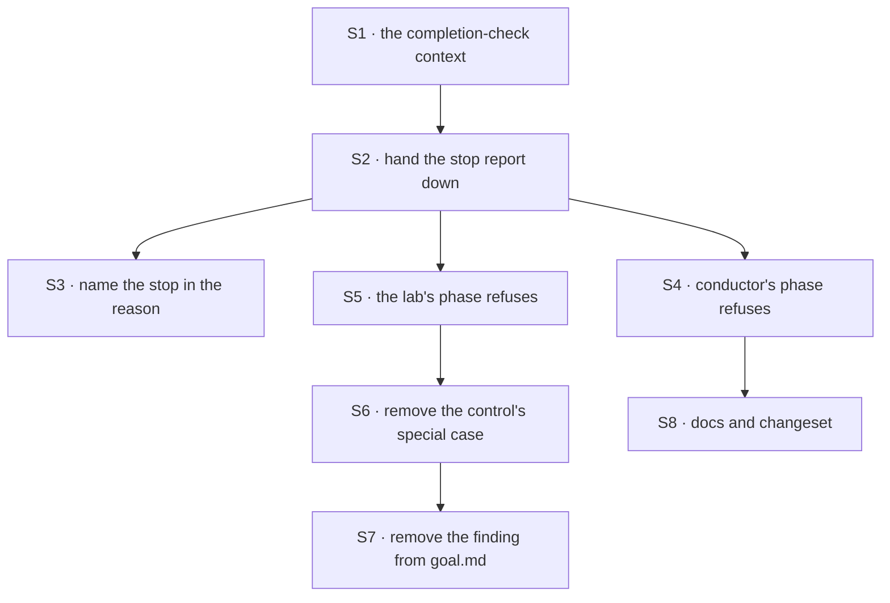

# FIX-1438 · Plan

[Spec](SPEC.md) · [Decisions](DECISIONS.md) · [Rules](BUSINESS-RULES.md) · **Plan**

Written for the implementing agent. IDs cross-reference [BUSINESS-RULES.md](BUSINESS-RULES.md) (BR-n) and [DECISIONS.md](DECISIONS.md) (D-n). `tdd`. One PR.

**Stop report** is the run's three-way word for how it ended (`finished`, `stopped-at-limit`, `failed`), on the run's handle — *not* the run record's own `outcome` bookkeeping, which this change does not touch. See [SPEC.md](SPEC.md).

## Surfaces

| ID | Package · role | Change | Rules |
|---|---|---|---|
| S1 | `harness-manager` · the phase contract | A completion-check context carrying the stop report, added the same way the prompt context already adds its ask fields — one sibling of the existing shared base, not a new hierarchy. The stop report is on the completion side only, mirroring how the carry-forward reason sits on the prompt side only (D1) | BR-1 BR-2 BR-3 BR-4 BR-6 |
| S2 | `harness-manager` · the verdict handler's completion arm | Hand the reported stop report to the check. Compare nothing on it. The value crosses as reported — not narrowed to a boolean, not defaulted when unrecognised (D1) | BR-1 BR-2 BR-3 BR-4 BR-5 BR-7 BR-11 |
| S3 | `harness-manager` · the failure text the refusal writes | When a clean run's check refuses, name how the run stopped, so the reason carried onto the re-opened row says *stopped at its limit* and not only *still not done* | BR-8 |
| S4 | `labs/conductor` · the implement phase's check | Refuse a budget stop before the pull-request probe runs (D3) | BR-13 |
| S5 | `goals/devforce-lab/lab` · the lab phase's check | Refuse a budget stop before the commit probe runs (D3) | BR-14 |
| S6 | `goals/devforce-lab/it-wakes-the-seat-a-file-declared/run.mts` | **Remove** the `stopped-at-limit` clause and the exclusion that keeps the ordinary settle assertion from applying to that control. The control then goes red through the same assertion as the others (tenet 3) | BR-15 BR-16 |
| S7 | `goals/devforce-lab/it-wakes-the-seat-a-file-declared/goal.md` | **Remove** the Findings section recording this as an unfixed framework observation, and give the control's table row an ordinary *goes red on*. The verdict log gains a line | BR-15 |
| S8 | Docs | `packages/harness-manager/README.md` EXTEND · `apps/docs/docs/orchestration/harness-manager.md` EXTEND · one `minor` changeset for `@flow-state-dev/harness-manager` | — |

## Sequence



## Checks

| ID | Runs after | Passes when |
|---|---|---|
| V1 | S1 S2 | A stubbed run reporting each of `finished`, `stopped-at-limit`, a word the framework does not define, and nothing at all reaches the check as four distinguishable values (BR-1 BR-2 BR-3 BR-4). The unrecognised word is not mapped to anything. One table over the four values covers this and V2 |
| V2 | S2 | A check that never reads the stop report settles its rows exactly as before, on every one of those four (BR-7). This is [D1](DECISIONS.md#d1)'s cost asserted, not assumed — it is the check that must go red if S2 ever grows a rule of its own |
| V3 | S2 | A run that did not end cleanly never reaches the check (BR-5); a run that asked a question parks before it (BR-12). Both unchanged |
| V4 | S1 | No stop report is reachable from a prompt builder's context (BR-6) |
| V5 | S3 | A refusal after a budget stop writes a reason naming the stop; a refusal after a clean finish writes today's text (BR-8) |
| V6 | S4 | Conductor's implement phase refuses a budget stop with a pull request present on the branch, and still closes on a clean finish with one (BR-13) |
| V7 | S2 S4 S5 | A phase that refuses every attempt re-pends the row and errors it once the retry budget is spent (BR-10) |
| VG | S5 S6 | Goal: `GOAL_CONTROL=stopped-at-limit pnpm tsx goals/devforce-lab/it-wakes-the-seat-a-file-declared/run.mts` goes red, and the red is the ordinary settle assertion. The same goal with no control passes (BR-15 BR-16) |
| V8 | S6 S7 | No `stopped-at-limit` special case survives in the lab runner, and `goal.md` carries no Findings section for it. Grep |

**The red state to produce first.** The finding reproduces today on `main`: the control is red with *the run reported outcome "stopped-at-limit" and the row settled done anyway*, and the plain gate is green (both run 2026-09-18 on `a34a3ab`, this branch's base). VG is that same pair after the change, with the control's red coming from a different assertion. If VG's control is *green* at any point, the change is wrong — a control that stopped going red has stopped being a control.

## Pinned names · the only two

| Where | Name | Why pinned |
|---|---|---|
| The stop-report value | `stopped-at-limit` | The framework's own vocabulary, already public on the harness contract. A phase author types it |
| What crosses into the check | the **word**, not a boolean | A boolean would fold the unrecognised and absent cases into one, which is BR-3 and BR-4's whole point |
| The field a phase reads it from | **not** plainly `outcome` | The run record already has an `outcome` holding a different enum. Two fields one word apart is how an implementer wires the wrong one, and three reviewers hit it reading the first draft |

Everything else is yours to name, including what the completion-check context type is called and the exact spelling of that field.

## Guardrails

| Rule | Because |
|---|---|
| The stop report reaches the check as reported — never narrowed, never defaulted when unrecognised (BP-030) | A vendor word this version does not know, silently becoming `finished`, is the same silent partial success in a new place |
| "Reported nothing" stays a distinct value from "reported `finished`" | A field where one value means two things is the sometimes-absent shape the manager's own contract refuses, and the reason the prompt context was split from the base in the first place |
| The stop report is absent from the prompt builder's context, always | Its mirror is already a rule: the carry-forward reason is kept off the completion check because it describes the *previous* attempt. A value that means "this attempt" in one place and "the last one" in another lies by position |
| The manager compares nothing on the stop report except to phrase a failure reason | A comparison there makes the run's narration an authority over the done-condition — the inversion this issue locks out |
| No new `TaskStatus` member, no second hold, no `needs_input` | Locked on the issue. A refused budget stop settles through terminals that already exist |
| Every phase that ships in this repo is updated, not just the one the lab exercises (tenet 5) | The fact is offered rather than enforced, so the shipped phases *are* the teaching. One updated and one forgotten teaches that it is optional |
| The run record's `outcome` is not touched, and nothing writes the stop report to it | They are different enums. Merging them makes the run record the judge, which is the inversion the issue locks out |

## Docs

- **EXTEND** `apps/docs/docs/orchestration/harness-manager.md` — the paragraph on what `isDone` answers and when it is consulted. Add the second fact the check is handed and say plainly that a check which ignores it will close a row on a run that stopped at its budget. *Voice risk:* this is a correctness caveat, and the temptation is to soften it into "you may also consider". Don't — the docs' job here is to make the cost of ignoring it visible. Teach the Lab as **DevForce**; `labs/conductor` is the package path, not the product name.
- **EXTEND** `packages/harness-manager/README.md` — the one line describing the done-condition, plus the outcome in the phase example.
- **One `minor` changeset** for `@flow-state-dev/harness-manager`. It is published and the phase contract is what a consumer writes against, so a downstream author needs to know the check gained an input (BP-022). `labs/conductor` and `goals/devforce-lab` are private and get none.
- **No new page.** This is one paragraph under an existing concept.

## Sketch · pseudocode, illustrative, react to the shape

```
the phase contract, as it already is plus one sibling:
    shared base            → where the run is, which attempt, the branch
    the prompt side        → + the ask marker, the answers, last attempt's reason
    the completion side    → + this run's stop report          ← the whole change

the manager, after a clean verdict:
    ask the phase: done?, handing it the stop report as reported
    if done   → settle, as today
    if not    → fail the attempt; the reason names the stop when there was one   (S3)

a phase that cares:
    if the run says it stopped at its limit → not done
    otherwise → whatever the probe says
```

**POC:** none built, and none needed. The claim this rests on is reproducible from the shipped lab, and both directions were run before this was written — see the red-state note under Checks.

## At implement time

- Check whether the verdict handler still widens the stop report to a plain string on its input schema. It does today, deliberately; whether the value is narrowed on the way to the check is yours, subject to the guardrail that an unrecognised word must survive.
- [FIX-1440](https://linear.app/fixpoint-labs/issue/FIX-1440) is removing the child/nested session substrate in parallel. It does not touch the completion path, but the manager runs its verdict step inside a dispatched session and reads that session's id onto the run record. If that work has landed, re-read the verdict handler before editing it. Neither issue blocks the other.

## Notes from review

Below-the-bar feedback from the spec PR, verbatim. Inputs, not instructions — adopt, adapt, or discard; you owe no justification for discarding one.

- "S1 is really 'add a `CompletionRunContext` (or equivalent) with the harness stop word on **`isDone` only**' — same mirror as `answers` / `feedback`. That keeps implementers from inventing a third exported base type." — cursor ([thread](https://github.com/fixpoint-labs/flow-state-dev/pull/1887#discussion_r4043102044))
- "V1 and V2 both require the same four-way matrix … at implement time one table-driven stub phase + shared fixture is enough. Calling that out here would avoid eight near-duplicate harness-manager scenarios in CI." — cursor ([thread](https://github.com/fixpoint-labs/flow-state-dev/pull/1887#discussion_r4043102045))
- "Thin PLAN surfaces: … merge S4+S5 into one row with two paths, merge S6+S7, fold S3 into S2; drop or fold V8 into VG." — cursor ([review](https://github.com/fixpoint-labs/flow-state-dev/pull/1887#pullrequestreview-5243422272))
- "Keep V7 on injected probes — avoid duplicating eight manager scenarios or live `gh` in V6." — cursor ([review](https://github.com/fixpoint-labs/flow-state-dev/pull/1887#pullrequestreview-5243422272))
- "Single owner per invariant: prompt/completion split → BR-6 once; pass-through word → one BR + one PLAN guardrail; D1's 'silent if ignored' cost → DECISIONS D1 only." — cursor ([thread](https://github.com/fixpoint-labs/flow-state-dev/pull/1887#discussion_r4043102052))
- "Early refuse **before** PR/git probes saves I/O on the failure path but does not offset retries." — cursor ([review](https://github.com/fixpoint-labs/flow-state-dev/pull/1887#pullrequestreview-5243422272)). The plan already sequences the refusal first in S4 and S5.

## Follow-ups

- **The framework cannot enforce that a phase consults the outcome**, which is [D1](DECISIONS.md#d1)'s named cost. If a third phase ships and forgets, that is the evidence for reversing it: a manager-level default with an explicit per-phase opt-out. Flagged, not filed — filing it now would pre-commit to a design the data has not asked for yet.
