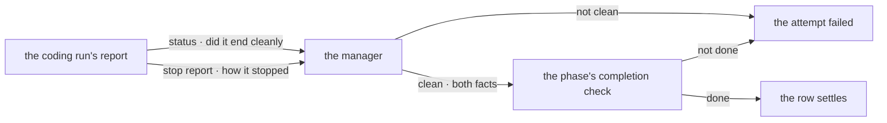

# FIX-1438 · A run that stopped at its budget still closes its row as done

**Spec** · [Decisions](DECISIONS.md) · [Rules](BUSINESS-RULES.md) · [Plan](PLAN.md)

Feature · `harness-manager` + `conductor` + `devforce-lab` · small · 1 PR · under [FIX-1408](https://linear.app/fixpoint-labs/issue/FIX-1408) (W4 dispatch / session policy)

## Five people, before and after

| Someone who… | Today | After |
|---|---|---|
| **watches a board to see what got finished** | A row reads `completed` for a run that ran out of turns half-way and committed the half it managed. Nothing says so | The row comes back open with the reason on it, and the work carries on from where the run stopped |
| **writes a phase's completion check** | Gets one fact — is the job done on the branch. The run's own report that it ran out of road never reaches them | Gets both facts: the state of the branch, and the word the run used for how it stopped. The call stays theirs |
| **runs a coding agent on a tight turn or spend budget** | Budget stops are indistinguishable from clean finishes once a row settles, so the cost of a budget that is too small is invisible | A budget stop is visible on the row, every time it happens |
| **has a run that stopped at its budget but had genuinely finished** | The row closes, correctly, by luck | The row re-opens once. The next attempt resumes the same coding session, finds the work done, and closes it. One extra cheap run |
| **reads the harness-manager contract to build a phase** | The contract says a clean end plus a passing check is completion, and never says that "clean" includes a run that hit its limit | The contract says which two facts decide completion, and that ignoring the second one closes rows on partial work |

A supervised run reports two things when it ends: whether it ended cleanly, and *how* it stopped. Only the first is read.

**Two different things are called "outcome" today, and this spec keeps them apart.** The **stop report** is the framework's three-way word for how a run ended — `finished`, `stopped-at-limit`, `failed` — and it lives on the run's handle. The **row outcome** is the manager's own bookkeeping on the run record, an unrelated three values (`running`, `succeeded`, `failed`). This spec is about the stop report. The row outcome does not change and is never what a phase reads.

The stop report is not recorded anywhere and is read by exactly one thing: the text of the failure message written when an attempt fails. On a run that ends cleanly it reaches no decision at all.

## What changes


Follow the second line out of each box. Today it dead-ends: `stopped-at-limit` reaches no decision, so the phase's check answers from the branch alone and a half-finished commit closes the row. After, the same word reaches the check, and the phase — still the only thing that decides — has what it needs to say *not done*.

**A phase's completion check, as its author writes it:**

```diff
  isDone: async (run) => {
+   // The run itself says it ran out of road. A commit is not the job.
+   if (run.stopReport === "stopped-at-limit") return false
    return await aCommitExistsTheBaseRefLacks(run)
  },
```

Nothing else about a phase changes. A check that ignores the new fact behaves exactly as it does today, byte for byte, which is [D1](DECISIONS.md#d1)'s cost and is named there.

## How the two facts reach the decision



The manager still reads `status` alone to decide whether the attempt failed, and still asks the phase whether the job is done. The only new edge is the second one into the check. The manager compares nothing on the stop report.

## What stays as it is

- **The done-condition is the sole authority on completion.** The manager gains no rule of its own, and the run record never becomes a judge.
- **The run record's own `outcome` field.** It keeps its three bookkeeping values and gains nothing; the stop report is not written to it.
- **The board's vocabulary.** No new `TaskStatus`, no second hold status, no word for "partial". A refused budget stop takes the path a run that produced nothing already takes.
- **A run that asks a question still parks first.** The ask arm is decided before the completion check, exactly as today.
- **The prompt builder's context.** The stop report is not on it; a prompt still learns about the last attempt through `feedback`.

## Sign off

1. **[D1](DECISIONS.md#d1) · The phase's completion check receives the run's stop report; the manager still decides nothing on it.** If wrong: every phase carries one more call the framework cannot enforce, so a phase that forgets closes rows on partial work exactly as today, silently.
2. **[D3](DECISIONS.md#d3) · Both shipped phases refuse a budget stop — including the one whose check is "a pull request exists".** If wrong: a run that opened a reviewable pull request and then hit its limit costs one extra run before it closes.
3. **[D2](DECISIONS.md#d2) · A refused budget stop re-opens the row with its reason attached, and errors once the retry budget is spent.** If wrong: a run that keeps stopping at its budget burns its whole retry budget before anyone is asked about it.

**Open: none.** Number 1 is the one to weigh: it is the choice to hand the fact down rather than rule on it centrally. The reasoning, what was rejected, and what each locks in is in [DECISIONS.md](DECISIONS.md). The cases the code must satisfy are in [BUSINESS-RULES.md](BUSINESS-RULES.md).
