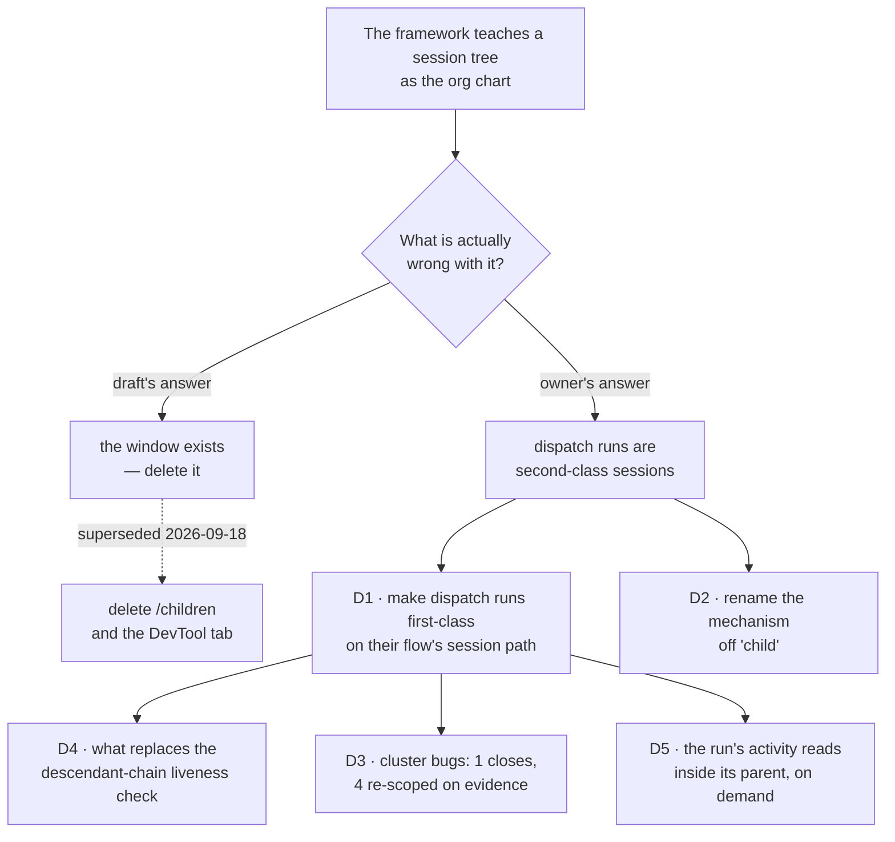

# FIX-1440 · Decisions

The dashed path is this spec's own first draft, superseded by the owner on 2026-09-18. Both the
draft and the amendment agree on the target — the framework should stop teaching a session tree as
the org chart. They disagree on what causes it. The draft said the browsable window causes it. The
owner's answer is that **second-class sessions** cause it: work that can only be reached by
descending from a parent reads as subordinate, whatever the window looks like. Take the window
away and the sessions are still second-class, just harder to find.

---

## D1 — Make dispatch-run sessions first-class on their flow {#d1}

**Status: SETTLED.** Direction from the owner amendment of 2026-09-18
([PR #1888](https://github.com/fixpoint-labs/flow-state-dev/pull/1888#issuecomment-5724121456));
the sub-question below was answered by the owner on 2026-09-18
([PR #1888](https://github.com/fixpoint-labs/flow-state-dev/pull/1888#issuecomment-5732752729)).

**Instead of** deleting the browsable Children surface, give a dispatch-run session the same
standing on its flow as any other session: listable and openable on the flow's ordinary session
path, without descending from a parent. `/children` stays, re-framed as a **provenance index**
("who dispatched this") rather than the only door to the work.

**Because** the teaching the issue objects to is *second-class sessions*, not the route that
exposes them. The evidence is narrower than either the issue or this spec's first draft assumed:

- **Discoverability is the whole gap.** `handleListSessions` never passes a `parentage` option
  (`session-routes.ts:58–73`), and `SessionListOptions.parentage` **narrows to `"top-level"` when
  omitted** (`stores/types.ts:291–304`). There is no query parameter to opt in. A dispatch run is
  therefore unreachable on `GET /sessions` at any setting.
- **Everything else already works.** `handleGetSession` loads by id and does not refuse a parented
  record (`session-routes.ts:100–121`). Grepping the route layer for `parentSessionId`,
  `parentage` and `isDescendant` returns hits in `child-session-routes.ts` alone — so stream,
  state, resource and abort routes already serve a dispatch-run session by id. It is **openable
  today and only undiscoverable.**
- **The narrowing is deliberate, not an oversight.** Its own doc comment says it exists so callers
  "silently start showing internal machinery beside the user's own sessions" cannot happen. That
  is a real concern and it is what the open fork below is about — it is not a reason to leave the
  sessions unreachable.

So the change is **additive**: a door, not a demolition. That is a smaller diff than the draft's
removal, it keeps the provenance edge the issue explicitly asked to preserve, and it fixes the
thing the issue complained about rather than the thing that made it visible.

**Locks in** that a dispatched row keeps its own session (unchanged from the draft and from the
amendment's point 3), that the session is addressable on its flow's normal path, and that
`/children` survives as provenance.

**What lost:** the draft's deletion, and with it the simplicity of a change that only subtracts.
This direction adds surface, which tenet 3 makes us justify rather than assume: the justification
is that the surface being added is the one that makes an existing surface honest, and the DevTool
Children *tree* — the recursive descent that most strongly taught the nest — still goes.

**The sub-question, answered.** It was: do dispatch runs appear in the **default** session listing,
or behind an opt-in? The owner's answer describes the *view*, not the wire:

> Every session is now top level in the sense that you could go to that flow and see all sessions.
> However those sessions can still be spawned/parented by another, in which we would show a label
> indicating that in the session list, and when viewing the child session you can link to see the
> parent session that spawned it. […] Ideally they show up under the current sessions, slightly
> indented (to show that they are parented by another session in the list).

So the listing shows three things a flat list cannot: a **label** saying this session was spawned
(or re-used) by a dispatcher, **indentation** under the session that spawned it, and a **link from
the run back to its parent**. That is the shape; see the wireframe in `SPEC.md`.

**The reading taken, and it is a reading.** "Top level in the sense that you *could* go to that
flow and see all sessions" is a statement about reachability, so the **API keeps the opt-in** and
**the DevTool opts in by default** and renders the hierarchy above. That delivers every element
the owner described, and a third-party consumer of `GET /sessions` still sees exactly what it sees
today — the FIX-1009 protection survives where it was aimed, at callers who never asked for
machine sessions. Making the *wire* default-on instead is a one-line change to S1 and a `minor`
with a behaviour-change note; **say so if that was the intent.** Everything else in this spec is
unaffected either way.

**Indentation is a view, not a tree.** It is worth being explicit, because the thing this issue
objects to is a nest: the list stays one flat, ordinary session list that happens to indent a row
under its parent when both are on screen. There is no recursion, no drill-down, and no level
beyond one — a run spawned by a run indents once, beside its own parent, not twice. The DevTool
renders the hierarchy; it does not navigate one.

## D2 — Rename the mechanism off "child" {#d2}

**Instead of** leaving the internal vocabulary alone once the public surface is gone, rename the
derived session to a **dispatch run** in code, comments and internal architecture docs —
`detached-child.ts` → `dispatch-run.ts`, `deriveDispatchChildSessionId` → `deriveDispatchRunSessionId`,
and the prose in `docs/architecture/dispatched-work.md` and `state-and-scopes.md`.

**Because** the issue's actual complaint is that the framework *teaches* a session tree as the org
chart, and the word is most of the teaching. Tenet 3 says a change that supersedes a path deletes
it in the same change; leaving "child" in the one place the mechanism survives is how the next
author reads it as a nest and grows a feature on it. `parentSessionId` on the record keeps its
name — it is the provenance edge the issue explicitly preserves.

**Locks in** one name for one thing. A reader who greps "child session" after this lands finds the
removed surface in the changelog and nothing live.

**What lost:** `dsx_` session-id prefix bytes are **not** changed. Renaming the prefix would change
every derived id, so an in-flight retry across the upgrade would mint a second session beside the
one it started. The prefix stays; only the vocabulary moves.

---

## D5 — A dispatch run's activity reads inside its parent, on demand {#d5}

**Status: SETTLED** by the owner on 2026-09-18
([PR #1888](https://github.com/fixpoint-labs/flow-state-dev/pull/1888#issuecomment-5732752729)).

**Instead of** making a reader open the run's own session to see what it did, let the parent's
block tree show the dispatched run's activity **in place** — clearly marked as a separate session
the dispatcher spawned or re-used, and **not loaded by default**. The reader chooses to pull it in.

**Because** first-class addressability solves *finding* the work and creates a second problem:
following one conversation now means bouncing between two session views. The owner's words are
"so that you don't have to bounce around." Inlining the activity answers the reading question
without re-creating the thing this issue objects to, and the two are genuinely different: a
**Children tab is a place you navigate to**, where a session's identity is its position in a tree;
inline activity is **one session's work shown where it was triggered**, with the separateness
stated rather than hidden.

**Default-off is load-bearing, not a preference.** A dispatcher that drains fifty rows would
otherwise pour fifty sessions' items into one block tree and make the parent unreadable — the
exact failure the flat session list was protecting against, moved one surface over. Off by
default, the cost is paid only by the reader who asked for it, one run at a time.

**"Spawned (or re-used)" is a real distinction and the label must carry it.** A `dispatcher({ key })`
call derives its session id, so a retry re-enters the session it started rather than minting a
second one (D2, and the adoption cases in the derivation suite). A reader looking at a run that
started before this turn needs to know they are seeing an existing session being re-entered, not
new work. The derivation already knows which happened; the label surfaces it.

**Locks in** that the block tree gains a node kind for a dispatched run, that it is collapsed
until asked for, and that expanding it never navigates away from the parent.

**What lost:** the simplicity of "a dispatch run is just another session, look at it there."
This is real added surface, and tenet 3 makes it justify itself: the justification is that the
alternative it replaces — bouncing between two sessions to read one causal chain — is the reason
people reached for a nest in the first place. Also lost: any claim that this change only subtracts
from the DevTool. It removes a recursive tree and adds an inline view, and the second is not free.

---

## D4 — What replaces the descendant-chain liveness check {#d4}

**Status: OPEN.** Raised by the amendment's "kill shadow-only / nest-only authorization"; it is
the one place that phrase lands on real code.

**Instead of** authorising a liveness read by walking the caller's descendant chain, authorise it
the way the rest of the route layer already does — same principal, same tenant, same flow
instance.

**Because** `livenessOf` is the only production consumer of `isDescendantSession`
(`create-request-host.ts:643`, consumed at `liveness-read.ts:131`), and that walk is precisely
"you may only see this work if it hangs beneath you." While it stands, a dispatch run is
first-class in the listing and still second-class in what a caller may ask about it.

**The cost is real and must not be waved through.** The walk re-checks principal, tenant **and**
flow ownership at every hop (`create-request-host.ts:656–670`), so it is doing defence-in-depth,
not only shape enforcement. `liveness-read.ts:122–128` says so directly: the flow-ownership check
"is what stands between 'a request I started' and 'any request the same principal happens to be
running under this session id'." Dropping the walk widens a liveness answer from *my subtree* to
*anything of mine on this flow*. For one user reading their own work that is defensible; it is
still a widening and it should be decided deliberately rather than inherited from D1.

**Options.** (a) Replace the walk with principal + tenant + flow. (b) Keep the walk and add an
explicit "same flow, same principal" arm beside it, so a first-class dispatch run is reachable
without making every sibling request readable. (c) Leave it, and accept that first-class means
listable but not liveness-readable.

**Recommendation: (b).** It satisfies the amendment — no session is reachable *only* by descent —
without trading a security boundary for a navigation fix. (a) is simpler and I would take it if
the flow-ownership check alone is judged sufficient, which is the owner's call to confirm rather
than mine to assume.

---

## D3 — Cluster disposition, re-triaged on the merits {#d3}

**Status: re-triaged 2026-09-18** after the amendment withdrew the reason the original dispositions
rested on. Each issue was read against current code rather than against this spec's direction.

**The draft cancelled two issues and both reasons were wrong.** That is the finding, and it is
about this spec, not about the issues. Reading them properly changes one verdict and rescues the
other for a different reason.

| Issue | Disposition | Why, against current code |
|---|---|---|
| [FIX-1045](https://linear.app/fixpoint-labs/issue/FIX-1045) | **Close — already fixed** | Describes `deriveChildSessionId` hashing `[tenant, user, parentSession, topic, key]` with no flow discriminator, so two flows sharing a parent session collide. That function no longer exists. The live derivation is `deriveDispatchChildSessionId`, and its call site passes `crossFlow ? targetFlow.id : undefined` (`create-request-host.ts:260–272`) — the discriminator is present on exactly the colliding path. The issue also rests on `startDetached`, which is gone. **The draft's stated reason — "the collision is in the removed listing's addressing" — was wrong**; the addressing was never the listing's |
| [FIX-1097](https://linear.app/fixpoint-labs/issue/FIX-1097) | **Re-scope** *(was: cancel)* | The draft said "no interrupt verb exists on `RequestHost`; the issue describes a surface that was never built." **That is a misread of the issue.** It is not about a `RequestHost` verb at all — it is about `dispose()`'s drain cancelling through the abort-controller registry while a child is still in pre-execution setup and not yet registered. That path is live (`createFlowState.ts:554`, `#cancelOutstandingChildren`) and untouched by any direction this spec has taken. Carry the issue's own caveat with it: the defect is **reasoned from code, not demonstrated**, and its first task is a test that genuinely fails |
| [FIX-1121](https://linear.app/fixpoint-labs/issue/FIX-1121) | **Re-scope** | Shutdown writes a terminal status for a queued run that never started, and `aborted` is in `PRUNABLE_TERMINAL_STATUSES` (`durability-sweeper.ts:104`), so it is pruned as non-resumable. Decided in round 2 on the behaviour outliving the change, so the amendment does not disturb it |
| [FIX-1086](https://linear.app/fixpoint-labs/issue/FIX-1086) | **Re-scope** | A dead run's row looks stalled for one lease period. Lease recovery on the board; survives untouched |
| [FIX-1171](https://linear.app/fixpoint-labs/issue/FIX-1171) | **Re-scope** | "Background work has no way back" — labelled Feature, and it is one. A real gap this change neither causes nor fixes |

**Not in this cluster and not touched:** `FIX-1090`, `FIX-1108`, `FIX-1075`. Named by the reviewer
so they are not swept in by proximity. Nothing in this spec gives a reason to close any of them.

**Because** a disposition inherited from a direction is not a disposition. Both of the draft's
cancellations were decided by asking "does this describe the surface we are deleting?" rather than
"is this defect real in the code we will ship." When the direction moved, one answer survived by
luck and the other was simply wrong.

**Locks in** that only `FIX-1045` closes, and on evidence rather than on scope. Four issues stay
open and get re-pointed at the dispatch lifecycle.

**What lost:** the tidiness of the issue's original acceptance sketch, which expected the cluster to
close with the substrate. Four of five stay open, because four of five describe live behaviour.

## Decided, not asked

- **Branch name is `spec/FIX-1440`, not the session's assigned `claude/fix-1440-za4psq`.** CI keys its spec-folder exemption on the branch prefix (`.github/workflows/ci.yml:110`), so a spec PR on any other branch is red by construction.
- **`lineageId` stays.** It is minted at root-session creation and used independently by `sharedToLineage`. Only its *inheritance at child spawn* is nesting-coupled, and that inheritance is what makes a dispatched run share its caller's resource bucket — which the board relies on.
- **No changeset yet** (BP-022): this is a spec PR, docs-only, never merged. The implementation PR carries one, `minor`, because published packages lose public exports.

## Considered and dropped

- **Deprecate rather than delete** — keep the route and mark it deprecated. Dropped: tenet 3 says old and new side by side is how incoherence starts, and a deprecated endpoint still teaches the tree to anyone reading the docs. Pre-1.0, deletion is cheap.
- **Keep the DevTool Children tab, remove only the public API.** Dropped: the DevTool is where the nest is most visibly taught as navigable UI, with a recursive breadcrumb. It is the strongest single piece of the teaching, not the weakest.
- **Remove `parentSessionId` from the record and re-key the derivation on something else.** Dropped: it is in the id hash material precisely so one principal's two sessions cannot derive each other's run. Removing it makes a collision expressible that is currently inexpressible.

## Open

**D4 only** — what replaces the descendant-chain liveness check. D1 is settled in direction and in
its default, D5 is settled, and D2 and D3 were never forks for the product owner. D4 is the one
question left, and it is the one with a security cost rather than a navigation cost, which is why
it is not being inherited from D1.

## Settled

- **"A dispatched row runs in a session of its own"** — CONFIRMED by running `goals/task-board/hands-a-row-to-a-worker-in-its-own-session` on the real path, 2026-09-18. Two rows settled in `dsx_` sessions distinct from the drain's. Resolved; do not reopen.
- **"The parentage chain authorises settle, interrupt and liveness"** — REFUTED. The claim is in `packages/engine/src/context/detached-child.ts`'s file header, and it is stale prose. In shipped code only `livenessOf` walks the chain (`create-request-host.ts:583`, consumed at `liveness-read.ts:131`). `settleParentTask` is deliberately unwired — `createFlowState.ts:892` says so in as many words — and there is no interrupt verb on `RequestHost`. This doc/code mismatch is itself a tenet-1 finding and is fixed as part of D2's rename pass.

- **"FIX-1121 describes only the deleted docs"** — REFUTED in round 2, against my own draft. The shutdown-abort path and the durability sweeper's prunable-terminal set are both outside this change's surfaces, so the defect outlives the removal. D3 re-scopes it rather than cancelling it, which is what D3's own stated principle required all along. This finding survives the change of direction, because it turned on behaviour outliving the change rather than on the surface being deleted.

## How it got here

- **Draft** — Framed as a scope split rather than the removal the issue asks for, because running the replacement's own acceptance check showed the replacement is built on the substrate. The build is: delete the read surface and its docs, rename the surviving mechanism, dispose of the bug cluster by inspection.
- **Round 1** — Four factual corrections to the spec's own documents; no change of approach. Recorded in `PLAN.md` → Notes from review.
- **Round 2** — D1 signed (Path A). Two findings folded against real code: `FIX-1121` moved from cancel to re-scope, and `SPEC.md`'s kitchen-sink promise corrected to what S8 actually delivers.
- **Round 3 — owner amendment, 2026-09-18.** D1 superseded before implementation began. The target is unchanged (stop teaching a session tree as the org chart); the cause was re-identified as second-class sessions rather than the window onto them, so the change turned from a removal into an addition. Checking the amendment's premise showed the gap is one missing opt-in on `GET /sessions`, with every other route already serving these sessions by id — so the new direction is a smaller diff than the removal it replaced. D3 went back to pending, and D4 was opened for the authorization half.
- **Round 4 — owner, 2026-09-18.** The DevTool shape specified: dispatch runs indented under the session that spawned them, labelled as spawned or re-used, and linking back to their parent; plus a new ask — the run's activity readable **inside the parent's block tree**, loaded on demand rather than by default. D1's open sub-question closed with it. That second ask is new scope and became D5. Wireframes added to `SPEC.md` on request. D4 remains the only open question.
