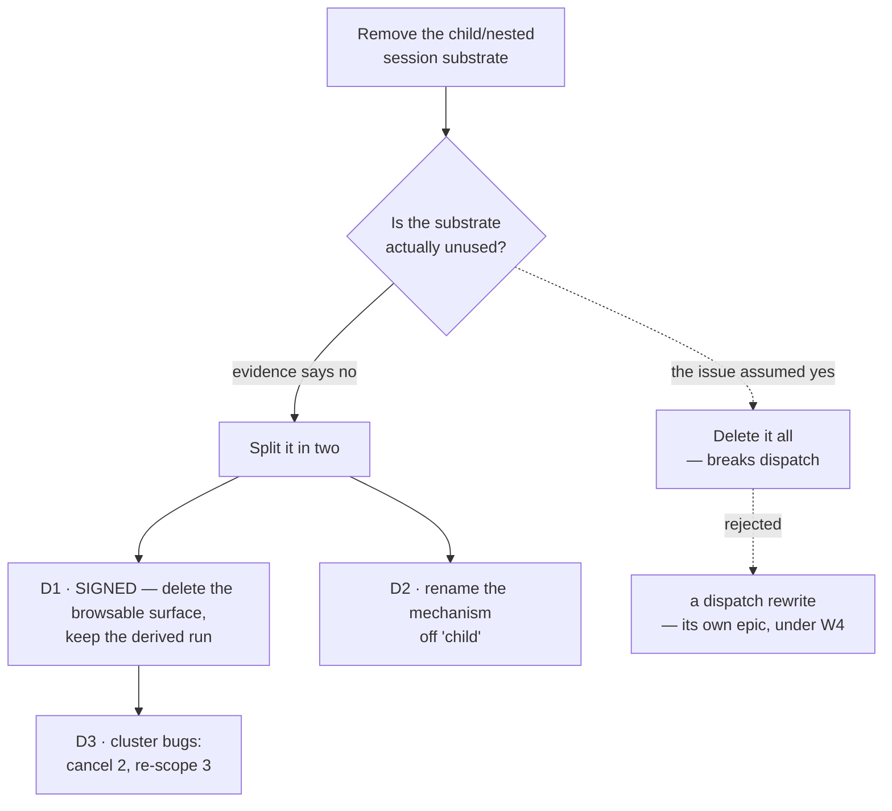

# FIX-1440 · Decisions

The dashed path is the issue as written. The evidence below is why the spec takes the solid one.

---

## D1 — Delete the browsable surface; keep the derived session a dispatched row runs in {#d1}

**Status: CLOSED — Path A, signed off by the product owner on 2026-09-18** ([PR #1888 comment](https://github.com/fixpoint-labs/flow-state-dev/pull/1888#issuecomment-5723901352)). Delete the browsable Children surface and the nest teaching; keep the derived session a dispatched row runs in; rename it off "child" per D2; do **not** rewrite dispatch to same-session inline runs. The evidence below is kept because it is why the fork existed.

**Instead of** removing the L1 child/nested/detached session substrate as the issue specifies — id
minting, spawn paths, parentage predicates — the spec removes only the read surface that presents
a session tree to a user, and leaves the derived session that a dispatched row runs in.

**Because** the premise the issue rests on is false, and the check that proves it is already in the
repo and green:

- A `dispatcher({ key })` call **creates** a session record with `parentSessionId` set to the caller (`packages/engine/src/context/create-request-host.ts:335`, written at `:359`). There is no other delivery target on the `task` path: `TaskSessionPolicy` is a closed union of `"per-task"`, `"per-worker"` and `{ key }`, and all three arms produce a key (`packages/core/src/types/dispatch.ts:82`, `taskSessionKeyFor` at `:207`).
- `goals/task-board/hands-a-row-to-a-worker-in-its-own-session` asserts each row runs in *its own child session, distinct from the drain's*, and that the parent has one child per row. Its anti-game section fails a board that runs rows inline. **Run on the real path 2026-09-18: PASS**, two rows in `dsx_` sessions.

So "the substrate is a leftover nobody uses" is not what the code does. Removing it as written is a rewrite of how dispatch runs and authorises work, not a leftover deletion.

**Locks in** that a dispatched row keeps its own session. It does **not** lock in the word "child"
(see D2), and it does not lock in the browsable tree, which goes.

**What lost:** the literal reading of the issue — rejected at sign-off, recorded here as history. If background work must stop getting a session of its own, that is a dispatch rewrite and belongs under W4 ([FIX-1408](https://linear.app/fixpoint-labs/issue/FIX-1408)) as its own issue, not here.

---

## D2 — Rename the mechanism off "child" {#d2}

**Instead of** leaving the internal vocabulary alone once the public surface is gone, rename the
derived session to a **dispatch run** in code, comments and internal architecture docs —
`detached-child.ts` → `dispatch-run.ts`, `deriveDispatchChildSessionId` → `deriveDispatchRunSessionId`,
and the prose in `docs/architecture/dispatched-work.md` and `state-and-scopes.md`.

**Because** the issue's actual complaint is that the framework *teaches* a session tree as the org
chart, and the word is most of the teaching. Tenet 3 says a change that supersedes a path deletes
it in the same change; leaving "child" in the one place the mechanism survives is how the next
author reads it as a nest and grows a feature on it. `parentSessionId` on the record keeps its
name — it is the provenance edge the issue explicitly preserves.

**Locks in** one name for one thing. A reader who greps "child session" after this lands finds the
removed surface in the changelog and nothing live.

**What lost:** `dsx_` session-id prefix bytes are **not** changed. Renaming the prefix would change
every derived id, so an in-flight retry across the upgrade would mint a second session beside the
one it started. The prefix stays; only the vocabulary moves.

---

## D3 — Cancel two cluster bugs, re-scope three {#d3}

**Instead of** cancelling all five as "gone with substrate", cancel only the two that describe the
removed surface and re-scope the three that describe dispatch behaviour surviving it.

| Issue | Disposition | Why |
|---|---|---|
| [FIX-1045](https://linear.app/fixpoint-labs/issue/FIX-1045) | Cancel | Child ids omitting flow kind — the cross-flow derivation already takes `targetFlowId`; the collision it describes is in the removed listing's addressing |
| [FIX-1097](https://linear.app/fixpoint-labs/issue/FIX-1097) | Cancel | Cancellation reaching a pre-execution child — no interrupt verb exists on `RequestHost`; the issue describes a surface that was never built |
| [FIX-1121](https://linear.app/fixpoint-labs/issue/FIX-1121) | **Re-scope** | Shutdown writing a terminal status for a queued child. Cancelled in the draft on the *framing* ("contradicting shipped docs" — those docs go), which was the wrong test. The behaviour survives: `createFlowState`'s drain cancels outstanding dispatched children via `abortRequest` (`createFlowState.ts:554`), and `aborted` is in `PRUNABLE_TERMINAL_STATUSES` (`durability-sweeper.ts:104`), so a run that never started is pruned as non-resumable. Neither file is touched by S1–S12. Re-scoped to the dispatch lifecycle |
| [FIX-1086](https://linear.app/fixpoint-labs/issue/FIX-1086) | **Re-scope** | A dead run's row looks stalled for one lease period. That is lease recovery on the board, and it survives the removal untouched |
| [FIX-1171](https://linear.app/fixpoint-labs/issue/FIX-1171) | **Re-scope** | "Background work has no way back" — labelled Feature, and it is one: a dispatched run settling a row without replying to its conversation is a real gap that this removal neither causes nor fixes |

**Because** cancelling a bug that was really about dispatch loses a defect report, and the issue's own guidance says to review before cancelling rather than sweep the cluster.

**Locks in** that `FIX-1086`, `FIX-1171` and `FIX-1121` stay open and get re-pointed at the board and the dispatch lifecycle, not the tree.

**What lost:** three issues stay on the backlog that the issue's acceptance sketch would have closed.

---

## Decided, not asked

- **Branch name is `spec/FIX-1440`, not the session's assigned `claude/fix-1440-za4psq`.** CI keys its spec-folder exemption on the branch prefix (`.github/workflows/ci.yml:110`), so a spec PR on any other branch is red by construction.
- **`lineageId` stays.** It is minted at root-session creation and used independently by `sharedToLineage`. Only its *inheritance at child spawn* is nesting-coupled, and that inheritance is what makes a dispatched run share its caller's resource bucket — which the board relies on.
- **No changeset yet** (BP-022): this is a spec PR, docs-only, never merged. The implementation PR carries one, `minor`, because published packages lose public exports.

## Considered and dropped

- **Deprecate rather than delete** — keep the route and mark it deprecated. Dropped: tenet 3 says old and new side by side is how incoherence starts, and a deprecated endpoint still teaches the tree to anyone reading the docs. Pre-1.0, deletion is cheap.
- **Keep the DevTool Children tab, remove only the public API.** Dropped: the DevTool is where the nest is most visibly taught as navigable UI, with a recursive breadcrumb. It is the strongest single piece of the teaching, not the weakest.
- **Remove `parentSessionId` from the record and re-key the derivation on something else.** Dropped: it is in the id hash material precisely so one principal's two sessions cannot derive each other's run. Removing it makes a collision expressible that is currently inexpressible.

## Open

None. D1 was the only fork for the product owner and it is signed (above).

## Settled

- **"A dispatched row runs in a session of its own"** — CONFIRMED by running `goals/task-board/hands-a-row-to-a-worker-in-its-own-session` on the real path, 2026-09-18. Two rows settled in `dsx_` sessions distinct from the drain's. Resolved; do not reopen.
- **"The parentage chain authorises settle, interrupt and liveness"** — REFUTED. The claim is in `packages/engine/src/context/detached-child.ts`'s file header, and it is stale prose. In shipped code only `livenessOf` walks the chain (`create-request-host.ts:583`, consumed at `liveness-read.ts:131`). `settleParentTask` is deliberately unwired — `createFlowState.ts:892` says so in as many words — and there is no interrupt verb on `RequestHost`. This doc/code mismatch is itself a tenet-1 finding and is fixed as part of D2's rename pass.

- **"FIX-1121 describes only the deleted docs"** — REFUTED in round 2, against my own draft. The shutdown-abort path and the durability sweeper's prunable-terminal set are both outside this change's surfaces, so the defect outlives the removal. D3 re-scopes it rather than cancelling it, which is what D3's own stated principle required all along.

## How it got here

- **Draft** — Framed as a scope split rather than the removal the issue asks for, because running the replacement's own acceptance check showed the replacement is built on the substrate. The build is: delete the read surface and its docs, rename the surviving mechanism, dispose of the bug cluster by inspection.
- **Round 1** — Four factual corrections to the spec's own documents; no change of approach. Recorded in `PLAN.md` → Notes from review.
- **Round 2** — D1 signed (Path A). Two findings folded against real code: `FIX-1121` moved from cancel to re-scope, and `SPEC.md`'s kitchen-sink promise corrected to what S8 actually delivers.
