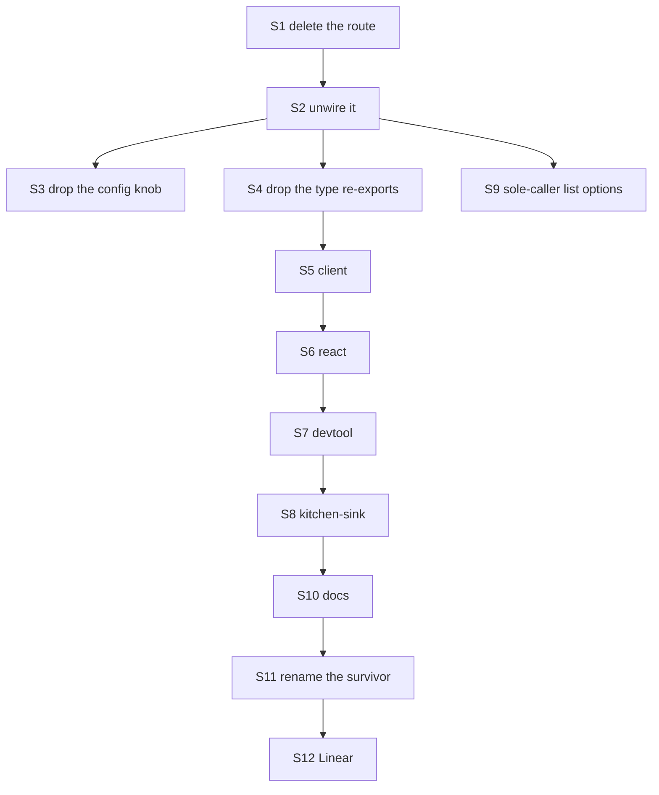

# FIX-1440 · Plan

Directional. Shape and sequence, not the finished design.

## Surfaces

Removals first (tenet 3). The corpus behind these counts is re-derived by
`evidence/classify-substrate.mjs`; 51 files are in the removal scope, 112 are dispatch internals
that stay.

| ID | Surface | Action |
|---|---|---|
| **S1** | `packages/engine/src/routes/child-session-routes.ts` (432 lines, entirely this surface) | Delete |
| **S2** | Route wiring: `router.ts` `list_session_children` entry, `parseFlowRoute.ts` union member, `route-auth.ts` case, `http-handlers.ts` import + dispatch arm | Delete the arm in each |
| **S3** | `runtime-config.ts` — `maxChildSessionListLimit`, `DEFAULT_MAX_CHILD_SESSION_LIST_LIMIT`, `assertMaxChildSessionListLimit`; and the option on `CreateFlowApiRouterOptions` + its thread through `createFlowState.ts` | Delete |
| **S4** | `routes/index.ts` re-exports of `ChildSessionStatus`, `ChildSessionSummary` | Delete |
| **S5** | `packages/client`: `listChildSessions`, `ListChildSessionsOptions`, `ChildSessionSummary`, `ChildSessionStatus`, index re-exports | Delete |
| **S6** | `packages/react`: `SessionChildSessionsOptions`, the `childSessions` option, `.childSessions` / `.childSessionsStale` on `UseSessionResult`, `refreshChildSessions` and its three read-fence refs | Delete; leave the rest of `useSession` untouched |
| **S7** | `packages/devtool`: `child-sessions-view.tsx`, `use-child-sessions.ts`, `child-session-links.ts`, the panel's Children tab and `handleOpenChildSession` | Delete. **The Tasks tab goes board-only in the same change**: `task-collections-view.tsx` carries a `ChildSession` column built on `ChildSessionSummary`, `linkChildSessionsToTasks` and `onOpenChildSession`, and that column goes with the tab. Dropping it retires almost all of `child-session-links.ts`; this is a cut, not a partial extract |
| **S8** | `apps/kitchen-sink`: `background-work-panel.tsx`, `e2e/background-work.spec.ts`, the mounts in `app/page.tsx`, the section in `CLAUDE.md` | Delete the panel; the dispatch half (`flows/chat-agent/.../background-work.ts`) stays |
| **S9** | Store listing options whose **only** caller is S1 — `SessionListOptions.orderBy: "createdAt"`, session `orgId`, `RequestListOptions.orderBy: "none"`, the status-array form, request `orgId` | Delete **only after** re-deriving that S1 was the sole caller; `parentage` itself stays (D1) |
| **S10** | Docs — see the docs plan below | Edit / delete sections |
| **S11** | Rename (D2): `context/detached-child.ts` → `dispatch-run.ts`, `deriveDispatchChildSessionId` → `deriveDispatchRunSessionId`, `evaluateAdoption`'s `child` vocabulary, and the stale header claim about settle/interrupt | Rename; **no change to `dsx_` or hash material** |
| **S12** | Linear: cluster disposition per D3 | Cancel 3, re-scope 2 |

## Build order

S3, S4 and S9 are independent of each other once S2 lands. S11 is deliberately last: renaming
before the deletions would make every deleted file's diff noisier than it needs to be.

**S11 can ship as its own PR** if the reviewer wants the deletion landed first. S1–S10 and S12
satisfy D1 on their own; the rename is D2 and depends on nothing in them. Splitting costs a second
review round and buys a smaller first diff — the implementer's call at the time.

## Checks

| Check | Proves | Where |
|---|---|---|
| `pnpm tsx goals/task-board/hands-a-row-to-a-worker-in-its-own-session/run.mts` | D1 — the dispatch path is genuinely untouched. **Model-free, so it runs anywhere.** Must pass **unedited**; editing it to accommodate the change would void it | goal |
| `node spec/FIX-1440/evidence/classify-substrate.mjs` | Removal scope reaches 0, and nothing new crept in | evidence |
| `pnpm typecheck` | Every deleted export's call sites are gone | CI |
| `pnpm test` | The surviving suites still hold, notably `detached-child.test.ts` (renamed) determinism cases | CI |
| `pnpm --filter docs build` with `onBrokenLinks: throw` | No dangling anchor from a deleted section | CI |
| The renamed derivation suite's determinism cases | S11 changed names, not bytes | unit |

**Before deleting S9, re-derive the sole-caller claim** — grep every `session.list` / `request.list`
call site again rather than trusting this plan's table. It was true at spec time; a landed PR could
have added a second caller.

## Docs

| File | Action |
|---|---|
| `apps/docs/docs/server/background-work.md` | Delete lines ~195–425 (`Listing a session's children` through `What this endpoint won't do`). Keep `Starting a job from a flow` and `Starting a job on another flow`. **`#what-status-tells-you` is linked twice from `orchestration/task-board.md:411,421`** — repoint both |
| `apps/docs/docs/client/overview.md` | Delete `### Child sessions` (~136–198). **Linked from `api/client.md:104` and `background-work.md:431`** — repoint |
| `apps/docs/docs/api/client.md` | Delete the `sessions.listChildSessions` entry (~68–104) |
| `apps/docs/docs/client/react.md` | Delete the child-session list section (~105–152) |
| `apps/docs/docs/api/react.md` | Delete `childSessions` / `childSessionsStale` from `SessionView` |
| `apps/docs/docs/devtool/overview.md` | Delete `## Child sessions` (~107–121) |
| `apps/docs/docs/server/setup.md` | Remove the route-table row (line ~233) |
| `apps/docs/docs/server/authentication.md` | Remove the `/children` access note (~318–321) |
| `apps/docs/docs/configuration/runtime.md` | Remove the `maxChildSessionListLimit` row (~58) |
| `apps/docs/guides/background-work.md` | Remove the `Watching any of it` children bullet and the "a child that dispatches work has children too" line; keep the dispatch sections |
| `packages/engine/README.md` | Delete `## Child sessions of a session` + the config row. **`packages/bullmq/README.md:266` links the live URL** — check it still resolves |
| `packages/client/README.md`, `packages/react/README.md` | Delete the child-session sections |
| `docs/architecture/server-and-client.md` | Delete the `Background work (child sessions)` contract and the `childSessions` SessionView rows |
| `docs/architecture/dispatched-work.md`, `state-and-scopes.md` | Keep — rename vocabulary per S11 |
| `docs/atlas/framework.html` | Stop naming child sessions as a substrate. Not in the Docusaurus build, but it is prose a reader sees |

No new page. This change only removes.

## Pinned names

- The renamed module is `dispatch-run.ts`; the exported derivation is `deriveDispatchRunSessionId`.
- The session-id prefix stays `dsx_`.
- Nothing is renamed to "workstream" (the issue's invent-kill, and [FIX-1308](https://linear.app/fixpoint-labs/issue/FIX-1308) retired that vocabulary).

## Guardrails

- **Don't edit the goal check to make it pass.** It is the only thing standing between this removal and a silent dispatch regression, and it discriminates on *where* work ran. If it goes red, the change is wrong, not the check.
- **Don't change `dsx_` or the hash material.** Derived ids are how a retry re-enters its own run; moving them strands in-flight work for a lease period. This is D2's explicit boundary.
- **Don't remove `parentSessionId` or the parentage filter.** They serve adoption and the liveness read, both of which survive. The issue asks for the provenance edge to be kept, and this is it.
- **Rebuild core before typechecking a dependent package.** `packages/*/tsconfig.json` resolves `@flow-state-dev/core` through its built `dist/*.d.ts`, so a stale `dist` reports a clean typecheck that CI will fail.
- **Delete, don't deprecate.** Pre-1.0, and tenet 3 — old and new side by side is how incoherence starts.

## At implement time

- `main` was broken at spec time; the fix was in PR #1880, unmerged. Branch from a green `main`.
- The implementation PR carries a changeset (`minor` — published packages lose public exports). The spec PR does not.
- Branch naming: this spec is on `spec/FIX-1440` because CI keys its spec-folder exemption on the branch prefix. The implementation branch follows the repo's ordinary `fix/FIX-1440-*` convention.

## Follow-ups

- **`ParentTaskBinding` is never constructed anywhere in the repo** — `createFlowState.ts:892` states this deliberately, so `parentTask()` always resolves `undefined` and `settleParentTask` always refuses `no-parent-task`. Two of `RequestHost`'s verbs are dead on the shipped path. Not in scope here; worth its own leftovers issue under FIX-1208.
- `packages/engine/src/context/dispatch-operation.ts` describes the substrate without using any of the corpus's literal terms, so the evidence checker does not see it. Noted in the checker's header. Its `DispatchedChild` type name is a rename candidate under S11.

## Notes from review

**Round 1 — `cursor[bot]`, 2026-09-18** (recorded verbatim; weigh against real code):

> `classify-substrate.mjs` is the right *idea*, heavy on maintenance. Totality + `--negative-control` match `issue-spec` Step 5 and are worth keeping. The ~110-line `DISPATCH` allowlist plus `DISPATCH_SUBTREES` blanket rules duplicate `PLAN.md` and can mis-bucket future viewing APIs under `packages/core/` etc. A lighter alternative (if you want less dual maintenance): **forbidden public symbols** (`listChildSessions`, `/children`, `ChildSessionSummary`, …) must grep empty in `packages/` + published docs, plus the goal check — drop the dispatch allowlist and rely on narrow terms + `other` for surprises. I would **not** delete totality entirely.

> Optional simplification path: if PO approves surface removal but wants to defer vocabulary churn, add an explicit **D2 optional / phase B** branch here (S1–S10 first, S11 follow-up).
