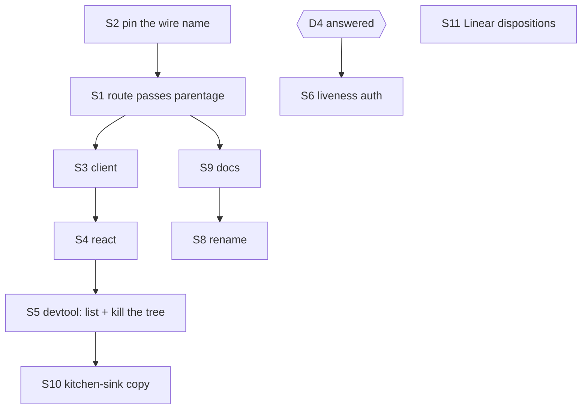

# FIX-1440 · Plan

Directional. Shape and sequence, not the finished design.

> **Rewritten 2026-09-18** for the owner amendment. The previous plan was a twelve-surface
> deletion; this one is an addition plus one removal of teaching. Nothing from the old surface
> list carries over unexamined.

## The shape of the change

One sentence: **`GET /sessions` learns to include dispatch runs, the DevTool stops being a tree to
descend, and `/children` is re-documented as provenance.** Everything else follows from those.

The gap is narrow and was measured, not assumed — see `DECISIONS.md → D1`. A dispatch-run session
is already openable by id on every route that matters; it is only undiscoverable. So most of the
work is presentation and docs, not plumbing.

## Surfaces

| ID | Surface | Action |
|---|---|---|
| **S1** | `handleListSessions` (`session-routes.ts:58–73`) — thread a named include through to `SessionListOptions.parentage`. The store option already exists (`"top-level" \| "all" \| { parentOf }`); the route simply never passes it | Add |
| **S2** | The wire name for that include. **Not** `parentage: "all"` verbatim — that is a storage concept. Pin a caller-facing name (`include=dispatch-runs`) and map it at the route | Add |
| **S3** | `packages/client` — `sessions.list` gains the option and its type | Add |
| **S4** | `packages/react` — expose it wherever the session list is read | Add |
| **S5** | `packages/devtool` — dispatch runs appear among the flow's sessions, each showing what dispatched it. **Delete** the recursive Children tab and its breadcrumb: that descent is the teaching the issue objects to | Add + delete |
| **S6** | Liveness authorization per **D4** — gated on that decision, which is open. Do not start until it is answered | Blocked |
| **S7** | `child-session-routes.ts` — keep. Re-document as a provenance index; rename its vocabulary under S8 | Keep + rename |
| **S8** | Rename (D2): `context/detached-child.ts` → `dispatch-run.ts`, `deriveDispatchChildSessionId` → `deriveDispatchRunSessionId`, `DispatchedChild`, and the stale header claim about settle/interrupt | Rename; **no change to `dsx_` or hash material** |
| **S9** | Docs — reframe children as provenance, document the new include, drop the nest-as-hierarchy framing | Edit |
| **S10** | `apps/kitchen-sink` — the Background Work panel now demonstrates something we keep. Reframe its copy away from "children"; do not delete it | Edit |
| **S11** | Linear per **D3**: close `FIX-1045` (already fixed), re-scope `FIX-1097`, `FIX-1121`, `FIX-1086`, `FIX-1171`. Do not touch `FIX-1090`, `FIX-1108`, `FIX-1075` | Ready |

## Build order

S6 hangs off an open decision and is the reason this spec is not yet implementable end to end. S1–S5 and S8–S10 are unblocked once the D1 sub-question is answered, because that answer only
changes the **default**, not the mechanism.

## Checks

| Check | Proves | Where |
|---|---|---|
| `pnpm tsx goals/task-board/hands-a-row-to-a-worker-in-its-own-session/run.mts` | The dispatch path is untouched. **Model-free, so it runs anywhere.** Must pass **unedited** | goal |
| A new listing test: dispatch a row, then list the flow's sessions with the include | The run is discoverable without descending — the whole point of D1 | unit |
| The same listing **without** the include | Today's result set is byte-identical, so no existing caller's view changes | unit |
| `packages/engine/test/context/detached-child.test.ts` determinism cases (renamed) | S8 changed names, not bytes | unit |
| `pnpm typecheck` / `pnpm test` | Nothing else moved | CI |
| `pnpm --filter docs build` with `onBrokenLinks: throw` | No dangling anchor from a reframed section | CI |

The second and third rows are the pair that matters: one proves the door opens, the other proves
it was not already open for everyone. A change that only adds the first has not shown it preserved
the FIX-1009 protection.

## Evidence

`evidence/classify-substrate.mjs` was built for the removal — its totality assertion requires the
"removal scope" bucket to reach zero files. **Under this direction that assertion is wrong**, since
almost nothing is being removed. It is repointed before this spec goes back for review: the useful
part is the corpus sweep and the negative control, and what it should now assert is that no live
code or published doc *teaches descent* — a much narrower forbidden set. Until then, treat its
current PASS as evidence about the old direction only.

## Guardrails

- **Don't edit the goal check to make it pass.** It discriminates on *where* work ran, and it is
  the fence between this change and a silent dispatch regression.
- **Don't change `dsx_` or the hash material.** Derived ids are how a retry re-enters its own run.
- **Don't widen the default listing silently.** The `parentage` narrowing exists for a documented
  reason (`stores/types.ts:291–304`). If the answer to D1's sub-question is default-on, that is a
  deliberate, announced behaviour change for every existing consumer, and it needs its own line in
  the changeset.
- **Don't drop the descendant walk without answering D4.** It re-checks principal, tenant and flow
  at every hop; removing it widens liveness, it does not merely relax a shape rule.
- **Rebuild core before typechecking a dependent package.** A stale `dist` reports a clean
  typecheck that CI will fail.

## At implement time

- `main` was broken at spec time; the fix was in PR #1880, unmerged. Branch from a green `main`.
- The implementation PR carries a changeset — `minor`, because published packages gain public API
  (and, if D1 resolves default-on, change existing behaviour).
- Branch naming: this spec is on `spec/FIX-1440` because CI keys its spec-folder exemption on the
  branch prefix. The implementation branch follows the repo's ordinary `fix/FIX-1440-*` convention.

## Follow-ups

- **`ParentTaskBinding` is never constructed anywhere in the repo** — `createFlowState.ts:892`
  states this deliberately, so `parentTask()` always resolves `undefined` and `settleParentTask`
  always refuses `no-parent-task`. Two of `RequestHost`'s verbs are dead on the shipped path. Not
  in scope here; worth its own leftovers issue under FIX-1208.
- If the kitchen-sink's `<TaskPlan />` renders empty for the background-work board, that is a
  pre-existing gap and earns its own issue. It is not this change's to fix, and it is no longer
  even adjacent now that the panel stays.

## Notes from review

**Round 3 — owner amendment, 2026-09-18.** Direction changed from removal to first-class
addressability before implementation began. Checking the premise showed the gap is one missing
opt-in on `GET /sessions`; every other route already serves these sessions by id. The rounds below
were argued against the superseded plan and are kept for history.

**Round 2 — `greptile-apps[bot]` + FSD Architect, 2026-09-18.** Both findings verified against real
code and folded: `FIX-1121` moved from cancel to re-scope (the shutdown-abort path and the
durability sweeper are outside this change, so the defect outlives it — still true under the new
direction), and `SPEC.md`'s kitchen-sink promise was corrected. The Architect's fence on the goal
check stands and is carried into the guardrails above.

**Round 1 — `cursor[bot]`, 2026-09-18** (recorded verbatim; weigh against real code):

> `classify-substrate.mjs` is the right *idea*, heavy on maintenance. Totality + `--negative-control`
> match `issue-spec` Step 5 and are worth keeping. The ~110-line `DISPATCH` allowlist plus
> `DISPATCH_SUBTREES` blanket rules duplicate `PLAN.md` and can mis-bucket future viewing APIs under
> `packages/core/` etc. A lighter alternative (if you want less dual maintenance): **forbidden public
> symbols** must grep empty in `packages/` + published docs, plus the goal check — drop the dispatch
> allowlist and rely on narrow terms + `other` for surprises. I would **not** delete totality entirely.

That note aged well: the forbidden-symbol shape is close to what the repointed checker needs now
that the allowlist's premise is gone.
