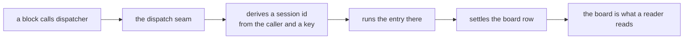

# FIX-1440 · Remove child/nested session substrate — dispatchers + linked seats replace it

Under [FIX-1208](https://linear.app/fixpoint-labs/issue/FIX-1208) (Remove superseded framework leftovers) · Size: M

| Someone who… | Today | After |
|---|---|---|
| reads our docs to learn how background work is organised | Finds a documented endpoint for listing a session's children, and a line saying children can nest — so they model work as a session tree | Finds one way to organise work: a board of rows, handed to workers. No session tree to model |
| opens the DevTool on a conversation | Sees a **Children** tab, clicks into a child, and gets another Children tab on that | Sees the conversation's own requests and its boards. Nothing invites them to descend |
| builds on the framework and wants background work | Can browse the tree and is quietly encouraged to treat it as the org chart | Reads rows off a board, which is the surface that actually carries assignment and status |
| runs the kitchen-sink reference app | Sees a Background Work panel that demonstrates enumerating children | Sees the same work demonstrated as board rows |
| already dispatches work today (`dispatcher()`, task hand-off) | Works | Works, unchanged. The run still happens in its own derived session — it just isn't reachable as a tree |
| is triaging the five open detached-child bugs | Five open bugs about the lifecycle of a surface we no longer want | Three are gone with the surface. Two are re-scoped to the dispatch behaviour they actually describe |


The browsable tree on the left is the whole of what gets deleted; the green box under it is untouched. Read the two panes as the same system with one layer taken out — background work does not move, it just stops being something a reader can walk.

## The surface, as a developer sees it

```diff
  // Dispatching work — unchanged.
  const summarize = dispatcher({
    name: "summarize",
    type: "task",
    action: "summarize-report",
    session: "per-task"
  });

  // Reading what happened — this is what changes.
- const kids = await client.sessions.listChildSessions(sessionId);
- for (const k of kids) console.log(k.topic, k.status);
+ const board = await client.resources.readCollection(sessionId, "reports");
+ for (const row of board.tasks) console.log(row.goal, row.status);
```

```diff
- GET /api/flows/sessions/:sessionId/children   → { children: ChildSessionSummary[] }
```

Removed public types: `ChildSessionSummary`, `ChildSessionStatus` (from `engine` and `client`),
`ListChildSessionsOptions`, `SessionClient.listChildSessions`,
`UseSessionResult.childSessions` / `.childSessionsStale`, and the
`maxChildSessionListLimit` runtime option.

## How the mechanism reaches the work



Nothing on that path is removed. The deleted surface hung off `C` as a second way to read
progress, in parallel with `F`.

## What stays exactly as it is

- `dispatcher()`, the task board, and the hand-off — including the derived session each dispatched row runs in.
- `parentSessionId` on the stored session record, and the parentage filter every store adapter implements. They are how the seam re-enters a run on retry, and how the liveness read authorises.
- `lineageId` and `sharedToLineage` resources. Independent of nesting; minted at root-session creation.
- Same-session sub-agents, Workforce seat sessions, Relay.
- Nested **task boards**. Session nest and board nest are different things, and only the first goes.

## Sign off

> **Open — this one needs your answer before the rest holds.**
> **1. Do we delete the window, or the machinery behind it?** The issue says the substrate is a leftover the replacement no longer uses. It is not: a `dispatcher({ key })` call creates the derived session, and the shipped acceptance check for the replacement asserts it. Recommend removing the *browsable surface* and keeping the derived run. *If wrong:* if you meant a dispatched row must run in the caller's own session, that is a separate epic and this spec is the wrong shape for it. → [D1](DECISIONS.md#d1)

2. **The internal vocabulary stops saying "child".** The derived session is renamed a *dispatch run* in code and internal docs, so nothing teaches a nest even where the mechanism survives. *If wrong:* a rename touches 112 files' worth of vocabulary and buys nothing but clarity; skipping it leaves the word that caused this issue in place. → [D2](DECISIONS.md#d2)

3. **Three of the five cluster bugs are cancelled, two are re-scoped.** `FIX-1045`, `FIX-1097`, `FIX-1121` describe the removed surface and go with it. `FIX-1086` and `FIX-1171` describe dispatch behaviour that survives. *If wrong:* cancelling a bug that was really about dispatch loses a real defect report. → [D3](DECISIONS.md#d3)
