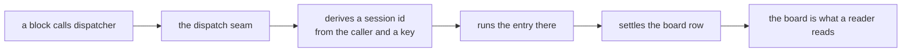

# FIX-1440 · Make dispatch-run sessions first-class on their flow; rename off "child"

Under [FIX-1208](https://linear.app/fixpoint-labs/issue/FIX-1208) (Remove superseded framework leftovers) · Size: M

| Someone who… | Today | After |
|---|---|---|
| runs background work and wants to see it | Can only reach it by opening the conversation and descending into its children. The work exists, but not as something the flow lists | Finds it on the flow's own session list, like any other session, and opens it directly |
| reads our docs to learn how background work is organised | Learns a session tree: a parent, its children, and children under those | Learns that dispatched work runs in its own session on the same flow, and that the parent is recorded as provenance rather than as an owner |
| opens the DevTool on a conversation | Sees a **Children** tab and descends, getting another Children tab at each level | Sees dispatch runs in the flow's session list, indented one level under the session that spawned them, each labelled and linking back to its parent. The hierarchy is shown, not navigated — nothing to drill into |
| is reading one conversation and wants to know what the work it kicked off actually did | Opens the run's own session and reads it there, then goes back | Pulls the run's activity into the conversation's own block tree, on demand. Marked as a separate session, and collapsed until asked for |
| asks the framework whether a background request is still alive | Gets an answer only if that work hangs beneath the asking session | Gets an answer for their own work on that flow — see D4, which is open |
| already dispatches work today (`dispatcher()`, task hand-off) | Works | Works, unchanged. Same derived session, same ids |
| is triaging the five open detached-child bugs | Five open bugs, two of them cancelled on reasons that did not survive scrutiny | One closes because it is already fixed in code. Four stay open, re-pointed at the dispatch lifecycle they actually describe |


The left pane is the gap: the dispatched run is not in the list at any setting, so the only route
to it is down through its parent. On the right it is in the list, and the children route has become
the index behind it rather than the way in.

## What the DevTool looks like


Read the indent: it is one level and it is a **view**. A run spawned by a run indents once, beside
its own parent — there is no second level, no breadcrumb, and nothing to drill into. The label is
the other half: a keyed dispatch derives its session id, so a retry re-enters the run it started
instead of minting a second one, and a reader needs to know which of those they are looking at.


Look at what is *not* loaded on the left. The dispatched run is one collapsed node naming a
separate session; the reader chooses to pull its activity in. That default is the rule, not a
preference — a dispatcher draining fifty rows would otherwise pour fifty sessions into one block
tree, which is the same unreadability the flat session list was protecting against, moved one
surface over.


And opened on its own, the run says what it is and points home. The parent link is the same
provenance edge the list row carries, on the surface where a reader who arrived by direct link
needs it.

## The surface, as a developer sees it

```diff
  // Dispatching work — unchanged.
  const summarize = dispatcher({
    name: "summarize",
    type: "task",
    action: "summarize-report",
    session: "per-task"
  });

  // Finding the work afterwards — this is what changes.
- // Only door: descend from the parent.
- const kids = await client.sessions.listChildSessions(sessionId);
+ // A dispatch run is a session of this flow, and lists as one.
+ const sessions = await client.sessions.list({ flowKind: "reports", include: "dispatch-runs" });
+
+ // The parent is still recorded, as provenance rather than as the only route.
+ const runs = await client.sessions.listChildSessions(sessionId);   // stays
```

Nothing public is removed. `GET /sessions` gains a named way to include dispatch runs;
`GET /sessions/:id/children` keeps its shape and is documented as a provenance index.
`GET /sessions/:id` needs no change — it already serves these sessions.

## How the mechanism reaches the work



Nothing on that path changes. What this spec touches is everything *after* it — how a reader finds
the session `C` derived, and how they read what happened in it.

## What stays exactly as it is

- `dispatcher()`, the task board, and the hand-off — including the derived session each dispatched row runs in, its `dsx_` id and its hash material.
- `parentSessionId` on the stored session record, and the parentage filter every store adapter implements — now read as provenance, which is what the amendment asks for.
- `GET /sessions/:id/children` and the types on it. Re-documented, not removed.
- `lineageId` and `sharedToLineage` resources. Independent of nesting; minted at root-session creation.
- Same-session sub-agents, Workforce seat sessions, Relay.
- Nested **task boards**. Session nest and board nest are different things.

## What goes

Only the teaching, and only where it is a tree to walk: the DevTool's recursive **Children** tab
and breadcrumb, and the docs' framing of children as a hierarchy to enumerate. The route survives;
the invitation to descend does not.

## Sign off

1. **What replaces the descendant-chain liveness check — the one still open, and the one with a security cost.** Today a caller may ask whether a request is alive only if it hangs beneath them. That is the "nest-only authorization" the amendment names, but the same walk also re-checks principal, tenant and flow at every hop. Recommend keeping the walk and adding a same-flow-same-principal arm beside it, rather than replacing it outright. *If wrong:* replacing it widens a liveness answer from "my subtree" to "anything of mine on this flow." → [D4](DECISIONS.md#d4)

2. **Should `GET /sessions` itself start including dispatch runs, or stay opt-in? — OPEN, and small.** The direction is settled and the DevTool shape is specified; what is not answered is the wire default. Drafting against **opt-in**: the DevTool passes the include, so you see every session on the flow, while a third-party caller of `GET /sessions` still gets exactly what it gets today. *If wrong:* one line in S1, plus an announced behaviour-change note, and the "byte-identical without the include" rule inverts. Nothing blocks on it either way. → [D1](DECISIONS.md#d1)

3. **A run's activity reads inside its parent, loaded on demand — SETTLED, and it is new scope.** The block tree gains a node for a dispatched run that the reader can expand in place, so following one causal chain does not mean bouncing between two sessions. Collapsed by default. This is the one part of the change that adds a surface rather than re-pointing one, which tenet 3 makes us say out loud. *If wrong:* the cheapest cut in this spec — drop it and the rest still stands. → [D5](DECISIONS.md#d5)

4. **The internal vocabulary stops saying "child".** The derived session is renamed a *dispatch run* in code and internal docs. *If wrong:* skipping it leaves the word that caused this issue in place. → [D2](DECISIONS.md#d2)

5. **One cluster bug closes, four stay open.** Re-triaged against code rather than against this spec's direction, which changed twice. `FIX-1045` is already fixed. The other four describe live dispatch-lifecycle behaviour. *If wrong:* the draft cancelled two of these on reasons that did not survive reading the issues properly, which is the error this re-triage corrects. → [D3](DECISIONS.md#d3)
