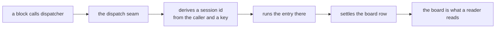

# FIX-1440 · Make dispatch-run sessions first-class on their flow; rename off "child"

Under [FIX-1208](https://linear.app/fixpoint-labs/issue/FIX-1208) (Remove superseded framework leftovers) · Size: M

| Someone who… | Today | After |
|---|---|---|
| runs background work and wants to see it | Can only reach it by opening the conversation and descending into its children. The work exists, but not as something the flow lists | Finds it on the flow's own session list, like any other session, and opens it directly |
| reads our docs to learn how background work is organised | Learns a session tree: a parent, its children, and children under those | Learns that dispatched work runs in its own session on the same flow, and that the parent is recorded as provenance rather than as an owner |
| opens the DevTool on a conversation | Sees a **Children** tab and descends, getting another Children tab at each level | Sees dispatch runs among the flow's sessions, each showing what dispatched it. No tree to walk down |
| asks the framework whether a background request is still alive | Gets an answer only if that work hangs beneath the asking session | Gets an answer for their own work on that flow — see D4, which is open |
| already dispatches work today (`dispatcher()`, task hand-off) | Works | Works, unchanged. Same derived session, same ids |
| is triaging the five open detached-child bugs | Five open bugs, two of them cancelled on reasons that did not survive scrutiny | One closes because it is already fixed in code. Four stay open, re-pointed at the dispatch lifecycle they actually describe |


> **The figure is stale.** It illustrates the superseded removal, not this direction. It is
> redrawn before this spec goes back for review; it is left in place rather than deleted so the
> PR's history stays readable.

## The surface, as a developer sees it

```diff
  // Dispatching work — unchanged.
  const summarize = dispatcher({
    name: "summarize",
    type: "task",
    action: "summarize-report",
    session: "per-task"
  });

  // Finding the work afterwards — this is what changes.
- // Only door: descend from the parent.
- const kids = await client.sessions.listChildSessions(sessionId);
+ // A dispatch run is a session of this flow, and lists as one.
+ const sessions = await client.sessions.list({ flowKind: "reports", include: "dispatch-runs" });
+
+ // The parent is still recorded, as provenance rather than as the only route.
+ const runs = await client.sessions.listChildSessions(sessionId);   // stays
```

Nothing public is removed. `GET /sessions` gains a named way to include dispatch runs;
`GET /sessions/:id/children` keeps its shape and is documented as a provenance index.
`GET /sessions/:id` needs no change — it already serves these sessions.

## How the mechanism reaches the work



Nothing on that path is removed. The deleted surface hung off `C` as a second way to read
progress, in parallel with `F`.

## What stays exactly as it is

- `dispatcher()`, the task board, and the hand-off — including the derived session each dispatched row runs in, its `dsx_` id and its hash material.
- `parentSessionId` on the stored session record, and the parentage filter every store adapter implements — now read as provenance, which is what the amendment asks for.
- `GET /sessions/:id/children` and the types on it. Re-documented, not removed.
- `lineageId` and `sharedToLineage` resources. Independent of nesting; minted at root-session creation.
- Same-session sub-agents, Workforce seat sessions, Relay.
- Nested **task boards**. Session nest and board nest are different things.

## What goes

Only the teaching, and only where it is a tree to walk: the DevTool's recursive **Children** tab
and breadcrumb, and the docs' framing of children as a hierarchy to enumerate. The route survives;
the invitation to descend does not.

## Sign off

1. **Dispatch runs become first-class on their flow — SIGNED in direction, one sub-question open.** Amended by the owner on 2026-09-18, superseding the draft's removal. Open: do they appear in the **default** session list, or behind an explicit opt-in? Recommend opt-in — it delivers reachability without changing what every existing caller of `GET /sessions` sees. → [D1](DECISIONS.md#d1)

2. **The internal vocabulary stops saying "child".** The derived session is renamed a *dispatch run* in code and internal docs. Unchanged by the amendment, which restates it. *If wrong:* skipping it leaves the word that caused this issue in place. → [D2](DECISIONS.md#d2)

3. **What replaces the descendant-chain liveness check — OPEN, and the one with a security cost.** Today a caller may ask whether a request is alive only if it hangs beneath them. That is the "nest-only authorization" the amendment names, but the same walk also re-checks principal, tenant and flow at every hop. Recommend keeping the walk and adding a same-flow-same-principal arm beside it, rather than replacing it outright. *If wrong:* replacing it widens a liveness answer from "my subtree" to "anything of mine on this flow." → [D4](DECISIONS.md#d4)

4. **One cluster bug closes, four stay open.** Re-triaged against code rather than against this spec's direction, which changed twice. `FIX-1045` is already fixed — the derivation it complains about now carries the flow discriminator on exactly the colliding path. The other four describe live dispatch-lifecycle behaviour. *If wrong:* the draft cancelled two of these on reasons that did not survive reading the issues properly, which is the error this re-triage corrects. → [D3](DECISIONS.md#d3)
