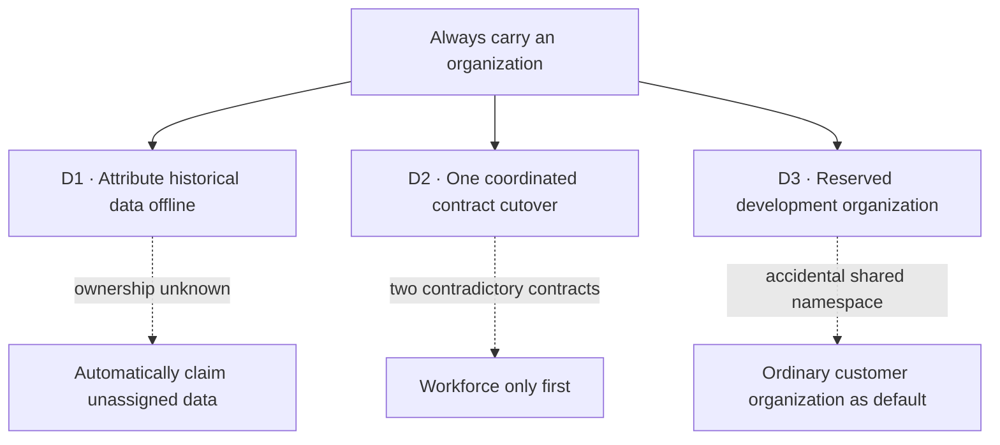

# FIX-1442 · Decisions

[Spec](SPEC.md) · **Decisions** · [Rules](BUSINESS-RULES.md) · [Plan](PLAN.md)

Solid paths are the recommendations at the approval gate; dashed paths show the alternatives they reject.

## D1 · Attribute old unassigned data before reopening it

| | |
|---|---|
| **Instead of** | Mapping every missing organization to the development default, or binding it to the first authenticated caller |
| **Because** | A missing field contains no evidence of who owned it. Enforcing immutable ownership at the common admission boundary follows [tenets 1 and 5](../../docs/philosophy.md) and BP-031 |
| **Locks in** | An upgrade with unassigned history requires an operator to classify it before serving it; the runtime will preserve and refuse it meanwhile |

**Plain terms and trade-off:** old conversations remain recoverable, but some installations need a maintenance window. The alternative is a smoother upgrade that can put old history in the wrong organization.

**Recommendation:** stop writers, back up, inventory affected sessions, requests, children and dynamic schedule rows, run the supplied offline recipe with an authoritative organization mapping, verify the complete set, then reopen. Drain external queues before upgrading; unmappable jobs stay stopped or are explicitly retired by the operator. Known single-organization development data can be explicitly mapped to the default. Ambiguous records remain quarantined; no online first-reader claim, lazy backfill, or automatic NULL-to-default migration. [PLAN's upgrade contract](PLAN.md#upgrade-contract) owns the recipe's safety and verification requirements.

The existing [flow-instance attribution runbook](../../apps/docs/docs/persistence/overview.md) is the starting pattern. This cutover also changes who may access data and joins session/request attribution to scheduler impersonation; a partially applied mapping can select another organization's work. That earns a tested, one-shot recipe across shipped adapters, rather than leaving each adopter to reproduce those consistency checks. It earns neither a maintained migration framework nor a new public API.

**What would change my mind:** durable origin metadata proving every unassigned record in the affected installation was created for the default organization. No such provenance exists in the inspected generic record contract.

**If wrong:** unnecessary operational downtime, recoverable without moving customer data. Runtime refusal is reversible; an incorrect operator mapping may expose data, so backup and preview are mandatory parts of the runbook.

## D2 · One coordinated framework-wide contract cutover

| | |
|---|---|
| **Instead of** | Requiring organization only in Workforce first, or making browsers submit a required but untrusted organization |
| **Because** | The framework must own the invariant where paths converge; a required browser field would duplicate the verified principal's authority. This follows [tenets 1, 3 and 5](../../docs/philosophy.md) |
| **Locks in** | Published consumers update their resolver and trusted direct-call code in one pre-1.0 minor upgrade; the implementation ships as one atomic PR |

**Plain terms and trade-off:** end inconsistent organization handling across the product now, at the cost of a coordinated upgrade. A staged release spreads that work out but leaves applications with two identity contracts.

**Recommendation:** required organization in canonical principal, execution and new records; remove organization selectors from untrusted client create/invoke and Workforce's browser-client binder. The server resolves their identity. Trusted direct engine calls require an explicit organization. Keep legacy decode compatibility only to diagnose and migrate historical data, never as a usable execution mode.

**What would change my mind:** an external adopter has a promised compatibility window that cannot accommodate these source changes.

**If wrong:** upgrade friction and support time. Before release this is a doc change; afterward reversing the required contract reintroduces the gap.

The large change has one PR-plan node because its type, producer, guard and documentation changes must ship together. A partial release that rejects existing producers would not be independently usable.

## D3 · One reserved development organization

| | |
|---|---|
| **Instead of** | Absence, caller-selected body organization, or an ordinary customer identifier such as `default` |
| **Because** | A stable identity makes the existing org scope work without app wrappers; a reserved namespace avoids accidental overlap with authenticated organizations. This follows [tenets 2 and 4](../../docs/philosophy.md) |
| **Locks in** | `DEFAULT_ORG_ID = "__fsd_default_org__"` becomes a stored identity; changing it later requires a migration |

Recommend this spelling, exported as a runtime value from `@flow-state-dev/core`. It denotes development single-organization operation, not a security boundary. A configured resolver returning it is refused. Direct trusted callers and framework development helpers may deliberately use it. Preflight must inventory existing use of this exact ID before enabling the new default: it must not silently become development data. Evidence of a collision before release changes the proposed spelling; a deployed adopter with a collision keeps traffic stopped until an explicit offline rename moves the organization's complete data and identity-provider mapping to an unused nonreserved ID (BR-21). This adds upgrade work only for a colliding installation; no online rebinding exception is introduced.

## Decided, not asked

- Build as scoped: resolver configuration alone cannot cover record admission, management reads, queued recovery or client contract cleanup. This is a framework invariant change, not a new auth product.
- Preserve user-scope and `tenantId` storage semantics. The same globally stable user may share personal state across organizations; organization resources and sessions still enforce their own owner.
- Remove redundant opt-in organization requirement machinery; explicit old config keys are rejected with migration guidance rather than silently ignored.
- Trusted schedules, webhooks and queued work carry organization identity too. Dynamic schedules persist the creating execution's organization as an immutable trusted binding and dispatch from that binding, not the scheduler gateway's organization (BR-19). Keep `defaultUserId` only when a resolver supplies a valid org; null no longer succeeds. System resolvers return `{ orgId }` with configured `defaultUserId`, or a complete machine principal. No new `defaultOrgId` knob.

## Considered and dropped

| Alternative | Why it loses |
|---|---|
| App wrapper around session creation | Cannot protect reads, direct execution, recovery or competing writers |
| Default near resource lookup | Admits incomplete records and re-decides identity after it was bound |
| Add a new organization-selection API | The existing verified principal already owns selection |

## Research and settled facts

The [source inventory](evidence/org-inventory.json) and [checker](evidence/check-org-inventory.mjs) are a lexical map at base SHA `4da75ad76`, not proof that every authorization path is safe. This spec-only evidence never lands on main.

[The AWS identity/isolation guidance](https://docs.aws.amazon.com/whitepapers/latest/saas-tenant-isolation-strategies/identity-and-isolation.html) supports carrying verified tenant context downstream; [Auth0 organization token guidance](https://auth0.com/docs/manage-users/organizations/using-tokens) supports validating organization identity when accessing resources. Neither dictates our default string or migration policy.

## How it got here

- **Draft** — Turn optional org into a mandatory resolved identity, retain immutable session ownership, and propose one coordinated cutover with attributable historical migration.
- **Review** — Add trusted dynamic-schedule attribution, non-destructive shared-org initialization, and reserved-ID collision preflight because the original rules left these cutover cases unproved; keep the migration recipe and full boundary coverage.
