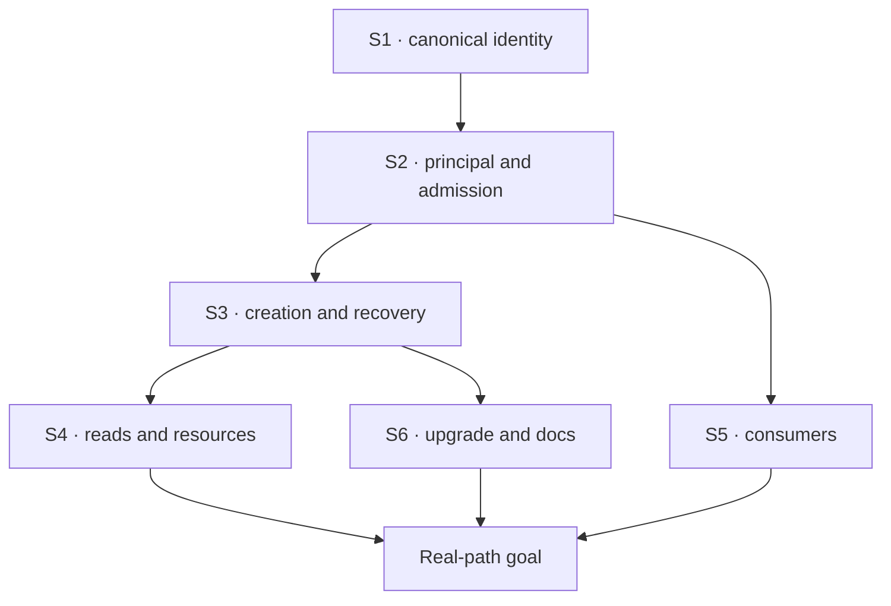

# FIX-1442 · Plan

[Spec](SPEC.md) · [Decisions](DECISIONS.md) · [Rules](BUSINESS-RULES.md) · **Plan**

## Surfaces

| ID | Owning seam and direction | Grounding at researched main |
|---|---|---|
| S1 | Core auth/scope types: required canonical org, exported default; remove opt-in requirement flags and duplicate aggregation | `packages/core/src/types/auth.ts`, `types/scope.ts`, `types/block.ts`, `types/flow.ts`; org declarations inventory below |
| S2 | Host principal normalization and admission: one validated identity before effects; every direct/context/continuation path uses the same invariant | `packages/engine/src/transports/host/createInboundTransportHost.ts:894`, `execution/types.ts:69`, `context/createExecutionContext.ts:654` |
| S3 | Session/request producers and records: carry org through creation, race adoption, durable dispatch and recovery; separate raw legacy decoding from admitted records | `routes/session-routes.ts:178`, `context/ensure-session-record.ts`, `context/create-request-host.ts:319`, `transports/webhook/session-resolver.ts:37`, `context/initial-request-record.ts`, `stores/types.ts`; all under engine |
| S4 | Management, lists, streams and resource reads: require exact org alongside current ownership; preserve globally keyed user scope | `packages/engine/src/routes/route-auth.ts:250`, `stores/scope-keys.ts:137`, `recovery-routes.ts` active lists and `checkInterruptedRequests`, `detectInterruptedRequests`, startup/periodic sweepers, resource reads |
| S5 | Client/React/Workforce/CLI/testing: remove client selectors, return required org, stamp defaults in trusted helpers | `packages/client/src/session-client/sessions.ts:84`, `client/src/types/index.ts`, `react/src/hooks/useFlow.ts`, `workforce/src/channel/channel-binder.ts:533`, `cli/src/commands/run.ts:287`, testing fixtures |
| S6 | Legacy detection, executable upgrade recipe and docs: quarantine unassigned records, provide attributable migration, update optional-org teaching | D1 and Docs below |

Base: `4da75ad76`. [Inventory](evidence/org-inventory.json) derives 153 org-bearing tracked files; it includes tests and consumers, so it is not a claim of 153 runtime sites.

## Sequence and PR plan

Identity leads; producers and guards ship together.

| PR id | Deliverables | depends_on |
|---|---|---|
| org-cutover | S1–S6 including offline recipe, C1–C6, docs, release notes | none |

Large: six coupled surfaces, six checks, cross-package docs. One atomic PR keeps producers compatible with their guard.

## Checks

| ID | Observable check | Rules |
|---|---|---|
| C1 | Auth resolver matrix: verified org wins over spoofed body; missing/empty/reserved rejected; default constant and warnings; per-flow precedence | BR-1–3 |
| C2 | Model-free full-engine integration across every mint path and direct/pre-resolved dispatch; race winner; same-user org mismatch; no pre-refusal writes | BR-4–6, 11, 16 |
| C3 | Extend existing kitchen-sink/Workforce characterization: create channel with real SessionClient, wake seat, read actual org-scoped docs, capture result; default and authenticated variants | BR-3, 5, 7, 12 |
| C4 | Real router two-org matrix: CRUD, state/resources/debug, list/active requests, SSE including active-entry fallback, retry/continue/abort/interruption sweeps; user-stream auth before its existing 501; identical user under both orgs; mixed host | BR-1, 8–10, 12–13 |
| C5 | Seed legacy rows in memory/filesystem/SQLite/Postgres; scans and addressed paths refuse without writes. Recipe preview/apply/verify then restart succeeds; conflicting mapping refuses. BullMQ queues are drained before cutover; stale orgless jobs refuse | BR-11, 14–16 |
| C6 | Type tests for required canonical org and removed client selectors; config old-key rejection; package builds/typecheck/lint; docs lexical audit | BR-17–18 |

**Goal:** C3 exercises the production router, stores, dispatcher and org resource read, without an org wrapper. Use the existing kitchen-sink/Workforce path, not a new demo. Capture assertions on stored identity, child identity and returned document value; use a deterministic read action for the invariant. If the existing demonstration requires a model to perform the wake/read, run that real model too and capture its output. Verify flow changes with `fsdev run`, then tests. Negative controls must remove the org check or seed a cross-org session and make the goal fail. C1/C4 prove the security property independently of model behavior.

**Spec evidence:** run `node spec/FIX-1442/evidence/check-org-inventory.mjs`. Its tracked-file snapshot detects new, removed or changed org-bearing lines; context/history/generated graph and nontext exclusions are explicit in the script. A planted `org-inventory-negative.ts` passed via `--extra` was rejected; removed afterward. This is lexical coverage, not a behavioral POC. No behavioral POC needed: existing principal/admission seams suffice. Explain inventory drift before updating its baseline.

## Pinned names and guardrails

- `DEFAULT_ORG_ID = "__fsd_default_org__"`; principal/session org is immutable. Tenant and user keys do not change.
- **Convergence:** validate once at principal normalization and enforce admission before effects at host/direct execution; every producer in S3 plus CLI seeds/testing passes through canonical identity validation. Guard stored reads through management/resource admission too, because an execution-only guard cannot protect GETs.
- Historical decode is permissive, admission is strict, because missing ownership cannot authorize a caller. Ship a downloadable one-shot migration recipe beside the persistence guide, using the public StoreRegistry and an explicit operator map. Support preview/apply/verify, resumable CAS updates and consistency checks before serving; test every shipped adapter. No online migration callback or general migration framework.
- Preserve existing binding, flow-instance, tenant and incarnation checks; org strengthens them rather than replacing them.
- Browser body org remains ignored by authenticated servers for old wire clients; remove typed selectors now. Default-mode legacy selectors are ignored with a warning. No second organization-selection seam.

## Docs

Required; existing pages, no new sidebar entry. Route user-facing prose through docs-writer then docs-editor.

| Surface | Content |
|---|---|
| `docs/architecture/authentication.md`, `state-and-scopes.md`, `inbound-transports.md`, `dispatched-work.md`, `resources-and-client-data.md`, `webhook-transport.md`, `scheduled-actions.md`; contributing `architecture-reference.md` | Required canonical identity, authority, admission and inherited org; remove optional-org/no-registry teaching |
| `apps/docs/docs/server/authentication.md` (Core → Engine), `fundamentals/state-and-scopes.md` (Core → Fundamentals) | Authenticated and development recipes, machine users, user/org/tenant distinctions; link migration section |
| `apps/docs/docs/persistence/overview.md` | Extend existing offline attribution cutover pattern: downloadable tested recipe, backup, mapping, preview/apply/verify, restart/rollback; drain BullMQ first, leave unmappable jobs stopped or explicitly retire them |
| `configuration/{blocks,flow,client}.md`, `fundamentals/state-operations.md`, `resources/external-collections.md`, `advanced/error-capture.md`, `workforce/{built-in-worker,channels,documents-on-disk}.md`, guides `projects-on-org-scope.md` | Server-owned org and removal examples; system resolver migration; error diagnostics may lack org only when resolution failed or legacy data was refused |
| Core/engine/client/React/workforce/testing/CLI/node READMEs where affected | Public contract, default, migration and setup examples; check root onboarding snippets |

No auth product or skills-scope redesign. No new public migration API or CLI verb. Quarantined rows do not prevent startup. Runtime columns may remain nullable during the legacy detection window; do not add NOT NULL before attribution. Implementation changesets use pre-1.0 minor for affected breaking published packages and name FIX-1442; this spec PR needs no changeset.

## At implement time

Refresh main and re-check overlaps. #1889/FIX-1412 is merged: its optional binder parameter was expressly interim and this cutover supersedes it. FIX-906/1224 contracts and Door A scope remain constraints. FIX-1374, FIX-1403 and FIX-1443 (pentest lab org-wrapper removal) are related, not blockers; do not merge their scopes or close them implicitly. No currently identified blocking issue or open overlapping implementation PR.

## Notes from review

Initial technical/scope/docs validation folded queue migration, autonomous scans, machine-principal fallback, active-entry SSE admission and precise docs coverage. Binder org comparison stays server-owned; user-stream remains 501.

## Follow-ups

After merge, report the changed invariant to FIX-1374/1403 owners for their own scope/status decisions; do not close them implicitly. FIX-1443 retains the separate pentest-wrapper cleanup. User-scope re-keying remains a separate product decision.
