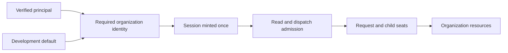

# FIX-1442 · Org is never optional

**Spec** · [Decisions](DECISIONS.md) · [Rules](BUSINESS-RULES.md) · [Plan](PLAN.md)

Improvement · core, engine, client, workforce and identity consumers · large · 1 atomic PR · no epic

| Someone who… | Today | After |
|---|---|---|
| Builds a single-organization app | Can create a session that cannot reach organization resources | Gets a named framework organization automatically in development |
| Signs in to an organization | Must ensure every route carries the same organization | The verified principal supplies the organization for creation, reads and execution |
| Belongs to two organizations | Some management routes check the user without checking the organization | A session is accessible only under its bound organization and owner |
| Opens a Workforce channel | Can omit its organization and fail later when a worker reads documents | The channel and every dispatched seat inherit a complete identity |
| Upgrades a store containing unassigned sessions | Has records whose organization cannot be inferred safely | Must attribute those records before serving them; the runtime never guesses ownership |

## What changes


Every path on the right enters with an organization; unassigned historical data stays outside until its owner is established.

**How:** resolve organization identity once, carry it through sessions and requests, and enforce the same identity on every protected read and write. A browser never chooses the authoritative organization.

A configured resolver must return the verified organization. Illustrative migration of existing caller code:

```diff
 authentication: {
-  resolvePrincipal: async () => ({ userId: verified.userId })
+  resolvePrincipal: async () => ({ userId: verified.userId, orgId: verified.orgId })
 }
- await client.createSession({ flowKind: "chat", userId, orgId: selectedOrg });
+ await client.createSession({ flowKind: "chat", userId });
```

Trusted server code bypassing a resolver supplies the identity explicitly:

```diff
+ import { DEFAULT_ORG_ID } from "@flow-state-dev/core";
- await runAction({ flow, actionName: "chat", input, userId, stores });
+ await runAction({ flow, actionName: "chat", input, userId, orgId: DEFAULT_ORG_ID, stores });
```

The constant is for deliberate single-organization development or system wiring. Authenticated direct callers pass their verified organization's ID instead.



The organization is bound when the session is created and checked again whenever work or data crosses its boundary.

## What stays as it is

Login and membership verification belong to the host application. Machine users remain supported with a complete identity. Door A documents remain organization-scoped. The separate `tenantId` axis and globally keyed user scope retain their documented meanings; this change does not re-key personal state per organization. Existing flow and session ownership checks remain in force.

## Need your sign-off

1. **[D1](DECISIONS.md#d1) · Attribute old unassigned data before reopening it.** Recommend an offline, operator-approved mapping, including confirmed development data; never assign it to the first caller. This trades upgrade preparation for protection against assigning another organization's history. Automatic defaulting would be preferable only with durable evidence that every affected record belonged to that development organization. **If wrong:** avoidable upgrade downtime; the source data remains intact.
2. **[D2](DECISIONS.md#d2) · Complete the contract change in one coordinated release.** Recommend requiring organization identity inside the framework and removing browser organization selection now, rather than a Workforce-only stage. This costs consumer updates once and ends the contradictory contract. A committed compatibility promise to an external adopter would justify a staged release. **If wrong:** adopters need more upgrade time than planned.
3. **[D3](DECISIONS.md#d3) · Reserve `__fsd_default_org__` for unauthenticated single-organization operation.** Recommend one exported `DEFAULT_ORG_ID`; configured authentication cannot claim it. **If wrong:** changing the value after data is written requires a migration.

**Open:** D1 and D2 are rollout recommendations awaiting this gate; D3's exact value is also being ratified. The product direction—organization is always present—is already the owner's decision. D1 deserves the most attention. Implementation starts only after approval of this set.
