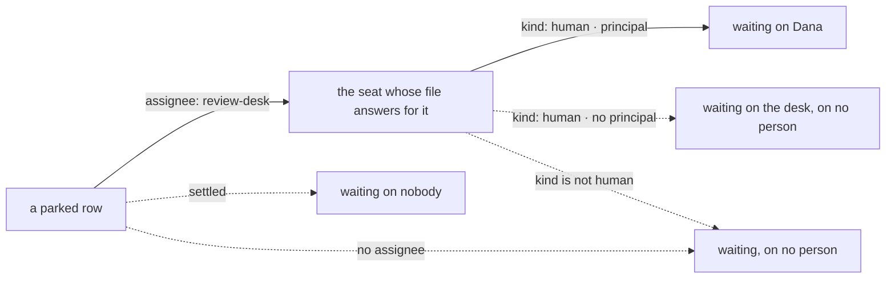

# FIX-1458 · Business rules

[Spec](SPEC.md) · [Decisions](DECISIONS.md) · **Rules** · [Plan](PLAN.md)

The cases, written as rules. *Proved by* names the check the plan runs — for this issue that is
almost always a leg of the lab goal, because the claim is about a running team rather than a unit.
A human reviews this page for a case that is missing.

## Hiring a person

| # | When | Then | Proved by |
|---|---|---|---|
| BR-1 | A `WORKER.md` declares `flow: human` and `principal:` | It hires like any seat. Its inventory row's `kind` is `human`, which is how anything downstream can tell | Lab goal · leg (a) |
| BR-2 | `principal:` is declared on a kind that never declared it | The **whole** roster refuses at boot, naming the key. Nothing is hired, so a refusal cannot leave a short roster running | Lab goal · leg (a), the control. Already green in the POC |
| BR-3 | A seat runs the human kind but declares no `principal:` | It still hires — an absent setting is not an undeclared one, so the kind declares `principal` **optional**. Its rows wait on the **desk**: the read names the seat and no person, which is a different answer from a row that resolves to no seat at all (BR-12) | Lab goal · legs (a) and (c), null arms. Already green in the POC |
| BR-4 | A human seat is listed in a `CHANNEL.md`'s `members:` | It is a member on the same terms as an agent seat. No membership surface learns what kind it is | Lab goal · leg (a) |

## The row that waits on them

| # | When | Then | Proved by |
|---|---|---|---|
| BR-5 | A row is filed for the desk a human seat answers for, and the board drains | The seat parks it with its own reason and the drain exits `parked-for-review`. The row is still `parked` after the request ends | Lab goal · leg (b) |
| BR-6 | A row for an agent desk is on the **same board**, in the same drain | It completes inline. The difference is the kind, not the board | Lab goal · leg (b) |
| BR-7 | Nobody answers, and the board drains again | The parked row is **not** re-taken and not handed to a free seat. It is still parked, still carrying its reason | Lab goal · leg (b), second path |
| BR-8 | An answer arrives for the parked row, in a later request | The row re-queues, the same seat records **the answer** as the row's outcome, and it settles `completed` carrying it. The rule is about the answer being recorded and landing in a later request — **it does not say who sent it** | Lab goal · leg (d) |
| BR-9 | A second answer arrives for a row already answered | Declined as a value, naming the status it found. The first answer stands and nothing is overwritten | Lab goal · leg (d), second arm |
| BR-10 | The answer is a refusal rather than an approval | The seat records it the same way. **What a refusal means is the app's call**, not the substrate's — the row settles either way, and nothing silently re-queues it for an agent | Lab goal · leg (d) |

**Recording the words is not proving who spoke.** `unparkAndDrain` takes `{ taskId, feedback }`
and no caller identity, so nothing in BR-8 to BR-10 binds the answer to the seat's `principal:` —
a row filed for Dana's desk can be answered by anyone who can reach the action, and the read will
still say the row was waiting on Dana. That wall is named, with the check that would settle it, in
[DECISIONS.md → Open](DECISIONS.md#open). It is not this issue's to close.

## Reading who owes it

Four ways a read ends, and only the solid path names a person. Each is a rule below.

| # | When | Then | Proved by |
|---|---|---|---|
| BR-11 | A parked row's assignee resolves to a human seat | The read names that seat and its principal — derived at read time from the row and the tree, stored nowhere | Lab goal · leg (c) |
| BR-12 | A parked row has no assignee | It is waiting on nobody in particular, and reads that way. It is **not** attributed to a person | Lab goal · leg (c), second path |
| BR-13 | A parked or blocked row's assignee resolves to an agent seat | Still waiting, still carrying its reason, with no person named | Lab goal · leg (c) |
| BR-14 | The read runs | The ledger is byte-identical either side of it. Reading who owes a row writes nothing | Lab goal · leg (c) |
| BR-15 | The tree is changed so a different seat answers for the desk, and nothing else moves | The read follows the tree, not a map the check also wrote. This is the control that makes BR-11 mean anything | Lab goal · leg (c), `repointed-roster` control |

## What must not grow

| # | When | Then | Proved by |
|---|---|---|---|
| BR-16 | This change lands | `TaskStatus` has exactly the seven members it had, asserted against a written-out list rather than against a reading of itself | Lab goal · the existing status leg |
| BR-17 | This change lands | No human branch in `hireWorkforce`, the seat or channel inventory, or the suspension machinery. A person's seat is `{ id, kind }` to every one of them | Review of the diff |
| BR-18 | This change lands | Nothing under `packages/*` or `apps/*` is touched. The diff is inside `goals/manager-queue-lab/` and `docs/architecture/`, derived from `git diff` against the merge base rather than from a list somebody kept | CI · a diff gate, the shape the lab already uses |

## Failure taxonomy

Two things are fatal and both are at boot: a roster that refuses (BR-2), and a lab tree that will
not load. Everything at run time degrades to *visible and waiting*: a row nobody answers stays
parked with its reason (BR-7), a row with no assignee is loud rather than silent (BR-12), and a
second answer is declined as a value rather than thrown (BR-9). Nothing here retries, because
nothing here is a transient failure — a person not answering is not an error.

## Acceptance criteria this issue owns

A team declared entirely in files, one of whose seats is a **person**, takes in work. The
coordinator files a row for the review desk. The board drains, the row comes back waiting on Dana by
name, and the request ends. In a **later** request an answer arrives on that row, and the row
finishes carrying it — with the other seats' rows having run through the same board the whole time,
and the task status set unchanged. That is the goal check, model-free on its routing arm. It grades
that the row *waited on Dana* and that the answer *landed later*; it does not grade that the
answering caller was Dana, which nothing can check yet (DECISIONS → Open).

It does **not** cover a person in a live inventory under a running host, or a human seat that runs in
its own session rather than inline. Both are FIX-1455's, and the plan says so.
