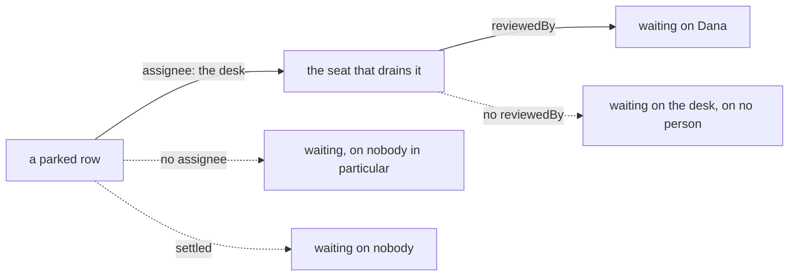

# FIX-1458 · Business rules

[Spec](SPEC.md) · [Decisions](DECISIONS.md) · **Rules** · [Plan](PLAN.md)

The cases, written as rules. *Proved by* names the check the plan runs — for this issue that is
almost always a leg of the lab goal, because the claim is about a running team rather than a unit.
A human reviews this page for a case that is missing.

> Rewritten for **Model B** ([D1](DECISIONS.md#d1), flipped 2026-09-20). The previous set was
> written against a human *drain seat*; those rules are gone rather than patched, because most of
> them described a thing that no longer exists.

## The team, and who is on the chart

| # | When | Then | Proved by |
|---|---|---|---|
| BR-1 | The tree is read and hired | Every seat is a non-human worker kind. **No seat is a person** — there is no `human` kind and no seat declares a personal identity as its own | Lab goal · leg (a) |
| BR-2 | A seat's file declares the review bind (`reviewedBy:`) | It hires like any seat. The bind is an ordinary setting on an **agent** seat, carried in its config bag | Lab goal · leg (a) |
| BR-3 | The bind is declared on a kind that never declared the key | The **whole** roster refuses at boot, naming the key. Nothing is hired, so a refusal cannot leave a short roster running | Lab goal · leg (a), the control. Already green in the POC |
| BR-4 | A seat on the same kind declares **no** bind | It still hires — an absent setting is not an undeclared one, so the kind declares it **optional**. Its parked rows wait on the **desk** and on no person, which is a different answer from a row that resolves to no seat at all (BR-13) | Lab goal · legs (a) and (c), null arms. Already green in the POC |
| BR-5 | The org chart is read | One listing names the agent seats **and** the people, each person carrying the seats whose escalations they answer for. Derived from the tree, written nowhere. A person **no seat names** does not appear, and that limit is stated rather than worked around ([Open](DECISIONS.md#open)) | Lab goal · leg (a) |

## The row that waits on a person

| # | When | Then | Proved by |
|---|---|---|---|
| BR-6 | A row a **non-human seat owns** needs a person, and the board drains | That seat parks it with its own reason and the drain exits `parked-for-review`. The row is still `parked` after the request ends, and **it never changed owner** | Lab goal · leg (b) |
| BR-7 | Another row is on the **same board**, in the same drain, and needs nobody | It completes inline. The difference is the row, not the board, and not a second plane | Lab goal · leg (b) |
| BR-8 | Nobody answers, and the board drains again | The parked row is **not** re-taken and not handed to a free seat. It is still parked, still carrying its reason | Lab goal · leg (b), second path |

## Answering it

**This is where the accountability lives, and it is a rule rather than a hope.** Nothing in the
substrate forces an action to check its caller; what follows is what the action this issue ships
must do, each line with a red state a control produces.

| # | When | Then | Proved by |
|---|---|---|---|
| BR-9 | A request calls the answer action, and its **principal is the one the row is owed to** | The row unparks, the owning flow runs again **in that later request**, and **the flow decides what the answer means** — the person supplied input, the machine settled the row | Lab goal · leg (d), and VG |
| BR-10 | The request's principal is **not** the one the row is owed to | It is **refused as a value**, naming who the row is owed to. The row is untouched: still parked, still carrying its reason, nothing recorded on it | Lab goal · leg (d), `stranger` arm |
| BR-11 | The request **claims** a principal in its payload | The claim is ignored. Identity comes from the request the runtime resolved, never from caller-controllable input (BP-031) | Lab goal · leg (d), `trust-input` **control** — with the payload believed, the impostor's answer lands and the row settles |
| BR-12 | The row is owed to **nobody** — its desk resolves to a seat carrying no bind | Refused, for everybody. An unbound desk is not an open door, and a well-meaning caller is not a substitute for a named one | Lab goal · leg (d), null arm |
| BR-13 | A second answer arrives for a row already answered | Declined as a value, naming the status it found. The first answer stands and nothing is overwritten | Lab goal · leg (d), second arm |
| BR-14 | The answer is a refusal rather than an approval | The owning flow reads it and settles the row its own way. **What a refusal means is the app's call**, not the substrate's — and nothing silently re-queues the row for an agent | Lab goal · leg (d) |
| BR-15 | A request arrives on a **session it does not own** | The runtime refuses it before any block runs. The board a person answers into is therefore not scoped to the owning seat's session; each principal arrives in their own | Lab goal · leg (d), boundary arm. Already green in the POC |

## Reading who owes it

Four ways a read ends, and only the solid path names a person. Each is a rule below.

| # | When | Then | Proved by |
|---|---|---|---|
| BR-16 | A parked row's assignee resolves to a seat carrying a bind | The read names that seat and the principal it is bound to — derived at read time from the row and the tree, stored nowhere | Lab goal · leg (c) |
| BR-17 | A parked row has no assignee | It is waiting on nobody in particular, and reads that way. It is **not** attributed to a person | Lab goal · leg (c), second path |
| BR-18 | A parked row's assignee resolves to a seat with no bind | Still waiting, still carrying its reason, naming the seat and no person | Lab goal · leg (c) |
| BR-19 | The read runs | The ledger is byte-identical either side of it. Reading who owes a row writes nothing | Lab goal · leg (c) |
| BR-20 | The tree is changed so a different principal is bound, and nothing else moves | The read **and the answer action** follow the tree, not a map the check also wrote. This is the control that makes BR-9 and BR-16 mean anything | Lab goal · `repointed-roster` control |

## What must not grow

| # | When | Then | Proved by |
|---|---|---|---|
| BR-21 | This change lands | `TaskStatus` has exactly the seven members it had, asserted against a written-out list rather than against a reading of itself | Lab goal · the existing status leg |
| BR-22 | This change lands | No human branch in `hireWorkforce`, the seat or channel inventory, or the suspension machinery — and **no human worker kind**. A seat is `{ id, kind }` to every one of them | Review of the diff |
| BR-23 | This change lands | Nothing under `packages/*` or `apps/*` is touched. The diff is inside `goals/manager-queue-lab/`, derived from `git diff` against the merge base rather than from a list somebody kept | CI · a diff gate, the shape the lab already uses |

## Failure taxonomy

Two things are fatal and both are at boot: a roster that refuses (BR-3), and a lab tree that will
not load. Everything at run time degrades to *visible and waiting*: a row nobody answers stays
parked with its reason (BR-8), a row with no assignee is loud rather than silent (BR-17), and a
wrong caller, a second answer and an unbound desk are all **declined as values** rather than
thrown (BR-10, BR-12, BR-13). Nothing here retries, because nothing here is a transient failure —
a person not answering is not an error, and a person who may not answer is not a fault.

## Acceptance criteria this issue owns

A team declared entirely in files, all of whose seats are agents, takes in work. One seat's row
needs a person, so **that seat parks it** and the request ends. The queue read says the row is
waiting on Dana, by name, derived from the tree. A request that is **not** Dana is refused and
the row is untouched — including one that puts her name in its payload. Then Dana's own request
calls the answer action, and **in that later request** the owning flow reads what she said and
settles the row its own way, with the other rows having run through the same board the whole
time, the org chart still listing her beside the agent seats, and the task status set unchanged.

That is the goal check, model-free on its routing arm. It grades that the row *waited on Dana*,
that the answer *was hers*, and that the flow — not the person — *decided what it meant*.

It does **not** cover a person in a live inventory under a running host, a review two people may
answer, or a person on the chart whom no seat names. All three are named in
[DECISIONS → Open](DECISIONS.md#open), and the first is FIX-1455's.
