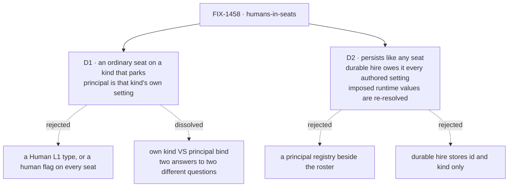

# FIX-1458 · Decisions

[Spec](SPEC.md) · **Decisions** · [Rules](BUSINESS-RULES.md) · [Plan](PLAN.md)

Two decisions, and they are the epic's two downstream-blocking walls
([ER-18](https://github.com/fixpoint-labs/flow-state-dev/blob/epic/living-workforce/spec/_epics/living-workforce/BUSINESS-RULES.md)).
Both were leaned on by running code before they were written down; the POC is
[`spec-poc/FIX-1458-human-seat/`](../../spec-poc/FIX-1458-human-seat/README.md) on this branch.

## The tree

Solid edges are what you're signing. The second dashed edge off D1 is the interesting one: the wall
was not decided, it stopped being a fork.

## D1 · A human seat is an ordinary seat on a kind that parks, and `principal:` is that kind's own setting

| | |
|---|---|
| **Instead of** | A `Human` L1 type · a `human: true` flag every seat carries · a framework-level principal bind on `hireWorkforce` · the original fork, *own kind* **or** *agent seat with `principal:`* |
| **Because** | The fork had two answers to two different questions. **`flow:` already replaces what a seat does** — that is the "own kind" half, and it is how a person answers instead of a model. **A kind's closed `configSchema` already admits its own settings** — that is the bind half, and `answersFor:` in the shipped manager-queue lab is the precedent, same mechanism, different word. Neither half needs inventing, and taking both costs nothing. So the framework learns nothing about people: it learns one more kind |
| **Locks in** | *Is this seat a person?* is answered by its **kind**, which the inventory already records — there is no boolean and there will not be one, so a reader has to know which kinds are human kinds. That is the price of the framework staying ignorant, and it is paid by whoever writes the view. The refusal is real: a `principal:` on a kind that never declared it refuses the **whole** roster at boot, by the key's name |

**What would change my mind:** a downstream consumer needing to ask *is this a person* without
knowing the kind — a generic admin UI over an unknown app's roster. Then the answer belongs on the
seat, not in the reader, and this card is wrong. Nothing in W5 needs that; FIX-1455 is the one that
would find out.

**What the POC showed.** The tree hires the seat, `hireWorkforce` untouched, and the control fires —
the same file on a kind that never declared `principal:` refuses the whole roster by the key's name.
Leg (a), in [the POC's README](../../spec-poc/FIX-1458-human-seat/README.md).

## D2 · A human seat persists exactly as an agent seat does; what durable hire owes it is every *authored* setting, not `{ id, kind }`

| | |
|---|---|
| **Instead of** | A principal registry beside the roster · a durable-hire store that persists `{ id, kind }` and re-derives the authored settings · treating human-seat persistence as its own problem |
| **Because** | The only human-specific durable fact is `principal:`, and by [D1](#d1) it is a **setting** — the same class of thing as `answersFor:`. A file-declared roster already persists it: the file is the store. The exposure is the other hire path, a roster hired at runtime and replayed after a redeploy. A store keeping id and kind and re-deriving the rest would re-hire a person's seat **bound to nobody**, silently — an absent `principal:` is refused nowhere, only a present-and-undeclared one is |
| **Locks in** | FIX-1455 inherits a requirement, not a suggestion, and it is **split by provenance**. What is **persisted** is what the seat's files authored: the kind's own settings (`principal:`, `answersFor:`, anything else the kind declares), `description`, and the catalog names left in `tools:` — plus the manifest-derived text the factory imposes, which is all strings: `instructions`, `teamInstructions`, `seatSkills`. What is **re-resolved at hire**, never stored, is every runtime-only imposed value — `seatTools` above all, which the factory fills with **live `BlockDefinition` objects** off the app's registry (`packages/workforce/src/hire.ts` → `resolveDeclaredTools`, typed `Array<BlockDefinition>` and admitted by `z.custom` in `worker-config.ts`). Those carry executable functions and no store round-trips them. The proof FIX-1455 owes is a seat whose **authored** settings it has never seen, hired from a store, coming back bound to the same person with its tools re-resolved rather than revived |

**What would change my mind:** durable hire turning out to re-read the tree on every boot rather than
replay a stored roster. Then there is no second path and the requirement is vacuous — worth saying
so out loud rather than leaving a rule nobody can fail.

## Decided, not asked

- **Waiting-on-you is the reading, not a value.** `parked` ∪ `blocked` with the row's own reason —
  the grouping `goals/manager-queue-lab/lab/queue.mts` already ships. The epic's
  [D3](https://github.com/fixpoint-labs/flow-state-dev/blob/epic/living-workforce/spec/_epics/living-workforce/DECISIONS.md#d3)
  settled it; the POC only confirmed the substrate agrees.
- **The audience is derived, never stored.** Row → desk → the seat that answers for it → its
  `principal:`. Three facts that already exist. No `audience` field, no widening of `awaitReview`.
- **The deliverable is a leg on the existing manager-queue lab**, not a new lab and not framework
  surface. The ship fence already decided *not now*; the lab that already routes a board to seats is
  where a person joins that team with the least new code, and FIX-1430 set the precedent.
- **Desk keys stay a different spelling from seat ids** — the lab's discipline, and the only thing
  keeping a check from grading the assignee registry against itself.

## Considered and dropped

| Alternative | Why not |
|---|---|
| Give the person's row its own status, `waiting_on_you` | The epic's invent-kill, and independently wrong: a UI column in L1. `parked` already carries the reason, and the lab already groups it |
| Put the audience on the row as an `audience` field | A second copy of a fact the row already has. The assignee *is* the audience once you resolve it, and a stored copy is one more thing to keep true |
| Build the human kind into `@flow-state-dev/workforce` beside the `agent` kind | Ship work, fenced by the epic's [D4](https://github.com/fixpoint-labs/flow-state-dev/blob/epic/living-workforce/spec/_epics/living-workforce/DECISIONS.md#d4). It may be right later; FIX-1455 copying the lab's kind is what makes that a real question |
| Extend the suspension machinery (`human_approval`, `resolvedBy`) with a seat | It is the *other* plane. A suspension belongs to a request; a seat's work belongs to a row. Teaching suspensions about the roster builds the second plane the epic exists to end |
| A new `goals/human-seat-lab/` | A second host, a second tree, a second set of controls, to say "some of these seats are people". Adding a person to the team that already exists is the smaller change and the truer demo |

## Open

**None blocking.** Three walls stay open, and what follows is the evidence that nothing
downstream waits on them —
[ER-18](https://github.com/fixpoint-labs/flow-state-dev/blob/epic/living-workforce/spec/_epics/living-workforce/BUSINESS-RULES.md)
permits exactly that. None of them is an ask.

- **One human across several seats.** Nothing reads `principal:` for uniqueness, so two seats naming
  one person already work, and would whatever we decided. It becomes real when something aggregates
  *a person's* work across seats. Nothing in W5 does.
- **Whether channel members may be unbound principals.** They may not today, and nothing needs them
  to: `members:` is a declared roster list and the channel's check on `author` is validity, not
  authentication (`packages/workforce/README.md` → *What a transcript proves*). Revisit when a
  channel needs a participant holding no seat.
- **Nothing binds the answering caller to the seat's `principal:`.** `unparkAndDrain` is
  `{ taskId, feedback }` (`packages/orchestration/src/task-board/schemas.ts`) with no caller
  identity, so naming a person on a seat makes an accountability *claim* the park loop does not
  enforce: anyone who can reach the action can answer Dana's row, and the read still says the row
  was waiting on Dana. Third wall of the same shape as the two above, and nothing in W5 waits on it
  — the lab's answering arm is the goal's own harness, not a user. **The check that settles it: a
  wrong-principal control — the answer submitted by a request whose server-derived principal is not
  the seat's, which must be refused.** Where it belongs is FIX-1455's live-inventory/session work,
  because that is where an authenticated caller first exists to check against. Deliberately **not**
  built here: caller-binding would be an auth plane this issue's ship fence does not open.

## Settled

- **A board seat can park its own row and the park survives the drain** — **CONFIRMED** by POC leg
  (b) and by `task-board-park-exit-across-requests.test.ts`, green on this branch. Do not reopen.
- **The answer can arrive in a later request** — **CONFIRMED**, POC leg (d).

## How it got here

- **Draft** — framed as *who owes this row*, not *how do we ask a human*; the research found the
  whole park-and-answer loop already shipped and unclaimed, so the design collapsed to one kind and
  one setting, proved by a POC before the two walls were written as decisions.
