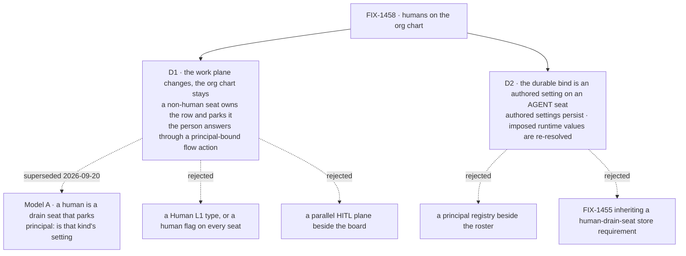

# FIX-1458 · Decisions

[Spec](SPEC.md) · **Decisions** · [Rules](BUSINESS-RULES.md) · [Plan](PLAN.md)

> **D1 was flipped on 2026-09-20, by the owner, after round 1.** The previous lean — *a human is
> an ordinary seat on a kind that parks, and `principal:` is that kind's own setting* — is
> **superseded**. It is written up as **Model A** under [Considered and dropped](#model-a), with
> why it lost, rather than quietly edited away. This is not review feedback and it is not a
> review round; it is a direction change, and the spec reads as one.

Two decisions, and they are the epic's two downstream-blocking walls
([ER-18](https://github.com/fixpoint-labs/flow-state-dev/blob/epic/living-workforce/spec/_epics/living-workforce/BUSINESS-RULES.md)).
Both are leaned on by running code before they are written down; the POC is
[`spec-poc/FIX-1458-principal-action/`](../../spec-poc/FIX-1458-principal-action/README.md) on
this branch.

## The tree

Solid edges are what you're signing. The first dashed edge off D1 is the one that moved this
week.

## D1 · The work plane changes; the org chart stays

**A non-human seat owns the task and parks it with a reason. The person acts through a flow
action bound to a principal, and the flow decides what the input means and continues.**

| | |
|---|---|
| **Instead of** | **Model A** — a human is an ordinary seat on a kind that parks, `principal:` its setting (the prior lean, superseded; [below](#model-a)) · a `Human` L1 type or a `human: true` flag every seat carries · a parallel HITL plane beside the board · humans racing agents as board drainers |
| **Because** | People do not do task work, they **answer for it**. A row that needs a person is a row an agent already owns and cannot finish alone — so the owner of the row never changes hands, and nothing has to model a person as a worker with a queue. And when the person does supply something, **the system still has to know what to do with it**: the flow owns the machine, so the answer arrives as an action's input and the flow's own branch reads it. That is what `unparkAndDrain` already is. What was missing is not a seat — it is the **bind** from a parked row to a principal, and a **caller** on the near end of it |
| **Locks in** | *Who is a person?* is not a question the roster answers, because no seat is one. A person is a **principal** that seats are bound to, and the org chart is a **reading** of those binds — so a person nobody's work is escalated to cannot be listed at all. That is the price, it is paid by whoever writes the view, and it is the open wall below rather than a hidden cost. The bind itself is an ordinary kind setting on an agent seat: declared in a closed `configSchema`, so one on a kind that never declared it refuses the **whole** roster by the key's name |

**What would change my mind:** a real case where a person must hold and dispatch their own
queue — pull work off a board, claim rows, be load-balanced against. Then they are a worker and
Model A was right. Nothing in W5 has produced one; the shapes that looked like it (approve,
provide input, unpark) are all *answer a row somebody else owns*.

**What the POC showed.** The whole chain runs: an agent-owned row parks, a stranger's request is
refused and the row is untouched, a payload *claiming* to be the right person changes nothing,
Dana's own request unparks it **in a later request**, the flow reads her words and settles the
row, and the org chart still lists her. Legs (a)–(d), with the `trust-input` and `no-park`
controls, in [the POC's README](../../spec-poc/FIX-1458-principal-action/README.md).

## D2 · The durable bind is an authored setting on an agent seat; what persists is split by provenance

| | |
|---|---|
| **Instead of** | A principal registry beside the roster · a durable-hire store that persists `{ id, kind }` and re-derives the rest · **FIX-1455 inheriting a human-drain-seat store requirement**, which under [D1](#d1) is now a requirement about a thing that does not exist |
| **Because** | A redeploy that forgets who owed a sign-off is the failure this exists to prevent, and under Model B the fact that carries it is `reviewedBy:` — an authored setting on an **agent** seat, the same class of thing as `answersFor:`. A file-declared roster already persists it: the file is the store. The exposure is the other hire path, a roster hired at runtime and replayed after a redeploy. A store keeping id and kind and re-deriving the rest would re-hire a seat whose parked work is owed to **nobody**, silently — an absent bind is refused nowhere, only a present-and-undeclared one is |
| **Locks in** | FIX-1455 inherits a requirement, not a suggestion, and it is **split by provenance**. What is **persisted** is what the seat's files authored — the kind's own settings (`reviewedBy:`, `answersFor:`, anything else the kind declares), `description`, the catalog names left in `tools:` — plus the manifest-derived text the factory imposes, which is all strings: `instructions`, `teamInstructions`, `seatSkills`. What is **re-resolved at hire**, never stored, is every runtime-only imposed value — `seatTools` above all, which the factory fills with live `BlockDefinition` objects off the app's registry (`packages/workforce/src/hire.ts` → `resolveDeclaredTools`). Those carry executable functions and no store round-trips them. Add to it, under Model B, the **principal / member** identities themselves: whoever a channel lists and whoever a seat is bound to must come back naming the same people |

**Round 1's reasoning survives the flip; what it applies to changed.** The authored-versus-imposed
split was argued from the real type and it is still correct — it is now aimed at **agent** seats'
settings rather than at a human seat's bag. The POC's leg (e) now **observes** it rather than
reasoning it: the bind survives a JSON round-trip, and the imposed tool block comes back with its
`execute` gone.

**What would change my mind:** durable hire turning out to re-read the tree on every boot rather
than replay a stored roster. Then there is no second path and the requirement is vacuous — worth
saying so out loud rather than leaving a rule nobody can fail.

## Decided, not asked

- **Waiting-on-you is the reading, not a value.** `parked` ∪ `blocked` with the row's own reason —
  the grouping `goals/manager-queue-lab/lab/queue.mts` already ships. The epic's
  [D3](https://github.com/fixpoint-labs/flow-state-dev/blob/epic/living-workforce/spec/_epics/living-workforce/DECISIONS.md#d3)
  settled it, the model flip does not touch it, and the POC only confirmed the substrate agrees.
- **The audience is derived, never stored.** Row → desk → the seat that drains it → its
  `reviewedBy:`. Three facts that already exist. No `audience` field, no widening of `awaitReview`.
- **Board assignee stays a drain key.** It resolves to a seat; it is not a person and never
  becomes one. Desk keys stay a different spelling from seat ids.
- **The deliverable is a leg on the existing manager-queue lab**, not a new lab and not framework
  surface. The lab that already routes a board to seats is where a principal-bound action joins
  that team with the least new code, and FIX-1430 set the precedent. The W4 ship fence
  **lifted** on 2026-09-20; this deliverable does not widen on the strength of it.
- **The refusal is a value, not a throw.** A request that is not the row's principal gets a
  verdict it can read. A refused answer is an ordinary outcome of asking, not an error.

## Considered and dropped

| Alternative | Why not |
|---|---|
| **Model A · a human is an ordinary seat on a kind that parks, `principal:` its setting** (the prior lean, signed off by nobody, superseded 2026-09-20) | Two reasons, and the second one is the POC's. **It models people as board drainers**, which is not what people do: an approver does not pull work off a queue, they answer for a row an agent already owns — so the seat bought a slot nobody sits in, and "who owns this row" changed hands for no reason. And **its own shape prevented the check that makes it trustworthy**: the answer arrived through the board's return trip, which carries `{ taskId, feedback }` and no caller identity, so naming a person made an accountability claim nothing could enforce. Round 1 had to narrow BR-8 to *the words were recorded* and park the gap as an open wall. Under Model B the answer arrives through an **action**, which carries a server-derived principal — the check becomes ordinary, and the POC runs it |
| A `Human` L1 type, or a `human: true` flag on every seat | The epic's invent-kill, and unnecessary twice over now: under Model B nothing needs to ask whether a seat is a person, because no seat is |
| A parallel HITL plane beside the board | The epic exists to end the second plane, not to build a tidier one. Model B's whole economy is that both halves already ship: the park loop, and the request principal |
| Give the person's row its own status, `waiting_on_you` | The epic's invent-kill, and independently wrong: a UI column in L1. `parked` already carries the reason, and the lab already groups it |
| Put the audience on the row as an `audience` field | A second copy of a fact the row already has. The assignee *is* the audience once you resolve it, and a stored copy is one more thing to keep true |
| Keep `flow: human` as a drain kind **beside** the action | Optional Lab chrome at best, and it re-opens the thing D1 just closed: two ways for a person to be in the system, one of which cannot be held accountable. Dropped, not demoted |
| Extend the suspension machinery (`human_approval`, `resolvedBy`) with a seat | It is the *other* plane. A suspension belongs to a request; a seat's work belongs to a row. Teaching suspensions about the roster builds the second plane the epic exists to end |
| A new `goals/human-seat-lab/` | A second host, a second tree, a second set of controls. Adding a principal-bound action to the team that already exists is the smaller change and the truer demo |

## Open

**None blocking.** Four walls stay open, and what follows is the evidence that nothing downstream
waits on them —
[ER-18](https://github.com/fixpoint-labs/flow-state-dev/blob/epic/living-workforce/spec/_epics/living-workforce/BUSINESS-RULES.md)
permits exactly that. None of them is an ask.

- **How people get onto the org chart: derived, or rows of their own?** Today the chart is a
  reading of the seats' binds, so a person appears because somebody owes them a sign-off — and a
  person **no seat names** cannot be listed. Three shapes are live: keep deriving it; give people
  inventory rows distinct from seats; or let them be seats with `drain: none`. Nothing in W5
  needs the answer, because every person W5 knows about is one somebody's work escalates to.
  FIX-1455's live inventory is where it becomes real.
- **A user-scoped private workforce under a principal's org** — the FIX-1442 lane. Model B makes
  the question askable for the first time, because a principal is now a first-class party to the
  work rather than an occupant of a slot. Nothing here opens it.
- **Multi-human authorization: who may call which action.** This issue binds **one** action to
  **one** derived principal. It says nothing about a review that two people may answer, a
  delegate, an escalation after a timeout, or an action a whole channel's membership may call.
  That is the shape multi-human takes under Model B — action authorization plus channel
  membership, **not** humans racing as drainers — and it is a wall, not a fork.
- **Where the board lives once more than one principal reaches it.** The POC found that a session
  belongs to one user: the runtime refuses a request arriving on another user's session before
  any block runs. So a board a person answers into cannot be session-scoped to the seat's
  session. Org scope is what the POC used and what the lab will use; a real app may want a
  narrower tenancy, and nothing here decides one.

## Settled

- **An agent-owned row can be parked by its own seat and the park survives the drain** —
  **CONFIRMED** by POC leg (b) and by
  `packages/integration-tests/src/scenarios/task-board-park-exit-across-requests.test.ts`, green on
  this branch. Re-proved on an agent-owned row after the flip. Do not reopen.
- **The answer can arrive in a later request** — **CONFIRMED**, POC leg (d5).
- **A flow action has a caller identity the app can check the answer against** — **CONFIRMED**,
  POC legs (d1)–(d4). `ctx.user.identity` carries the principal the runtime stamped from the
  transport's own resolver; a request that is not the row's audience is refused and the row is
  untouched, a payload *claiming* a principal is ignored, and repointing the bind in the tree
  flips the same request from allowed to refused. **This closes the half of round 1's third open
  wall that said there was nothing to check against.** What is *not* settled by it: nothing in
  the substrate forces an action author to run the check — that obligation is written as
  [BR-10 and BR-11](BUSINESS-RULES.md) with a red state, not left as prose — and no host's actual
  authentication is exercised here, because there is no transport in the POC.
- **A session belongs to one user, and the runtime enforces it** — **CONFIRMED**, POC leg (d0):
  *"Session s_ops is owned by user u_boot but request supplied user u_dana"*, thrown before any
  block runs. Consequence in Open, above.

## How it got here

- **Draft** — framed as *who owes this row*, not *how do we ask a human*; the research found the
  park-and-answer loop already shipped and unclaimed, so the design collapsed to one kind and one
  setting, proved by a POC before the two walls were written as decisions.
- **Round 1** — four items folded. The one that mattered: a reviewer showed BR-8 was disproved by
  the leg claiming to prove it, because the board's return trip carries no caller identity. The
  claim was narrowed and the gap parked as an open wall.
- **Owner amend, 2026-09-20** — D1 reopened and flipped to Model B. In hindsight round 1's finding
  was the first symptom of it: Model A could not be held accountable because the person was on the
  wrong end of the machine. The POC was replaced rather than re-graded, and the wall round 1 opened
  is now half closed by construction and half a business rule.
