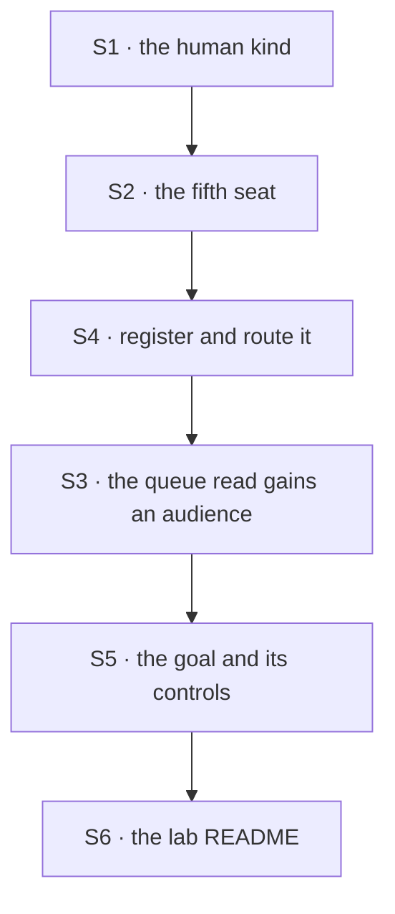

# FIX-1458 · Plan

[Spec](SPEC.md) · [Decisions](DECISIONS.md) · [Rules](BUSINESS-RULES.md) · **Plan**

Written for the implementing agent. IDs cross-reference [BUSINESS-RULES.md](BUSINESS-RULES.md)
(BR-n) and [DECISIONS.md](DECISIONS.md) (D-n). `tdd`. One PR.

**The shape is already proved** by [the POC](../../spec-poc/FIX-1458-human-seat/README.md) on this
branch. Your job is to put it on the team that already exists, with the controls a lab goal owes.

## Surfaces

| ID | Package · role | Change | Rules |
|---|---|---|---|
| S1 | `goals/manager-queue-lab/lab/workforce/flows/workers/` · a new human kind | The hireable kind: `workerConfigSchema()` extended with `principal` and `answersFor`, and the drain block that parks when `feedback` is absent and records the person's words when it is present. Lift it from the POC's `human-kind.mts` — it is the portable piece | BR-1 BR-3 BR-5 BR-8 BR-10 |
| S2 | `goals/manager-queue-lab/lab/workforce/teams/eng/workers/reviewer/WORKER.md` · a fifth seat | `flow: human`, `principal:`, `answersFor:` a **new** desk key. Add it to the channel's `members:` too | BR-1 BR-4 |
| S3 | `goals/manager-queue-lab/lab/queue.mts` · the existing `waitingOnYou` column | **Extend, don't replace.** It already groups `parked ∪ blocked` with the row's reason. Add the audience, resolved at read time: row → desk → the seat that answers for it → its `principal`. Writes nothing | BR-11 BR-12 BR-13 BR-14 |
| S4 | `goals/manager-queue-lab/lab/host.mts` · the seat registry and the drain's exit policy | Register the kind, route the new desk to the human drain, and put this goal's board on `onReview: "exit"` so the request ends while the row stays. Read what it is today first | BR-5 BR-7 |
| S5 | `goals/manager-queue-lab/it-waits-on-a-person-and-carries-on/` · the goal | `goal.md` and `run.mts` in the lab's house style: held-out inputs, legs grading the tree against the run, an anti-game paragraph, the two controls below. **This is the deliverable** | all |
| S6 | `goals/manager-queue-lab/lab/README.md` | One section: the team has a person on it, what that does to the queue read, how to run the goal | — |
| S7 | Removals | **None, deliberately.** The park loop and the column both already ship, and S3 extends the column rather than forking it. A second grouping function means you took a wrong turn | — |

**Nothing under `packages/*` or `apps/*`.** The epic's ship fence is open (BR-18).

## Sequence



## Checks

| ID | Runs after | Passes when |
|---|---|---|
| V1 | S2 | BR-1, BR-3, BR-4. The tree alone hires five seats; the human one's `kind` is the human kind; a seat with no `principal:` still hires. **Negative control:** `principal:` on the `builder` kind refuses the whole roster naming the key (BR-2) — the POC's control already does this, carry it over |
| V2 | S4 | BR-5, BR-6, BR-7. One drain, two desks: the person's row comes back `parked` with its reason and the drain exits `parked-for-review`; a builder's row on the same board completes; a **second** drain does not re-take the parked row |
| V3 | S3 | BR-11 to BR-14. The read names the seat and the person; a row with no assignee names neither; the ledger is byte-identical either side |
| V4 | S3 | BR-15. **`repointed-roster` control:** swap which seat answers for which desk in the tree, change nothing else, and V3 must go red naming the identity mismatch — and nothing else. A **swap**, not a one-sided re-point, for the reason the lab's own README already gives |
| V5 | S5 | BR-9, BR-10, BR-16. A second answer declines naming the status it found; a refusal settles the row carrying the person's words; the status enum matches a written-out list of seven |
| VG | S5 | **Goal, the acceptance criteria in full.** A row filed for the review desk waits on Dana by name, the request ends, and in a **later** request her answer finishes it — proved by a side effect outside the board, never by the board's own report. Model-free on the routing arm; the coordinator-files arm reuses the existing `GOAL_FILER` slot |
| V6 | S6 | BR-18. The diff is inside `goals/manager-queue-lab/`, derived from `git diff` against the merge base |

**Every control grades itself**, as the lab's existing goals do: a control that goes red at a leg
other than the one it names has demonstrated a different check, and the run says so loudly.

## Pinned names · three

| Where | Name | Why pinned |
|---|---|---|
| `WORKER.md` frontmatter | `principal` | [D1](DECISIONS.md#d1) locks it. It is what FIX-1455 will look for, and a synonym here costs a rename there |
| The kind | `human` | It is the value that reaches the inventory row's `kind`, so it is the string a reader keys on |
| The desk | a spelling that is **not** the seat id | BR-15 and the lab's existing discipline. Which spelling is yours |

Everything else is yours to name.

## Guardrails

| Rule | Because |
|---|---|
| The human kind stays in the lab; nothing in `packages/*` | The ship fence is open. A kind shipped now is built against a moving W4 floor, and built twice |
| The audience is computed at read time and written nowhere (tenet 3) | A stored copy of a fact the row already carries is how an `audience` field gets in through the back door |
| Extend the existing `waitingOnYou` grouping; add no second one (tenet 2) | Two groupings is two answers to *what is this team waiting on*, and `uncolumned` exists to catch the row that fell between them |
| No new `TaskStatus` member, asserted against a written-out list | The epic's core invent-kill. An enum asserted against a reading of itself cannot fail |
| Every leg grades the **tree** against the **run**, never the host's map against itself (BP-003) | The lab shipped this defect once and fixed it with `repointed-map`. V4 is the same control at the roster |
| The parked row's second path is a real leg (BP-035) | *Nobody answers* is a human seat's common case, and a board that quietly re-takes the row fails by looking like success |

## Docs

- **EXTEND** `goals/manager-queue-lab/lab/README.md` — one section, S6.
- **No `apps/docs` page, no `packages/*/README.md`, no changeset.** Nothing published changes, and
  a docs pass on human seats belongs to whichever child **ships** the drain
  ([ER-21](https://github.com/fixpoint-labs/flow-state-dev/blob/epic/living-workforce/spec/_epics/living-workforce/BUSINESS-RULES.md)).
  Writing it here would teach a surface no consumer can reach.
- **No `docs/architecture/` page either**, and that is a call worth stating: an architecture doc is
  an internal *contract*, and a human seat is not one until something ships it. The durable record
  of this shape is this spec, mirrored to Linear.

## Sketch · pseudocode, illustrative

```
the human seat's drain, given a claimed row:
    if the row carries no feedback:          ← nobody has looked at this yet
        park it, with the reason this seat asks
        return                                the board's recorders leave a parked row alone
    otherwise:                                ← the person answered; unpark wrote their words
        record their words as the outcome

the queue read, for each row already grouped as waiting:
    desk  ← the row's assignee
    seat  ← the seat whose own file answers for that desk
    if the seat's kind is the human one: name the seat and its principal
    otherwise:                                waiting, on no person
```

**POC:** [`spec-poc/FIX-1458-human-seat/`](../../spec-poc/FIX-1458-human-seat/README.md) — four legs
and a control. The premise **held**: the tree hires a person's seat with no change to
`hireWorkforce`, the row parks and survives the drain, the audience resolves from the tree, and the
answer lands in a later request. `POC_CONTROL=no-park` goes red first at leg (b). What it does
**not** grade is in its README.

## At implement time

- **Re-read the lab's `host.mts` first.** 637 lines, reviewed recently; `onReview` and the drain
  width knob may both have moved.
- **The W4 first cut may have landed.** If the board wiring changed shape, follow the code — this
  plan composes primitives, it does not claim their current signatures.

## Follow-ups

- **Graduate the human kind to `@flow-state-dev/workforce`** once the fence lifts and FIX-1455 finds
  it needs one. Not filed — it is [D1](DECISIONS.md#d1)'s change-my-mind, and FIX-1455 answers it.
- **Tell FIX-1455 what durable hire owes a human seat** ([D2](DECISIONS.md#d2)): the whole settings
  bag, round-tripped verbatim. Comment it up on the epic PR, don't decide it here (ER-17).
