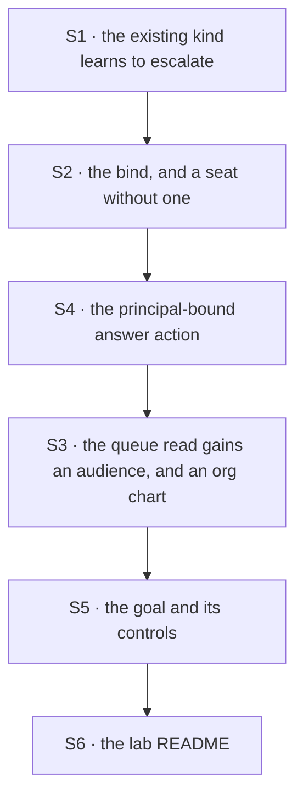

# FIX-1458 · Plan

[Spec](SPEC.md) · [Decisions](DECISIONS.md) · [Rules](BUSINESS-RULES.md) · **Plan**

Written for the implementing agent. IDs cross-reference [BUSINESS-RULES.md](BUSINESS-RULES.md)
(BR-n) and [DECISIONS.md](DECISIONS.md) (D-n). `tdd`. One PR.

**The shape is already proved** by [the POC](../../spec-poc/FIX-1458-principal-action/README.md)
on this branch. Your job is to put it on the team that already exists, with the controls a lab
goal owes.

> Rewritten for **Model B** ([D1](DECISIONS.md#d1), flipped 2026-09-20). There is **no human
> worker kind** in this plan. If you find yourself writing one, stop and re-read D1.

## Surfaces

| ID | Package · role | Change | Rules |
|---|---|---|---|
| S1 | `goals/manager-queue-lab/lab/workforce/flows/workers/builder.mts` · the **existing** agent kind | Extend the kind that already ships: its `workerConfigSchema()` gains an **optional** `reviewedBy` (BR-4 — a required one refuses the unbound seat at roster boot), and its drain gains the escalation branch: park when the row needs a person, and read `feedback` as the person's answer when it comes back. **No new kind.** Its drain still takes its **name per desk** — the board's worker router refuses two routes spelling one name, which is a fact about the board and survives the model flip unchanged | BR-2 BR-4 BR-6 BR-9 BR-14 |
| S2 | `goals/manager-queue-lab/lab/workforce/teams/eng/workers/` · the bind, and a seat without one | Put `reviewedBy:` on the seat whose rows get escalated. A second seat on the same kind and **no** bind is what BR-4 and BR-12 grade — put it in a **held-out tree variant** rather than parking an unbound desk in the demo team | BR-2 BR-4 |
| S3 | `goals/manager-queue-lab/lab/queue.mts` · the existing `waitingOnYou` column | **Extend, don't replace.** It already groups `parked ∪ blocked` with the row's reason. Add the audience, resolved at read time: row → desk → the seat that drains it → its `reviewedBy`. Writes nothing. Add the **org-chart read** beside it — seats and the people bound to them, from the same tree, also written nowhere | BR-5 BR-16 BR-17 BR-18 BR-19 |
| S4 | `goals/manager-queue-lab/lab/host.mts` · the answer action, and the board's scope | **The new surface, and the heart of the issue.** A flow action composed as a sequencer: a guard step that reads the caller from `ctx.user.identity`, derives who the row is owed to, and refuses a mismatch **as a value**; then, on the allowed branch only and through a connector, the board's own `unparkAndDrain`. Put the board on `onReview: "exit"`. **The ledger cannot be session-scoped** — a session belongs to one user and the runtime refuses a request on somebody else's, so the person's request arrives in their own session and the board lives at org scope (BR-15). Read what `host.mts` does today first | BR-6 BR-8 BR-9 BR-10 BR-11 BR-12 BR-15 |
| S5 | `goals/manager-queue-lab/it-waits-on-a-person-and-carries-on/` · the goal | `goal.md` and `run.mts` in the lab's house style: held-out inputs, legs grading the tree against the run, an anti-game paragraph, the controls below. **This is the deliverable** | all |
| S6 | `goals/manager-queue-lab/lab/README.md` | One section: rows this team escalates to a person, how the answer comes back, and how to run the goal | — |
| S7 | Removals | **None, deliberately.** The park loop, the column and `unparkAndDrain` all already ship, and S3 extends the column rather than forking it. A second grouping function means you took a wrong turn | — |

**Nothing under `packages/*` or `apps/*`** (BR-23). The W4 ship fence lifted on 2026-09-20 and
this deliverable **does not widen on the strength of it** — graduating any of this to
`@flow-state-dev/workforce` is FIX-1455's question, not yours.

## Sequence



## Checks

| ID | Runs after | Passes when |
|---|---|---|
| V1 | S2 | BR-1, BR-2, BR-3, BR-4. The tree alone hires the team and **no seat is a person**; the bound seat carries its principal and a sibling on the same kind carries none — grade the absence, not just the boot. **Negative control:** `reviewedBy:` on a kind that never declared it refuses the whole roster naming the key (BR-3) — the POC's control already does this, carry it over |
| V2 | S4 | BR-6, BR-7, BR-8. One drain, two rows: the escalated row comes back `parked` with its reason and the drain exits `parked-for-review` while the other completes; a **second** drain does not re-take the parked row; and the parked row's **owner never changed** |
| V3 | S3 | BR-16 to BR-19, and BR-4's read arm. The read names the seat and the person; a row whose desk resolves to a seat carrying **no** bind names the seat and no person; a row with no assignee names neither — three distinct answers, and a check that cannot tell the last two apart has not graded BR-4. The ledger is byte-identical either side. BR-5: the org chart lists the seats and the people in one read |
| V4 | S4 | **The accountability legs, and this is the issue.** BR-9 through BR-12. A stranger's request is refused **as a value** and the row is untouched; the same stranger with the right name in its **payload** is refused identically; a row owed to nobody refuses everyone; the bound principal's own request unparks it. **Negative control `trust-input`:** the guard reads the payload instead of the request, and the impostor's answer must **land** — a run where the control changes nothing has not graded BR-11 |
| V5 | S4 | BR-15. A request on a session it does not own is refused before any block runs, and the goal's wiring depends on that rather than working around it |
| V6 | S3 S4 | BR-20. **`repointed-roster` control:** change which principal the tree binds, change nothing else, and **both** V3 and V4 must go red naming the identity mismatch — and nothing else. Round 1's lesson applies here in its new home: a **swap**, not a one-sided re-point, and the control must move every arm it claims to, or it grades weaker than it reads |
| V7 | S5 | BR-13, BR-14, BR-21. A second answer declines naming the status it found; a refusal settles the row the flow's own way; the status enum matches a written-out list of seven |
| VG | S5 | **Goal, the acceptance criteria in full.** An agent-owned row is parked for a person, the request ends, and in a **later** request that person's own call finishes it — with the flow deciding what the answer meant, proved by a side effect outside the board rather than by the board's own report. Model-free on the routing arm; the files-the-row arm reuses the existing `GOAL_FILER` slot |
| V8 | S6 | BR-23. The diff is inside `goals/manager-queue-lab/`, derived from `git diff` against the merge base |

**Every control grades itself**, as the lab's existing goals do: a control that goes red at a leg
other than the one it names has demonstrated a different check, and the run says so loudly.

## Pinned names · three

| Where | Name | Why pinned |
|---|---|---|
| `WORKER.md` frontmatter | `reviewedBy` | [D1](DECISIONS.md#d1) locks the concept and [D2](DECISIONS.md#d2) makes it the thing a store must round-trip. It is what FIX-1455 will look for, and a synonym here costs a rename there |
| The guard's source of truth | `ctx.user.identity` | The whole claim. Reading the caller from anywhere else — an input field, metadata, a header the block parses — is the defect `trust-input` exists to catch (BP-031) |
| The desk | a spelling that is **not** the seat id | BR-20 and the lab's existing discipline. Which spelling is yours |

Everything else is yours to name — including the action.

## Guardrails

| Rule | Because |
|---|---|
| **No human worker kind, and no `flow: human`** | [D1](DECISIONS.md#d1). A second way for a person to be in the system is the one that cannot be held accountable |
| The audience is computed at read time and written nowhere (tenet 3) | A stored copy of a fact the row already carries is how an `audience` field gets in through the back door |
| Extend the existing `waitingOnYou` grouping; add no second one (tenet 2) | Two groupings is two answers to *what is this team waiting on*, and `uncolumned` exists to catch the row that fell between them |
| The refusal is a **value**, not a throw | A person who may not answer is not a fault, and a caller needs to be told which row is owed to whom |
| No new `TaskStatus` member, asserted against a written-out list | The epic's core invent-kill. An enum asserted against a reading of itself cannot fail |
| Every leg grades the **tree** against the **run**, never the host's map against itself (BP-003) | The lab shipped this defect once and fixed it with `repointed-map`. V6 is the same control at the roster, and it now has two arms to move |
| The parked row's second path is a real leg (BP-035) | *Nobody answers* is the common case, and a board that quietly re-takes the row fails by looking like success |
| Nothing ships to `packages/*` even though the fence lifted | The lift is not a licence. Graduating this is FIX-1455's question |

## Docs

- **EXTEND** `goals/manager-queue-lab/lab/README.md` — one section, S6.
- **No `apps/docs` page, no `packages/*/README.md`, no changeset.** Nothing published changes, and
  a docs pass on human-in-the-loop belongs to whichever child **ships** it
  ([ER-21](https://github.com/fixpoint-labs/flow-state-dev/blob/epic/living-workforce/spec/_epics/living-workforce/BUSINESS-RULES.md)).
  Writing it here would teach a surface no consumer can reach.
- **No `docs/architecture/` page either**, and that is a call worth stating: an architecture doc is
  an internal *contract*, and a principal-bound review action is not one until something ships it.
  The durable record of this shape is this spec, mirrored to Linear.

## Sketch · pseudocode, illustrative

```
the seat's drain, given a claimed row it owns:
    if the row carries no feedback and this row needs a person:
        park it, with the reason that person will read
        return                                the board's recorders leave a parked row alone
    if the row carries feedback:              ← the answer came back through the action
        THE FLOW decides what it means        approve releases it; anything else sends it back
    otherwise: do the work

the answer action, as a sequencer:
    step  guard:
        caller ← ctx.user.identity            ← NEVER the input payload
        owedTo ← desk of the row → the seat that drains it → its reviewedBy
        if owedTo is nobody:     refuse, as a value
        if caller is not owedTo: refuse, as a value, naming owedTo
        else allow
    tapIf allowed, connect {taskId, feedback} → the board's own unparkAndDrain

the queue read, for each row already grouped as waiting:
    name the seat its desk resolves to, and that seat's principal if its file names one
```

**POC:** [`spec-poc/FIX-1458-principal-action/`](../../spec-poc/FIX-1458-principal-action/README.md)
— five legs, three null arms and two controls, 37 checks green. The premise **held**: an
agent-owned row parks, a stranger is refused and the row is untouched, a payload claiming the
right name changes nothing, the bound principal's own request unparks it in a later request, the
flow reads the answer and settles the row, and the org chart still lists the person. The controls
`POC_CONTROL=trust-input` (red first at leg d, and the impostor's answer **lands**) and
`POC_CONTROL=no-park` (red first at leg b) both fire. What it does **not** grade is in its README
— above all that there is no HTTP transport in it, so no host's real authentication is exercised.

## Notes from review

Recorded verbatim from spec review round 1, for the implementer to weigh. Not folded into the
design above.

- **S3 · resolve the audience inside `queue.mts`** (cursor): "When you implement S3, consider
  resolving audience **inside** `queue.mts` (extend `QueueRow` / `queueView`) using the existing
  `WAITING` set, rather than a parallel `audienceOf` helper that re-states `parked | blocked`. PLAN
  guardrails already forbid a second grouping — this is the mechanical way to honor that."
  **Still applies** — the grouping did not move when the model flipped.
- **POC leg (d) is reviewer ergonomics** (cursor, on round 1's `DECISIONS.md:98`): "note explicitly
  that POC leg (d) is **reviewer ergonomics** over the same substrate proof, so implementers should
  not feel obliged to re-prove unpark mechanics in the lab goal beyond what VG needs for the human
  narrative." **Read this one with care now:** under Model B leg (d) is no longer ergonomics — it
  carries the accountability claim, and V4 is not optional.
- **POC nits** (github-code-quality): unused imports in the round-1 `run.mts` — *fixed in round 1,
  and that POC has since been replaced*; `strict: false` in the POC tsconfig and the leg list
  appearing in three places are left as they are. Never-merged code: tidy at your discretion, do
  not spend a round on it.

## At implement time

- **Re-read the lab's `host.mts` first.** 637 lines, reviewed recently; `onReview`, the drain
  width knob and the ledger's scope may all have moved — and S4 changes the last of those.
- **The W4 first cut has landed.** If the board wiring changed shape, follow the code — this plan
  composes primitives, it does not claim their current signatures.
- **Check `unparkAndDrain`'s current input schema** before wiring the connector. It was
  `{ taskId, feedback }` when this was written, and the guard's output has to connect to whatever
  it is now.

## Follow-ups

- **Tell FIX-1455 what durable hire owes the bind** ([D2](DECISIONS.md#d2)): every **authored**
  setting round-tripped — `reviewedBy:` among them — plus the principal and member identities
  themselves, with the imposed runtime values (`seatTools`, which holds live blocks) re-resolved at
  hire rather than stored. **FIX-1455 does not inherit a human-drain-seat store requirement**; if
  it already has one written down, that is stale and this supersedes it. Comment it up on the epic
  PR, don't decide it here (ER-17).
- **Multi-human action authorization** — who may call which action, a delegate, an escalation after
  a timeout. Not filed; it is an [Open wall](DECISIONS.md#open) and belongs to whichever issue first
  has two people in one review.
