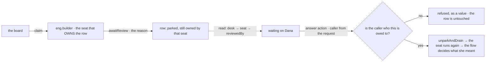

# FIX-1458 · Explore: people on the org chart, answering through flow actions

**Spec** · [Decisions](DECISIONS.md) · [Rules](BUSINESS-RULES.md) · [Plan](PLAN.md)

Exploration (Design + Feature) · `goals/manager-queue-lab` · small · 1 PR ·
epic [FIX-1457 · W5](https://linear.app/fixpoint-labs/issue/FIX-1457)

> **Direction changed on 2026-09-20.** The earlier shape — a person is a *seat* on the board that
> parks — was reopened and replaced by the owner. **The work plane changes; the org chart stays.**
> The flip, and why the old shape lost, is [D1](DECISIONS.md#d1).

## Four teams, before and after

| A team that… | Today | After |
|---|---|---|
| **needs a person to approve what a seat is doing** | Bolts an approval prompt onto one flow. It records a `userId` and, later, who resolved it. Nothing says who *owed* it, and the roster never knew it existed | The seat that owns the work parks its own row with a reason. Who the row is owed to is derived from the roster, and the person answers through an action bound to them |
| **asks "what is this team waiting on, and on whom?"** | Gets rows it can see and prompts it can't. The two lists live in different places and neither names a person | One read of the board: every waiting row, the reason already on it, and the person it is waiting on. Plus one org chart listing the people beside the agent seats |
| **is the person** | Answers in whatever UI was wired to that one flow | Calls one action. Their identity comes off the request, so an answer that is not theirs is refused and the row stays where it was |
| **redeploys** | The approval prompt's own record survives; who was supposed to answer it was never written down | The bind comes back with the seat, out of the same tree every seat comes back from |

**What does *not* change: who owns the work.** A row that needs a person is a row an agent already
owns and cannot finish alone. It never changes hands, nobody is added to the board to stand in for
a person, and no second plane appears beside it.

## What changes

![Two pictures side by side. Today: one box labelled the roster holds three agent seats and a running board row, and below a dashed fence sits a detached approval prompt carrying a userId and a resolvedBy, with an arrow that ends in nothing labelled nobody owes it. After: the same roster box with the same three agent seats and no human kind among them; one of them carries the setting reviewedBy u dana and holds its own board row, parked, with the reason on it. Outside the box stands u dana, a principal and not a seat, reached by a dashed derived arrow from the row, and answering back through a solid arrow labelled flow action, caller is the request's principal, which lands on the same seat that parked the row. Below the fence there is nothing at all.](figures/what-changes.svg)

Two arrows are the whole change. The **dashed** one is a reading: row → desk → the seat that
drains it → the principal that seat's file names. The **solid** one is an action, and the only new
surface here — the answer comes back through it, carrying a caller the runtime resolved rather
than a name the caller typed.

**The bind, as somebody writes it:**

```diff
  workforce/teams/eng/workers/builder/WORKER.md
  ---
  description: Builds the thing. Escalates anything over the desk limit.
  flow: builder
  answersFor: build-desk
+ reviewedBy: u_dana
  ---
```

That is the entire people-specific surface on the roster: **one setting on an ordinary agent
seat**, saying who its escalations are owed to. There is no human kind, no `principal:` identity
on a seat, no `Human` L1 type, no new task status, and `hireWorkforce` is not touched.

## How a row reaches a person and comes back



Both halves already ship. `awaitReview` parks a row with a reason, the board's own recorders refuse
to write over a row their worker parked, and `unparkAndDrain` brings the answer back in a **later
request** — proved by
`packages/integration-tests/src/scenarios/task-board-park-exit-across-requests.test.ts`. The
request principal is the framework's own auth contract (`ResolvedPrincipal`, stamped on every
inbound envelope). What was missing is anything joining them.

## What stays as it is

- **`TaskStatus`.** Seven members, unchanged. Waiting-on-you and Idle are readings, not values.
- **Board assignee.** Still a drain key that *resolves* to a seat. It is never a person.
- **`hireWorkforce`, `openChannels`, `openInventory`, the suspension machinery.** None gains a
  human branch. A seat's inventory row is `{ id, kind }`, and every seat is an agent.
- **Every published package.** Nothing ships here. The W4 ship fence lifted on 2026-09-20 and this
  deliverable deliberately does not widen on the strength of it.

## Need your sign-off

Three asks, hardest first. Nothing below them blocks.

### 1 · Is Model B right — people answer for work, rather than doing it?

**The fork.** When a machine needs a person, is that person **a worker who takes the job**, or
**someone the job is escalated to**? Model A said the first: a person holds a slot on the board
like any other worker, and pulls their rows off it. Model B says the second: the machine keeps the
job, stops, asks, and carries on when it hears back. [D1](DECISIONS.md#d1).

**In plain terms.** Could you explain it to a customer as *"your team's agents do the work, and
when one needs your call it waits for you and then keeps going"*? That is Model B. Model A would
be *"your people join the queue alongside the agents"*.

**The trade-off.** Model B costs you the ability to say a person "has a workload" the system can
balance — there is no queue that is theirs, so no report can say Dana is behind. It buys you an
answer that can be **held to the person who gave it**, which Model A structurally could not: under
Model A the answer came back through a channel with no caller on it, and naming Dana made a
promise nothing could keep. We had to write that down as an unclosed gap last round.

**My recommendation: take Model B.** Not only because it is what you asked for — because the POC
showed the accountability argument is not a preference. The same chain that was unprovable under
Model A is now nine green checks, including an impostor who is refused while the row stays put.

**What would change my mind:** one real case where a person must hold and dispatch their own
queue — claim rows, be load-balanced, be reported on as behind. Every shape W5 has produced so far
(approve, provide input, unpark) is *answer a row somebody else owns*.

**If I am wrong:** the lab leg is thrown away and W5's first spine point becomes substrate work
rather than composition — a few days, and the epic's *"a put-it-together epic"* framing
([D1](https://github.com/fixpoint-labs/flow-state-dev/blob/epic/living-workforce/spec/_epics/living-workforce/DECISIONS.md#d1))
goes with it. Cheap now; not cheap once FIX-1455 and FIX-1456 are built on it.

### 2 · Should the answer be refused when the caller is not the person it is owed to?

**The fork.** Record whoever answers and show it, or **refuse** an answer from anyone but the
person the row names.

**In plain terms.** If a row says *waiting on Dana* and someone else approves it, does the refund
go out?

**The trade-off.** Refusing means a team whose binds are stale gets stuck — a row owed to somebody
who left is a row nobody can answer until the tree is edited. Recording-and-showing never blocks,
but then *waiting on Dana* is decoration: the read says her name and the approval came from
anywhere. There is a third position we did **not** take: refuse, but let the app say who may
stand in. That is delegation, and it is an open wall rather than a decision.

**My recommendation: refuse.** An accountability claim you do not enforce is worse than none,
because the read looks trustworthy. The stuck case is loud, editable in one file, and much rarer
than the quiet case.

**What would change my mind:** an operational reality where binds go stale routinely — people
rotating weekly, cover during leave — in which case delegation is not a later wall, it is part of
this.

**If I am wrong:** one guard clause in a lab goal. This is the cheapest of the three to reverse.

### 3 · Is the durable requirement we are handing FIX-1455 the right one?

**The fork.** When a team is rebuilt after a redeploy, does the store owe **the bind** — who owed
this sign-off — or is `{ id, kind }` plus a re-read of the files enough?
[D2](DECISIONS.md#d2).

**In plain terms.** After a deploy, does the system still know who has to approve the big refunds?

**The trade-off.** Requiring the bind puts work on FIX-1455 it did not ask for, and it is only
load-bearing on one path: a roster hired at runtime and replayed, rather than re-read from files.
Not requiring it means that path comes back with the escalations owed to **nobody**, silently — no
error, no refusal, just rows that wait forever.

**My recommendation: require it**, with the split the POC observed: what the **files authored**
persists; what the hire step **imposes at runtime** — live tool blocks above all — is re-resolved,
because it does not survive a store round-trip at all.

**What would change my mind:** durable hire turning out to re-read the tree every boot. Then
there is no second path and the requirement is vacuous.

**If I am wrong:** FIX-1455 carries a requirement it did not need — wasted effort, no incorrect
behaviour. **Note for FIX-1455 either way:** the old version of this requirement named a *human
drain seat's* settings. That thing no longer exists; if it is written down over there, it is stale.

---

**Open: none blocking.** Four walls stay open with the evidence that nothing downstream waits on
them, in [DECISIONS.md → Open](DECISIONS.md#open) — how people get onto the chart when no seat
names them, a user-scoped private workforce, who may call which action when more than one person
is involved, and where the board lives once several principals reach it. The cases:
[BUSINESS-RULES.md](BUSINESS-RULES.md). The build: [PLAN.md](PLAN.md).
