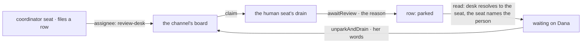

# FIX-1458 · Explore: humans-in-seats (HITL as seat identity)

**Spec** · [Decisions](DECISIONS.md) · [Rules](BUSINESS-RULES.md) · [Plan](PLAN.md)

Exploration (Design + Feature) · `goals/manager-queue-lab` + `docs/architecture` · small · 1 PR ·
epic [FIX-1457 · W5](https://linear.app/fixpoint-labs/issue/FIX-1457)

## Four teams, before and after

| A team that… | Today | After |
|---|---|---|
| **needs a person to approve what a seat is doing** | Bolts an approval prompt onto one flow. It records a `userId` and, later, who resolved it. Nothing says who *owed* it, and the roster never knew it existed | The row is assigned to a desk the person answers for. It sits on the same board the agents drain, waiting on them by name |
| **asks "what is this team waiting on, and on whom?"** | Gets rows it can see and prompts it can't. The two lists live in different places and neither names a person | One read of the board: every waiting row, the reason already on it, and the seat — and so the person — it is waiting on |
| **is the person** | Answers in whatever UI was wired to that one flow | Holds a seat. Appears in the inventory, sits on channels, and drains the rows addressed to them. The difference from an agent seat is that they answer instead of a model |
| **redeploys** | The approval prompt's own record survives; who was supposed to answer it was never written down | The person's seat comes back from the same tree every other seat comes back from, still bound to them |
| **wants a new status column for this** | — | Doesn't get one. Waiting-on-you is a **reading** of rows that are already parked ([D2](DECISIONS.md#d2)) |

**Why this is an exploration and not a build.** W5's other two rows cannot be specced until a
person in a seat has a shape, and the shape was an open fork: is a human seat its own kind, or an
agent seat with a binding? This answers it, on evidence, and ships nothing to a published package —
the W4 first cut is still in motion and the epic's ship fence ([D4](https://github.com/fixpoint-labs/flow-state-dev/blob/epic/living-workforce/spec/_epics/living-workforce/DECISIONS.md#d4)) holds.

## What changes


The fence is the whole change. Today the person is *outside* the roster box; after, they are a seat
inside it. Nothing in the box is new — same board, same inventory, same seven task statuses.

**The seat, as somebody writes it:**

```diff
  workforce/teams/eng/workers/reviewer/WORKER.md
+ ---
+ description: Dana. Approves anything over the desk limit.
+ flow: human
+ principal: u_dana
+ answersFor: review-desk
+ ---
+ Rows filed for the review desk wait on you.
```

That is the entire human-specific surface: a kind that parks, and a setting naming who sits there.
`hireWorkforce` is not touched, `TaskStatus` is not touched, the inventory is not touched.

## How a row reaches a person and comes back



The loop already exists. `awaitReview` parks a row with a reason, the board's own recorders refuse
to write over a row their worker parked, and `unparkAndDrain` brings the answer back in a **later
request** — proved today by `packages/integration-tests/src/scenarios/task-board-park-exit-across-requests.test.ts`.
What was missing is a seat on the near end of it.

## What stays as it is

- **`TaskStatus`.** Seven members, unchanged. Waiting-on-you and Idle are readings, not values.
- **Board assignee.** Still a drain key that *resolves* to a seat. The desk keys stay a different
  spelling from the seat ids, so nothing can quietly conflate them.
- **`hireWorkforce`, `openChannels`, `openInventory`, the suspension machinery.** None gains a
  human branch. A seat's inventory row is `{ id, kind }` either way.
- **The kitchen-sink and every published package.** Nothing ships here.

## Sign off

1. **[D1](DECISIONS.md#d1) · A human seat is an ordinary seat on a kind that parks, and `principal:`
   is that kind's own setting — not a new type, a flag, or a framework-level bind.** If wrong: W5's
   first spine point is substrate work, not composition, and the epic's [D1](https://github.com/fixpoint-labs/flow-state-dev/blob/epic/living-workforce/spec/_epics/living-workforce/DECISIONS.md#d1)
   ("a put-it-together epic") is wrong with it. **This is the one to weigh.**
2. **[D2](DECISIONS.md#d2) · A human seat persists exactly as an agent seat does, and what durable
   hire owes it is the seat's whole settings bag — not `{ id, kind }`.** If wrong: FIX-1455 ships a
   store that re-hires people bound to nobody, silently, and the failure shows up as work waiting on
   an empty chair.

**Approving these two closes the epic's two downstream-blocking walls**
([ER-18](https://github.com/fixpoint-labs/flow-state-dev/blob/epic/living-workforce/spec/_epics/living-workforce/BUSINESS-RULES.md)) —
a lean becomes a decision only here. **Open: none blocking.** The other two walls stay open, with the
evidence that nothing downstream waits on them, in [DECISIONS.md](DECISIONS.md#open). The cases:
[BUSINESS-RULES.md](BUSINESS-RULES.md). The build: [PLAN.md](PLAN.md).
