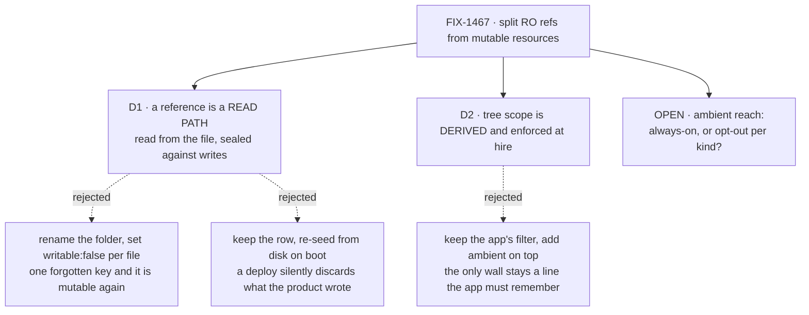

# FIX-1467 · Decisions

[Spec](SPEC.md) · **Decisions** · [Rules](BUSINESS-RULES.md) · [Plan](PLAN.md)

Two decisions and one open fork are the sign-off surface. The POC that moved this document is
[`spec-poc/FIX-1467-references-vs-resources/`](../../spec-poc/FIX-1467-references-vs-resources/).

## The tree

Solid edges are what you're signing. Dashed edges lost, and the label says why.

## D1 · A reference is a read path, not a renamed folder: `references/` is read from the file rather than from a stored row, and is sealed against writes

| | |
|---|---|
| **Instead of** | Renaming `resources/` to `references/` and relying on `writable: false` **written in each file's frontmatter by its author** — the folder name carrying no behaviour of its own. (The chosen path does *use* `writable: false`, but the install half sets it for every file in the folder and the convention refuses a document that declares it. The difference is who holds the key, and it is the whole difference — see [feasibility](#d1-feasibility)) |
| **Because** | There is no read-only thing to rename. The POC wrote to an org handbook through an ordinary seat and read it back from a fresh context: `expected 'DEFACED' to contain 'ORG HANDBOOK v1'`. Today's document is *already* seed-then-evolve — the disk body is a first-boot seed, a write persists, and the file in git becomes dead weight that nothing reports |
| **Locks in** | Org knowledge becomes deploy-only. Nobody fixes a handbook typo from inside the product, ever; they move the file to `resources/` and accept that the row becomes the source. In exchange the reverse promise holds: what is in git is what the agents read |

The issue's framing was that Door A behaves like a skill's `references/` and needs the matching
name. Half of that survived checking. The model cannot write one (`llmWritable` is off by
default), which is why it *feels* read-only; code can (`writable` is on by default), and after
one write the persisted body wins forever. So the work is a read path that does not exist yet,
and the folder name follows from it rather than the other way round.

**What would change my mind:** a handbook someone genuinely wants edited in-product *and* kept
in git. That is two sources of truth, and it needs a sync story rather than a read path.

### Does D1 need a core/engine contract change? **No** — at the cost of one word

Review round 1 asked this directly, because the answer decides whether FIX-1467 collides with
epic [FIX-1457](https://linear.app/fixpoint-labs/issue/FIX-1457)'s D1 (*"W5 is composition, not a fourth substrate epic"*). It was
settled by running it, not by arguing it: POC **leg 5**, five green checks on `main`. D1 has two
halves and they have different answers.

| Half | On today's core API | Evidence |
|---|---|---|
| **(a) Nothing can write it** | **Expressible.** `writable: false` is enforced in the engine and refuses by name | `resource-registry.ts:1971` (and `:931`, `:1152`, plus `resource-routes.ts` for HTTP) · leg 5a |
| **(b) The file is the source** | **Expressible per execution context.** `contentFile` is re-read whenever a context is built, so an edit in git reaches the next request | leg 5b |
| **(b) literally "every read"** | **Not expressible.** `readContent()` reads an in-memory map; core's only read-time content hooks are `contentTemplate`, `contentTemplateRef` and `render`, and none touches the filesystem | leg 5e |

**The two halves are not independent — (a) is what makes (b) work.** A stored row wins over
`config.contentFile` exactly as it wins over `config.content` (`resource-registry.ts:502`), so
`contentFile` on its own is a first-boot seed with a longer name: one write and the file never
comes back (leg 5c). Sealed, no row can ever exist, so the file is re-read every time. That is
why "rename the folder and set `writable: false`" and "build the read path" are not two
alternatives — the seal *is* half the read path.

**What this costs: D1 says "on every read"; what is buildable is "on every execution context."**
BR-3 already declines to promise hot reload, so no rule changes — but the sentence does, and it
is in the sign-off surface. A mid-request edit is not seen.

**The Architect's objection is answered by who holds the key, not by a new mechanism.** *"One
forgotten key restores the write"* is true of a key an **author** writes. The fix is to take the
key off the author. `contentFile` is already a **derived** key (`manifest.ts:519-528`) — the
convention refuses a document that declares one and the install half sets it. `writable` is
**not** derived today, and that is the one real gap: it currently passes through from frontmatter.
Closing it is a references-specific derived set (`DERIVED_RESOURCE_KEYS` + `writable`), not a core
change — and it is what BR-12 already asks for. The shared list must not gain `writable`, because
a `resources/` document may legitimately declare it (BR-13).

**A core change is needed only for two things this spec does not require:** a `ResourceRef` that
does not *carry* `writeContent()` at all (today's is a runtime refusal on a handle that still has
the method — Codex's type reading is correct, it just is not load-bearing), and literal
disk-on-every-read. Both are additive later.

**One residual, and it is work rather than a contract.** Sealing stops new writes but cannot evict
a row that is already there, and that row still wins — so for a tree something has *already*
written, the git-is-source promise does not hold until the row is cleared (leg 5d). That makes
S7 a data migration, which [PLAN](PLAN.md#at-implement-time) had recorded only as an open question.

## D2 · The tree scope is derived from the path and enforced where a seat is minted, replacing the app's hand-written install filter

| | |
|---|---|
| **Instead of** | Keeping `documents.filter(d => d.ref.startsWith("teams/engineering/"))` as the documented way to scope a kind, and layering ambient inherit on top |
| **Because** | Cross-team isolation is a hole, not a property to preserve. The POC hired an ordinary seat with no grant list and read another team's handbook off it. The wall exists only as a line the app remembers to write; when it is missing nothing warns and nothing logs. The loader already mints `teams/<id>/<name>`, so the wall can be derived from what it knows |
| **Locks in** | Where a file sits becomes a permission, so moving one between team folders needs the care a grant change needs. **And the tree becomes the only way to widen** — there is no install-side override, because one would make the wall optional again (review round 1 cut the rule that promised one; see [BUSINESS-RULES](BUSINESS-RULES.md#the-team-wall)). A document that should reach more people moves up the tree |

The issue said per-seat whitelist sync would not scale. On `main` it already does not apply:
absent `resources:` narrows **nothing**, so no seat whitelists anything. The cost actually paid
is one level up — a hand-written filter per kind, invisible and unenforced. That is a better
argument for this ticket than the one it was filed with, and the same fix.

**What would change my mind:** a scoping shape the org → team → worker tree cannot express, such
as a document two sibling teams share. Then the tree is the wrong axis.

## Decided, not asked

- **`writable: false` is not the mechanism.** It stays available on a `resources/` document; a
  per-file opt-in simply cannot carry a convention.
- **Absent `references:` means ambient, present means narrow.** The only reading under which the
  shipped absent-is-not-empty rule in `hireWorkforce` stays coherent.
- **Invent-kills honoured:** no References L1 type; no dual-run under both folder names; no
  shared loader with skill `references/`; no second registry or merged md+ts scan; D-11 not
  reopened.
- **[#1943](https://github.com/fixpoint-labs/flow-state-dev/pull/1943)'s grant keeps its shape** — bare is `ro`, `rw` is the extra word, a grant narrows
  and never widens. [FIX-1381](https://linear.app/fixpoint-labs/issue/FIX-1381) D1–D3 untouched.

## Considered and dropped

| Alternative | Why not |
|---|---|
| Rename the folder, set `writable: false` per file **in the author's frontmatter** | The convention would rest on a key an author can forget, and the POC's control shows one forgotten key restores the write path. Not an argument against the key — against who writes it |
| Keep the row, re-seed from disk on every boot | A deploy silently discards whatever the product wrote — destroying data is worse than stranding a file |
| Keep the app's filter, add ambient reach on top | Leaves the only cross-team wall optional, and adds a second access mechanism beside it (tenet 5) |
| Do nothing; teach `writable: false` in the docs | The honest cheapest contender. Fixes neither red leg: the file still stops being the source, and the cross-team read is untouched |
| Claim the bash mount here | References are on no mount at all, so it is net-new with its own shape. It belongs to [FIX-1382](https://linear.app/fixpoint-labs/issue/FIX-1382); absorbing it hides a second feature in a rename |
| `defineExternalResourceCollection` ([FIX-858](https://linear.app/fixpoint-labs/issue/FIX-858)) as the read path | Read-only by construction, so the instinct is right, but wrong on two counts. **Altitude:** external collections are app-owned store read-through — `read`/`search` hooks, a wildcard `pattern`, a collection runtime. A reference is a *per-file* entry sharing `mintResourceRef` and one namespace with `resources/` (BR-15), which is `defineResource` composition. **Content contract:** external content is only exposed through `contentTemplate` Liquid rendering, and `readContentRaw()` falls through to *"external collections have no raw content store"* — D1 needs the verbatim disk body (BR-1, V2's `DEFACED`), so that gap alone rules it out without a substrate change. It would also reintroduce a parallel entry path beside the mutable document door, against an invent-kill already on this page |

## Open · one live fork

**Does a reference reach every seat under its scope automatically, or does an operator get a
switch to turn that off for a kind or an org?**

- **In plain terms.** Whether a newly hired agent automatically knows the company handbook, or
  somebody has to remember to let it.
- **The trade-off.** Always-on means hiring costs zero configuration, and anything dropped into
  `org/references/` reaches everyone under that org — the blast radius of adding a file is
  *everybody*. A switch lets a tight team run tight, and adds a setting people forget, which
  surfaces as an agent that mysteriously does not know the handbook.
- **Recommendation: always-on, no switch.** The narrowing that matters is the tree, and a seat
  wanting less already has an explicit `references:` list. A switch is a third mechanism beside
  two that work.
- **What would change my mind:** a seat that must read *nothing* ambient — a contractor desk, an
  untrusted agent. That is an isolation level, not a narrowing, and needs its own answer.
- **What being wrong costs:** little, and asymmetrically. Adding an opt-out later is additive;
  removing an always-on default later breaks every app that leaned on it.

## Carried open · recorded, not put to the owner

The issue named four things that must not be pretended locked. One is the fork above. These
three are **not** on the sign-off surface, because none can be decided before the direction is:

- **Exact `WORKER.md` key names.** The spec writes `references:` so the prose reads;
  [PLAN.md](PLAN.md#pinned-names) pins it as *deliberately unpinned*, settled at implement time.
- **Migration order.** Sequencing, in [PLAN.md](PLAN.md#sequence). Constrained by one thing: no dual-run.
- **How templates under `resources/` seed without reading as read-only docs.** Partly answered:
  today *everything* seeds-then-evolves, so a template is the ordinary case and a reference is
  the new exception. Whether that suffices is [FIX-1388](https://linear.app/fixpoint-labs/issue/FIX-1388)'s question.

**One finding belongs to the epic, not here.** Every document is minted `scope: "org"`, so the
tree is a *name*, not a storage scope — D2's wall is enforced at mint time and cannot narrow two
people acting under the same org principal. That meets W5's principal-bound action authorization
in [FIX-1455](https://linear.app/fixpoint-labs/issue/FIX-1455). Raised, not resolved here.

## Settled

All by the POC, on `main`, with a one-input control beside each red:

- **The disk body is a first-boot seed, not the source** — **CONFIRMED**, and it refutes the
  issue's framing. `expected 'DEFACED' to contain 'ORG HANDBOOK v1'` (leg 3).
- **An ungranted seat reads another team's references** — **CONFIRMED** (leg 2).
- **Loaders walk `workforce/**/resources/` and mint path-qualified refs** — **CONFIRMED** (leg 1).
- **A reference is on no bash mount** — **CONFIRMED.** A document is a single resource with no
  `pattern`; `discoverMounts` keeps collections only. The check was retired in review round 1 —
  it was red against a promise this spec does not make, which inflated the failure count. The
  finding stands; the leg does not.
- **An ungranted seat reaches a mutable resource** — **CONFIRMED** (leg 4), and it is BR-14's
  required behaviour, not a gap. An earlier draft had this backwards; review round 1 caught it.
- **D1 needs no core/engine contract change** — **CONFIRMED** (leg 5). Five checks;
  [the write-up is above](#d1-feasibility).

## How it got here

- **Draft** — framed as the issue's vocabulary rename; POC built first, against `main`.
- **POC** — reframed D1 from *rename the folder* to *build the read path*, because the disk body
  is a seed. Reframed D2's argument from *per-seat whitelist sync* to *the app's per-kind
  filter*, because absent-key already inherits. Moved the bash mount out of scope.
- **Review round 1** — answered the question the round was really about: **D1 needs no core/engine
  contract change** ([feasibility](#d1-feasibility), POC leg 5), so W5 stays composition. Narrowed
  D1's promise from *every read* to *every request*, which is what is buildable. Killed
  `defineExternalResourceCollection` as the reuse candidate. Fixed a contradiction the spec had
  with itself about mutable grants — SPEC, the figure and POC leg 4 all said a grant was required;
  BR-14 was right and they were wrong. Cut BR-8 and the old BR-10, both unexercisable. Gave the
  POC a valid team-qualified seat, retired the out-of-scope mount leg, and found one new thing:
  sealing cannot evict a row that already exists, which makes S7 a data migration.
