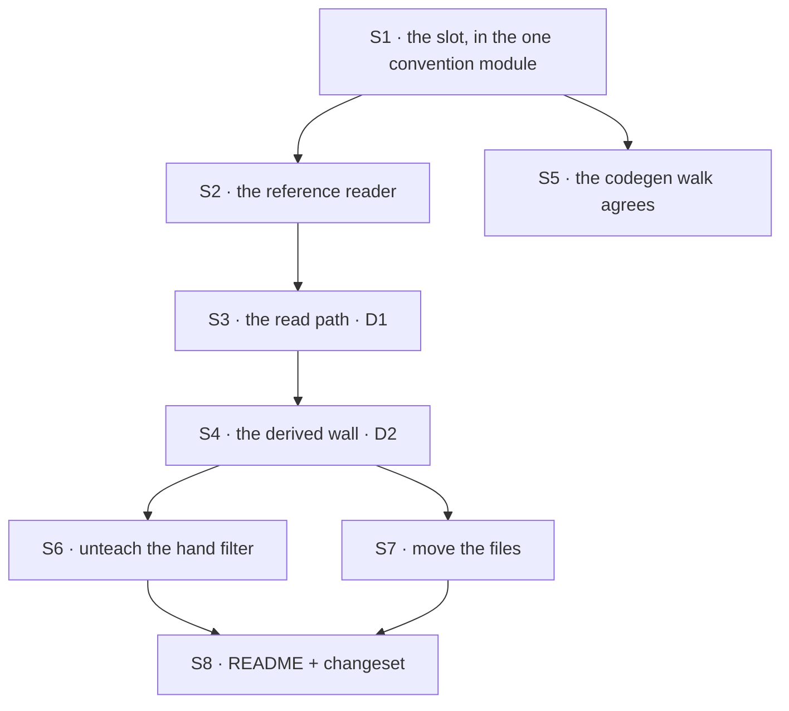

# FIX-1467 · Plan

[Spec](SPEC.md) · [Decisions](DECISIONS.md) · [Rules](BUSINESS-RULES.md) · **Plan**

Written for the implementing agent. IDs cross-reference [BUSINESS-RULES.md](BUSINESS-RULES.md)
(BR-n) and [DECISIONS.md](DECISIONS.md) (D-n). `tdd` — the red state already exists, in
[`spec-poc/FIX-1467-references-vs-resources/`](../../spec-poc/FIX-1467-references-vs-resources/).
One PR.

FIX-1467 is filed as an *exploration*: the gate approves the direction, and whether the build
lands here or as filed children is the epic's call ([Follow-ups](#follow-ups)). The surfaces
below are the shape either way.

## Surfaces

| ID | Package · role | Change | Rules |
|---|---|---|---|
| S1 | `workforce` · `loader/resource-convention.ts` | Add the `references/` slot beside `RESOURCES_SLOT`, minted by the same `mintResourceRef`. In that one module, as today — it exists so two doors cannot disagree about the convention | BR-15 |
| S2 | `workforce` · a reader beside `loader/read-resources-directory.ts` | Walk `references/` at org, team and worker level. Same symlink and slot discipline, same collect-don't-throw. Records carry the **file path**, not a body destined for a row | BR-1 BR-18 |
| S3 | `workforce` · the install half, beside `resources-from-docs.ts` | **D1's whole seam.** Swap `content: doc.body` for `contentFile: <abs path>` **and** `writable: false`. Both halves, together — see the pinned caching note below, and [D1 feasibility](DECISIONS.md#d1-feasibility) for why neither works alone. `contentFile` is already derived (`manifest.ts:519-528`); **`writable` is not** — the references door needs its own derived set, `DERIVED_RESOURCE_KEYS` **+ `writable`**, so a document cannot unseal itself. Do **not** add `writable` to the shared list: a `resources/` document may legitimately declare it (BR-13) | BR-1 BR-2 BR-11 BR-12 |
| S4 | `workforce` · `hire.ts` + a `seat-references.ts` beside `seat-resources.ts` | Derive each seat's reachable set from its place in the tree (D2), then apply an explicit `references:` list as a narrowing. Separate module — one permission boundary per module is why that file exists | BR-4 BR-5 BR-6 BR-7 BR-9 BR-10 |
| S5 | `workforce` · the codegen walk (`codegen/discover*.ts`) | Teach it the slot so the module door and the document door still agree on which folders the convention covers | BR-15 |
| S6 | Docs · `apps/docs/docs/workforce/documents-on-disk.md` | **Remove** the hand-filter recipe and the sentence teaching that every document is reachable with no per-team filter. Wrong advice once D2 lands, and leaving it keeps two answers alive | BR-10 |
| S7 | Labs / kitchen-sink trees | Move handbook-shaped `.md` files into `references/`. **Not files only.** A stored row written before the move still wins over the file (POC leg 5d), so any ref that has ever been written needs its row cleared or the move is cosmetic | BR-16 BR-17 BR-19 |
| S8 | `workforce` · `README.md` + one `minor` changeset | Public convention change on a published package (BP-022) | — |

**Removed on purpose** (tenet 3): the docs' filter recipe (S6), and — with S7 — every
author-written `writable: false` key in a migrated file. Not because the key is wrong, but
because S3 sets it for the whole folder: a copy in frontmatter is now a second place the same
fact lives, and BR-12 refuses it outright.

<a name="caching"></a>
### Pinned: how fresh a reference read is

Review asked this be settled before implementation, because `grepResourceContent` and
`searchResources` loop `readContent()` per ref and an unpinned answer risks a silent search/grep
regression. **It is `contentFile`, loaded when the execution context is built.** Not literal disk
on every call, and not a new per-read hook.

- **No regression risk.** `readContent()` keeps reading the in-memory map it reads today, so a
  grep over a hundred handbooks does the same zero disk I/O it does now. The file is read once per
  context, the way `contentFile` already behaves.
- **BR-2 holds** — a fresh context is built per request, so an edit in git reaches the next one.
- **BR-3 stays honest:** a mid-request edit is not seen. [D1's](DECISIONS.md#d1-feasibility) "every
  read" is "every execution context"; that is the buildable shape and the one to write.
- **The seal is load-bearing, not decoration.** A stored row wins over `contentFile`
  (`resource-registry.ts:502`), so without `writable: false` the file stops being the source after
  one write. Ship S3's two halves together or ship neither.

<a name="sequence"></a>
## Sequence

Migration order was left open. One constraint decides it — no dual-run — so loaders first,
trees last.



## Checks

| ID | Runs after | Passes when |
|---|---|---|
| V1 | S2 | Org, team and worker `references/` load; a directory in the slot is reported; a non-`.md` is passed over (BR-18) |
| V2 | S3 | BR-11 red→green: the POC's `DEFACED` case returns the file's body. BR-12 refuses by name. BR-2 across a restart, **never** asserted as immediate (BR-3) |
| V2b | S3 + S7 | **BR-19, the migration hole.** A row written *before* the seal still shadows the file (POC leg 5d). Assert the file wins for a ref that already had a row — the fresh-tree case passes either way and would hide this |
| V3 | S4 | BR-7 red→green **with no app filter written**. BR-4, BR-5, BR-6, BR-9 |
| V4 | S4 | **The second path (BP-035): BR-14.** A seat with no `resources:` key still reaches every mutable resource, exactly as today. The regression that would otherwise ship silently. POC leg 4 already pins it green — keep it that way |
| V5 | S4 | BR-10: a reference placed higher in the tree reaches seats on more than one team, and **no install-side slice widens past the wall** |
| V6 | S3 + S4 | BR-13: the existing `seat-resources` and `read-resources-directory` suites pass **unchanged**. A diff to either signals this touched the mutable path |
| VG | S7 | Goal, real path: a tree on disk → loader → `hireWorkforce` → a live execution context, asserting the two acceptance criteria. Adapt the POC file; it runs them red today |

<a name="pinned-names"></a>
## Pinned names

| Where | Name | Why |
|---|---|---|
| The folder | `references/` | Public. A person types it, and it is the issue's lock |
| The ref | unchanged — `teams/<id>/<name>`, path-joined | Already minted by `mintResourceRef`. References and resources share one namespace, which is what makes BR-15 checkable |

**Deliberately unpinned: the `WORKER.md` key.** The issue left the spelling open; the spec writes
`references:` so the prose reads. Settle it against real files, and read it from one exported
constant the way `SEAT_RESOURCES_KEY` is — a renamed key with a literal left behind is an access
grant that silently does not apply.

## Guardrails

| Rule | Because |
|---|---|
| The reference path has **no** write function to disable — not a disabled one | D1 holds only if there is nothing to turn back on. `writable: false` is a setting; an absent verb is a contract |
| Reachability is decided in **one** module, as `seat-resources.ts` is (tenet 5) | A permission boundary with two construction sites is the failure that surfaces as "it worked in testing" |
| Absent, present-and-empty, and present-with-entries stay three answers | The hire step is built on that distinction; collapsing absent into empty locks every seat out of everything |
| A `references:` entry selects, never defines (BP-031) | A seat file is author-controllable input, and the unmatched-ref refusal already has a wording to match |
| Leave the mutable path byte for byte alone (BP-030) | BR-13/BR-14. The cheapest way to break W5 is to tidy the shipped grant while passing |
| Do not touch the bash mount | Genuinely net-new and [FIX-1382](https://linear.app/fixpoint-labs/issue/FIX-1382)'s. Confirmed, and recorded in [Settled](DECISIONS.md#settled); the POC leg that asserted it was retired in review round 1 for being red against a promise this spec does not make |

## Docs

- **EXTEND** `apps/docs/docs/workforce/documents-on-disk.md` — a `references/` section, and
  **delete** the filter recipe (S6). *Voice risk:* the outsider rule. Don't write "used to seed a
  row" or mention the drift; describe what the folder does.
- **EXTEND** `packages/workforce/README.md` — the convention table gains the slot; the ref table
  is unchanged, which is worth one sentence.
- **No new page.** One section under an existing concept.

## Sketch · pseudocode, illustrative, react to the shape

```
loading:
    walk references/ at org, team and each worker      (same walk primitives as resources/)
    each file -> a record carrying its PATH, not a body

installing:
    each record -> an L1 entry whose content is READ FROM THE FILE
                   and which exposes no write verb at all      <- D1, the whole seam

hiring one seat:
    reachable  <- every reference at or above this seat's place in the tree   <- D2
    if the seat declares references:
        refuse any entry not in reachable       (select, never define)
        reachable <- what it named
    mint the seat with reachable
```

**POC:** [`spec-poc/FIX-1467-references-vs-resources/`](../../spec-poc/FIX-1467-references-vs-resources/)
on this branch — 15 checks, **12 green and 3 red on `main`**, and the three reds are the work.
Each red is paired with a control that changes one input and goes green, so the red is the gap and
not the harness. It refuted the premise that Door A documents are read-only on disk, and that the
per-seat whitelist is today's default. **Leg 5 is all green by design** — it is not work, it is the
[D1 feasibility answer](DECISIONS.md#d1-feasibility) run rather than argued. Its README has the run
command and the leg-by-leg verdicts.

## Notes from review

Raised in review round 1, below the direction bar — recorded for the implementer, not folded into
the approach. Each is a judgement call at implement time, not a decision the gate needs.

- **One parameterized walk, not a second reader.** S1/S2/S5 are three rows for "same convention,
  same walk, codegen agrees." Parameterize the existing tree walk rather than forking a second
  ~400-line `read-resources-directory` clone — it matches `resource-convention.ts`'s "two doors,
  one ref rule" comment and keeps cross-imports shallow. *(cursor)*
- **`seat-references.ts` shares, it does not copy.** A sibling module beside `seat-resources.ts`
  is still right (tenet 5, and S4 says why), but share the parse / `describe()` / refusal
  messaging — don't clone `resolveSeatResources` or the kind-slice logic. *(cursor)*
- **Same for the install half.** `resources-from-docs` → S3 and `seat-resources` → S4 are
  parameterize-not-fork for the same reason. Endorsed independently by both reviewers.
- **The S1–S8 + V1–VG matrix is heavy for an exploration gate.** FIX-1457 may still split this
  into children, in which case part of it is written twice. Left as is — the epic asked for a
  single implementer packet — but if the split happens, the matrix is the part to re-cut.
  *(cursor, flagged as a smell and explicitly not a blocker)*
- **Duplicate mermaid / considered-table / pseudocode across the set.** Some shape is restated in
  more than one document. Tolerated: each lands for a different reader. *(cursor)*

## At implement time

- **Re-read `hire.ts` around `SEAT_RESOURCES_KEY` before writing S4.** W5 has siblings in flight,
  and the absent-is-not-empty branch is the one that matters.
- **The `resources/` reader's docstring calls itself "one of two over the same folder."** After S1
  it is one of three conventions in that tree — fix the prose or mislead the next reader (BP-034).
- **Check whether anything in the monorepo actually writes a Door A document.** The POC proves it
  is possible; nobody checked whether it is done. **Still unknown, and now sharper:** leg 5d shows
  a row written before the move shadows the file permanently, so this is what decides whether S7
  is a file move or a data migration. Answer it before S7, not during.

## Follow-ups

- **References on the bash / sandbox mount** — net-new, [FIX-1382](https://linear.app/fixpoint-labs/issue/FIX-1382)'s. A document is a single
  resource with no `pattern`, and `discoverMounts` keeps collections only.
- **Whether the build lands here or as children** — the epic's scoping call. **Review round 1
  established the fact that call needed:** D1 needs no core/engine contract change
  ([feasibility](DECISIONS.md#d1-feasibility)), so this stays composition and does not become a
  substrate epic.
- **No seat can be hired at `org/workers/<name>/`** — the documents there load and are minted
  `workers/<worker>/<name>` (`manifest.ts:484`), but the roster reader passes over an org-level
  `workers/` in silence (`read-resources-directory.ts:159-165` says so outright). The old BR-8 was
  cut for this. Org-level seat support is its own issue, not this one's.
- **Every file-declared document is `scope: "org"`** — the tree is a name, not a storage scope, so
  D2's wall cannot narrow two people acting under one org principal. Meets principal-bound
  authorization in [FIX-1455](https://linear.app/fixpoint-labs/issue/FIX-1455). Cross-spec; raised, not resolved here.
