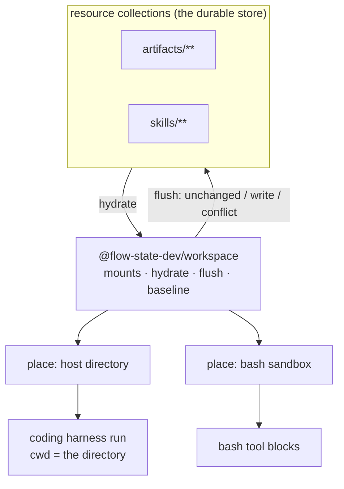

# FIX-150: Workspaces — the file-projection component and where a run's files live — Implementation Spec

## Part I — The Case *(for the human)*

### 1. Problem — why it matters, why now

An agent that works with files needs somewhere to put them, and the framework needs those
files back afterwards. That machinery exists once today, welded to the shell tool. Only an
agent that runs shell commands gets a workspace.

The coding-agent path has none of it. A coding run inherits whatever directory the FSD
server happens to be sitting in, reads and writes there, and nothing it produces comes back
as state. Nothing stops it writing anywhere else on the machine either.

**Why now.** This issue was filed with a gate on it — *validate that real usage requires
this abstraction before investing.* The Conductor epic (LAB-68) has cleared that gate. Its
layer-zero work established that a coding-harness run **is** an FSD session and that a run's
file writes are state the layers above have to read; LAB-134 delivered an *index* of those
writes and explicitly kept the file contents out of scope — "we keep an index into the
working tree, not a copy of it." The copy is this issue, and everything above L0 in that
epic reads it.

Two more things make the timing real. The one implementation we have carries a live
data-loss bug (FIX-998): two runs sharing a collection delete each other's files. And the
containment the coding path would inherit is not what anyone would choose — measured on a
real run, files we project into a workspace can silently reconfigure the agent that reads
them.

### 2. Solution in plain terms

Pull the workspace machinery out of the shell tool and make it a component in its own
right. It takes a set of resource collections, lays them out as files in a place, and later
reads that place back and works out what changed. The shell tool becomes one caller of it.
A plain directory that a coding agent is pointed at becomes another.

Two things travel with the move. The projection **remembers what it laid down**, so reading
back can tell "someone else changed this" from "nothing changed" instead of overwriting
either way — that is the data-loss bug, fixed at the point both callers pass through. And
because the second caller is a real coding harness with a real shell, **the framework states
that harness's containment** rather than inheriting it.

**Philosophy.** Tenet 5 (fix at the owning layer) — the same walk-and-diff exists in two
copies and the bug lives in both, so the fix belongs where they converge. Tenet 3 (earn
every addition) — this ships one component that replaces two, and does **not** build the
`workspaceRunner` block the issue names. Tenet 2 (composition over features) — a workspace
is a composition of collections and a place, not a new primitive.

**In tension with tenet 3:** it adds a package. The alternative — leaving the component in
the tools package — makes the coding-agent path depend on six sandbox adapters and a
shell-quoting library to obtain a file projector. The dependency weight is the reason, and
it is stated as a decision below rather than buried.

### 6. Decisions & rules — the sign-off surface

1. **We build a projection component, not the `workspaceRunner` block the issue names —
   and both existing copies of the machinery collapse into it in the same change.**
   *Rejected:* shipping the block as specified, and leaving today's two copies beside it.
   *Locks in:* the shell tool's file behaviour changes in the same release as the new
   capability, so there is one behaviour to document, teach and support instead of two that
   drift. The bill arrives now rather than later: anything written against today's exported
   sync class breaks in this release.

2. **The live data-loss bug rides this change.** The projection remembers the content it
   laid down, so reading back reports a conflict instead of silently overwriting or
   deleting, and each run gets its own directory by default. FIX-998 closes when this lands.
   *Rejected:* fixing FIX-998 first, on the code this change deletes.
   *Locks in:* the window in which two concurrent runs can destroy each other's files stays
   open until this ships rather than until a smaller fix ships. Reversible — the smaller fix
   is still available if that window turns out to bite someone first.

3. **The framework states the coding harness's containment, and it fails closed.** A
   projected workspace never configures the agent reading it, the available tool list is
   stated rather than inherited, and OS-level write confinement is on by default — on a host
   that cannot provide it, a run refuses to start rather than running uncontained.
   *Rejected:* inheriting the harness's own defaults and documenting the risk.
   *Locks in:* an app deployed to a host without the sandbox dependencies will see
   coding-agent runs refuse until an operator installs them or explicitly opts out. We are
   choosing a deployment-visible failure over a silent one, and the opt-out is a config
   line, not a code change.

**Non-goals.** No content-addressed store — resources already hold content, and a CAS beside
them is a second store with its own retention question. No conflict *resolution*: the
projection reports a conflict and stops; who merges it is a separate design question
(FIX-998 draws the same line). No git: no worktree strategy, no GitResource — measured and
rejected, see §12. No change to the sandbox adapter set or to the `user` / `org` workspace
scopes. No filesystem watchers — hydrate and flush stay explicit calls. No distributed
locking across processes.

**Size:** Large — 13 production files · 14 test behaviours · 4 doc surfaces · 3 PRs.

---

### 3. Tradeoffs & alternatives

**Alternative: leave it in the tools package and have the coding path import it.** No new
package, and the code is already there. Rejected on dependency weight and layering: the
coding-agent package would pull in six sandbox adapters, a shell-quoting dependency and the
whole bash block surface to obtain a file projector. The projector's real dependency set is
the core resource types and a place to write.

**Alternative: build the `workspaceRunner` block the issue names.** Rejected. A block that
hydrates, runs, and flushes is a sequencer composition, and `createBashBlocks` already
expresses it. Adding a named block for it puts a second route to one job on the public
surface, which is the shape tenet 3 rejects.

**The simpler approach: add `cwd` to the coding-agent options and stop.** Genuinely
tempting, and one field. The POC confirms it works (§12). Insufficient because it hands the
run a directory with nothing in it and nothing coming back out: the files never become
state, which is exactly what the epic above this needs. It also ships the containment
defaults the POCs measured to be wrong, and it leaves the data-loss bug where it is.

**Where the complexity is:** not the walk. It is flush's three-way outcome — unchanged /
clean write / conflict — and the fact that a *delete* needs the same evidence as a write.
FIX-998's own notes record a first fix that closed the write path and left the delete path
open, which is the mistake to design against rather than rediscover.

### 4. Focus practices (1–5)

1. **BP-031 (never decide from caller-controllable input)** — a projected workspace is built
   from resource collections, which an application's users write. A POC measured that such a
   workspace's own settings file and instruction file are honoured by the agent reading it
   unless we say otherwise. The workspace is caller-controllable input; the agent's
   configuration must not come from it.
2. **Tenet 5 — one convergence point** — flush's write path and its delete path are two
   writers of one invariant ("never destroy evidence you do not have"). Both must pass the
   same check, and the producers include the orphan path and the read-only-mount path.
3. **Tenet 7 / BP-003 — the check must be able to fire** — a hydrate-then-flush round trip
   only fails when the mechanism is broken. The goal check has to fail in the world we are
   in today. §10 states it in those terms.
4. **BP-030 (tolerate the old shape)** — existing deployments have session-scoped workspace
   directories on disk and persisted sandbox-session state. Changing the default isolation
   unit must not orphan them or crash on them.

### 5. What using it looks like (1–5 examples)

**A shell-tool call site does not move** *(what this spec proposes; the behaviour underneath
changes, the code does not):*

```ts
const { bashCommand } = createBashBlocks({ provider: { type: "local" } });
// Same call, same auto-discovery of mounted collections. What changes: flush now
// reports a conflict instead of silently overwriting, and never deletes a path it
// did not lay down.
```

**A coding agent gets a projected workspace** *(new — today this call inherits the server's
directory and returns nothing to state):*

```ts
const coder = claudeCodeAgent({
  uses: [createWorkspaceCapability({ collections: ["artifacts"] })],
});
// The run starts in a directory containing artifacts/ laid out from the collection.
// On end of turn, what it wrote there is read back into the collection.
```

**What a conflict looks like from the caller's side (before / after):**

```
before  two runs flush over one collection
        → run A's new file is deleted by run B's flush; A's edit is overwritten by B's

after   two runs flush over one collection
        → both files survive; the contested path is reported as a conflict carrying
          the base we laid down, their version, and ours — and is not written
```

## Part II — The Build Plan *(for the implementing agent)*

### 7. Technical design

A new package, `@flow-state-dev/workspace`, holds the projection. It depends on the core
resource types and nothing else. Two consumers today; a third (Conductor's L0) in sight.



- **`@flow-state-dev/workspace`** — owns mounts (a collection, its prefix, whether it is
  writable), the hydrate/flush pair, the per-path **baseline** recorded at hydrate, and the
  routing rules. Exposes a narrow **place** interface: read one path, write one path, list
  the paths under a set of prefixes. Deliberately *not* `Sandbox` — the projection never
  executes a command.
- **`@flow-state-dev/tools`** — `createBashBlocks` and `createBashTool` both delegate to it;
  the `Sandbox` adapters are wrapped as a place. `file-sync.ts` is **deleted** and its export
  removed, along with the duplicate hydrate/flush inside `blocks.ts`.
- **`@flow-state-dev/claude-code`** — the SDK options interface gains the fields a projected
  workspace needs (see below), plus a workspace capability that hydrates before the run,
  flushes at end of turn, and sets the containment.
- **Untouched:** the sandbox adapter set, the resource system, the item taxonomy, block kinds.

**Placement strategies behind the place interface — two, not three.** The bash sandbox and a
host directory pointed at by `cwd`. The SDK's own worktree machinery was evaluated as a
third and rejected on measurement (§12): it is git-only in its built-in form, and the
host-implementable form only ever fires when the *model* asks for it, so it is a mid-run
relocation seam rather than a placement the framework can choose. The projection therefore
does not build on it, and the containment defaults **omit the tools that trigger it** so a
run cannot relocate out from under a projection.

**Isolation unit: the run.** Today a workspace is per session, so N runs in one session share
one mutable directory with no coordination — which is FIX-998's blast radius. The default
becomes one directory per run; the session-scoped directory stays available as an explicit
opt-in for the multi-turn scratch case. Isolation removes contention between our own
concurrent runs; it does **not** replace the baseline check, because a collection can also
be written by an action block, another tool, or another session over a `user`/`org` scope.

**Change detection: diff is the source of truth, hooks are an optimisation.** Measured
(§12): the harness's post-tool hook carries a file path for its own write tool and only an
opaque command string for a shell write, and the file-change hook never fires at all. So
hooks cannot decide what to persist. They are used to *narrow* the work (a turn whose tool
calls were all reads needs no walk) and to feed the run index LAB-134 built. One source of
truth, one optimisation on top of it.

**Flush boundary: the consumer's, not the component's.** The component exposes `flush()`;
each consumer picks when. The bash blocks keep flushing after each command. The coding-agent
capability flushes at **end of turn**, which was measured to block long enough for a real
flush. Session-end is not a candidate — it did not fire at all in the measured run.
Directory-change events turned out to be a non-issue: a shell `cd` does not persist between
tool calls, and the only thing that relocates a run is the worktree tool we are not offering.

**Containment defaults the framework sets** (all measured — §12):

| What | Default | Why |
|---|---|---|
| settings sources | **explicitly none** | Omitting the option loads the *workspace's own* settings and instruction files. The workspace is user-writable content (BP-031). |
| available tools | **stated list** | The permission allowlist does not restrict availability; the availability list does. Excludes the worktree tools. |
| working directory | the projected root | Placement, not containment — see the next row. |
| OS write confinement | **on, scoped to the projected root**, failing closed | A run without it writes anywhere on the host. |
| extra readable directories | **none** | Everything the run should see is a mount inside the root. |
| approval | the framework's existing approval seam | The blanket bypass mode is refused when the process runs as root, which is the shape of a server container. |

**Sketch — pseudocode. Illustrative, not the contract. React to the shape.**

```
hydrate(mounts, place):
    for each mount, for each entry:
        write it at <mount prefix>/<entry key>
        remember baseline[path] = hash(content)          ← the whole fix

flush(mounts, place, baseline):
    for each path the place now holds:
        route it to the mount whose prefix is the longest match
        no match and not scratch → orphan (reported, never guessed at)
        read-only mount          → skip

        now = hash(local content)
        base = baseline[path]              (absent = we never laid this down)
        theirs = hash(collection's current content)

        now == base                 → unchanged, do nothing
        base absent, theirs absent  → clean create
        theirs == base              → clean write
        otherwise                   → CONFLICT (base, theirs, ours); write nothing

    for each path we hydrated and the place no longer holds:
        theirs == base ?  → delete it
        otherwise         → CONFLICT with ours = absent    ← the half that gets missed
    (paths we never hydrated are not ours to delete)
```

What this asks a reviewer: *is the baseline the right memory to carry — per projection
instance, discarded at teardown — or does it need to be persisted so a resumed session can
still tell a conflict from a change?* The answer decides whether a workspace survives a
process restart with its safety intact, and it is the one thing the sketch does not settle.

**A runnable POC accompanies this spec.** Six throwaway probes on the spec PR under
`spec-poc/FIX-150-workspace-projection/`, each with a measured verdict. What they showed is
in §12; the containment table and the two-strategies call are theirs, not assumptions.

### 8. Implementation sequence

1. **Stand up `@flow-state-dev/workspace`** — the place interface, mounts, hydrate, flush,
   the baseline, and the three-way outcome including the delete path. A host-directory place
   and an in-memory place for tests. *Test:* the §10 behaviours, against the in-memory place.
   *Depends on:* nothing.
2. **Move the bash tool onto it.** Wrap `Sandbox` as a place. **Remove** `file-sync.ts`, its
   export, and the duplicate hydrate/flush in `blocks.ts`; keep the orphan, scratch-directory
   and read-only-mount semantics, which move into the component. *Test:* the existing bash
   suite passes unchanged, plus FIX-998's three measured reproductions.
   *Depends on:* 1.
3. **Widen the coding-agent options** to carry a working directory, a stated tool list,
   settings-source control, environment, and the sandbox settings — and thread them through
   the existing resolver seam. *Test:* the options reach the harness; the absent case behaves
   as today. *Depends on:* nothing (parallel with 2).
4. **The workspace capability for the coding agent** — hydrate before, flush at end of turn,
   containment defaults applied, orphan and conflict reported as run-visible state.
   *Test:* the §10 coding-path behaviours. *Depends on:* 1 and 3.
5. **Remove** the session-scoped default. The scope option stays; the default moves to
   per-run, and an existing session-scoped directory is still readable (BP-030).
   *Depends on:* 2.

**PR plan.**

| sub-PR | deliverables | depends_on |
|---|---|---|
| a | the `@flow-state-dev/workspace` package: steps 1 | — |
| b | bash tool migrated onto it, old copies deleted, default isolation moved: steps 2, 5 | a |
| c | coding-agent options + workspace capability + containment: steps 3, 4 | a |

`b` and `c` are independent of each other and build in parallel.

### 9. Edge cases & error handling

| Case | Expected |
|---|---|
| A path exists under two mount prefixes | Longest prefix wins; mounts are matched longest-first |
| A write lands under no writable mount | Orphan: reported as run-visible state, never guessed into a default collection, never silently dropped |
| A write lands in the scratch directory | Ignored, as today — that is what the directory means |
| The place is unreadable at flush time | Abort the flush; **never** run the delete pass on an empty listing |
| Collection metadata entries (leading `_`) | Never hydrated, never deleted by a flush |
| A path we never hydrated vanishes | Not ours; no delete, no conflict |
| A file is byte-identical to what we laid down | Unchanged; no write, no conflict, no timestamp churn |
| Two runs write the same path with the same content | Both clean; hashes agree, so there is nothing to contest |
| A resumed session flushes against a baseline it no longer holds | Treated as "never hydrated": no deletes, writes only where the collection is untouched — see §12's open question |
| OS write confinement unavailable on the host | Fail closed: the run refuses to start with an actionable message naming the missing dependency |
| The projected workspace contains an agent settings or instruction file | Inert — settings sources are explicitly none |

**Taxonomy.** Conflicts are **not errors**: they are a reported outcome of a successful
flush, and a flush that reports conflicts still writes everything uncontested. Fatal:
an unreadable place, and a refused start under fail-closed containment. Everything else
degrades to "left alone and reported".

### 10. Testing strategy

**Goal.** Two coding agents run concurrently in one session against one shared collection.
One creates a file; the other edits a different file. Both finish. The user sees **both**
results in the collection, and neither run reports a conflict.
`goals/workspace-projection/concurrent-runs-share-a-collection/run.mts`, real model.

*This fails today* — one run's flush deletes the other's new file (FIX-998's measured
`delete-by-absence` case). It also fails if the fix over-corrects into reporting a conflict
where two runs touched different files, which is the failure mode a naive baseline check
produces. A hydrate-then-flush round trip was rejected as the goal: it can only fail when
the mechanism is broken, which makes it a capability check, not a proof.

**Second goal — containment.** A collection containing an agent instruction file that says
"always begin your reply with token X" and a settings file that sets an environment
variable is projected into a workspace, and a coding agent runs against it. Neither takes
effect, and a write outside the projected root is refused.
`goals/workspace-projection/a-workspace-cannot-configure-its-agent/run.mts`, real model.
*This fails today* (measured, §12) and fails again the day someone removes the setting —
which is the point: the check can fire.

**CI specs** (the behaviours, not the test names):

- **one behaviour per decision in §6**, in observable terms.
- **the three flush outcomes**, each separately: unchanged, clean write, conflict — and the
  conflict carrying base, theirs and ours.
- **the delete path under the same check** — the case FIX-998 records a first fix missing.
  Promote its three measured reproductions (`delete-by-absence`, `lost update`,
  `edit-vs-delete`) from the harness on `epic/durable-jobs`; they are written to flip from
  passing to failing when the bug is fixed, so they are already regression tests.
- **the no-false-conflict floor**: a genuine no-op flush reports zero writes, zero conflicts,
  zero deletes. Without this the conflict check can pass by reporting everything.
- **what must not change**: the existing bash suite passes untouched, and a single-run
  workspace behaves exactly as today.
- **the second path (BP-035)**: every behaviour exercised on a *second* flush against a
  changed collection, not only a first flush against a fresh one.
- **the shell blind spot**: a file written through the shell is persisted, proving flush does
  not depend on tool observation.

**Discipline:** `tdd`. The seam is the projection component against an in-memory place —
no sandbox, no harness, no model, so every behaviour above is a tracer bullet.

### 11. Documentation plan

- **CREATE** `packages/workspace/README.md` — the package's own API reference. Terse: what a
  mount is, hydrate/flush, the three outcomes, the place interface. One minimal example
  (project one collection into a directory, read it back).
- **EXTEND** `apps/docs/docs/tools/bash.md` — the flush section changes meaning. Replace the
  "flush-routing behavior beyond what `FileSync` provides" line (it names a class that will
  not exist) and add a short subsection on what happens when two runs share a collection.
  *Voice risk:* this page currently explains mechanism; keep the new text on observable
  behaviour.
- **EXTEND** `apps/docs/docs/tools/claude-code-sdk.md` — a "Working directory and containment"
  section after the existing setup content: what a projected workspace is, what the framework
  sets by default, and the one operator-facing consequence (the sandbox dependency).
  Cross-link → `tools/bash`, ← from `tools/overview`.
- **EXTEND** `packages/claude-code/README.md` — the workspace capability in the quick-start
  shape the README already uses.
- **No new sidebar page.** A workspace is a property of the two tool pages that have one, not
  a term a user searches for on its own. Revisit if a third consumer lands.

### 12. Dependencies, open questions & follow-ups

**Dependencies.** None blocking. FIX-998 is **subsumed** by decision 2 — it is not a
dependency, it closes here. LAB-134 (in review) built the run index this reuses for the hook
optimisation; it does not gate this work, and this work does not change it.

**Open question — one, and it needs an answer before step 1 is built.**

> **Does a workspace's safety have to survive a process restart?**
>
> *Plain terms:* the projection stays safe by remembering what it handed the agent. If the
> server restarts mid-session, that memory is gone. The choice is whether we write that
> memory down alongside the files, or accept that a resumed session degrades to "write only
> what nobody else touched, delete nothing."
>
> *Trade-off:* persisting it means a workspace survives a deploy intact, and costs a small
> amount of extra state per file and a migration for existing sessions. Not persisting it
> costs nothing now, and means a long-running agent that spans a restart quietly stops being
> able to delete its own files until it re-hydrates.
>
> *My recommendation:* **don't persist it yet.** The degraded behaviour is safe by
> construction — it never destroys anything — and it is invisible to every use we have today,
> because both consumers hydrate at the start of a run and flush within it. Persisting it now
> is state we would design before knowing what a resumed workspace should mean.
>
> *What would change my mind:* if Conductor's L0 intends a workspace to outlive a run — an
> agent whose directory persists across days, not turns. That is a real possibility in that
> epic and you can see its direction better than I can.
>
> *If I am wrong:* we add persisted baselines later, which is additive and needs no change to
> the projection's shape. The cost of being wrong is one follow-up issue, not a rewrite.

**Settled claims** — six throwaway POCs on this spec PR
(`spec-poc/FIX-150-workspace-projection/`). Resolved with evidence; please do not reopen
blind.

- **Settled:** the coding-agent path can be relocated onto a projected directory —
  **CONFIRMED**: a run pointed at a temp directory read its seeded file, wrote its output
  there, and left the server's own directory untouched. (`poc-1-cwd.mjs`)
- **Settled:** the harness's worktree machinery is a usable third placement strategy —
  **REFUTED**: the built-in form is git-only and names its own path; the host-implementable
  form works even for a plain directory but only fires when the *model* invokes it, so the
  framework cannot choose it. It is a relocation seam, not a placement. (`poc-2-worktree.mjs`)
- **Settled:** in-process hooks fire and end-of-turn has room for a real flush —
  **CONFIRMED**: per-tool hooks fired with no hook command, and a 3.6-second flush inside the
  end-of-turn hook ran to completion before the run finished. Session-end never fired at all.
  (`poc-3-hooks-stop.mjs`)
- **Settled:** hook observation alone can drive flush — **REFUTED**: the post-tool hook
  carried a file path for the write tool and only an opaque command string for a shell
  heredoc; the file-change hook never fired. A content diff found both files. Diffing is the
  floor. (`poc-4-bash-blindspot.mjs`)
- **Settled:** the working directory is a containment boundary — **REFUTED**: an
  unconfigured run wrote outside it. With OS write confinement scoped to the workspace, the
  same write was refused. Directory-change events never fired, and a shell `cd` does not
  persist between calls. (`poc-5-containment.mjs`)
- **Settled:** leaving settings sources unset isolates the run — **REFUTED**: with the option
  omitted, a workspace's own instruction file and settings file were both honoured; with it
  set to none, neither was. The safe default is not the absent one. (`poc-6-setting-sources.mjs`)

**Follow-ups (flagged, not built):**

- **Report up to LAB-68/LAB-134:** the run index built from tool observations has the same
  blind spot POC 4 measured — a file written through the shell is not in it. Not a defect in
  that work (it indexes tool calls, which is what it says it does), but the layers above it
  should know the index is not a complete list of files a run touched.
- **Deepening:** `packages/tools/src/bash/blocks.ts` is ~1,000 lines carrying mount
  discovery, sandbox lifecycle, projection and three block factories. Step 2 removes the
  projection third of it; the rest is out of scope here — follow up via
  `improve-codebase-architecture`.
- **Already rejected:** content-addressed storage for workspace files, and a
  `workspaceRunner` block — see §6 non-goals rather than restating the case.

---

## Spec evolution *(the change story, not an audit log)*

- **Spec drafted** — framed as a projection component rather than the block the issue names,
  because the machinery already exists twice and the gap is that it is welded to one caller;
  chose two placement strategies over three and framework-stated containment over inherited
  defaults, both settled by POC rather than argued; folded FIX-998 in, because the fix and
  the extraction touch the same code and the extraction deletes it.
