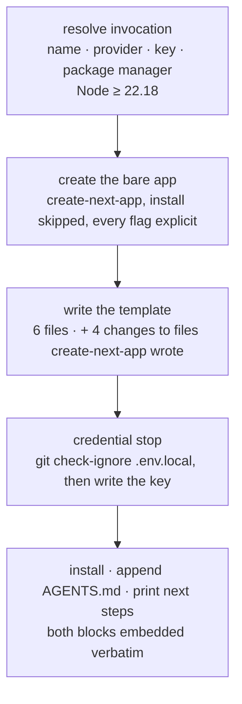

# FIX-548: `create-flow-state` — one command to a working FSD app — Implementation Spec

## Part I — The Case *(for the human)*

### 1. Problem — why it matters, why now

Someone who hears about FSD and has no project yet has nowhere to start. Adding FSD to a
repository that already exists is now agent work (FIX-1159's install skill), and that path
assumes a repository. For someone starting fresh there is no path at all short of assembling one
by hand out of our monorepo — which is the thing the epic exists to stop asking people to do.

**Why now** — Public Launch's front door is a single command, and what a stranger judges FSD by
in their first five minutes is whether that command ends at something that *visibly works*. A
scaffold that produces correct wiring and a stock "Welcome to Next.js" page has shown them
nothing.

**The honest size of the gap, restated.** The epic used to call this the weakest of its issues,
because `npx create-next-app && npx @flow-state-dev/cli init` reached the same outcome in two
commands. **That alternative no longer exists** — after the greenfield/brownfield split there is
no deterministic command that wires FSD into a directory somebody else's scaffolder just filled.
This is now the only deterministic path to a running FSD app, and §3 records what is left of the
case against it.

*Linear **FIX-548** · Epic **FIX-1161** (`epic/building-with-fsd`, PR
[#1301](https://github.com/fixpoint-labs/flow-state-dev/pull/1301)) · spec PR
[#1312](https://github.com/fixpoint-labs/flow-state-dev/pull/1312) · relates to **FIX-1159**
(spec PR [#1310](https://github.com/fixpoint-labs/flow-state-dev/pull/1310), approved) ·
Project **Public Launch**.*

### 2. Solution in plain terms

`npm create flow-state my-app` makes a directory, puts a working AI chat feature in it, and
prints the dev command that serves it; running that command is what puts the feature, streaming,
in the developer's browser.

Three things happen in order. The bare Next.js app comes from Next's own scaffolder. **Then this
package writes its template** — the config, the route that serves flows, the demo flow, and the
page that talks to it. **Then this package finishes the project itself**: the API key, the ignore
entry that keeps it out of git, the agent-instructions section, the dependency install, and the
block of next steps that gets printed.

**Those last five used to be somebody else's, and they are not any more.** An earlier draft handed
them to `fsdev init`, called in-process. **There is no `fsdev init`** — FIX-1159 decision 1 ships
neither the command nor a library entry point behind it, and the epic's objective hands this issue
the template *"end to end … the agent-instructions file"*. So this package is the greenfield path
in every part, and §6 decision 3 says what that costs. What must not exist twice is not the *work*
but the **text**: two of those five print or write a block authored by another issue, and this
package embeds each verbatim rather than restating it (§7).

**This package owns the template end to end** (epic theme 1, re-drafted). That is a change from
this spec's previous draft, which had init generate the config and the host wiring while this
package supplied only demo content. That boundary existed to stop two deterministic writers
duplicating scaffolding logic; after the split there is one, so the line moved. What replaces it
is a **drift** tripwire, and epic theme 9 has since re-aimed it. The template is no longer the
reference shape the install skill points at — that skill ships in a plugin and can never reach a
template published inside this scaffolder. Instead **both conform to a wiring contract FIX-1159
authors**, and the tripwire watches for either one restating the wiring instead of citing it.
This package still writes the shape; it no longer defines it.

**Philosophy** — tenet 2 (composition over features): the command's value is the ordering of
three things that already exist. Tenet 3 (earn every addition): §6 is mostly about keeping the
file list short and refusing surface — including a `--template` flag with one legal value.

### 6. Decisions & rules — the sign-off surface

1. **One package, `create-flow-state`, published unscoped.** Invoked as `npm create
   flow-state my-app`, or `npx create-flow-state my-app`.
   *Rejected:* publishing under the `@flow-state-dev/` scope (this spec's previous draft), **and
   the two-package shape** — a scoped package plus an unscoped alias — which was the natural
   compromise while the short name was believed unobtainable. Also rejected: `create-fsd-app`
   and `create-fsdev-app` (both considered by FIX-1162).
   *Locks in:* **the unscoped name is load-bearing, not cosmetic.** `npm create <name>` resolves
   to the *unscoped* `create-<name>`; a scoped publish claims nothing outside its scope, exactly
   as publishing `@flow-state-dev/cli` would not claim `fsdev`. Measured rather than assumed:
   `npm create flow-state-nonexistent-xyz123` requests
   `registry.npmjs.org/create-flow-state-nonexistent-xyz123`. So a scoped-only publish leaves
   this spec's headline command — the one thing a stranger types — resolving to a package that
   does not exist. The two-package shape would work but buys nothing: nobody would be told to
   type the scoped form, so the second package exists only to be unused (tenet 3). One package
   makes the documented command and the published artifact the same thing.
   **This is now a hard prerequisite rather than a preference, and §12 carries it as a
   dependency** — the previous draft treated the name as a convenience that removed a blocker,
   which is what let a scoped fallback look harmless.

2. **One template ships: the Next.js chat app — conditional on a supported minimal-project path
   existing for backend developers.** *This reverses epic theme 2, it is the ask on this PR, and
   this spec asserts no answer to it — see the framing below and epic §5 Q6, which is open and
   blocks implementation.* Everything else in this document is written against one template and
   changes only in `templates/<name>/` if the answer is two.
   *Rejected:* two templates, as epic theme 2 decided — **conditionally**, and the condition is
   the point: the fallback if the minimal-project path is not taken up is to ship both, not to
   ship one anyway.
   *Locks in:* one starter to keep green on machines we do not control, and three recorded goal
   runs per release rather than six.

   2b. **No `--template` flag in v1.** *Rejected:* shipping the flag with one legal value to
   signal the plan. A flag whose only argument was a template decision 2 just cut is surface
   that documents an intention and does nothing else; someone who types `--template node-api`
   gets a refusal listing a single value, which reads worse than no such flag. The seam that
   makes a second template cheap is the `templates/<name>/` directory in §7, not the flag —
   and adding a flag nobody could have been passing breaks no invocation. If decision 2 is
   overturned, the flag arrives with the template it selects between.

3. **`create-flow-state` is the greenfield path in every part.** It writes the whole FSD half of
   the template as real checked-in files — config, mount, flow, page — **and it also does the
   five jobs an earlier draft routed to `fsdev init`: the API key, the ignore entry, the
   agent-instructions section, the dependency install, and the printed next-steps block.**
   *Rejected:* the previous draft's split, where init generated `fsdev.config.*` and the Next
   route pair and this package supplied only the demo flow and the page. **Also rejected: keeping
   the five jobs behind an init library call** — see below; that is not a preference this spec
   holds, it is an option that no longer exists.
   *Locks in:* the template is a directory a person can read and diff, which is what checking it
   against **FIX-1159's wiring contract** requires (epic theme 9) — a shape assembled at runtime
   from `create-next-app` output plus init's generator is readable nowhere, so nothing could be
   held to the contract at all.

   **Why the five jobs are here, and why there is no elsewhere to send them.** FIX-1159 decision
   1: *"This issue ships no `fsdev init` — not the command, and not a library entry point behind
   it. The only artifact that crosses to FIX-548 is the next-steps block."* It names the same five
   jobs and routes them here, citing the epic's objective (this issue gets the template *"end to
   end … the agent-instructions file"*) and the epic's greenfield transcript, which has no init
   step in it. **Checked from the other side too, because that is where an unowned job survives a
   review:** FIX-1159's §3 hears the library option and rejects it on its own merits — brownfield
   is instructions plus scripts and instructions make no in-process calls, so the library would be
   a single-use abstraction in another issue's package, adding a build-and-merge edge between two
   issues the epic wants running in parallel. **Both ends now name this issue, so the jobs have an
   owner and the epic's greenfield proof has an implementer.** This spec previously disclaimed
   them in its Non-goals while depending on them everywhere else, which left five jobs and one
   goal check owned by nobody.

   **What that costs, stated rather than absorbed.** The narrow seam this decision used to buy is
   gone — there is no seam. §8 gains the credential write, the install, and the printed block as
   this package's own steps; §10 gains their behaviours; and the "byte-identical to a standalone
   init run" check is meaningless, replaced by normalized equality against FIX-1159's canonical
   text (epic theme 9 (a)). **Single authorship survives the change and is the part that
   mattered**: FIX-1159 still authors the next-steps text and FIX-1160 the agent-instructions
   text; this package embeds each verbatim and asserts it with the author's exported comparison.
   What is lost is only the claim that another command was doing the work.

   The remaining cost is unchanged: a config generator exists in two places and can drift. The
   epic accepted exactly that trade when it replaced "no two writers" with "watch for drift", and
   §10 spends a CI check on it.

4. **The template's config is `fsdev.config.ts`, and the template adds `"type": "module"` to the
   manifest `create-next-app` just wrote.** Measured, not assumed — see the POC in §7.
   *Rejected:* `fsdev.config.mts` (FIX-1159 decision 4), and `.ts` with no `type` field.
   *Locks in:* the config loads cleanly in both consumers at once — Turbopack builds it and the
   CLI's native `import()` takes it with no warning — and the template matches the extension
   every published doc page and both in-repo examples already use. `.mts` costs **two** edits to
   files `create-next-app` wrote (`allowImportingTsExtensions` in `tsconfig.json`, plus an
   explicit `../fsdev.config.mts` specifier that reads like a typo) because Turbopack does not
   resolve extensionless imports to `.mts`; `.ts` with no `type` field prints
   `MODULE_TYPELESS_PACKAGE_JSON` on every CLI command a beginner runs. The cost is that we edit
   a manifest — see the rule below — and that the generated project is ESM-only, which for a
   fresh Next 16 TypeScript app is the default posture anyway.

   *Amended — the template also sets `allowImportingTsExtensions` in the generated
   `tsconfig.json`, and relative TypeScript imports carry `.ts`.* The POC measured the config's
   own extension against a **self-contained** config. The real one imports the demo flow, which
   is a second resolution question: **Turbopack infers a missing extension, native Node does
   not.** Measured on a real scaffold, the four candidate forms:

   | specifier in `fsdev.config.ts` | `allowImportingTsExtensions` | native `import()` | `next build` |
   |---|---|---|---|
   | `./src/flows/chat/flow` | off | `ERR_MODULE_NOT_FOUND` | passes |
   | `./src/flows/chat/flow.ts` | off | loads | `error TS5097` |
   | **`./src/flows/chat/flow.ts`** | **on** | **loads** | **passes** |
   | `./src/flows/chat/flow.js` | off | `ERR_MODULE_NOT_FOUND` | `Module not found` |

   Only the third satisfies both consumers, so it is what the template ships. Without this the
   file set as previously specified had **no working import form at all**: every printed `fsdev`
   command would fail to load the config while the build stayed green.

   *This changes the file set and weakens one argument above.* The tsconfig key is a **materialised
   change in its own right** (§7's table of four), not a free one. And `allowImportingTsExtensions` was cited above as
   a cost of `.mts`; it is now required either way, so that half of the comparison is void.
   Decision 4 still stands on its other grounds — `.ts` is the extension every published doc page
   and both in-repo examples use, and `.ts` with no `type` field warns on every CLI command — but
   the honest margin against `.mts` is **narrower than this decision first claimed**, and `.mts`
   would avoid the manifest edit entirely since it is unambiguously ESM. Flagged rather than
   re-decided: this is a sign-off surface, and it moved after the reviewer who approved its
   reasoning read it.

   *Rule this bends, deliberately:* FIX-1159 decision 3 says the package manager owns
   `package.json`. That rule protects a manifest **in a repository we did not create**. Here the
   directory is one this command made seconds earlier, no lockfile exists yet, the install has
   not run, and we add one key. Dependencies and the lockfile still belong entirely to the
   package manager. Stated out loud because a reviewer should see the exception, not find it.

   *Consequence — the generated app needs **Node 22.18+**, and step 1 refuses below it.* The CLI
   loads a TypeScript config through a native `import()`, and native type stripping arrives in
   **22.18** — `packages/cli/src/load-config.ts` says so in its runtime-floor note and in the
   remediation text it prints. Below that the scaffold would finish, print its next steps, and
   then **every printed `fsdev` command would fail to load `fsdev.config.ts`**: the epic's
   headline outcome breaking silently, on a Node range we advertise as supported. So the check
   belongs in step 1's validation, refusing **before any directory is created**, with the floor
   and the wording the wiring contract's runtime-floor rule fixes (epic theme 9 (b), which binds
   both entry paths to the same number and the same guidance) — not late, as a config-load error,
   after a project exists.

   *What actually forces this, stated precisely, because the POC does not.* The POC settled the
   config's shape **given that it is TypeScript**; it never tested a `.mjs` config, and the
   loader documents `.mjs`/`.js` as a universal escape that would work across all of 22.x. That
   escape is rejected on other grounds: a JavaScript config in an otherwise TypeScript template
   drops type checking on the most error-prone file in it, contradicts FIX-1159 decision 4
   (TypeScript for the CLI half), and — after epic theme 9 — `fsdev.config.ts`'s shape belongs to
   a contract FIX-1159 authors, not to something this template may reformat to widen a Node
   range. 22.18 is old enough by now that requiring it costs approximately nobody.

   *Not the package's `engines`.* This floor is what the **generated app** needs, checked against
   the Node actually running the command. The scaffolder's own `engines` stays at the repo-wide
   `>=22`; §9 records why narrowing that is a separate mistake.

5. **The config statically imports the chosen provider, passes it as a pre-built `modelResolver`,
   and the demo flow names that provider's exact model string. No intents, no
   `providerPreference`, no `models` shorthand.** The generated `fsdev.config.ts` carries
   `import { createOpenAI } from "@ai-sdk/openai"` (or the sibling for the provider chosen at the
   prompt), builds `createModelResolver({ providers: { openai } })`, and passes the result as
   `modelResolver`. Only that provider's `@ai-sdk/*` package is installed. The three
   provider/factory/env-var/model rows come from **FIX-1159's provider table**, which the wiring
   contract fixes; this template does not pick them:

   | provider chosen | statically imported | env var | model string the demo flow names |
   |---|---|---|---|
   | `openai` | `createOpenAI` from `@ai-sdk/openai` | `OPENAI_API_KEY` | `openai/gpt-5.4-mini` |
   | `anthropic` | `createAnthropic` from `@ai-sdk/anthropic` | `ANTHROPIC_API_KEY` | `anthropic/claude-haiku-4-5` |
   | `google` | `createGoogle` from `@ai-sdk/google` | `GOOGLE_GENERATIVE_AI_API_KEY` | `google/gemini-3.1-flash-lite` |

   *Rejected:* **the `models: { default, intents, providerPreference }` shorthand this decision
   previously specified** — see the reversal below. Also rejected: a fixed `openai/gpt-5.4-mini`
   regardless of the provider chosen, which is what the reference example does and which fails on
   an Anthropic key.
   *Locks in:* the first browser request works. `createModelResolver` reaches an *un*-declared
   provider through `createRequire` and a dynamic `import()`, and **Next bundles server code,
   which breaks that path** — our own published guide says so and gives this exact fix
   (`apps/docs/guides/deploying-to-vercel.md`: *"Next.js bundles server code, breaking the model
   resolver's dynamic `require()` path. Pass a pre-built `modelResolver` with static provider
   imports instead of the `models` shorthand."*). Read in the resolver source: an explicit
   provider entry is invoked directly, so `isPackageProviderAvailable`, the `directLoadFailed`
   set and the gateway fall-through are **never reached at all** on this path.

   *No intents, and that is a decision rather than an omission.* `defaultModel` is **required**
   the moment `intents` is non-empty and `createModelResolver` throws at construction otherwise —
   which in a generated project means `createFlowState` fails and every printed command dies
   before it runs. A demo flow needs one model, so it names one.

   **This reverses the decision it replaces, and the reversal is the point rather than an edit.**
   The previous decision 5 declared the `models` shorthand with an intent ladder over all three
   providers, and it was argued on a real hazard: with `AI_GATEWAY_API_KEY` in the developer's
   shell, `providerDetection`'s phase 3 marks every gateway-supported provider available, the
   intent's fixed candidate order stands, and the first entry wins through the gateway while the
   direct key just collected goes unused. `providerPreference` was there to stable-reorder the
   candidates and stop that. **All of that argument is void under the wiring contract, and void is
   the honest word — not "superseded".** `providerPreference` reorders *intent candidates*, and
   there are no intents. The gateway hijack it guarded needs the availability map, which an
   explicit provider entry never consults. The "prompt offers three providers and all three work"
   argument survives, but for a different mechanism: the template emits a **different config per
   provider** — different import, different factory, different model string — rather than one
   config with a fallback ladder. **A reviewer who approved the old decision approved a mechanism
   and an argument that have both reversed**, which is why this is restated as a changed decision
   on the sign-off surface rather than folded quietly.

   *What the reversal costs.* The generated project no longer falls back to a second provider if
   the first has no key — it has exactly one, chosen at the prompt. That is the right trade for a
   demo (the fallback ladder was solving a problem a one-provider prompt does not have), but it is
   a real behaviour change and §10's per-provider goal runs get *more* load-bearing because of it:
   three runs now exercise three genuinely different emitted files rather than one file's ladder.

6. **The demo chat page adds no user-interface dependencies. One file, `@flow-state-dev/react`,
   and nothing else.**
   *Rejected:* porting `examples/hello-chat`'s page, which brings a component library, an icon
   set, and a session sidebar.
   *Locks in:* what gets installed is explainable in one sentence, and the first FSD code a
   newcomer reads is one file they can follow top to bottom. The cost is that the generated app
   looks plainer than our own example — the right trade for a file whose job is to be read.

7. **No path writes the API key before it has proven git will not publish it.** The template's
   host scaffold happens to cover this already (verified: git ignores `.env.local` in a fresh
   `create-next-app` scaffold), so this is an assertion, not a code branch: check, add our own
   entry if the check fails, and only then write the key.
   *Rejected:* assuming the entry is there because we saw it once — it is someone else's file —
   **and checking it by reading `.gitignore` for a rule that looks right.** The check must ask
   git about `.env.local` itself (`git check-ignore`), because a `.gitignore` that lists only
   `.env.example` matches a naive text search while leaving `.env.local` publishable. The POC
   made exactly that mistake before it was caught.
   *Locks in:* the guarantee the epic now states generally — a credential in version control is
   the one failure a diff review does not catch, because it looks like every other added line.
   §10 asserts it by running `git check-ignore`, not by reading the file.

8. **The generated project is never reachable off the developer's own machine without
   authentication — and the control is the bind, not a credential.** Two parts, both this
   template's:
   - **`scripts.dev` and `scripts.start` are narrowed to loopback** — `next dev --hostname
     127.0.0.1` and `next start --hostname 127.0.0.1`. The printed commands do not change; the
     developer still types `npm run dev`.
   - **The demo flow refuses to serve outside development on the default resolver.** Declared on
     the flow itself, so a request in production mode is refused **before any model invocation**,
     with an error naming the missing authentication.

   *Rejected:* **a credential, which is what protects the brownfield path.** It cannot work here
   and the reason is the client, not the effort: the chat page is a client component using
   `@flow-state-dev/react`, which fetches and opens SSE against `/api/flows/*` **from the
   browser**. Any token that page can present is one an attacker can read by loading the same
   page, and on a dev server bound to every interface they can load it. Also rejected: printing
   `npm run dev -- --hostname 127.0.0.1` in the next-steps block, which leaves the plain `npm run
   dev` that `create-next-app` itself advertises live and exposed; and a second script under a key
   we own, which does the same and puts two dev commands in a four-second-old project.
   *Locks in:* `next dev` **and** `next start` default to `0.0.0.0`, and this template never goes
   through `@flow-state-dev/node`, so the loopback rail
   `docs/architecture/authentication.md` names as the protection for default-resolver apps is not
   in the path at all. Without the bind, `npm run dev` puts an unauthenticated flow that calls a
   real model on the developer's key onto whatever network they are on. `start` is the worse of
   the two — someone running `npm run build && npm start` is by definition not on their laptop.
   And binding scripts closes only self-hosting: a platform deploy runs neither script, which is
   why the second part exists and is adapter-independent.

   *Rule this bends, deliberately — and it is the epic's exception, not this spec's.*
   `scripts.dev` and `scripts.start` are keys `create-next-app` wrote, and theme 6 (b) says every
   unowned key keeps its value. Epic **theme 6 exception (c)** carves out exactly these two, for
   exactly this path: greenfield only, on keys whose stock value we caused to exist seconds
   earlier, an edit that only ever *narrows* a bind and reverts in one word. It does not reach
   brownfield. §5's transcript reports the change and §10 asserts it, because a
   `scripts` edit would otherwise read as a violation of the additive guarantee.

   *This is a product statement, not a footnote:* **the generated app does not serve off-host
   until its authentication is configured.** For a demo scaffold that is the right default, and
   the owner should see it as a promise about what the thing does rather than as an
   implementation note.

**Non-goals** — the *content* of the agent-instructions block (FIX-1160 authors it; this package
places it) and of the next-steps block (FIX-1159 authors it; this package prints it); the
brownfield path in any form, including the wiring contract this template conforms to (FIX-1159
specifies it, this package writes it); an `--upgrade` mode that regenerates config in an existing
project; and any template beyond the one decision 2 settles.

*This section previously disclaimed the API key, the ignore entry, the agent-instructions section,
the install and the printed block as "anything `fsdev init` does". There is no `fsdev init`, and
FIX-1159 disclaims the same five in its own Non-goals — so as written they were owned by nobody
while the epic's greenfield proof named every one of them. Decision 3 takes them.*

**Size:** Medium — 6 template files · 4 changes to files `create-next-app` wrote · 2 verbatim
embedded blocks + their comparison assertions · 1 package entry doing its own credential write,
install and print · ~20 test behaviours · 3 doc surfaces · 2 PRs. *This was "Small" while five
jobs sat on the other side of a seam that does not exist; the seam's removal is where the size
went. It is still bounded by epic theme 1's test: if this grows detection or merge logic, that is
the signal it belongs in the skill, not here.*

---

#### The ask — does the Node API template ship?

**The fork.** Do backend developers get a starter of their own at launch?

Three answers, not two: **(A)** ship the Next.js chat starter only, and commit to a supported
minimal-project path for backend developers; **(B)** ship both starters; **(C)** ship the Next.js
starter only and leave backend developers with nothing named.

**Plain terms.** A starter is the working project someone gets from our one command. The Next.js
one ends at a chat page they can type into. The Node one would end at a server with no screen —
you prove it works by making a request to it. A backend developer who gets neither has to start
by creating a web app they did not want.

**Read this part first, because the previous version of this ask was wrong about it.** This ask
used to say a backend developer could get the same files with `mkdir my-api && npx
@flow-state-dev/cli init` — two commands instead of one — and that shipping one starter was
therefore safe because "init already proves that path". **None of that is true any more.** There
is no `init` command and there will not be one (FIX-1159 decision 1). FIX-1159 deleted its
empty-directory worked example *and the goal check that ran it* when the command went. So the
substitute the old recommendation leaned on does not exist and is not proved by anything.

**What actually remains for a backend developer.** FIX-1159's brownfield path is a coding-assistant
skill that runs against a project that already exists, and its plain-Node branch reads a
`package.json` to identify the host. A directory holding nothing but `npm init -y` output very
likely satisfies that — but **"very likely" is the whole problem**: nothing in FIX-1159 specifies
a bare directory as a supported case, and both of its goal checks are recorded runs against real
repositories. So today, option (C) means we tell backend developers to run an agent skill on a
case nobody specified and nobody has run.

**The trade-off.** The proof runs per starter *times* per advertised provider (§10), so one
starter is three recorded runs and two are six — on machines we do not control, on every release,
forever. That is the real cost of (B), and it is ongoing. (A) costs one specification and one goal
check **in FIX-1159, not here** — cheaper than a starter, but it is work in another issue's scope
and it needs that issue's owner to accept it. (C) costs nothing now and spends the launch's
credibility with backend developers instead: the first thing they hit is a scaffolder that only
makes web apps.

**My recommendation: (A) — ship one starter, and get the minimal-project path specified and proved
in FIX-1159.** The asymmetry that made "ship one" right still holds: adding `node-api` later is
additive and strands nobody, while removing it later is not. What changed is that the asymmetry
only works **if the alternative path genuinely exists**, and right now it does not. So the
recommendation is the same shape as before with the missing half restored, and it is deliberately
not the bare "ship one" this section used to argue — that now means cutting the Node starter with
nothing in its place. **If FIX-1159's owner will not take the minimal-project case, fall back to
(B) and ship both.** Do not fall through to (C) by default.

**What would change my mind:** if the launch plan points backend developers at a Node starter *by
name* — in a landing page, a comparison table, an announcement — go straight to (B). A starter that
exists to be linked to is worth more than the files it writes, and that is a business fact I do not
have. Equally, if backend developers are simply not a launch audience, (C) becomes honest and
cheap, and that is also a fact I do not have.

**What being wrong costs.** Wrong on (A): we add `node-api` in a later release, and meanwhile
backend developers had a documented path that worked. Wrong on (B): a starter we keep permanently
green and prove on every release, and a slower release loop for as long as it lives. **Wrong on
(C) is the expensive one and it is the one that happens silently** — a backend developer's first
five minutes with FSD ends in "this is a Next.js thing", and we would not hear about it.

**Whose call.** This reverses epic theme 2 and adds scope to FIX-1159, so it belongs to the epic's
owner rather than to this spec — it is epic **§5 Q6**, which the epic records as open and blocking
this issue's *implementation* while explicitly allowing its re-approval to proceed. Either answer
is cheap in this document: §7's `templates/<name>/` layout exists regardless, and only whether
`node-api` ships in v1 — and with it decision 2b's flag — changes here.

---

### 3. Tradeoffs & alternatives

**Alternative: drop this issue entirely.** It belonged on the list while the two-command path
existed. It does not any more: after the greenfield/brownfield split there is no second command
to run, so dropping this issue means a stranger with no project has no deterministic way in at
all. What is left of the case against it is the saved keystrokes and the package name, which is
what the epic now says too.

**Alternative: bundle the Next.js app as well and call `create-next-app` never.** This is what
`create-vite` and `create-remix` do, and decision 3 makes it tempting — if we are checking in
template files anyway, why not all of them? Rejected because the aging half of a Next.js app is
the half we would then own: the framework version, the TypeScript and lint configuration, the
App Router conventions that shift between releases. Deferring to Next's own scaffolder means a
developer gets whatever Next considers correct on the day they run it. The price is a real
dependency on someone else's flag surface, and §9 says how that fails.

**Alternative: keep the previous draft's split** — init generates the config and the mount, this
package supplies only the demo content. Rejected by decision 3 on its own merits (the epic's
replacement tripwire needs a template that can be *read*, and a runtime assembly cannot be) — but
it is worth being clear that **this alternative is now unavailable rather than merely rejected**.
FIX-1159 ships no init command and no library behind one, so there is no second writer to split
with. An earlier version of this paragraph said the split "is what the approved sibling spec still
describes"; that sibling spec has since been re-specced and describes the opposite.

**Where the complexity is:** not in any file this package writes — four of the six are static.
It is in the **ordering**: `create-next-app`'s flags (which drift, and which resolve from saved
preferences when unpassed), three edits to files it wrote that have to land between the scaffolder
and the install, a credential that must not be written before git will ignore it, and two blocks
of text authored by other issues that have to be embedded byte-for-byte and rendered for the
package manager in use.

### 4. Focus practices (1–5)

1. **Tenet 3 (earn every addition)** — the file list is the spec. Six template files, **two** of
   which vary by the provider chosen: the config (the static import and the factory) and the demo
   flow (the model string). A seventh file is a design review.
2. **Tenet 2 (composition over features)** — the test for a new code path here is: *is this a
   fact about a repository we did not create?* If yes it belongs in the skill. Credentials, the
   install and the printed block are **not** that test any more: they are this package's, and the
   only thing that stays elsewhere is who *authors* the two blocks of text.
3. **Tenet 7 (prove the goal, not the mock)** — the goal check runs the published invocation in
   an empty directory with **no provider key in the environment**, and ends at a streamed
   response rendered in the browser **through the mounted route** — not through `fsdev run`,
   which does not exercise the Next.js server bundle where the provider SDK is dynamically
   imported (§12).
4. **BP-003 (execute the claim, don't read it)** — every printed command is asserted by running
   it, and the ignore guarantee by `git check-ignore`. A plausible-looking transcript has hidden
   a broken command three times across this epic.
5. **BP-035 (second-path checklist)** — the second path is **failure after a partial scaffold**.
   `create-next-app` failing, or the install failing after the template landed, both leave a real
   directory on someone's disk; §9 says what each prints, and neither rolls back. The second path
   for decision 8 is the **absent** control: a check that only exercises `localhost` passes
   identically whether the bind flag is there or was never implemented, so §10 asserts the
   refusals, not the happy case.

### 5. What using it looks like (1–5 examples)

**The whole product** *(what this spec proposes; no such command exists today)*:

```
$ npm create flow-state my-app

? Model provider ›  OpenAI
? OPENAI_API_KEY ›  sk-••••••••

  Creating my-app with create-next-app …
  Writing the chat template …
  Finishing up …

  Created   fsdev.config.ts          lib/flowstate.ts
            src/flows/chat/flow.ts   app/api/flows/route.ts
            app/api/flows/[...path]/route.ts
  Updated   package.json   ("type": "module"; dev and start bound to 127.0.0.1)
            tsconfig.json  (allowImportingTsExtensions)
            app/page.tsx   (replaced — the stock Next.js page)
  Wrote     .env.local  (OPENAI_API_KEY, already ignored by git)
  Appended  AGENTS.md  (FSD section)
  Installed via npm

  Next steps

    cd my-app
    npm run dev                    your app  → http://localhost:3000
    npm exec fsdev dev             the FSD DevTool  → http://localhost:4200
    npm exec -- fsdev run chat send --input '{"message":"hi"}'

  Storage is on-disk for development. Pick a real store before you deploy.
  The app and the DevTool are two processes over one development store —
  drive one at a time.
  This app serves on 127.0.0.1 only, and will not serve in production
  until you configure authentication.
  AGENTS.md tells your coding assistant how to write FSD flows.
```

**Every line of this is printed by this package** — there is no second command in the run and
nothing is handed back to be printed by someone else. What is *authored* elsewhere is the text
below `Next steps`: that is FIX-1159's canonical next-steps block, embedded verbatim in this
package's source and rendered here for npm and the `mounted-route` topology (§7).

**The `Created` / `Updated` split is by what the run did to the developer's directory**, not by
which step did it: `Created` is a path that did not exist, `Updated` is any change to a file
`create-next-app` wrote. There are **five** such changes across three files — two added keys
(`"type": "module"`, `allowImportingTsExtensions`), two rewritten `scripts` values, and one
wholesale replacement. `app/page.tsx` sits in `Updated` for that reason: it is a template file,
but reporting it as *created* would misdescribe the one change most likely to surprise someone who
had glanced at the stock page.

*The two counts in this document are different questions and both are right.* §7 step 3 says
**four** changes *in addition to* the six template files, because `app/page.tsx` is already one of
the six. This section says **five**, because it counts every change to a file the developer did not
watch us create — which is what the report is for.

**The `scripts` line is not cosmetic and must not be softened.** `Updated package.json` reading
`dependency keys only` — which an earlier draft had — would be a false report the moment decision
8 lands, and the epic's goal check for this issue **compares the run's report against the actual
diff**. A transcript is a promise that check reads.

Three details in the block are load-bearing rather than cosmetic:

- **`npm exec` needs the `--` separator** or npm consumes `--input` as its own configuration and
  the command fails. §10 asserts it by running it.
- **`--input` carries no `userId`.** `fsdev run` takes the caller identity as its own parameter
  (hard-coded `cli-user` in `packages/cli/src/commands/run.ts`) and never from `--input`. An
  earlier version of this transcript printed `{"userId":"u1","message":"hi"}`, where the `userId`
  key set nothing and taught a first-hour reader a wrong mental model.
- **The two-process caveat is real** — both printed servers open the same development file store.

**Non-interactively**, which is how the goal check and CI run it:

```
$ npm create flow-state my-app -- --provider openai --package-manager pnpm -y
```

**When the directory is already taken** — the refusal happens before anything is created:

```
$ npm create flow-state my-app
  ✗ ./my-app already exists and is not empty. Pick another name or remove it.
```

## Part II — The Build Plan *(for the implementing agent)*

### 7. Technical design

A new published package, `create-flow-state`, whose entry point is a five-step pipeline. It has
no runtime dependency on this monorepo beyond the published `@flow-state-dev/cli` it imports, and
nothing it writes into the generated project imports anything of ours that is not on npm (epic
theme 4).

**Its manifest `name` is the bare `create-flow-state` — the one package in this repository that
is not `@flow-state-dev/*`.** Called out because every other package here is scoped and the
convention is otherwise right to follow (BP-008 conformance): scoping this one would silently
break `npm create flow-state`, and the directory being `packages/create-flow-state/` does not
by itself set the published name.



**Step 1 — resolve the invocation.** Flags first, prompts for whatever is missing, `-y` to take
defaults for everything unflagged. Validation (project name is a legal npm package name, target
directory absent or empty, Node at or above the runtime floor) happens **here**, before any
directory is created, so a refusal never leaves debris.

**Step 2 — create the bare app.** Spawn `create-next-app` with **every** flag passed explicitly,
installation skipped, git left enabled. Explicit matters more than it looks: `create-next-app`
persists saved preferences between runs and silently fills unpassed options from them, so a flag
we omit can resolve differently on a developer's machine than on ours. `--yes` is not a
substitute for passing them.

**The version is pinned to an exact release in the spawned specifier** — `create-next-app@16.3.1`,
not `@16` and not bare — held in one constant in this package and bumped as a deliberate change
with a goal-check run behind it. A major-range pin does not hold the guarantee: `@16` re-resolves
to the newest 16.x on every invocation, so a Next minor that moves a flag or the generated layout
reaches users the day it ships, which is exactly what the pin exists to prevent. The CI argv
assertion (§10) reads the pinned specifier, so both removing it and loosening it to a range fail
a test. The pin cannot *detect* upstream drift — nothing stubbed can — so the goal check is the
detector and the pin is what keeps the gap between drift and detection off users' machines.

**What the exact pin costs, stated plainly:** `create-next-app` writes an *exact* `next` version
into the manifest it generates, so pinning the scaffolder also pins the Next version new projects
start on. Bumping it is therefore **routine scheduled maintenance with a goal-check run**, not a
rare event — a starter a few months behind on Next is a real cost, and the alternative is a
starter that breaks without warning. §9's drift row is the same failure either way; the pin only
decides whose terminal it happens in.

**Step 3 — write the template.** Six files, materialized from `templates/nextjs-chat/`, plus
**four further changes to files `create-next-app` wrote** — "further" because one of the six,
`app/page.tsx`, is itself a replacement of a file it wrote (§5 counts five for that reason):

| change | file | whose rule |
|---|---|---|
| `"type": "module"` added | `package.json` | decision 4 |
| `scripts.dev` → `next dev --hostname 127.0.0.1` | `package.json` | decision 8 · epic theme 6 exception (c) |
| `scripts.start` → `next start --hostname 127.0.0.1` | `package.json` | decision 8 · epic theme 6 exception (c) |
| `allowImportingTsExtensions: true` added | `tsconfig.json` | decision 4 |

Dependencies and the lockfile remain entirely the package manager's; nothing else in either file
is touched. This is the entire product surface:

| file | what it is |
|---|---|
| `fsdev.config.ts` | default-exports `createFlowState({ flows, modelResolver, stores })`. Registers the demo flow explicitly; **statically imports the chosen provider's factory and passes a pre-built `createModelResolver({ providers: { … } })` as `modelResolver`, with no intents** (decision 5); and declares FIX-1159 decision 5's development file store, qualified as such |
| `lib/flowstate.ts` | re-exports the config's default as `flowstate`. Reconciles the CLI (which searches the project root for `fsdev.config.*`, cwd-only) with the routes (which import through the `@/` alias). Both in-repo examples do this; the published quick-start does not, and §11 fixes that |
| `src/flows/chat/flow.ts` | the demo flow — one action, one streaming generator, naming **the concrete `provider/model` string** for the provider chosen (decision 5's table), never an intent. Declares the production refusal on itself (decision 8), so a request outside development is refused before any model invocation. Imports `z` from `zod` for its input schema — a direct dependency, per the contract's dependency rule. `examples/hello-chat`'s flow is the reference for shape, not for size. Path matches what the docs teach |
| `app/api/flows/[...path]/route.ts` | `createNextHandler(flowstate)` from `@flow-state-dev/next` — the platform-agnostic adapter, no Vercel assumption. **Carries the canonical route exports beside it: `runtime = "nodejs"` and `dynamic = "force-dynamic"`.** Not decoration — `packages/next/README.md` ships exactly those three lines, and `examples/hello-chat` documents why: without `force-dynamic` Next may buffer the response body, and a buffered body turns token-by-token streaming into one delivery at the end. That is the epic's headline outcome failing while every wiring check passes |
| `app/api/flows/route.ts` | the sibling bare route. `list_flows` is registered as `GET /` on the mount base and the client's `listFlows()` requests it, but a required catch-all cannot match zero segments. `@flow-state-dev/next` exports no bare handler (only `@flow-state-dev/vercel` does), so this one forwards by hand with a comment saying why — carrying the same route exports as its sibling |
| `app/page.tsx` | the chat page. `FlowProvider` + `useFlow` + `useSession` + `ItemsRenderer` from `@flow-state-dev/react`, no other imports (decision 6). Overwrites `create-next-app`'s stock page — permitted, because this is a directory this command created seconds ago |
| *manifest* | the three changes tabled above — decisions 4 and 8 |
| *tsconfig* | `allowImportingTsExtensions: true` added — decision 4. Required, not stylistic: the config imports the demo flow, native Node will not infer the extension, and the `.ts` specifier that satisfies Node is a `TS5097` error without this key |

**The dependency set is a rule, not a list** (the wiring contract): *every package the generated
files import directly is a direct dependency of the generated manifest.* Under the shape above
that reaches `@flow-state-dev/core`, `@flow-state-dev/next`, `@flow-state-dev/react`,
`@flow-state-dev/cli`, **`zod`** (the flow's input schema imports `z` directly, and
`@flow-state-dev/core` carrying `zod` in its own dependencies does nothing for a consumer under
pnpm's strict isolation), and **the AI SDK package for the provider chosen** — never a fixed one.
Stated as a rule because two review rounds across this epic each found one member missing from a
list. §10 proves it by an isolated pnpm install rather than by reading the manifest.

**Why the config shape is what it is — measured.** The template's config has two consumers at
once: Turbopack, because the route imports it, and the CLI's native `import()`. Nobody had
checked the first. The POC at [`spec-poc/FIX-548-next-template-shape/`](../spec-poc/FIX-548-next-template-shape/)
scaffolds a real `create-next-app@16.3.1` project and runs both against every candidate shape —
run it with `bash spec-poc/FIX-548-next-template-shape/probe.sh`. It settled decision 4 and turned
up two facts nothing in this epic knew, **each asserted in the probe**: `create-next-app` writes
its **own** `AGENTS.md`, with its own delimiters, and a `CLAUDE.md`; and git ignores `.env.local`
in a fresh scaffold. The first matters most — **the greenfield Next path appends to an existing
`AGENTS.md`, it never creates one**, which is the case everyone had filed under brownfield.

A third observation is **not** asserted, and the README says so rather than listing it as
evidence: `create-next-app` fills unprovided options from saved preferences, which is step 2's
reason for passing every flag explicitly and refusing `--yes`. The probe passes every flag, so it
never reproduces it. The README's two lists — what is asserted, and what is deliberately not —
are exhaustive, which is what keeps the citation and the evidence one-to-one.

**Step 4 — the credential stop.** Before `.env.local` is written, ask **git** whether it would
ignore that exact path (`git check-ignore`). In a fresh `create-next-app` scaffold the answer is
already yes (verified by the POC), so this is normally an assertion rather than a write. If it is
not, append the rule and re-verify; if it still cannot be established, **stop before the key is
written** (§9). Only then write `.env.local` with the chosen provider's variable name and the
value collected in step 1.

**Step 5 — finish the project.** Three things, in this order:

| what | detail |
|---|---|
| **install** | run the resolved package manager's install in the target directory. One manager, one lockfile. The manifest's `"type": "module"` must already be in place, because the package manager rewrites that file |
| **append the agent-instructions section to `AGENTS.md`** | `create-next-app` writes its own `AGENTS.md` (and a `CLAUDE.md`), so this **appends** — it never creates, and never touches Next's own delimited block. The section's text is **FIX-1160's canonical block, embedded verbatim** in this package's source |
| **print the next-steps block** | **FIX-1159's canonical block, embedded verbatim**, rendered for the resolved package manager and the `mounted-route` topology |

**Both blocks are embedded verbatim, every branch included — including the one this package can
never render.** They are epic theme 9 *source blocks*: one canonical text, embedded in each
shipper's own source, checked by normalized text equality. FIX-1159's next-steps block carries two
conditional sections keyed on host topology; this scaffolder ships greenfield Next.js and renders
only `mounted-route`, **but the `second-process` branch must still sit in its source byte-identical
to canonical**, because that is what the comparison reads. Trimming an unreachable branch breaks
the check and looks exactly like tidying, which is why it is stated here rather than left to the
authors' specs — it binds the shipper.

**This package invokes the authors' comparisons; it does not write its own.** FIX-1159 and
FIX-1160 each export the normalization and equality comparison for the block they author, and
**this package's own test suite calls each against its own embedded copy** (epic theme 9 (a)).
That split exists because the authors land *before* this issue: an author-side check over this
package's copy could not tell *not yet* from *never*. Assert **equality over the whole block**, not
presence and not a substring — a presence check passes on exactly the shipper-side damage the rule
exists to prevent. No digest, no marker, no hashing: the stored-value mechanisms are deleted.

**No new package and no new dependency between packages comes with any of this.** The comparisons
are test-time imports inside this monorepo, where every shipper already lives.

**Ordering, and why it is not incidental.** The template is written *before* the install, so the
manifest is complete when the package manager reads it. The credential stop runs *before* the key
is written and *after* the scaffold exists, because git cannot answer about a directory that does
not exist yet. `create-next-app` must skip its
install, or the project installs twice and the second run rewrites the lockfile the first wrote.
And the manifest's `"type": "module"` must land before the install, because the package manager
rewrites that file.

**Untouched:** the engine, the adapters, the CLI's existing commands, every block kind. This
package generates a project; it changes no framework behaviour.

### 8. Implementation sequence

1. **The package skeleton and its invocation surface** — flags, prompts, `-y`, package-manager
   detection, the runtime-floor gate, and all of §9's validation refusals.
   *Test:* every refusal in §9's first block, each asserting nothing was created. *Depends on:*
   nothing.
2. **The bare-app step** — spawn `create-next-app` with every flag explicit and install skipped;
   surface its failure. *Test:* the argv built (complete enough that no option resolves from
   saved preferences; install skipped), and the failure path's output. *Depends on:* 1.
3. **The template** — the six files **and all four changes to files `create-next-app` wrote**:
   `"type": "module"` and the two loopback-narrowed `scripts` values in `package.json`, and
   `allowImportingTsExtensions` in `tsconfig.json`. None is optional. Without the tsconfig key the
   config's `.ts` import of the demo flow is a `TS5097` build error, and with an extensionless
   import instead the CLI cannot load the config at all (decision 4); without the script edits the
   generated app serves an unauthenticated model-backed route on every interface (decision 8).
   The config carries the static provider import and the pre-built `modelResolver`, and the flow
   names the concrete model string and declares the production refusal (decisions 5 and 8).
   *Test:* the generated project builds and its mounted route serves; **the config loads under a
   native `import()` with the demo flow imported through it**, not as a self-contained module,
   with no warning; both `scripts` values carry `--hostname 127.0.0.1`.
   *Depends on:* nothing.
4. **The credential stop** — `git check-ignore` against `.env.local`, the append-and-re-verify
   path, the stop, then the key write. *Test:* the ordering (the check precedes the write,
   executed rather than read), and the stop leaving a usable scaffold with no key in it.
   *Depends on:* 2.
5. **Finishing the project** — the install, the `AGENTS.md` append, and the printed next-steps
   block, with both canonical blocks embedded verbatim and asserted by the authors' exported
   comparisons. *Test:* normalized equality over each whole block including unrendered branches;
   the append leaves Next's own `AGENTS.md` block and `CLAUDE.md` intact; every printed command
   runs. *Depends on:* 1, 2, 3, 4, **and FIX-1159's next-steps block and FIX-1160's
   agent-instructions block existing** — see §12.
6. **Publish configuration and the README that renders on npm.** *Depends on:* 1.

**PR plan.** Two sub-PRs.

| sub-PR | deliverables | depends_on |
|---|---|---|
| a | the package: invocation surface, bare-app step, the template, the credential stop, and finishing the project (steps 1–5) | — |
| b | publish configuration, package README, and the three doc surfaces in §11 (step 6) | a |

### 9. Edge cases & error handling

**Refusals — before anything is created:**

| Case | Expected |
|---|---|
| Target directory exists and is not empty | Refuse, naming the path. |
| Project name is not a valid npm package name | Refuse, saying which rule failed, and offer the sanitized form. |
| Node runtime below the floor the generated project needs | Refuse in step 1, before anything is created. The floor is **22.18** and the message names 22.18 — native type stripping, without which every printed `fsdev` command fails to load `fsdev.config.ts` (decision 4). **22.0–22.17 is the interval that matters**: it passes a `>=22` check and then fails every printed command, which is the same failure as Node 20.9–21 one interval higher, not a different one. The wiring contract fixes the number and the guidance for both entry paths (epic theme 9 (b)). Do **not** narrow the package's `engines` below the repo-wide `>=22` — that is the scaffolder's own runtime, a different question; FIX-1159 §9 records why. |

**The credential stop — after the scaffold exists, before the key is written.** Its own
category, because it is neither of the other two and putting it in either produced a
contradiction in an earlier draft of this section: the check can only run once
`create-next-app` has made the directory and written `.gitignore`, so it cannot be a refusal
that "leaves the disk untouched", and deleting the scaffold to make it one would contradict the
no-rollback rule directly below.

| Case | Expected |
|---|---|
| `.env.local` is about to be written | Ask git whether it would ignore that exact path (`git check-ignore`), never whether `.gitignore` contains a rule that looks right. In a fresh `create-next-app` scaffold the answer is already yes (verified), so this is normally an assertion rather than a write — but it is the assertion the credential stop rests on, so it is made against the path, not the text. |
| The ignore entry cannot be established | **Stop before the key is written.** The scaffold stays on disk and is left usable; print what is missing, the one line to add to `.gitignore`, and the command to finish. Never write the key "and warn" — the warning scrolls away and the credential does not. |

**Failures after work has started — nothing rolls back:**

*Why the `create-next-app` row promises a restart and not a repair.* The previous wording told
the developer two commands would finish a partly-populated directory. Nothing in this spec makes
that true: step 1 **refuses a non-empty target**, so re-running the command on it is rejected;
no other command of ours authors the six template files, so nothing else can complete the shape;
and applying the template to a directory somebody else's tool partly filled is the brownfield
case, which is an explicit non-goal. A resume mode would need all three of those to change, and it would be a
deterministic writer merging into a directory of unknown state — the exact shape the epic removed
from this set. So the honest instruction is restart, and it is cheap here in a way it is not
elsewhere: the directory is seconds old and contains nothing the developer authored.

| Case | Expected |
|---|---|
| `create-next-app` fails, is unreachable, or rejects a flag | Report its output and **name the target as partially populated and not resumable**. Do not delete it — it is the developer's directory and it may hold their evidence. Print inspect-and-restart instructions: review what is there, then remove it (or pick a new name) and re-run the command. **Do not print "two commands that finish the job by hand"** — see below. |
| `create-next-app` changes its flag surface or generated layout | The **exact** pinned version (§7 step 2) means an upstream change cannot reach users until we bump it, so this surfaces as a failing goal check on *our* release rather than as a hang in a stranger's terminal. A major-range pin would not hold that. Treated as a patch-level fix. Nothing stubbed can detect this — the goal check is the only detector. |
| The pinned `create-next-app` falls behind | New projects start on an older Next than current. Bumping the pin is scheduled maintenance gated on a goal-check run, not a reaction to breakage. |
| The install fails after the template was written | The scaffold stays and is **finishable**: every file and every edit is already on disk, so the developer's own package-manager install completes it. Report the manager's own output and print that command against that directory. |
| The `AGENTS.md` append fails (unwritable, or the file vanished) | The scaffold stays and is usable — this is the one job whose absence costs the developer nothing that stops the app running. Report it and print the next-steps block anyway, naming the section as not added. |
| `-y` with no key in flags or environment | Scaffold completes. `.env.local` carries the empty variable line, and one line before the next-steps block says the key is still needed. Do not refuse — an unattended scaffold is legitimate. |
| The developer runs `npm run dev` and `fsdev dev` together | Both open the same development file store; concurrent writes to one session can each be accepted. Tolerable for a development default, and the next-steps block says to drive one at a time (§12 raises the wording with FIX-1159, which authors the block). |
| The developer wants to reach the app from another device | `npm run dev` binds `127.0.0.1` (decision 8), so it will not connect. This is the intended behaviour, not a bug: the flow is unauthenticated and the bind is the only control. The fix is theirs to make — remove `--hostname 127.0.0.1` from `scripts.dev`, a one-word edit in a file we wrote seconds ago — and they should understand what they are removing. |
| The developer deploys the generated app as-is | The mounted route **refuses before any model invocation**, with an error naming the missing authentication (decision 8). Not a warning, and not a 200 with an error body. |

**Taxonomy — three categories, and the middle one exists because the first two could not hold
it.** Refusals happen before anything is created and leave the disk untouched. The credential
stop happens after the scaffold exists and leaves it there, minus the key. Failures leave a
directory the developer can **inspect** — and only some of them leave one that can be *finished*.
**A failed install can**: the six template files and all four edits are already on disk, so the
developer's own install command against that directory completes it. **A failed `create-next-app`
cannot**: the target is partly populated by a tool we do not control, step 1 refuses a non-empty
target, nothing else of ours authors the template, and brownfield is a non-goal — so there the
instruction is inspect and restart (§9). Promising "finish by hand" across both is the
contradiction this taxonomy used to carry. Nothing is ever cleaned up behind the
user, because deleting a directory a stranger may have put something in is worse than leaving
one they can `rm` — which is also why the credential stop does not "undo" the scaffold to
qualify as a refusal.

### 10. Testing strategy

**Goal & goal check** (the epic's proof for this issue — and this issue is the implementer of
every part of it, including the five jobs an earlier draft had disclaimed). Recorded runs under
`goals/create-flow-state/` — **three for the one template**, one per advertised provider, and
three more per additional template if decision 2 is overturned. That count is the real cost the
ask above is pricing: it is per template *times* per provider, not per template:

- In an **empty directory, with no provider key in the environment**, run the published
  invocation, supply the key at its prompt, then run the printed dev command and send a message
  in the browser: a streamed model response renders in the page — and **renders
  incrementally**, token by token, not as one block when the response completes. The second half
  is the only check anywhere that would catch a missing `force-dynamic`; everything else passes
  with a buffered body.
- **Through the mounted route, not through `fsdev run`.** The CLI runs in-process and resolves
  providers through a path that works there, so a CLI-only check passes with the product's actual
  path broken. Decision 5's static wiring is what *prevents* that failure; this check is what
  *detects* it, and the two are separate obligations (§12).
- **Run once per advertised provider, single key only** — an OpenAI-key run, an Anthropic-key
  run, a Google-key run, each with the other two absent. Decision 5 is the reason, and it is a
  stronger reason than it was: the template emits a **different config per provider** — different
  import, different factory, different model string — so these are three different files, not one
  file's fallback ladder. A single run with the most-likely key would leave two emitted shapes
  entirely unexercised, including two model strings nothing in the system validates.
- **The same run asserts what the scaffold did *not* destroy** — `create-next-app`'s own
  `AGENTS.md` block and its `CLAUDE.md` survive intact, captured whole beforehand and compared
  byte-for-byte. **Must not be dropped:** a streaming chat page proves nothing about what the
  scaffolder overwrote on the way there, and greenfield is the one path where we author both
  sides, so it is where the epic's additive guarantee is exercised end to end.
- **And the run's report is compared against the actual diff**, including all five changes to
  files `create-next-app` wrote.
- **A pnpm-isolated install of the emitted template.** After the scaffold, install the generated
  app's own `package.json` with **pnpm** and run the generated flow from that install. This is the
  only thing that can fail the dependency rule: npm's flat `node_modules` hoists transitives and
  resolves an import the manifest never declared, so an npm-only proof passes on an incomplete
  manifest. **A static import-versus-manifest scan does not substitute** — the provider SDK is
  never statically imported by *our* code, it is named in the manifest and reached at run time, and
  it is one of exactly two members of the rule that a review round already missed once. The
  headline command stays `npm create flow-state my-app`; that is the advertised UX and is not the
  thing under test.
- **Two negative assertions, because every control here is otherwise proved only by its happy
  case.** A check that exercises only `localhost` passes identically whether the bind flag is
  present or was never implemented at all.
  - **A request from a non-loopback address fails to connect** against the running `npm run dev`.
  - **With the app built and started in production mode on the default resolver, a request to the
    mounted route is refused before any model invocation**, returning an error that names the
    missing authentication rather than a stream. A 200 carrying an error body is not a refusal.
- The key is deliberately *not* pre-exported. PR #1301's review note 8 called that out:
  pre-supplying it skips the credential path, so the check passes while a real user's first
  command fails.

**CI specs** (behaviours, not test names) — all against a stubbed `create-next-app` and a stubbed
package-manager install, in a temporary directory, with no network, **except the three marked
*real*, which build a scaffolded project once**:

- one behaviour per decision in §6
- ***real*: the generated project builds and its mounted route serves** — the check that decision
  4 keeps passing when Next's resolution behaviour moves under us. This is the drift tripwire
  decision 3 owes; it is the only assertion that covers the template's contents rather than its
  file names
- ***real*: the config loads under a native `import()` with no warning** — asserted on stderr,
  because `MODULE_TYPELESS_PACKAGE_JSON` is a first-hour wart that no functional test fails on
- **both route files carry `runtime = "nodejs"` and `dynamic = "force-dynamic"`** — asserted on
  the generated files against `packages/next/README.md`'s canonical shape. Cheap and worth it
  because the failure it guards is invisible to every other check here: without `force-dynamic`
  the wiring is correct, the response is correct, and only the *timing* is wrong — tokens arrive
  in one lump at the end instead of streaming. A CI stub cannot see that, and a human demoing it
  might not either
- ***real*: `git check-ignore .env.local` succeeds before the key is written** — executed, not
  read, and specifically before, because ordering is the whole guarantee (decision 7)
- **the credential stop leaves a usable scaffold and no key** — run it against a scaffold whose
  ignore entry cannot be established, and assert the directory is intact, `.env.local` holds no
  key, and the output names the missing line. This is the §9 case that is neither a refusal nor
  a failure, so nothing else in this list covers it
- **the template is written before the install runs** — asserted on call ordering, not end state,
  since a package that installed first and re-wrote afterwards would leave an identical directory
  and a lockfile built from an incomplete manifest
- **`create-next-app` is invoked with install skipped, every flag explicit, and an *exact* pinned
  version in the specifier** — asserted on the argv, and the assertion rejects a range as well as
  a missing pin, since `@16` silently re-resolves. The symptoms otherwise are "the first hour is
  slower", "it behaved differently on my machine", and a version nobody tested
- **each embedded block equals canonical**, asserted by **invoking the author's exported
  comparison** — FIX-1159's over the next-steps block, FIX-1160's over the agent-instructions
  block — against this package's own embedded copy. Normalized **equality over the whole block**,
  never presence and never a substring
- **every conditional branch is present, including `second-process`, which this package never
  renders** — this is what the equality assertion above is *for*, and it is called out separately
  because trimming an unreachable branch reads as tidying rather than as damage
- **the rendered next-steps block substitutes the resolved package manager** — the block genuinely
  differs between an npm and a pnpm run, so a test asserting two rendered outputs are identical is
  wrong; what must not vary is the canonical text behind them
- **the `AGENTS.md` append is additive** — `create-next-app`'s own delimited block and its
  `CLAUDE.md` are captured whole beforehand and compared byte-for-byte afterwards, with an
  occurrence count kept because equality cannot see a duplicate. The greenfield Next path
  **appends to an existing `AGENTS.md` and never creates one**
- **the `Created` summary names exactly the template files this package materialised** — compare
  in both directions, so a template file written but not reported fails as loudly as one reported
  but not written. **The baseline is what makes this checkable**: snapshot the directory after
  `create-next-app` returns and before step 3, and compare against the snapshot taken after step
  3 but before step 4. That window contains exactly this package's template writes. Everything
  outside it is not in this list — `create-next-app`'s own scaffold before it, and `.env.local`,
  the `AGENTS.md` append, the dependencies and the lockfile after it
- **the run reports every change it makes to a file it did not create** — all **five**: the two
  decision-4 keys in `package.json` and `tsconfig.json`, **the two rewritten `scripts` values**,
  and the wholesale replacement of `app/page.tsx`. None is a new path, so a filename-only summary
  misses every one of them, and they are precisely the changes a reader would be surprised by.
  Assert the category too, not just the presence of the name: a run that reports `app/page.tsx` as
  *created* has misdescribed what it did to a file the developer may have already opened, and a
  run that reports `package.json` as "dependency keys only" has misdescribed a security-relevant
  edit. The epic's proof compares the run's report against the actual diff
- **both `scripts.dev` and `scripts.start` carry `--hostname 127.0.0.1` in the generated
  manifest** — asserted on the emitted file. Cheap, and it is the only CI-visible evidence of
  decision 8's first half; the goal check's non-loopback assertion is the behavioural one
- **the generated config passes a pre-built `modelResolver` built from a *static* import, and
  declares no `intents` and no `models` shorthand** — asserted on the emitted config's source for
  each of the three providers, against decision 5's table. A stub cannot reach the bundler, so
  this is the assertion that keeps the wiring from regressing between goal-check runs
- **the emitted model string matches the contract's table for the provider chosen** — asserted per
  provider, because nothing between the config and the provider's API validates a model id, so an
  invented one survives construction, install and every check that does not call a provider
- **the scaffold refuses on Node below 22.18, before creating anything** — assert the exit, the
  message naming the floor, and an untouched target directory. Without it the failure moves to
  every printed `fsdev` command, after a project exists (decision 4)
- **every printed command runs** — execute the strings the block emitted, in the generated
  project, and assert the process starts. This is where npm's `--` separator is caught
- every refusal in §9's first block, each asserting nothing was created
- `-y` with no key: the scaffold completes and the output says the key is missing

**Where each lives.** The goal checks are real-machine runs under `goals/create-flow-state/` —
real network, real `create-next-app`, real model, real browser — and are never part of the vitest
suite. The three *real* CI specs scaffold once and are the slowest thing in the suite; they earn
it, because everything else in the list would pass against a template that does not compile.

**Discipline:** `tdd`. The seam is the pipeline against a temporary directory with
`create-next-app` and the package-manager install stubbed.

### 11. Documentation plan

- **EXTEND** `apps/docs/docs/getting-started/quick-start.md` — lead with this command for
  someone starting fresh, and point across to the existing-project page (FIX-1159) for someone
  who already has one. **It also needs correcting:** it teaches `lib/flowstate.ts` holding
  `createFlowState(...)` with no root `fsdev.config.ts`, which produces a project the CLI cannot
  drive (config search is cwd-only and wants a default export). The template's shape — root
  config, `lib/flowstate.ts` re-export — is the one to teach.
  *Voice risks:* a scaffolding command attracts "instantly", "zero-config", "just works" — none
  of them. Say what it creates and what it does not (the development store is not a deployment
  store; there is no authentication).
- **CREATE** `packages/create-flow-state/README.md` — the npm landing page. Install snippet, the
  flag table, what the generated project contains, a link to the docs site. Must render on
  npmjs.com.
- **EXTEND** the root `README.md` — the quick-start section. **FIX-1159 also edits this section**
  and lands first, so this issue edits the version FIX-1159 leaves rather than the one on `main`.
  Worth checking at implementation time rather than assuming.
- **No blog post.** This ships as part of Public Launch; the announcement is that project's.
- **A changeset is required** (BP-022) — a new published package is as user-facing as it gets.

### 12. Dependencies, open questions & follow-ups

**Dependencies.**

**This issue lands last of the four. Both edges into it are real, and one of them was missing
from this document entirely.**

- **FIX-1159 blocks implementation.** Two things come from it and **neither is a library seam** —
  that seam is deleted (FIX-1159 decision 1), which is why decision 3 takes the five jobs it used
  to carry:
  - **the next-steps block** — canonical text, its declared value substitutions and conditional
    sections, and the exported comparison. It is FIX-1159's sub-PR b, which has no dependencies of
    its own and can land first.
  - **the wiring contract**, authored alongside the skill in FIX-1159's sub-PR c.

  *This spec previously recorded the edge as "cannot be built until init's library seam exists,
  and cannot merge before init merges", and pointed at a step-4 handoff table as the required
  interface. Both are gone. The edge is not weaker for it — it is the same ordering for two
  different reasons.*
- **FIX-1160 blocks implementation, and this spec carried no such dependency at all.** FIX-1160
  authors the **agent-instructions block** this template appends to `AGENTS.md`, and exports the
  comparison this package's suite invokes against its embedded copy. **Both sibling documents
  already state this edge from their own side** — epic theme 9 (c) (*"FIX-1160 authors the
  agent-instructions content the template ships, so FIX-1160 lands before FIX-548; without that
  edge a template landing first ships a draft that drifts"*) and FIX-1160 §7 (*"FIX-548 lands
  last, after this issue, so it embeds the canonical text directly and never needs a
  placeholder"*). **An edge asserted in two documents and enforced by neither does not exist**:
  built from this spec as it stood, this package would have embedded nothing, depended on nothing,
  and merged before its content had an author. Now recorded here and wired in Linear.

  *The dependency direction across the set is `FIX-1159 → FIX-1160 → FIX-548`, and this issue is
  the terminal node. That is why it embeds both canonical texts directly rather than carrying a
  placeholder: only an artifact flowing against the ordering needs one.*
- **This template conforms to FIX-1159's wiring contract (epic theme 9 (b)).** The contract is
  the part both entry paths share, and it covers **five** things:
  1. **the Next.js mount pair** — `app/api/flows/route.ts` + `app/api/flows/[...path]/route.ts`;
  2. **`fsdev.config.ts`'s shape**, including its required store profile;
  3. **how the provider is wired, down to the model string** — statically imported, passed as a
     pre-built `modelResolver`, never the `models` shorthand (decision 5);
  4. **the dependency set**, as a rule rather than a list (§7);
  5. **the runtime floor**, which is `22.18` and not `22` (§9).

  *This spec previously said the contract covered "exactly three things" and omitted items 3 and
  5. The omission was not cosmetic: item 3 is the one decision 5 then specified the opposite of.*
  This package writes all five; FIX-1159 specifies them. Everything else in §7 — the demo flow,
  the chat page, the module-type key — is this issue's own and outside the contract. The check is
  behavioural, because the shippers' outputs genuinely differ: theme 8's parity requirement, that
  this template and the brownfield Next path deliver the same mounted-route shape. **No new
  artifact, package or dependency comes with this**: the contract travels as skill content on the
  path skill content already takes (FIX-1159 authors → FIX-1160 packages → the plugin ships), and
  the block comparisons are test-time imports inside this monorepo.
- **The unscoped `create-flow-state` is a hard prerequisite (decision 1), and it is now
  satisfied.** Without it the headline command resolves to nothing, and there is no in-scope
  workaround, because a scoped publish cannot serve `npm create flow-state`.
  - **Verified against the registry, and this supersedes what this spec said before:**
    `create-flow-state` **exists and is ours** — version `0.0.0`, sole maintainer `jnhoffner`,
    created 2026-08-18. The name is claimed. *This document previously recorded the package as
    returning 404 and the ownership as "asserted, not verified", with the question open with the
    owner. Both were true when written and neither is true now; a premise that moved under a spec
    is exactly what a re-read is for.*
  - **What that changes:** the prerequisite is discharged rather than pending, so the "deliberately
    not designed around" bullet below is no longer hedging a live risk. Nothing else moves —
    decision 1's reasoning about why the name must be unscoped is unaffected, and the placeholder
    publish is a claim on the name, not a released package.
  - **Verified, and it corrects a claim this spec previously repeated:** `create-fsd-app` is
    **not** ours. `create-fsd-app@1.1.2` exists, published 2024-10-18 by an unrelated maintainer
    (`keyready`), and is a React/Vite starter. FIX-1162's original finding was right; the later
    report that we had acquired it does not survive checking. This does not affect the chosen
    name, and it is the reason the bullet above distinguishes verified from asserted at all —
    the same assumption was already wrong once.
  - **Deliberately not designed around.** No fallback name, no scoped alias, no conditional
    branch — and with the name now held, no reason for one. Inventing a fallback would have
    spread a contingency through §5, §6, §7, §9 and §11 to hedge a question that has since been
    answered by claiming the name.

**Cross-issue notes — raised, not decided here.**

- **Decision 4 differs from FIX-1159's on the same filename.** The brownfield path writes
  `fsdev.config.mts`; this template writes `fsdev.config.ts` plus `"type": "module"`. That is not
  a contradiction — the brownfield rule covers a directory whose manifest it does not control, and
  this one covers a manifest we created — but the two outputs differ, so FIX-1159's "align the
  corpus on `.mts`" follow-up should weigh that the greenfield flagship went the other way, with
  measurements. *This note previously described the difference as against "init's rule"; there is
  no init, and the rule is the brownfield skill's.*
- **The next-steps block owes a two-process line.** Both commands it prints for a Next host open
  the same development file store (§9). FIX-1159 authors the block's wording; this package prints
  it and cannot add to it, since the embedded copy must equal canonical.
- **The block also owes the loopback line.** §5's transcript shows one, and it has to come from
  canonical for the same reason. If FIX-1159 declines it, the line moves outside the delimiters as
  this package's own prose — which is worse (theme 5 exists to stop unowned per-host prose), so it
  is raised rather than assumed.
- **The epic's prose is stale on the name; FIX-1162's original finding was not.** The epic says
  `create-fsdev-app`, adopted because `create-fsd-app` was unobtainable — and that premise is
  **correct** (verified: held by a third party since 2024). What changed is the choice, not the
  finding: decision 1 takes `create-flow-state`, which is now claimed and ours. FIX-1162's
  work is therefore superseded on *which* name, not corrected on its facts.
- **The unscoped-vs-scoped point is narrower than this spec previously claimed.** `npm create
  <name>` needs the unscoped name — that half stands, and decision 1 rests on it. **A bare
  `fsdev` on the path does not.** A command name comes from the package's `bin` key, not from
  its package name: `@flow-state-dev/cli` already declares `"bin": {"fsdev": …}`, and a scoped
  package carrying that key puts `fsdev` in `node_modules/.bin/`, where `npx fsdev`, `npm exec
  fsdev` and project scripts all find it with **no unscoped package existing anywhere**.
  Verified by execution, not argument — FIX-1162 records the runnable recipe in its §10, and it
  reproduces here. The only case that needs the unscoped `fsdev` is `npx fsdev` typed in a
  directory where nothing is installed. So this issue's unscoped requirement is **`create-flow-state`
  and nothing else**; FIX-1162 still owns stating which names the launch as a whole requires.
- **`create-next-app` writes `AGENTS.md` and `CLAUDE.md` itself**, with its own delimited block
  in the former. Epic Q1's append-never-overwrite guarantee therefore binds the *greenfield* path
  too, which the epic files under brownfield. The POC confirmed an appended FSD section, and
  Next's own block, both survive a `next dev` run intact.

**Open questions:** one, and it is §6's decision 2 — do backend developers get a starter of their
own at launch? It is epic **§5 Q6**, which the epic records as **open and blocking this issue's
implementation** while explicitly allowing its re-approval to proceed. Raised as a fork with a
recommendation rather than left blank, because the spec is written to work under any of the three
answers. The answer changes whether §10 records three goal runs or six, whether decision 2b's flag
exists, and — under the recommended answer — adds a specified minimal-project case to FIX-1159.
Nothing else.

**Verified premises** (measured or read from the code, so a reviewer need not re-derive them):

- **Module loading in a real `create-next-app@16.3.1` project, probed** (the POC in §7):
  Turbopack does **not** resolve an extensionless import to a `.mts` file (`Module not found`);
  an explicit `.mts` specifier fails TypeScript with `TS5097` unless `allowImportingTsExtensions`
  is set; `.mts` with that flag builds; `fsdev.config.ts` with `"type": "module"` builds **and**
  loads under a native `import()` with no warning; without the `type` field the same file loads
  but emits `MODULE_TYPELESS_PACKAGE_JSON`. Confirmed end to end: `next dev` served both
  `GET /api/flows` and a nested catch-all path through the config module.
- **`npm create <name>` resolves to the unscoped `create-<name>`**, measured:
  `npm create flow-state-nonexistent-xyz123` requests
  `registry.npmjs.org/create-flow-state-nonexistent-xyz123`. A scoped package cannot serve that
  invocation form, which is why decision 1's unscoped publish is a prerequisite rather than a
  preference.
- **Registry state, re-checked at this revision:** `create-flow-state` **exists at `0.0.0`, sole
  maintainer `jnhoffner`, created 2026-08-18** — the name is claimed and ours.
  `flow-state-app`, `flow-state`, `fsdev` and `@flow-state-dev/cli` return 404;
  `create-fsd-app@1.1.2` exists and belongs to an unrelated maintainer since 2024-10-18.
- `packages/cli` has **no `init` command** (`src/commands/` holds `run`, `dev`, `serve`,
  `chat`, `block`, `ui`, `benchmark`), **and none is coming** — FIX-1159 decision 1 ships neither
  the command nor a library entry point. That is what makes decision 3's five jobs this issue's.
- The config loader's filename precedence is `fsdev.config.{ts,mts,js,mjs}`, searched **cwd-only**.
  The CLI *does* have a directory scan (`src/flows/`, `flows/`), but it is the **fallback for
  projects with no config** — once a config resolves, `fsdev dev` and `fsdev run` serve that
  config's own `FlowState` and its explicit registry. The template ships a config, so the demo
  flow must be registered in it; a flow file alone would not be found.
- `fsdev serve` defaults to `$HOST ?? 0.0.0.0` and `$PORT ?? 3000` — **not 8787, as the epic's
  Node transcript shows** — and `assertNetworkBindIsAuthenticated` refuses a network bind for an
  unauthenticated flow. This template's next steps never print `fsdev serve`; the hazard is
  recorded because the epic's transcript is wrong, and it would matter to a `node-api` template if
  decision 2 lands on shipping one.
- `fsdev dev` binds `127.0.0.1:4200`, so the bind guard is not in play; with a config present it
  serves the app's **own** `FlowState` (its stores, its flows) rather than the SQLite discovery
  path, which is why the two-process store note in §9 applies.
- **The framework's loopback rail does not cover this template, which is what decision 8 exists
  for.** `assertNetworkBindIsAuthenticated` (`packages/node/src/bind-guard.ts`) returns early for
  a loopback host and otherwise refuses a network bind for a flow whose
  `authentication?.resolvePrincipal` is absent or the default body-`userId` resolver — **it is
  per-flow, and it lives in `@flow-state-dev/node`.** This template mounts through
  `createNextHandler` inside the developer's own Next server and never touches that adapter, so
  the rail `docs/architecture/authentication.md:123-127` names as the protection for
  default-resolver apps is not in the path at all. Both `next dev` and `next start` default to
  `0.0.0.0` (verified by the epic against `next@16.3.1`; §10's non-loopback assertion is what
  proves the narrowing on our side).
- **No adapter-independent production guard exists in the engine today** — nothing in
  `packages/engine/src/routes/` keys on `NODE_ENV`. Decision 8's second half is therefore new
  behaviour in the *generated project*, declared on the demo flow, not a framework change. Placing
  it on the flow rather than host-level is deliberate: both the bind guard and
  `docs/architecture/authentication.md` key on the **governing flow's** resolver, so a host-level
  declaration would leave the two guards disagreeing silently. **Whether the framework should own
  this guard instead is a real question and it is not this issue's** — raised below.
- Provider detection maps exactly three providers to env vars: `anthropic`/`ANTHROPIC_API_KEY`,
  `openai`/`OPENAI_API_KEY`, `google`/`GOOGLE_GENERATIVE_AI_API_KEY`.
- **An *un*declared provider is reached by package resolution and a dynamic `import()`, and that
  path does not survive Next's bundling** — which is what decision 5's static wiring avoids. Read
  in `packages/core/src/models/createModelResolver.ts`: `isPackageProviderAvailable` calls
  `isModuleResolvable(pkg)` through a `createRequire`, and on failure adds the provider to a
  `directLoadFailed` set for the case where a package "cannot be resolved on disk (bundled
  Next.js)" — after which the provider is filtered out of intent candidates and the only remaining
  route is a gateway, or `No provider available`. **A *declared* provider takes none of that
  path:** the explicit entry is invoked directly and `isPackageProviderAvailable`,
  `directLoadFailed` and the gateway fall-through are never consulted. Our published guide states
  the same conclusion and prescribes the same fix
  (`apps/docs/guides/deploying-to-vercel.md:147`).
- **`providerPreference` and `providerDetection`'s gateway phase have no role under decision 5.**
  `providerPreference` stable-reorders *intent candidates*, and the template declares no intents;
  the gateway-marking phase feeds the availability map, which a declared provider never consults.
  Recorded because the previous decision 5 rested entirely on both, and a reader who remembers
  that argument should be able to see exactly why it no longer applies.
- `@flow-state-dev/devtool` is an *optional peer* of the CLI, satisfied only inside this
  monorepo. This package's install covers it alongside the provider SDK.
- `@flow-state-dev/next` exports only `createNextHandler` (catch-all); the bare-path handler
  exists only in `@flow-state-dev/vercel`. Both in-repo mounts hand-write the bare forwarder,
  with a comment saying why.
- **The canonical mount is three exports, not one.** `packages/next/README.md` ships
  `createNextHandler(flowstate)` alongside `runtime = "nodejs"` and `dynamic = "force-dynamic"`,
  and `examples/hello-chat`'s catch-all carries `force-dynamic` with the reason in a comment:
  without it Next may buffer the response body and defeat token-by-token delivery. The published
  Vercel quick-start adds `maxDuration = 300` on top; that one is deployment-shaped rather than
  correctness-shaped, so the template takes the two from the platform-agnostic README and leaves
  `maxDuration` to whoever deploys.
- Both in-repo Next apps reconcile the root config with the routes through a `lib/` re-export;
  the published quick-start does not, and §11 corrects it.
- `examples/hello-chat` is the shape reference for the flow and page, not the content reference:
  its page pulls in a component library, an icon set, and a session sidebar, which decision 6
  declines.

**Follow-ups (flagged, not built):**

- **The `node-api` template**, if decision 2 goes the other way later. Additive; arrives with
  the `--template` flag (decision 2b).
- **A bare-path handler in `@flow-state-dev/next`**, matching `createVercelBareHandler`. Would
  turn one hand-written template file into a one-liner. FIX-1159 flags the same gap.
- **Should the production refusal live in the framework rather than in generated code?** Decision
  8 puts it on the generated demo flow because that is where it can land in this issue's scope and
  where the existing guards key. But *every* app on the default resolver has the same exposure,
  and a guard in the engine would close them all at once instead of only the ones our scaffolder
  wrote. Deliberately not decided here: it is a framework change with its own blast radius,
  and shipping the generated-code version does not foreclose it.
- **A specified, proved minimal-project brownfield case in FIX-1159** — the substitute a backend
  developer needs if decision 2 ships one starter. Named as a follow-up as well as in the ask,
  because it is the half of the recommendation that lives in another issue and could otherwise be
  agreed in principle and never written down.

### 13. Review notes for the implementer

Spec-PR feedback recorded rather than folded. These are inputs, not instructions.

- **"The one-command promise disagrees with the stopping point"** — codex, on §2. **Closed, not
  pending.** §2 used to say the command leaves the developer looking at the feature streaming,
  while §5's transcript ends at the printed `npm run dev` and §10 starts it separately. The epic
  has since landed the precise wording — greenfield is one scaffolding command *plus the dev
  command it prints* — and §2 now states that two-step outcome, which is the whole of the fix.

  **Do not add auto-start or auto-open.** `create-next-app` and `create-vite` both stop and print
  the dev command; a scaffolder that leaves a server running behind a finished prompt is worse
  ergonomics, not better. Taking that option would be scope growth bought with a reviewer's
  phrasing rather than a requirement. Kept here as the live instruction, so it does not return.

---

## Spec evolution

- **Spec drafted** — scoped to the two things neither `create-next-app` nor `fsdev init` could
  produce (a demo flow and the page that talks to it), everything else delegated. Settled the
  init handoff as a library call rather than a subprocess, so the API key is asked for once.
  Declined to maintain a Next.js skeleton. Raised the Node API template as the spec's one ask.
- **Re-drafted against three decisions that landed after drafting** — not a review round.
  (1) *The greenfield/brownfield split.* Brownfield is an agent skill and the deterministic
  wrapper relationship this spec was built on is gone; the epic's re-drafted theme 1 gives this
  issue its template end to end, so §6 decision 3 moves the config and the Next mount here and
  §7's seam to init shrinks to credentials, the agent-instructions section, the install, and the
  printed block. (2) *One template.* The Node template's remaining delta is two files `npm init`
  writes, and the ask is re-argued on the asymmetry rather than on file count; decision 2b drops
  the `--template` flag with it, since a flag with one legal value documents an intention and
  does nothing. (3) *The package name is `create-flow-state`*, which also removes FIX-1162 as a
  gate by any route rather than by a workaround.
- **A POC settled the shape the re-draft depends on.** Owning the template end to end means
  owning the config file, which has two consumers — Turbopack and the CLI's native `import()` —
  and nobody had checked the first. A real `create-next-app@16` project showed that `.mts` costs
  two edits to files the scaffolder wrote (Turbopack will not resolve it extensionless, and
  TypeScript rejects the explicit specifier without `allowImportingTsExtensions`), while
  `fsdev.config.ts` with `"type": "module"` builds, serves, and loads warning-free. It also
  turned up that `create-next-app` writes its own `AGENTS.md` and `CLAUDE.md`, and that git
  ignores `.env.local` in a fresh scaffold — so the greenfield path *appends* to an
  agent-instructions file, a case the epic had filed under brownfield.
- **The POC was narrowed to what it actually proves.** Four review rounds found the same defect
  class — a check that could not fail the claim it was cited for — so the last pass went through
  its README claim by claim and required each to be either assertion-backed or deleted. Deleted:
  that `--agents-md` is on by default (the probe passes the flag explicitly, so it establishes
  only that the file is written *when asked* — which is what the design needs), and that
  `next dev` re-creates a missing block (its block is present beforehand, so the check proves it
  was left alone). Fixed rather than narrowed, because decision 7 rests on it: the ignore check
  now asks `git check-ignore` about `.env.local` instead of grepping `.gitignore` for `^\.env`,
  which also passes for a file listing only `.env.example`.
- **The unscoped name became a prerequisite, and one inherited fact was corrected.** The previous
  draft said "published unscoped" but argued it as brand fit, which left the scoped form looking
  like a harmless fallback — it is not: `npm create <name>` resolves to the *unscoped*
  `create-<name>`, so a scoped publish would leave the headline command pointing at nothing.
  Decision 1 now says so with the measurement, and rejects the scoped-plus-alias compromise as
  a second package nobody would be told to type. §12 carries the publish as a hard dependency,
  separating what is verified (every relevant name 404s; nothing has ever been published under
  this project) from what is asserted (that the name is ours). While checking, the claim that we
  had acquired `create-fsd-app` turned out to be false — it has belonged to an unrelated
  maintainer since 2024, so FIX-1162's original finding stands and only the *choice* of name
  moved. No fallback is designed for the name not being obtainable; that would spread a
  contingency through five sections to hedge a question answered before anything is built.
- **Three earlier findings carried forward rather than lost.** The credential hazard became
  decision 7 and an executed `git check-ignore` assertion instead of an assumption about someone
  else's file. Provider/model alignment became decision 5's intent map, with the goal check run
  per provider on a single key. And the printed commands are asserted by execution, which is what
  catches npm's `--` separator.
- **The evidence contract was closed on both sides, and one check was inverted.** §2 now states
  the two-step outcome the epic settled — the scaffolding command *plus the dev command it
  prints* — so the §13 note tracking that mismatch is closed rather than pending; all that
  survives of it is the standing instruction not to add auto-start. The one-to-one claim was
  still false in two places: the saved-preferences fact is externally sourced, not asserted, so
  it moved out of the POC's findings into its *does not establish* list and out of §7's asserted
  list, and the two lists are now declared exhaustive. The survival check counted one sentinel
  and one opening delimiter, which passes on a section truncated after its sentinel or a block
  rewritten around its `BEGIN` marker; it now captures both sections whole beforehand and
  compares them byte-for-byte, keeping an occurrence count because equality cannot see a
  duplicate. **And the served-route check was failing in the wrong direction** — a fixed 18s
  sleep meant a slow `next dev` produced a connection-refused and exit 1, reporting a true claim
  as disproved. It now polls for the bind against a deadline and separates "never started" (2)
  from "answered wrongly" (1). Not hypothetical: on the machine this was re-run on, `next dev`
  took 50s, 33s and 37s to bind across three runs, past the old sleep-plus-timeout window.
- **The probe is frozen, and one npm claim was corrected.** Two last checks were tightened. A
  native `import()` now counts as *clean* only when it writes nothing at all, rather than merely
  avoiding the one warning we expected — otherwise a future loader or deprecation warning would
  be classified clean against a README that says "no warning". And `curl`'s exit status is
  checked before its body is compared, so a request that dies in transport is an incomplete probe
  (2) rather than a disproved claim (1) — the same inversion as the sleep, one step further on.
  **`probe.sh` is now closed to further edits.** The design question was settled three rounds ago
  and every round since has been the script's own evidence quality, on a throwaway attached to a
  PR that never merges, so any later finding is answered by narrowing a README claim to what the
  frozen script proves. The reasoning is on the POC README rather than just the rule: a probe
  that keeps earning rounds is one asserting more than its job requires.
- **Epic theme 9 lands as a constraint, not a deliverable.** The install skill can never reach
  this template — a brownfield developer installs the plugin and nothing else — so the template
  stopped being the reference shape the skill points at. **FIX-1159 now authors a wiring
  contract and this template conforms to it**, covering the Next.js mount pair,
  `fsdev.config.ts`'s shape with its store profile, and the dependency set. Nothing is added or
  removed: the same six files, no new package, artifact or dependency, and this package remains
  the set's only deterministic writer. What moved is authorship of three shapes it was already
  writing — it is the contract's consumer, not its source. §2's drift tripwire is re-aimed (both
  sides now cite the contract instead of the skill citing the template), decision 3's
  justification shifts from "instructions can point at it" to "conformance can be checked
  against it", and the FIX-1159 edge is recorded as firmer: it used to be the library seam and
  the printed next-steps block, neither of which touched this template's own files.
- **Two defects that would have shipped a broken app.** The generated project needs **Node
  22.18+** — the native type-stripping floor `packages/cli/src/load-config.ts` names twice —
  because the CLI loads `fsdev.config.ts` through a native `import()`. Below it the scaffold
  *succeeded* and every printed `fsdev` command then failed, which is the headline outcome
  breaking silently on a range we advertise. Step 1 now refuses before creating anything. The
  reasoning is recorded rather than just the number, and it is narrower than it first looked:
  the POC settled the shape *given a TypeScript config* and never tested the `.mjs` escape the
  loader documents, so what rules that escape out is a JS config losing type checking on the
  most error-prone file, FIX-1159 decision 4, and theme 9 making the config's shape a contract —
  not the POC. Separately, §5 had **init** print the `Created` summary while §7's seam hands it
  no file list, so an implementer had to widen the seam or print a list init cannot verify. The
  summary moves to the wrapper, which wrote the files; that keeps the seam at decision 3's width
  and is what lets the epic's report-versus-diff check pass at all.
- **The POC had proved a shape the template does not ship, and it changed a decision.** Its config
  was **self-contained**; the real one imports the demo flow, which is a second resolution
  question nobody had asked — Turbopack infers a missing extension, native Node does not. As
  specified, the file set had **no import form that worked for both consumers**: every printed
  `fsdev` command would have failed while the build stayed green. Measured on a real scaffold:
  extensionless fails Node, `.ts` fails the build with `TS5097`, `.js` fails both, and only `.ts`
  **plus `allowImportingTsExtensions`** satisfies both. The template now writes that key, which
  makes it a **seventh materialised change** and voids one of decision 4's two stated costs
  against `.mts` — flagged in the decision rather than quietly re-decided, since that decision is
  a sign-off surface and it moved after the reasoning was approved. The frozen probe was not
  reopened; its README now names this as something it never established.
- **Three more, each a case a clean-environment run cannot see.** With a gateway key already in
  the environment, phase 3 of provider detection marks every provider available and the intent's
  fixed order hands the request to the first entry — so the provider the developer just chose
  went unused. Decision 5 now declares `providerPreference`, existing framework surface that
  stable-reorders candidates. §10's `Created` comparison, added last round, could never have
  passed: the generated directory also holds `create-next-app`'s scaffold, init's files and the
  lockfile, so the check now names a **baseline** — the window between `create-next-app`
  returning and init being called — and separately requires the run to report its two edits to
  files it did not create. And §9 told a developer that two commands would finish a partly
  populated directory; step 1 refuses a non-empty target, init cannot author the template, and
  brownfield is a non-goal, so it promised a repair path that does not exist. It now says
  restart, which is honest and cheap on a directory seconds old.
- **§12 overstated the npm mechanism, and it is corrected.** The spec said `npm create <name>`
  *and* a bare `fsdev` on the path both need unscoped names. Only the first is true. A command
  name comes from the package's `bin` key, so `@flow-state-dev/cli` — already declaring
  `"bin": {"fsdev": …}` — puts `fsdev` on the path while scoped. Verified by execution rather
  than argument (a scoped package packed, installed into a fresh consumer, the command resolved
  with no unscoped package present), which is how FIX-1162 settled it. Decision 1 is unaffected:
  `create-flow-state` still needs the unscoped name, and it is now the only thing that does.

- **Five jobs that were disclaimed at both ends, and an edge asserted in two documents and
  enforced by neither.** FIX-1159 decision 1 ships no `fsdev init` — not the command and not a
  library behind it — and its Non-goals disclaim the API key, the ignore entry, the
  agent-instructions section, the install and the printed block by handing them here. This spec's
  Non-goals disclaimed the same five by handing them back, while §2, §5, §7, §8, §9, §10 and §12
  all still described a seam to a command that will not exist. **So five jobs and the whole of the
  epic's greenfield proof were owned by nobody.** Decision 3 takes them, and says what that costs:
  the seam is gone, the size is Medium rather than Small, and "byte-identical to a standalone init
  run" is replaced by normalized equality against canonical text. Separately, epic theme 9 (c) and
  FIX-1160 §7 both state a `FIX-1160 → FIX-548` merge edge — FIX-1160 authors the
  agent-instructions block, this issue lands last and embeds it verbatim — and **§12 carried no
  FIX-1160 dependency at all**, so a package built from this spec would have embedded nothing and
  merged before its content had an author. Now recorded and wired in Linear.
- **Decision 5 is reversed, and restated as a reversal rather than edited.** It specified the
  `models: { default, intents, providerPreference }` shorthand and explicitly *rejected* a
  concrete provider/model string. Epic theme 9 (b)'s wiring contract requires the opposite — a
  statically imported provider passed as a pre-built `modelResolver`, no intents, the model string
  fixed by FIX-1159's provider table — because `createModelResolver` reaches an undeclared
  provider through `createRequire` and a dynamic `import()` and **Next bundles server code, which
  breaks that path**; our own published guide says so and prescribes this fix. What matters for a
  sign-off surface is that the *argument* reversed with the mechanism: `providerPreference` existed
  only to reorder intent candidates against `providerDetection`'s gateway behaviour, and with a
  declared provider and no intents, neither is reached at all — verified by reading the resolver,
  where an explicit entry is invoked directly and the `directLoadFailed` and gateway paths are
  never consulted. The decision therefore says so out loud instead of quietly acquiring new text.
  §12 also corrects the contract's surface from three items to **five**; the two that were missing
  were the provider wiring and the runtime floor, and the first is precisely what decision 5
  contradicted.
- **The ask was arguing for a recommendation that had been withdrawn.** It priced one-template
  against `mkdir my-api && npx @flow-state-dev/cli init` — "two commands instead of one" — and
  said the cost of being wrong was small because it was "a path init already proves". There is no
  `init` command, and FIX-1159 deleted its empty-directory worked example *and the goal check that
  ran it* when the command went, so the substitute did not exist and nothing proved it. Rewritten
  as a three-way fork with the recommendation the state of the world now supports: **ship one
  starter plus a specified minimal-project brownfield path, falling back to shipping both** —
  explicitly not the bare "ship one", which now means cutting the Node starter with nothing in its
  place. Decision 2 is restated as conditional to match, and the premise was swept for rather than
  the wording, which is what turned up §12's registry bullet: `create-flow-state` no longer
  returns 404, it is published at `0.0.0` and ours, so the "asserted, not verified" ownership
  caveat is discharged.
- **The rest of the epic's pending re-approval batch, folded in the same pass** — five comments on
  this PR postdating the approved head, all cumulative to one re-take. **Theme 9 devolution:** both
  shared blocks are embedded verbatim including branches this scaffolder never renders, and this
  package's suite invokes each author's exported comparison against its own copy; the digest marker
  is deleted. **Theme 6 exception (c) and theme 8:** `scripts.dev` and `scripts.start` are narrowed
  to `127.0.0.1` — keys `create-next-app` wrote, carved out by name because a credential cannot
  protect a browser client — and the demo flow refuses to serve outside development, with both
  proved by negative assertions rather than by the happy case. **The dependency rule** is proved by
  a pnpm-isolated install, because npm's flat `node_modules` would resolve an import the manifest
  never declared. **The runtime floor** message names 22.18. And the transcript's `--input` drops
  its `userId` key, which set nothing: `fsdev run` takes the caller identity as its own parameter.
