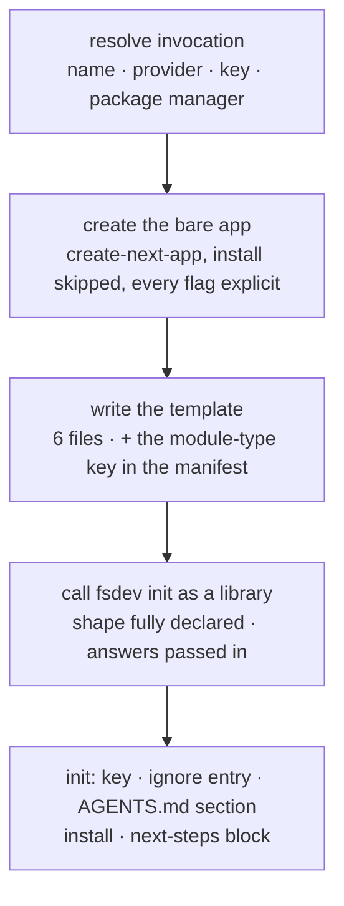

# FIX-548: `create-flow-state` — one command to a working FSD app — Implementation Spec

## Part I — The Case *(for the human)*

### 1. Problem — why it matters, why now

Someone who hears about FSD and has no project yet has nowhere to start. Adding FSD to a
repository that already exists is now agent work (FIX-1159's install skill), and that path
assumes a repository. For someone starting fresh there is no path at all short of assembling one
by hand out of our monorepo — which is the thing the epic exists to stop asking people to do.

**Why now** — Public Launch's front door is a single command, and what a stranger judges FSD by
in their first five minutes is whether that command ends at something that *visibly works*. A
scaffold that produces correct wiring and a stock "Welcome to Next.js" page has shown them
nothing.

**The honest size of the gap, restated.** The epic used to call this the weakest of its issues,
because `npx create-next-app && npx @flow-state-dev/cli init` reached the same outcome in two
commands. **That alternative no longer exists** — after the greenfield/brownfield split there is
no deterministic command that wires FSD into a directory somebody else's scaffolder just filled.
This is now the only deterministic path to a running FSD app, and §3 records what is left of the
case against it.

*Linear **FIX-548** · Epic **FIX-1161** (`epic/building-with-fsd`, PR
[#1301](https://github.com/fixpoint-labs/flow-state-dev/pull/1301)) · spec PR
[#1312](https://github.com/fixpoint-labs/flow-state-dev/pull/1312) · relates to **FIX-1159**
(spec PR [#1310](https://github.com/fixpoint-labs/flow-state-dev/pull/1310), approved) ·
Project **Public Launch**.*

### 2. Solution in plain terms

`npm create flow-state my-app` makes a directory, puts a working AI chat feature in it, and
leaves the developer looking at that feature streaming in their browser.

Three things happen in order. The bare Next.js app comes from Next's own scaffolder. **Then this
package writes its template** — the config, the route that serves flows, the demo flow, and the
page that talks to it. Then `fsdev init` is called in-process for the parts that must not exist
twice anywhere: the API key, the ignore entry that keeps it out of git, the agent-instructions
section, the dependency install, and the block of next steps that gets printed.

**This package owns the template end to end** (epic theme 1, re-drafted). That is a change from
this spec's previous draft, which had init generate the config and the host wiring while this
package supplied only demo content. That boundary existed to stop two deterministic writers
duplicating scaffolding logic; after the split there is one, so the line moved. What replaces it
is a **drift** tripwire: the template is the reference shape, checked in as real files, and the
install skill's instructions point at it rather than restating its contents.

**Philosophy** — tenet 2 (composition over features): the command's value is the ordering of
three things that already exist. Tenet 3 (earn every addition): §6 is mostly about keeping the
file list short and refusing surface — including a `--template` flag with one legal value.

### 6. Decisions & rules — the sign-off surface

1. **One package, `create-flow-state`, published unscoped.** Invoked as `npm create
   flow-state my-app`, or `npx create-flow-state my-app`.
   *Rejected:* publishing under the `@flow-state-dev/` scope (this spec's previous draft), **and
   the two-package shape** — a scoped package plus an unscoped alias — which was the natural
   compromise while the short name was believed unobtainable. Also rejected: `create-fsd-app`
   and `create-fsdev-app` (both considered by FIX-1162).
   *Locks in:* **the unscoped name is load-bearing, not cosmetic.** `npm create <name>` resolves
   to the *unscoped* `create-<name>`; a scoped publish claims nothing outside its scope, exactly
   as publishing `@flow-state-dev/cli` would not claim `fsdev`. Measured rather than assumed:
   `npm create flow-state-nonexistent-xyz123` requests
   `registry.npmjs.org/create-flow-state-nonexistent-xyz123`. So a scoped-only publish leaves
   this spec's headline command — the one thing a stranger types — resolving to a package that
   does not exist. The two-package shape would work but buys nothing: nobody would be told to
   type the scoped form, so the second package exists only to be unused (tenet 3). One package
   makes the documented command and the published artifact the same thing.
   **This is now a hard prerequisite rather than a preference, and §12 carries it as a
   dependency** — the previous draft treated the name as a convenience that removed a blocker,
   which is what let a scoped fallback look harmless.

2. **One template ships: the Next.js chat app. The framework-neutral Node API template is cut
   from v1.** *This reverses epic theme 2 and is the ask on this PR — see the framing below.*
   *Rejected:* two templates, as epic theme 2 decided.
   *Locks in:* one starter to keep green on machines we do not control, and one recorded goal
   run per release rather than two.

   2b. **No `--template` flag in v1.** *Rejected:* shipping the flag with one legal value to
   signal the plan. A flag whose only argument was a template decision 2 just cut is surface
   that documents an intention and does nothing else; someone who types `--template node-api`
   gets a refusal listing a single value, which reads worse than no such flag. The seam that
   makes a second template cheap is the `templates/<name>/` directory in §7, not the flag —
   and adding a flag nobody could have been passing breaks no invocation. If decision 2 is
   overturned, the flag arrives with the template it selects between.

3. **`create-flow-state` writes the whole FSD half of the template as real checked-in files —
   config, mount, flow, page — and calls `fsdev init` only for the parts that must not exist
   twice.**
   *Rejected:* the previous draft's split, where init generated `fsdev.config.*` and the Next
   route pair and this package supplied only the demo flow and the page.
   *Locks in:* the template is a directory a person can read, diff, and point instructions at,
   which is what epic theme 1's drift tripwire needs — a shape assembled at runtime from
   `create-next-app` output plus init's generator is not readable anywhere. It also means init's
   Next-host branch is no longer on this path (§12 raises that with FIX-1159 rather than
   deciding it). The cost is that a config generator now exists in two places and can drift;
   the epic accepted exactly that trade when it replaced "no two writers" with "watch for
   drift", and §10 spends a CI check on it.

4. **The template's config is `fsdev.config.ts`, and the template adds `"type": "module"` to the
   manifest `create-next-app` just wrote.** Measured, not assumed — see the POC in §7.
   *Rejected:* `fsdev.config.mts` (FIX-1159 decision 4), and `.ts` with no `type` field.
   *Locks in:* the config loads cleanly in both consumers at once — Turbopack builds it and the
   CLI's native `import()` takes it with no warning — and the template matches the extension
   every published doc page and both in-repo examples already use. `.mts` costs **two** edits to
   files `create-next-app` wrote (`allowImportingTsExtensions` in `tsconfig.json`, plus an
   explicit `../fsdev.config.mts` specifier that reads like a typo) because Turbopack does not
   resolve extensionless imports to `.mts`; `.ts` with no `type` field prints
   `MODULE_TYPELESS_PACKAGE_JSON` on every CLI command a beginner runs. The cost is that we edit
   a manifest — see the rule below — and that the generated project is ESM-only, which for a
   fresh Next 16 TypeScript app is the default posture anyway.

   *Rule this bends, deliberately:* FIX-1159 decision 3 says the package manager owns
   `package.json`. That rule protects a manifest **in a repository we did not create**. Here the
   directory is one this command made seconds earlier, no lockfile exists yet, the install has
   not run, and we add one key. Dependencies and the lockfile still belong entirely to the
   package manager. Stated out loud because a reviewer should see the exception, not find it.

5. **The demo flow reaches whichever provider the developer has a key for, through an intent —
   it never hard-codes one provider's model.** The config declares
   `models: { default: <the chosen provider's model>, intents: { chat: [anthropic, openai,
   google] } }`, and only the chosen provider's `@ai-sdk/*` package is installed.
   *Rejected:* a hard-coded `openai/gpt-5.4-mini` in the flow, which is what the reference
   example does.
   *Locks in:* the prompt offers three providers and all three work, because the resolver picks
   the first candidate with both a key and an installed SDK package. A hard-coded model plus an
   Anthropic key is a first-run failure with a confusing error, and it is the failure a
   three-way prompt makes most likely.

6. **The demo chat page adds no user-interface dependencies. One file, `@flow-state-dev/react`,
   and nothing else.**
   *Rejected:* porting `examples/hello-chat`'s page, which brings a component library, an icon
   set, and a session sidebar.
   *Locks in:* what gets installed is explainable in one sentence, and the first FSD code a
   newcomer reads is one file they can follow top to bottom. The cost is that the generated app
   looks plainer than our own example — the right trade for a file whose job is to be read.

7. **No path writes the API key before it has proven git will not publish it.** The template's
   host scaffold happens to cover this already (verified: git ignores `.env.local` in a fresh
   `create-next-app` scaffold), so this is an assertion, not a code branch: check, add our own
   entry if the check fails, and only then let init write the key.
   *Rejected:* assuming the entry is there because we saw it once — it is someone else's file —
   **and checking it by reading `.gitignore` for a rule that looks right.** The check must ask
   git about `.env.local` itself (`git check-ignore`), because a `.gitignore` that lists only
   `.env.example` matches a naive text search while leaving `.env.local` publishable. The POC
   made exactly that mistake before it was caught.
   *Locks in:* the guarantee the epic now states generally — a credential in version control is
   the one failure a diff review does not catch, because it looks like every other added line.
   §10 asserts it by running `git check-ignore`, not by reading the file.

**Non-goals** — anything `fsdev init` does for credentials, the agent-instructions section, the
install, and the next-steps block (FIX-1159's, and none of it exists twice here); the *content*
of the agent-instructions file (FIX-1160); the brownfield path in any form; an `--upgrade` mode
that regenerates config in an existing project; and any template beyond the one decision 2
settles.

**Size:** Small — 6 template files · 1 package entry · ~10 test behaviours · 3 doc surfaces ·
2 PRs. *Deliberately small: if this grows detection or merge logic, epic theme 1 says that is
the signal it belongs in the skill, not here.*

---

#### The ask — does the Node API template ship?

**The fork.** One starter template (a Next.js chat app), or two (that, plus a framework-neutral
Node API)?

**Plain terms.** A template is the working project someone gets from our one command. The
Next.js one ends at a chat page they can type into. The Node one ends at a server with no
screen — you prove it works by making a request to it.

**What changed since the epic decided two.** FIX-1159 settled that a plain-Node project gets no
generated server file (FSD runs there as a second process started by our own CLI) and no package
script. So everything a Node template would ship is now a `package.json`, a `tsconfig.json`, and
a demo flow with a better name than the one init writes anyway — and `fsdev init` in an empty
directory already produces that, on a path FIX-1159's own goal check runs with a real model. The
Next.js template is not in that position: the chat page and the mounted route can only come from
here, and they are what turn the ending from a stock welcome screen into something working.

**The trade-off.** The proof runs per template *times* per advertised provider (§10), so one
template is three recorded runs and two templates are six — on machines we do not control, on
every release, forever. The epic named that as an accepted cost when the Node template still
carried a server file. One template costs backend-first developers a starter with their name on
it; they get `mkdir my-api && npx @flow-state-dev/cli init`, which is two commands instead of
one and produces the same files.

**My recommendation: ship one.** The asymmetry is the argument. Adding `node-api` later is
additive — it breaks no invocation and strands nobody, because the two-command path works the
whole time. Removing it later is not. Two independent reviewers reached the same conclusion
before this was folded.

**What would change my mind:** if the launch plan points backend developers at a Node starter
*by name* — in a landing page, a comparison table, an announcement. A template that exists to be
linked to is worth more than the files it writes, and that is a business fact I do not have.

**What being wrong costs.** Wrong on shipping one: we add `node-api` in a later release and
nobody was blocked meanwhile. Wrong on shipping two: a starter we keep permanently green and
prove on every release, for a path init already proves, and a slower release loop for as long as
it lives.

**Whose call.** This reverses epic theme 2, so it belongs to the epic's owner rather than to this
spec. Noted on epic PR #1301 as well. Either answer is cheap here: §7's `templates/<name>/`
layout exists regardless, and only whether `node-api` ships in v1 — and with it decision 2b's
flag — changes.

---

### 3. Tradeoffs & alternatives

**Alternative: drop this issue entirely.** It belonged on the list while the two-command path
existed. It does not any more: after the greenfield/brownfield split there is no second command
to run, so dropping this issue means a stranger with no project has no deterministic way in at
all. What is left of the case against it is the saved keystrokes and the package name, which is
what the epic now says too.

**Alternative: bundle the Next.js app as well and call `create-next-app` never.** This is what
`create-vite` and `create-remix` do, and decision 3 makes it tempting — if we are checking in
template files anyway, why not all of them? Rejected because the aging half of a Next.js app is
the half we would then own: the framework version, the TypeScript and lint configuration, the
App Router conventions that shift between releases. Deferring to Next's own scaffolder means a
developer gets whatever Next considers correct on the day they run it. The price is a real
dependency on someone else's flag surface, and §9 says how that fails.

**Alternative: keep the previous draft's split** — init generates the config and the mount, this
package supplies only the demo content. Rejected by decision 3, but it deserves naming because
it is what the approved sibling spec still describes. The deciding argument is not duplication;
it is that the epic's replacement tripwire needs a template that can be *read*, and a runtime
assembly cannot be.

**Where the complexity is:** not in any file this package writes — five of the six are static.
It is in the **three-way handoff**: `create-next-app`'s flags (which drift, and which resolve
from saved preferences when unpassed), the manifest edit that has to land between the scaffolder
and the install, and the seam to init, which must be handed a directory whose shape is fully
declared so init writes nothing this template already wrote.

### 4. Focus practices (1–5)

1. **Tenet 3 (earn every addition)** — the file list is the spec. Six template files, one of
   which carries a substituted model string. A seventh file is a design review.
2. **Tenet 2 (composition over features)** — the test for a new code path here is: *is this a
   fact about a repository we did not create?* If yes it belongs in the skill, and if it is a
   fact about credentials, install, or the printed block it belongs in init.
3. **Tenet 7 (prove the goal, not the mock)** — the goal check runs the published invocation in
   an empty directory with **no provider key in the environment**, and ends at a streamed
   response rendered in the browser **through the mounted route** — not through `fsdev run`,
   which does not exercise the Next.js server bundle where the provider SDK is dynamically
   imported (§12).
4. **BP-003 (execute the claim, don't read it)** — every printed command is asserted by running
   it, and the ignore guarantee by `git check-ignore`. A plausible-looking transcript has hidden
   a broken command three times across this epic.
5. **BP-035 (second-path checklist)** — the second path is **failure after a partial scaffold**.
   `create-next-app` failing, or init failing after it succeeded, both leave a real directory on
   someone's disk; §9 says what each prints, and neither rolls back.

### 5. What using it looks like (1–5 examples)

**The whole product** *(what this spec proposes; no such command exists today)*:

```
$ npm create flow-state my-app

? Model provider ›  OpenAI
? OPENAI_API_KEY ›  sk-••••••••

  Creating my-app with create-next-app …
  Writing the chat template …
  Running fsdev init …

  Created   fsdev.config.ts          lib/flowstate.ts
            src/flows/chat/flow.ts   app/page.tsx
            app/api/flows/route.ts   app/api/flows/[...path]/route.ts
  Wrote     .env.local  (OPENAI_API_KEY, already ignored by git)
  Appended  AGENTS.md  (FSD section)
  Installed via npm

  Next steps

    cd my-app
    npm run dev                    your app  → http://localhost:3000
    npm exec fsdev dev             the FSD DevTool  → http://localhost:4200
    npm exec -- fsdev run chat send --input '{"userId":"u1","message":"hi"}'

  Storage is on-disk for development. Pick a real store before you deploy.
  The app and the DevTool are two processes over one development store —
  drive one at a time.
  AGENTS.md tells your coding assistant how to write FSD flows.
```

Everything from `Created` down is **init's output, printed by init** (epic theme 5). The three
lines above it are this package's. Two details in the block are load-bearing rather than
cosmetic: `npm exec` needs the `--` separator or npm consumes `--input` as its own configuration
and the command fails, and the two-process caveat is real because both printed servers open the
same development store. §10 asserts the first by running it.

**Non-interactively**, which is how the goal check and CI run it:

```
$ npm create flow-state my-app -- --provider openai --package-manager pnpm -y
```

**When the directory is already taken** — the refusal happens before anything is created:

```
$ npm create flow-state my-app
  ✗ ./my-app already exists and is not empty. Pick another name or remove it.
```

## Part II — The Build Plan *(for the implementing agent)*

### 7. Technical design

A new published package, `create-flow-state`, whose entry point is a four-step pipeline. It has
no runtime dependency on this monorepo beyond the published `@flow-state-dev/cli` it imports, and
nothing it writes into the generated project imports anything of ours that is not on npm (epic
theme 4).

**Its manifest `name` is the bare `create-flow-state` — the one package in this repository that
is not `@flow-state-dev/*`.** Called out because every other package here is scoped and the
convention is otherwise right to follow (BP-008 conformance): scoping this one would silently
break `npm create flow-state`, and the directory being `packages/create-flow-state/` does not
by itself set the published name.



**Step 1 — resolve the invocation.** Flags first, prompts for whatever is missing, `-y` to take
defaults for everything unflagged. Validation (project name is a legal npm package name, target
directory absent or empty, Node at or above the runtime floor) happens **here**, before any
directory is created, so a refusal never leaves debris.

**Step 2 — create the bare app.** Spawn `create-next-app` with **every** flag passed explicitly,
installation skipped, git left enabled. Explicit matters more than it looks: `create-next-app`
persists saved preferences between runs and silently fills unpassed options from them, so a flag
we omit can resolve differently on a developer's machine than on ours. `--yes` is not a
substitute for passing them.

**The version is pinned to an exact release in the spawned specifier** — `create-next-app@16.3.1`,
not `@16` and not bare — held in one constant in this package and bumped as a deliberate change
with a goal-check run behind it. A major-range pin does not hold the guarantee: `@16` re-resolves
to the newest 16.x on every invocation, so a Next minor that moves a flag or the generated layout
reaches users the day it ships, which is exactly what the pin exists to prevent. The CI argv
assertion (§10) reads the pinned specifier, so both removing it and loosening it to a range fail
a test. The pin cannot *detect* upstream drift — nothing stubbed can — so the goal check is the
detector and the pin is what keeps the gap between drift and detection off users' machines.

**What the exact pin costs, stated plainly:** `create-next-app` writes an *exact* `next` version
into the manifest it generates, so pinning the scaffolder also pins the Next version new projects
start on. Bumping it is therefore **routine scheduled maintenance with a goal-check run**, not a
rare event — a starter a few months behind on Next is a real cost, and the alternative is a
starter that breaks without warning. §9's drift row is the same failure either way; the pin only
decides whose terminal it happens in.

**Step 3 — write the template.** Six files, materialized from `templates/nextjs-chat/`, plus one
manifest key. This is the entire product surface:

| file | what it is |
|---|---|
| `fsdev.config.ts` | default-exports `createFlowState({ flows, models, stores })`. Registers the demo flow explicitly, declares decision 5's intent map with the chosen provider's model as `default`, and declares FIX-1159 decision 5's development file store, qualified as such |
| `lib/flowstate.ts` | re-exports the config's default as `flowstate`. Reconciles the CLI (which searches the project root for `fsdev.config.*`, cwd-only) with the routes (which import through the `@/` alias). Both in-repo examples do this; the published quick-start does not, and §11 fixes that |
| `src/flows/chat/flow.ts` | the demo flow — one action, one streaming generator, model `intent/chat`. `examples/hello-chat`'s flow is the reference for shape, not for size. Path matches what the docs teach |
| `app/api/flows/[...path]/route.ts` | `createNextHandler(flowstate)` from `@flow-state-dev/next` — the platform-agnostic adapter, no Vercel assumption. **Carries the canonical route exports beside it: `runtime = "nodejs"` and `dynamic = "force-dynamic"`.** Not decoration — `packages/next/README.md` ships exactly those three lines, and `examples/hello-chat` documents why: without `force-dynamic` Next may buffer the response body, and a buffered body turns token-by-token streaming into one delivery at the end. That is the epic's headline outcome failing while every wiring check passes |
| `app/api/flows/route.ts` | the sibling bare route. `list_flows` is registered as `GET /` on the mount base and the client's `listFlows()` requests it, but a required catch-all cannot match zero segments. `@flow-state-dev/next` exports no bare handler (only `@flow-state-dev/vercel` does), so this one forwards by hand with a comment saying why — carrying the same route exports as its sibling |
| `app/page.tsx` | the chat page. `FlowProvider` + `useFlow` + `useSession` + `ItemsRenderer` from `@flow-state-dev/react`, no other imports (decision 6). Overwrites `create-next-app`'s stock page — permitted, because this is a directory this command created seconds ago |
| *manifest* | `"type": "module"` added — decision 4. Nothing else; dependencies and the lockfile are the package manager's |

**Why the config shape is what it is — measured.** The template's config has two consumers at
once: Turbopack, because the route imports it, and the CLI's native `import()`. Nobody had
checked the first. The POC at [`spec-poc/FIX-548-next-template-shape/`](../spec-poc/FIX-548-next-template-shape/)
scaffolds a real `create-next-app@16.3.1` project and runs both against every candidate shape —
run it with `bash spec-poc/FIX-548-next-template-shape/probe.sh`. It settled decision 4 and turned
up three facts nothing in this epic knew: `create-next-app` writes its **own** `AGENTS.md`, with
its own delimiters, and a `CLAUDE.md`; git ignores `.env.local` in a fresh scaffold; and the tool
fills unprovided options from saved preferences. The first matters most — **the greenfield Next
path appends to an existing `AGENTS.md`, it never creates one**, which is the case everyone had
filed under brownfield. Each of those is an assertion in the probe, and its README states what
the probe deliberately does *not* establish, so the citation and the evidence stay one-to-one.

**Step 4 — hand off to init.** What crosses the seam, and nothing more:

| passed in | why |
|---|---|
| the target directory | init otherwise runs against the cwd, which is the parent |
| the declared host (`next`) | selects the Next shape of the next-steps block. **Not** a request to write the mount — decision 3 already wrote it |
| the declaration that config, flows and wiring are present | init must author none of them, and must not treat a non-empty directory as undeclared (FIX-1159 decision 2 turns on *declared*, not *empty*) |
| provider and key | collected in step 1; a second prompt for the same key is the thing this seam exists to prevent |
| the package manager | one manager, one lockfile |
| **returned:** the next-steps block | printed once, by init, byte-identical to a standalone init run (epic theme 5) |

**Ordering, and why it is not incidental.** The template is written *before* init runs, so init
sees a fully declared shape and authors nothing that competes. `create-next-app` must skip its
install, or the project installs twice and the second run rewrites the lockfile the first wrote.
And the manifest's `"type": "module"` must land before the install, because the package manager
rewrites that file.

**Untouched:** the engine, the adapters, the CLI's existing commands, every block kind. This
package generates a project; it changes no framework behaviour.

### 8. Implementation sequence

1. **The package skeleton and its invocation surface** — flags, prompts, `-y`, package-manager
   detection, the runtime-floor gate, and all of §9's validation refusals.
   *Test:* every refusal in §9's first block, each asserting nothing was created. *Depends on:*
   nothing.
2. **The bare-app step** — spawn `create-next-app` with every flag explicit and install skipped;
   surface its failure. *Test:* the argv built (complete enough that no option resolves from
   saved preferences; install skipped), and the failure path's output. *Depends on:* 1.
3. **The template** — the six files and the manifest key.
   *Test:* the generated project builds and its mounted route serves; the config loads under a
   native `import()` with no warning; `.env.local` is ignored by git before the key is written.
   *Depends on:* nothing.
4. **The init handoff** — call init with the declared shape and collected answers, print what it
   returns. *Test:* the call ordering (template before init), the arguments crossing the seam,
   that init authored no config or flow of its own, and that the printed block matches a
   standalone init run. *Depends on:* 1, 2, 3, **and FIX-1159's library seam existing.**
5. **Publish configuration and the README that renders on npm.** *Depends on:* 1.

**PR plan.** Two sub-PRs.

| sub-PR | deliverables | depends_on |
|---|---|---|
| a | the package: invocation surface, bare-app step, the template, init handoff (steps 1–4) | — |
| b | publish configuration, package README, and the three doc surfaces in §11 (step 5) | a |

### 9. Edge cases & error handling

**Refusals — before anything is created:**

| Case | Expected |
|---|---|
| Target directory exists and is not empty | Refuse, naming the path. |
| Project name is not a valid npm package name | Refuse, saying which rule failed, and offer the sanitized form. |
| Node runtime below the floor the generated project needs | Refuse, with the same floor and the same message init uses. Do **not** narrow the package's `engines` below the repo-wide `>=22` — FIX-1159 §9 records why. |

**The credential stop — after the scaffold exists, before the key is written.** Its own
category, because it is neither of the other two and putting it in either produced a
contradiction in an earlier draft of this section: the check can only run once
`create-next-app` has made the directory and written `.gitignore`, so it cannot be a refusal
that "leaves the disk untouched", and deleting the scaffold to make it one would contradict the
no-rollback rule directly below.

| Case | Expected |
|---|---|
| `.env.local` is about to be written | Ask git whether it would ignore that exact path (`git check-ignore`), never whether `.gitignore` contains a rule that looks right. In a fresh `create-next-app` scaffold the answer is already yes (verified), so this is normally an assertion rather than a write — but it is the assertion the credential stop rests on, so it is made against the path, not the text. |
| The ignore entry cannot be established | **Stop before the key is written.** The scaffold stays on disk and is left usable; print what is missing, the one line to add to `.gitignore`, and the command to finish. Never write the key "and warn" — the warning scrolls away and the credential does not. |

**Failures after work has started — nothing rolls back:**

| Case | Expected |
|---|---|
| `create-next-app` fails, is unreachable, or rejects a flag | Report its output, name the directory as it stands, and print the two commands that finish the job by hand. Do not delete it. |
| `create-next-app` changes its flag surface or generated layout | The **exact** pinned version (§7 step 2) means an upstream change cannot reach users until we bump it, so this surfaces as a failing goal check on *our* release rather than as a hang in a stranger's terminal. A major-range pin would not hold that. Treated as a patch-level fix. Nothing stubbed can detect this — the goal check is the only detector. |
| The pinned `create-next-app` falls behind | New projects start on an older Next than current. Bumping the pin is scheduled maintenance gated on a goal-check run, not a reaction to breakage. |
| Init fails after the template was written | The scaffold stays. Print init's own retry command against that directory. Mirrors init's install-failure taxonomy, which also leaves files and prints the retry. |
| Install fails inside init | Init's case, not this one. It reports and this command adds nothing. |
| `-y` with no key in flags or environment | Scaffold completes. `.env.local` carries the empty key line init writes, and one line before the next-steps block says the key is still needed. Do not refuse — an unattended scaffold is legitimate. |
| The developer runs `npm run dev` and `fsdev dev` together | Both open the same development file store; concurrent writes to one session can each be accepted. Tolerable for a development default, and the next-steps block says to drive one at a time (§12 raises the wording with FIX-1159, which owns the block). |

**Taxonomy — three categories, and the middle one exists because the first two could not hold
it.** Refusals happen before anything is created and leave the disk untouched. The credential
stop happens after the scaffold exists and leaves it there, minus the key. Failures leave a
directory the developer can inspect and finish by hand. Nothing is ever cleaned up behind the
user, because deleting a directory a stranger may have put something in is worse than leaving
one they can `rm` — which is also why the credential stop does not "undo" the scaffold to
qualify as a refusal.

### 10. Testing strategy

**Goal & goal check** (the epic's proof for this issue). Recorded runs under
`goals/create-flow-state/` — **three for the one template**, one per advertised provider, and
three more per additional template if decision 2 is overturned. That count is the real cost the
ask above is pricing: it is per template *times* per provider, not per template:

- In an **empty directory, with no provider key in the environment**, run the published
  invocation, supply the key at its prompt, then run the printed dev command and send a message
  in the browser: a streamed model response renders in the page — and **renders
  incrementally**, token by token, not as one block when the response completes. The second half
  is the only check anywhere that would catch a missing `force-dynamic`; everything else passes
  with a buffered body.
- **Through the mounted route, not through `fsdev run`.** The provider SDK is imported
  dynamically by package name inside the Next.js server bundle, where `createModelResolver`
  carries an explicit fallback for it failing to resolve (§12). A CLI-only check passes with
  that path broken.
- **Run once per advertised provider, single key only** — an OpenAI-key run, an Anthropic-key
  run, a Google-key run, each with the other two absent. Decision 5 is the reason: a prompt
  offering three providers where only one works is a first-hour failure, and one run with the
  most-likely key would not find it.
- The key is deliberately *not* pre-exported. PR #1301's review note 8 called that out:
  pre-supplying it skips the credential path, so the check passes while a real user's first
  command fails.

**CI specs** (behaviours, not test names) — all against a stubbed `create-next-app` and a stubbed
init, in a temporary directory, with no network and no install, **except the three marked
*real*, which build a scaffolded project once**:

- one behaviour per decision in §6
- ***real*: the generated project builds and its mounted route serves** — the check that decision
  4 keeps passing when Next's resolution behaviour moves under us. This is the drift tripwire
  decision 3 owes; it is the only assertion that covers the template's contents rather than its
  file names
- ***real*: the config loads under a native `import()` with no warning** — asserted on stderr,
  because `MODULE_TYPELESS_PACKAGE_JSON` is a first-hour wart that no functional test fails on
- **both route files carry `runtime = "nodejs"` and `dynamic = "force-dynamic"`** — asserted on
  the generated files against `packages/next/README.md`'s canonical shape. Cheap and worth it
  because the failure it guards is invisible to every other check here: without `force-dynamic`
  the wiring is correct, the response is correct, and only the *timing* is wrong — tokens arrive
  in one lump at the end instead of streaming. A CI stub cannot see that, and a human demoing it
  might not either
- ***real*: `git check-ignore .env.local` succeeds before the key is written** — executed, not
  read, and specifically before, because ordering is the whole guarantee (decision 7)
- **the credential stop leaves a usable scaffold and no key** — run it against a scaffold whose
  ignore entry cannot be established, and assert the directory is intact, `.env.local` holds no
  key, and the output names the missing line. This is the §9 case that is neither a refusal nor
  a failure, so nothing else in this list covers it
- **the template is written before init is called** — asserted on call ordering, not end state,
  since a package that wrote afterwards and deleted init's files would leave an identical
  directory
- **init authored no config and no flow** — asserted on what crossed the seam, because the
  symptom otherwise is a second flow file appearing beside the advertised one
- **the collected provider and key reach init** — asserted on the call, so a regression shows up
  as a failing test rather than a second prompt in someone's terminal
- **`create-next-app` is invoked with install skipped, every flag explicit, and an *exact* pinned
  version in the specifier** — asserted on the argv, and the assertion rejects a range as well as
  a missing pin, since `@16` silently re-resolves. The symptoms otherwise are "the first hour is
  slower", "it behaved differently on my machine", and a version nobody tested
- **the printed next-steps block is byte-identical to a standalone init run** (epic theme 5)
- **every printed command runs** — execute the strings the block emitted, in the generated
  project, and assert the process starts. This is where npm's `--` separator is caught
- every refusal in §9's first block, each asserting nothing was created
- `-y` with no key: the scaffold completes and the output says the key is missing

**Where each lives.** The goal checks are real-machine runs under `goals/create-flow-state/` —
real network, real `create-next-app`, real model, real browser — and are never part of the vitest
suite. The three *real* CI specs scaffold once and are the slowest thing in the suite; they earn
it, because everything else in the list would pass against a template that does not compile.

**Discipline:** `tdd`. The seam is the pipeline against a temporary directory with both
subprocesses stubbed.

### 11. Documentation plan

- **EXTEND** `apps/docs/docs/getting-started/quick-start.md` — lead with this command for
  someone starting fresh, and point across to the existing-project page (FIX-1159) for someone
  who already has one. **It also needs correcting:** it teaches `lib/flowstate.ts` holding
  `createFlowState(...)` with no root `fsdev.config.ts`, which produces a project the CLI cannot
  drive (config search is cwd-only and wants a default export). The template's shape — root
  config, `lib/flowstate.ts` re-export — is the one to teach.
  *Voice risks:* a scaffolding command attracts "instantly", "zero-config", "just works" — none
  of them. Say what it creates and what it does not (the development store is not a deployment
  store; there is no authentication).
- **CREATE** `packages/create-flow-state/README.md` — the npm landing page. Install snippet, the
  flag table, what the generated project contains, a link to the docs site. Must render on
  npmjs.com.
- **EXTEND** the root `README.md` — the quick-start section. **FIX-1159 also edits this section**
  and lands first, so this issue edits the version FIX-1159 leaves rather than the one on `main`.
  Worth checking at implementation time rather than assuming.
- **No blog post.** This ships as part of Public Launch; the announcement is that project's.
- **A changeset is required** (BP-022) — a new published package is as user-facing as it gets.

### 12. Dependencies, open questions & follow-ups

**Dependencies.**

- **FIX-1159 blocks implementation, not specification.** This package cannot be built until
  init's library seam exists, and cannot merge before init merges. §7's step-4 table is the
  required interface; it is **smaller than the previous draft's**, because decision 3 moved the
  config and the mount here.
- **Publishing the unscoped `create-flow-state` is a hard prerequisite** (decision 1). Not a
  naming preference: without it the headline command resolves to nothing, and there is no
  in-scope workaround, because a scoped publish cannot serve `npm create flow-state`. What is
  and is not established, stated separately because the difference matters:
  - **Verified today against the registry:** `create-flow-state` returns 404, as do
    `flow-state-app`, `flow-state`, `fsdev`, and every `@flow-state-dev/*` package. Nothing in
    this project has ever been published.
  - **Asserted, not verified:** that the name is ours. npm has no reservation mechanism — a name
    is claimed by publishing, and nothing is published — so "the owner holds it" cannot yet be
    confirmed from outside. The epic coordinator has the ownership question with the owner.
  - **Verified, and it corrects a claim this spec previously repeated:** `create-fsd-app` is
    **not** ours. `create-fsd-app@1.1.2` exists, published 2024-10-18 by an unrelated maintainer
    (`keyready`), and is a React/Vite starter. FIX-1162's original finding was right; the later
    report that we had acquired it does not survive checking. This does not affect the chosen
    name, and it is the reason the bullet above distinguishes verified from asserted at all —
    the same assumption was already wrong once.
  - **Deliberately not designed around.** No fallback name, no scoped alias, no conditional
    branch. If the name turns out not to be obtainable, that is a different spec, and inventing
    a fallback here would spread a contingency through §5, §6, §7, §9 and §11 to hedge a
    question that will be answered before anything is built.

**Cross-issue notes — raised, not decided here.**

- **FIX-1159's Next-host branch is no longer on this path.** Its write mode authors
  `fsdev.config.mts`, `flows/hello/flow.mts` and the Next route pair for a declared Next host;
  decision 3 means the only Next caller writes all three itself. Whether that branch keeps
  earning its place, or write mode narrows to the plain-Node shape it is actually used for, is
  FIX-1159's call. Nothing here is blocked either way.
- **Decision 4 differs from FIX-1159 decision 4 on the same file.** Init writes
  `fsdev.config.mts`; this template writes `fsdev.config.ts` plus `"type": "module"`. That is not
  a contradiction — init's rule covers a directory whose manifest it does not control, and this
  one covers a manifest we created — but the two outputs now differ, so FIX-1159's "align the
  corpus on `.mts`" follow-up should weigh that the greenfield flagship went the other way, with
  measurements.
- **The next-steps block owes a two-process line.** Both commands it prints for a Next host open
  the same development file store (§9). FIX-1159 owns the block's wording.
- **The epic's prose is stale on the name; FIX-1162's original finding was not.** The epic says
  `create-fsdev-app`, adopted because `create-fsd-app` was unobtainable — and that premise is
  **correct** (verified: held by a third party since 2024). What changed is the choice, not the
  finding: decision 1 takes `create-flow-state`, which is unpublished and available. FIX-1162's
  work is therefore superseded on *which* name, not corrected on its facts.
- **The unscoped-vs-scoped point applies beyond this issue.** `npm create <name>` and a bare
  `fsdev` on the path both need unscoped names, and nothing under `@flow-state-dev/` is
  published either. FIX-1159's printed commands (`npm exec fsdev …`) depend on the CLI package
  resolving a `fsdev` bin, which is a different question from owning the `fsdev` *package* name
  — worth FIX-1162 stating explicitly which names the launch actually requires, since this
  issue only needs one of them.
- **`create-next-app` writes `AGENTS.md` and `CLAUDE.md` itself**, with its own delimited block
  in the former. Epic Q1's append-never-overwrite guarantee therefore binds the *greenfield* path
  too, which the epic files under brownfield. The POC confirmed an appended FSD section, and
  Next's own block, both survive a `next dev` run intact.

**Open questions:** one, and it is §6's decision 2 — does the Node API template ship? Raised as a
decision with a recommendation rather than left open, because leaving it open would block a spec
on a question the spec can answer either way. The answer changes whether §10 records three goal
runs or six, and whether decision 2b's flag exists. Nothing else.

**Verified premises** (measured or read from the code, so a reviewer need not re-derive them):

- **Module loading in a real `create-next-app@16.3.1` project, probed** (the POC in §7):
  Turbopack does **not** resolve an extensionless import to a `.mts` file (`Module not found`);
  an explicit `.mts` specifier fails TypeScript with `TS5097` unless `allowImportingTsExtensions`
  is set; `.mts` with that flag builds; `fsdev.config.ts` with `"type": "module"` builds **and**
  loads under a native `import()` with no warning; without the `type` field the same file loads
  but emits `MODULE_TYPELESS_PACKAGE_JSON`. Confirmed end to end: `next dev` served both
  `GET /api/flows` and a nested catch-all path through the config module.
- **`npm create <name>` resolves to the unscoped `create-<name>`**, measured:
  `npm create flow-state-nonexistent-xyz123` requests
  `registry.npmjs.org/create-flow-state-nonexistent-xyz123`. A scoped package cannot serve that
  invocation form, which is why decision 1's unscoped publish is a prerequisite rather than a
  preference.
- **Registry state, checked today:** `create-flow-state`, `flow-state-app`, `flow-state`,
  `fsdev` and `@flow-state-dev/cli` all return 404; `create-fsd-app@1.1.2` exists and belongs to
  an unrelated maintainer since 2024-10-18.
- `packages/cli` has **no `init` command today** (`src/commands/` holds `run`, `dev`, `serve`,
  `chat`, `block`, `ui`, `benchmark`), so exposing init as a library is an addition to that
  surface, not a change to it.
- The config loader's filename precedence is `fsdev.config.{ts,mts,js,mjs}`, searched **cwd-only**.
  The CLI *does* have a directory scan (`src/flows/`, `flows/`), but it is the **fallback for
  projects with no config** — once a config resolves, `fsdev dev` and `fsdev run` serve that
  config's own `FlowState` and its explicit registry. The template ships a config, so the demo
  flow must be registered in it; a flow file alone would not be found.
- `fsdev serve` defaults to `$HOST ?? 0.0.0.0` and `$PORT ?? 3000` — **not 8787, as the epic's
  Node transcript shows** — and `assertNetworkBindIsAuthenticated` refuses a network bind for an
  unauthenticated flow. This template's next steps never print `fsdev serve`; the hazard is
  recorded because the epic's transcript is wrong and the Node template it belongs to is what
  decision 2 cuts.
- `fsdev dev` binds `127.0.0.1:4200`, so the bind guard is not in play; with a config present it
  serves the app's **own** `FlowState` (its stores, its flows) rather than the SQLite discovery
  path, which is why the two-process store note in §9 applies.
- Provider detection maps exactly three providers to env vars: `anthropic`/`ANTHROPIC_API_KEY`,
  `openai`/`OPENAI_API_KEY`, `google`/`GOOGLE_GENERATIVE_AI_API_KEY`.
- Provider SDKs are **dynamically imported by package name** (`@ai-sdk/openai`,
  `@ai-sdk/anthropic`, `@ai-sdk/google`); `@ai-sdk/openai` is only a *dev* dependency of `core`,
  so none reaches a consumer. `createModelResolver` carries a `directLoadFailed` set for the case
  where a provider package "cannot be resolved on disk (bundled Next.js)" — an acknowledged
  hazard on exactly this template's path, and why §10's goal check goes through the route.
- `@flow-state-dev/devtool` is an *optional peer* of the CLI, satisfied only inside this
  monorepo. Init's install covers both it and the provider SDK; this package adds nothing.
- `@flow-state-dev/next` exports only `createNextHandler` (catch-all); the bare-path handler
  exists only in `@flow-state-dev/vercel`. Both in-repo mounts hand-write the bare forwarder,
  with a comment saying why.
- **The canonical mount is three exports, not one.** `packages/next/README.md` ships
  `createNextHandler(flowstate)` alongside `runtime = "nodejs"` and `dynamic = "force-dynamic"`,
  and `examples/hello-chat`'s catch-all carries `force-dynamic` with the reason in a comment:
  without it Next may buffer the response body and defeat token-by-token delivery. The published
  Vercel quick-start adds `maxDuration = 300` on top; that one is deployment-shaped rather than
  correctness-shaped, so the template takes the two from the platform-agnostic README and leaves
  `maxDuration` to whoever deploys.
- Both in-repo Next apps reconcile the root config with the routes through a `lib/` re-export;
  the published quick-start does not, and §11 corrects it.
- `examples/hello-chat` is the shape reference for the flow and page, not the content reference:
  its page pulls in a component library, an icon set, and a session sidebar, which decision 6
  declines.

**Follow-ups (flagged, not built):**

- **The `node-api` template**, if decision 2 goes the other way later. Additive; arrives with
  the `--template` flag (decision 2b).
- **A bare-path handler in `@flow-state-dev/next`**, matching `createVercelBareHandler`. Would
  turn one hand-written template file into a one-liner. FIX-1159 flags the same gap.

### 13. Review notes for the implementer

Spec-PR feedback recorded rather than folded. These are inputs, not instructions.

- **"The one-command promise disagrees with the stopping point"** — codex, on §2. The finding:
  §2 says the command leaves the developer looking at the feature streaming, while §5's
  transcript ends after scaffolding and prints `npm run dev`, and §10 starts it separately. Two
  ways out were offered — have the scaffolder start and open the app, or restate the outcome as
  a ready-to-run project.

  **Neither was taken; the mismatch is upstream and is being fixed there.** Checked directly:
  the epic's §1 states the *Outcome* as "in one step" (line 17) while its *Proof* for this issue
  says "the npx command **followed by the printed dev command** yields a streamed model
  response" (line 57). The Proof is the precise statement and was deliberately sharpened at epic
  review round 3, so §1's Outcome is the loose half — the epic-agent is folding it. This spec
  already matches the Proof: §5's transcript is the exact stopping point and §10 measures from
  it.

  **Do not add auto-start or auto-open.** `create-next-app` and `create-vite` both stop and
  print the dev command, and taking the first option would be scope growth bought with a
  reviewer's phrasing rather than a requirement. Recorded here so it does not return a third
  time.

  *If §2's compression still reads as overclaiming once the epic lands, the fix is one sentence
  in §2 — never a behaviour change in the scaffolder.*

---

## Spec evolution

- **Spec drafted** — scoped to the two things neither `create-next-app` nor `fsdev init` could
  produce (a demo flow and the page that talks to it), everything else delegated. Settled the
  init handoff as a library call rather than a subprocess, so the API key is asked for once.
  Declined to maintain a Next.js skeleton. Raised the Node API template as the spec's one ask.
- **Re-drafted against three decisions that landed after drafting** — not a review round.
  (1) *The greenfield/brownfield split.* Brownfield is an agent skill and the deterministic
  wrapper relationship this spec was built on is gone; the epic's re-drafted theme 1 gives this
  issue its template end to end, so §6 decision 3 moves the config and the Next mount here and
  §7's seam to init shrinks to credentials, the agent-instructions section, the install, and the
  printed block. (2) *One template.* The Node template's remaining delta is two files `npm init`
  writes, and the ask is re-argued on the asymmetry rather than on file count; decision 2b drops
  the `--template` flag with it, since a flag with one legal value documents an intention and
  does nothing. (3) *The package name is `create-flow-state`*, which also removes FIX-1162 as a
  gate by any route rather than by a workaround.
- **A POC settled the shape the re-draft depends on.** Owning the template end to end means
  owning the config file, which has two consumers — Turbopack and the CLI's native `import()` —
  and nobody had checked the first. A real `create-next-app@16` project showed that `.mts` costs
  two edits to files the scaffolder wrote (Turbopack will not resolve it extensionless, and
  TypeScript rejects the explicit specifier without `allowImportingTsExtensions`), while
  `fsdev.config.ts` with `"type": "module"` builds, serves, and loads warning-free. It also
  turned up that `create-next-app` writes its own `AGENTS.md` and `CLAUDE.md`, and that git
  ignores `.env.local` in a fresh scaffold — so the greenfield path *appends* to an
  agent-instructions file, a case the epic had filed under brownfield.
- **The POC was narrowed to what it actually proves.** Four review rounds found the same defect
  class — a check that could not fail the claim it was cited for — so the last pass went through
  its README claim by claim and required each to be either assertion-backed or deleted. Deleted:
  that `--agents-md` is on by default (the probe passes the flag explicitly, so it establishes
  only that the file is written *when asked* — which is what the design needs), and that
  `next dev` re-creates a missing block (its block is present beforehand, so the check proves it
  was left alone). Fixed rather than narrowed, because decision 7 rests on it: the ignore check
  now asks `git check-ignore` about `.env.local` instead of grepping `.gitignore` for `^\.env`,
  which also passes for a file listing only `.env.example`.
- **The unscoped name became a prerequisite, and one inherited fact was corrected.** The previous
  draft said "published unscoped" but argued it as brand fit, which left the scoped form looking
  like a harmless fallback — it is not: `npm create <name>` resolves to the *unscoped*
  `create-<name>`, so a scoped publish would leave the headline command pointing at nothing.
  Decision 1 now says so with the measurement, and rejects the scoped-plus-alias compromise as
  a second package nobody would be told to type. §12 carries the publish as a hard dependency,
  separating what is verified (every relevant name 404s; nothing has ever been published under
  this project) from what is asserted (that the name is ours). While checking, the claim that we
  had acquired `create-fsd-app` turned out to be false — it has belonged to an unrelated
  maintainer since 2024, so FIX-1162's original finding stands and only the *choice* of name
  moved. No fallback is designed for the name not being obtainable; that would spread a
  contingency through five sections to hedge a question answered before anything is built.
- **Three earlier findings carried forward rather than lost.** The credential hazard became
  decision 7 and an executed `git check-ignore` assertion instead of an assumption about someone
  else's file. Provider/model alignment became decision 5's intent map, with the goal check run
  per provider on a single key. And the printed commands are asserted by execution, which is what
  catches npm's `--` separator.
