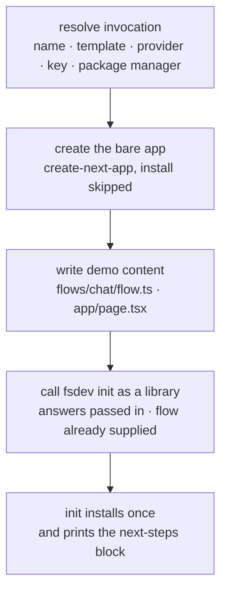

# FIX-548: `create-fsd-app` — npx-able scaffolding for new FSD projects — Implementation Spec

## Part I — The Case *(for the human)*

### 1. Problem — why it matters, why now

Someone who hears about FSD and has no project yet has nowhere to start. `fsdev init`
(FIX-1159) solves the case where a project already exists; it does not create one, and it
deliberately writes no user interface. So the empty-directory path today is: create an app with
somebody else's tool, run our init, and then write the code that actually calls a flow — three
steps and a blank page at the end of them.

**Why now** — Public Launch's front door is a single command, and the thing a stranger
judges FSD by in the first five minutes is whether that command ends at something that
*visibly works*. A scaffold that produces correct wiring and a stock "Welcome to Next.js" page
has not shown them anything.

**The honest size of the gap.** It is one command and one screen, not a workstream. The epic
says so plainly: `create-fsd-app` is the weakest of its three issues, `npx create-next-app &&
npx @flow-state-dev/cli init` already reaches the outcome in two commands, and this issue
survives scoped down to a thin wrapper. This spec holds that line, and §6's fourth decision
asks whether one half of it should be cut further.

*Linear **FIX-548** · Epic **FIX-1161** (`epic/building-with-fsd`, PR
[#1301](https://github.com/fixpoint-labs/flow-state-dev/pull/1301)) · depends on **FIX-1159**
(spec PR [#1310](https://github.com/fixpoint-labs/flow-state-dev/pull/1310)).*

### 2. Solution in plain terms

One command that makes a directory, puts a working AI feature in it, and leaves the developer
looking at that feature running in their browser.

Almost none of the work is ours. The bare app comes from the host framework's own scaffolder;
the wiring, the credentials, the dependencies, the install, and the "what to run next"
instructions all come from `fsdev init`. What this package adds is the two things neither of
those can supply: **the demo flow, and the page that talks to it.** That is the whole product.

**Philosophy** — tenet 2 (composition over features): this command is a sequence of three
things that already exist, and its value is the ordering, not the parts. Tenet 3 (earn every
addition): every file it writes that init could have written is a file that now has two
owners, which is why the file list is three files long and §6 is mostly about keeping it there.

### 6. Decisions & rules — the sign-off surface

1. **`create-fsd-app` calls `fsdev init` as a library, in the same process — not by shelling
   out to a second command.**
   *Rejected:* running `npx @flow-state-dev/cli init` as a subprocess, which is how a
   scaffolder normally chains tools.
   *Locks in:* the developer answers each question once. A subprocess cannot be handed the
   provider and key the wrapper just collected, so it asks for them again — being asked for
   your API key twice by one command is the kind of first-hour detail people quietly conclude
   things from. It also pins the wrapper to the exact init it was tested against instead of
   whatever `npx` resolves that day, and it makes the shared next-steps block shared by
   construction rather than by agreement. **The cost is a constraint on an issue currently in
   spec review**: four things that would otherwise be internal to init become its public
   surface (see §7). That note goes on PR #1310, and this spec cannot be built until it is
   accepted there.

2. **The Next.js app comes from `create-next-app`, run with installation skipped. We do not
   maintain a Next.js skeleton.**
   *Rejected:* bundling our own minimal Next.js app in the package, which is what this issue's
   original body proposed and what `create-vite` and `create-remix` do.
   *Locks in:* we never own the aging half of a Next.js app — the framework version, the
   TypeScript and lint configuration, the App Router conventions that shift between releases.
   A developer gets whatever Next.js currently considers correct, on the day they run it.
   Skipping that scaffolder's install matters as much as using it: the project then installs
   exactly once, when init installs, instead of twice with the second run rewriting the
   lockfile the first just wrote. **The cost is a real dependency on someone else's flag
   surface** — when `create-next-app` changes its flags, our most important command breaks. It
   breaks loudly and in public, which is the redeeming feature; we pin a tested major range
   and treat it as a patch-level fix.

3. **v1 publishes under the scoped name we already own, `@flow-state-dev/create-fsd-app`. The
   unscoped `create-fsd-app` becomes an alias if and when FIX-1162 secures it.**
   *Rejected:* waiting for the short name before this spec commits to a headline command,
   which is what the epic's running index currently assumes.
   *Locks in:* this issue stops being blocked by a credential task nothing in the epic holds —
   the same move FIX-1159 made for the same reason, so both entry paths are unblocked by the
   same reasoning rather than one of them waiting on registration. The cost is that v1's
   documented command is `npx @flow-state-dev/create-fsd-app my-app`, which is longer than the
   one the epic's transcripts show. Cheap to revise: adding the alias later changes the docs
   and a package name, not any code this spec describes.

4. **Ship the Next.js chat template in v1. Do not ship the Node API template.**
   *This one reverses an epic theme and is the ask on this PR — see the framing below.*
   *Rejected:* two templates, as epic theme 2 decided.
   *Locks in:* one starter to keep green on machines we do not control, and one goal-check run
   per release instead of two. The `--template` flag still ships with one value, so adding
   `node-api` later breaks no existing invocation.

5. **The demo chat page adds no user-interface dependencies. One file, `@flow-state-dev/react`,
   and nothing else.**
   *Rejected:* porting `examples/hello-chat`'s page, which is the obvious source and brings a
   component library, an icon set, and a session sidebar with it.
   *Locks in:* the template's dependency list is exactly init's, so what gets installed is
   explainable in one sentence, and the first FSD code a newcomer reads is one file they can
   follow top to bottom. The cost is that the generated app looks plainer than our own example
   app — which is the right trade for a file whose job is to be read, not admired.

**Non-goals** — anything `fsdev init` does (detection, config, host wiring, credentials,
dependency installation, the next-steps block: all FIX-1159's, and none of it exists twice
here), the content of the agent-instructions file (FIX-1160), an `--upgrade` mode that
regenerates config in an existing project (the issue body already recommends against it; it is
a different tool), and any template beyond the one decision 4 settles.

**Size:** Small — 3 authored demo files · 1 package entry · ~9 test behaviours · 3 doc
surfaces · 2 PRs. *Deliberately small: if this grows scaffolding logic that `fsdev init` does
not have, epic theme 1 says that is the signal it should have been dropped.*

---

#### The ask — does the Node API template ship?

**The fork.** Ship one starter template (a Next.js chat app), or two (that, plus a
framework-neutral Node API)?

**Plain terms.** A template is the working project someone gets from our one command. The
Next.js one ends at a chat page they can type into. The Node one ends at a server with no
screen — you prove it works by making a request to it.

**What changed since the epic decided two.** FIX-1159 settled two things that hollowed the Node
template out. It generates no server file for non-Next projects (FSD runs there as a second
process started by our own tooling), and it adds no scripts to the project's manifest. So
everything the Node template would ship is now: a `package.json`, a `tsconfig.json`, and a demo
flow with a better name than the one init writes anyway. Init does the rest — and FIX-1159's
own goal check already runs that exact path, on a real machine, with a real model, into a real
Node project. The Next.js template is not in the same position: a chat page is a genuine thing
only this package can produce, because init is forbidden from writing one.

**The trade-off.** Two templates cost a second recorded goal check on machines we do not
control, on every release, forever — the epic named that as an accepted cost when the Node
template still carried a server file. One template costs backend-first developers a starter
with their name on it; they get `npm init -y` and then our init command, which is two commands
instead of one and gives them the same files.

**My recommendation: ship one.** The Node template's entire remaining delta is two files that
`npm init -y` writes, and the epic's own tripwire points the same way — a wrapper that adds
nothing init does not have is a wrapper that should be smaller.

**What would change my mind:** if the launch plan points backend developers at a Node starter
*by name* — in a landing page, a comparison table, an announcement. A template that exists to
be linked to is worth more than the files it writes, and that is a business fact I do not have.

**What being wrong costs.** Wrong on shipping one: we add `node-api` in a later release; the
`--template` flag is already there, no existing command changes, and nobody is stranded — the
two-command path works the whole time. Wrong on shipping two: a starter we keep permanently
green and prove on every release, for a path init already proves, and a slower release loop
for as long as it lives.

**Whose call.** This reverses epic theme 2, so it belongs to the epic's owner rather than to
this spec. Noted on epic PR #1301 as well. The spec is written so either answer is cheap: the
per-template seam in §7 exists regardless, and only whether `node-api` ships in v1 changes.

---

### 3. Tradeoffs & alternatives

**Alternative: drop this issue entirely.** It has to be on the list, because the epic itself
raises it — `npx create-next-app && npx @flow-state-dev/cli init` reaches the outcome in two
commands, and FIX-1162 will remove the other half of the argument by securing a short name a
stranger can type. What keeps the issue alive is decision 5's file: **init cannot write a chat
page**, because epic theme 6 forbids it from overwriting `app/page.tsx`, and without one the
two-command path ends on Next.js's stock welcome screen. The command saved is worth little; the
screen at the end of it is the deliverable.

**Alternative: the wrapper writes the config and the wiring itself**, and calls init only for
dependencies. This is the version that would let this package ship before FIX-1159, which is
tempting given the dependency. Rejected because it is exactly the duplication epic theme 1
names as the tripwire: two things generating `fsdev.config.ts` disagree the first time one of
them changes, and the disagreement surfaces in a stranger's project rather than in our tests.

**Alternative: bundle the templates and fetch nothing** (the issue body's pattern audit, which
recommended it). Half-adopted. The demo content is bundled — it is ours and it is three files.
The *app* is not, because a bundled Next.js app is a second Next.js app for us to keep current,
and we already keep two in this repo.

**Where the complexity is:** not in any file this package writes. It is in the **handoff to
init** — ordering the demo content before init runs so init never authors a competing flow,
carrying the collected answers across so nothing is asked twice, and making sure the one
install that happens is init's. Everything else here is a file copy.

### 4. Focus practices (1–5)

1. **Tenet 3 (earn every addition)** — the file list is the spec. Three authored files for the
   Next.js template (a flow, a page, and whatever the flow imports). A fourth file is a design
   review, not an implementation detail.
2. **Tenet 2 (composition over features)** — every capability this command appears to have
   belongs to something else. The test for a new code path here is: *could init do this?* If
   yes, it goes there.
3. **Tenet 7 (prove the goal, not the mock)** — the goal check runs the published invocation in
   an empty directory with **no provider key in the environment**, and ends at a streamed
   response rendered in the browser. A test that stubs `create-next-app` and stubs init proves
   the ordering and nothing about the product.
4. **BP-035 (second-path checklist)** — the second path here is **failure after a partial
   scaffold**. `create-next-app` failing, or init failing after it succeeded, both leave a real
   directory on someone's disk; §9 says what each one prints and neither rolls back.

### 5. What using it looks like (1–5 examples)

**The whole product** *(what this spec proposes; no such command exists today)*:

```
$ npx @flow-state-dev/create-fsd-app@latest my-app

? Project name ›  my-app
? Model provider ›  OpenAI
? OPENAI_API_KEY ›  sk-••••••••

  Creating my-app with create-next-app …
  Adding the demo flow and chat page …
  Running fsdev init …

  Created   app/api/flows/[...path]/route.ts
            app/api/flows/route.ts
            fsdev.config.ts
            AGENTS.md
  Wrote     .env.local  (OPENAI_API_KEY)   .gitignore  (FSD ignore entries)
  Added     flows/chat/flow.ts   app/page.tsx      the template's demo content
  Installed via npm

  Next steps

    cd my-app
    npm run dev                   your app  → http://localhost:3000
    npm exec fsdev dev            the FSD DevTool  → http://localhost:4200
    npm exec fsdev run chat send --input '{"userId":"u1","message":"hi"}'

  Storage is on-disk for development. Pick a real store before you deploy.
  AGENTS.md tells your coding assistant how to write FSD flows.
```

Everything from `Created` down is **init's output, printed by init** (epic theme 5). The three
lines above it are this package's.

**Non-interactively**, which is how it runs in the goal check and in CI:

```
$ npx @flow-state-dev/create-fsd-app my-app --provider openai --package-manager pnpm -y
```

**When the directory is already taken** — the refusal happens before anything is created:

```
$ npx @flow-state-dev/create-fsd-app my-app
  ✗ ./my-app already exists and is not empty. Pick another name or remove it.
```

## Part II — The Build Plan *(for the implementing agent)*

### 7. Technical design

A new published package, `packages/create-fsd-app/`, whose entry point is a four-step pipeline.
It has no runtime dependency on this monorepo beyond the published `@flow-state-dev/cli` it
imports, and nothing it writes into the generated project imports anything of ours that is not
on npm (epic theme 4).



**Step 1 — resolve the invocation.** Flags first, prompts for whatever is missing, `-y` to take
defaults for everything unflagged. Validation (project name is a legal npm package name, target
directory absent or empty, template is one that exists) happens **here**, before any directory
is created, so a refusal never leaves debris. The package manager is detected from
`npm_config_user_agent` and passed on to both later steps, so exactly one manager owns the
lockfile.

**Step 2 — create the bare app.** Spawn `create-next-app` with explicit non-interactive flags
and installation skipped. Its own prompts must all be answered by flags; an unanswered one hangs
the command, which is the failure mode that makes this step worth a test on the argv it builds.

**Step 3 — write demo content.** Three files, and this is the entire product surface:

| file | what it is |
|---|---|
| `flows/chat/flow.ts` | the demo flow — one action, one streaming generator. `examples/hello-chat`'s flow is the reference for shape, not for size |
| `app/page.tsx` | the chat page. `FlowProvider` + `useFlow` + `useSession` + `ItemsRenderer` from `@flow-state-dev/react`, no other imports (decision 5). Overwrites `create-next-app`'s stock page — permitted, because this is a greenfield directory this package created; epic theme 6 binds init, not the wrapper |
| `.env.local` *(not written here)* | listed to be explicit: init writes it. So does the config, the routes, the ignore entries, and the agent-instructions file |

**Step 4 — hand off to init.** The load-bearing step. What crosses the seam:

| passed in | why it cannot be skipped |
|---|---|
| the target directory | init otherwise runs against the cwd, which is the parent |
| provider and key | already collected in step 1; a second prompt is decision 1's whole subject |
| the demo flow's name and module path | init's generated config imports and registers it, **and authors no flow of its own** (epic theme 1). Without this input, init writes `flows/hello/flow.ts` beside the advertised one and the wrapper's only exits are overwriting or deleting a file init just wrote |
| the package manager | one manager, one lockfile |
| **returned:** the next-steps block | printed once, by init, byte-identical to a standalone init run (epic theme 5) |

**This is a constraint on FIX-1159, and it is this spec's only cross-issue ask.** All four rows
are satisfied by one change of shape: *init is a library, and the CLI command is a thin caller
of it.* Note that PR #1310 carries a reviewer note calling the reusable next-steps module
premature — "authoring a reusable next-steps module for FIX-548 before that issue exists". That
issue now exists, needs three more things from the same seam, and cannot be built without it;
the note is answered by this spec rather than by an argument.

**Ordering, and why it is not incidental.** Demo content is written *before* init runs, so
init's config generation sees the flow that will actually be there. Reverse the two and init
authors `hello`, and every way out of that is a file operation on something init just wrote.
And `create-next-app` must skip its install, or the project installs twice and the second
install rewrites a lockfile the first one wrote.

**Untouched:** the engine, the adapters, the CLI's existing commands, every block kind. This
package generates a project; it changes no framework behaviour.

### 8. Implementation sequence

1. **The package skeleton and its invocation surface** — flags, prompts, `-y`, package-manager
   detection, and all of §9's validation refusals.
   *Test:* every refusal in §9's first block, and that each refusal happens before any directory
   is created. *Depends on:* nothing.
2. **The bare-app step** — spawn `create-next-app` with install skipped, surface its failure.
   *Test:* the argv built (flags complete enough that nothing prompts; install skipped), and the
   failure path's output. *Depends on:* 1.
3. **The demo content** — the flow and the chat page.
   *Test:* the generated flow type-checks and its action runs against a stubbed model; the page
   compiles. *Depends on:* nothing.
4. **The init handoff** — call init with the collected answers and the supplied flow, print what
   it returns. *Test:* the call ordering (content before init), the arguments crossing the seam,
   and that the printed block matches a standalone init run.
   *Depends on:* 1, 2, 3, **and FIX-1159's library seam existing.**
5. **Publish configuration and the README that renders on npm.** *Depends on:* 1.

**PR plan.** Two sub-PRs.

| sub-PR | deliverables | depends_on |
|---|---|---|
| a | the package: invocation surface, bare-app step, demo content, init handoff (steps 1–4) | — |
| b | publish configuration, package README, and the three doc surfaces in §11 (step 5) | a |

### 9. Edge cases & error handling

**Refusals — before anything is created:**

| Case | Expected |
|---|---|
| Target directory exists and is not empty | Refuse, naming the path. |
| Project name is not a valid npm package name | Refuse, saying which rule failed, and offer the sanitized form. |
| `--template` names one that does not exist | Refuse and list the ones that do. |
| Node runtime below the CLI's declared floor | Refuse, with the same floor and the same message init uses. The wrapper's engines range matches the CLI's, so this is caught at install where possible. |

**Failures after work has started — nothing rolls back:**

| Case | Expected |
|---|---|
| `create-next-app` fails or is unreachable | Report its output, name the directory as it stands, and print the two commands that finish the job by hand. Do not delete it. |
| Init fails after the app was created | The scaffold stays. Print init's own retry command against that directory. Mirrors init's install-failure taxonomy, which also leaves files and prints the retry. |
| Install fails inside init | Init's case, not this one. It reports and this command adds nothing. |
| `-y` with no key in flags or environment | Scaffold completes. `.env.local` carries the empty key line init writes, and one line before the next-steps block says the key is still needed. Do not refuse — an unattended scaffold is a legitimate use. |

**Taxonomy:** the refusals leave the disk untouched; the failures leave a directory the
developer can inspect and finish by hand. There is no partial state this command cleans up
behind the user, because deleting a directory a stranger may have put something in is worse
than leaving one they can `rm`.

### 10. Testing strategy

**Goal & goal check** (the epic's proof for this issue). One recorded run under
`goals/create-fsd-app/` — or two, if decision 4 is overturned:

- In an **empty directory, with no provider key in the environment**, run the published
  invocation, supply the key at its prompt, then run the printed dev command and send a message
  in the browser: a streamed model response renders in the page.
- The key is deliberately *not* pre-exported. The epic's original wording for this check
  supplied it in the environment, and PR #1301's review note 8 called that out: pre-supplying it
  skips the credential path entirely, so the check would pass while a real user's first command
  failed. FIX-1159's goal checks were corrected the same way.
- **The bare `/api/flows` is exercised by construction here**, because the page's
  `FlowProvider` calls `listFlows()` against it. That is worth stating rather than leaving
  implicit: if that route is wrong the page is simply dead, with nothing in it pointing at a
  route file.

**CI specs** (the behaviours, not the test names) — all against a stubbed `create-next-app` and
a stubbed init, in a temporary directory, with no network and no install:

- one behaviour per decision in §6
- **demo content is written before init is called** — asserted on the call ordering, not the end
  state, because a wrapper that wrote content afterwards and deleted init's flow would leave an
  identical directory
- **the collected provider and key reach init** — asserted on the call, so a regression shows up
  as a failing test rather than as a second prompt in someone's terminal
- **`create-next-app` is invoked with install skipped** — asserted on the argv, since the
  symptom otherwise is only "the first hour is slower"
- **the argv answers every prompt `create-next-app` would ask** — an unanswered one hangs
- **the printed next-steps block is byte-identical to a standalone init run** (epic theme 5) —
  asserted, because "reused verbatim" is a promise that decays silently
- every refusal in §9's first block, each asserting nothing was created
- `-y` with no key: scaffold completes and the output says the key is missing

**Where each lives.** The goal check is a real-machine run under `goals/create-fsd-app/` — real
network, real `create-next-app`, real model, real browser — and is never part of the vitest
suite. Everything in the CI list runs in a temp directory against stubs. Both halves are needed
and neither substitutes for the other: the stubs prove the ordering and the seam, and only the
real run proves the product.

**Discipline:** `tdd`. The seam is the pipeline against a temporary directory with the two
subprocesses stubbed; every CI behaviour above is reachable from a vitest spec.

### 11. Documentation plan

- **EXTEND** `apps/docs/docs/getting-started/quick-start.md` — lead with this command for
  someone starting fresh, and point across to init's `existing-project.md` page (created by
  FIX-1159) for someone who already has a project. One example: the command and what they see
  when it finishes.
  *Voice risks:* a scaffolding command attracts "instantly", "zero-config", and "just works" —
  none of them. Say what it creates and what it does not (decision 4's boundary, and that the
  development store is not a deployment store).
- **CREATE** `packages/create-fsd-app/README.md` — the npm landing page. Install snippet, the
  flag table, what the generated project contains, and a link to the docs site. Must render
  correctly on npmjs.com.
- **EXTEND** the root `README.md` — the quick-start section. **FIX-1159 also edits this
  section** (it leads with init for existing projects) and lands first, so this issue edits the
  version FIX-1159 leaves rather than the one on `main` today. Worth checking at implementation
  time rather than assuming.
- **No blog post.** This ships as part of Public Launch; the announcement is that project's.
- **A changeset is required** (BP-022) — a new published package is as user-facing as it gets.

### 12. Dependencies, open questions & follow-ups

**Dependencies — two, and one of them is hard.**

- **FIX-1159 (`fsdev init`) blocks implementation, not specification.** The two specs are being
  written in parallel, as the epic intends, but this package cannot be built until init's
  library seam exists and cannot merge before init merges (epic theme 1). §7's four-row table
  is the exact interface required; it is going on PR #1310 while that spec is still in review,
  which is the cheap moment to place it.
- **FIX-1162 (npm names) does not block this issue** — decision 3 removes it, publishing under
  the scope we already own. The epic's running index currently shows FIX-548 as blocked by
  FIX-1162; that row is stale once this spec is approved.

**Open questions:** one, and it is §6's decision 4 — does the Node API template ship? It is
raised as a decision with a recommendation rather than left open, because leaving it open would
block a spec on a question the spec itself can answer either way. The answer changes what §7
step 2 does for one template and whether §10 records one goal run or two; it changes nothing
else.

**Verified premises** (read from the code and from FIX-1159's spec, so a reviewer need not
re-derive them):

- `packages/cli` has no `init` command today (`src/commands/` holds `run`, `dev`, `serve`,
  `chat`, `block`, `ui`, `benchmark`), and its exports are `main`/`exports` on `src/index.ts` —
  so exposing init as a library is an addition to that surface, not a change to it.
- The generated config **registers flows explicitly**: `loadFsdevConfig` imports a module that
  default-exports the `createFlowState({ flows, stores })` handle, and config search is
  **cwd-only**. There is no directory scan that would pick a flow up on its own, which is why
  init must be *told* the demo flow's name rather than discovering it.
- FIX-1159 settled that a non-Next project gets **no generated server file** (decision 1) and
  **no package script** (decision 3). Both are why §6's decision 4 reads differently than epic
  theme 2 did — the Node template's contents were mostly those two things.
- The three PR #1301 review notes about a generated Node entrypoint (unauthenticated bind on
  all interfaces, `.env.local` never loaded, and preferring the existing `fsdev serve`) are
  **all resolved upstream by that decision** — there is no generated entrypoint left to get
  wrong. They are recorded here so a reviewer does not re-raise them against this spec.
- The two PR #1301 review notes about missing dependencies — the provider SDK (`@ai-sdk/openai`
  is a dev dependency of `core` and never reaches a consumer) and `@flow-state-dev/devtool` (an
  optional peer of the CLI, satisfied only inside this monorepo) — are **resolved by init's
  install step**, which installs both. This package inherits that and adds nothing.
- `examples/hello-chat` is the shape reference for the demo flow and page, not the content
  reference: its page pulls in a component library, an icon set, and a session sidebar
  (`components/ui/*`, `lucide-react`), which decision 5 declines.

**Follow-ups (flagged, not built):**

- **The `node-api` template**, if decision 4 goes the other way later. Additive — the
  `--template` flag ships with the seam in place.
- **The unscoped package name as an alias**, once FIX-1162 secures it (decision 3).

### 13. Review notes for the implementer

*Below-the-bar spec-PR feedback lands here verbatim once review runs. Empty at drafting.*

---

## Spec evolution

- **Spec drafted** — scoped to the two things neither `create-next-app` nor `fsdev init` can
  produce (a demo flow and the page that talks to it), and everything else delegated. Settled
  the init handoff as a library call rather than a subprocess, because a subprocess cannot be
  handed the answers already collected and would ask for the API key twice. Declined to
  maintain a Next.js skeleton. Unblocked the issue from FIX-1162 by publishing under the scope
  we already own, mirroring FIX-1159's reasoning. Raised the Node API template as the spec's
  one ask: FIX-1159's decisions to generate no server file and add no package script removed
  almost everything that template would have contained.
