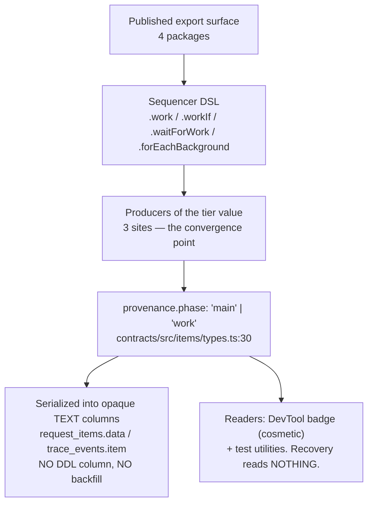

# FIX-766: Settle the canonical side-chain verb before first publish — Implementation Spec

## Part I — The Case *(for the human)*

### 1. Problem — why it matters, why now

The framework has three places work can run: **in the turn**, **alongside the turn**, and **outliving the turn**. Today the middle one has no stable name. It is called `work` in the code a developer writes (`.work()`, `.waitForWork()`), `background` in one of its own methods (`.forEachBackground()`), and **Side Chains** in the published documentation page that teaches it.

That is three names for one thing, and the word doing the most damage is `background` — because it already means two *other* things on public surfaces. It is the title of the page documenting the third tier (detached work and workstreams), and it is the deliberate umbrella term the guide uses for all three tiers at once: *"background work is the name all of them go by."* Promoting `background` to name the middle tier would collapse the umbrella into one of its own children.

**Why now.** Nothing is published. I verified this rather than assuming it: all 21 publishable `@flow-state-dev/*` packages plus `@thought-fabric/core` return HTTP 404 from the npm registry, and `@flow-state-dev/core` sits at `0.0.0`. Meanwhile the publish-preparation issue (FIX-549) is already **Done** — the ceremony is the only thing left. So the window where this costs a find-and-replace instead of a deprecation cycle is open right now and closes the day someone runs `npm publish`.

**The workaround is what we have been doing**, and it is why this issue exists: readers learn the mapping by hand, and every new contributor re-learns it.

### 2. Solution in plain terms

Name the middle tier **side chain** everywhere a developer can see it — the methods they call, the fields they read, the types they import, and the pages they learn from. The three tiers become sayable in one breath: **main → side chain → detached.**

`sideChain` is not new vocabulary being introduced; it is the word the project already teaches. The published page is titled *Side Chains*, it has a sidebar entry, and the DevTool's own trace tooltip calls these blocks a "sidechain". This change ratifies the word the docs already use and retires the two that compete with it. In return, `background` is freed to go back to meaning what the guide already says it means: the umbrella over all three tiers.

**Philosophy** — tenet 1 (coherence over local cleverness): the code is adopting the name the documentation and DevTool already settled on, rather than each surface keeping its own. Tenet 5 (fix at the owning layer): the concept is encoded in the wire contract and the item taxonomy, not just in method names, so the rename has to reach the convergence point where those values are produced or the vocabulary just splits somewhere quieter. Tenet 3 (earn every addition): this subtracts two words rather than adding a third, and it deletes rather than deprecates, because pre-publish there is nobody to deprecate for.

### 6. Decisions & rules — the sign-off surface

1. **The first npm publish waits for this rename.** *Alternative rejected:* publish now and rename after, which converts a mechanical change into a breaking-change cycle for every package that ships the old word — four of them. *Locks in:* whatever the publish date is, it moves by however long this takes; in exchange, no version of the framework ever ships the word `work` for this concept, so no user ever learns it and no migration guide is ever owed. This is the decision that makes decisions 2 and 3 affordable — if it flips, both have to be re-planned.

2. **Change the stored value with no backward-compatibility shim; add an automated guard instead.** The tier is recorded on every saved item as `phase: "work"`. Our standing practice (BP-030) is to keep reading the old shape after such a change. *Alternative rejected:* a compatibility layer that quietly translates old records. I recommend against it here, and the evidence is specific: nothing reads that stored value to make a decision — crash recovery never looks at it — so the only consequence of old records is that side-chain steps recorded **before** this change lose a coloured badge in the developer tool, on local development data that no customer has. *Locks in:* pre-existing local traces render slightly plainer; we avoid carrying translation code forever for data that will never exist in the wild. **If decision 1 flips and we publish first, this must flip too** — then the shim is mandatory.

3. **Scope is set by parsing the published surface, not by listing it.** Every prior attempt to enumerate this change was short: the issue named 4 methods, a later audit added the wire contract, and a parallel sweep then found a fourth affected package. *Alternative rejected:* proceeding from the hand-written list. I derived the surface by walking each package's actual exports, which found names nobody had listed — including a seventh public type in `core`, a `work` field on four flow-level interfaces, and the test harness's `WorkTrace`. *Locks in:* **four** publishable packages change together (`core`, `contracts`, `engine`, `testing`), and the completeness check is a script that runs in CI rather than a human reading a diff. It also locks in three deliberate **non**-renames — see §7.

### 3. Tradeoffs & alternatives

**Alternative: keep `work`, rename `forEachBackground` → `forEachWork`.** Smaller diff, and it achieves internal consistency. Rejected because it keeps a verb that does not distinguish anything — everything a pipeline does is work — and because it would leave the published *Side Chains* page and the DevTool tooltip teaching a word the API does not use. It fixes the inconsistency by picking the weaker of the two words.

**Alternative: `background` for the middle tier** (the issue's original proposal). Rejected on evidence: it is already the tier-3 page title and already the explicit umbrella term. Choosing it resolves none of the three meanings and entrenches the worst of them.

**The simpler approach: rename the four methods only, leave the internals.** Genuinely tempting — it is the 121-site change the issue originally scoped, and it fixes what developers type. Insufficient because the concept is also the value stored on every saved item and the name of types the test harness publishes. Renaming only what is typed leaves the vocabulary split between what you write and what you read back, which is the same defect one layer down.

**Where the complexity is:** not the methods. It is that this touches a *persisted* value and four packages' *published* names at once, and those two have opposite instincts — persisted data says "tolerate the old shape", pre-publish says "there is no old shape to tolerate". Decision 2 is where that tension is resolved, and it is the one to read closely.

### 4. Focus practices (1–5)

1. **BP-003 (verification evidence), applied to the scope numbers themselves.** Every count in this spec was produced by a script, and each sweep was run against a synthetic violation and against correct post-rename code to prove it can return both answers. This is the practice this issue has failed three times.
2. **Tenet 5 (one convergence point).** The stored tier value has exactly three producers. The rename lands there, not at the readers.
3. **BP-034 (finish move/rename refactors).** The rename includes file names, doc anchors, and re-exports — not just identifiers.
4. **BP-030 (tolerate the old shape)** — named here because decision 2 **departs** from it deliberately, on a stated premise. If the premise fails, the practice reapplies in full.
5. **Exclusion discipline.** Three `work`/`background` names are correct as they stand and must survive the sweep (§7). A codemod that catches them is a regression, so they get a test.

### 5. What using it looks like (1–5 examples)

**Dispatching a side chain** *(what this spec proposes; today the same call is `.work()`)*:

```ts
sequencer("respond")
  .step(respondToUser)
  .sideChain(captureMemory)        // runs alongside the chain, never blocks it
  .sideChainIf(isLongTurn, summarize)
  .waitForSideChain()              // explicit barrier, when you need one
```

**Fanning out** *(today `.forEachBackground()`)*:

```ts
sequencer("index")
  .forEachSideChain(indexDocument) // one side chain per item
```

**Reading the tier back off an item** *(today `provenance.phase === "work"`)*:

```ts
const sideChainItems = items.filter((i) => i.provenance.phase === "sideChain");
```

**In a test** *(today `WorkTrace` / `result.workResults`)*:

```ts
const result = await testSequencer(mySequencer, input);
expect(result.sideChainResults).toHaveLength(1);   // was: workResults
```

**What does not change** — the three tiers stay three; only the middle one is renamed:

```
before   main → "work" / "background" / "side chain"  (three names, one tier)
after    main → side chain → detached
         `background` = the umbrella over all three, as the guide already says
```

---

## Part II — The Build Plan *(for the implementing agent)*

### 7. Technical design

The concept is encoded on five surfaces. Every number below was produced by a script (§10 names them); none was counted by hand.



**Scope, machine-derived.** Sweep A (ts-morph AST over 2,477 tracked `.ts`/`.tsx`):

| Surface | Sites | Files |
|---|---:|---:|
| The four DSL verbs — code (104 calls + 17 declarations) | 121 | 25 |
| The four DSL verbs — comment/JSDoc prose | 146 | 46 |
| The four DSL verbs — string literals (test names + 1 DevTool tooltip) | 29 | — |
| `provenance.phase` value `"work"` | 28 | 20 |
| `StatusItem.backgroundTasks` | 25 | 10 |
| `workGroupId` | 4 | 3 |
| The six `RequestWork*` exports | 47 | 6 |
| Markdown (119 published · 51 internal · 14 package READMEs) | 204 | 44 |

**The issue's "463 call sites / 94 files" does not reconcile with any of these**, and the implementer should not try to hit it. The real call-site count is 104. A textual `\.work\(`-style search returns 280 in `.ts`/`.tsx`, but 146 of those are prose inside comments and 29 are string literals — a codemod will rewrite neither. That split is the single most useful number here: **roughly half this change is prose a codemod cannot do.**

**The published surface, derived by walking each package's exports** (not by grepping the word `work`, which drowns in `framework`/`network`/`workstream`). Four publishable packages carry it:

- **`core`** — `RequestWorkPool`, `RequestWorkPoolResult`, `RequestWorkPoolDrainOptions`, `RequestWorkPoolDrainAllOptions`, `RequestWorkTaskMeta`, `getRequestWorkPool`, **and `WorkConfig`** (a seventh, listed nowhere before). Members: `SequencerDefinition.work` / `.workIf` / `.waitForWork` / `.forEachBackground`, `BlockContext._requestWorkPool` / `._requestBackgroundSignal`, `composeBackgroundSignal`, and **`work` on four flow-level interfaces** — `FlowDefinition`, `FlowInstance`, `FlowInstanceOptions`, `FlowType`.
- **`contracts`** — `ItemProvenance.phase`, `ItemProvenance.workGroupId`, `StatusItem.backgroundTasks`.
- **`engine`** — `createRequestWorkPool`, `ExecutionMetadata.workGroupId`.
- **`testing`** — `WorkTrace`, `TestSequencerResult.workResults`. This package is `publishConfig.access: "public"`, so these become supported names the moment core publishes, and the harness would otherwise keep teaching the old noun to anyone writing tests against the new API.

**Three deliberate non-renames.** Each needs a test proving the sweep leaves it alone:

1. **`Workstream*`** (tier 3) — a different tier, and the word it should keep.
2. **`priorWork` / `TaskPriorWork` / `formatPriorWork`** in `orchestration` — "prior work" means a task's previously-completed output. Unrelated concept, same substring.
3. **`onBackgroundWork`** on `RuntimeConfig`, `CreateFlowStateOptions`, `CreateFlowApiRouterOptions` — the serverless keep-alive hook (`waitUntil`). It covers *all* work outliving the response, so under this change it is the umbrella term and is already correctly named.

**The persisted value.** `provenance` rides on `OutputItemBase`, so `phase` is on **every** persisted item, not only `block_trace` — broader than the issue assumed. It is serialized inside the opaque `data` / `item` TEXT columns of `request_items` and `trace_events`; **there is no `phase` column**, so there is no schema migration and no backfill. Producers of `"work"` number three (`sequencer.ts`, `sequencer-kernel.ts`, and a derivation in `executeBlock.ts`); readers outside tests are the DevTool badge, a phase-propagation step that only compares against `undefined`, and the in-memory scope check in `dispatch-and-execute.ts`. `request-recovery.ts` contains **zero** references to `phase`. That is what makes decision 2 safe.

*Noticed while tracing, not in scope:* `executeBlock.ts:289` derives phase from `attemptMetadata.scope === "work"`, but `scope: "work"` is set in exactly one place repo-wide and that place is a test — so that branch appears to be dead in production. Flagged in §12.

### 8. Implementation sequence

1. **Land the sweep scripts as a CI check first**, before any rename. They must fail on today's `main` (the tree is full of violations) and pass once the rename is complete. *Test:* run against the two control fixtures — one synthetic violation, one correct post-rename file with near-miss decoys — and confirm each rule returns non-zero and zero respectively. *Depends on:* nothing. **This step is what makes every later count checkable rather than asserted.**
2. **Rename the four DSL verbs and their declarations** across `core`, plus the four flow-level `work` members. *Test:* typecheck; the DSL behaviour suites pass unchanged. *Depends on:* 1.
3. **Rename the published export surface** in `core`, `engine`, and `testing` — including `WorkConfig`, `WorkTrace`, `TestSequencerResult.workResults`, and the file `request-work-pool.ts` (BP-034: rename the file and its re-export, not just the symbols). *Depends on:* 2.
4. **Change the contract values** — `phase: "main" | "sideChain"`, `workGroupId` → `sideChainGroupId`, `StatusItem.backgroundTasks` → `sideChainTasks` — at the three producers, then follow the type errors to the readers. *Test:* per decision 2, a test asserting a *legacy* record with `phase: "work"` does not crash any reader and simply renders unbadged. *Depends on:* 3.
5. **Sweep the prose** — 146 comment/JSDoc references and 204 markdown references. Not codemod-able; this is the half of the change that needs reading. *Depends on:* 4.
6. **Retitle the two docs pages** per §11. *Depends on:* 5.
7. **Remove** the now-dead `background`-as-tier-2 vocabulary: the DevTool tooltip string, and any comment that explains the `work`/`background` equivalence — those comments exist only to paper over the inconsistency this change deletes. *Depends on:* 5.

Single PR. It is large but mechanical, it must land atomically to avoid a half-renamed vocabulary, and splitting it would force a second pass over the same files.

### 9. Edge cases & error handling

| Case | Expected |
|---|---|
| A stored item written before this change (`phase: "work"`) | Reads fine; renders without the side-chain badge. Per decision 2 this is accepted, not fixed |
| `Workstream` / `workstreams` / `listWorkstreams` | Untouched — tier 3 |
| `priorWork`, `TaskPriorWork`, `formatPriorWork` | Untouched — different concept |
| `onBackgroundWork` (×3) | Untouched — the umbrella/platform hook |
| `framework`, `network`, `teamwork` in prose | Untouched — substring, not the token |
| The published slug `/docs/advanced/sequencer-side-chains` | **Unchanged.** 13 inbound references including an absolute URL in `packages/engine/README.md` |
| Casing | `sideChain` in TypeScript identifiers; `side-chain` in prose, slugs, and CSS |

**Taxonomy:** every case here is non-fatal. The only way this change breaks a running system is a missed rename that fails typecheck — loud, at build time, which is the desired failure mode.

### 10. Testing strategy

**No goal check applies** — this is a rename with no behavioural delta. The real-path evidence that matters is that the existing side-chain behaviour suites (abort signalling, pool draining, crash-recovery replay) pass **unchanged except for identifiers**. A behavioural diff in those suites means the rename changed something it shouldn't have.

**CI specs** (behaviours, not test names):

- **The completeness guard** — the sweep script from step 1, run as a test. It must be demonstrated to fire: run it against a file that reintroduces `.work(`, confirm non-zero; run it against correct code, confirm zero. A guard that cannot fail is not a guard (tenet 7).
- **The three exclusions** — one test per non-rename in §7, asserting the sweep does *not* flag `Workstream`, `priorWork`, or `onBackgroundWork`. These are the regressions an over-eager codemod causes.
- **The legacy-record path** (BP-035's second path) — an item carrying `phase: "work"` from before the change flows through every reader without throwing.
- **What must not change** — side-chain dispatch, abort isolation, and pool drain behave identically; the assertions move only in name.

**Discipline:** `tdd`, but inverted — the guard script is the failing test, written first (step 1), and the rename is what makes it pass. The seam is the AST sweep over tracked sources, which needs no runtime.

### 11. Documentation plan

- **RETITLE** `apps/docs/docs/server/background-work.md` — currently titled *"Background work"* but documents only the detached tier (`startDetached` + workstreams). It is the page holding the umbrella word hostage. Retitle to name the tier it actually covers (*"Detached work"* or similar). **Keep the slug** unless a redirect is added; it has inbound links.
- **EXTEND** `apps/docs/guides/background-work.md` — **and here I am correcting a claim in the issue.** The issue states this page's thesis (*"background work is the name all of them go by"*) stops being true. It does not: that page already lists **Side chain** as the middle tier in its own table, so vacating `background` back to the umbrella makes the thesis *more* accurate, not less. The only edits needed are the method names in the "Read next" line (`.workIf()` / `.forEachBackground()` / `.waitForWork()`) and the `.work()` example. **Do not rewrite this page's framing.**
- **EXTEND** `apps/docs/docs/advanced/sequencer-side-chains.md` — method names throughout. Title and slug already correct; this page is the destination the rest of the vocabulary is moving toward.
- **EXTEND** `packages/engine/README.md`, `packages/core/README.md`, `packages/testing/README.md` — public API names, including the `WorkTrace` → renamed type in `testing`.
- **UPDATE** `docs/architecture/items.md` — the `provenance.phase` and `StatusItem.backgroundTasks` contract documentation.
- **UPDATE** `docs/architecture/blocks.md`, `docs/architecture/sequencer-dsl.md` — DSL surface.
- **No new page.** This renames an existing concept that already has a page.
- **Changeset required** (BP-022): user-facing rename across four publishable packages. `minor` pre-1.0.
- *Voice risk:* the temptation is to explain the rename's history in user docs. The outsider rule forbids it — docs describe what the thing does, never what it used to be called. No "formerly `.work()`" notes.

### 12. Dependencies, open questions & follow-ups

**Dependency — sequencing against FIX-1001 (decided, not open).** PR #1048 specs a live correctness fix to the side-chain drain on abort/disconnect/error paths, and it edits `request-work-pool.ts` and `runAction.ts` — the two files this rename touches most heavily (34 of the 47 export sites), and one of which it *renames*. **FIX-1001 lands first, this rebases onto it.** A behaviour fix rebased onto a file rename is far more error-prone than the reverse, and FIX-1001 is fixing real data loss on serverless. The implementer should confirm FIX-1001's status before starting step 3.

**Dependency — the publish itself (FIX-549 is Done).** Per decision 1, publish is blocked on this. Someone has to actually hold it.

**Follow-up (not in scope):** `executeBlock.ts:289` derives the tier from `attemptMetadata.scope === "work"`, but the only place repo-wide that sets `scope: "work"` is a test — the production branch appears dead. Worth a separate issue to confirm and remove; folding it in here would mix a behavioural change into a rename.

**Follow-up (not in scope):** `composeBackgroundSignal` and `_requestBackgroundSignal` name the abort signal that side chains run under. They are arguably tier-2 names that should become `sideChain*`, but the signal also serves the detached tier, so the call needs a look at the signal's actual lifetime. Flagged for the implementer to raise if it becomes obvious during step 3.

**No open questions.** The three calls that shape the outcome are in §6.

### 13. Review notes for the implementer

*(Empty at publication — populated verbatim from spec-PR review feedback that is below the direction bar.)*

---

## Spec evolution

- **Spec drafted** — framed as a vocabulary collision rather than a codemod: `background` already carries three public meanings, so the fix is to vacate it to the umbrella and ratify `sideChain`, the word the docs and DevTool already teach. Scope was derived by parsing the export surface rather than listing it, which found a seventh core export, a `work` member on four flow interfaces, and a fourth affected package (`testing`) that three prior enumerations missed. The build hangs on one premise — that this lands before first publish — which is what lets the persisted-value change skip a compatibility shim.
