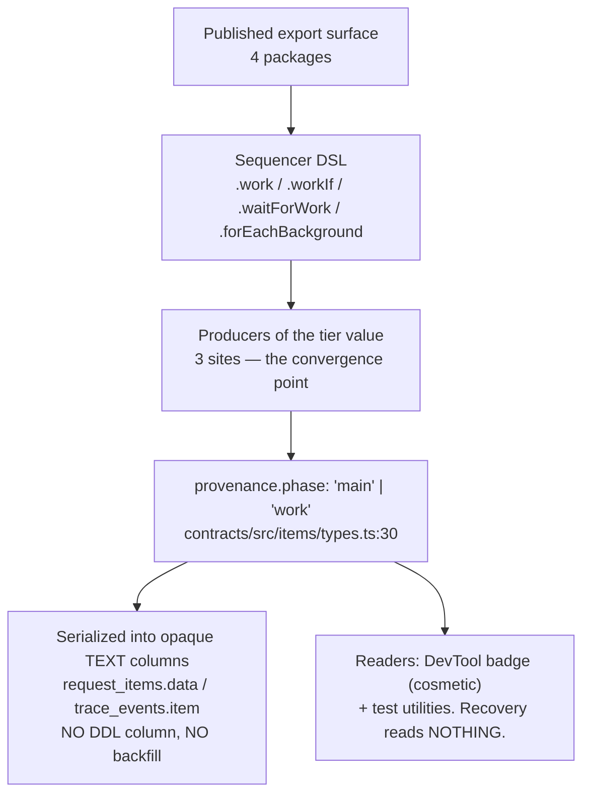

# FIX-766: Settle the canonical side-chain verb before first publish — Implementation Spec

## Part I — The Case *(for the human)*

### 1. Problem — why it matters, why now

The framework has three places work can run: **in the turn**, **alongside the turn**, and **outliving the turn**. Today the middle one has no stable name. It is called `work` in the code a developer writes (`.work()`, `.waitForWork()`), `background` in one of its own methods (`.forEachBackground()`), and **Side Chains** in the published documentation page that teaches it.

That is three names for one thing, and the word doing the most damage is `background` — because it already means two *other* things on public surfaces. It is the title of the page documenting the third tier (detached work and workstreams), and it is the deliberate umbrella term the guide uses for all three tiers at once: *"background work is the name all of them go by."* Promoting `background` to name the middle tier would collapse the umbrella into one of its own children.

**Why now.** Nothing is published. I verified this rather than assuming it: all 21 publishable `@flow-state-dev/*` packages plus `@thought-fabric/core` return HTTP 404 from the npm registry, and `@flow-state-dev/core` sits at `0.0.0`. Meanwhile the publish-preparation issue (FIX-549) is already **Done** — the ceremony is the only thing left. So the window where this costs a find-and-replace instead of a deprecation cycle is open right now and closes the day someone runs `npm publish`.

**The workaround is what we have been doing**, and it is why this issue exists: readers learn the mapping by hand, and every new contributor re-learns it.

### 2. Solution in plain terms

Name the middle tier **side chain** everywhere a developer can see it — the methods they call, the fields they read, the types they import, and the pages they learn from. The three tiers become sayable in one breath: **main → side chain → detached.**

`sideChain` is not new vocabulary being introduced; it is the word the project already teaches. The published page is titled *Side Chains*, it has a sidebar entry, and the DevTool's own trace tooltip calls these blocks a "sidechain". This change ratifies the word the docs already use and retires the two that compete with it. In return, `background` is freed to go back to meaning what the guide already says it means: the umbrella over all three tiers.

**Philosophy** — tenet 1 (coherence over local cleverness): the code is adopting the name the documentation and DevTool already settled on, rather than each surface keeping its own. Tenet 5 (fix at the owning layer): the concept is encoded in the wire contract, the item taxonomy, and the block-path grammar, not just in method names, so the rename has to reach the convergence point where those values are produced or the vocabulary just splits somewhere quieter. Tenet 3 (earn every addition): this subtracts two words rather than adding a third, and it deletes rather than deprecates, because pre-publish there is nobody to deprecate for.

### 6. Decisions & rules — the sign-off surface

1. **The first npm publish waits for this rename.** *Alternative rejected:* publish now and rename after, which converts a mechanical change into a breaking-change cycle for every package that ships the old word — five of them.

   **The concrete reason, which is stronger than "renames are cheaper pre-publish":** the tier's name is part of a block's structural path, and that path is part of the **checkpoint key**. Rename it after publish and every user's in-flight, resumable request stops resuming — its checkpoints are filed under the old spelling and the new code looks for the new one. Avoiding that costs a shim that must dual-read **block paths**, which are compared and never decoded, so the alias lands in every prefix and equality comparison in the path grammar. That is a materially harder shim than the enum one, and holding the publish is what makes it unnecessary.

   *Locks in:* whatever the publish date is, it moves by however long this takes; in exchange no version ever ships the word `work` for this concept, no user learns it, no migration guide is owed, and no user's resume breaks. This is the decision that makes decisions 2 and 3 affordable — if it flips, both have to be re-planned.

2. **Change the stored data with no backward-compatibility shim — justified by decision 1, not by "nothing reads it."** Re-derived in review, because the original reasoning covered only half the surface. There are **two** persisted surfaces and they need **two** arguments:

   - **A persisted *value* — `provenance.phase`.** Nothing reads it to make a decision; crash recovery never looks at it (verified, §7). Old records cost a coloured badge in the developer tool. Genuinely harmless.
   - **A persisted *identifier* — the block path.** The op name becomes a path segment, the path is part of `blockInstanceId`, and `blockInstanceId` is the **checkpoint key**. Here the original argument is simply **false**: this value *is* read, to locate a request's checkpoints. A request checkpointed as `…/work[3]/…` cannot be resumed by code looking for `…/sideChain[3]/…`.

   *Alternative rejected:* a compatibility layer. Dual-reading a `phase` enum is easy; dual-reading **block paths** is not — paths are structural and compared, never decoded, so tolerating both spellings puts an alias in every prefix and equality comparison. I still recommend no shim, but on a different basis: **pre-publish, the only data affected is checkpoints for requests in flight across a deploy, and those exist today only in local dev stores.** *Locks in:* anyone holding a resumable in-flight request across this deploy loses its resume; in exchange we never alias a structural identifier. **This rests entirely on decision 1. If we publish first it must flip** — and the shim it then needs is the hard kind, not the easy kind.

3. **Scope is set by a guard that covers all four ways the concept is encoded, not by a list and not by one parse.** Enumerating this change has now been corrected **seven times**, and — the part worth noticing — **most of those corrections came after I replaced listing with parsing.** Parsing was the right move and still under-counted, because the rules only saw some of the encodings. *Alternative rejected:* the hand-written list, and then the identifier-only parse that replaced it. *Locks in:* **five** publishable packages change together (`core`, `contracts`, `engine`, `testing`, `devtool`), and completeness is enforced by one CI guard recognising **all four** encodings — identifiers (`WorkConfig`), string-literal union members (`FlowErrorScope`'s `"work"`), the word `background` used for tier 2 (`composeBackgroundSignal`), and runtime path literals (`childBlockPath(…, "work", i)`, the only one that changes a persisted key). It also locks in the deliberate **non**-renames of §7.

### 3. Tradeoffs & alternatives

**Alternative: keep `work`, rename `forEachBackground` → `forEachWork`.** Smaller diff, and it achieves internal consistency. Rejected because it keeps a verb that does not distinguish anything — everything a pipeline does is work — and because it would leave the published *Side Chains* page and the DevTool tooltip teaching a word the API does not use. It fixes the inconsistency by picking the weaker of the two words.

**Alternative: `background` for the middle tier** (the issue's original proposal). Rejected on evidence: it is already the tier-3 page title and already the explicit umbrella term. Choosing it resolves none of the three meanings and entrenches the worst of them.

**The simpler approach: rename the four methods only, leave the internals.** Genuinely tempting — it is the 121-site change the issue originally scoped, and it fixes what developers type. Insufficient because the concept is also the value stored on every saved item and the name of types the test harness publishes. Renaming only what is typed leaves the vocabulary split between what you write and what you read back, which is the same defect one layer down.

**Where the complexity is:** not the methods. It is that this touches a *persisted* value and five packages' *published* names at once, and those two have opposite instincts — persisted data says "tolerate the old shape", pre-publish says "there is no old shape to tolerate". Decision 2 is where that tension is resolved, and it is the one to read closely.

### 4. Focus practices (1–5)

1. **BP-003 (verification evidence), applied to the scope numbers themselves.** Every count in this spec was produced by a script, and each sweep was run against a synthetic violation and against correct post-rename code to prove it can return both answers. This is the practice this issue has failed seven times — most of them *after* parsing replaced listing, which is why the guard now covers all four encodings rather than one, and why §7 says which rules are precise and which are triage.
2. **Tenet 5 (one convergence point).** The stored tier value has exactly three producers. The rename lands there, not at the readers.
3. **BP-034 (finish move/rename refactors).** The rename includes file names, doc anchors, and re-exports — not just identifiers.
4. **BP-030 (tolerate the old shape)** — named here because decision 2 **departs** from it deliberately, on a stated premise. If the premise fails, the practice reapplies in full.
5. **Exclusion discipline.** Several `work`/`background` names are correct as they stand and must survive the sweep — `Workstream*`, `priorWork`/`TaskPriorWork`/`formatPriorWork`, and `onBackgroundWork` (§7). A codemod that catches one is a regression worse than a miss, so the control fails if any is flagged.

### 5. What using it looks like (1–5 examples)

**Dispatching a side chain** *(what this spec proposes; today the same call is `.work()`)*:

```ts
sequencer("respond")
  .step(respondToUser)
  .sideChain(captureMemory)        // runs alongside the chain, never blocks it
  .sideChainIf(isLongTurn, summarize)
  .waitForSideChain()              // explicit barrier, when you need one
```

**Fanning out** *(today `.forEachBackground()`)*:

```ts
sequencer("index")
  .forEachSideChain(indexDocument) // one side chain per item
```

**Reading the tier back off an item** *(today `provenance.phase === "work"`)*:

```ts
const sideChainItems = items.filter((i) => i.provenance.phase === "sideChain");
```

**In a test** *(today `WorkTrace` / `result.workResults`)*:

```ts
const result = await testSequencer(mySequencer, input);
expect(result.sideChainResults).toHaveLength(1);   // was: workResults
```

**What does not change** — the three tiers stay three; only the middle one is renamed:

```
before   main → "work" / "background" / "side chain"  (three names, one tier)
after    main → side chain → detached
         `background` = the umbrella over all three, as the guide already says
```

---

## Part II — The Build Plan *(for the implementing agent)*

### 7. Technical design

The concept is encoded on five surfaces. Every number below was produced by a script (§10 names them); none was counted by hand.



**The concept is encoded four ways, and a guard keyed to one of them reports done while a whole category is out of its view.** This is the spec's own lesson, learned three times during its review:

| # | Encoding | Example | Why the previous rule missed it |
|---|---|---|---|
| E1 | **Identifiers** carrying `work` | `WorkConfig`, `WorkTrace` | An earlier rule hard-coded six `RequestWork*` names |
| E2 | **String-literal union members** | `FlowErrorScope = … \| "work" \| …` | The rule only accepted `"work"` when bound to `phase` |
| E3 | **`background` naming tier 2** | `composeBackgroundSignal` | A `work`-token rule cannot match it by construction |
| E4 | **Runtime path/name literals** | `childBlockPath(…, "work", i)` | Not an identifier, not a union member, not a `background` name — and the only one that changes a **persisted key** |

**Scope, machine-derived.** One script, `sweep.mjs`, covers all four encodings; every row below comes from it (`--files` mode drives the controls, plain mode the repo):

| Rule | Surface | Sites | Files |
|---|---|---:|---:|
| R1 | The four DSL verbs — code (105 calls + 17 declarations) | 122 | 25 |
| R1 | The four DSL verbs — comment/JSDoc prose *(via `classify.mjs`)* | 146 | 46 |
| R1 | The four DSL verbs — string literals (test names + 1 DevTool tooltip) | 29 | — |
| R2 | `provenance.phase` value `"work"` | 28 | 20 |
| R4 | `workGroupId` | 4 | 3 |
| R5 | `StatusItem.backgroundTasks` | 25 | 10 |
| R6 | Markdown (119 published · 51 internal · 8 READMEs) | 204 | 44 |
| R7 | `"work"` union members **not** bound to `phase` — i.e. `FlowErrorScope` | 1 | 1 |
| R9 | Runtime path/name literals (6 in `sequencer.ts` src, rest in tests) | 23 | 10 |
| R3 | Identifiers carrying the `work` token — **triage queue, not a rename count** | 422 | 57 |
| R8 | Identifiers carrying the `background` token — **triage queue** | 223 | 54 |

**Encoding 4 is the one that touches a persisted key, and it is why decision 2 was re-derived.** `childBlockPath(ctx, runtime, "work", stepIndex)` feeds `blockPathSegment(op, i)` → `work[3]`; `blockInstanceId` is `${requestId}:${path}:${attempt}`; and `runAction.ts` keys checkpoints on `blockInstanceId` (`checkpointKey = (id) => \`${requestId}:${id}\``, `stores.checkpoints.delete(requestId, blockInstanceId)`). So renaming these literals **changes the checkpoint key**. Six sites live in `sequencer.ts` src — `:1576`, `:1612`, `:1799`, `:1804`, `:1830`, `:1842`.

**A note on this document's own reliability, stated once.** The scope above has now been corrected **seven times**, and the last two corrections are the instructive ones: the guard was green because a whole encoding sat outside its rules, and the counter under-counted because its dedup key (`file+line`) could not represent two calls on one line — `pipeline.work(a).work(b)` scored 1. *A counter whose key cannot distinguish the things it counts is the same defect as a guard that cannot see an encoding*, and both defects were in the tool built specifically to end the under-counting. The lesson for the implementer is not "these numbers are wrong" — they are now controlled in both directions — but that **completeness here is a property of the rule set, not of effort**, and the guard is the artifact that has to carry it.

**R3 and R8 are deliberately broad and carry false positives** (`workQueue`, `doWork`, `backgroundColor`). They exist to surface *candidates a human classifies*, so their numbers are a review queue, not a count of sites to change. Every other row is precise. Saying which is which is the point — a broad rule presented as a precise count is the same defect as a narrow rule presented as complete.

**The issue's "463 call sites / 94 files" does not reconcile with any of these**, and the implementer should not try to hit it. The real call-site count is 105. A textual `\.work\(`-style search returns 280 in `.ts`/`.tsx`, but 146 of those are prose inside comments and 29 are string literals — a codemod will rewrite neither. That split is the single most useful number here: **roughly half this change is prose a codemod cannot do.**

**The published surface — five publishable packages**, derived by walking each package's exports (not by grepping the word `work`, which drowns in `framework`/`network`/`workstream`):

- **`core`** — `RequestWorkPool`, `RequestWorkPoolResult`, `RequestWorkPoolDrainOptions`, `RequestWorkPoolDrainAllOptions`, `RequestWorkTaskMeta`, `getRequestWorkPool`. Members: `SequencerDefinition.work` / `.workIf` / `.waitForWork` / `.forEachBackground`, `BlockContext._requestWorkPool`. Plus the two surfaces review added: **`FlowErrorScope`** (`"request" | "work" | "resource" | "block"`, `errors/flow-error.ts:16`) and **`composeBackgroundSignal`** / `BlockContext._requestBackgroundSignal`.
- **`contracts`** — `ItemProvenance.phase`, `ItemProvenance.workGroupId`, `StatusItem.backgroundTasks`.
- **`engine`** — `createRequestWorkPool`, `ExecutionMetadata.workGroupId` (carries `FlowErrorScope`; `executeBlock` converts `scope === "work"` straight into `provenance.phase`).
- **`testing`** — `WorkTrace`, `TestSequencerResult.workResults`. `publishConfig.access: "public"`, so these become supported names the moment core publishes, and the harness would otherwise keep teaching the old noun to anyone writing tests against the new API.
- **`devtool`** — public (`0.0.0`, `access: "public"`). `trace-view.tsx` renders a background badge for `phase === "work"` with a `.work()` / `.workIf()` / `.forEachBackground()` tooltip. User-visible vocabulary, so it needs its own changeset entry.

**`composeBackgroundSignal` is renamed, not deferred.** I had left this open on the belief that the signal also serves the detached tier. Review checked the implementation and refuted that: it and `_requestBackgroundSignal` specifically substitute the signal used by `.work()` / `.workIf()` / `.forEachBackground()`, and orchestration composes it so nested side chains inherit a detached worker's lease — not to run the detached tier. It is a top-level `core` export, so leaving it would preserve a public **`background`** name for exactly the middle-tier concept this change exists to rename, and the `work`-token rule would never flag it. That is encoding E3, and it is why R8 exists.

**The flow-level `work` hooks are DELETED, not renamed.** `WorkConfig` and the `work` member on `FlowDefinition` / `FlowInstance` / `FlowInstanceOptions` / `FlowType` describe four lifecycle hooks (`onStarted` / `onCompleted` / `onErrored` / `onFinished`) that **nothing ever invokes.**

*How I checked, since this reverses my own earlier plan to rename them:* `runAction.ts` contains no read of `flow.work` (its only `.work` matches are comments about the DSL method). Every `WorkConfig` reference is a type position except one, `defineFlow.ts:993`, which merges the config; the merged value flows only into the returned flow object and into a walk at `defineFlow.ts:422-431` that pushes the hooks into a `blocks` array used for **declaration discovery** — so a consumer's hook gets its declared resources registered and is then never called.

Renaming them would ratify a dead contract under the canonical name, immediately before publish — worse than leaving it under the retired one, because the canonical name is what everything downstream will teach. This follows FIX-1048, which deleted four non-functioning `FlowInstanceOptions` fields on the same grounds: nothing can depend on them, removal changes no observable behaviour, and the capability arrives as a specced feature with a requirement behind it if it is wanted. If per-side-chain lifecycle hooks are wanted, they arrive that way — not as four names inherited by a rename.

**Three deliberate non-renames.** Each needs a test proving the sweep leaves it alone:

1. **`Workstream*`** (tier 3) — a different tier, and the word it should keep.
2. **`priorWork` / `TaskPriorWork` / `formatPriorWork`** in `orchestration` — "prior work" means a task's previously-completed output. Unrelated concept, same substring.
3. **`onBackgroundWork`** on `RuntimeConfig`, `CreateFlowStateOptions`, `CreateFlowApiRouterOptions` — the serverless keep-alive hook (`waitUntil`). It covers *all* work outliving the response, so under this change it is the umbrella term and is already correctly named.

**The persisted value.** `provenance` rides on `OutputItemBase`, so `phase` is on **every** persisted item, not only `block_trace` — broader than the issue assumed. It is serialized inside the opaque `data` / `item` TEXT columns of `request_items` and `trace_events`; **there is no `phase` column**, so there is no schema migration and no backfill.

**Decision 2's premise, stated as a checked claim rather than an assertion.** *Claim:* no correctness path reads the persisted `provenance.phase`. *Method:* enumerate every read of `provenance.phase` under `packages/*/src` and classify each. *Result:* every one is either an identity-propagating **write**, or the DevTool trace tree reading it for **display** (`trace-tree.ts:162,169,172`); `request-recovery.ts` contains **zero** references to `phase`; the in-memory scope check in `dispatch-and-execute.ts` reads the live execution scope, not storage. *Control that the check could have failed:* the `payload.phase === "added"` / `=== "output"` hits in `createExecutionContext.ts` are a **different** field with different values, and are excluded — the same decoy carried in `control-clean.ts`. Producers of `"work"` number three (`sequencer.ts`, `sequencer-kernel.ts`, and a derivation in `executeBlock.ts`). That is what makes decision 2 safe.

*Noticed while tracing, not in scope:* `executeBlock.ts:289` derives phase from `attemptMetadata.scope === "work"`, but `scope: "work"` is set in exactly one place repo-wide and that place is a test — so that branch appears to be dead in production. Flagged in §12.

### 8. Implementation sequence

1. **Graduate the guard into `scripts/validate-side-chain-vocabulary.mjs` and land it first**, before any rename. Follow the shape the repo already has in `scripts/validate-updater-purity.mjs` and `scripts/validate-model-strings.mjs`: `process.cwd()` rather than an absolute root, an ordinary `ts-morph` import rather than the POC's `createRequire` into the pnpm store, and an exported `analyzeSources(sources)` so fixtures can drive it — with vitest fixtures in `packages/core/test/` alongside `updater-purity-check.test.ts` and `model-strings-check.test.ts`. It must recognise **all four encodings** (E1/E2/E3/E4), fail on today's `main`, and pass once the rename is complete. Follow that precedent's other convention too: **document the rule's known gaps in the file header**, as `validate-updater-purity.mjs` does — a guard that quietly under-matches is what produced most of this spec's seven scope corrections. **`classify.mjs` does not graduate** — it is evidence for the "half of this is prose" insight, not a gate. *Depends on:* nothing.
2. **Rename the four DSL verbs and their declarations** across `core`. **Use the existing codemod precedent** `scripts/codemod/rename-sequencer-then-to-step.ts` — same shape (type-filtered receiver, run before the interface rename), so the 121 DSL sites are not hand-edited. *Test:* typecheck; the DSL behaviour suites pass unchanged. *Depends on:* 1.
3. **Rename the published export surface** in `core`, `engine`, `testing`, and `devtool` — `WorkTrace`, `TestSequencerResult.workResults`, `createRequestWorkPool`, `FlowErrorScope`'s `"work"` member, `composeBackgroundSignal`, `_requestBackgroundSignal`, and the file `request-work-pool.ts` (BP-034: rename the file and its re-export, not just the symbols). *Depends on:* 2.
4. **Change the contract values** — `phase: "main" | "sideChain"`, `workGroupId` → `sideChainGroupId`, `StatusItem.backgroundTasks` → `sideChainTasks` — at the three producers, then follow the type errors to the readers. *Test:* per decision 2, a test asserting a *legacy* record with `phase: "work"` does not crash any reader and simply renders unbadged. *Depends on:* 3.
4a. **Rename the runtime path/name literals** in `sequencer.ts` (`:1576`, `:1612`, `:1799`, `:1804`, `:1830`, `:1842`) and the test fixtures that assert on them. *Test:* a spec pinning the emitted `blockInstanceId` for a side-chain step, so the path grammar change is visible rather than incidental. **Call out in the changeset that this changes checkpoint keys** — it is the one part of this rename with a runtime consequence beyond naming. *Depends on:* 2.
4b. **Delete the dead flow-level `work` surface** — `WorkConfig` and the `work` member on `FlowDefinition` / `FlowInstance` / `FlowInstanceOptions` / `FlowType`, plus the hook walk at `defineFlow.ts:422-431` and the merge at `:993`. Per §7 these are never invoked; per FIX-1048's precedent they are removed, not renamed and not implemented. *Test:* typecheck, and confirm no behavioural suite changes — removal must be observably inert. *Depends on:* 3.
5. **Sweep the prose** — 146 comment/JSDoc references and 204 markdown references. Not codemod-able; this is the half of the change that needs reading. *Depends on:* 4.
6. **Retitle the two docs pages** per §11. *Depends on:* 5.
7. **Remove** the now-dead `background`-as-tier-2 vocabulary: the DevTool tooltip string, and any comment that explains the `work`/`background` equivalence — those comments exist only to paper over the inconsistency this change deletes. *Depends on:* 5.

Single PR. It is large but mechanical, it must land atomically to avoid a half-renamed vocabulary, and splitting it would force a second pass over the same files.

### 9. Edge cases & error handling

| Case | Expected |
|---|---|
| A stored item written before this change (`phase: "work"`) | Reads fine; renders without the side-chain badge. Per decision 2 this is accepted, not fixed |
| A request checkpointed before the deploy, resumed after it | Its side-chain checkpoints are keyed under the old path segment and are not found. Accepted per decision 2 — bounded to in-flight requests in local dev stores, and only because we are pre-publish |
| `Workstream` / `workstreams` / `listWorkstreams` | Untouched — tier 3 |
| `priorWork`, `TaskPriorWork`, `formatPriorWork` | Untouched — different concept |
| `onBackgroundWork` (×3) | Untouched — the umbrella/platform hook |
| `framework`, `network`, `teamwork` in prose | Untouched — substring, not the token |
| The published slug `/docs/advanced/sequencer-side-chains` | **Unchanged.** 13 inbound references including an absolute URL in `packages/engine/README.md` |
| Casing | `sideChain` in TypeScript identifiers; `side-chain` in prose, slugs, and CSS |

**Taxonomy:** every case here is non-fatal. The only way this change breaks a running system is a missed rename that fails typecheck — loud, at build time, which is the desired failure mode.

### 10. Testing strategy

**No goal check applies** — this is a rename with no behavioural delta. The real-path evidence that matters is that the existing side-chain behaviour suites (abort signalling, pool draining, crash-recovery replay) pass **unchanged except for identifiers**. A behavioural diff in those suites means the rename changed something it shouldn't have.

**CI specs** (behaviours, not test names):

- **The completeness guard** — the graduated script from step 1, run as a test, with **one fixture per encoding**: an identifier (`WorkConfig`), a `"work"` union member not bound to `phase` (`FlowErrorScope`), a tier-2 `background` name (`composeBackgroundSignal`), and a runtime path literal (`childBlockPath(…, "work", i)`). Each must be shown to fire; a guard that cannot fail is not a guard (tenet 7). Most of this spec's seven scope corrections were a guard reporting green because a whole encoding sat outside its rules, so per-encoding coverage is the specific thing being tested.
- **The checkpoint-key behaviour**, since E4 is the one encoding with a runtime consequence: a spec pinning the `blockInstanceId` emitted for a side-chain step, so the path-grammar change is asserted rather than incidental.
- **The exclusions — the control's job is to FAIL if any of these is caught.** `Workstream` / `workstreams` / `listWorkstreams`, `priorWork` / `TaskPriorWork` / `formatPriorWork`, and `onBackgroundWork` (×3) must all report zero. These are the regressions an over-eager codemod actually causes, and catching one is worse than missing a rename: it tells the implementer to break a correct name.
- **State which rules are precise and which are triage.** R3 and R8 carry deliberate false positives (`workQueue`, `doWork`, `backgroundColor`). The test should assert their role, not a number — a broad rule asserted as an exact count is how a review queue gets mistaken for a finished sweep.
- **The legacy-record path** (BP-035's second path) — an item carrying `phase: "work"` from before the change flows through every reader without throwing.
- **What must not change** — side-chain dispatch, abort isolation, and pool drain behave identically; the assertions move only in name.

**Discipline:** `tdd`, but inverted — the guard script is the failing test, written first (step 1), and the rename is what makes it pass. The seam is the AST sweep over tracked sources, which needs no runtime.

### 11. Documentation plan

- **RETITLE** `apps/docs/docs/server/background-work.md` — currently titled *"Background work"* but documents only the detached tier (`startDetached` + workstreams). It is the page holding the umbrella word hostage. Retitle to name the tier it actually covers (*"Detached work"* or similar). **Keep the slug** unless a redirect is added; it has inbound links.
- **EXTEND** `apps/docs/guides/background-work.md` — **and here I am correcting a claim in the issue.** The issue states this page's thesis (*"background work is the name all of them go by"*) stops being true. It does not: that page already lists **Side chain** as the middle tier in its own table, so vacating `background` back to the umbrella makes the thesis *more* accurate, not less. The only edits needed are the method names in the "Read next" line (`.workIf()` / `.forEachBackground()` / `.waitForWork()`) and the `.work()` example. **Do not rewrite this page's framing.**
- **EXTEND** `apps/docs/docs/advanced/sequencer-side-chains.md` — method names throughout. Title and slug already correct; this page is the destination the rest of the vocabulary is moving toward.
- **EXTEND** `packages/engine/README.md`, `packages/core/README.md`, `packages/testing/README.md` — public API names, including the `WorkTrace` → renamed type in `testing`.
- **UPDATE** `docs/architecture/items.md` — the `provenance.phase` and `StatusItem.backgroundTasks` contract documentation.
- **UPDATE** `docs/architecture/blocks.md`, `docs/architecture/sequencer-dsl.md` — DSL surface.
- **No new page.** This renames an existing concept that already has a page.
- **Changeset required** (BP-022): user-facing rename across **five** publishable packages — `core`, `contracts`, `engine`, `testing`, `devtool`. `devtool` earns its own entry because its trace badge and tooltip are user-visible vocabulary. `minor` pre-1.0.
- *Voice risk:* the temptation is to explain the rename's history in user docs. The outsider rule forbids it — docs describe what the thing does, never what it used to be called. No "formerly `.work()`" notes.

### 12. Dependencies, open questions & follow-ups

**Dependency — sequencing against FIX-1001 (decided, not open).** PR #1048 specs a live correctness fix to the side-chain drain on abort/disconnect/error paths, and it edits `request-work-pool.ts` and `runAction.ts` — the two files this rename touches most heavily (34 of the 47 export sites), and one of which it *renames*. **FIX-1001 lands first, this rebases onto it.** A behaviour fix rebased onto a file rename is far more error-prone than the reverse, and FIX-1001 is fixing real data loss on serverless. The implementer should confirm FIX-1001's status before starting step 3.

**Dependency — the publish itself (FIX-549 is Done).** Per decision 1, publish is blocked on this. Someone has to actually hold it.

**Follow-up (not in scope):** `executeBlock.ts:289` derives the tier from `attemptMetadata.scope === "work"`, but the only place repo-wide that sets `scope: "work"` is a test — the production branch appears dead. Worth a separate issue to confirm and remove; folding it in here would mix a behavioural change into a rename.

**Resolved during spec review — do not reopen.** `composeBackgroundSignal` / `_requestBackgroundSignal` were briefly a follow-up on my belief that the signal also serves the detached tier. That premise was checked against the implementation and refuted: both specifically substitute the signal used by the three tier-2 dispatch methods. They are **in scope** and renamed in step 3. Recorded here with the same "settled, don't reopen" force a POC verdict would carry.

**Resolved during spec review — do not reopen.** The flow-level `work` hooks were to be renamed; they are provably never invoked (§7 names the method) and are **deleted** instead, per FIX-1048.

**No open questions.** The three calls that shape the outcome are in §6.

### 13. Review notes for the implementer

Recorded verbatim from spec-PR review; below the direction bar, for you to weigh against real code.

- The POC sweep scripts hardcode an absolute repo root and `createRequire` into the pnpm store. Fine for throwaway derivation, not viable in CI — step 1 names the graduation target.
- `R3`/`R8` false-positive classes seen so far: `workQueue`, `doWork`, `backgroundColor`. Consider whether the graduated guard should carry a small ignore-list or simply report them as triage.
- `executeBlock.ts:289`'s `attemptMetadata.scope === "work"` branch appears dead in production (only a test sets `scope: "work"`). See §12 — separate issue, don't fold it in.

---

## Spec evolution

- **After spec review (round 2)** — a **fourth** encoding: runtime string literals that become block-path segments, and therefore checkpoint keys. Decision 2 was re-derived rather than flipped — its "nothing reads the stored value" argument is true of `provenance.phase` and false of block paths, so the no-shim call now rests on the pre-publish premise instead. Decision 1 gained the concrete mechanical reason to hold the publish: post-publish this breaks in-flight resume for real users. The sweep's dedup key moved from `file+line` to node position after it was shown to drop a second call on the same line.
- **After spec review (round 1)** — three surfaces added and one reversed. `FlowErrorScope` and `composeBackgroundSignal` were missed because the guard recognised only one of three encodings of the concept; `devtool` was missed as a fifth publishable package. The flow-level `work` hooks flipped from *rename* to *delete* once they were shown never to be invoked. The two sweep scripts were unified into one guard, because two tools that must stay in sync is the same defect the spec was written to prevent.
- **Spec drafted** — framed as a vocabulary collision rather than a codemod: `background` already carries three public meanings, so the fix is to vacate it to the umbrella and ratify `sideChain`, the word the docs and DevTool already teach. Scope was derived by parsing the export surface rather than listing it, which found a seventh core export, a `work` member on four flow interfaces, and a fourth affected package (`testing`) that three prior enumerations missed. The build hangs on one premise — that this lands before first publish — which is what lets the persisted-value change skip a compatibility shim.
