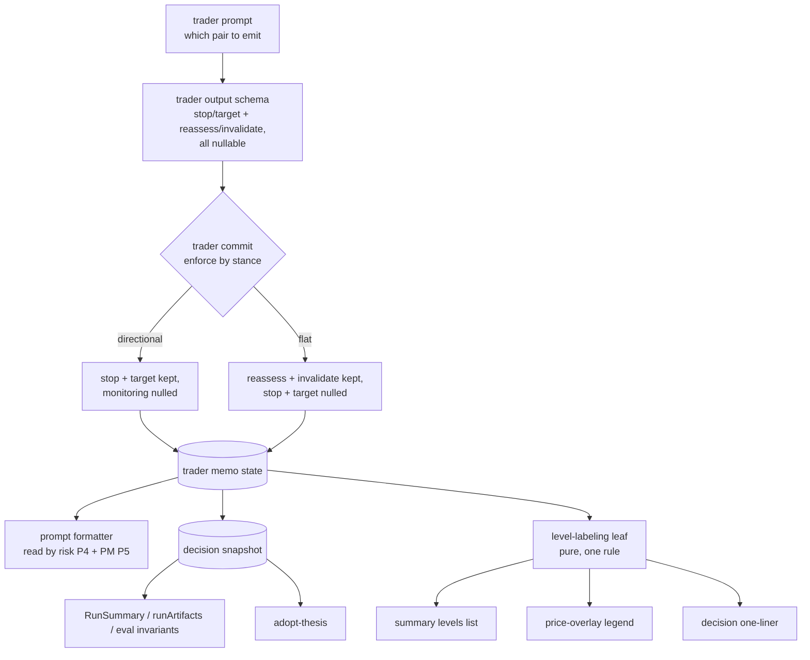

# FIX-780: Trading-desk: flat-stance runs overload stopPrice/targetPrice with a monitoring range — Implementation Spec

**Linear:** [FIX-780](https://linear.app/fixpoint-labs/issue/FIX-780/trading-desk-flat-stance-runs-overload-stoppricetargetprice-with-a) · **Epic:** [FIX-1067](https://github.com/fixpoint-labs/flow-state-dev/pull/1160) · **Branch:** `spec/FIX-780`

## Part I — The Case *(for the human)*

### 1. Problem — why it matters, why now

When the desk decides **not** to take a position, the trader still writes down two price
levels — the level that would make it worth looking at the stock again, and the level that
would prove the decision to stand aside was wrong. The report has nowhere to put those two
numbers except the fields meant for a real trade's stop-loss and profit target. So a report
that says "Hold, no position" also says **stop $320 / target $195**.

To anyone reading it, that is a short trade with the stop above the target — a setup no
desk would ever put on. The written memo says the right thing ("downside entry target of
$195, upside breakout stop of $320"); the numbers beside it say something incoherent, and
the price chart draws them as trade lines.

**Why now.** This is not an edge case: **10 of the 13 completed runs are flat**, so the
mislabeled version is the *common* report, not the rare one. It also runs deeper than the
screen — the same mislabeled pair is what the risk officers and the portfolio manager are
shown when they review the trader's proposal, so the desk's own later stages reason about a
"stop" on a position that does not exist. There is no workaround: the numbers are stored
this way, so every surface that reads them inherits the error.

### 2. Solution in plain terms

Give the two kinds of level their own names. A directional call records a **stop** and a
**target**, exactly as today. A flat call records **reassess below** and **invalidate
above** — and records no stop and no target, because there is no position to stop out of.
The report, the chart, and the prompts the desk's own later stages read all say whichever
of the two the run actually produced.

Reports written before this change keep their two numbers, shown without labels and marked
as predating the fix. Nothing in an old record says which number was which, so we show what
was stored and stop there.

**Philosophy** — tenet 1 (coherence): the memo and the numbers beside it currently
contradict each other, and an incoherent record produces incoherent downstream reasoning.
Tenet 5 (one convergence point): every surface that shows a level reads one labeling rule,
so a fourth surface cannot reintroduce the third spelling. Tenet 3 (earn every addition):
the prompt clause that *forced* a flat run to invent a stop is deleted, not worked around.

### 6. Decisions & rules — the sign-off surface

1. **Name the two kinds of level; don't flag one field as meaning two things.** A flat
   run's levels are stored under their own names, and its stop/target are stored as absent.
   *Rejected:* keeping the stop/target fields and adding a "these are really watch levels"
   marker — that keeps trade words on non-trade numbers and still leaves a reader to work
   out which of the two is the upper one, which is exactly the ambiguity that produced this
   bug. *Locks in:* the shape of the stored decision record for a flat run. Outcome
   tracking (FIX-763) will score a flat call against these names, so renaming them after
   that ships means reworking every stored report.

2. **Every surface says the same thing about the same number.** One rule decides what a
   level is called, and the summary list, the chart legend, the decision one-liner, and the
   prompts the risk officers and PM read all follow it. *Rejected:* relabeling in each
   place, which is how it works today. *Locks in:* a reader can never see one number called
   a stop in one panel and a watch level in another — and the guarantee holds for surfaces
   nobody has built yet, which matters because FIX-1061 is about to build one.

3. **Reports written before this change are relabeled, never re-interpreted.** An old flat
   report shows its two numbers unlabeled, marked as predating the fix. *Rejected:*
   inferring which number was the upside one from their order — that is a guess presented
   as a record, the same dishonesty one layer down; and leaving them as stop/target, which
   keeps the nonsense visible on nearly every report we have. *Locks in:* old reports say
   less than they used to, and say it truthfully. This is the one row that is a live fork —
   asked in full below.

4. **A run that fills in the wrong pair loses those numbers rather than showing them
   mislabeled.** The trader is told which pair to produce, and the desk drops whatever does
   not match the stance instead of trusting it. *Rejected:* asking nicely in the prompt and
   displaying whatever comes back. *Locks in:* a flat run can never again store a stop; the
   price is that an occasional non-compliant run shows no levels at all. Showing nothing is
   honest; showing a stop on a position we did not take is not.

**Size:** Small–Medium. One PR.

### 3. Tradeoffs & alternatives

**Alternative: teach the reader instead of the record.** Leave the fields alone and add a
sentence to the flat report explaining that stop/target should be read as a watch range.
Rejected — it fixes only the one screen that carries the sentence. The same two numbers are
already flowing into the risk and PM prompts, into the durable decision record, and into
the per-position thesis a user can adopt from a report; a caption on the summary page
reaches none of them.

**The simpler approach: show nothing at all on a flat run.** Genuinely tempting — it is
smaller than this spec and it cannot be wrong. Insufficient because the levels are the most
useful thing a flat report carries: they are what tells the reader when to look again.
Deleting them to avoid mislabeling them trades one honesty problem for an emptier report.

**Where the complexity is:** not the new fields. It is the **old records** — most of the
existing corpus is flat, none of it distinguishes the two numbers, and any rule that
reconstructs the distinction is a guess. §9 is mostly about that boundary, and decision 3
is the call it rests on.

### 4. Focus practices (1–5)

1. **One convergence point for level labeling** (tenet 5) — three call sites hard-code
   "stop" and "target" today, and FIX-1061 is about to add a fourth. If the labeling rule
   is not a single thing both the existing and the new renderer read, this bug comes back
   on the surface nobody updated.
2. **BP-030 (tolerate the old shape)** — the stored corpus is dominated by the pre-fix
   flat shape. A new nullable field must not crash a legacy read, and a legacy `stopPrice`
   must not be silently re-read as a watch level.
3. **BP-035 (second-path checklist)** — the flat path *is* the second path, and it is the
   majority path in production. A spec that only exercises a directional run proves nothing
   here.
4. **Derive at commit, never trust the model** — the codebase precedent (`agreesWithTrader`,
   the mandate/policy/evidence gates) is that anything the desk can determine deterministically
   is determined at commit. Which pair of levels a stance may carry is exactly that.

### 5. What using it looks like

This is an app-internal record shape, not a framework surface — no public API changes. What
changes is what a reader sees, so the examples are the rendered output.

**A flat run, before / after:**

```
before   FLAT · 0% NAV · stop 320 · target 195 · months
after    FLAT · 0% NAV · reassess below 195 · invalidate above 320 · months
```

**A directional run — unchanged:**

```
before   LONG · 1.4% NAV · stop 132 · target 185 · months
after    LONG · 1.4% NAV · stop 132 · target 185 · months
```

**An existing flat report, re-opened after the fix:**

```
after    FLAT · 0% NAV · levels recorded: 195, 320
         (this report predates the flat-stance labeling fix)
```

**What the risk officers and the PM are shown for a flat proposal, before / after:**

```
before   Direction: flat / Size (% NAV): 0 / Stop: $320 / Target: $195
after    Direction: flat / Size (% NAV): 0 / Reassess below: $195 / Invalidate above: $320
```

---

## Part II — The Build Plan *(for the implementing agent)*

### 7. Technical design

The two numbers travel one lane, from the trader's structured output to four readers. The
fix widens the lane by two named fields, closes it to the wrong pair at the commit gate,
and gives the display end a single labeling rule.



**The record.** Two fields join the trader's proposal, the memo state, and the decision
snapshot: the level below which the desk would reconsider taking the position, and the
level above which standing aside is proven wrong. All four level fields are nullable at
every layer. The snapshot's client `expose` list grows by the same two.

The trader's output schema uses `.nullable()` — already established as strict-safe in this
app (the Phase 1 / Phase 6 `citations` precedent); the existing strict-compatibility case
covers it with no new test wiring.

**The gate.** The trader's commit handler is where the stance decides which pair survives.
It already spreads the model's output into the memo; it gains one deterministic projection:
a flat stance keeps the monitoring pair and nulls the trade pair, any other stance does the
reverse. This is the `agreesWithTrader` precedent — the desk computes what it can compute.

**The prompt.** The trader prompt's flat clause currently *requires* a stop and a target on
a flat call. It is replaced by the two monitoring levels, described in the words the memo
prose already uses. This is a removal as much as an addition.

**The display rule.** A pure leaf takes a stored decision's four level fields plus its
direction and returns the labeled rows to show — one place, three (soon four) consumers,
no React. It also owns the legacy case: a flat record carrying trade levels and no
monitoring levels is a pre-fix record and returns unlabeled rows plus the marker. The
existing view-model precedent in this app (`buildHoldingRowModel`,
`realized-gains-row-model.ts`) is the shape to follow: the components stay dumb, the rule
gets unit-tested once, and both the list and the chart legend hold by construction.

**Not touched:** the price-overlay chart component itself. It draws whatever labeled levels
it is handed and already widens its domain to keep an out-of-range level visible.

### 8. Implementation sequence

1. **Widen the trader's output schema and rewrite the flat clause in its prompt** (decision
   1, decision 4's first half). *Removes* the "even for flat, emit valid stopPrice /
   targetPrice" instruction. *Test:* strict-compatibility holds; a flat-shaped output and a
   directional-shaped output both validate. *Depends on:* nothing.
2. **Enforce the pair at commit** in the trader's commit handler (decision 4). *Test:* a
   flat output stores no stop/target; a directional output stores no monitoring levels; a
   flat output that wrongly carries stop/target stores neither pair. *Depends on:* 1.
3. **Carry the two fields through the record** — memo state schema, decision snapshot
   (fields + `expose`), the PM commit's snapshot projection, `RunSummary`, the run-artifacts
   read path, and the snapshot-to-trader mirror check in the eval invariants. *Test:* the
   mirror invariant passes for a flat run and for a directional run. *Depends on:* 2.
4. **Fix what the desk's own later stages read** — the trade-proposal prompt formatter.
   This is the correctness half, not the cosmetic half: the risk personas and the PM are
   reading "Stop: $320" on a flat proposal today. *Test:* formatter output for each stance.
   *Depends on:* 3.
5. **Add the labeling leaf and route the three display sites through it** (decision 2),
   *removing* the hard-coded labels from the summary levels list, the chart legend
   construction, and the decision one-liner. *Test:* §10's cases. *Depends on:* 3.
6. **Docs** — the two files in §11. *Depends on:* 5.

### 9. Edge cases & error handling

| Case | Expected |
|---|---|
| Flat run, both monitoring levels present | Labeled "reassess below" / "invalidate above" everywhere, chart included |
| Flat run, only one monitoring level | Show the one, labeled. No inferred partner |
| Flat run, model emitted neither pair correctly | No levels shown at all — never a fabricated range (decision 4) |
| **Legacy flat record** (no monitoring levels, trade levels present) | Two unlabeled values plus the predates-the-fix marker (decision 3) |
| Legacy directional record | Indistinguishable from a new directional record — unchanged |
| No trader memo at all (stopped / in-progress run) | Unchanged: nothing shown, the stop banner owns the surface |
| A flat record whose two numbers are equal | One row, not a range. Nothing to straddle |
| Adopting a thesis from a flat report | No price tripwire is created, because there is no stop. The existing null-guard delivers this with no new code — do not add monitoring tripwires here (§12) |

**Taxonomy:** every case above is a display or projection outcome, not an error. Nothing in
this change can fail a run; a missing or unexpected level degrades to showing less.

**Second path (BP-035):** the flat path is the majority path in the stored corpus, and the
legacy shape is the majority of *that*. Both get first-class coverage in §10, and the
"directional is unchanged" assertion is what proves the change is surgical.

### 10. Testing strategy

**No real-model goal check applies, and the reason is worth stating.** The behaviour is
gated on the trader choosing `flat`, which is a model decision no fixture can force — a
goal check would be flaky by construction. The observable outcome is fully determined by a
stored record, so the evidence path is the deterministic one below, plus the existing
headless fixture run (`goals/trading-desk-headless/fixture-run-clean`) to prove a
directional run is untouched end to end.

**Manual verification against the issue's own evidence:** re-open the MRVL run named in the
issue (`sess_1780661066084`) after the change and confirm it renders as a legacy flat
report — unlabeled levels and the marker, no stop-above-target line.

**CI specs** (the behaviours, not the test names):

- **one behaviour per decision in §6**, stated as what a reader sees rather than which
  field holds what
- **the flat fixture** the issue asks for: a stored flat decision through the labeling leaf,
  asserting the rendered labels — this is the acceptance criterion, and it belongs at the
  view-model seam so the list and the chart legend are both covered by one assertion
- **the legacy fixture**: a flat record in the pre-fix shape renders unlabeled and marked,
  and specifically **does not** map its two numbers onto the new names
- **what must not change**: a directional record renders exactly as before, at every one of
  the three display sites and in the prompt formatter
- **the prompt formatter for a flat proposal**, because that string is what the risk
  officers and the PM actually read — a suite that only covers the UI misses the half of
  this bug that changes the desk's reasoning

**Discipline:** `tdd`. Every seam is pure and reachable from vitest with the existing mock
context — the labeling leaf and the prompt formatter are plain functions, and the commit
projection follows the existing trader-writer spec's shape. No browser, no server.

### 11. Documentation plan

- **EXTEND** `labs/trading-desk/README.md` — the "typed extension fields" list, which names
  `stopPrice` / `targetPrice` today. One line: the four level fields and the rule that a
  stance carries exactly one pair.
- **EXTEND** `labs/trading-desk/CLAUDE.md` — the "Summary view" section's charts bullet,
  which currently states the overlay draws "stop/target/fair-value/close" lines. It must say
  the levels are stance-dependent, or the next agent to touch the chart re-derives the wrong
  contract from the guide.
- **No `apps/docs` change.** The trading desk is a lab app, not published framework
  functionality; nothing on the docs site describes these fields, and the site's outsider
  rule keeps app-internal record shapes off it.
- **Changeset:** `--empty` (BP-022). `@flow-state-dev/trading-desk` is a private package —
  no published surface changes.

### 12. Dependencies, open questions & follow-ups

**Dependencies:** none blocking. **FIX-780 blocks FIX-1061** (epic §4): the new trader/risk
memo renderer must read the labeling rule from §7 rather than hard-coding stop/target, so
this lands first.

**Adjacency worth naming — three issues now edit `components/summary/report-summary.tsx`.**
The epic's ownership table (theme 3) splits that file between FIX-1060 (which stored fields
the view renders) and FIX-1063 (the pre-fix marker seam), and does not list FIX-780. This
spec adds a third seam in it: the levels list and the chart's level construction. The three
do not collide semantically, but FIX-780 and FIX-1063 both introduce a "this report predates
a fix" marker on the same surface, and two markers stacked on one report is a worse read
than either alone. Raised on the epic PR rather than decided here; if FIX-1063 lands a
general marker first, FIX-780's should fold into it rather than sit beside it. FIX-780's
detection is deliberately **data-shape-based** (a flat record carrying trade levels and no
monitoring levels), so it needs nothing from FIX-1063's version stamp to work.

**Open question — one, and it is decision 3.**

> **Do old flat reports get relabeled, or left exactly as they are?**
>
> **In plain terms.** Ten of the thirteen reports we already have say "Hold" and then show
> a stop and a target. After this change, new reports say the right thing. The question is
> what the old ones say when someone opens them.
>
> **The trade-off.** Relabeling them means showing the two numbers with no names attached
> and a note that the report predates the fix — truthful, but weaker: a reader can no
> longer tell which number was the "look again" level and which was the "we were wrong"
> level. Leaving them means the existing library keeps reading as a nonsense trade, on
> nearly every report in it. There is no third option that recovers the meaning: nothing
> in an old record distinguishes the two, so any rule that assigns names is a guess we
> would be presenting as a record.
>
> **My recommendation: relabel.** The desk's whole claim is that the report faithfully
> represents the analysis that ran. A report that shows a stop above a target on a Hold is
> the single most visible contradiction of that claim we have, and it is currently on most
> of the library. Saying less, truthfully, is the trade this epic makes everywhere else.
>
> **What would change my mind.** If these thirteen runs are throwaway development output
> that nobody will re-open, the work is wasted and leaving them alone is right. I have
> assumed they are the working corpus because the issue cites one of them as evidence.
>
> **What being wrong costs.** Little, and it is reversible either way. Relabeling touches
> no stored data — it is a display rule over records we do not modify, so reversing it is
> deleting a branch in one function. The real cost of being wrong is a few hours, not a
> migration.

**Follow-ups (flagged, not built):**

- **Monitoring tripwires on an adopted thesis.** A flat report adopted as a per-position
  thesis currently gets a price tripwire from its stop; after this change it gets none,
  which is correct but thin. Turning the two monitoring levels into two tripwires belongs
  with **FIX-763** (outcome tracking), which owns how a flat call gets scored. Explicitly
  out of scope here.
- **Scoring a flat run's range.** Same owner, same reason — this spec makes the semantics
  available; FIX-763 decides what to do with them.

---

## Spec evolution

- **Spec drafted** — framed as a record-shape defect rather than a rendering one, because
  the same overloaded pair already reaches the risk and PM prompts; chose named fields over
  a semantics flag, a commit-time stance gate over prompt-only compliance, and one labeling
  rule shared by every display surface.
