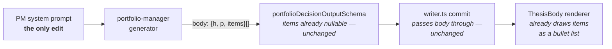

# FIX-783: Trading-desk: PM memo prose is visibly templated — Implementation Spec

## Part I — The Case *(for the human)*

### 1. Problem — why it matters, why now

The portfolio manager's memo is the part of a report people actually read. It is the
decision — what we're doing with this name, and why. Today it reads like a form somebody
filled in.

Put two reports for two different companies side by side and the memos have the same
skeleton, often the same opening words. Across the thirteen memos we have stored, eight
open a paragraph with "The Phase 2 investment…" and five with "The investment thesis
says…". Three of the memo's nine sections — the executive summary, the investment thesis,
and "what supports this rating" — say substantially the same thing before any of them adds
something new. And every figure the decision rests on is buried inside those paragraphs,
because the memo is instructed never to use the bullet list the report already knows how
to draw.

**Why now.** This epic's promise to a reader is that a report faithfully represents the
analysis that ran. A memo that reads as boilerplate undercuts that promise from the other
direction: the analysis *did* run, and the writing makes it look like it didn't. Everything
else in the epic makes the numbers honest; this makes the decision on top of them read like
a decision. There is no workaround — the reader cannot un-see the template.

### 2. Solution in plain terms

Three edits to the instructions the portfolio manager writes against.

**Stop handing it example sentences.** The instruction that produces "The investment thesis
says…" literally supplies that sentence as the model to follow. We keep the requirement —
every claim names where it came from, which is what makes a decision auditable — and drop
the supplied phrasing, replacing it with a rule that the wording is the writer's.

**Collapse the sections that overlap.** The executive summary becomes one thing only: the
verdict, in a paragraph. The reasoned case becomes one section instead of two. Nine
sections become eight, and the duplication has nowhere to live.

**Let the evidence be evidence.** The memo's structure already carries an evidence-bullet
list per section, and the report already renders it — the instructions currently forbid it
outright. We reverse that: the load-bearing figures and claims go in the bullets, the
judgment stays in prose.

**Philosophy** — tenet 3 (earn every addition, and subtract as you go): every part of this
change is a removal — one section, one set of example sentences, one prohibition. Nothing
is added to the report's structure, because the structure was never the problem. Tenet 6
(readability is an output): the memo is a human-facing artifact, so how it reads is part of
whether it works, not a finish applied afterwards.

### 6. Decisions & rules — the sign-off surface

1. **Every memo keeps the same section order; only the writing varies.**
   *Rejected:* letting the manager choose its own sections per report, which is the most
   direct reading of "structure derives from the run's content."
   *Locks in:* a reader can find "what would make this wrong" in the same place in every
   report, and two reports stay comparable side by side — which is most of what a report
   set is for. The price is that the *outline* of every memo still looks alike; if that
   turns out to be the thing that reads as templated, it is a second change, not this one.

2. **The reasoned case is one section, not two, and the executive summary is a verdict
   only.**
   *Rejected:* keeping all three sections and instructing the writer not to repeat itself
   — the same instruction style that produced the problem.
   *Locks in:* reports written from today read with a different outline than the thirteen
   already stored. Nothing in the product looks up a section by name, so nothing breaks;
   but anyone comparing an old report to a new one sees the shape change, and we do not
   rewrite the old ones.

3. **Figures and claims go in the bullets; judgment stays in prose.**
   *Rejected:* bullets everywhere, or leaving the choice to the writer each time.
   *Locks in:* the numbers a decision rests on become skimmable and quotable, which is what
   the bullet affordance was built for. A memo becomes visibly denser in evidence, which is
   the point, and slightly less essay-like, which some readers will prefer and some won't.

4. **We verify this by reading two freshly generated reports, not by a test that checks for
   banned phrases.**
   *Rejected:* a deterministic check that fails when a known tic reappears.
   *Locks in:* nothing goes red if a future edit to these instructions reintroduces a
   template — we would notice by reading, not automatically. Accepted, because a phrase
   list is trivially satisfied by rewording ("Per the investment thesis…") while the memo
   stays exactly as templated, and the desk's automated-check layer has a standing rule
   against asserting on written prose for precisely this reason. Buying false confidence
   here is worse than buying none.

**Non-goals** — the other two agents whose instructions carry the same "no bullets"
prohibition (the scenario forecaster and the thesis validator). Same defect, different
owner; recorded in §12 and raised on the epic rather than fixed here. Also not in scope:
changing what the manager *decides*, any of the deterministic gates that clamp its rating
or size, and the streamed approach preamble (checked — it describes method in one or two
sentences and does not shape the memo).

**Size:** Small — 1 production file · 0 new CI specs · 0 doc surfaces · 1 PR.

---

### 3. Tradeoffs & alternatives

**Alternative: let the writer pick its own sections.** The most literal fix — no fixed
skeleton, no fixed anything. Rejected because the fixed skeleton is doing real work: a
report set where every memo answers "when is this wrong?" in the same place is navigable,
and one where it moves is not. The issue's complaint, read closely, is about the *phrase*
skeleton, not the section list — two memos with identical opening sentences, not two memos
with the same table of contents.

**The simpler approach: just delete the example sentences and stop.** Genuinely tempting;
it is one line and it kills the loudest symptom. Insufficient because it leaves both other
defects untouched — the three sections still restate each other, and the evidence bullets
stay empty by instruction. Those are two more removals in the same file, so the marginal
cost of doing all three is close to zero.

**Where the complexity is:** not the edits. It is that the outcome is a judgment about
prose, and we have no honest mechanical way to assert it. Decision 4 is the real content of
this spec — everything else is three deletions.

### 4. Focus practices (1–5)

1. **Subtract as you go (tenet 3).** Every step in §8 removes text. If the diff grows the
   instructions, the change has gone wrong — a longer prompt asking for less templated
   writing is the failure mode this issue is an instance of.
2. **Prove the goal, not the mock (tenet 7 / BP-003).** Nothing here is provable by a unit
   test. The evidence is two real runs, read, against the criteria in §10 — not "the suite
   is green."
3. **Keep the citation requirement while removing its phrasing.** The instruction being
   edited exists so a decision is auditable, and one of the desk's own quality checks grades
   the memo on whether its conclusions trace to the memos it cites. Removing the examples
   must not remove the requirement.
4. **BP-030 (tolerate the old shape).** Thirteen stored memos have nine sections and null
   bullet lists. The report renderer must keep displaying them unchanged — verified as
   structural rather than tested, since the renderer reads sections positionally and by
   presence, never by name.

### 5. What using it looks like

No code is written against this — it changes what a report says, not any API. So the
"usage" is the artifact, before and after.

**Before** *(the shape of a stored memo today — 9 sections, prose only):*

```
EXECUTIVE SUMMARY
  We are maintaining a Hold on <TICKER>. The Phase 2 investment thesis is
  constructive but the risk assessment flagged concentration…

INVESTMENT THESIS
  The investment thesis says the name compounds at a premium multiple
  supported by a 42% revenue growth rate and…

WHAT SUPPORTS THIS RATING
  The investment thesis says the growth rate is durable, and the trader
  proposed a long at $132 with…
```

**After** *(what this spec proposes — 8 sections, evidence in bullets, no supplied
phrasing):*

```
EXECUTIVE SUMMARY
  Hold, at 1.4% of NAV — the growth is real and the entry isn't. One
  paragraph, and it stops there.

THE CASE
  Where we land against the research desk's read, and why.
  • Revenue growth +42%, ahead of the sector's +11% (fundamentals memo)
  • Expected return +8.2% against a 14% margin of safety (valuation spine)
  • Trader's entry $132, stop $118 — 1.9:1 into a catalyst 5 weeks out
```

## Part II — The Build Plan *(for the implementing agent)*

### 7. Technical design

One file changes: the portfolio manager's system prompt,
`flows/analysis/agents/portfolio-manager/prompts/portfolio-manager.prompt.md`. Everything
downstream of it already supports the target output — this is a change to what we ask for,
not to what the pipe can carry.



- **The section shape already carries bullets.** `thesisSection` is `{ h, p, items }` with
  both `p` and `items` nullable, and at least one required by instruction rather than by
  schema. No schema change.
- **The writer passes `body` straight through.** Its deterministic jobs — the lineage check,
  the rating clamp, the three size gates — are untouched. Despite the epic assigning this
  issue "the PM prompt + writer", **the writer needs no change**; say so in the PR rather
  than inventing one.
- **The renderer already draws the bullets** and skips an absent list. Nothing to change.
- **Nothing reads a PM section by its heading.** Verified across the report summary
  aggregate, the deterministic check layer, and the judged-quality layer — the section list
  is free to change. (One lens memo *is* read by heading, elsewhere; the PM is not.)

No sketch: this extends an existing pattern — the analyst prompts already instruct
"populate at least one of `p` or `items` per section" — rather than proposing a new shape.

### 8. Implementation sequence

Each step is a removal from the prompt file. Run the §10 verification once at the end, not
per step.

1. **Rewrite the citation instruction (currently rule 8).** Keep the requirement that each
   body section names the upstream stage a claim came from. **Remove** the three supplied
   example sentences — they are the direct source of the two dominant openers. Replace with
   a rule that the wording is the writer's and that no two sections should open the same
   way. *Depends on:* nothing.

2. **Collapse the body-section list from nine to eight**, per decisions 1 and 2. The
   executive summary is redefined as the verdict alone — what we're doing and the single
   reason, one paragraph, no case-building. **Remove** "What supports this rating" as a
   separate section and fold the reasoned case into one section covering both the upstream
   thesis and the manager's own position on it, including where it departs. *Depends on:* 1
   (same block of the file).

3. **Fix the internal cross-reference.** Rule 3 instructs the manager to "name in body
   section 4 what the trader missed", which points at the counterpoints section. After step
   2 that section renumbers. Update the reference — a stale section number is a silently
   ignored instruction. *Depends on:* 2.

4. **Reverse the bullet prohibition.** **Remove** the sentence "Emit `p` as a string for
   every section; leave `items` as null." Replace with which sections carry which: the
   verdict is prose; the evidence-bearing sections put load-bearing figures and claims in
   `items` and keep `p` for the judgment that connects them; the citations section is a
   list. *Depends on:* 2.

5. **Add one short "how this should read" clause** — vary the openers, no section restates
   another, and the paragraphs follow this run's evidence rather than a fixed order of
   moves. Keep it to a few lines: this step is the one that can grow the file, and per §4
   practice 1 the net diff should still be negative.

6. **Run the §10 verification** and record the result in the PR.

### 9. Edge cases & error handling

| Case | Expected |
|---|---|
| A Hold / Sell / Underweight run, where three decision predicates are empty by contract | The case section still has content — the case *for holding* is a case. It must not degrade to one line because the bullish predicates are blank |
| An upstream memo errored or is unavailable | The citation rule names only stages that actually produced a memo. It must not push the writer to cite something absent, or to pad — the desk's existing "absent inputs are non-evidence in both directions" rule governs |
| The cheap (`fast`) preset — fewer upstream memos reach the manager | Fewer citations and fewer bullets is correct. Thin evidence must read as thin, not get topped up to fill the new bullet lists |
| A section with bullets and no paragraph | Valid — the renderer draws bullets alone. Only the citations section is expected to be bullets-only |
| The thirteen stored memos (9 sections, `items: null`) | Render exactly as today. The renderer is positional and presence-based, never keyed on a heading, so this needs no dual-read code — but confirm it by opening one stored report |
| A future preset or run that produces no bullets at all | Not an error and nothing throws. This is a writing instruction, not a contract — see decision 4 |

**Taxonomy:** nothing here is a failure path. Every case above degrades to a memo that is
merely less good, never to an error — deliberately, because the alternative (rejecting a
decision for style) would throw away a real analysis over prose.

### 10. Testing strategy

**No goal check, and no new CI spec — both would be theatre.** A goal check would have to
assert on generated prose, and any assertion cheap enough to write (no banned phrase, at
least one bullet per section) is satisfied by a reworded template, so it would certify
exactly the failure it exists to catch. A CI spec can only assert the prompt file's own
text, which is a tautology. Decision 4 owns this call.

**Verification (BP-003 evidence path) — two real runs, read.** Use the headless two-step in
`labs/trading-desk/CLAUDE.md` → "Verifying changes headlessly" (or the `verify-trading-desk`
skill): `analyze` then the zero-model read-back, for two tickers whose stance differs — one
directional and one flat, matching the issue's own acceptance criterion. Read both memos
out of the artifacts read-back.

**Pass criteria — all six, on both memos:**

1. Eight body sections, in the order §8 step 2 defines.
2. Every evidence-bearing section has at least one bullet, and the bullets carry actual
   figures or named claims rather than restated prose.
3. Neither memo contains "The investment thesis says", "The Phase 2 investment", "We
   explicitly defer", or "We are maintaining".
4. No two sections within a memo restate each other — specifically, the executive summary
   is a verdict and does not build the case.
5. Read side by side, the two memos' paragraph openers differ. This is the criterion the
   whole issue turns on, and it is a human judgment; state the verdict in the PR rather
   than implying it.
6. Opening one of the thirteen already-stored reports renders unchanged.

**Regression:** the existing Phase 5 suite must stay green. Its fixture memo bodies are
single-section and hand-built, so they are unaffected by a prompt change — confirm rather
than assume.

**Discipline:** neither `tdd` nor `diagnose` applies cleanly; the loop is edit → run → read
→ adjust. Budget for more than one pass: the first regeneration is unlikely to clear
criterion 5 outright, and tightening the clause from step 5 is the expected adjustment.

### 11. Documentation plan

**No documentation changes required.** The trading desk is a lab app, not published
documentation, so nothing under `apps/docs/` is affected. `labs/trading-desk/CLAUDE.md`
describes the memo lifecycle and the deterministic gates but does not enumerate the
manager's body sections, so it stays accurate. Nothing in `packages/*/README.md` is
touched. A changeset is still required by BP-022 — internal-only, so `--empty`.

### 12. Dependencies, open questions & follow-ups

**Dependencies:** none. Both related issues (FIX-604 approach pre-steps, FIX-678
final-decision discipline) are already Done, and no open pull request touches this agent's
directory.

**Epic alignment (FIX-1067).** This is a group A issue — the epic's file-ownership table
gives it the prompt and writer under `flows/analysis/agents/portfolio-manager/`, and this
spec stays inside that boundary. It needs no resource or schema change, which the epic's
theme 3 names as the signal that a group A issue has left its lane.

**Open questions:** none. The one genuinely contestable call — how much of the fixed
skeleton survives — is decision 1, and it is a decision rather than a question because the
answer does not depend on anything only the owner knows.

**Follow-ups (flagged, not built):**

- **The same prohibition, two lanes over.** The scenario forecaster's and the thesis
  validator's prompts carry the identical sentence "Emit `p` as a string for every section;
  leave `items` as null." Their memos will have the same empty bullet lists for the same
  reason. Not this issue's file, and not owned by any issue in the epic — **comment up on
  the epic PR** rather than widening scope here.
- **The durable home for this quality signal is the judged layer, not a new check.** The
  desk already grades the manager's memo on two judged dimensions. Adding a criterion for
  "reads as a specific decision rather than a form" would cost no extra model call, and it
  is the coherent place for it — but changing a rubric invalidates the measured baseline the
  scoreboard compares against, so it belongs in its own change with that cost stated.

---

## Spec evolution

- **Spec drafted** — traced all three symptoms to three specific clauses in one prompt file
  (supplied example sentences, a nine-section list with three overlapping entries, and an
  outright prohibition on the evidence bullets the renderer already draws); chose to keep
  the fixed section spine and remove the fixed phrasing, collapsing nine sections to eight;
  and declined to add a deterministic prose check, on the grounds that a phrase list
  certifies a reworded template.
