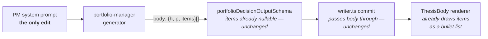

# FIX-783: Trading-desk: PM memo prose is visibly templated — Implementation Spec

## Part I — The Case *(for the human)*

### 1. Problem — why it matters, why now

The portfolio manager's memo is the part of a report people actually read. It is the
decision — what we're doing with this name, and why. Today it reads like a form somebody
filled in.

Put two reports for two different companies side by side and the memos have the same
skeleton, often the same opening words. Across the thirteen memos we have stored, eight
open a paragraph with "The Phase 2 investment…" and five with "The investment thesis
says…". Three of the memo's nine sections — the executive summary, the investment thesis,
and "what supports this rating" — say substantially the same thing before any of them adds
something new. And every figure the decision rests on is buried inside those paragraphs,
because the memo is instructed never to use the bullet list the report already knows how
to draw.

**Why now.** This epic's promise to a reader is that a report faithfully represents the
analysis that ran. A memo that reads as boilerplate undercuts that promise from the other
direction: the analysis *did* run, and the writing makes it look like it didn't. Everything
else in the epic makes the numbers honest; this makes the decision on top of them read like
a decision. There is no workaround — the reader cannot un-see the template.

### 2. Solution in plain terms

Three edits to the instructions the portfolio manager writes against.

**Stop handing it example sentences.** The instruction that produces "The investment thesis
says…" literally supplies that sentence as the model to follow. We keep the requirement —
every claim names where it came from, which is what makes a decision auditable — and drop
the supplied phrasing, replacing it with a rule that the wording is the writer's.

**Collapse the sections that overlap.** The executive summary becomes one thing only: the
verdict, in a paragraph. The reasoned case becomes one section instead of two. Nine
sections become eight, and the duplication has nowhere to live.

**Let the evidence be evidence.** The memo's structure already carries an evidence-bullet
list per section, and the report already renders it — the instructions currently forbid it
outright. We reverse that: the load-bearing figures and claims go in the bullets, the
judgment stays in prose.

**Philosophy** — tenet 3 (earn every addition, and subtract as you go): every part of this
change is a removal — one section, one set of example sentences, one prohibition. Nothing
is added to the report's structure, because the structure was never the problem. Tenet 6
(readability is an output): the memo is a human-facing artifact, so how it reads is part of
whether it works, not a finish applied afterwards.

### 6. Decisions & rules — the sign-off surface

1. **Every memo keeps the same section order; only the writing varies.**
   *Rejected:* letting the manager choose its own sections per report, which is the most
   direct reading of "structure derives from the run's content."
   *Locks in:* a reader can find "what would make this wrong" in the same place in every
   report, and two reports stay comparable side by side — which is most of what a report
   set is for. The price is that the *outline* of every memo still looks alike; if that
   turns out to be the thing that reads as templated, it is a second change, not this one.

2. **The reasoned case is one section, not two, and the executive summary is a verdict
   only.**
   *Rejected:* keeping all three sections and instructing the writer not to repeat itself
   — the same instruction style that produced the problem.
   *Locks in:* reports written from today read with a different outline than the thirteen
   already stored. Nothing in the product looks up a section by name, so nothing breaks;
   but anyone comparing an old report to a new one sees the shape change, and we do not
   rewrite the old ones.

3. **Figures and claims go in the bullets; judgment stays in prose.**
   *Rejected:* bullets everywhere, or leaving the choice to the writer each time.
   *Locks in:* the numbers a decision rests on become skimmable and quotable, which is what
   the bullet affordance was built for. A memo becomes visibly denser in evidence, which is
   the point, and slightly less essay-like, which some readers will prefer and some won't.

4. **We verify this by reading two freshly generated reports, not by a test that checks for
   banned phrases.**
   *Rejected:* a deterministic check that fails when a known tic reappears.
   *Locks in:* nothing goes red if a future edit to these instructions reintroduces a
   template — we would notice by reading, not automatically. Accepted, because a phrase
   list is trivially satisfied by rewording ("Per the investment thesis…") while the memo
   stays exactly as templated, and the desk's automated-check layer has a standing rule
   against asserting on written prose for precisely this reason. Buying false confidence
   here is worse than buying none.

**Non-goals** — the other two agents whose instructions carry the same "no bullets"
prohibition (the scenario forecaster and the thesis validator). Same defect, different
owner; recorded in §12 and raised on the epic rather than fixed here. Also not in scope:
changing what the manager *decides*, any of the deterministic gates that clamp its rating
or size, and the streamed approach preamble (checked — it describes method in one or two
sentences and does not shape the memo).

**Size:** Small — 1 production file · 0 new CI specs · 0 doc surfaces · 1 PR.

---

### 3. Tradeoffs & alternatives

**Alternative: let the writer pick its own sections.** The most literal fix — no fixed
skeleton, no fixed anything. Rejected because the fixed skeleton is doing real work: a
report set where every memo answers "when is this wrong?" in the same place is navigable,
and one where it moves is not. The issue's complaint, read closely, is about the *phrase*
skeleton, not the section list — two memos with identical opening sentences, not two memos
with the same table of contents.

**The simpler approach: just delete the example sentences and stop.** Genuinely tempting;
it is one line and it kills the loudest symptom. Insufficient because it leaves both other
defects untouched — the three sections still restate each other, and the evidence bullets
stay empty by instruction. Those are two more removals in the same file, so the marginal
cost of doing all three is close to zero.

**Where the complexity is:** not the edits. It is that the outcome is a judgment about
prose, and we have no honest mechanical way to assert it. Decision 4 is the real content of
this spec — everything else is three deletions.

### 4. Focus practices (1–5)

1. **Subtract as you go (tenet 3).** Every step in §8 removes text. If the diff grows the
   instructions, the change has gone wrong — a longer prompt asking for less templated
   writing is the failure mode this issue is an instance of.
2. **Prove the goal, not the mock (tenet 7 / BP-003).** Nothing here is provable by a unit
   test. The evidence is two real runs, read, against the criteria in §10 — not "the suite
   is green."
3. **Keep the citation requirement while removing its phrasing.** The instruction being
   edited exists so a decision is auditable, and one of the desk's own quality checks grades
   the memo on whether its conclusions trace to the memos it cites. Removing the examples
   must not remove the requirement.
4. **BP-030 (tolerate the old shape).** A memo written under the current prompt has nine
   sections and null bullet lists — a shape pinned in the **committed prompt file** (its
   section list, and the "leave `items` as null" line), not only in whatever reports a given
   machine happens to hold. The report renderer must keep displaying them unchanged —
   verified as structural rather than tested, since the renderer reads sections positionally
   and by presence, never by name.

### 5. What using it looks like

No code is written against this — it changes what a report says, not any API. So the
"usage" is the artifact, before and after.

**Before** *(the shape of a stored memo today — 9 sections, prose only):*

```
EXECUTIVE SUMMARY
  We are maintaining a Hold on <TICKER>. The Phase 2 investment thesis is
  constructive but the risk assessment flagged concentration…

INVESTMENT THESIS
  The investment thesis says the name compounds at a premium multiple
  supported by a 42% revenue growth rate and…

WHAT SUPPORTS THIS RATING
  The investment thesis says the growth rate is durable, and the trader
  proposed a long at $132 with…
```

**After** *(what this spec proposes — 8 sections, evidence in bullets, no supplied
phrasing):*

```
EXECUTIVE SUMMARY
  Hold, at 1.4% of NAV — the growth is real and the entry isn't. One
  paragraph, and it stops there.

THE CASE
  Where we land against the research desk's read, and why.
  • Revenue growth +42%, ahead of the sector's +11% (fundamentals memo)
  • Expected return +8.2% against a 14% margin of safety (valuation spine)
  • Trader's entry $132, stop $118 — 1.9:1 into a catalyst 5 weeks out
```

## Part II — The Build Plan *(for the implementing agent)*

### 7. Technical design

One file changes: the portfolio manager's system prompt,
`labs/trading-desk/flows/analysis/agents/portfolio-manager/prompts/portfolio-manager.prompt.md`.
Everything downstream of it already supports the target output — this is a change to what we
ask for, not to what the pipe can carry.



- **The section shape already carries bullets.** `thesisSection` is `{ h, p, items }` with
  both `p` and `items` nullable, and at least one required by instruction rather than by
  schema. No schema change. **The prompt's own shape declaration is narrower than the
  schema** — it announces `body: array of {h, p}`, so step 4 has to widen that line too, or
  the new bullet instruction contradicts the shape the model is handed.
- **The writer passes `body` straight through.** Its deterministic jobs — the lineage check,
  the rating clamp, the three size gates — are untouched. Despite the epic assigning this
  issue "the PM prompt + writer", **the writer needs no change**; say so in the PR rather
  than inventing one.
- **The renderer already draws the bullets** and skips an absent list. Nothing to change.
- **Nothing reads a PM section by its heading.** Verified across the report summary
  aggregate, the deterministic check layer, and the judged-quality layer — the section list
  is free to change. (One lens memo *is* read by heading, elsewhere; the PM is not.)

No sketch: this extends an existing pattern — the analyst preamble already instructs
"populate at least one of `p` or `items` per section" — rather than proposing a new shape.
That rule lives on the Phase 1 analysts only; the later-phase agents carry no equivalent, so
this is alignment with an existing precedent, not a uniform house rule the PM is breaking.

### 8. Implementation sequence

Each step is a removal from the prompt file. Run the §10 verification once at the end, not
per step.

0. **Mint the legacy report first — §10 step 0 — before editing anything.** One cheap
   `fixture`/`fast` NVDA run on the unmodified prompt, **through the running app's New Analysis
   dialog, not the CLI** (a CLI run is owned by `cli-user` and never appears in Past Reports —
   see §10). It is the only way to get a nine-section memo to check criterion 5 against, since a
   clean checkout stores none. Ordering is load-bearing; do this before step 1.
   *Depends on:* nothing.

1. **Rewrite the citation instruction (currently rule 8).** Keep the requirement that each
   body section names the upstream stage a claim came from. **Remove** the three supplied
   example sentences — they are the direct source of the two dominant openers. Replace with
   a rule that the wording is the writer's and that no two sections should open the same
   way. *Depends on:* nothing.

2. **Collapse the body-section list from nine to eight**, per decisions 1 and 2. The
   executive summary is redefined as the verdict alone — what we're doing and the single
   reason, in one paragraph. **Remove** "What supports this rating" as a
   separate section and fold the reasoned case into one section covering both the upstream
   thesis and the manager's own position on it, including where it departs. *Depends on:* 1
   (same block of the file).

   *This step originally read "one paragraph, no case-building" and the shipped prompt briefly
   carried "no case-building, no figures". Both were deleted during implementation review:
   across two real-model passes the clause did not keep figures out of the verdict, and a
   verdict that cites the one number it rests on is better writing, not worse. The wording is
   corrected here so the next implementer does not reintroduce it from this step.*

   The resulting eight `h` values, in order — this is the output contract, and criterion 1
   checks it literally:

   | # | `h` | Role |
   |---|---|---|
   | 1 | `Executive summary` | The verdict alone — what we're doing and the single reason. |
   | 2 | `The case` | The reasoned case: the upstream thesis, our position on it, and where we depart. (Replaces `Investment thesis` + `What supports this rating`.) |
   | 3 | `What argues against` | The strongest counterpoints. |
   | 4 | `Critical near-term inflection` | What to watch next. |
   | 5 | `Pre-committed exit triggers` | When this decision is wrong. |
   | 6 | `Why not the adjacent tier` | The next tier up or down, and what would push us there. |
   | 7 | `Deferred follow-on` | What is left for later. |
   | 8 | `Citations` | The upstream memos this rests on, by name. |

   **Drop the supplied wording from the section descriptions too, not just from rule 8.**
   Section 7's current gloss is literally "what we explicitly defer" — the source of one of
   the memo's stock openers, by exactly the mechanism §1 diagnoses. A description states the
   section's job; it never models a sentence.

3. **Fix the internal cross-reference.** Rule 3 (`portfolio-manager.prompt.md:95`) instructs the
   manager to "name in body section 4 what the trader missed", which points at `What argues
   against`. It is correct today; step 2 renumbers that section from 4 to **3**, so the line
   must become "body section 3". A stale section number is a silently ignored instruction.
   *Depends on:* 2.

4. **Reverse the bullet prohibition.** **Remove** the sentence "Emit `p` as a string for
   every section; leave `items` as null." Replace it with the allocation, stated **without
   naming sections that must carry bullets**: every section carries both keys and populates
   at least one of them, most populate both; figures and named claims go in `items` and `p`
   carries the judgment connecting them; where one is genuinely unused its value is null —
   the JSON value, never the text "null"; `Executive summary` is prose with no bullets and
   `Citations` is bullets with no paragraph; and never pad a list, because thin evidence must
   read as thin. **Widen the shape declaration in the same step** — the line above the section list
   reads `body: array of {h, p} sections in this order`, and must become `{h, p, items}`.
   Leaving it narrow hands the model a shape that contradicts the instruction, which is the
   likeliest way this change produces no bullets at all. *Depends on:* 2.

   Note: this step originally instructed the implementer to write the prompt against "the same
   split criterion 2 checks" and enumerated five sections — `The case`, `What argues against`,
   `Critical near-term inflection`, `Pre-committed exit triggers`, `Why not the adjacent tier` —
   as required to carry bullets. Implementation review deleted that split from the prompt, and
   criterion 2 with it (see §10): `portfolioDecisionOutputSchema` accepts `items: null`
   everywhere so it was never enforced, and `Why not the adjacent tier` came back prose-only on
   every generated memo including complete-corpus runs, so the rule was demanding padding. The
   enumeration is removed here rather than merely annotated because this is a live instruction,
   not a description — left in place it would walk the next implementer back into the matrix
   while they were faithfully following the spec. The `null` requirement is kept: `thesisSection`
   declares `p` and `items` as required nullable fields, so an omitted key breaks the strict
   output schema.

5. **Add one short "how this should read" clause** — vary the openers, no section restates
   another, and the paragraphs follow this run's evidence rather than a fixed order of
   moves. Keep it to a few lines: this step is the one that can grow the file, and per §4
   practice 1 the net diff should still be negative. **If a regeneration misses criterion 4,
   tighten the section descriptions from step 2 before growing this clause** — the clause is
   the one lever that makes the prompt longer, and a longer prompt asking for less templated
   writing is the failure mode §1 is an instance of.

6. **Run the §10 verification** and record the result in the PR.

### 9. Edge cases & error handling

| Case | Expected |
|---|---|
| A Hold / Sell / Underweight run, where three decision predicates are empty by contract | The case section still has content — the case *for holding* is a case. It must not degrade to one line because the bullish predicates are blank |
| An upstream memo errored or is unavailable | The citation rule names only stages that actually produced a memo. It must not push the writer to cite something absent, or to pad — the desk's existing "absent inputs are non-evidence in both directions" rule governs |
| The cheap (`fast`) preset — fewer upstream memos reach the manager | Fewer citations and fewer bullets is correct. Thin evidence must read as thin, not get topped up to fill the new bullet lists |
| A section with bullets and no paragraph | Valid — the renderer draws bullets alone. `Citations` is always bullets-only; `Deferred follow-on` may be (§10 criterion 2). The other six always carry a paragraph, which is the denominator §10 criterion 4 compares over |
| A memo written under the old prompt (9 sections, `items: null`) | Render exactly as today. The renderer is positional and presence-based, never keyed on a heading, so this needs no dual-read code — but confirm it by opening the legacy report minted in §10 step 0 (via the app, not the CLI) |
| A future preset or run that produces no bullets at all | Not an error and nothing throws. This is a writing instruction, not a contract — see decision 4 |

**Taxonomy:** nothing here is a failure path. Every case above degrades to a memo that is
merely less good, never to an error — deliberately, because the alternative (rejecting a
decision for style) would throw away a real analysis over prose.

### 10. Testing strategy

**No goal check, and no new CI spec — both would be theatre.** A goal check would have to
assert on generated prose, and any assertion cheap enough to write (no banned phrase, at
least one bullet per section) is satisfied by a reworded template, so it would certify
exactly the failure it exists to catch. A CI spec can only assert the prompt file's own
text, which is a tautology. Decision 4 owns this call.

**Step 0 (BP-003) — capture a legacy report BEFORE you touch the prompt.** Criterion 5 needs a
memo in the old nine-section shape, and a clean checkout has none: reports live in PGlite under
`.fsdev/`, which is gitignored (`**/.fsdev/**`), and no report capture, seed, or database is
committed. So mint one — **from the running app, not the CLI** — on an **unmodified** checkout,
*before* applying §8 steps 1–5:

```bash
pnpm --filter @flow-state-dev/trading-desk dev   # workspace filter: any cwd is fine
```

Then in the browser, open **New Analysis** and set **all four** fields — three of them default
to something this step cannot use:

| Field | Dialog default | Set it to | Why the default fails |
|---|---|---|---|
| Ticker | `NVDA` (`app/page.tsx:38`) | `NVDA` | Already correct — the only complete corpus |
| **Date** | **today** (`app/page.tsx:142`, `todayIsoDate()`) | **`2026-05-06`** | Fixture resolution probes the requested date **exactly** and fails when no snapshot exists (`flows/analysis/lib/ticker-resolver.ts`, `access()` on `FIXTURE_ROOT/<ticker>/<date>/`). The only committed NVDA snapshot is `2026-05-06`, so today's date resolves to nothing and the run mints no report. |
| **Source** | **`live`** (`app/page.tsx:144`) | **`fixture`** | `live` hits real APIs — costs money, needs keys, and is not reproducible |
| **Preset** | **`full`** (`app/page.tsx:143`) | **`fast`** | `full` is a far more expensive run than a section skeleton needs |

Run it to completion. The row's title is `NVDA · 2026-05-06 · fast · fixture` — that is the row
criterion 5 opens. **Do not substitute today's date**, however natural that looks in a date
picker: the fixture corpus is date-addressed and `2026-05-06` is the only NVDA key that exists.

**Then stop the dev server before going any further.** PGlite is single-process — the code that
owns the data dir says so directly: "PGlite is single-process, so two `fsdev run` children must
not share one data dir" (`db/portfolio-db.ts:50-52`). The dev server and the steps 1–2 headless
runs both resolve to `labs/trading-desk/.fsdev/pglite`, so leaving the server up makes the CLI
runs block on it. The whole §10 sequence is therefore:

| # | Do | Dev server |
|---|---|---|
| 1 | Step 0 — mint the legacy report via New Analysis | **up** |
| 2 | Stop the server | — |
| 3 | Apply §8 steps 1–5 (the prompt edits) | down |
| 4 | Steps 1–2 — the two headless `fsdev run` pairs | **down** |
| 5 | Restart the server, check criterion 5 | **up** |

(`portfolio-db.ts:50-52` also documents `TRADING_DESK_DATA_DIR` as an escape hatch pointing a
throwaway run at its own temp dir. It is a valid alternative for steps 1–2, which never need to
appear in Past Reports — but then the runs are invisible to the UI, so stopping the server is
the simpler default and the one this plan assumes.)

**Why not `fsdev run` here.** The CLI cannot mint a report this criterion can open, because it
hardcodes the session owner and the UI queries a different one:

- `packages/cli/src/commands/run.ts:292,355` set `userId: "cli-user"`, and `run` exposes **no**
  override flag (`fsdev chat` has `-u/--user`; `fsdev run` does not — `--seed-user` seeds
  user-level *state*, not identity).
- The app runs as `USER_ID = "devuser"` (`labs/trading-desk/app/page.tsx:40`), which
  `useFlow` passes to `listSessions({ flowKind, userId })`
  (`packages/react/src/hooks/useFlow.ts:132,146`), and the engine filters on it server-side
  (`packages/engine/src/routes/session-routes.ts:61`).
- The tuple fallback does not rescue it either: `findSessionForTuple`
  (`app/page.tsx:62-75`) searches that same user-scoped list.

A CLI-minted session is therefore owned by `cli-user` and never appears in Past Reports. Running
the analysis through the app is what makes the row reachable — and it exercises the same write
path a real report takes.

`fast` + `fixture` is deliberate and sufficient: the section list lives in the prompt and does
not vary with preset, so the cheap run produces the same nine-section, `items: null` body. NVDA
is deliberate too — it is the only ticker with a complete fixture corpus (see steps 1–2). This
is the one step whose **order** is load-bearing: run it after the edit and it emits the new
shape, leaving criterion 5 with nothing to check.

**Steps 1–2 (BP-003 evidence path) — two real runs, read.** Run `analyze` for two tickers whose
stance differs — one directional and one flat, matching the issue's own acceptance criterion —
then read the memos back with the zero-model **`runArtifacts`** action, whose bundle carries the
full memo bodies. These stay on the CLI — criteria 1–4 read prose, never the UI, and the same
CLI identity writes and reads the session, so the `cli-user` mismatch that blocks step 0 does
not apply. Run them **from `labs/trading-desk`**:

```bash
# The dev server must be STOPPED here — PGlite is single-process (see step 0).
cd labs/trading-desk        # REQUIRED — see "On the working directory" below
mkdir -p .fsdev/headless    # REQUIRED — the shell opens `>` before fsdev starts
for T in NVDA AAPL; do
  SID="pm_memo_$T"
  pnpm fsdev run analysis analyze \
    -i "{\"ticker\":\"$T\",\"date\":\"2026-05-06\",\"dataSource\":\"fixture\",\"costPreset\":\"full\"}" \
    --session "$SID" --capture ".fsdev/headless/$SID.analyze.json" --quiet \
    > ".fsdev/headless/$SID.analyze.log" 2>&1
  pnpm fsdev run analysis runArtifacts \
    -i '{}' --session "$SID" --capture ".fsdev/headless/$SID.artifacts.json" --quiet \
    > /dev/null 2>&1
done
# The memo bodies are each artifacts capture's result.output.
```

**The `mkdir -p` is not optional, and `--capture` does not cover it.** `--capture` creates its
own parent directories in-process (`cli/src/commands/run.ts:162`), but the `>` log redirect is
opened by the *shell* before `fsdev` is ever exec'd — so on a clean checkout, where
`labs/trading-desk/.fsdev/` does not exist at all, the redirect fails first and the command
never runs. An earlier draft of this spec said "`--capture` creates parent dirs, so no `mkdir`
is needed", which was true of `--capture` and irrelevant to the redirect.

**The date is pinned deliberately.** Unlike the dialog, the action's schema already defaults
`date` to `2026-05-06` (`flows/analysis/state.ts:43`), so omitting it would also work — it is
written out anyway so the command does not silently depend on a default that could change, and
so it visibly matches the date step 0 requires.

**Not `runSummary`**: the headless two-step in `labs/trading-desk/CLAUDE.md` (and the
`verify-trading-desk` skill) centers on `runSummary`, which projects decision fields and
per-memo *statuses* only — no prose, so none of the criteria below can be evaluated from it.
`runArtifacts` takes no caller input (`-i '{}'`) and returns the bundle at `result.output`; its
own file header documents this exact CLI form.

`costPreset: "full"` is deliberate here — the opposite call from step 0, and for a reason.
`fast` is cheaper but starves the manager of upstream memos, which weakens exactly the criterion
this issue turns on; step 0 can afford `fast` because it only needs the section *skeleton*.

**On the working directory.** `cd labs/trading-desk` is load-bearing, not tidiness — two
independent things break from the repo root and neither fails loudly. (1) Config discovery is
cwd-only: `AGENTS.md` → *Verifying flow changes during development* says "Run it from the app
directory, since config search is cwd-only … The repo-root invocation stays on directory
discovery", so `fsdev.config.ts` never loads and the run uses CLI-default stores. (2) The PGlite
location derives from cwd — `db/portfolio-db.ts:55` resolves
`process.env.TRADING_DESK_DATA_DIR ?? path.join(process.cwd(), ".fsdev", "pglite")` — so a
root-run reads and writes a *different database*. Same idiom as
`labs/trading-desk/CLAUDE.md` ("run from this directory — `fsdev` config search is cwd-only")
and the `verify-trading-desk` skill ("Run everything from `labs/trading-desk`"). Leave
`TRADING_DESK_DATA_DIR` unset.

**Only NVDA has a complete fixture corpus** — a correction to an earlier draft of this spec,
which claimed all four tickers did. What is actually on disk under
`labs/trading-desk/fixtures/<TICKER>/2026-05-06/`:

| Ticker | Files | Usable for a `full` analyze? |
|---|---|---|
| `NVDA` | 32 | **Yes** — the complete set |
| `AAPL` | 26 | Degraded in **three** analysts — **disclosure** (`sec-filings`, `analyst-estimates`, `earnings-transcript`, `discover-disclosure-context`), **sentiment** (`prediction-markets`), **macro** (`discover-macro-context`) |
| `JPM` | 23 | The AAPL gaps plus the whole **market** analyst (`sector-context`, `sector-peers`, `discover-market-context`) |
| `SPCX` | 4 | **No** — `fixtures/README.md:13` calls it statements-only, "not a full analyze corpus" |

A missing fixture is not silently skipped: `loadFixture` throws `FixtureMissingError` on ENOENT
(`flows/analysis/tools/runtime/fixtures.ts:95`), and the tools are wired unconditionally into
their analysts with no `costPreset` gate — sentiment at `agents/analysts/analysts.ts:207`,
macro at `:309`, disclosure at `:386-389`, market at `:269-271`. Failures are rescued per memo
— `memoStatusSchema` carries an `error` state (`flows/analysis/resources.ts:19`) — so the run
degrades rather than aborts.

**The fundamentals analyst is NOT affected**, on any of these tickers. Its five inputs
(`get_balance_sheet`, `get_income_statement`, `get_cashflow`, `get_fundamentals`,
`discover_fundamentals_context` — `analysts.ts:90-120`) are all present for AAPL and JPM. An
earlier draft of this spec blamed AAPL's degradation on "fundamentals and sentiment", which was
wrong twice over: fundamentals is intact, and it missed disclosure and macro entirely. Since
the plan asks the PR to name which memos were degraded, naming the wrong ones is worse than
naming none.

**The call: run `NVDA` + `AAPL`, and treat AAPL's memo as degraded on purpose.** AAPL is the
better second ticker (26 files vs JPM's 23), but its **disclosure, sentiment and macro**
analysts will produce errored memos, and those feed the PM memo criterion 4 asks a human to
judge. That is acceptable — criterion 4 compares *openers*, which come from the prompt rather
than from the upstream evidence, and §9 already requires that thin evidence read as thin.
**Name those three analysts in the PR** when reporting AAPL's run, so nobody reads its thinner
bullets as a failure of this change — and note that criterion 2's strict half is checked on
NVDA precisely because AAPL has gaps that would otherwise invite padding.
If AAPL's gaps do muddy the judgment, the clean fix is to record a full second corpus
(`dataSource: "record"`, per `fixtures/README.md`) — a live-API run that costs money and adds a
committed corpus, so it is a deliberate escalation, not the default.

**Pass criteria — 1–4 on each new memo; 5 on the step-0 legacy report; the stance precondition
across the pair.** Each was written against one question: *could a memo that does NOT fix the
problem still pass this?* The stance precondition and criteria 2 and 4 were rewritten because
the answer was yes — a criterion satisfied by declining to classify anything, or by two
identical runs, does not test the change (CLAUDE.md §5: a test that can't fail when the
behaviour changes is wrong). Each was then checked a second time against the spec text around
it, which caught three of them contradicting §9 or each other; where a criterion and an
existing rule disagreed, the rule won and the criterion was narrowed to fit.

**Stance precondition — a pass condition, checked before judging any prose.** Read
`result.output.decisionSnapshot.finalRating` from each artifacts capture. One memo must be
**directional** (`Buy`, `Overweight`, `Underweight`, or `Sell`) and the other **flat** (`Hold`).
This is the issue's own acceptance condition, and criteria 1–4 never look at the rating — so
without it two same-stance runs satisfy everything while leaving the actual requirement
untested.

**If both come back the same stance, verification FAILS.** There is no waiver: re-run the
second ticker as `JPM`, or record a usable corpus (`dataSource: "record"`, per
`fixtures/README.md`). If neither produces a differing stance, report the verification as
**unmet** in the PR and stop — do not pass criterion 4 on a pair this precondition has already
called invalid evidence. An earlier draft allowed exactly that as a "weaker pair", which made
the precondition unfailable one paragraph after it was added.

1. Eight body sections, with the `h` values and order §8 step 2 tabulates.

2. **Deleted, with the instruction it existed to check.** This criterion required bullets in
   five named sections — `The case`, `What argues against`, `Critical near-term inflection`,
   `Pre-committed exit triggers`, `Why not the adjacent tier` — mirroring a prompt clause that
   declared `p` and `items` both required in exactly those five.

   Implementation review deleted that clause. `portfolioDecisionOutputSchema` accepts
   `items: null` everywhere and the writer validates neither headings nor list presence, so the
   contract was never enforced; and `Why not the adjacent tier` came back prose-only on every
   generated memo, including complete-corpus runs — it reliably has no figures to list, so the
   rule was demanding padding in an epic about not fabricating. The prompt now states the
   allocation without declaring five sections must satisfy it: populate at least one of `p` or
   `items`, figures and named claims in `items`, judgment in `p`, and never pad a list.

   The criterion goes with it. A check that outlives the instruction it was written to verify
   reports a failure nobody can act on, and reads to the next person as a regression rather
   than a decision — the same reasoning that removed criterion 3b.

   The numbering is left as-is so the references to "criterion 2" elsewhere in this document
   still resolve here rather than silently pointing at a different criterion.

3. No two sections restate each other. Concretely checkable half: `Executive summary` is one
   paragraph and carries no `items`. The rest — that `The case` and `What argues against` argue
   different things — stays a reading judgment.

   **The no-repeated-figures half (formerly 3b) is deleted.** It existed only to check the
   prompt's `no case-building, no figures` clause on the executive summary. Two real-model
   passes showed that clause had no effect — figures still reached the verdict on a pass-2 run —
   so implementation review deleted the clause, and this criterion goes with it. Keeping a no-op
   instruction alive so a stale check has something to point at is backwards; and a verdict that
   cites the one number it rests on is better writing, not worse. A criterion that outlives the
   instruction it was written to check reports a failure nobody can act on.

4. Read side by side, the two memos differ in **how each section opens**, not merely in their
   first line. Compare the opening clause pairwise across **the six sections that always carry
   a `p`** — `Executive summary`, `The case`, `What argues against`, `Critical near-term
   inflection`, `Pre-committed exit triggers`, `Why not the adjacent tier`. `Citations` is
   excluded because it is bullets-only by §9 and criterion 2, and `Deferred follow-on` because
   it may legitimately carry no paragraph — neither has an opening clause to compare, so
   including them would inflate the denominator with sections that cannot differ.
   **If four or more of those six open with the same construction, the template survived and
   this fails**, whatever the topic sentences say. This is the criterion the whole issue turns
   on and it is a human judgment; state the verdict in the PR, with the pairwise comparison,
   rather than implying it.

5. The legacy report minted in step 0 — Past Reports → the `NVDA · 2026-05-06 · fast · fixture`
   row — renders exactly as it did before the change: nine headings, a paragraph under each,
   no bullet lists, and no empty-list artifacts. **Restart the dev server first**
   (`pnpm --filter @flow-state-dev/trading-desk dev`); it was stopped for steps 1–2 and the
   headless runs must have finished before it comes back up. If that row is missing, either the
   step-0 run went through the CLI (owned by `cli-user`, invisible here) or it used today's
   date instead of `2026-05-06` (no fixture snapshot, so nothing was minted). Redo it through
   the New Analysis dialog with the date set, rather than working around it.

**What criterion 5 covers, and what it no longer does.** It previously read "open one of the
thirteen already-stored reports" — thirteen real reports accumulated across tickers, dates,
and presets on one machine. None of that is committed, so the criterion could not be run from
a clean checkout at all. Step 0 replaces it with **one** report in **one** shape: the shape the
prompt at HEAD produces. That still covers what BP-030 is about here (nine sections,
`items: null`), because that shape is pinned in the committed prompt rather than in the corpus.
It does **not** cover memos persisted under still-older prompt revisions — a body whose
headings were since renamed, or one written before `items` existed on the section schema.
Nothing in the repo pins those shapes, so nothing can verify them from a clean checkout; if one
matters, it needs a committed capture of its own, which this issue does not add.

**Deliberately not a criterion: a list of banned phrases.** An earlier draft gated on the
four stock openers by name. That is the phrase list decision 4 rejects, moved from CI into
the human's hands, where it fails the same way — reword the tic and the check passes while
the memo stays templated — and worse, it hands the implementer a target to optimize against.
Criterion 4 owns opener variation, judged by reading. (One of the four, "We are maintaining",
is also legitimate prose for a Hold; banning the string would push the writer into a worse
sentence to satisfy it.) Naming a recurring tic as *evidence* in the PR is useful; gating on
it is not.

**Regression:** the existing Phase 5 suite must stay green — `pnpm --filter
@flow-state-dev/trading-desk test`, which unlike the `fsdev run` calls above is a workspace
filter and so runs correctly from any directory. Its fixture memo bodies are single-section and
hand-built, so they are unaffected by a prompt change — confirm rather than assume.

**What has actually been checked, and what has not.** This section's evidence path has been
wrong four times — an uncommitted report corpus; a CLI invocation writing to a database the UI
never reads; a dialog date resolving to no fixture, plus a shell redirect into a directory that
does not exist; and two criteria that contradicted §9 and each other. The first three were the
same shape — verifying the layer that had just changed, not the layer that runs first. The
fourth was a different one: not checking the fix against **the spec text beside it**, which is
how a criterion requiring bullets in five sections landed next to a rule saying thin evidence
must stay thin. So rather than repeat any claim, here is the ledger:

| Criterion | Verified by reading the code/docs | **Not** verified — no run was performed |
|---|---|---|
| Step 0 / criterion 5 (legacy report) | CLI hardcodes `cli-user` with no override flag (`cli/src/commands/run.ts:292,355`, option list); app queries `devuser` (`app/page.tsx:40`) via `listSessions` (`useFlow.ts:132,146`) filtered server-side (`session-routes.ts:61`); tuple fallback is same-scope (`app/page.tsx:62-75`). Dialog defaults read off `app/page.tsx:38,142,143,144`; fixture resolution probes the exact date (`flows/analysis/lib/ticker-resolver.ts`) and `2026-05-06` is the only NVDA snapshot on disk. Single-process PGlite stated at `db/portfolio-db.ts:50-52`. | **Step 0 has never been executed.** An attempt to settle it empirically was made in parallel and produced no usable result, so the date finding rests on the citations above and Codex's — not on a run. Unverified: that the dev server starts, that the dialog exposes these four fields as assumed, that the row opens, and what a second process against a live `.fsdev/pglite` does in practice (the sequencing follows the code comment, not an observed lock). |
| 1–4 (two memos) | `runArtifacts` has `inputSchema: z.object({})` and its header documents the exact CLI form; the artifacts bundle carries `decisionSnapshot.finalRating` for the stance check (`run-artifacts.ts:86,115`, `decision-snapshot-resource.ts:34`); `--capture` creates parent dirs (`run.ts:162`) but the `>` redirect does not, hence `mkdir -p`; action-level `date` default is `2026-05-06` (`state.ts:43`); cwd rules per `AGENTS.md` + `portfolio-db.ts:55`; fixture inventory counted on disk, and each missing file traced to its analyst (`analysts.ts:90-120,207,269-271,309,386-389`). | That a `full` fixture run completes, what AAPL's degraded memos look like, whether the two runs actually land on differing stances, and whether the pairwise opener comparison is judgeable across six sections in practice. All require the run. |
| Regression | The suite exists (`test/phase-5-*.spec.ts`, 11 files) and `pnpm --filter` is cwd-independent. | That it currently passes. |

**Nothing in §10 has been executed.** It is a plan checked against the code it will run through,
not a transcript. Treat a criterion that fails to find its data as a defect in this plan and say
so in the PR — do not invent a substitute, which is the failure this whole section exists to
prevent.

**Discipline:** neither `tdd` nor `diagnose` applies cleanly; the loop is edit → run → read
→ adjust. Budget for more than one pass: the first regeneration is unlikely to clear
criterion 4 outright. The expected adjustment is **sharpening the section descriptions from
step 2**, not growing the step 5 clause — per §4 practice 1, a diff that keeps adding
instructions is the failure mode, and the net diff should still be negative when this
converges.

### 11. Documentation plan

**No documentation changes required.** The trading desk is a lab app, not published
documentation, so nothing under `apps/docs/` is affected. `labs/trading-desk/CLAUDE.md`
describes the memo lifecycle and the deterministic gates but does not enumerate the
manager's body sections, so it stays accurate. Nothing in `packages/*/README.md` is
touched. A changeset is still required by BP-022 — internal-only, so `--empty`.

### 12. Dependencies, open questions & follow-ups

**Dependencies:** none. Both related issues (FIX-604 approach pre-steps, FIX-678
final-decision discipline) are already Done, and no open pull request touches this agent's
directory.

**Epic alignment (FIX-1067).** This is a group A issue — the epic's file-ownership table
gives it the prompt and writer under
`labs/trading-desk/flows/analysis/agents/portfolio-manager/`, and this spec stays inside that
boundary. It needs no resource or schema change, which the epic's
theme 3 names as the signal that a group A issue has left its lane.

**Open questions:** none. The one genuinely contestable call — how much of the fixed
skeleton survives — is decision 1, and it is a decision rather than a question because the
answer does not depend on anything only the owner knows.

**Follow-ups (flagged, not built):**

- **The same prohibition, two lanes over.** The scenario forecaster's and the thesis
  validator's prompts carry the identical sentence "Emit `p` as a string for every section;
  leave `items` as null." Their memos will have the same empty bullet lists for the same
  reason. Not this issue's file, and not owned by any issue in the epic — **comment up on
  the epic PR** rather than widening scope here. Worth carrying into that comment: the
  sentence is byte-identical in all three prompts, so the durable fix is a shared
  `` partial (the `phase1-analyst-preamble` precedent) rather than three
  independent reversals that can drift apart. Reversing the PM's copy alone leaves the other
  two silently on the old rule.
  **Scope guard — the partial is this follow-up's proposal, not part of this issue.** Do not
  build it here, and do not touch the forecaster or validator prompts: this PR edits exactly
  one file (§7), and extracting a shared partial would rewrite all three plus the render
  wiring. Carry the idea into the epic comment and stop there.
- **The durable home for this quality signal is the judged layer, not a new check.** The
  desk already grades the manager's memo on two judged dimensions. Adding a criterion for
  "reads as a specific decision rather than a form" would cost no extra model call, and it
  is the coherent place for it — but changing a rubric invalidates the measured baseline the
  scoreboard compares against, so it belongs in its own change with that cost stated.

### 13. Review notes for the implementer

Recorded verbatim from spec review. These are below the direction bar — they are judgments
about real code, not about the approach, so they are carried here rather than folded into
the design. Weigh them against what you find; none is binding.

- **On step 5 (cursor).** "Step 1 already says no two sections should open the same way; step
  5 repeats vary-openers / no-repetition. §10 then budgets multiple passes *tightening this
  clause* — additive iteration on the one step that can grow the file. Simpler: fold
  readability into step 1 + the collapsed section definitions (step 2) and omit step 5. If
  criterion 5 fails on first run, tighten the section *descriptions* you removed overlap from
  rather than adding a new 'how this should read' block." *(§10's discipline line now points
  at the section descriptions first; whether step 5 survives at all is yours to judge once
  you see the file.)*

- **On the collapsed section's heading (codex).** "The example calls it `THE CASE`, while the
  current prompt calls the surviving section `Investment thesis`." *(§8 step 2 now fixes `The
  case`. If, with the file open, keeping `Investment thesis` reads better against the
  neighbouring headings, that is a defensible call — say which you picked in the PR.)*

- **On Part I length (cursor).** "~20–25% Part I duplication: Decision 1 restated in §3;
  Decision 4 argued in §6, §10, and Spec evolution; forecaster/validator non-goal appears
  twice. §7 mermaid is accurate but heavy for a one-file change." *(About this document, not
  the build; noted rather than actioned, since the spec dies with its PR.)*

---

## Spec evolution

- **Spec drafted** — traced all three symptoms to three specific clauses in one prompt file
  (supplied example sentences, a nine-section list with three overlapping entries, and an
  outright prohibition on the evidence bullets the renderer already draws); chose to keep
  the fixed section spine and remove the fixed phrasing, collapsing nine sections to eight;
  and declined to add a deterministic prose check, on the grounds that a phrase list
  certifies a reworded template.
- **After spec review (round 1)** — removed the banned-phrase pass criterion from §10: it was
  decision 4's rejected phrase list moved from CI into the human's hands, where it fails the
  same way and gives the implementer a target to optimize against. Opener variation is now
  judged by reading alone. Also corrected the verification read path — memo prose comes from
  the `runArtifacts` action, not `runSummary`, which carries statuses only — so the BP-003
  evidence path is actually executable; tabulated the eight section headings in §8 step 2,
  which criterion 1 asserts against and which the plan previously left the implementer to
  infer; and folded two supplied-wording sources the plan had missed (the `{h, p}` shape
  declaration above the section list, and the "what we explicitly defer" gloss that is itself
  a stock opener).
- **After spec review (round 3, BP-003 defect)** — criterion 5 required opening "one of the
  thirteen already-stored reports", which a clean checkout does not have: reports live in
  PGlite under the gitignored `.fsdev/`, and no capture or seed is committed, so the criterion
  was unrunnable and would have been silently skipped or substituted. Replaced it with a
  §10/§8 **step 0** that mints a legacy nine-section report from the committed tree (one cheap
  `fixture`/`fast` run on the unmodified prompt, kept in the shared store) and opens *that*
  after the change — reproducible by anyone, and exercising the real render path rather than a
  fixture nothing renders. Swept the other evidence paths in the same pass: criteria 1–4 and
  the Phase 5 regression were already clean-checkout executable (the fixture corpus is
  committed and the runs mint their own sessions); the same ambient-corpus assumption was
  found and fixed in two further places — §9's edge-case row and §4 practice 4. §1's "thirteen
  memos" is left as-is: it reports the observed symptom that motivated the issue, which is not
  an evidence path.
- **After spec review (round 4) — the round-3 fix was itself unrunnable, in two ways.** Round 3
  replaced an unexecutable criterion with a CLI command that was also unexecutable, which is
  why §10 now carries a checked/not-checked ledger instead of an executability claim.
  (a) *Working directory:* the new step 0 was a bare `pnpm fsdev run` with no cwd.
  `fsdev.config.ts` discovery is cwd-only (`AGENTS.md`) and the PGlite dir resolves to
  `process.cwd()/.fsdev/pglite` (`db/portfolio-db.ts:55`), so a repo-root run writes to a
  database nothing reads. Every CLI invocation in §10 now carries `cd labs/trading-desk`,
  matching `labs/trading-desk/CLAUDE.md` and the `verify-trading-desk` skill, and steps 1–2 —
  previously prose the implementer had to reconstruct — are now a concrete block.
  (b) *Session ownership, one layer below that:* `fsdev run` hardcodes `userId: "cli-user"`
  (`cli/src/commands/run.ts:292,355`) with no override flag, while the app lists Past Reports as
  `devuser` (`app/page.tsx:40` → `useFlow.ts:132,146` → `session-routes.ts:61`), and the tuple
  fallback shares that scope. No CLI-minted report can ever appear in the UI, so step 0 now
  mints the legacy report **through the running app's New Analysis dialog**. Criteria 1–4 stay
  on the CLI, where the same identity writes and reads.
  Also corrected a false claim the same review caught: §10 asserted that AAPL, JPM, NVDA and
  SPCX all have a usable fixture corpus. Only **NVDA** does (32 files). SPCX is statements-only
  (`fixtures/README.md:13`, 4 files); AAPL (26) and JPM (23) both lack `prediction-markets.json`,
  which the sentiment analyst loads unconditionally and whose absence throws
  `FixtureMissingError`. §10 now tabulates what is on disk and makes an explicit call — run
  NVDA + AAPL, treat AAPL's memo as deliberately degraded, and say so in the PR. Two smaller
  folds: §8 step 3 now pins the renumbered cross-reference (`body section 4` → `3`,
  `portfolio-manager.prompt.md:95`), and §12's shared-``-partial follow-up carries a
  scope guard so it is not mistaken for in-scope work.
- **After spec review (round 5)** — four §10 defects, none touching the spec's substance. Two
  were again "the layer that runs first": the New Analysis dialog initialises its date to
  *today* (`app/page.tsx:142`) while fixture resolution probes the requested date exactly
  (`flows/analysis/lib/ticker-resolver.ts`) and the only NVDA snapshot is `2026-05-06`, so step
  0 would have minted nothing on any day but one — step 0 now tabulates all four dialog fields,
  three of which default wrong (date, and also `dataSource: "live"` and `costPreset: "full"`,
  found by asking what *else* the dialog defaults). And the `>` log redirect is opened by the
  shell before `fsdev` starts, so `--capture`'s in-process `mkdir` cannot rescue it on a clean
  checkout where `.fsdev/` does not exist; steps 1–2 now begin `mkdir -p .fsdev/headless`, and
  the round-4 note claiming no `mkdir` was needed is corrected in place. The CLI steps needed no
  date instruction — the action schema already defaults to `2026-05-06` (`state.ts:43`) — but
  the date is pinned explicitly anyway so the command does not rest on a default.
  The other two were **criteria that could not fail**: "evidence-bearing section" was never
  enumerated, so a memo classifying nothing as evidence passed criterion 2 — the five sections
  that must carry bullets are now named, with `Executive summary` prose-only, `Citations`
  exempt from the figures test, and `Deferred follow-on` optional. And nothing checked the two
  runs' stances, so two same-stance runs satisfied everything while leaving the issue's actual
  acceptance untested — a stance precondition now reads `decisionSnapshot.finalRating` from each
  capture and says what to do when they match. While there, criteria 3 and 4 were sharpened
  against the same question: 3 gains a concretely checkable half (the executive summary carries
  no `items` and repeats none of the evidence figures), and 4 now compares the opening clause of
  all eight sections pairwise rather than just the memos' first lines.
- **After spec review (round 6, final fold)** — five §10 defects, **two of them introduced by
  round 5's own fixes**, which is why folding stops here and later review becomes implementer
  notes. (a) *Process contention:* PGlite is single-process (`db/portfolio-db.ts:50-52`), and
  step 0 left the dev server running into the steps 1–2 headless runs against the same data
  dir; §10 now carries an explicit five-row sequence — mint, stop the server, edit, run
  headless, restart for criterion 5. (b) *Self-inflicted:* the stance precondition ended with a
  waiver permitting exactly the same-stance pair it had just called invalid evidence, making it
  unfailable one paragraph after it was added — **EM decision: no waiver**; a matching pair now
  fails verification outright. (c) *Self-inflicted:* criterion 2's flat "all five sections carry
  a figure" contradicted §9 (absent stages are non-evidence, thin evidence must read as thin)
  and would have rewarded padding on the deliberately degraded AAPL run — it now splits, strict
  on the complete-corpus NVDA run and conditional elsewhere, with "every figure the memo does
  rest on lands in `items`" as the half that holds everywhere. (d) Criterion 4 compared all
  eight sections when `Citations` is bullets-only and `Deferred follow-on` may carry no
  paragraph — the denominator is now the six sections that always carry `p`, threshold four.
  (e) AAPL's degradation was attributed to "fundamentals and sentiment"; fundamentals is fully
  present (`analysts.ts:90-120`) and the real casualties are **disclosure, sentiment and
  macro** — corrected everywhere, since the plan asks the PR to name them.
  The lesson recorded in the ledger: three of the four historical failures came from not
  checking the layer beneath, and this one from not checking **the text beside** — a fix written
  without re-reading the rule it sits next to.
