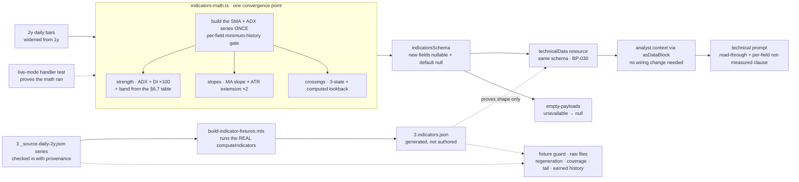

# FIX-826: Trend analysis is shallow — the desk labels the MA stack but can't characterize trend strength, persistence, or inflection — Implementation Spec

## Part I — The Case *(for the human)*

### 1. Problem — why it matters, why now

The desk publishes a trend read that is really a description of two lines.

`trend: "up"` means the last close sits above the 50-day average and the 50-day
sits above the 200-day. That is all it means. It says nothing about whether a
directional trend is actually present, how forceful it is, whether it began last
week or a year ago, or how fast it is running. Every one of those questions — the
questions a trend read exists to answer — is left to the technical analyst to
eyeball from a one-month price window, with nothing computed underneath it.

That is a real gap rather than a cosmetic one, because a bullishly-ordered stack
is a routine condition. It is true of a name grinding sideways with a slight
upward drift and true of a name in a violent, well-established advance, and the
desk reports the same word for both. A reader of the memo — and the trader and PM
reading it downstream — cannot tell those two apart from anything the desk
computed.

**Why now.** Two things. First, [FIX-1063](https://linear.app/fixpoint-labs/issue/FIX-1063)
**has landed** the data-honesty contract that makes this label *honest* (merged
`a1928f57a`) — a trend the desk could not measure now reads as no trend rather
than as "flat". That closes the lie and leaves the shallowness exactly where it
was: a *measured* "up" still only means the averages are stacked. The shape this
issue builds on is now settled on `main` rather than in flight, which is what
made building depth premature until this week. Second, the epic
([FIX-1067](https://linear.app/fixpoint-labs/issue/FIX-1067)) explicitly owns this
issue at full scope; the product owner already weighed and rejected both the
"defer it" and the "just add a disclaimer" alternatives, with a standing
guardrail: *characterize the trend, or say plainly that the desk cannot.*

There is no workaround. The numbers do not exist anywhere in the pipeline.

### 2. Solution in plain terms

**The desk computes what it currently asks the model to guess at, and publishes
the existing stack label beside it rather than in place of it.**

- **Is a trend actually there, and how forceful?** A standard trend-strength
  reading (ADX) plus the two directional-pressure components that say which side
  is winning. This is the highest-value addition: it is the industry's canonical
  answer to "is this a trend or is this noise", and it is the one number that
  separates the sideways grinder from the real advance. **The desk publishes both
  the number and a plain-language verdict — "no established trend", "strong
  trend" — and it computes that verdict from a stated threshold table
  (decision 7) rather than letting the model choose the word per run.** Whether
  the desk should publish a verdict word at all is the one thing still open on
  this spec (§12).
- **Which way is it going, and how fast?** The slope of the 50-day and 200-day
  averages over a fixed window, and how far price has run from each of them
  measured in the name's own daily range — so "extended" means something
  comparable across a $12 stock and a $900 one.
- **Did anything just turn?** The two moving-average crossings that mark an
  inflection — 50 against 200, and price against the 50-day — each reported with
  **how many sessions ago it happened**. An age is what makes a crossing news
  rather than another way of restating the stack.

**What this release does not answer: whether the trend is accelerating.** The
slope is an *average rate* between two endpoints, so a trend that steepened, one
that ran flat, and one rolling over can all print the same number. The honest
scope is **is there a trend, which way, how fast on average, and did anything just
turn** — not *is it speeding up or fading*. That needs a curvature measure, is
deliberately not built here, and
[FIX-1117](https://linear.app/fixpoint-labs/issue/FIX-1117) carries it.

**Every field reports "not measured" when the history is too short, and each is
gated on its own bar requirement** — a stock with 75 sessions of trading can have
a strength reading and no 200-day slope at all, and the payload says so per-field
rather than collapsing to one all-or-nothing verdict. §9 carries the exact bar
count for every field, so the gates are auditable rather than aspirational.

**"We looked and found nothing" is recorded differently from "we could not
look."** An absent crossing field reads to the analyst as *there was no
crossing* — a finding the desk never made. So a crossing carries three states,
and "none found" also says **across how many sessions it searched**: roughly **14
months** for the 50/200 crossing and **21 months** for price against the 50-day,
on a two-year fetch. "No golden cross" is meaningless without that number.

**No new signal is wired into the desk's arithmetic.** None of `adx`, the slopes
or the crossings is read by the setup score, the valuation envelope or the
evidence gate. **That is narrower than "nothing here touches the rating", and the
difference is not pedantic:** the new prose reaches the portfolio manager's
context, and the PM is explicitly licensed to step outside the rating band when
the memos surface something the model missed. So the final rating *can* move —
only ever with a written reason attached. Two data routes move published figures
too (`obv` on the widening; the fixture-mode momentum inputs on regeneration).
Decision 2 carries all three with their evidence; §10 verifies them. The evidence
gate is the one thing genuinely untouched throughout.

**Philosophy** — tenet 1 (coherence): this extends FIX-1063's unobserved-is-null
contract onto the fields it adds, and follows the null-gating shape the desk
already uses in `cross-asset-math.ts` (`trend3`) and `options-math.ts`, rather
than introducing a third convention. Tenet 5 (one convergence point): every new
field's minimum-history gate lives in the one indicator module, next to the gates
already there, rather than as per-consumer checks downstream.

> **§2 then §6 lead, and the rest is derivation.**

### 6. Decisions & rules — the sign-off surface

1. **The existing trend word is kept exactly as it is, and the new read sits
   beside it.**
   *Rejected:* redefining the trend word so a weak strength reading downgrades
   "up" to "flat" — that would silently change the meaning of a figure already
   in every stored report, and would make a name that is genuinely in a mild
   uptrend read as trendless.
   *Locks in:* a reader can see the desk say "the averages are stacked upward"
   and "there is no established trend" in the same memo. That is the honest
   state of the world for a sideways grinder, and it will look like the desk
   contradicting itself to anyone who reads only the one-word label.

2. **No new signal is wired into the rating, the setup score or the capital
   gates. That is a claim about DETERMINISTIC scoring only — this release can
   still move the final rating through the model, and through two data routes.**
   State it that narrowly, because the broader version has been wrong three
   times.

   **What holds.** `computeSetupScore` takes
   `technicals: { trend?, sma50?, sma200? }` (`lib/setup-score.ts:29-35`) and
   reads no `adx`, `slopes` or `crossovers` field anywhere. No arithmetic the
   desk performs learns about trend depth.

   **Three routes by which a published figure moves anyway**, all verified in
   source:

   | Route | What moves | Evidence |
   |---|---|---|
   | **The model path — the largest, and it reaches LIVE runs** | The **final rating and everything sized off it.** The new trend prose reaches the PM: `agents/research/generators.ts` injects `phase1Memos` into both Phase 2 consolidators and the research manager, and the full preset passes `phase1MemosFull: true` to the PM (`portfolio-manager.ts:171`). The PM prompt's clause 3 then licenses stepping outside the rating band "if the quantitative model misses a catalyst or a structural risk **the memos surfaced**" — and `writer.ts:158-180` skips the clamp whenever `ratingOverrideReason` is non-empty. So ADX / slope / crossover prose is exactly the licensed grounds for an envelope override | `portfolio-manager.prompt.md:48-56`; `writer.ts:158-180` |
   | **Widening the window to 2y** (decision 6) | **`obv`** — materially, including a sign flip: it is a cumulative running sum from the *first* bar (`indicators-math.ts:185-188`), so doubling the history changes it outright. `rsi14` / `macd` / `atr14` shift ~1e-9 (converged Wilder/EMA warm-up); `sma50`, `sma200`, Bollinger and Stochastic are **identical**, being trailing-window reads | `node spec-poc/FIX-826-trend-math/window-widening.mjs` — `obv` −4066 → 5518 on the same final bar |
   | **Regenerating the fixture corpus** (§10) | **`trend`, `sma50`, `sma200`** in fixture mode — exactly `momentumSub`'s inputs (`setup-score.ts:94-105`: ±20 on the trend label, ±10 on the `sma50 > sma200` ordering). NVDA's fixture reads `124.8 > 112.3` today, a golden cross worth `+10`. Momentum carries weight `0.15`, so a full swing moves the composite ~4.5 points, and the composite feeds `modelImpliedRating` via `valuation-spine.ts:76-85` | §10's before/after regeneration capture |

   **The model path is the one that matters and the one a reader will assume is
   closed.** It is not closed, it is not closeable without gagging the analyst,
   and it is the *intended* mechanism — the whole point of publishing trend depth
   is that a human or a model reads it and thinks differently. What decision 2
   buys is that the change is **legible**: an override leaves a written
   `ratingOverrideReason` naming what the model missed, whereas folding ADX into
   `momentumSub` would move every name's score silently. That is the distinction
   being locked in — not "the rating cannot move", but *"the rating only moves
   where someone had to write down why."*

   **Verification follows the routes.** §10's before/after capture covers the two
   deterministic ones. For the model path, the before/after run also records
   whether `ratingOverrideReason` is non-empty and whether `finalRating` left the
   band, for each of the three tickers — an override appearing where none did
   before is a finding to report, not a failure, but it must not go unnoticed.
   The **evidence gate is genuinely untouched** on every route: `evidenceBasis`
   counts component presence, not values (`setup-score.ts:109`), and
   `evidence-gate.ts:26` records that it never touches `finalRating`.

   *Rejected:* folding trend strength into the momentum component of the setup
   score — the obvious next step, which would change the score, and therefore
   the rating band and the evidence threshold, on **every name in the book** in
   the same release that introduces the signal. That is an unreviewable change
   to a real-money figure.
   *Locks in:* the depth shows up in what the desk *says*, not in what it
   *decides*, until someone deliberately wires it in. If the trend read turns out
   to be the best signal on the desk, we will have to do a second, separate piece
   of work to let it affect anything.

3. **"We looked and found no crossing" and "we could not look" are different
   answers, and the window we searched is published with the first.**
   *Rejected:* one nullable field per crossing, the cheap shape — it collapses
   the two, and the collapse lands on the side that asserts a finding the desk
   never made.
   *Locks in:* the crossing fields are shaped as small objects rather than plain
   values, which is more surface for every future reader to handle. We pay that
   permanently to avoid one specific class of false statement.

4. **Adaptive moving averages are ruled out; the 200-day line gets both a slope
   and a distance-from-price reading.**
   The issue named two gaps. The 200-day one is filled on both axes. The
   adaptive-MA one is declined: the library the desk already uses does not ship
   one, so it would mean hand-rolling smoothing math whose only output is a line
   that answers the same question the strength reading already answers better.
   *Rejected:* hand-rolling KAMA — new unvalidated numeric code carrying real
   money, for a redundant signal.
   *Locks in:* if someone later wants an adaptive MA, they reopen this and argue
   it on its own merits. We are on record that it was considered and declined.

5. **Distance-from-average is computed, not left for the analyst to derive.**
   The raw ingredients (close, the averages, the daily range) are all on the
   payload, so a reviewer will reasonably ask why the desk computes the ratio
   instead of letting the model do one division.
   *Rejected:* leaving it derivable. "The model can do the arithmetic" is exactly
   how a figure ends up transcribed rather than measured — the defect filed as
   [FIX-1115](https://linear.app/fixpoint-labs/issue/FIX-1115), on this same
   memo surface. One computed field removes a model arithmetic step from a
   real-money read.
   *Locks in:* the desk computes derived ratios even when the inputs are visible.
   That is a standing bias toward more deterministic fields, and it will
   occasionally look like redundancy.

6. **The price window the trend math runs on widens from one year to two.**
   With one year of daily bars there are only about fifty days on which both the
   50- and 200-day averages exist, so "no golden cross" could only ever mean "not
   in the last ten weeks."
   *Rejected:* keeping one year and publishing the narrow window honestly — it is
   honest and it is nearly useless. Also rejected: **three years**, which would
   stretch the 50/200 search to ~26 months but needs a new `"3y"` case added to
   both providers' range tables (neither has one, and the unrecognised-range
   default is 45 days — see §12), for a case that is already honestly reported.
   *Locks in:* each analysed name pulls roughly twice the price history it does
   today, on providers the desk already calls — no new provider or entitlement.
   And it **fixes the searchable window at roughly 14 months** for the 50/200
   crossing (~21 for price against the 50-day). A cross older than that reports as
   "none found in the last ~14 months", which is true and useful — the regime is at
   least that old — but it is *not* a detection of the cross itself, and the spec
   must not promise one.

7. **The strength reading is published as a number AND a verdict word, and the
   desk computes that word from the threshold table below — the model never picks
   it.** ⚠️ **This is the decision under review; §12 carries it as the open
   question.** Everything the desk publishes about trend strength — the memo's
   `trend` metric value, the payload — reads off one table:

   | `adx.value` | `adx.band` | how the memo says it |
   |---|---|---|
   | null (not measured) | null — the whole block is null | "trend strength not measured" |
   | `0 ≤ v < 20` | `none` | "no established trend" |
   | `20 ≤ v < 25` | `emerging` | "trend emerging, not confirmed" |
   | `25 ≤ v < 50` | `established` | "established trend" |
   | `50 ≤ v ≤ 100` | `strong` | "strong trend" |

   **Every lower bound is inclusive; the three INTERIOR upper bounds (`20`, `25`,
   `50`) are exclusive; and the scale maximum `100` is INCLUSIVE**, so exactly
   `20.0` is `emerging`, exactly `25.0` is `established`, exactly `50.0` is
   `strong`, and exactly `100.0` is `strong`. The boundary is stated because it is
   the half of a threshold rule that gets decided by accident otherwise.

   **The `100` half is not pedantry — it is reachable, and this spec's own
   evidence reaches it.** `adx-internals.mjs` prints `value = 100.0000` at bar 27
   on the monotone series, and §10's strength table asserts exactly that. An
   earlier wording generalised to "every upper bound is exclusive", under which
   `100` falls out of `strong` *and* out of every other band — classifying the
   most strongly trending name possible as unmeasurable. That is the band
   function's version of the `NaN`-into-`else` defect §10 already guards.

   **The `25` line is a convention the desk is adopting, not a number we derived.**
   It is Wilder's own trend-present threshold and the one most desks use. Note the
   collision a future contributor will hit: `trading-signals`' own `ADX` doc
   comment suggests 20 / 40 / 50 instead. We are deliberately not following the
   library's docstring, and this decision is the record of that — otherwise
   someone reads the docstring, concludes the code is wrong, and "fixes" it.

   **Why the 20–25 `emerging` band exists at all.** Without it, `24.9` publishes
   "no established trend" and `25.1` publishes "established trend", and a name
   sitting in the mid-20s flips the desk's verdict week to week on indicator
   noise. This is the same reasoning `trend3`'s deadband encodes and that this
   spec deliberately *declines* for the slopes (§7): **a published label gets a
   buffer band; a published number does not.** The slopes publish a number, so a
   measured `+0.4%` is reported as `+0.4%`. The strength read publishes a word, so
   it gets the buffer — and the raw value is printed beside the word either way,
   so a reader who distrusts the band can see through it.

   *Rejected:* **leaving the band to the model** — the prompt names the number and
   the analyst writes "strong" or "weak" as it judges. This is what the spec
   implied for five rounds by using `"ADX 31 (strong)"` as an example while
   defining no threshold anywhere, and it is decision 5's defect exactly one
   category up: not "the model can do the arithmetic" but *the model can make the
   call*. Two names with identical readings get different words on different runs,
   and nothing catches it.
   *Rejected:* **publishing the bare number with no verdict word** — honest, and
   it cannot be wrong. It is the live alternative and §12 states it as the fork.
   Declined here because decision 1's whole payoff is a memo that can say "the
   averages are stacked upward" and "there is no established trend" in one breath;
   with no verdict word that becomes "stack up, ADX 18.9", which is only a
   contradiction to a reader who already knows the convention — and a reader who
   knows the convention did not need the desk.
   *Locks in:* the desk is now on the record with a threshold. A name at ADX 24
   and a name at ADX 26 get different words in their memos, and the desk owns that
   line rather than the model improvising it per run. Changing the line later
   changes the wording of every memo written after it — and, because §10 asserts
   the mapping, changing it is a test change, which is the point.

**Non-goals** — **acceleration: whether the trend is speeding up or rolling over
is explicitly NOT measured here** (§2; the slope is an average rate, not a
curvature, and [FIX-1117](https://linear.app/fixpoint-labs/issue/FIX-1117) carries
that outcome); weekly / multi-timeframe confirmation; pattern-structure detection
(Donchian, regression channels, Aroon, breakout geometry — the "Setup" section
stays model-narrated); any change to the setup score, rating envelope, evidence
gate, or reward-to-risk figure **by wiring a new signal into them** (decision 2 —
which also records the two values that do move for other reasons, and the
reward-to-risk figure, verified, is not among them); any new data provider or paid
entitlement (the epic's standing fence); and re-recording the **other** tools'
fixtures (news, fundamentals, sentiment, macro), which this change does not
invalidate. The three tickers' price/indicator snapshots **are** in scope and are
regenerated from a checked-in two-year series rather than hand-authored — §10
carries why that stopped being optional. **Two derived signals
are deferred to follow-ups** rather than dropped — see §12.

**Size:** Medium — 5 production files · 1 fixture generator script · 3 two-year
source series checked in · 3 indicator fixtures regenerated · **7 stale one-year
comments swept (BP-034)** · ~23 test behaviours · 3 doc surfaces · 1 PR.

---

### 3. Tradeoffs & alternatives

**Add ADX and stop.** Most of the value — it is the only one of the three that
answers "is there a trend at all". Rejected because it leaves the inflection
outcome untouched: a strength number is a *level*, and a reader cannot tell a
two-week-old regime from a two-year-old one from it. The crossing ages answer
that, cheaply, over bars already in memory.

**A UI disclaimer, no new math.** Raised at the epic PR review and settled by the
owner, who kept this issue at full scope. Not reopened.

**A separate `compute_trend` tool.** A second tool needs its own provenance tag,
empty payload, per-ticker fixture, spine slot and tool-list entry — and produces
two `source` tags for two reads of the same bars, which can disagree. The bars are
already fetched inside `compute_indicators`. One payload, one provenance, one
honesty contract.

**Where the real risk is:** not the indicator math, which is a library call plus
arithmetic. It is the fields being **reported as unmeasured when they were never
attempted** — three silent paths:

- **A stale fixture defaults to null.** Handler outputs *are* validated at runtime
  (`blocks/internal/build-block.ts` — `validateSchema` `safeParse`s the return
  value), and that parse applies `.default(null)`. A fixture missing the new
  fields does not error and does not drop keys: it yields **explicit nulls** that
  read exactly like a genuinely short-history name, forever, while the smoke check
  keeps passing.
- **The live handler could still request one year, or never persist** — fixture
  mode would never notice, because it does not call the math at all.
- **An un-updated prompt** leaves the numbers in the payload and out of the memo.

**And one path that runs the other way, which is worse:** a fixture reporting the
fields as **measured when nothing measured them.** Hand-authored values are
indistinguishable from computed ones once they are in the JSON, and fixture mode
returns `indicators.json` directly. The three paths above publish "not measured"
when we did measure; this one publishes a measurement we never made, into a memo,
as fact. §10's generated-corpus rule is the answer.

§10 makes all four loud, and rests on **the fixture path proving only the shape —
only the live path proves the math ran.** Note the tension: `.default(null)` is
what lets a pre-existing session parse (BP-030) *and* what makes a stale fixture
silent. One schema serves both, so the fixture guard must read the raw file rather
than the parsed payload.

**A cost we accept:** decision 1 means the memo can carry two trend statements a
fast reader will call contradictory. The alternative was worse — one reconciled
label that quietly redefines a published figure.

### 4. Focus practices (1–5)

1. **FIX-1063's governing invariant — a verdict field only ever describes work
   that actually happened.** Every field this issue adds is a small verdict about
   a trend, and each one has a distinct minimum history. The invariant is not
   satisfied by making the fields nullable; it is satisfied by each field's null
   meaning *exactly* "not measured", and by "none found" never wearing the same
   representation as "not measured" (decision 3).
2. **BP-030 (tolerate the old shape).** The indicator payload's schema is also
   the persisted shape of the session's technical spine
   (`technicalDataStateSchema` embeds `toolOutputSchemas.compute_indicators`), so
   widening it widens a persisted record. New fields take the established
   `.nullable().default(null)` state shape (BP-023) so a session persisted before
   this lands still parses.
3. **BP-003 (verification evidence).** The baseline is a fixture-mode run that
   passes today; the axis is whether the *computed* trend depth reaches a
   published technical memo. Everything on that path up to the model's own words
   is deterministic and gets gated; only the words themselves are advisory (§10).
4. **BP-035 (second-path checklist).** The second path here is the
   **partial-history** name — enough bars for a strength reading, not enough for
   a 200-day slope. A suite that only covers "long history" and "almost no
   history" proves nothing about the case the per-field gating exists for.
5. **Read the executing path at every boundary this spec asserts — and state a
   published rule as a property, not as a procedure.** Three boundaries here are
   not where they look: output validation lives in
   `blocks/internal/build-block.ts`, a cross can pass *through* equality, and a
   zero-range series yields `NaN` rather than a clean absence. Before asserting a
   boundary in implementation, open the function that enforces it.

   The second half matters as much. A published rule stated as a procedure
   quietly inherits its traversal's assumptions — the crossing rule is stated in
   §7 as a property of the series and says nothing about which way to walk it.
   **Any rule whose output the desk publishes gets stated the same way: what is
   true of the data, not what the code does to it.**

### 5. What using it looks like

Nothing on the framework's public surface changes — this is internal to the
trading-desk lab app. What changes is what the desk's own payload carries and
what the memo can therefore say. *(Field names are the implementer's; the shape
and the reachability of every value are the point. Both payloads below are
checked against §9's bar table.)*

**A name with two years of history (~500 bars), in a real advance:**

```
before  { trend: "up", sma50: 124.8, sma200: 112.3 }

after   { trend: "up", sma50: 124.8, sma200: 112.3,
          adx: { value: 31.4, plusDI: 28.1, minusDI: 12.6, band: "established" },
          slopes: { sma50Pct20: +6.1, sma200Pct20: +2.4,
                    extensionSma50Atr: 1.8, extensionSma200Atr: 4.6 },
          crossovers: {
            maStack:   { found: true, direction: "bullish", agoBars: 34, lookbackBars: 300 },
            priceMa50: { found: true, direction: "bullish", agoBars: 3,  lookbackBars: 450 } } }
```

`band` is `"established"` because `31.4` falls in decision 7's `25 ≤ v < 50`
row — computed from the value, never chosen by the model.

The reader now knows the advance is forceful, the golden cross is seven weeks old
rather than ancient, price reclaimed its 50-day three sessions ago, and price sits
four and a half daily ranges above its 200-day. The two `lookbackBars` differ
because the 200-day average only exists from bar 200 — the searched window is
computed per crossing, never shared.

**A name with seventy-five sessions of history** — the case decision 3 and focus
practice 4 exist for:

```
after   { trend: null, sma50: 118.2, sma200: null,
          adx: { value: 18.9, plusDI: 19.2, minusDI: 17.8, band: "none" },
          slopes: { sma50Pct20: +0.9, sma200Pct20: null,
                    extensionSma50Atr: 0.4, extensionSma200Atr: null },
          crossovers: {
            maStack:   null,
            priceMa50: { found: false, lookbackBars: 25 } } }
```

Four kinds of absence, all distinguishable and all reachable at exactly 75 bars.
`trend` and `sma200` are null for want of a 200-day average (FIX-1063's
contract); `sma200Pct20` and `extensionSma200Atr` for the same reason one
derivation out. `maStack` is null because the desk **could not look**. And
`priceMa50` says it **did** look, across twenty-five sessions, and found none — a
weak statement, but a true one, and visibly weak because the window is printed.

`band: "none"` is the fifth thing here and is **not** an absence: it is the desk's
finding that at `18.9` no trend is established. Decision 1's state exactly — the
stack cannot even be labelled, and the strength read still says plainly that
nothing directional is going on.

**A flat tape — a halted or untraded name, 300 constant OHLC bars.** This is the
case that fixes the wording of the not-measured clause, so it is worked here
rather than left to §9:

```
after   { trend: "flat", sma50: 50.0, sma200: 50.0,
          adx: null,
          slopes: { sma50Pct20: 0.0, sma200Pct20: 0.0,
                    extensionSma50Atr: null, extensionSma200Atr: null },
          crossovers: {
            maStack:   { found: false, lookbackBars: 100 },
            priceMa50: { found: false, lookbackBars: 250 } } }
```

**Three reads are unmeasured here; five are real.** The strength block is null
because a zero-range series gives the library `NaN` (§7), and both extensions are
null because there is no range to normalize by. But the stack label, *both* slopes
and *both* searched crossing windows are real measurements — the averages are
genuinely flat, and the desk genuinely looked back 100 and 250 sessions and found
no crossing. A memo answering this with "the desk could not characterize the
trend" throws five findings away and asserts an ignorance the desk does not have.
It says **trend strength** was not measured, and nothing wider.

**What the memo can now say** for that 75-session name:

```
before  trend: not measured
after   trend: stack not measured (no 200-day average at 75 sessions) ·
        strength: ADX 18.9 — no established trend; 50-day rising +0.9%
        over 20 sessions, price 0.4 daily ranges above it
```

**The stack label is absent here, and the memo must not invent one.** At 75 bars
`sma200` is null, so `trendLabel` returns null (FIX-1063) and there is no "up" to
publish — a memo reading `trend: up` on this payload is asserting a stack the desk
never measured. The strength read stands on its own, which is the point: the desk
has a real finding (`band: "none"`) on a name whose classic label does not yet
exist.

**"no established trend" is decision 7's `none` row, transcribed** — the analyst
copies a word the desk computed rather than judging `18.9` for itself.

And on the halted name above, where the strength read is the *only* thing
missing — note that it does not borrow the wording of the measured "no
established trend" read directly above it:

```
before  trend: flat
after   trend: flat · trend strength not measured (no range to measure on);
        both averages flat over 20 sessions, and no 50/200 crossing in the
        last 100 sessions
```

## Part II — The Build Plan *(for the implementing agent)*

### 7. Technical design

Everything lands in one place — the pure indicator math — and travels out through
the schema the payload and the persisted spine already share.



- **`flows/analysis/tools/indicators-math.ts`** holds all the new math, beside the
  existing short-history gates. `IndicatorOutput` widens accordingly. Four traps
  specific to this file, all verified in source:
  - **Build the series once.** Crossings and slopes need *time series*, not point
    values, and every existing helper in this file walks all bars and returns
    only the last value (`kdj()` already re-runs `stochastic()` for this reason).
    Compute the SMA-50, SMA-200 and ADX series in a single pass, and read the
    crossings and the slopes off those same arrays. Do
    **not** call the point helpers once per field — that is a walk per field over
    ~500 bars, and it is the shape the file already regrets.
  - **`ADX.getRequiredInputs()` returns `interval * 2 - 1`** (read in the package
    source — 27 bars at the conventional interval 14). Gate on the indicator's
    own required-input contract, not a hand-copied constant.
  - **`.pdi` and `.mdi` are on a different scale from `.value`.** In
    `trading-signals@7.4.3`, `DX.update()` computes
    `pdi = smoothedDM⁺ / ATR` and `mdi = smoothedDM⁻ / ATR` as **raw ratios**,
    and multiplies only its own result by 100 (`dmDiff / dmSum * 100`), which is
    what ADX then smooths. So `adx.value` arrives on 0–100 while the two
    directional components arrive on roughly 0–1. **Multiply both by 100** to
    publish them on the conventional DI scale. This is the nastiest trap here
    because the block looks correct: a reviewer eyeballing `value` sees a sane
    number and concludes the whole object is fine.
  - **A zero-range series yields `NaN`, not a clean absence.** On 27+ constant
    OHLC bars — a halted security, a synthetic flat series — directional movement
    and ATR are both zero, so `DX.update()` computes `0 / 0` for both components.
    Its own `if (dmSum === 0) return 0` guard **does not catch this**, because
    `dmSum` is `NaN` and `NaN === 0` is false; it falls through to `NaN / NaN *
    100`. So `value`, `pdi` and `mdi` all arrive `NaN`. The ATR-normalized
    extensions divide by that same zero range. **Every one of these is `null`, not
    `0`** — a flat tape has no directional pressure to measure and no range to
    normalize by, and publishing `0` would assert a measurement of no-trend that
    the math never made. This is a guard failing open on an unrecognised value,
    which is the epic's own fourth lesson, arriving from inside a dependency.
  - **`.pdi` / `.mdi` are typed `number | void`, but are never `undefined` where
    this code reads them — the reachable hazard is `NaN`.** Measured against the
    pinned `trading-signals@7.4.3`: `pdi`/`mdi` go finite at **bar 14**,
    `adx.value` at **bar 27** (`ADX` delegates the components to an inner `DX`,
    which populates them as soon as its `WSMA(14)` stabilises). Since the block
    gates at 27 (§9), all three are always populated together when it is
    published — so no inner partial-null can arise and the `undefined` branch is
    unreachable from this caller.

    **Route the components through the file's `finite()` helper.** Since
    FIX-1063 (`a1928f57a`) it reads:

    ```ts
    function finite(value: number | null | undefined): number | null {
      return typeof value === "number" && Number.isFinite(value) ? value : null;
    }
    ```

    `NaN` in, `null` out — exactly the absence-aware check these fields need.
    **Do not write a parallel `NaN`-to-null helper beside it**; that is a second
    implementation of one rule, which §7 rules out for the band and §13 rules out
    for goldens, and it violates tenet 5. (The helper previously coerced
    non-finite input to `0`, and older guidance said to avoid it. That is no
    longer true and the avoidance is withdrawn.)

  - **The band is a total function of `adx.value`, and it is stated here in
    intervals because it is a published verdict.** Decision 7 carries the table
    and the reasoning; this is the implementable form of it.

    > **`adx.band` is `none` for `0 ≤ value < 20`, `emerging` for
    > `20 ≤ value < 25`, `established` for `25 ≤ value < 50`, and `strong` for
    > `50 ≤ value ≤ 100`. Lower bounds inclusive; the interior upper bounds
    > (`20`, `25`, `50`) exclusive; the scale maximum `100` inclusive.**
    > `band` is null exactly when the strength block is null — never
    > independently, because the block is all-or-nothing at 27 bars (§9).

    Two things this rules out. **`band` is never computed from `plusDI`/`minusDI`**
    — those say which side is winning, not whether anyone is; folding them in
    would make the word mean two things. And **the word is never derived twice**:
    the payload carries `band`, the prompt transcribes it, and no consumer
    re-applies the thresholds. A second application is a second implementation,
    and §13's rule about parallel derivations applies to verdicts as much as to
    goldens.

  - **The crossing rule is stated as a PROPERTY of the series, not as a scan.**
    It is defined without a traversal at all, because every procedural statement
    of it has broken: an adjacent-pair sign test misses a cross passing through
    equality, and a nearest-non-equal comparison inverts depending on which way
    the walk runs. Take the difference series `d = fast − slow`
    over the bars on which **both** legs exist (price against SMA-50; SMA-50
    against SMA-200), and let `S` be the bars where `d ≠ 0`, in chronological
    order.

    > **A crossing is a bar `b` in `S` whose immediately preceding member of `S`
    > carries the opposite sign. The reported crossing is the LATEST such `b`.
    > Its direction is the sign of `d` at `b` (positive → bullish). Its `agoBars`
    > is the number of bars from `b` to the final bar.**

    **The found variant publishes no ISO date, and that is settled here rather
    than left to the implementer.** The published fields are exactly
    `{ found: true, direction, agoBars, lookbackBars }` — the shape §5's payloads
    show. `agoBars` **is** the attribution: it names bar `b` relative to the final bar, which is the form
    the memo actually uses ("the golden cross is 34 sessions old"). A calendar
    date would be a second encoding of the same fact, derivable from the series
    and drifting from it the moment the two disagree — and the analyst reads a
    one-month price window, so it could not resolve a date two years back anyway.
    *Rejected:* adding `date` to the found variant and the examples. Age is what
    decision 3 and §2 promise; a date is a different, redundant promise.

    Every published figure is read off `b` — the **newer** of the two non-zero
    observations — never off the older one. That single rule settles all three
    cases that broke the procedural statements: `−1, 0, +1` is a crossing at the
    `+1` bar, direction bullish (the zero is not a member of `S`, so equality is
    stepped over rather than hiding a real cross); `−1, 0, −1` is not a crossing
    (same sign on both sides); and a series with two crossings reports the more
    recent one, because the rule takes the latest `b`.

    A backward walk with an early exit is still the sensible implementation, and
    it satisfies this rule — but **traversal direction is now an implementation
    choice, not part of the contract.** A walk that dates or signs the crossing
    from whichever observation it happened to reach first is wrong under the rule
    whichever way it ran, and both errors are invisible to a presence-only test:
    the age lands one observation too large and the direction inverts. §10 asserts
    `agoBars` *and* direction for exactly that reason.

  - **The slope and extension formulas are stated here, in units, because they
    are published figures and a presence-only test cannot tell a correct one from
    a broken one.** Let `t` be the final bar and `L = 20` the slope lookback.

    > **`slopes.sma50Pct20` = `(sma50[t] − sma50[t−20]) / sma50[t−20] × 100`**,
    > and `sma200Pct20` the same over `sma200`. **Percent, not a fraction.**
    > Positive means rising. Null if either endpoint is missing, or if the
    > denominator is 0.
    >
    > **`slopes.extensionSma50Atr` = `(close[t] − sma50[t]) / atr14[t]`**, and
    > `extensionSma200Atr` the same against `sma200`. **A count of daily ranges,
    > unitless**, signed: positive means price is *above* the average. Null if
    > `atr14[t]` is 0 or non-finite (the zero-range case).

    Three details that are decisions, not incidental. **The denominator is the
    OLDER endpoint** — a percentage change is measured against where it started,
    and reversing the endpoints changes both sign and magnitude. **The result is
    scaled ×100**; leaving it a fraction publishes `0.161` for `16.1%`, the same
    class of unit defect as the DI scaling above. **No deadband.** `trend3`'s
    deadband exists to keep its three-state *label* honest; these fields publish a
    number, and quantizing a small slope to zero would assert a flat trend the
    math did not measure — a measured `+0.4%` is reported as `+0.4%`.

  For the null-gating shape itself, follow the two in-repo precedents rather than
  inventing one: `tools/data/cross-asset-math.ts`'s `trend3` (its **null-on-missing-endpoint**
  half; its deadband is deliberately *not* carried over, per the bullet above),
  and `tools/data/options-math.ts`, whose header states the rule outright: "Every
  function returns `null` on insufficient data."
- **`flows/analysis/tools/schemas.ts`** — `indicatorsSchema` grows the three
  blocks. This is a **handler** output schema and is deliberately absent from the
  strict walker (verified: `test/output-schemas-strict.spec.ts`'s `cases` list
  carries `secFilings`, `analystEstimates`, `earningsTranscript`, and
  `discoveryPayload` from this module and no others), so BP-016 does not bind and
  `.nullable().default(null)` is permitted — and required, per BP-023, because
  the same schema is the persisted spine state.

  **Note this DIVERGES from the base, deliberately.** FIX-1063 (`a1928f57a`)
  made every existing field bare `.nullable()` with **no** `.default(null)`
  anywhere in `indicatorsSchema`. Measured on the repo's zod 3.25.76: a bare
  `.nullable()` key that is *absent* from the input **fails `safeParse`**, while
  `.nullable().default(null)` yields `null`. So the new fields must carry the
  default explicitly. Inheriting the base convention literally would mean a
  session persisted before this lands, or any fixture not yet regenerated,
  hard-failing on read instead of reading as not-measured (BP-030). Whether
  FIX-1063's own fields should gain the default is **its** call, not this issue's;
  recorded as an observation in §12.
- **`flows/analysis/tools/empty-payloads.ts`** — the `compute_indicators` builder
  emits null for every new field, matching what FIX-1063 leaves the existing ones.
- **`flows/analysis/tools/data/compute_indicators.ts`** — the internal price fetch
  widens from `range: "1y"` to `"2y"` (decision 6). Both providers already map it:
  `rangeToLookbackDays` in `lib/providers/yahoo.ts` and `lib/providers/finnhub.ts`
  each carry a `case "2y": return 750`.

  **This costs one additional upstream price fetch per ticker, and an earlier
  draft of this spec claimed the opposite.** The process cache keys on
  `` `${namespace}:${JSON.stringify(args)}` `` (`lib/cache.ts`), and **three** tools
  currently request `get_price_history` with a byte-identical
  `{ ticker, date, range: "1y" }`: `compute_indicators`, `get_factor_ranks`
  (`:50`) and `get_risk_regime` (`:31`). They share one entry today. Moving this
  caller to `"2y"` gives it a different key, so the desk makes a second price
  request per analysed ticker per TTL window. No *hazard* — no stale or
  cross-wired series — just one extra call on providers the desk already pays
  for. Accept it with open eyes; it is not a blocker.
- **`flows/analysis/agents/analysts/prompts/technical.prompt.md`** — the `<data>` inventory, the
  "Setup" and "Momentum" section guidance, and **the not-measured clause carrying
  the owner's guardrail, scoped per field**. Three statements the analyst keeps
  textually distinct, because two of them are measurements and the third is the
  absence of one. **In every measured case the analyst transcribes `band`'s
  wording from decision 7's table — it does not judge the number:**
  - **strength measured, trend present** — "up · ADX 31.4 (established trend)",
    or "(strong trend)" at `band: "strong"`, or "(trend emerging, not confirmed)"
    at `band: "emerging"`.
  - **strength measured, no trend** (`band: "none"`) — "up · ADX 18.9 — no
    established trend". This is decision 1's honest conflict, and it is a
    *finding*: the desk looked, and the directional pressure is not there.
  - **strength not measured** (block null) — "up · trend strength not measured".
    Never spelled as "no established trend", which would assert the `none` finding
    above from data that produced none.

  The prompt gives the analyst the four band wordings verbatim and tells it to use
  the one `band` carries. It must **not** restate the thresholds — a prompt that
  repeats "ADX above 25 means…" is the second implementation the bullet above
  rules out, and it is the copy that will drift when the table changes.

  **A null strength read does not license "the desk could not characterize the
  trend."** On a long zero-range series the stack label, both slopes and both
  searched crossing windows are still measured; disclaiming the whole trend read
  discards four real measurements and asserts an ignorance the desk does not have.
  Reserve the blanket statement for **every** trend-depth field being null
  (strength, both slopes, both extensions, both crossings) — the no-bars /
  empty-payload case. Also: a `found: false` crossing means
  *searched, none found within N sessions*, and must never be written up as "no
  crossover" without the window.
- **The strength read widens the EXISTING `trend` metric key — it does not add a
  fifth.** The shared preamble
  (`flows/analysis/prompts/_partials/phase1-analyst-preamble.md`) requires
  "an array of **exactly four** `{ key, value }` entries", and
  `thesisOutputSchema` types `metrics` as an unbounded array with no length
  check — so a fifth key would violate the stated contract silently. The technical
  role keeps `rsi · macd · atr · trend`, and the `trend` **value** carries both
  halves: the stack label plus the strength read
  (`"up · ADX 31.4 (established trend)"`), or the label plus an explicit
  not-measured (`"up · trend strength not measured"`). This also keeps the two
  reads adjacent, which is where decision 1's conflict is legible.
  *Rejected:* editing the preamble to allow five — it is shared by all nine
  analysts and would put every role's contract in scope. *Rejected:* dropping
  `rsi`, `macd` or `atr` to make room — that removes a published figure to add
  one.
- **No wiring change in `agents/analysts/analysts.ts`.** The technical analyst
  already receives the whole indicators payload through `asDataBlock`
  (`flows/analysis/lib/helpers.ts`), which JSON-stringifies it wholesale, so a
  widened schema flows through untouched. The prompt is the only analyst-side edit.
- **No `run-artifacts.ts` change** — see §10 for why the verification plumbing an
  earlier draft added turned out to have no consumer.

**No solution sketch.** The composition is not novel — this widens an existing
payload through a schema that already has the exact nullable shape FIX-1063
established (merged `a1928f57a`), and every mechanism claim above was read in
source rather than argued — and re-read against `origin/main` after that merge,
which is how three of them turned out to have gone stale (§12).

**One POC, characterization only** — `spec-poc/FIX-826-trend-math/`, which never
merges. §9's whole gate table rests on library internals nobody had executed:
when each field of `ADX(14)` first goes finite, what scale the DI components
arrive on, and what a zero-range series actually returns. Those were read in
source and reasoned about, which is how the epic's own defect gets made. Two
scripts settle them by running the pinned `trading-signals@7.4.3`:

```
node spec-poc/FIX-826-trend-math/adx-internals.mjs    # the ADX gate, scale, and NaN behaviour
node spec-poc/FIX-826-trend-math/goldens.mjs          # re-derives §10's slope/extension goldens
node spec-poc/FIX-826-trend-math/window-widening.mjs  # which published fields a 1y->2y widening moves
```

All three print their evidence and need no arguments. Every premise about the
library held; the **third script refuted a claim this spec made about itself** —
that widening the window changes no published number. The verdicts are tabulated
in §12. Neither script ships; the behaviours they pin become the CI
specs in §10.

### 8. Implementation sequence

One PR. The schema widening and its producers do not compile apart, and the
prompt and fixture work is meaningless without them.

1. **Widen `indicatorsSchema`** with the three new blocks, nullable with a null
   default. Nothing produces them yet.
   *Test:* the schema accepts a payload omitting every new field (the legacy /
   pre-fix record) and reads it back as null; and rejects a wrong type.
   *Depends on:* FIX-1063 — **landed, `a1928f57a`**. This widens the same object.
   Use `.nullable().default(null)` for the new fields; the base uses bare
   `.nullable()`, so this is a deliberate divergence, not inheritance (§7).
2. **Null the new fields in the `compute_indicators` empty-payload builder.**
   *Test:* an unavailable indicator payload carries null, never zero and never a
   `found: false` crossing — the desk did not search anything.
   *Depends on:* 1.
3. **Build the shared series pass** — SMA-50, SMA-200 and ADX as arrays over the
   bar range, in one walk. Everything in steps 4–6 reads off these.
   *Depends on:* 1.
4. **Build the strength read**, gated on the indicator's own required-input
   contract, with the ×100 scaling, absence-aware handling of the two directional
   components, **the band as a total function of `adx.value` per decision 7's
   interval table**, and **the zero-range guard** — a `NaN` from a flat tape
   becomes null, never `0` (§7). *Test:* the §10 strength behaviours, including
   magnitude, the band mapping at every boundary, the below-warm-up case, and the
   constant-series boundary at **≥ 200 bars** (§10 — a 40-bar constant series
   nulls the extensions for want of an SMA, never reaching the zero-range
   denominator). *Depends on:* 3.
5. **Build the slopes and the two extensions to §7's stated formulas** — older
   endpoint as denominator, ×100 for the slopes, ATR-normalized and signed for the
   extensions, no deadband — each gated on its own bar requirement independently
   (§9's table), and each returning null on a zero denominator rather than
   dividing by it. *Test:* §10's three-series slope value table (rising, falling,
   flat), the extension sign pair, the partial-history behaviour — a 50-day slope
   present while the 200-day slope and 200-day extension are null — plus the
   constant-series case. *Depends on:* 3.
6. **Build the crossing detection** for the two moving-average crossings, **to
   §7's property** — the latest bar whose preceding non-zero difference carries
   the opposite sign, with direction and `agoBars` both read off *that* bar (no
   ISO date field — §7) — with
   the three-state result and a **computed** lookback window. The window is the
   number of bars on which both legs exist minus one, per crossing — it is
   published, so it must be derived, not assumed, and the two crossings do not
   share a value. *Test:* the §10 crossing behaviours, all three states, the
   through-equality / touch pair with direction asserted, and a two-crossing
   series. *Depends on:* 3.
7. **Widen the internal price fetch to two years** (decision 6). *Test:* the
   live-mode handler test in §10 asserts the requested range. *Depends on:* 6.
8. **Give the fixture corpus a series, and generate the indicator fixtures from
   it** (§10). **Not hand-authored** — hand-computed values "consistent with each
   ticker's existing recorded figures" are how the corpus got a 200-day average
   sitting beside 21 bars of price history. Three parts:
   1. Check in `fixtures/{TICKER}/{DATE}/_source-daily-2y.json` for NVDA, AAPL
      and JPM — a two-year daily series with a provenance block, either recorded
      from a provider at `range: "2y"` or authored from a recorded seed.
      `prices.json` must be the tail of it (re-record both, or author the series
      to end on the existing bars).
   2. Add `scripts/build-indicator-fixtures.mts`, which runs the **real
      `computeIndicators`** over each series and writes `indicators.json`
      deterministically. No number in that file is typed by a human.
   3. Add the guard test — the four raw-file assertions in §10 (regeneration
      equality, field coverage, tail identity, earned history). A guard on the
      *parsed* payload passes against the very defect it exists to catch, because
      `.default(null)` fills the gap silently.
   4. **Capture the momentum sub-score, setup score and rating for all three
      tickers before and after regeneration**, assert the after-values, and put
      the table in the PR (§10). Regeneration replaces `trend` / `sma50` /
      `sma200`, which are `momentumSub`'s inputs, so the fixture-mode rating can
      move. Do **not** tune the series to hold the old outputs steady.

   *Depends on:* 1, and on steps 3–6 for the new fields to exist in
   `computeIndicators` output. **The baseline goal keeps passing, but read that
   narrowly:** `fixture-run-clean` asserts only `status === "completed"`, a
   non-null `finalRating` and a published PM memo — no indicator value and no
   *particular* rating — so regenerating cannot fail it (verified in
   `goals/trading-desk-headless/fixture-run-clean/goal.md`). That is exactly why
   it cannot be the guard here: a run whose rating *changed* satisfies all three
   criteria. Part 4 above is what catches that. The existing `indicators.json`
   values **will** change, and that is the point: they are currently invented.
9. **Update the technical analyst prompt** — inventory, section guidance, the
   per-field not-measured clause (§7 — scoped to trend *strength*, not to the
   whole trend read), and **the widened `trend` metric key** carrying
   both the stack label and the strength read. The key count stays at four; do not
   add a fifth (§7). *Depends on:* 1.
10. **Extend** `indicators-math.ts`'s module header to cover the new fields.
    **Mostly done already — do not redo it.** FIX-1063 (`a1928f57a`) already
    stripped the stale "returns finite numbers / falls back to `0`" claims; the
    header now reads "return a finite number or `null` … the routine returns
    `null` — the indicator was not measured". What remains is additive: note that the strength block, the slopes
    and the crossings each gate on their own bar minimum (§9), and that a crossing
    carries three states rather than a nullable value. *Depends on:* 4–6.
11. **Finish the one-year → two-year provenance sweep (BP-034).** Step 7 changes
    one line of code and leaves **seven** definitive source comments asserting a
    one-year window. An implementer who reads any of them inherits a cache/window
    contract that contradicts the code. Every site, verified in source:

    | Site | Currently says |
    |---|---|
    | `tools/data/compute_indicators.ts:5` | "pulls a 1-year price history" (module header) |
    | `tools/data/compute_indicators.ts:32` | "internal 1-year price_history fetch" |
    | `technical-data-resource.ts:12-13` | "the 1-year window `compute_indicators` / `get_factor_ranks` pull internally" |
    | `agents/analysts/analysts.ts:124-125` | "`compute_indicators` fetches its own 1-year window internally" |
    | `tools/data/get_price_history.ts:23-24` | "the internal 1-year windows `compute_indicators` / `get_factor_ranks` pull" |
    | `lib/providers/finnhub.ts:30-32` | "so `compute_indicators` can request `\"1y\"` and actually get enough bars for SMA200" |
    | `test/store-price-history.spec.ts:238` | "the 1-year window the indicator/factor tools pull" (off-range probe) |

    > **Do not do this as a find-and-replace of "1-year" → "two-year". Three of
    > the seven sites would become newly false.**

    `technical-data-resource.ts`, `get_price_history.ts` and
    `store-price-history.spec.ts` each describe **two** consumers in one phrase,
    and only one of them moves: `get_factor_ranks` (`:50`) and `get_risk_regime`
    (`:31`) both still request `"1y"`. Those three comments must name the two
    windows separately — the 2-year window `compute_indicators` pulls, and the
    1-year window the factor/regime tools pull — not relabel a shared one. The
    `store-price-history.spec.ts` probe itself stays valid and its `range: "1y"`
    input is still a correct off-range case; only its comment's attribution is
    stale.

    `lib/providers/finnhub.ts` needs the *reasoning* corrected, not just the
    number: its "enough bars for SMA200" rationale is what decision 6 overturned
    — 380 calendar days is roughly 260 trading bars, which yields only ~60 bars
    on which both averages exist. `lib/providers/yahoo.ts:78` was checked and
    needs **no** edit; its `rangeToLookbackDays` comment is range-neutral.
    *Depends on:* 7.

### 9. Edge cases & error handling

**Minimum bars per field.** Every gate is independent; this table is the contract
and every row is asserted in §10. Derived from the gates actually in the code
(`SMA` needs `period`; `ATR` needs `period + 1`; `ADX` needs `interval * 2 - 1`)
plus the slope lookback of 20 sessions.

| Field | Minimum bars | Why |
|---|---|---|
| `adx.value` / `plusDI` / `minusDI` / `band` | 27 | `interval * 2 - 1` at interval 14. All four gate together — no inner partial-null inside the block. The components are themselves finite from bar 14 (§7, measured), so gating on 27 is what guarantees the block is never published half-populated. `band` is a pure function of `value`, so it can never be present without one |
| `slopes.sma50Pct20` | 70 | 50 for the first SMA-50, plus a 20-session lookback |
| `slopes.sma200Pct20` | 220 | 200 for the first SMA-200, plus the same lookback |
| `slopes.extensionSma50Atr` | 50 | SMA-50 at 50; ATR-14 stabilises earlier, at 15 |
| `slopes.extensionSma200Atr` | 200 | SMA-200 at 200 |
| `crossovers.priceMa50` | 51 | two consecutive bars on which SMA-50 exists |
| `crossovers.maStack` | 201 | two consecutive bars on which both averages exist |

`lookbackBars` for a crossing is *observations − 1* — 500 bars gives 450 for
`priceMa50` and 300 for `maStack`. They are not equal and must not be computed
from one shared number. In calendar terms that is roughly **21 months** and
**14 months** respectively (≈21 trading days per month), which is the searchable
window §2 and decision 6 publish. A crossing older than its window reports
`found: false` — true as stated ("none in the last N sessions"), and not to be
described anywhere as a *detection* of that older cross.

| Case | Expected |
|---|---|
| Fewer bars than a field's minimum | That field null. Not a zero, and not a "weak trend" reading — 0 on the ADX scale is a *meaningful* value meaning no directional pressure, and asserting it from insufficient data is the epic's central defect |
| Fewer than 27 bars | The **whole** strength block null. The components are in fact already finite from bar 14 (§7, measured), but the block gates on ADX's own required-input contract, so nothing partial is ever published. There is no "components present, value absent" state on this payload |
| The library's `+DI` / `−DI` read as `NaN` (zero-range series) | Handled as absence — the block goes null. **Route them through the file's `finite()` helper, which returns `null` for `NaN` since FIX-1063 (`a1928f57a`)** — do *not* hand-roll a second `NaN`-to-null check beside it (§7). This, not `undefined`, is the reachable non-finite case |
| The directional components after stability | Published `× 100`. A `plusDI` of `0.281` reaching the payload unscaled is the failure this looks like when it happens (§7) |
| **`adx.value` exactly on a band boundary** (`20.0`, `25.0`, `50.0`, `100.0`) | `emerging`, `established`, `strong`, `strong` respectively. Lower bounds inclusive; interior upper bounds exclusive; the scale maximum `100` **inclusive** (decision 7) — `100` is measured at bar 27 on a monotone series, so an exclusive reading would drop the strongest possible trend out of every band. This row exists because a boundary left unstated gets decided by whichever comparison operator the implementer typed first |
| `adx.value` at the ends of the scale (`0`, `100`) | `none` and `strong`. `0` is a *measured* no-pressure reading and takes the `none` word — it is not an absence, and the distinction is the same one `agoBars: 0` makes |
| **`band` disagreeing with the stack label** (`trend: "up"`, `band: "none"`) | Both published, unreconciled. Decision 1's accepted cost, and decision 7 is what makes the second half a computed finding rather than a model's word |
| **A constant / zero-range series** (halted security, 27+ flat bars) | Strength block **all null**, both extensions **null**. The library returns `NaN` for ADX and both components (its `dmSum === 0` guard does not fire, because `dmSum` is `NaN`), and the extensions divide by a zero range. A clamp to `0` here would assert "measured: no trend" on data that measured nothing (§7). **The extensions only become reachable at 50 / 200 bars** — below that they are null for want of an SMA, so a short flat series does not exercise the zero-range guard at all (§10) |
| 75 bars — SMA-50 but no SMA-200 | Strength, 50-day slope and 50-day extension present; 200-day slope, 200-day extension and `maStack` all null. The BP-035 second path, and the exact §5 example |
| A long history with genuinely no crossing in the window | `{ found: false, lookbackBars: N }` — a real finding, distinct from null, and only interpretable because N is published (decision 3) |
| A crossing on the most recent bar | `agoBars: 0`. Zero here is a real measurement, not an absence — the mirror of the epic's usual trap, and the reason a bare falsy check is wrong |
| **A crossing that passes exactly through equality** (`−1, 0, +1`) | **Reported as a crossing at the `+1` bar, direction bullish.** The zero is not a non-zero observation, so equality is stepped over rather than hiding the cross — and both `agoBars` and the direction come from the **newer** of the two non-zero observations, never the older (§7's property) |
| A touch that does not cross (`−1, 0, −1`) | Nothing recorded. Same sign either side of the equality, so the property is not satisfied — and this falls out of the same rule rather than needing its own special case |
| **Two crossings inside the searched window** | The **later** one is reported, with its own direction and its own age. The property takes the latest qualifying bar; an implementation that reports the first one it encounters is wrong whichever direction it walked |
| The price provider returns no bars (`source: "unavailable"`) | Every new field null, via the empty-payload builder |
| A session persisted before this lands, re-read | Parses; new fields read null (BP-030 via `.nullable().default(null)`). Reads as "not measured", which is true of that run |
| **A checked-in fixture without the new fields** | Yields **explicit nulls**, silently. Handler outputs **are** validated at runtime (`packages/core/src/blocks/internal/build-block.ts` — `validateSchema` `safeParse`s the return value), and that parse applies `.default(null)`. So the keys are neither missing nor an error: they read exactly like a genuine short-history name. The same `.default(null)` is what BP-030 needs for legacy sessions, so the schema cannot be loud here — step 8's guard reads the **raw fixture file** instead. **Specifically it asserts regeneration equality, field coverage, tail identity against `prices.json`, and earned history per field** (§10); of those, only regeneration equality is immune to `.default(null)`, because it compares file content to freshly computed output rather than probing for keys |
| **A fixture publishing a field its series cannot support** (e.g. a 200-day slope from 100 bars) | Caught by the guard's **earned-history** assertion, not by the schema — a number in a JSON file is a valid number whatever produced it. This is the row the corpus fails *today*: `NVDA/indicators.json` carries `sma200` beside a 21-bar `prices.json`. Fixture mode reads `indicators.json` directly and never touches `prices.json`, so nothing reconciles them until the guard does (§10) |
| The strength read says no trend while the stack label says "up" | Both published, in one `trend` metric value; the prompt tells the analyst to report the conflict as the finding it is. Decision 1's accepted cost |
| **Strength null while the stack label, the slopes and the crossing windows were all measured** (the flat tape in §5) | The memo says **trend strength** was not measured, and says it in wording distinct from the *measured* "no established trend" read above. It must **not** say the desk could not characterize the trend — that discards five real findings and asserts an absence the data does not support. The blanket statement is reserved for the every-field-null case (§7) |
| Analyst prompts | They read the raw payload as pretty-printed JSON (`asDataBlock`), so `null` renders as `null` and the nested objects self-describe. No formatter change |

**Taxonomy:** no new error path. Every case degrades to "not measured", which the
desk's prompts and formatters already handle.

### 10. Testing strategy

**Baseline and axis.** The baseline is the existing
`goals/trading-desk-headless/fixture-run-clean` NVDA run, which passes today and
must keep passing as the regression guard — unchanged, still `runSummary`-based,
so the `verify-trading-desk` skill needs no update. The axis *this* issue is
judged on is different: **whether the computed trend depth reaches a published
technical memo.**

**The path to the memo has four segments, and three of them are deterministic.**
Gating only the computed values would leave the user-visible outcome advisory —
the memo could carry none of this and the implementation still pass. The model's
words cannot be gated (`metrics` is LLM-authored via `thesisOutputSchema`, so a
correct implementation could fail on a model's whim), so gate **everything up
to** them:

| Segment | Gated? | How |
|---|---|---|
| 1 · The math runs, on the real handler path, with the right window | **Yes** | Live-mode handler test (below) |
| 2 · The computed fields reach the analyst's context | **Yes** | Assert the rendered `asDataBlock` context for the technical analyst contains the new keys with non-null values, from a spine payload |
| 3 · The prompt instructs the analyst to read them | **Yes** | Assert the checked-in `technical.prompt.md` references the new fields and carries the per-field not-measured clause |
| 4 · The model writes them into the memo | **No — advisory** | Observed on a real fixture-mode run and reported as run quality; never a pass criterion |

Segments 2 and 3 carry the weight: if the prompt is never updated or the fields
never reach the context, the memo *cannot* carry the read — and both are
detectable from checked-in artifacts, with no plumbing and no model.

**The fixture path proves the shape; only the live path proves the math ran.** In
fixture mode `compute_indicators` loads `fixtures/{TICKER}/{DATE}/indicators.json`
and never calls `computeIndicators` at all (the `pickMode(ctx) === "fixture"`
branch). So a fixture run would pass even if the live handler still requested one
year, or never persisted its output. Segment 1 therefore needs a **live-mode
handler test**: mock the provider module (the established pattern —
`test/yahoo-company-profile-validation.spec.ts` does exactly this with
`vi.mock("yahoo-finance2")`), drive the handler in live mode over an authored bar
series, and assert both that **the price request carried `range: "2y"`** and that
**the computed fields landed on the `technicalData` spine**.

#### The fixture corpus has no series behind it

**The mechanism first, because it is easy to get backwards.** In fixture mode
`compute_indicators` does **not** derive anything from `prices.json` — it calls
`loadFixture("compute_indicators", …)` and returns `indicators.json` as-is
(verified: `compute_indicators.ts:34`). And `loadFixture` keys on the *tool*, not
the requested range (`fixtures.ts:79-95`), so there is exactly one `prices.json`
per ticker/date and a `2y` request replays the same file a `1mo` request gets.

So the defect is not that the price fixtures are too short to compute from. It is
that **nothing computes the indicator fixtures at all.** Their values are authored
plausible numbers with no series underneath, and the corpus already ships the
consequence: `NVDA/indicators.json` carries `"sma200": 112.3` — a 200-day average
— beside a `prices.json` of **21 bars** (AAPL and JPM: 11 each). Those two files
describe different worlds and nothing notices.

Hand-authoring `adx.value`, a 200-day slope and a crossing age on top of that is
the same defect with more surface: the demo path would publish figures no
computation produced, the model would narrate them into a memo as measured facts,
and a guard reading the *parsed* payload would pass, because `.default(null)`
fills the gap silently (§9).

**The fix: every indicator fixture is generated, and the series it came from is
checked in beside it.**

| Artifact | What it is |
|---|---|
| `fixtures/{TICKER}/{DATE}/_source-daily-2y.json` | The **two-year daily OHLCV series** (~500 bars) the snapshot is built from, plus a provenance block: how it was obtained (recorded from a provider at `range: "2y"`, or authored), when, and — if authored — the generator and seed that reproduce it |
| `scripts/build-indicator-fixtures.mts` | Reads each source series, runs the **real `computeIndicators`**, writes `indicators.json`. Deterministic; the checked-in file is exactly its output |
| `indicators.json` | Generator output. No hand-edited numbers |

Two invariants:

1. **`prices.json` is the tail of the same series.** Either re-record both from
   one `2y` pull (preferred: real bars, one provenance) or author the series to
   terminate on the existing bars (lower churn, leaves `prices.json` untouched).
2. **Every non-null field is earned by the series length** — a fixture may
   publish `sma200`, a 200-day slope or a `maStack` crossing only if the source
   series clears §9's minimum for it.

`_source-daily-2y.json` is inert at runtime: nothing scans the fixtures tree
(every read is a path built from ticker + date + `fixtureFileName(tool)`; there is
no `readdir` in the app), and the name cannot collide with a tool file. A
`_provenance` key on `indicators.json` is likewise safe — `indicatorsSchema` is a
plain `z.object`, not `.strict()`, so unknown keys are stripped at validation and
never reach the payload.

**What the guard checks** — stated concretely, because "a guard that reads the
fixture" is not specific enough to be right:

> The guard reads the **raw JSON files on disk** and never the handler's output.
> A stale fixture does not throw and does not drop keys — handler outputs are
> validated (`build-block.ts`'s `validateSchema`) and that parse applies
> `.default(null)`, so the payload comes back with explicit nulls that are
> indistinguishable from a genuine short-history read. Four assertions, per
> ticker:
>
> 1. **Regeneration equality.** Re-running the generator over the checked-in
>    `_source-daily-2y.json` reproduces `indicators.json` exactly. This is the
>    load-bearing one: it cannot be satisfied by `.default(null)`, because it
>    compares file content against freshly computed output rather than probing
>    for key presence. It is also what makes every published fixture value
>    reproducible from a checked-in input.
>
>    **This deliberately uses the implementation as its oracle, and that does not
>    contradict §13.** The two guards have different jobs: §10's formula-derived
>    assertions verify that `computeIndicators` is *correct*, while this one
>    verifies that the fixture *matches* whatever the verified code produces. If
>    the math were wrong, §10's assertions fail first — this guard is downstream
>    of them and would be meaningless run alone.
> 2. **Field coverage.** Every non-`source` field in `indicatorsSchema` has a
>    counterpart key in the raw file. This is the durable half: it fails the next
>    time anyone adds an indicator field and forgets the corpus.
> 3. **Tail identity.** `prices.json`'s bars are exactly the last *N* bars of
>    `_source-daily-2y.json`, compared field by field. Catches the two files
>    drifting apart, which is the state the corpus is in today.
> 4. **Earned history.** For each non-null field, the source series is at least
>    §9's minimum bar count for that field. Catches a fixture asserting a
>    200-day slope off 100 bars — the failure this whole section exists for.

Assertions 1 and 3 are the two the current corpus would fail today, which is the
check that they have teeth.

**Regeneration moves a real-money figure, so it is measured and published, not
designed around.** The three fields the generator replaces — `trend`, `sma50`,
`sma200` — are exactly `momentumSub`'s inputs (`setup-score.ts:94-105`: ±20 on the
trend label, ±10 on the `sma50 > sma200` ordering), and the composite reaches
`modelImpliedRating` through `valuation-spine.ts:76-85`. So the corpus work can
move the fixture-mode setup score and rating even though no new signal was wired
anywhere (decision 2). NVDA's fixture reads `124.8 > 112.3` today — a golden cross
worth `+10`.

> **Capture, for all three tickers, before and after regeneration: the momentum
> sub-score, the setup score, the model-implied rating, the final rating, and
> whether `ratingOverrideReason` came back non-empty.** Assert the *after* values
> and record the table in the PR, so a later corpus change that moves a rating has
> to say so in a diff rather than sliding through.
>
> The last two columns cover decision 2's **model path**: the PM may leave the
> rating band when the memos surface something (`portfolio-manager.prompt.md`
> clause 3), and new trend prose is exactly that kind of material. An override
> appearing where none did before is a finding to report, not a failure.

The existing baseline cannot catch this: `fixture-run-clean` asserts
`status === "completed"`, a non-null `finalRating` and a published memo — a
*changed* rating passes all three.

**Do not constrain the generated series to preserve the old outputs.** Authoring a
history backwards from the numbers you want it to produce is exactly how the
corpus reached its current state, and it would re-create this section's own defect
with a guard standing over it. **If the regenerated values do move a rating, that
is a finding to report, not a problem to hide:** the old inputs were invented, and
a score computed from invented inputs was never right. Amend decision 2 honestly
rather than defend it.

**No `runArtifacts` wiring is needed.** `technicalData` is a session resource,
but no action projects it — `run-artifacts-action.ts` reads six resources and
`technicalData` is not among them, and the NDJSON stream drops resource values.
So a goal check cannot reach the spine. With segments 1–3 gated in vitest it does
not need to, and the ~2 files of verification plumbing have no consumer.

**CI specs** (behaviours, not test names):

- **Strength, and its magnitude, at measured values.** Below warm-up → the whole
  block null. Past it, on the authored series
  **`Array.from({ length: 40 }, (_, i) => bar(date(i), 100 + i, 1))`** — the
  suite's own `bar(date, close, range)` helper, so `high = close + 1` and
  `low = close - 1` — the strength block reads:

  | Field | Expected | What a wrong value would mean |
  |---|---|---|
  | `adx.value` | **100.0** | a monotone rise has no counter-pressure, so DX pins at 100 and ADX smooths to it |
  | `adx.plusDI` | **49.480** | unscaled would read `0.495` — the ×100 defect (§7) |
  | `adx.minusDI` | **0** | a *measured* zero, not an absence |
  | `adx.band` | **`"strong"`** | `100 ≥ 50`, decision 7's top row |

  **Only `plusDI` carries the scale assertion.** `minusDI` is exactly `0` on a
  monotone series, and `0 × 100` is still `0` — so an assertion on `minusDI`
  passes at either scale and proves nothing about scaling. It is worth asserting
  for the *other* reason (that a real zero survives as `0` and is not nulled), but
  an implementer who thinks "both components asserted" covers the ×100 defect has
  one assertion, not two. This is the presence-only trap one level in.

  These are **library-behaviour facts**, measured by running the pinned
  `trading-signals@7.4.3` (`spec-poc/FIX-826-trend-math/adx-internals.mjs`) — not
  by running the implementation. Re-measure them the same way if they need
  updating (§13).

- **The band mapping, asserted at every boundary — a band change must be a test
  change.** Table-driven over `adx.value`, asserting `adx.band`:

  | `value` | `band` |
  |---|---|
  | `0` | `none` |
  | `19.999` | `none` |
  | `20` | `emerging` |
  | `24.999` | `emerging` |
  | `25` | `established` |
  | `49.999` | `established` |
  | `50` | `strong` |
  | `100` | `strong` |

  Every boundary appears twice — once just below and once exactly on it — because
  the failure mode is an inclusive/exclusive slip, and a test that samples only
  midpoints (`10`, `22`, `30`, `70`) passes against every one of them. Drive this
  off the band function directly rather than through a 27-bar series per row: the
  mapping is a total function of one number (§7), and routing eight cases through
  authored OHLC would test the ADX library instead of the table.

  **This is what makes decision 7 revisable.** Moving the `25` line means editing
  this table, and the diff says plainly that the desk's published wording changed.
  A band the model picks has no such diff.
- **Below the gate, the whole block is null** — a 26-bar series yields a null
  strength block (`band` included), asserted as the block being null rather than
  as null components.
  **There is no "null components" case to assert**: the components are finite from
  bar 14, so at bar 26 they are populated and only `adx.value` is missing. The
  block is null because of the 27-bar gate, not because a component was absent
  (§7). The
  `NaN` handling is exercised by the constant-series case below, which is where
  `NaN` actually reaches this code — now via `finite()` rather than around it (§7).
- **Slopes assert VALUES, not presence.** A slope that reverses its endpoints,
  returns the raw SMA delta, or leaves the result a fraction passes any
  presence-only check, and these fields are the desk's only published measure of
  trend direction and average speed — a sign error ships a report saying "rising"
  about a falling tape. Three authored 70-bar series (70 is exactly the §9
  minimum), built with the suite's convention — **`Array.from({ length: 70 },
  (_, i) => …)`, so `i` runs 0…69** — asserted to 3 decimal places. The exact
  first and last closes are stated because the index base is what the goldens
  depend on (§13):

  | Series (70 bars) | closes | `sma50[t]` | `sma50[t−20]` | **Expected `sma50Pct20`** | Reversed endpoints | Raw delta | Left as fraction |
  |---|---|---|---|---|---|---|---|
  | rising, `100 + i` | 100 → 169 | 144.5 | 124.5 | **+16.064** | −13.841 | +20.0 | +0.161 |
  | falling, `200 − i` | 200 → 131 | 155.5 | 175.5 | **−11.396** | +12.862 | −20.0 | −0.114 |
  | flat, `150` | 150 → 150 | 150.0 | 150.0 | **0.0** | 0.0 | 0.0 | 0.0 |

  **These are fixed expectations, derived from §7's formulas — not regenerated
  from the implementation** (§13). Both legs carry an independent second
  derivation, and the POC checks them:

  | Leg | Second method | Result |
  |---|---|---|
  | SMA-50 (13 of the 15 values) | naive trailing mean, no library | 0 mismatches, 210 bars |
  | ATR-14 (the two `±12.25` extensions) | Wilder's textbook recursion, written from the formula | 0 mismatches, 210 bars |

  **The ATR agreement on these three fixtures is degenerate, and that is stated
  rather than glossed:** on a monotone series built with `bar(close, 1)` every
  true range is exactly `2.0` (`high−low = 2`, `|high − prevClose| = 2`,
  `|low − prevClose| = 0`), so Wilder's recursion is fed a constant and *any*
  correct averaging scheme returns `2.0`. Sufficient for the `±12.25` goldens —
  all those two rows need — but it cannot tell Wilder smoothing from a plain
  trailing mean. So the POC also runs a **method probe** on a series whose true
  range genuinely varies (7 distinct values): library and naive Wilder agree to
  floating-point across all 70 bars, while a **control** substituting a plain
  trailing mean diverges at 56 of them. The control is what makes the agreement
  evidence instead of a tautology — without it the probe would pass against a
  wrong smoothing scheme.

  Reproduce all of it with `node spec-poc/FIX-826-trend-math/goldens.mjs`.

  The rising and falling rows are what carry the test: the separation was checked
  pairwise at the corrected values, and all four implementations land more than
  0.001 apart on both rows, so a single equality assertion distinguishes them. The
  flat row does **not** discriminate between them — every column reads 0.0, all
  six pairs collide — and it is included for a different
  reason: to pin that a flat series yields a *measured* `0.0`, never null. It is
  one of the two places in this spec where zero is the honest answer and null
  would be the lie — the other is `agoBars: 0` on a same-bar crossing (§9) — and
  it is the mirror of the constant-series extension, which **is** null on the
  same bars.
- **Extensions, valued and gated:** on the same two 70-bar series wrapped in the
  suite's `bar(date, close, range = 1)` helper (`high = close + 1`,
  `low = close − 1`, so ATR-14 is exactly 2.0 on a monotone series — measured, not
  assumed), the extension is an exact figure, derived by the same run as the slope
  goldens:

  | Series | `close[t]` | `sma50[t]` | `atr14[t]` | **Expected extension** |
  |---|---|---|---|---|
  | rising, `100 + i` | 169 | 144.5 | 2.0 | **+12.25** |
  | falling, `200 − i` | 131 | 155.5 | 2.0 | **−12.25** |

  Assert the value, not just the sign — equal magnitudes with opposite signs also
  pin that the numerator is `close − sma`, not `sma − close`. Plus the
  independent-gating pair: an
  authored 75-bar series yields a 50-day slope and 50-day extension, and a null
  200-day slope and null 200-day extension. Assert all four in one test so the
  pair cannot drift.
- **Every row of §9's bar table**, at its boundary and one bar below it.
- **Extension is range-normalized:** two series identical in shape but an order of
  magnitude apart in price produce the same extension figure. This is what the
  ATR normalization is *for*, and a plain percentage would pass a weaker test.
- **The constant-series boundary — and it needs ≥ 200 bars, not 30.** Assert on
  all six fields (`value`, `plusDI`, `minusDI`, `band`, both extensions): the
  strength block null and both extensions null — **not** `0`, and not `NaN`
  reaching the payload. This is the case the library's own zero guard misses.

  **A 30- or 40-bar constant series cannot test the extensions at all**, and would
  pass against the defect it is written for. At 40 bars there is no SMA-50 and no
  SMA-200 (§9: 50 and 200), so both extensions are null because their *averages*
  are missing — the zero-range denominator is never reached. An implementation
  that happily divides by a zero ATR after warm-up passes that test. Use **≥ 200
  constant bars** so both averages exist and the only thing that can null an
  extension is the zero range, or split it into an explicit 50-bar case (50-day
  extension reachable) and a 200-bar case (both reachable). The strength block
  gates at 27 either way, so its four fields are exercised at any of these
  lengths — it is only the extensions that need the longer series. **`band` is
  the sharpest of the six**: a `NaN` value routed through the band function
  compares false against every interval, so a naive `if/else if/else` chain drops
  it into the final `else` and publishes `"strong"` — a maximally confident
  verdict from data that measured nothing. Measured: `adx.value`, `pdi` and `mdi`
  all arrive `NaN` on 40 constant bars
  (`spec-poc/FIX-826-trend-math/adx-internals.mjs`).
- **Crossings, all three states, per crossing type:** found with a correct
  `agoBars`; searched-and-none-found with a published window; not-searchable as
  null. Assert `agoBars: 0` on a same-bar crossing survives (the real-zero trap).
- **Crossing through equality, and the touch, as a pair:** `−1, 0, +1` **is** a
  crossing, attributed to the `+1` bar and reported **bullish**; `−1, 0, −1` is **not**
  one. Assert both in one test — they are the same rule, and an adjacent-pair
  implementation fails the first while passing the second, which is what makes it
  look correct. **Assert `agoBars` and the direction, not merely that a crossing
  was found:** an implementation
  that reads its answer off the older of the two non-zero observations returns an
  `agoBars` one observation too large *and* inverts its direction, and a
  presence-only assertion passes against both. There is no `date` field to assert
  — `agoBars` is how the attributed bar is published (§7).
- **Two crossings in one series:** the later one is reported, with its own
  direction and age. This pins the "latest qualifying bar" half of §7's property,
  which a first-match implementation fails silently.
- **The two lookback windows differ** on the same series, and each is computed
  from its own leg (500 bars → 450 and 300).
- **The empty payload:** every new field null, and no crossing reporting
  `found: false`.
- **Legacy tolerance (BP-030):** an indicators object serialized without any new
  field parses and reads null throughout.
- **The metrics contract holds at four keys:** the technical prompt still
  specifies exactly four, and the `trend` key's specification carries both the
  stack label and the strength read. Asserted against the checked-in prompt (part
  of segment 3) — `thesisOutputSchema` cannot catch a fifth key, so the prompt is
  the only place this is checkable.
- **The prompt transcribes the band and does not restate the thresholds:** the
  checked-in `technical.prompt.md` carries all four band wordings from decision 7
  and instructs the analyst to use the one `band` carries, **and contains no
  numeric ADX threshold** — a prompt that repeats "above 25" is a second copy of
  the table that will drift when the table moves (§7). Assert both halves: the
  four wordings present, and no threshold number in the trend guidance. Part of
  segment 3, and the only place either is checkable.
- **The `trend` metric key's specification names the band, not a judgment:** the
  prompt's `metrics keys` block still declares exactly four keys, and `trend` is
  no longer specified as "one-word label (`up | down | flat`)" — it specifies the
  stack label plus the transcribed band. This is the assertion that catches the
  published-metric widening being made in the payload and forgotten in the
  contract a reader actually sees.
- **The not-measured clause is scoped per field:** the checked-in
  `technical.prompt.md` scopes the null-strength statement to trend *strength*,
  keeps that wording textually distinct from the measured "no established trend"
  read (decision 1), and reserves the blanket cannot-characterize statement for
  the all-fields-null case. Part of segment 3, and the only place this is
  checkable — the honesty of a fallback lives entirely in its wording, so an
  unasserted prompt is an unenforced contract.
- **The fixture guard's four raw-file assertions**, per ticker (stated above), the
  before/after regeneration capture, and segments 2 and 3.

**Discipline:** `tdd`. Every seam is a pure function or a mockable handler
reachable from vitest; extend `test/indicators-math.spec.ts` rather than adding a
parallel suite. That suite's old zero/flat assertions **have already been rewritten** by
FIX-1063 (`a1928f57a`) — verified on `origin/main`: `rsi([1, 2, 3], 14)` asserts
`toBeNull()` and `out.rsi14` asserts `toBeNull()`. Do not re-assert the old
contract, and do not "fix" the null assertions back to zeros.

### 11. Documentation plan

- **EXTEND** `labs/trading-desk/CLAUDE.md` — its layout section lists
  `indicators-math.ts` as "pure RSI/MACD/ATR/SMA functions". Add a short paragraph
  naming the trend-depth block, the per-field minimum-history rule, and the
  three-state crossing convention (decision 3), since that convention is the one a
  future contributor is most likely to flatten back to a nullable value. Also note
  the two-year internal window so nobody "optimizes" it back, **and the band
  thresholds with the note that they are a convention the desk adopted and that
  the library's own docstring disagrees** — otherwise the next contributor reads
  `trading-signals`' 20/40/50 comment and "corrects" a published verdict.
- **EXTEND** `labs/trading-desk/README.md` — it still describes
  `compute_indicators` as the RSI/MACD/ATR/SMA set. Same correction, kept terse;
  BP-009 parity with `CLAUDE.md`.
- **EXTEND** the technical analyst prompt's contract (step 9) — it is the read
  surface for everything this issue computes, and an unchanged prompt is one of
  the three silent-failure paths in §3.
- **EDIT** `indicators-math.ts`'s module header (step 10) — it currently states
  the opposite of what the file will do. Provenance, BP-034.
- **No `verify-trading-desk` skill change.** §10 gates on vitest specs and leaves
  the existing `runSummary`-based goal check untouched, so nothing the skill
  documents moves. Had §10 gated on `runArtifacts`, the skill would have needed
  updating in the same PR — it documents `runSummary` only.
- **No `apps/docs` change.** The trading desk is a lab application; nothing on the
  `@flow-state-dev/*` public surface changes.
- **No `docs/architecture/*` change.** No locked framework contract moves.
- **Changeset:** internal-only (`--empty`) per BP-022.

### 12. Dependencies, open questions & follow-ups

**Base contract — [FIX-1063](https://linear.app/fixpoint-labs/issue/FIX-1063) has
landed** (PR #1236, merge `a1928f57a`). The data-honesty contract this issue
extends is on `main`: every `indicatorsSchema` field is `.nullable()`, `trend` is
`z.enum([...]).nullable()`, `trendLabel` returns `"up" | "down" | "flat" | null`,
and the empty-payload builder nulls each field. The code dependency is cleared;
this issue is gated only on the owner's decision-7 ruling below.

**Two properties of that base are easy to assume wrongly, and both change what an
implementer should write:**

- **The base uses bare `.nullable()` — there are zero `.default(null)` calls in
  the merged `indicatorsSchema`.** The new fields still take
  `.nullable().default(null)` (BP-023/BP-030), so this is a deliberate divergence
  rather than inheritance. It matters: measured on the repo's zod 3.25.76, an
  absent bare-`.nullable()` key **fails `safeParse`**, while
  `.nullable().default(null)` yields `null`. §9's stale-fixture behaviour depends
  on the new fields carrying the default.
- **`finite()` returns `null` for `NaN`.** Use it; do not hand-roll a second
  absence check beside it (§7).

**What the owner's full-scope decision settled.** "Keep FIX-826 at full scope"
was taken against descoping to a UI disclaimer with no new math. It settled
**whether the desk does real trend analysis — yes, fully**, and that is not
reopened here. *Which* derived fields ship in the first PR is implementation
scope; the two deferrals below are engineering calls, not a re-litigation.

**The issue's trajectory outcome is only partly met, and is tracked.** The read
reflects direction and average *rate* via the slopes; nothing here distinguishes a
steepening trend from a linear one. The measure that would
([FIX-1117](https://linear.app/fixpoint-labs/issue/FIX-1117), whose description
records the ownership) is deferred. §2 and §6 say so on their face.

**Where this issue touches its siblings' files — name these in the PR:**

| File | This issue | Sibling |
|---|---|---|
| `tools/schemas.ts` | adds three blocks to `indicatorsSchema` | FIX-1063 widens the same schema's existing fields; FIX-1064 edits the *income-statement* schema in the same file |
| `tools/indicators-math.ts` | the new math; header cleanup | FIX-1063 nulls every short-history short-circuit and `trendLabel` here |
| `tools/empty-payloads.ts` | new fields null | FIX-1063 nulls the existing fields in the same builder |
| `test/indicators-math.spec.ts` | new behaviours | FIX-1063 rewrites the existing zero/flat assertions |

`flows/analysis/lib/valuation.ts`, the statement mappers, and `lib/setup-score.ts`
are **not touched** — that neighbourhood is FIX-1063's and FIX-1064's, and
decision 2 is what keeps this issue out of it. FIX-1063 is rewriting
`setup-score.ts`'s momentum component right now; a third spec editing the same
block is how a merge conflict arrives disguised as a design disagreement.
`run-artifacts.ts` is not touched (§10), which also avoids a collision with
FIX-1063's honesty flag.

**Open question — one, and it is for the product owner.**

> ### Trend strength: does the desk publish a verdict, or only the number?
>
> **Plain terms.** Today every memo carries a one-word trend label — "up", "down",
> "flat" — that only reports whether two average lines are stacked in order. This
> issue puts a real strength measurement underneath it. The question is what the
> desk then *says*. Option A: it publishes the measurement and a plain-language
> verdict the desk computes from a published threshold — "ADX 18.9 — no
> established trend", "ADX 31.4 — established trend". Option B: it publishes the
> number alone — "ADX 18.9" — and leaves the reader to judge whether that is a
> trend.
>
> **The trade-off.** Option A means the desk is on the record with a line: a name
> at 24 and a name at 26 get different words in their memos, and if the line is
> wrong it is wrong in the same direction on every name at once. It also widens a
> figure that is already published and already read downstream — anyone reading
> the `trend` metric today gets one word, and would start getting a sentence.
> Option B cannot be wrong, and it also cannot be read: a trader who already knows
> that ADX 25 is the conventional trend line did not need the desk to compute
> anything, and one who doesn't gets a number with no meaning attached. It also
> costs decision 1 its payoff — the memo that says "the averages are stacked
> upward" *and* "there is no established trend" in one breath is the whole reason
> decision 1 kept the two reads side by side.
>
> **My recommendation: Option A**, with the threshold owned by the desk's code and
> not by the model — decision 7 above. The reason is not that the verdict is
> valuable in itself; it is that **the desk publishes a verdict either way.** If we
> ship only a number, the analyst writing the memo will characterize it in prose,
> because that is what a memo is for — and then the threshold is whatever the model
> felt that run, unstated and unauditable. That is precisely this epic's defect,
> and it is what this spec was silently proposing for five rounds. Between "a line
> the desk owns and tests" and "a line the model improvises", the first is
> better even if the number itself is arguable.
>
> **What would change my mind.** If the memo's readers are a small desk who all
> read ADX natively and would rather see raw indicator values than the desk's
> characterization of them, Option B is better and decision 1 should be re-argued
> on its own. That is a fact about the readers, not about the code, and I do not
> have it.
>
> **What being wrong costs.** Low, and reversible in one direction. Picking A and
> regretting it means deleting a field and a clause from a prompt — the underlying
> number is unchanged and no stored report is invalidated. Picking B and regretting
> it means shipping a release whose headline value a reader cannot see, and then
> doing this review again. Neither touches the rating, the setup score, or any
> capital gate (decision 2). This deserves a ruling, not a long look.

**If the ruling is Option B**, strip it cleanly rather than splitting the
difference: delete `band` from the schema and §7, delete decision 7, remove the
band table from §10, and rewrite §5's memo lines and §7's three prompt statements
to carry the bare number. **Do not leave the illustrative wordings in place** —
`"ADX 31 (strong)"` sitting in a spec with no threshold behind it is the exact
state this round was opened to end.

**Three things a reader might expect to be open are settled** instead: whether
trend depth gets its own tool (**no** — §3), whether the new signals feed the setup
score (**no** — decision 2), and whether an adaptive MA ships (**no** — decision 4).

**Premises settled empirically** (`spec-poc/FIX-826-trend-math/`, which never
merges). Each row is a fact the design depends on, measured against the pinned
`trading-signals@7.4.3` rather than argued:

| Premise | Verdict |
|---|---|
| `ADX(14).getRequiredInputs()` is 27 | **CONFIRMED** |
| `adx.value` first finite at bar 27; `pdi`/`mdi` at bar 14 | **CONFIRMED** — bars 14–26 have finite components and a null value, so the 27-bar gate is what prevents a half-populated block |
| `pdi`/`mdi` arrive as raw ratios needing ×100 | **CONFIRMED** — at the final bar of a monotone rise, `value` is `100` while `pdi` is `0.4948` |
| A constant OHLC series yields `NaN`, not a clean absence | **CONFIRMED** — `value`, `pdi`, `mdi` all `NaN`; `ATR(14)` is `0` |
| §10's 13 SMA-derived slope goldens | **CONFIRMED** by a naive trailing mean, 0 mismatches over 210 bars |
| §10's 2 ATR-derived extension goldens (`±12.25`) | **CONFIRMED** by Wilder's textbook recursion, 0 mismatches. Note the agreement is degenerate on a monotone series (every true range is exactly `2.0`), so the POC carries a varying-range probe with a trailing-mean control that diverges at 56 of 70 bars |
| Widening 1y → 2y moves a published number | **CONFIRMED it does** — `obv` −4066 → 5518 on the same final bar (cumulative from bar 0); `rsi14`/`macd` ~1e-9; `sma50`/`sma200`/Bollinger/Stochastic identical (`window-widening.mjs`). Decision 2 carries the consequence |

**Follow-ups.** A spec PR never merges, so a follow-up recorded only here does not
survive the start of implementation. The ones that stand independently of this
review are filed; the ones conditional on a decision still under review are not.

- **FILED — [FIX-1115](https://linear.app/fixpoint-labs/issue/FIX-1115): analyst
  memo headline figures are model-transcribed, not derived.** Found while speccing
  this issue and deliberately not folded in: it applies to figures this issue does
  not touch, and would put an analyst-specific branch into a writer shared by all
  nine analysts. Decision 5 is the local expression of the same conviction.
- **FILED — [FIX-1116](https://linear.app/fixpoint-labs/issue/FIX-1116): MACD
  crossover age.** Deferred from this issue: MACD line, signal and histogram are
  already computed, already published, and already narrated by the technical
  prompt, so a computed crossover age is incremental — and it forces a second full
  MACD walk, since the helper returns terminal values only. `maStack` and
  `priceMa50` carry the inflection outcome the issue named.
- **FILED — [FIX-1117](https://linear.app/fixpoint-labs/issue/FIX-1117): trend
  strength has no trajectory.** **This follow-up carries the issue's acceleration
  outcome**, not just a nice-to-have: with the change reading deferred, nothing in
  this release distinguishes a steepening trend from a linear one (see above and
  §2). Deferred because it would introduce an inner partial-null inside an
  otherwise all-or-nothing block, and because the slopes cover direction and rate.
  Its Linear description records the outcome ownership so the gap is tracked.
- **OBSERVED, not built — an unrecognised price range silently fetches 45 days.**
  `rangeToLookbackDays` in both providers maps `1mo / 3mo / 6mo / 1y / 2y` and
  falls through to `default: return 45`. A typo or a future `"3y"` returns six
  weeks of bars rather than erroring, and most indicators then read null —
  honest-looking and wrong about *why*. This spec stays on `"2y"`, which both
  tables carry, so nothing here depends on the fix.
- **OBSERVED, not built — the defect decision 7 fixes for ADX already ships for
  RSI.** The technical prompt specifies `rsi: RSI(14) value with regime tag (e.g.
  "56.4 / neutral")` and **no threshold for that word exists anywhere** — not in
  the prompt, not in `indicators-math.ts`, not on the payload. The desk already
  publishes a model-chosen verdict on a published metric. Out of scope here
  (widening to RSI puts a second metric's contract in play), but it means decision
  7 is the first place the desk gets this right rather than a new convention.
  Worth deciding separately whether decision 7's band shape becomes the desk's
  general rule for regime words.
- **NOT FILED, conditional on decision 2 — wiring trend strength into the setup
  score.** File at implementation time if decision 2 holds. A change to a
  real-money figure across every name; needs its own before/after evidence.
- **NOT FILED, conditional on decision 6 — weekly / multi-timeframe confirmation.**
  Resampling the two-year daily series to weekly is roughly ten lines and yields
  enough bars for a weekly strength read; it is only cheap if the two-year window
  ships. The cost is the interpretation contract, not the resampling — the desk
  would publish two trend verdicts that can disagree, and decision 1 already
  spends the reader's tolerance for that once.

### 13. Implementer notes

Review findings that do not change the approach, kept because the implementer
will hit them.

**Two kinds of expected value, and they get their oracles from opposite places.**
Conflating them is how a test comes to certify the defect it exists to catch.

> **A LIBRARY-BEHAVIOUR fact** — what `ADX(14)` returns at bar 27, which bar
> `pdi` first goes finite on, what a constant series yields — **is measured by
> running the library.** The library is not the code under test, so executing it
> is a genuine observation.
>
> **A FORMULA-DERIVED expectation** — `sma50Pct20 = +16.064`, the `±12.25`
> extensions, the band mapping — **is derived from §7's stated formula,
> independently of the implementation, and then fixed.** It must **never** be
> produced by running the code under test and pasting the output back.

The second half is the one that bites. §10's slope and extension values exist to
catch an implementation that reverses the denominator, drops the ×100, or flips
the extension's numerator. Print *that* implementation's output and paste it in,
and you get a passing assertion for exactly the defect the assertion was written
for — the test certifies the bug. **The oracle must not be the thing under test.**

`spec-poc/FIX-826-trend-math/goldens.mjs` is the worked example: it takes SMA and
ATR series from the library (a library-behaviour fact) and then applies §7's
formula *itself* — `((smaT - smaPrev) / smaPrev) * 100` — rather than calling any
trading-desk code. That is why its numbers can serve as §10's fixed expectations.

**The index-base trap, which is what made an earlier version of §10's table wrong
in every column:** the suite builds fixtures with
`Array.from({ length: n }, (_, i) => …)`, so `i` runs `0…n−1`. Hand-computing on a
1-based index shifts every close by one and every SMA endpoint by 1.0. §10 states
the exact first and last closes of each series for this reason — check them before
trusting a derivation.

If a golden ever needs updating, re-derive it from the formula. **Do not adjust it
by hand to match a failing run**, and do not regenerate it from the implementation
— both are the same error, and both end with the test agreeing with whatever the
code happens to do.

---

*Round-by-round review history lives on the spec PR and in the epic record, not
here. This document states the current contract only.*
