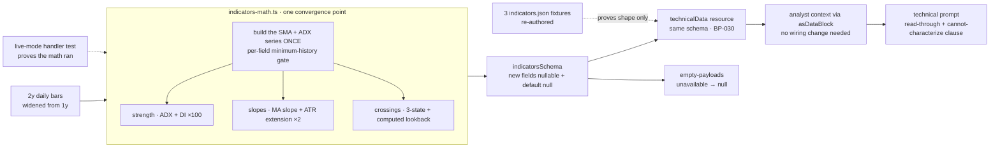

# FIX-826: Trend analysis is shallow — the desk labels the MA stack but can't characterize trend strength, persistence, or inflection — Implementation Spec

## Part I — The Case *(for the human)*

### 1. Problem — why it matters, why now

The desk publishes a trend read that is really a description of two lines.

`trend: "up"` means the last close sits above the 50-day average and the 50-day
sits above the 200-day. That is all it means. It says nothing about whether a
directional trend is actually present, how forceful it is, whether it began last
week or eighteen months ago, or whether it is currently steepening or rolling
over. Every one of those questions — the questions a trend read exists to answer
— is left to the technical analyst to eyeball from a one-month price window, with
nothing computed underneath it.

That is a real gap rather than a cosmetic one, because a bullishly-ordered stack
is a routine condition. It is true of a name grinding sideways with a slight
upward drift and true of a name in a violent, well-established advance, and the
desk reports the same word for both. A reader of the memo — and the trader and PM
reading it downstream — cannot tell those two apart from anything the desk
computed.

**Why now.** Two things. First, [FIX-1063](https://linear.app/fixpoint-labs/issue/FIX-1063)
is landing the data-honesty contract that makes this label *honest* — a trend the
desk could not measure will read as no trend rather than as "flat". That closes
the lie and leaves the shallowness exactly where it was: a *measured* "up" still
only means the averages are stacked. Building depth before that contract lands
would mean building it against a shape that is about to change. Second, the epic
([FIX-1067](https://linear.app/fixpoint-labs/issue/FIX-1067)) explicitly owns this
issue at full scope; the product owner already weighed and rejected both the
"defer it" and the "just add a disclaimer" alternatives, with a standing
guardrail: *characterize the trend, or say plainly that the desk cannot.*

There is no workaround. The numbers do not exist anywhere in the pipeline.

### 2. Solution in plain terms

**The desk computes what it currently asks the model to guess at, and publishes
the existing stack label beside it rather than in place of it.**

- **Is a trend actually there, and how forceful?** A standard trend-strength
  reading (ADX) plus the two directional-pressure components that say which side
  is winning. This is the highest-value addition: it is the industry's canonical
  answer to "is this a trend or is this noise", and it is the one number that
  separates the sideways grinder from the real advance.
- **Which way is it going, and how stretched is it?** The slope of the 50-day and
  200-day averages over a fixed window, and how far price has run from each of
  them measured in the name's own daily range — so "extended" means something
  comparable across a $12 stock and a $900 one.
- **Did anything just turn?** The two moving-average crossings that mark an
  inflection — 50 against 200, and price against the 50-day — each reported with
  **how many sessions ago it happened**. An age is what makes a crossing news
  rather than another way of restating the stack.

**Every one of these reports "not measured" when the history is too short, and
each is gated on its own bar requirement** — a stock with 75 sessions of trading
can have a strength reading and no 200-day slope at all, and the payload says so
per-field rather than collapsing to one all-or-nothing verdict. §9 carries the
exact bar count for every field, so the gates are auditable rather than
aspirational.

**One rule this issue adds that the epic has not needed before: "we looked and
found nothing" is recorded differently from "we could not look."** A crossing
field that is simply absent would be read by the analyst as *there was no
crossing* — a finding the desk never made. So a crossing carries three states,
and when it says "none found" it also says **across how many sessions it
searched**, because "no golden cross" is meaningless without that number.

**Nothing here touches the rating.** The setup score, the valuation envelope, and
the evidence gate are untouched; this is evidence the technical analyst reads,
not a new input to the desk's arithmetic.

**Philosophy** — tenet 1 (coherence): this extends FIX-1063's unobserved-is-null
contract onto the fields it adds, and follows the null-gating shape the desk
already uses in `cross-asset-math.ts` (`trend3`) and `options-math.ts`, rather
than introducing a third convention. Tenet 5 (one convergence point): every new
field's minimum-history gate lives in the one indicator module, next to the gates
already there, rather than as per-consumer checks downstream.

> **§2 then §6 lead, and the rest is derivation.**

### 6. Decisions & rules — the sign-off surface

1. **The existing trend word is kept exactly as it is, and the new read sits
   beside it.**
   *Rejected:* redefining the trend word so a weak strength reading downgrades
   "up" to "flat" — that would silently change the meaning of a figure already
   in every stored report, and would make a name that is genuinely in a mild
   uptrend read as trendless.
   *Locks in:* a reader can see the desk say "the averages are stacked upward"
   and "there is no established trend" in the same memo. That is the honest
   state of the world for a sideways grinder, and it will look like the desk
   contradicting itself to anyone who reads only the one-word label.

2. **The new signals do not enter the rating, the setup score, or the capital
   gates.**
   They are evidence the technical analyst reads and writes up. No number the
   desk already publishes changes value because of this issue.
   *Rejected:* folding trend strength into the momentum component of the setup
   score — the obvious next step, which would change the score, and therefore
   the rating band and the evidence threshold, on **every name in the book** in
   the same release that introduces the signal. That is an unreviewable change
   to a real-money figure.
   *Locks in:* the depth shows up in what the desk *says*, not in what it
   *decides*, until someone deliberately wires it in. If the trend read turns out
   to be the best signal on the desk, we will have to do a second, separate piece
   of work to let it affect anything.

3. **"We looked and found no crossing" and "we could not look" are different
   answers, and the window we searched is published with the first.**
   *Rejected:* one nullable field per crossing, the cheap shape — it collapses
   the two, and the collapse lands on the side that asserts a finding the desk
   never made.
   *Locks in:* the crossing fields are shaped as small objects rather than plain
   values, which is more surface for every future reader to handle. We pay that
   permanently to avoid one specific class of false statement.

4. **Adaptive moving averages are ruled out; the 200-day line gets both a slope
   and a distance-from-price reading.**
   The issue named two gaps. The 200-day one is filled on both axes. The
   adaptive-MA one is declined: the library the desk already uses does not ship
   one, so it would mean hand-rolling smoothing math whose only output is a line
   that answers the same question the strength reading already answers better.
   *Rejected:* hand-rolling KAMA — new unvalidated numeric code carrying real
   money, for a redundant signal.
   *Locks in:* if someone later wants an adaptive MA, they reopen this and argue
   it on its own merits. We are on record that it was considered and declined.

5. **Distance-from-average is computed, not left for the analyst to derive.**
   The raw ingredients (close, the averages, the daily range) are all on the
   payload, so a reviewer will reasonably ask why the desk computes the ratio
   instead of letting the model do one division.
   *Rejected:* leaving it derivable. "The model can do the arithmetic" is exactly
   how a figure ends up transcribed rather than measured — the defect filed as
   [FIX-1115](https://linear.app/fixpoint-labs/issue/FIX-1115), on this same
   memo surface. One computed field removes a model arithmetic step from a
   real-money read.
   *Locks in:* the desk computes derived ratios even when the inputs are visible.
   That is a standing bias toward more deterministic fields, and it will
   occasionally look like redundancy.

6. **The price window the trend math runs on widens from one year to two.**
   With one year of daily bars there are only about fifty days on which both the
   50- and 200-day averages exist, so "no golden cross" could only ever mean "not
   in the last ten weeks."
   *Rejected:* keeping one year and publishing the narrow window honestly — it is
   honest and it is nearly useless.
   *Locks in:* each analysed name pulls roughly twice the price history it does
   today from the data provider. This is one request's worth of payload per run,
   on providers the desk already calls, and no new provider or entitlement.

**Non-goals** — weekly / multi-timeframe confirmation; pattern-structure
detection (Donchian, regression channels, Aroon, breakout geometry — the "Setup"
section stays model-narrated); any change to the setup score, rating envelope,
evidence gate, or reward-to-risk figure (decision 2); any new data provider or
paid entitlement (the epic's standing fence); and re-recording the fixture corpus
beyond the three indicator files this change invalidates. **Two derived signals
are deferred to follow-ups** rather than dropped — see §12.

**Size:** Small–Medium — 5 production files · 3 fixture files re-authored · ~14
test behaviours · 3 doc surfaces · 1 PR.

---

### 3. Tradeoffs & alternatives

**The simpler approach: add ADX and stop.** Genuinely tempting, and it is most of
the value — it is the only one of the three that answers "is there a trend at
all." Rejected because it leaves two of the issue's four named outcomes
untouched: a single strength number is a *level*, and the issue asks for
inflection (did it turn) and trajectory (is it accelerating). Those need the
crossing ages and the slopes, and both are cheap arithmetic over bars already in
memory.

**The alternative the epic PR review raised, and the owner already settled:** a UI
disclaimer on the existing label, no new math. Recorded here for the file — the
product owner kept this issue at full scope and broadened the epic objective to
own it. Not reopened. §12 says what that decision did and did not settle.

**A separate `compute_trend` tool versus widening `compute_indicators`.** The
issue leaves this open; this spec takes the second. A second tool would need its
own provenance tag, its own empty payload, its own fixture file per ticker, its
own slot on the spine, and its own entry in the technical analyst's tool list —
and it would produce two `source` tags for two reads of the same bars, which can
disagree. The bars the trend math needs are already fetched inside
`compute_indicators`. One payload, one provenance, one honesty contract.

**Where the real risk is:** not the indicator math, which is a well-covered
library call plus arithmetic. It is that **the new fields are computed and then
quietly do not arrive.** Three paths lead there and all three are silent — the
checked-in fixtures do not carry the new fields (so every fixture-mode run would
report the depth as unavailable, forever, while the existing smoke check keeps
passing); the live handler could still request one year, or never persist its
output, and fixture mode would never notice because it does not call the math at
all; and an un-updated prompt leaves the numbers in the payload and absent from
the memo. §10 is built around making all three loud, and around the fact that
**the fixture path can only prove the shape — only the live path proves the math
ran.**

**A cost we are accepting:** decision 1 means the memo can carry two trend
statements that a fast reader will call contradictory. The alternative was
worse — one reconciled label that quietly redefines a published figure.

### 4. Focus practices (1–5)

1. **FIX-1063's governing invariant — a verdict field only ever describes work
   that actually happened.** Every field this issue adds is a small verdict about
   a trend, and each one has a distinct minimum history. The invariant is not
   satisfied by making the fields nullable; it is satisfied by each field's null
   meaning *exactly* "not measured", and by "none found" never wearing the same
   representation as "not measured" (decision 3).
2. **BP-030 (tolerate the old shape).** The indicator payload's schema is also
   the persisted shape of the session's technical spine
   (`technicalDataStateSchema` embeds `toolOutputSchemas.compute_indicators`), so
   widening it widens a persisted record. New fields take the established
   `.nullable().default(null)` state shape (BP-023) so a session persisted before
   this lands still parses.
3. **BP-003 (verification evidence).** The baseline is a fixture-mode run that
   passes today; the axis is whether the *computed* trend depth reaches a
   published technical memo. Everything on that path up to the model's own words
   is deterministic and gets gated; only the words themselves are advisory (§10).
4. **BP-035 (second-path checklist).** The second path here is the
   **partial-history** name — enough bars for a strength reading, not enough for
   a 200-day slope. A suite that only covers "long history" and "almost no
   history" proves nothing about the case the per-field gating exists for.

### 5. What using it looks like

Nothing on the framework's public surface changes — this is internal to the
trading-desk lab app. What changes is what the desk's own payload carries and
what the memo can therefore say. *(Field names are the implementer's; the shape
and the reachability of every value are the point. Both payloads below are
checked against §9's bar table.)*

**A name with two years of history (~500 bars), in a real advance:**

```
before  { trend: "up", sma50: 124.8, sma200: 112.3 }

after   { trend: "up", sma50: 124.8, sma200: 112.3,
          adx: { value: 31.4, plusDI: 28.1, minusDI: 12.6 },
          slopes: { sma50Pct20: +6.1, sma200Pct20: +2.4,
                    extensionSma50Atr: 1.8, extensionSma200Atr: 4.6 },
          crossovers: {
            maStack:   { found: true, direction: "bullish", agoBars: 34, lookbackBars: 300 },
            priceMa50: { found: true, direction: "bullish", agoBars: 3,  lookbackBars: 450 } } }
```

The reader now knows the advance is forceful, that the golden cross is seven
weeks old rather than ancient, that price reclaimed its 50-day three sessions
ago, and that price sits four and a half daily ranges above its 200-day. The two
`lookbackBars` differ because the 200-day average only exists from bar 200 while
the 50-day exists from bar 50 — the searched window is computed per crossing, not
shared.

**A name with seventy-five sessions of history** — the case decision 3 and focus
practice 4 exist for:

```
after   { trend: null, sma50: 118.2, sma200: null,
          adx: { value: 18.9, plusDI: 19.2, minusDI: 17.8 },
          slopes: { sma50Pct20: +0.9, sma200Pct20: null,
                    extensionSma50Atr: 0.4, extensionSma200Atr: null },
          crossovers: {
            maStack:   null,
            priceMa50: { found: false, lookbackBars: 25 } } }
```

Four different kinds of absence, all distinguishable and all reachable at exactly
75 bars. `trend` and `sma200` are null because there is no 200-day average
(FIX-1063's contract). `sma200Pct20` and `extensionSma200Atr` are null for the
same reason, one derivation further out. `maStack` is null because the desk
**could not look** for a 50/200 crossing at all. And `priceMa50` says it **did**
look, across twenty-five sessions, and there was none — a weak statement, but a
true one, and the reader can see it is weak because the window is printed.

**What the memo can now say**, where before it could only say "trend: up":

```
before  trend: up
after   trend: up · strength: ADX 18.9 — no established trend (rising 50-day,
        flat tape); 200-day trend not measurable on 75 sessions of history
```

## Part II — The Build Plan *(for the implementing agent)*

### 7. Technical design

Everything lands in one place — the pure indicator math — and travels out through
the schema the payload and the persisted spine already share.



- **`flows/analysis/tools/indicators-math.ts`** holds all the new math, beside the
  existing short-history gates. `IndicatorOutput` widens accordingly. Four traps
  specific to this file, all verified in source:
  - **Build the series once.** Crossings and slopes need *time series*, not point
    values, and every existing helper in this file walks all bars and returns
    only the last value (`kdj()` already re-runs `stochastic()` for this reason).
    Compute the SMA-50, SMA-200 and ADX series in a single pass, scan backward
    from the end for the crossings, and read the slopes off the same arrays. Do
    **not** call the point helpers once per field — that is a walk per field over
    ~500 bars, and it is the shape the file already regrets.
  - **`ADX.getRequiredInputs()` returns `interval * 2 - 1`** (read in the package
    source — 27 bars at the conventional interval 14). Gate on the indicator's
    own required-input contract, not a hand-copied constant.
  - **`.pdi` and `.mdi` are on a different scale from `.value`.** In
    `trading-signals@7.4.3`, `DX.update()` computes
    `pdi = smoothedDM⁺ / ATR` and `mdi = smoothedDM⁻ / ATR` as **raw ratios**,
    and multiplies only its own result by 100 (`dmDiff / dmSum * 100`), which is
    what ADX then smooths. So `adx.value` arrives on 0–100 while the two
    directional components arrive on roughly 0–1. **Multiply both by 100** to
    publish them on the conventional DI scale. This is the nastiest trap here
    because the block looks correct: a reviewer eyeballing `value` sees a sane
    number and concludes the whole object is fine.
  - **`.pdi` / `.mdi` are typed `number | void`** and are `undefined` before the
    indicator stabilises. The file's existing `finite()` helper coerces a
    non-finite input to a number, so routing them through it would turn "not yet
    measured" into `0` — the exact defect this epic exists to remove. They need
    absence-aware handling, not `finite()`. Same shape as FIX-1063's warning
    about reusing the `!== 0` helpers on the fundamentals adapters: **an existing
    idiom in this file is wrong for this new caller.**

  For the null-gating shape itself, follow the two in-repo precedents rather than
  inventing one: `tools/data/cross-asset-math.ts`'s `trend3` (returns `null` when
  either endpoint is missing, and has a deadband so a reported "flat" is a
  *measured* flat rather than a fallback — exactly what the slopes need), and
  `tools/data/options-math.ts`, whose header states the rule outright: "Every
  function returns `null` on insufficient data."
- **`flows/analysis/tools/schemas.ts`** — `indicatorsSchema` grows the three
  blocks. This is a **handler** output schema and is deliberately absent from the
  strict walker (verified: `test/output-schemas-strict.spec.ts`'s `cases` list
  carries `secFilings`, `analystEstimates`, `earningsTranscript`, and
  `discoveryPayload` from this module and no others), so BP-016 does not bind and
  `.nullable().default(null)` is permitted — and required, per BP-023, because
  the same schema is the persisted spine state.
- **`flows/analysis/tools/empty-payloads.ts`** — the `compute_indicators` builder
  emits null for every new field, matching what FIX-1063 leaves the existing ones.
- **`flows/analysis/tools/data/compute_indicators.ts`** — the internal price fetch
  widens from `range: "1y"` to `"2y"` (decision 6). Both providers already map it:
  `rangeToLookbackDays` in `lib/providers/yahoo.ts` and `lib/providers/finnhub.ts`
  each carry a `case "2y": return 750`. The fetch is args-keyed on the process
  cache, so the new key does not collide with the technical analyst's own `1mo`
  fetch or with `get_factor_ranks`' window — no shared-cache hazard, and no second
  request beyond the one this replaces.
- **`agents/analysts/prompts/technical.prompt.md`** — the `<data>` inventory, a
  new `metrics` key for the strength read, the "Setup" and "Momentum" section
  guidance, and **the clause carrying the owner's guardrail**: when the strength
  read is null the analyst states plainly that the desk could not characterize the
  trend, and never narrates strength from the stack label alone. Also: a
  `found: false` crossing means *searched, none found within N sessions*, and must
  never be written up as "no crossover" without the window.
- **No wiring change in `agents/analysts/analysts.ts`.** The technical analyst
  already receives the whole indicators payload through `asDataBlock`
  (`flows/analysis/lib/helpers.ts`), which JSON-stringifies it wholesale, so a
  widened schema flows through untouched. The prompt is the only analyst-side edit.
- **No `run-artifacts.ts` change** — see §10 for why the verification plumbing an
  earlier draft added turned out to have no consumer.

**No solution sketch and no POC.** The composition is not novel — this widens an
existing payload through a schema that already has the exact nullable shape
FIX-1063 is establishing, and every mechanism claim above was read in source
rather than argued.

### 8. Implementation sequence

One PR. The schema widening and its producers do not compile apart, and the
prompt and fixture work is meaningless without them.

1. **Widen `indicatorsSchema`** with the three new blocks, nullable with a null
   default. Nothing produces them yet.
   *Test:* the schema accepts a payload omitting every new field (the legacy /
   pre-fix record) and reads it back as null; and rejects a wrong type.
   *Depends on:* FIX-1063's contract PR having landed — this widens the same
   object and inherits its nullability convention.
2. **Null the new fields in the `compute_indicators` empty-payload builder.**
   *Test:* an unavailable indicator payload carries null, never zero and never a
   `found: false` crossing — the desk did not search anything.
   *Depends on:* 1.
3. **Build the shared series pass** — SMA-50, SMA-200 and ADX as arrays over the
   bar range, in one walk. Everything in steps 4–6 reads off these.
   *Depends on:* 1.
4. **Build the strength read**, gated on the indicator's own required-input
   contract, with the ×100 scaling and absence-aware handling of the two
   directional components (§7). *Test:* the §10 strength behaviours, including
   magnitude and the below-warm-up case. *Depends on:* 3.
5. **Build the slopes and the two extensions**, each gated on its own bar
   requirement independently (§9's table). *Test:* the partial-history behaviour
   — a 50-day slope present while the 200-day slope and 200-day extension are
   null. *Depends on:* 3.
6. **Build the crossing scan** for the two moving-average crossings, with the
   three-state result and a **computed** lookback window. The window is the number
   of bars on which both legs exist minus one, per crossing — it is published, so
   it must be derived, not assumed, and the two crossings do not share a value.
   *Test:* the §10 crossing behaviours, all three states. *Depends on:* 3.
7. **Widen the internal price fetch to two years** (decision 6). *Test:* the
   live-mode handler test in §10 asserts the requested range. *Depends on:* 6.
8. **Re-author the three checked-in `indicators.json` fixtures** (NVDA, AAPL,
   JPM) with hand-computed new-field values consistent with each ticker's
   existing recorded figures, **and add the guard test** that fails when a schema
   field has no counterpart in a checked-in fixture. Without this, every
   fixture-mode run reports the depth unavailable and nothing complains.
   *Depends on:* 1.
9. **Update the technical analyst prompt** — inventory, metrics key, section
   guidance, and the cannot-characterize clause. *Depends on:* 1.
10. **Remove** the stale claims in `indicators-math.ts`'s module header — it
    currently advertises that routines "return finite numbers" and fall back to
    "`0` (or the neutral baseline)". FIX-1063 makes the first false and the
    second wrong; this issue's fields make it wronger. Leaving it is how the next
    contributor reintroduces the zero (BP-034). *Depends on:* 4–6.

### 9. Edge cases & error handling

**Minimum bars per field.** Every gate is independent; this table is the contract
and every row is asserted in §10. Derived from the gates actually in the code
(`SMA` needs `period`; `ATR` needs `period + 1`; `ADX` needs `interval * 2 - 1`)
plus the slope lookback of 20 sessions.

| Field | Minimum bars | Why |
|---|---|---|
| `adx.value` / `plusDI` / `minusDI` | 27 | `interval * 2 - 1` at interval 14. All three gate together — no inner partial-null inside the block |
| `slopes.sma50Pct20` | 70 | 50 for the first SMA-50, plus a 20-session lookback |
| `slopes.sma200Pct20` | 220 | 200 for the first SMA-200, plus the same lookback |
| `slopes.extensionSma50Atr` | 50 | SMA-50 at 50; ATR-14 stabilises earlier, at 15 |
| `slopes.extensionSma200Atr` | 200 | SMA-200 at 200 |
| `crossovers.priceMa50` | 51 | two consecutive bars on which SMA-50 exists |
| `crossovers.maStack` | 201 | two consecutive bars on which both averages exist |

`lookbackBars` for a crossing is *observations − 1* — 500 bars gives 450 for
`priceMa50` and 300 for `maStack`. They are not equal and must not be computed
from one shared number.

| Case | Expected |
|---|---|
| Fewer bars than a field's minimum | That field null. Not a zero, and not a "weak trend" reading — 0 on the ADX scale is a *meaningful* value meaning no directional pressure, and asserting it from insufficient data is the epic's central defect |
| The library's `+DI` / `−DI` read as `undefined` before stability | Handled as absence. **Must not** pass through the file's `finite()` helper, which would produce `0` (§7) |
| The directional components after stability | Published `× 100`. A `plusDI` of `0.281` reaching the payload unscaled is the failure this looks like when it happens (§7) |
| 75 bars — SMA-50 but no SMA-200 | Strength, 50-day slope and 50-day extension present; 200-day slope, 200-day extension and `maStack` all null. The BP-035 second path, and the exact §5 example |
| A long history with genuinely no crossing in the window | `{ found: false, lookbackBars: N }` — a real finding, distinct from null, and only interpretable because N is published (decision 3) |
| A crossing on the most recent bar | `agoBars: 0`. Zero here is a real measurement, not an absence — the mirror of the epic's usual trap, and the reason a bare falsy check is wrong |
| A flat series where the two averages are exactly equal | No crossing recorded. A touch is not a cross; the scan keys on a sign change, and equality is not a sign change in either direction |
| The price provider returns no bars (`source: "unavailable"`) | Every new field null, via the empty-payload builder |
| A session persisted before this lands, re-read | Parses; new fields read null (BP-030 via `.nullable().default(null)`). Reads as "not measured", which is true of that run |
| A checked-in fixture without the new fields | **Silently** yields nulls — handler output schemas are not validated at runtime (`OutputValidationError` is thrown only from `packages/core/src/blocks/generator.ts`; no handler-output validation exists in `packages/engine/src`), and `JSON.stringify` drops an `undefined` key entirely, so the field would not even appear in the analyst's `<data>` block. Hence step 8's guard test rather than trusting the schema |
| The strength read says no trend while the stack label says "up" | Both published; the prompt tells the analyst to report the conflict as the finding it is. Decision 1's accepted cost |
| Analyst prompts | They read the raw payload as pretty-printed JSON (`asDataBlock`), so `null` renders as `null` and the nested objects self-describe. No formatter change |

**Taxonomy:** no new error path. Every case degrades to "not measured", which the
desk's prompts and formatters already handle.

### 10. Testing strategy

**Baseline and axis.** The baseline is the existing
`goals/trading-desk-headless/fixture-run-clean` NVDA run, which passes today and
must keep passing as the regression guard — unchanged, still `runSummary`-based,
so the `verify-trading-desk` skill needs no update. The axis *this* issue is
judged on is different: **whether the computed trend depth reaches a published
technical memo.**

**The path to the memo has four segments, and three of them are deterministic.**
An earlier draft gated only on the computed values and left the entire
user-visible outcome advisory, which meant the memo could carry none of this and
the implementation still passed. The fix is not to gate the model's words — that
genuinely cannot be done, since `metrics` is LLM-authored (`thesisOutputSchema`)
and a correct implementation could fail it on a model's whim. The fix is to gate
**everything up to** the words:

| Segment | Gated? | How |
|---|---|---|
| 1 · The math runs, on the real handler path, with the right window | **Yes** | Live-mode handler test (below) |
| 2 · The computed fields reach the analyst's context | **Yes** | Assert the rendered `asDataBlock` context for the technical analyst contains the new keys with non-null values, from a spine payload |
| 3 · The prompt instructs the analyst to read them | **Yes** | Assert the checked-in `technical.prompt.md` references the new fields and carries the cannot-characterize clause |
| 4 · The model writes them into the memo | **No — advisory** | Observed on a real fixture-mode run and reported as run quality; never a pass criterion |

Segments 2 and 3 are the ones that were missing. If the prompt is never updated,
or the fields never reach the context, the memo *cannot* carry the read — and
both are deterministically detectable from checked-in artifacts with no plumbing
and no model.

**The fixture path proves the shape; only the live path proves the math ran.** In
fixture mode `compute_indicators` loads `fixtures/{TICKER}/{DATE}/indicators.json`
and never calls `computeIndicators` at all (the `pickMode(ctx) === "fixture"`
branch). So a fixture run would pass even if the live handler still requested one
year, or never persisted its output. Segment 1 therefore needs a **live-mode
handler test**: mock the provider module (the established pattern —
`test/yahoo-company-profile-validation.spec.ts` does exactly this with
`vi.mock("yahoo-finance2")`), drive the handler in live mode over an authored bar
series, and assert both that **the price request carried `range: "2y"`** and that
**the computed fields landed on the `technicalData` spine**.

Separately, the `prices.json` fixtures hold **21 bars for NVDA and 11 each for
AAPL and JPM** at range `1mo` — nowhere near enough for any of this even if they
were used. The three `indicators.json` files must be re-authored (step 8), and
the guard test that fails when a schema field has no fixture counterpart is the
durable fix for that class rather than for this instance.

**No `runArtifacts` wiring is needed, and this was checked rather than assumed.**
An earlier draft added an indicators slice to the bundle so a goal check could
read the computed values. `technicalData` is a session resource registered on the
flow, but **no action projects it** — `run-artifacts-action.ts` reads six
resources and `technicalData` is not among them, and its own header notes the
NDJSON stream drops resource values, so a goal check cannot reach the spine
today. That made the wiring *necessary for the goal check* but ~2 production
files of pure verification plumbing. Once segments 1–3 above are gated in vitest,
the goal check no longer needs to read the computed values at all, so the
plumbing has no consumer and is dropped.

**CI specs** (behaviours, not test names):

- **Strength, and its magnitude:** below warm-up → the whole block null; past it
  on a strongly trending authored series → a value in the strong band with the
  correct directional component dominant, **and both DI components asserted on
  the 0–100 scale, not merely non-null.** A test that only checks presence passes
  against the unscaled ~0.28 defect.
- **The `undefined` directional components specifically** — a series stopped one
  bar before stability yields null components, **not zero**. This is the one a
  naive `finite()` call fails, and it must fail before the fix.
- **Slopes and extensions, independently gated:** an authored 75-bar series
  yields a 50-day slope and 50-day extension, and a null 200-day slope and null
  200-day extension. Assert all four in one test so the pair cannot drift.
- **Every row of §9's bar table**, at its boundary and one bar below it.
- **Extension is range-normalized:** two series identical in shape but an order of
  magnitude apart in price produce the same extension figure. This is what the
  ATR normalization is *for*, and a plain percentage would pass a weaker test.
- **Crossings, all three states, per crossing type:** found with a correct
  `agoBars`; searched-and-none-found with a published window; not-searchable as
  null. Assert `agoBars: 0` on a same-bar crossing survives (the real-zero trap).
- **Equality is not a crossing:** a series where the two averages touch and
  separate the same way records nothing.
- **The two lookback windows differ** on the same series, and each is computed
  from its own leg (500 bars → 450 and 300).
- **The empty payload:** every new field null, and no crossing reporting
  `found: false`.
- **Legacy tolerance (BP-030):** an indicators object serialized without any new
  field parses and reads null throughout.
- **The fixture guard**, and segments 2 and 3 above.

**Discipline:** `tdd`. Every seam is a pure function or a mockable handler
reachable from vitest; extend `test/indicators-math.spec.ts` rather than adding a
parallel suite. Note that suite's existing assertions encode the *old* contract
(`expect(out.trend).toBe("flat")` on a 5-bar series, `rsi(...)` returning `0`) —
FIX-1063 rewrites those, and this issue must not re-assert them.

### 11. Documentation plan

- **EXTEND** `labs/trading-desk/CLAUDE.md` — its layout section lists
  `indicators-math.ts` as "pure RSI/MACD/ATR/SMA functions". Add a short paragraph
  naming the trend-depth block, the per-field minimum-history rule, and the
  three-state crossing convention (decision 3), since that convention is the one a
  future contributor is most likely to flatten back to a nullable value. Also note
  the two-year internal window so nobody "optimizes" it back.
- **EXTEND** `labs/trading-desk/README.md` — it still describes
  `compute_indicators` as the RSI/MACD/ATR/SMA set. Same correction, kept terse;
  BP-009 parity with `CLAUDE.md`.
- **EXTEND** the technical analyst prompt's contract (step 9) — it is the read
  surface for everything this issue computes, and an unchanged prompt is one of
  the three silent-failure paths in §3.
- **EDIT** `indicators-math.ts`'s module header (step 10) — it currently states
  the opposite of what the file will do. Provenance, BP-034.
- **No `verify-trading-desk` skill change.** §10 gates on vitest specs and leaves
  the existing `runSummary`-based goal check untouched, so nothing the skill
  documents moves. Had §10 gated on `runArtifacts`, the skill would have needed
  updating in the same PR — it documents `runSummary` only.
- **No `apps/docs` change.** The trading desk is a lab application; nothing on the
  `@flow-state-dev/*` public surface changes.
- **No `docs/architecture/*` change.** No locked framework contract moves.
- **Changeset:** internal-only (`--empty`) per BP-022.

### 12. Dependencies, open questions & follow-ups

**Blocking dependency — [FIX-1063](https://linear.app/fixpoint-labs/issue/FIX-1063)
must land first.** Its data-honesty contract (owner-approved on spec PR #1167 at
`f53195e79351441aa28bed9b6774ae686a7e1d3f`, implementation in flight on
`fix/FIX-1063`) changes the exact schema and semantics this issue extends:
`indicatorsSchema`'s numeric fields become nullable and `trend` widens from a
three-value enum to nullable. Building against the current contract would either
preserve the fabricated zeros or be rebuilt. Recorded as a blocking relation on
the Linear issue; not to be routed around.

**What the owner's full-scope decision settled, and what it did not.** The
product owner's "keep FIX-826 at full scope" was taken when the alternative on
the table was descoping to a UI disclaimer with no new math. It settled **whether
the desk does real trend analysis — yes, fully**, and that is not reopened here.
**Which derived fields ship in the first PR is implementation scope**, owned by
engineering, and two signals are deferred on that basis below. A reviewer reading
the deferrals as a re-litigation of the owner's decision has the wrong frame.

**Where this issue touches its siblings' files — name these in the PR:**

| File | This issue | Sibling |
|---|---|---|
| `tools/schemas.ts` | adds three blocks to `indicatorsSchema` | FIX-1063 widens the same schema's existing fields; FIX-1064 edits the *income-statement* schema in the same file |
| `tools/indicators-math.ts` | the new math; header cleanup | FIX-1063 nulls every short-history short-circuit and `trendLabel` here |
| `tools/empty-payloads.ts` | new fields null | FIX-1063 nulls the existing fields in the same builder |
| `test/indicators-math.spec.ts` | new behaviours | FIX-1063 rewrites the existing zero/flat assertions |

`flows/analysis/lib/valuation.ts`, the statement mappers, and `lib/setup-score.ts`
are **not touched** — that neighbourhood is FIX-1063's and FIX-1064's, and
decision 2 is what keeps this issue out of it. FIX-1063 is rewriting
`setup-score.ts`'s momentum component right now; a third spec editing the same
block is how a merge conflict arrives disguised as a design disagreement.
`run-artifacts.ts` was in an earlier draft and is no longer touched (§10), which
also removes a collision with FIX-1063's honesty flag.

**Open questions:** none. Three things a reader might expect to be open are
settled instead: whether trend depth gets its own tool (**no** — §3), whether the
new signals feed the setup score (**no** — decision 2), and whether an adaptive MA
ships (**no** — decision 4).

**Follow-ups.** A spec PR never merges, so a follow-up recorded only here does not
survive the start of implementation. The ones that stand independently of this
review are filed; the ones conditional on a decision still under review are not.

- **FILED — [FIX-1115](https://linear.app/fixpoint-labs/issue/FIX-1115): analyst
  memo headline figures are model-transcribed, not derived.** Found while speccing
  this issue and deliberately not folded in: it applies to figures this issue does
  not touch, and would put an analyst-specific branch into a writer shared by all
  nine analysts. Decision 5 is the local expression of the same conviction.
- **FILED — [FIX-1116](https://linear.app/fixpoint-labs/issue/FIX-1116): MACD
  crossover age.** Deferred from this issue: MACD line, signal and histogram are
  already computed, already published, and already narrated by the technical
  prompt, so a computed crossover age is incremental — and it forces a second full
  MACD walk, since the helper returns terminal values only. `maStack` and
  `priceMa50` carry the inflection outcome the issue named.
- **FILED — [FIX-1117](https://linear.app/fixpoint-labs/issue/FIX-1117): ADX
  acceleration.** Deferred: a second acceleration signal beside the slopes and DI
  dominance, and it would introduce an inner partial-null inside an
  already-gated block (value present at the warm-up boundary, the change reading
  still null). Revisit if memo quality shows level-plus-slopes is insufficient.
- **NOT FILED, conditional on decision 2 surviving review — wiring trend strength
  into the setup score.** File at implementation time if decision 2 holds. It is a
  change to a real-money figure across every name and needs its own before/after
  evidence on the existing corpus.
- **NOT FILED, conditional on decision 6 — weekly / multi-timeframe confirmation.**
  Resampling the two-year daily series to weekly is roughly ten lines and yields
  enough bars for a weekly strength read; it is only cheap if the two-year window
  ships. The cost is the interpretation contract, not the resampling — the desk
  would publish two trend verdicts that can disagree, and decision 1 already
  spends the reader's tolerance for that once.

---

## Spec evolution

- **Spec drafted** — framed as *shallow*, not *dishonest*: FIX-1063 is already
  making the trend label honest, and this issue puts something underneath it.
  Kept the published trend word untouched, held the new signals out of the rating
  path, and gave crossings a three-state shape so "found nothing" cannot be read
  as "could not look".
- **After spec review (round 1)** — the design held; the artifact had five
  factual defects and was over-scoped. Corrected: the directional components ship
  `× 100` (the library stores them as raw ratios and scales only ADX, so the
  payload would have published `0.281` for `28.1`); the partial-history example
  moved from 60 to 75 bars, because a 20-session slope of a 50-day average cannot
  exist before bar 70 — the example mandated a value that could not occur, and
  §9 now carries a per-field bar table so that class cannot recur; decision 4's
  promise of 200-day "slope and distance" gained the distance reading it named.
  §10 was rewritten once rather than patched: the deterministic segments of the
  path to the memo are now gated (context and prompt), only the model's words are
  advisory, and a live-mode handler test covers what fixture mode structurally
  cannot. Deferred MACD crossover age and ADX acceleration to filed follow-ups,
  and dropped the `runArtifacts` wiring after checking that nothing projects
  `technicalData` — which made it necessary for a goal-check read, and then
  unnecessary once the gating moved into vitest. Kept the computed extension
  against a "the analyst can derive it" objection, and made that reasoning
  decision 5 so it is not re-litigated.
