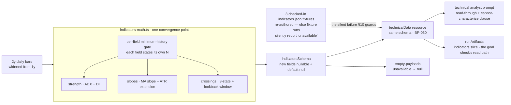

# FIX-826: Trend analysis is shallow — the desk labels the MA stack but can't characterize strength, persistence, or inflection — Implementation Spec

## Part I — The Case *(for the human)*

### 1. Problem — why it matters, why now

The desk publishes a trend read that is really a description of two lines.

`trend: "up"` means the last close sits above the 50-day average and the 50-day
sits above the 200-day. That is all it means. It says nothing about whether a
directional trend is actually present, how forceful it is, whether it began last
week or eighteen months ago, or whether it is currently steepening or rolling
over. Every one of those questions — the questions a trend read exists to answer
— is left to the technical analyst to eyeball from a one-month price window, with
nothing computed underneath it.

That is a real gap rather than a cosmetic one, because a bullishly-ordered stack
is a routine condition. It is true of a name grinding sideways with a slight
upward drift and true of a name in a violent, well-established advance, and the
desk reports the same word for both. A reader of the memo — and the trader and PM
reading it downstream — cannot tell those two apart from anything the desk
computed.

**Why now.** Two things. First, [FIX-1063](https://linear.app/fixpoint-labs/issue/FIX-1063)
is landing the data-honesty contract that makes this label *honest* — a trend the
desk could not measure will read as no trend rather than as "flat". That closes
the lie and leaves the shallowness exactly where it was: a *measured* "up" still
only means the averages are stacked. Building depth before that contract lands
would mean building it against a shape that is about to change. Building it after
is the natural next move on the same field. Second, the epic
([FIX-1067](https://linear.app/fixpoint-labs/issue/FIX-1067)) explicitly owns this
issue at full scope; the product owner already weighed and rejected both the
"defer it" and the "just add a disclaimer" alternatives, with a standing
guardrail: *characterize the trend, or say plainly that the desk cannot.*

There is no workaround. The numbers do not exist anywhere in the pipeline.

### 2. Solution in plain terms

**The desk computes the three things it currently asks the model to guess at, and
publishes the existing stack label beside them rather than in place of them.**

- **Is a trend actually there, and how forceful?** A standard trend-strength
  reading (ADX) plus the two directional-pressure components that say which side
  is winning. This is the single highest-value addition: it is the industry's
  canonical answer to "is this a trend or is this noise", and it is the one
  number that separates the sideways grinder from the real advance.
- **Which way is it going?** The slope of the 50-day and 200-day averages over a
  fixed window, and how far price has stretched from its 50-day measured in the
  name's own daily range — so "extended" means something comparable across a $12
  stock and a $900 one.
- **Did anything just turn?** The three crossings that mark an inflection — 50
  against 200, price against the 50-day, and the MACD line against its signal —
  each reported with **how many sessions ago it happened**. An age is what makes
  a crossing news rather than another way of restating the stack.

**Every one of these reports "not measured" when the history is too short, and
each is gated on its own bar requirement** — a stock with 60 sessions of trading
can have a strength reading and no 200-day slope at all, and the payload says so
per-field rather than collapsing to one all-or-nothing verdict.

**One rule this issue adds that the epic has not needed before: "we looked and
found nothing" is recorded differently from "we could not look."** A crossing
field that is simply absent would be read by the analyst as *there was no
crossing* — a finding the desk never made. So a crossing carries three states,
and when it says "none found" it also says **across how many sessions it
searched**, because "no golden cross" is meaningless without that number.

**Nothing here touches the rating.** The setup score, the valuation envelope, and
the evidence gate are untouched; this is evidence the technical analyst reads,
not a new input to the desk's arithmetic.

**Philosophy** — tenet 1 (coherence): this extends FIX-1063's unobserved-is-null
contract onto the fields it adds, rather than introducing a second convention for
missing signals on the same payload. Tenet 5 (one convergence point): every new
field's minimum-history gate lives in the one indicator module, next to the gates
that already exist there, rather than as per-consumer checks downstream.

> **§2 then §6 lead, and the rest is derivation.**

### 6. Decisions & rules — the sign-off surface

1. **The existing trend word is kept exactly as it is, and the new read sits
   beside it.**
   The desk keeps publishing the moving-average stack label; the strength,
   slope, and crossing reads are new fields alongside it.
   *Rejected:* redefining the trend word so a weak strength reading downgrades
   "up" to "flat" — that would silently change the meaning of a figure already
   in every stored report, and would make a name that is genuinely in a mild
   uptrend read as trendless.
   *Locks in:* a reader can see the desk say "the averages are stacked upward"
   and "there is no established trend" in the same memo. That is the honest
   state of the world for a sideways grinder, and it will look like the desk
   contradicting itself to anyone who reads only the one-word label.

2. **The new signals do not enter the rating, the setup score, or the capital
   gates.**
   They are evidence the technical analyst reads and writes up. No number the
   desk already publishes changes value because of this issue.
   *Rejected:* folding trend strength into the momentum component of the setup
   score — it is the obvious next step, and it would change the score, and
   therefore the rating band and the evidence threshold, on **every name in the
   book** in the same release that introduces the signal. That is an unreviewable
   change to a real-money figure.
   *Locks in:* the depth shows up in what the desk *says*, not in what it
   *decides*, until someone deliberately wires it in. If the trend read turns out
   to be the best signal on the desk, we will have to do a second, separate piece
   of work to let it affect anything.

3. **"We looked and found no crossing" and "we could not look" are different
   answers, and the window we searched is published with the first.**
   *Rejected:* one nullable field per crossing, the cheap shape — it collapses
   the two, and the collapse lands on the side that asserts a finding the desk
   never made.
   *Locks in:* the crossing fields are shaped as small objects rather than plain
   values, which is more surface for every future reader to handle. We pay that
   permanently to avoid one specific class of false statement.

4. **Adaptive moving averages are ruled out; the 200-day line gets slope and
   distance instead.**
   The issue named two gaps. The 200-day one is filled. The adaptive-MA one is
   declined: the library the desk already uses does not ship one, so it would
   mean hand-rolling smoothing math whose only output is a line that answers the
   same question the strength reading already answers better.
   *Rejected:* hand-rolling KAMA — new unvalidated numeric code carrying real
   money, for a redundant signal.
   *Locks in:* if someone later wants an adaptive MA, they reopen this and argue
   it on its own merits. We are on record that it was considered and declined.

5. **The price window the trend math runs on widens from one year to two.**
   With one year of daily bars there are only about fifty days on which both the
   50- and 200-day averages exist, so "no golden cross" could only ever mean "not
   in the last ten weeks."
   *Rejected:* keeping one year and publishing the narrow window honestly — it is
   honest and it is nearly useless.
   *Locks in:* each analysed name pulls roughly twice the price history it does
   today from the data provider. This is one additional request's worth of
   payload per run, on providers the desk already calls, and no new provider or
   entitlement.

**Non-goals** — weekly / multi-timeframe confirmation (deferred by the issue;
§12 says what it would cost); pattern-structure detection (Donchian, regression
channels, Aroon, breakout geometry — the "Setup" section stays model-narrated);
any change to the setup score, rating envelope, evidence gate, or reward-to-risk
figure (decision 2); any new data provider or paid entitlement (the epic's
standing fence); and re-recording the fixture corpus beyond the three indicator
files this change invalidates.

**Size:** Medium — ~6 production files · 3 fixture files re-authored · ~13 test
behaviours · 2 doc surfaces (`labs/trading-desk/CLAUDE.md`, the technical
analyst's prompt contract; no `apps/docs` change — see §11) · 1 PR.

---

### 3. Tradeoffs & alternatives

**The simpler approach: add ADX and stop.** Genuinely tempting, and it is most of
the value — it is the only one of the three that answers "is there a trend at
all." Rejected because it leaves two of the issue's four named outcomes
untouched: a single strength number is a *level*, and the issue asks for
inflection (did it turn) and trajectory (is it accelerating). Those need the
crossing ages and the slopes, and both are cheap arithmetic over bars already in
memory. The expensive part of this issue is not the math; it is the honesty
plumbing, and that cost is paid once whether one field ships or six.

**The alternative the epic PR review raised, and the owner already settled:** a UI
disclaimer on the existing label, no new math. Recorded here for the file — the
product owner kept this issue at full scope and broadened the epic objective to
own it. Not reopened.

**A separate `compute_trend` tool versus widening `compute_indicators`.** The
issue leaves this open; this spec takes the second. A second tool would need its
own provenance tag, its own empty payload, its own fixture file per ticker, its
own slot on the spine, and its own entry in the technical analyst's tool list —
and it would produce two `source` tags for two reads of the same bars, which can
disagree. The bars the trend math needs are already fetched inside
`compute_indicators`. One payload, one provenance, one honesty contract.

**Where the real risk is:** not the indicator math, which is a well-covered
library call plus arithmetic. It is that **the new fields are computed and then
quietly do not arrive.** Two paths lead there and both are silent — the
checked-in fixtures do not carry the new fields (so every fixture-mode run would
report the depth as unavailable, forever, and the existing goal check would keep
passing), and a prompt that is not updated leaves the numbers in the payload and
absent from the memo. §10 is built around making both of those loud.

**A cost we are accepting:** decision 1 means the memo can carry two trend
statements that a fast reader will call contradictory. The alternative was
worse — one reconciled label that quietly redefines a published figure.

### 4. Focus practices (1–5)

1. **FIX-1063's governing invariant — a verdict field only ever describes work
   that actually happened.** Every field this issue adds is a small verdict about
   a trend, and each one has a distinct minimum history. The invariant is not
   satisfied by making the fields nullable; it is satisfied by each field's null
   meaning *exactly* "not measured", and by "none found" never wearing the same
   representation as "not measured" (decision 3).
2. **BP-030 (tolerate the old shape).** The indicator payload's schema is also
   the persisted shape of the session's technical spine
   (`technicalDataStateSchema` embeds `toolOutputSchemas.compute_indicators`), so
   widening it widens a persisted record. New fields take the established
   `.nullable().default(null)` state shape (BP-023) so a session persisted before
   this lands still parses.
3. **BP-003 (verification evidence).** The baseline is a fixture-mode run that
   passes today; the axis is whether the *computed* trend depth reaches a
   published technical memo. A criterion that only reads the memo's text proves
   the model wrote something, not that the desk measured anything — §10 keeps
   those two apart and labels which is which.
4. **BP-035 (second-path checklist).** The second path here is the
   **partial-history** name — enough bars for a strength reading, not enough for
   a 200-day slope. A test suite that only covers "long history" and "almost no
   history" proves nothing about the case this issue's per-field gating exists
   for.

### 5. What using it looks like

Nothing on the framework's public surface changes — this is internal to the
trading-desk lab app. What changes is what the desk's own payload carries and
what the memo can therefore say.

**A name with two years of history, in a real advance** *(field names are the
implementer's; the shape is the point)*:

```
before  { trend: "up", sma50: 124.8, sma200: 112.3 }

after   { trend: "up", sma50: 124.8, sma200: 112.3,
          adx: { value: 31.4, plusDI: 28.1, minusDI: 12.6, change5: +4.2 },
          slopes: { sma50Pct20: +6.1, sma200Pct20: +2.4, extensionAtr: 1.8 },
          crossovers: {
            maStack:    { found: true,  direction: "bullish", agoBars: 34, lookbackBars: 300 },
            priceMa50:  { found: true,  direction: "bullish", agoBars: 3,  lookbackBars: 450 },
            macdSignal: { found: false,                                    lookbackBars: 450 } } }
```

The reader now knows the advance is forceful and strengthening, that the golden
cross is seven weeks old rather than ancient, that price has just reclaimed its
50-day three sessions ago, and that MACD has not crossed in the searched window.

**A name with sixty sessions of history** — the case decision 3 and focus
practice 4 exist for:

```
after   { trend: null, sma50: 118.2, sma200: null,
          adx: { value: 18.9, plusDI: 19.2, minusDI: 17.8, change5: -1.1 },
          slopes: { sma50Pct20: +0.9, sma200Pct20: null, extensionAtr: 0.4 },
          crossovers: {
            maStack:    null,
            priceMa50:  { found: false, lookbackBars: 10 },
            macdSignal: { found: true, direction: "bearish", agoBars: 6, lookbackBars: 25 } } }
```

Three different kinds of absence, all distinguishable. `trend` and `sma200` are
null because there is no 200-day average (FIX-1063's contract). `maStack` is null
because the desk **could not look** for a 50/200 crossing at all. `priceMa50`
says it **did** look, across ten sessions, and there was none — a weak statement,
but a true one, and the reader can see it is weak because the window is printed.

**What the memo can now say**, where before it could only say "trend: up":

```
before  trend: up
after   trend: up · strength: ADX 18.9 — no established trend (rising 50-day,
        flat tape); 200-day trend not measurable on 60 sessions of history
```

## Part II — The Build Plan *(for the implementing agent)*

### 7. Technical design

Everything lands in one place — the pure indicator math — and travels out through
the schema the payload and the persisted spine already share.



- **`flows/analysis/tools/indicators-math.ts`** is where all the new math lives,
  beside the existing short-history gates. Three additions: a strength read built
  on the library's `ADX` (verified present in `trading-signals@7.4.3`, exposing
  `.pdi` / `.mdi` getters), the two moving-average slopes plus the ATR-normalized
  extension, and the crossing scan. **`IndicatorOutput` widens accordingly.**
  Two traps specific to this file:
  - `ADX.getRequiredInputs()` returns `interval * 2 - 1` (read in the package
    source — 27 bars at the conventional interval 14). Gate on the indicator's
    own `isStable` / required-input contract, not on a hand-copied constant.
  - **`.pdi` and `.mdi` are typed `number | void`** and are `undefined` before
    the indicator stabilises. The file's existing `finite()` helper coerces a
    non-finite input to a number, so routing them through it would turn "not yet
    measured" into a value — the exact defect this epic exists to remove. They
    need absence-aware handling, not `finite()`. This is the same shape as
    FIX-1063's warning about reusing the `!== 0` nullable helpers on the
    fundamentals adapters: **an existing idiom in this file is wrong for this new
    caller.**
- **`flows/analysis/tools/schemas.ts`** — `indicatorsSchema` grows the three
  blocks. This schema is a **handler** output schema and is deliberately absent
  from the strict walker (verified: `test/output-schemas-strict.spec.ts`'s
  `cases` list carries `secFilings`, `analystEstimates`, `earningsTranscript`,
  and `discoveryPayload` from this module and no others), so BP-016 does not bind
  and `.nullable().default(null)` is permitted — and required, per BP-023, because
  the same schema is the persisted spine state.
- **`flows/analysis/tools/empty-payloads.ts`** — the `compute_indicators` builder
  emits null for every new field, matching what FIX-1063 leaves the existing ones.
- **`flows/analysis/tools/data/compute_indicators.ts`** — the internal price fetch
  widens from `range: "1y"` to `"2y"` (decision 5). Both providers already map it:
  `rangeToLookbackDays` in `lib/providers/yahoo.ts` and `lib/providers/finnhub.ts`
  each carry a `case "2y": return 750`. The fetch is args-keyed on the process
  cache, so the new key simply does not collide with the technical analyst's own
  `1mo` fetch or with `get_factor_ranks`' window — no shared-cache hazard, and no
  second request beyond the one this replaces.
- **`agents/analysts/prompts/technical.prompt.md`** — the `<data>` inventory, a
  new `metrics` key for the strength read, the "Setup" and "Momentum" section
  guidance, and **the clause that carries the owner's guardrail**: when the
  strength read is null the analyst states plainly that the desk could not
  characterize the trend, and never narrates strength from the stack label alone.
  Also: a `found: false` crossing means *searched, none found within N sessions*,
  and must never be written up as "no crossover" without the window.
- **`flows/analysis/run-artifacts.ts`** plus
  **`orchestration/run-artifacts-action.ts`** — one additive nullable field
  carrying the indicators slice, and the matching `technicalData` entry on the
  action's `resources` map (it already reads five resources this way; the field
  is inert without the read). This is what makes §10's goal check able to assert
  on the **computed** value rather than on model prose. Read-only, zero model
  spend.

**No solution sketch and no POC.** The composition is not novel — this widens an
existing payload through a schema that already has the exact nullable shape
FIX-1063 is establishing, and the two claims worth checking were checked directly
in source rather than argued: the library's ADX support and its stability contract
(`trading-signals@7.4.3` `dist/index.d.mts` and `index.mjs`), and the two-year
range being already mapped by both providers. The one genuinely uncertain thing —
whether the fixture corpus can exercise the path — was also checked, and the
answer is no; §10 says what has to be authored instead of assuming.

### 8. Implementation sequence

One PR. The schema widening and its producers do not compile apart, and the
prompt and fixture work is meaningless without them.

1. **Widen `indicatorsSchema`** with the three new blocks, nullable with a null
   default. Nothing produces them yet.
   *Test:* the schema accepts a payload omitting every new field (the legacy /
   pre-fix record) and reads it back as null; and rejects a wrong type.
   *Depends on:* FIX-1063's contract PR having landed — this widens the same
   object and inherits its nullability convention.
2. **Null the new fields in the `compute_indicators` empty-payload builder.**
   *Test:* an unavailable indicator payload carries null, never zero and never a
   `found: false` crossing — the desk did not search anything.
   *Depends on:* 1.
3. **Build the strength read** in `indicators-math.ts`, gated on the indicator's
   own required-input contract, with absence-aware handling of the two
   directional components (§7). *Test:* the §10 strength behaviours, including
   the below-warm-up case. *Depends on:* 1.
4. **Build the slopes and the extension**, each gated on its own bar requirement
   independently. *Test:* the partial-history behaviour — a 50-day slope present
   while the 200-day slope is null. *Depends on:* 1.
5. **Build the crossing scan** with the three-state result and the published
   lookback window. The window for each crossing is *the number of bars on which
   both legs exist*, not the bar count — this is the number that gets published,
   so it must be computed, not assumed. *Test:* the §10 crossing behaviours, all
   three states. *Depends on:* 1.
6. **Widen the internal price fetch to two years** (decision 5). *Test:* covered
   by 5's window assertions — a 2y series yields a materially wider `maStack`
   window than a 1y one. *Depends on:* 5.
7. **Re-author the three checked-in `indicators.json` fixtures** (NVDA, AAPL,
   JPM) with hand-computed new-field values consistent with each ticker's
   existing recorded figures, **and add the guard test** that fails when a
   schema field has no counterpart in a checked-in fixture. Without step 7 every
   fixture-mode run reports the depth as unavailable and nothing complains — see
   §10. *Depends on:* 1.
8. **Update the technical analyst prompt** — inventory, metrics key, section
   guidance, and the cannot-characterize clause. *Depends on:* 1.
9. **Add the indicators slice to `run-artifacts.ts`** and the `technicalData`
   entry to `orchestration/run-artifacts-action.ts`'s `resources` map.
   *Test:* the bundle carries the slice on a completed run and null on a run that
   stopped before Phase 1 — assert on the bundle, not on the resource, since the
   missing `resources` entry is exactly the silent half. *Depends on:* 1.
10. **Remove** the stale claims in `indicators-math.ts`'s module header — it
    currently advertises that routines "return finite numbers" and fall back to
    "`0` (or the neutral baseline)". FIX-1063 makes the first false and the
    second wrong; this issue's fields make it wronger. Leaving it is how the next
    contributor reintroduces the zero (BP-034). *Depends on:* 3–5.

### 9. Edge cases & error handling

| Case | Expected |
|---|---|
| Fewer bars than the strength indicator's warm-up (27 at interval 14) | The whole strength block is null. Not a zero, and not a "weak trend" reading — 0 on this scale is a *meaningful* value meaning no directional pressure, and asserting it from insufficient data is the epic's central defect. |
| Exactly at the warm-up boundary | The strength value is present; its 5-session change is still null (it needs five further bars). Per-field gating, not block-level. |
| The library's `+DI` / `−DI` read as `undefined` before stability | Handled as absence. **Must not** pass through the file's `finite()` helper, which would produce `0` (§7). |
| 50–199 bars — a 50-day average but no 200-day | `sma200`-derived slope null, `maStack` crossing null (could not look), strength and 50-day slope present. The partial-history second path (BP-035). |
| A name with a long history and genuinely no crossing in the window | `{ found: false, lookbackBars: N }` — a real finding, distinct from null, and only interpretable because N is published (decision 3). |
| A crossing on the most recent bar | `agoBars: 0`. Zero here is a real measurement, not an absence — the mirror of the epic's usual trap, and the reason a bare falsy check is wrong. |
| A flat series where the two averages are exactly equal | No crossing recorded. A touch is not a cross; the scan keys on a sign change, and equality is not a sign change in either direction. |
| The price provider returns no bars (`source: "unavailable"`) | Every new field null, via the empty-payload builder. The provenance tag already says why. |
| A session persisted before this lands, re-read | Parses; new fields read null (BP-030 via `.nullable().default(null)`). Reads as "not measured", which is true of that run. |
| A checked-in fixture without the new fields | **Silently** yields nulls — handler output schemas are not validated at runtime (`OutputValidationError` is thrown only from `packages/core/src/blocks/generator.ts`; no handler-output validation exists in `packages/engine/src`), and `JSON.stringify` drops an `undefined` key entirely, so the field would not even appear in the analyst's `<data>` block. This is why step 7 ships a guard test rather than trusting the schema. |
| The strength read says no trend while the stack label says "up" | Both are published; the prompt tells the analyst to report the conflict as the finding it is. Decision 1's accepted cost. |
| Analyst prompts | They read the raw payload as pretty-printed JSON (`asDataBlock` in `flows/analysis/lib/helpers.ts`), so `null` renders as `null` and the nested objects self-describe. No formatter change. |

**Taxonomy:** no new error path. Every case degrades to "not measured", which the
desk's prompts and formatters already handle — the point of extending FIX-1063's
convention rather than inventing one.

### 10. Testing strategy

**Baseline and axis.** The baseline is the existing
`goals/trading-desk-headless/fixture-run-clean` NVDA fixture run, which passes
today and must keep passing. The axis this issue is judged on is different from
that goal's: **whether the trend depth the desk computed reaches a published
technical memo.** The existing goal check cannot fail for that reason, so it is
not evidence here.

**The fixture corpus cannot exercise the new math, and this is the load-bearing
verification fact.** In fixture mode `compute_indicators` loads
`fixtures/{TICKER}/{DATE}/indicators.json` directly and never calls
`computeIndicators` at all (read in `tools/data/compute_indicators.ts` — the
`pickMode(ctx) === "fixture"` branch). Those three files carry exactly today's
field set. Separately, the `prices.json` fixtures hold **21 bars for NVDA and 11
each for AAPL and JPM** at range `1mo` — nowhere near enough for any of this even
if they were used. So:

- **The math is proven only by unit tests over authored bar series.** There is no
  end-to-end path that exercises it.
- **The three `indicators.json` fixtures must be re-authored** (step 7), or every
  fixture-mode run reports the depth unavailable, silently and permanently.
- **A guard test is part of this issue**: it walks each checked-in
  `indicators.json` and asserts every non-`source` field in `indicatorsSchema` is
  present. It fails, loudly and for exactly the right reason, the next time
  someone adds an indicator field and forgets the corpus. This is the durable fix
  for the class of defect, not just for this instance.

**Goal check.** A fixture-mode NVDA run via the `verify-trading-desk` two-step,
reading the `runArtifacts` bundle. Two conditions, and they are **not equal
evidence**:

- **Evidence (gates):** `runArtifacts`' indicators slice carries a **non-null
  strength value** and a `maStack` crossing whose `lookbackBars` reflects the
  two-year window. *Predicted failure modes:* a stale fixture (step 7 skipped),
  math that did not run, or the artifacts field not wired. Read in the other
  direction: a correct implementation cannot violate it, because NVDA's
  re-authored fixture is authored to carry these values.
- **Smoke (does not gate):** the technical memo published and its metrics carry
  the trend-strength key. This is deliberately **not** a pass criterion — the
  `metrics` array is LLM-authored (`thesisOutputSchema`), so a correct
  implementation can fail it on a model's whim. It is reported, not enforced.

Requires `AI_GATEWAY_API_KEY` (the analyst generators are real models even in
fixture mode); everything below runs without a key.

**CI specs** (behaviours, not test names):

- **Strength, three ways:** below warm-up → the whole block null; at warm-up →
  value present, 5-session change null; well past it on a strongly trending
  authored series → a value in the strong band with the correct directional
  component dominant.
- **The `undefined` directional components specifically** — a series stopped one
  bar before stability yields null components, **not zero**. This is the one a
  naive `finite()` call fails, and it must fail before the fix.
- **Slopes, independently gated:** an authored 60-bar series yields a 50-day
  slope and a null 200-day slope. The BP-035 second path — assert both halves in
  one test so the pair cannot drift.
- **Extension is range-normalized:** two series identical in shape but an order of
  magnitude apart in price produce the same extension figure. This is what the
  ATR normalization is *for*, and a plain percentage would pass a weaker test.
- **Crossings, all three states, per crossing type:** found with a correct
  `agoBars`; searched-and-none-found with a published window; and not-searchable
  as null. Assert `agoBars: 0` on a same-bar crossing survives (the real-zero
  trap).
- **Equality is not a crossing:** a series where the two averages touch and
  separate the same way records nothing.
- **The published window is computed, not assumed:** a 300-bar series and a
  500-bar series report different `lookbackBars` for the 50/200 crossing.
- **The empty payload:** every new field null, and no crossing reporting
  `found: false`.
- **Legacy tolerance (BP-030):** an indicators object serialized without any new
  field parses and reads null throughout.
- **The fixture guard** described above.

**Discipline:** `tdd`. Every seam is a pure function reachable from vitest; extend
`test/indicators-math.spec.ts` rather than adding a parallel suite. Note that
suite's existing assertions encode the *old* contract (`expect(out.trend).toBe(
"flat")` on a 5-bar series, `rsi(...)` returning `0`) — FIX-1063 rewrites those,
and this issue must not re-assert them.

### 11. Documentation plan

- **EXTEND** `labs/trading-desk/CLAUDE.md` — the technical-tools description
  currently implies `compute_indicators` is the RSI/MACD/ATR/SMA set. Add a short
  paragraph naming the trend-depth block, the per-field minimum-history rule, and
  the three-state crossing convention (decision 3), since that convention is the
  one a future contributor is most likely to flatten back to a nullable value.
  Also note the two-year internal window, so nobody "optimizes" it back.
- **EXTEND** the technical analyst prompt's contract (step 8) — it is the read
  surface for everything this issue computes, and an unchanged prompt is one of
  the two silent-failure paths in §3.
- **EDIT** `indicators-math.ts`'s module header (step 10) — it currently states
  the opposite of what the file will do. Provenance, BP-034.
- **No `apps/docs` change.** The trading desk is a lab application; nothing on the
  `@flow-state-dev/*` public surface changes.
- **No `docs/architecture/*` change.** No locked framework contract moves.
- **Changeset:** internal-only (`--empty`) per BP-022 — private lab app, nothing
  user-facing ships.

### 12. Dependencies, open questions & follow-ups

**Blocking dependency — [FIX-1063](https://linear.app/fixpoint-labs/issue/FIX-1063)
must land first.** Its data-honesty contract (owner-approved on spec PR #1167 at
`f53195e79351441aa28bed9b6774ae686a7e1d3f`, implementation in flight on
`fix/FIX-1063`) changes the exact schema and semantics this issue extends:
`indicatorsSchema`'s numeric fields become nullable and `trend` widens from a
three-value enum to nullable. Building against the current contract would either
preserve the fabricated zeros or be rebuilt. This is recorded on the Linear issue
as a blocking relation and is not to be routed around.

**Where this issue touches its siblings' files — name these in the PR:**

| File | This issue | Sibling |
|---|---|---|
| `flows/analysis/tools/schemas.ts` | adds three blocks to `indicatorsSchema` | FIX-1063 widens the same schema's existing fields; FIX-1064 edits the *income-statement* schema in the same file |
| `flows/analysis/tools/indicators-math.ts` | the new math; header cleanup | FIX-1063 nulls every short-history short-circuit and `trendLabel` here |
| `flows/analysis/tools/empty-payloads.ts` | new fields null | FIX-1063 nulls the existing fields in the same builder |
| `flows/analysis/run-artifacts.ts` | adds the indicators slice | FIX-1063 adds its honesty-contract flag |
| `test/indicators-math.spec.ts` | new behaviours | FIX-1063 rewrites the existing zero/flat assertions |

**`flows/analysis/lib/valuation.ts` and the statement mappers are NOT touched by
this issue** — that neighbourhood is FIX-1063's and FIX-1064's, and decision 2
(no rating-path change) is what keeps this issue out of it. `lib/setup-score.ts`
is likewise untouched, deliberately: FIX-1063 is rewriting its momentum component
right now, and a third spec editing the same block is how a merge conflict
arrives disguised as a design disagreement.

**Open questions:** none. Three things a reader might expect to be open are
settled instead and should not be reopened: whether trend depth gets its own tool
(**no** — §3), whether the new signals feed the setup score (**no** — decision 2,
with the reason), and whether an adaptive MA ships (**no** — decision 4).

**Follow-ups (flagged, not built) — each to be filed as a real issue, not left
here.** A spec PR is never merged, so a follow-up recorded only in this section
does not survive the start of implementation:

- **Wiring trend strength into the setup score.** Decision 2's deferred half. It
  is a change to a real-money figure across every name and needs its own
  before/after evidence on the existing corpus.
- **Weekly / multi-timeframe confirmation.** Resampling the two-year daily series
  to weekly is roughly ten lines and yields enough bars for a weekly strength
  read. The cost is not the resampling — it is the interpretation contract, since
  the desk would then publish two trend verdicts that can disagree, and decision
  1 already spends the reader's tolerance for that once.
- **Deriving the analyst's numeric metrics rather than trusting the model to
  transcribe them.** The memo's `metrics` values are LLM-authored strings; the
  desk's house pattern elsewhere (the PM's `agreesWithTrader` echo) derives what
  it can compute. That applies equally to today's RSI and ATR keys, so it is a
  separate concern from this issue and would put a technical-analyst special case
  into a writer shared by all nine analysts.
- **Adaptive moving average**, if decision 4 is ever revisited.

### 13. Review notes for the implementer

*(Empty at drafting. Below-the-bar spec-PR review feedback is recorded here
verbatim.)*

---

## Spec evolution

- **Spec drafted** — framed as *shallow*, not *dishonest*: FIX-1063 is already
  making the trend label honest, and this issue's job is to put something
  underneath it. Kept the published trend word untouched and added the depth
  beside it, rather than redefining a figure already in every stored report.
  Held the new signals out of the setup score and the capital gates on purpose,
  so no number the desk publishes changes value in the release that introduces
  the signal. Added a three-state crossing shape because a nullable one collapses
  "we found nothing" into "we could not look" — the FIX-1063 invariant at this
  issue's own altitude. Widened the internal price window to two years after
  finding that one year leaves only ~50 days on which a 50/200 crossing can even
  be observed. Verified in source rather than assumed: the library ships ADX with
  a `interval * 2 - 1` warm-up and `void`-typed directional components, both
  providers already map a two-year range, handler outputs are not validated at
  runtime, and the checked-in fixture corpus cannot exercise this math at all —
  which is why re-authoring three fixtures and a guard test are line items rather
  than an afterthought.
