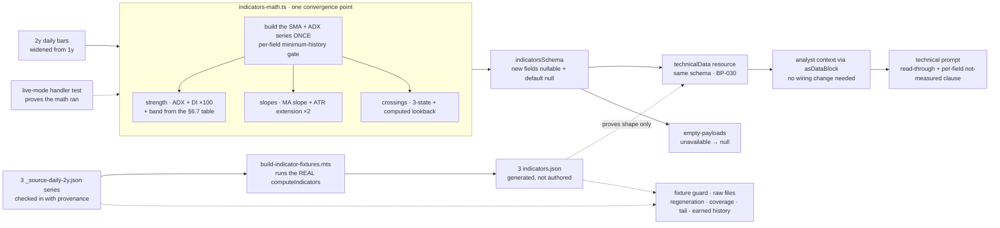

# FIX-826: Trend analysis is shallow — the desk labels the MA stack but can't characterize trend strength, persistence, or inflection — Implementation Spec

## Part I — The Case *(for the human)*

### 1. Problem — why it matters, why now

The desk publishes a trend read that is really a description of two lines.

`trend: "up"` means the last close sits above the 50-day average and the 50-day
sits above the 200-day. That is all it means. It says nothing about whether a
directional trend is actually present, how forceful it is, whether it began last
week or a year ago, or how fast it is running. Every one of those questions — the
questions a trend read exists to answer — is left to the technical analyst to
eyeball from a one-month price window, with nothing computed underneath it.

That is a real gap rather than a cosmetic one, because a bullishly-ordered stack
is a routine condition. It is true of a name grinding sideways with a slight
upward drift and true of a name in a violent, well-established advance, and the
desk reports the same word for both. A reader of the memo — and the trader and PM
reading it downstream — cannot tell those two apart from anything the desk
computed.

**Why now.** Two things. First, [FIX-1063](https://linear.app/fixpoint-labs/issue/FIX-1063)
is landing the data-honesty contract that makes this label *honest* — a trend the
desk could not measure will read as no trend rather than as "flat". That closes
the lie and leaves the shallowness exactly where it was: a *measured* "up" still
only means the averages are stacked. Building depth before that contract lands
would mean building it against a shape that is about to change. Second, the epic
([FIX-1067](https://linear.app/fixpoint-labs/issue/FIX-1067)) explicitly owns this
issue at full scope; the product owner already weighed and rejected both the
"defer it" and the "just add a disclaimer" alternatives, with a standing
guardrail: *characterize the trend, or say plainly that the desk cannot.*

There is no workaround. The numbers do not exist anywhere in the pipeline.

### 2. Solution in plain terms

**The desk computes what it currently asks the model to guess at, and publishes
the existing stack label beside it rather than in place of it.**

- **Is a trend actually there, and how forceful?** A standard trend-strength
  reading (ADX) plus the two directional-pressure components that say which side
  is winning. This is the highest-value addition: it is the industry's canonical
  answer to "is this a trend or is this noise", and it is the one number that
  separates the sideways grinder from the real advance. **The desk publishes both
  the number and a plain-language verdict — "no established trend", "strong
  trend" — and it computes that verdict from a stated threshold table
  (decision 7) rather than letting the model choose the word per run.** Whether
  the desk should publish a verdict word at all is the one thing still open on
  this spec (§12).
- **Which way is it going, and how fast?** The slope of the 50-day and 200-day
  averages over a fixed window, and how far price has run from each of them
  measured in the name's own daily range — so "extended" means something
  comparable across a $12 stock and a $900 one.
- **Did anything just turn?** The two moving-average crossings that mark an
  inflection — 50 against 200, and price against the 50-day — each reported with
  **how many sessions ago it happened**. An age is what makes a crossing news
  rather than another way of restating the stack.

**What this release does not answer: whether the trend is accelerating.** The
slope is an *average rate* between two endpoints, so a trend that steepened, one
that ran flat, and one that is rolling over can all produce the same number. The
honest scope of this release is **is there a trend, which way, how fast on
average, and did anything just turn** — not *is it speeding up or fading*. That
last question needs a curvature measure, it is deliberately not built here, and
[FIX-1117](https://linear.app/fixpoint-labs/issue/FIX-1117) carries it. Saying it
plainly matters more than usual: an outcome the spec claims and nothing measures
is the epic's own stated-but-unenforced defect, one level up.

**Every field reports "not measured" when the history is too short, and each is
gated on its own bar requirement** — a stock with 75 sessions of trading can have
a strength reading and no 200-day slope at all, and the payload says so per-field
rather than collapsing to one all-or-nothing verdict. §9 carries the exact bar
count for every field, so the gates are auditable rather than aspirational.

**One rule this issue adds that the epic has not needed before: "we looked and
found nothing" is recorded differently from "we could not look."** A crossing
field that is simply absent would be read by the analyst as *there was no
crossing* — a finding the desk never made. So a crossing carries three states,
and when it says "none found" it also says **across how many sessions it
searched** — roughly **14 months** for the 50/200 crossing and **21 months** for
price against the 50-day, on a two-year fetch. "No golden cross" is meaningless
without that number, and the window is what makes the statement true rather than
merely confident.

**Nothing here touches the rating.** The setup score, the valuation envelope, and
the evidence gate are untouched; this is evidence the technical analyst reads,
not a new input to the desk's arithmetic.

**Philosophy** — tenet 1 (coherence): this extends FIX-1063's unobserved-is-null
contract onto the fields it adds, and follows the null-gating shape the desk
already uses in `cross-asset-math.ts` (`trend3`) and `options-math.ts`, rather
than introducing a third convention. Tenet 5 (one convergence point): every new
field's minimum-history gate lives in the one indicator module, next to the gates
already there, rather than as per-consumer checks downstream.

> **§2 then §6 lead, and the rest is derivation.**

### 6. Decisions & rules — the sign-off surface

1. **The existing trend word is kept exactly as it is, and the new read sits
   beside it.**
   *Rejected:* redefining the trend word so a weak strength reading downgrades
   "up" to "flat" — that would silently change the meaning of a figure already
   in every stored report, and would make a name that is genuinely in a mild
   uptrend read as trendless.
   *Locks in:* a reader can see the desk say "the averages are stacked upward"
   and "there is no established trend" in the same memo. That is the honest
   state of the world for a sideways grinder, and it will look like the desk
   contradicting itself to anyone who reads only the one-word label.

2. **The new signals do not enter the rating, the setup score, or the capital
   gates.**
   They are evidence the technical analyst reads and writes up. No number the
   desk already publishes changes value because of this issue.
   *Rejected:* folding trend strength into the momentum component of the setup
   score — the obvious next step, which would change the score, and therefore
   the rating band and the evidence threshold, on **every name in the book** in
   the same release that introduces the signal. That is an unreviewable change
   to a real-money figure.
   *Locks in:* the depth shows up in what the desk *says*, not in what it
   *decides*, until someone deliberately wires it in. If the trend read turns out
   to be the best signal on the desk, we will have to do a second, separate piece
   of work to let it affect anything.

3. **"We looked and found no crossing" and "we could not look" are different
   answers, and the window we searched is published with the first.**
   *Rejected:* one nullable field per crossing, the cheap shape — it collapses
   the two, and the collapse lands on the side that asserts a finding the desk
   never made.
   *Locks in:* the crossing fields are shaped as small objects rather than plain
   values, which is more surface for every future reader to handle. We pay that
   permanently to avoid one specific class of false statement.

4. **Adaptive moving averages are ruled out; the 200-day line gets both a slope
   and a distance-from-price reading.**
   The issue named two gaps. The 200-day one is filled on both axes. The
   adaptive-MA one is declined: the library the desk already uses does not ship
   one, so it would mean hand-rolling smoothing math whose only output is a line
   that answers the same question the strength reading already answers better.
   *Rejected:* hand-rolling KAMA — new unvalidated numeric code carrying real
   money, for a redundant signal.
   *Locks in:* if someone later wants an adaptive MA, they reopen this and argue
   it on its own merits. We are on record that it was considered and declined.

5. **Distance-from-average is computed, not left for the analyst to derive.**
   The raw ingredients (close, the averages, the daily range) are all on the
   payload, so a reviewer will reasonably ask why the desk computes the ratio
   instead of letting the model do one division.
   *Rejected:* leaving it derivable. "The model can do the arithmetic" is exactly
   how a figure ends up transcribed rather than measured — the defect filed as
   [FIX-1115](https://linear.app/fixpoint-labs/issue/FIX-1115), on this same
   memo surface. One computed field removes a model arithmetic step from a
   real-money read.
   *Locks in:* the desk computes derived ratios even when the inputs are visible.
   That is a standing bias toward more deterministic fields, and it will
   occasionally look like redundancy.

6. **The price window the trend math runs on widens from one year to two.**
   With one year of daily bars there are only about fifty days on which both the
   50- and 200-day averages exist, so "no golden cross" could only ever mean "not
   in the last ten weeks."
   *Rejected:* keeping one year and publishing the narrow window honestly — it is
   honest and it is nearly useless. Also rejected: **three years**, which would
   stretch the 50/200 search to ~26 months but needs a new `"3y"` case added to
   both providers' range tables (neither has one, and the unrecognised-range
   default is 45 days — see §12), for a case that is already honestly reported.
   *Locks in:* each analysed name pulls roughly twice the price history it does
   today, on providers the desk already calls — no new provider or entitlement.
   And it **fixes the searchable window at roughly 14 months** for the 50/200
   crossing (~21 for price against the 50-day). A cross older than that reports as
   "none found in the last ~14 months", which is true and useful — the regime is at
   least that old — but it is *not* a detection of the cross itself, and the spec
   must not promise one.

7. **The strength reading is published as a number AND a verdict word, and the
   desk computes that word from the threshold table below — the model never picks
   it.** ⚠️ **This is the decision under review; §12 carries it as the open
   question.** Everything the desk publishes about trend strength — the memo's
   `trend` metric value, the payload — reads off one table:

   | `adx.value` | `adx.band` | how the memo says it |
   |---|---|---|
   | null (not measured) | null — the whole block is null | "trend strength not measured" |
   | `0 ≤ v < 20` | `none` | "no established trend" |
   | `20 ≤ v < 25` | `emerging` | "trend emerging, not confirmed" |
   | `25 ≤ v < 50` | `established` | "established trend" |
   | `50 ≤ v ≤ 100` | `strong` | "strong trend" |

   **Every lower bound is inclusive and every upper bound is exclusive**, so
   exactly `20.0` is `emerging`, exactly `25.0` is `established`, and exactly
   `50.0` is `strong`. The boundary is stated because it is the half of a
   threshold rule that gets decided by accident otherwise.

   **The `25` line is a convention the desk is adopting, not a number we derived.**
   It is Wilder's own trend-present threshold and the one most desks use. Note the
   collision a future contributor will hit: `trading-signals`' own `ADX` doc
   comment suggests 20 / 40 / 50 instead. We are deliberately not following the
   library's docstring, and this decision is the record of that — otherwise
   someone reads the docstring, concludes the code is wrong, and "fixes" it.

   **Why the 20–25 `emerging` band exists at all.** Without it, `24.9` publishes
   "no established trend" and `25.1` publishes "established trend", and a name
   sitting in the mid-20s flips the desk's verdict week to week on indicator
   noise. This is the same reasoning `trend3`'s deadband encodes and that this
   spec deliberately *declines* for the slopes (§7): **a published label gets a
   buffer band; a published number does not.** The slopes publish a number, so a
   measured `+0.4%` is reported as `+0.4%`. The strength read publishes a word, so
   it gets the buffer — and the raw value is printed beside the word either way,
   so a reader who distrusts the band can see through it.

   *Rejected:* **leaving the band to the model** — the prompt names the number and
   the analyst writes "strong" or "weak" as it judges. This is what the spec
   implied for five rounds by using `"ADX 31 (strong)"` as an example while
   defining no threshold anywhere, and it is decision 5's defect exactly one
   category up: not "the model can do the arithmetic" but *the model can make the
   call*. Two names with identical readings get different words on different runs,
   and nothing catches it.
   *Rejected:* **publishing the bare number with no verdict word** — honest, and
   it cannot be wrong. It is the live alternative and §12 states it as the fork.
   Declined here because decision 1's whole payoff is a memo that can say "the
   averages are stacked upward" and "there is no established trend" in one breath;
   with no verdict word that becomes "stack up, ADX 18.9", which is only a
   contradiction to a reader who already knows the convention — and a reader who
   knows the convention did not need the desk.
   *Locks in:* the desk is now on the record with a threshold. A name at ADX 24
   and a name at ADX 26 get different words in their memos, and the desk owns that
   line rather than the model improvising it per run. Changing the line later
   changes the wording of every memo written after it — and, because §10 asserts
   the mapping, changing it is a test change, which is the point.

**Non-goals** — **acceleration: whether the trend is speeding up or rolling over
is explicitly NOT measured here** (§2; the slope is an average rate, not a
curvature, and [FIX-1117](https://linear.app/fixpoint-labs/issue/FIX-1117) carries
that outcome); weekly / multi-timeframe confirmation; pattern-structure detection
(Donchian, regression channels, Aroon, breakout geometry — the "Setup" section
stays model-narrated); any change to the setup score, rating envelope, evidence
gate, or reward-to-risk figure (decision 2); any new data provider or paid
entitlement (the epic's standing fence); and re-recording the **other** tools'
fixtures (news, fundamentals, sentiment, macro), which this change does not
invalidate. The three tickers' price/indicator snapshots **are** in scope and are
regenerated from a checked-in two-year series rather than hand-authored — §10
carries why that stopped being optional. **Two derived signals
are deferred to follow-ups** rather than dropped — see §12.

**Size:** Medium — 5 production files · 1 fixture generator script · 3 two-year
source series checked in · 3 indicator fixtures regenerated · **7 stale one-year
comments swept (BP-034)** · ~23 test behaviours · 3 doc surfaces · 1 PR.
*(Was "Small–Medium · 3 fixture files re-authored" before round 7 — the corpus
work grew when hand-authoring turned out to be the defect, not the fix.)*

---

### 3. Tradeoffs & alternatives

**The simpler approach: add ADX and stop.** Genuinely tempting, and it is most of
the value — it is the only one of the three that answers "is there a trend at
all." Rejected because it leaves the issue's inflection outcome untouched: a
single strength number is a *level*, and a reader cannot tell a two-week-old
regime from a two-year-old one from it. The crossing ages answer that, and they
are cheap arithmetic over bars already in memory. The issue's *trajectory* outcome
is only partly served here (rate, not acceleration) and §2 says so outright.

**The alternative the epic PR review raised, and the owner already settled:** a UI
disclaimer on the existing label, no new math. Recorded here for the file — the
product owner kept this issue at full scope and broadened the epic objective to
own it. Not reopened. §12 says what that decision did and did not settle.

**A separate `compute_trend` tool versus widening `compute_indicators`.** The
issue leaves this open; this spec takes the second. A second tool would need its
own provenance tag, its own empty payload, its own fixture file per ticker, its
own slot on the spine, and its own entry in the technical analyst's tool list —
and it would produce two `source` tags for two reads of the same bars, which can
disagree. The bars the trend math needs are already fetched inside
`compute_indicators`. One payload, one provenance, one honesty contract.

**Where the real risk is:** not the indicator math, which is a well-covered
library call plus arithmetic. It is that **the new fields are reported as
unmeasured when they were never attempted.** Three paths lead there and all three
are silent:

- **A stale fixture defaults to null.** Handler outputs *are* validated at runtime
  (`packages/core/src/blocks/internal/build-block.ts` — `validateSchema` runs
  `safeParse` on the return value), and that parse applies `.default(null)`. So a
  checked-in fixture missing the new fields does not error and does not drop the
  keys: it produces **explicit nulls**, which read exactly like a genuinely
  short-history name. Every fixture run would report the depth as unmeasured,
  forever, while the existing smoke check keeps passing.
- **The live handler could still request one year, or never persist**, and fixture
  mode would never notice, because it does not call the math at all.
- **An un-updated prompt** leaves the numbers in the payload and absent from the memo.

**And one path that runs the other way, which is worse:** a fixture reporting the
new fields as **measured when nothing measured them.** Hand-authored fixture
values are indistinguishable from computed ones once they are in the JSON — a
plausible `adx.value` and a 200-day slope typed by a human read to every guard,
and to the model, exactly like output. The demo path is the one that would carry
it, since fixture mode returns `indicators.json` directly without calling the
math. The three silent paths above publish "not measured" when we did measure;
this one publishes a measurement we never made, into a memo, as fact. It is the
epic's defining defect, and §10's generated-corpus rule is the answer to it.

§10 is built around making all three loud, and around the fact that **the fixture
path can only prove the shape — only the live path proves the math ran.** Note the
tension the first one sits in: `.default(null)` is what lets a pre-existing
persisted session parse (BP-030), and it is the same mechanism that makes a stale
fixture silent. One schema serves both, so the fixture side needs a guard that
reads the raw file rather than the parsed payload.

**A cost we are accepting:** decision 1 means the memo can carry two trend
statements that a fast reader will call contradictory. The alternative was
worse — one reconciled label that quietly redefines a published figure.

### 4. Focus practices (1–5)

1. **FIX-1063's governing invariant — a verdict field only ever describes work
   that actually happened.** Every field this issue adds is a small verdict about
   a trend, and each one has a distinct minimum history. The invariant is not
   satisfied by making the fields nullable; it is satisfied by each field's null
   meaning *exactly* "not measured", and by "none found" never wearing the same
   representation as "not measured" (decision 3).
2. **BP-030 (tolerate the old shape).** The indicator payload's schema is also
   the persisted shape of the session's technical spine
   (`technicalDataStateSchema` embeds `toolOutputSchemas.compute_indicators`), so
   widening it widens a persisted record. New fields take the established
   `.nullable().default(null)` state shape (BP-023) so a session persisted before
   this lands still parses.
3. **BP-003 (verification evidence).** The baseline is a fixture-mode run that
   passes today; the axis is whether the *computed* trend depth reaches a
   published technical memo. Everything on that path up to the model's own words
   is deterministic and gets gated; only the words themselves are advisory (§10).
4. **BP-035 (second-path checklist).** The second path here is the
   **partial-history** name — enough bars for a strength reading, not enough for
   a 200-day slope. A suite that only covers "long history" and "almost no
   history" proves nothing about the case the per-field gating exists for.
5. **Read the executing path at every boundary this spec asserts — and state a
   published rule as a property, not as a procedure.** Three of
   round 2's six findings were the same failure: the boundary the code has versus
   the boundary this spec assumed — output validation (asserted absent from the
   wrong package; it lives in `blocks/internal/build-block.ts`), the crossing rule
   (an adjacent sign-change test that misses a cross *through* equality), and the
   zero-range series (`NaN`, not a clean absence). Each was cheap to check and
   expensive to leave. Before asserting a boundary in implementation, open the
   function that enforces it.

   Round 3 added the sibling half. The crossing rule broke twice in two rounds —
   once from an adjacent-pair test, once from a traversal direction — and both
   bugs were in the *procedure*, never in the intent, because a procedure quietly
   inherits its traversal's assumptions. The rule now names a property of the
   series (§7) and says nothing about which way to walk it. **Any rule whose
   output the desk publishes gets stated the same way: what is true of the data,
   not what the code does to it.**

### 5. What using it looks like

Nothing on the framework's public surface changes — this is internal to the
trading-desk lab app. What changes is what the desk's own payload carries and
what the memo can therefore say. *(Field names are the implementer's; the shape
and the reachability of every value are the point. Both payloads below are
checked against §9's bar table.)*

**A name with two years of history (~500 bars), in a real advance:**

```
before  { trend: "up", sma50: 124.8, sma200: 112.3 }

after   { trend: "up", sma50: 124.8, sma200: 112.3,
          adx: { value: 31.4, plusDI: 28.1, minusDI: 12.6, band: "established" },
          slopes: { sma50Pct20: +6.1, sma200Pct20: +2.4,
                    extensionSma50Atr: 1.8, extensionSma200Atr: 4.6 },
          crossovers: {
            maStack:   { found: true, direction: "bullish", agoBars: 34, lookbackBars: 300 },
            priceMa50: { found: true, direction: "bullish", agoBars: 3,  lookbackBars: 450 } } }
```

`band` is `"established"` because `31.4` falls in decision 7's `25 ≤ v < 50`
row — computed from the value, never chosen by the model.

The reader now knows the advance is forceful, that the golden cross is seven
weeks old rather than ancient, that price reclaimed its 50-day three sessions
ago, and that price sits four and a half daily ranges above its 200-day. The two
`lookbackBars` differ because the 200-day average only exists from bar 200 while
the 50-day exists from bar 50 — the searched window is computed per crossing, not
shared.

**A name with seventy-five sessions of history** — the case decision 3 and focus
practice 4 exist for:

```
after   { trend: null, sma50: 118.2, sma200: null,
          adx: { value: 18.9, plusDI: 19.2, minusDI: 17.8, band: "none" },
          slopes: { sma50Pct20: +0.9, sma200Pct20: null,
                    extensionSma50Atr: 0.4, extensionSma200Atr: null },
          crossovers: {
            maStack:   null,
            priceMa50: { found: false, lookbackBars: 25 } } }
```

Four different kinds of absence, all distinguishable and all reachable at exactly
75 bars. `trend` and `sma200` are null because there is no 200-day average
(FIX-1063's contract). `sma200Pct20` and `extensionSma200Atr` are null for the
same reason, one derivation further out. `maStack` is null because the desk
**could not look** for a 50/200 crossing at all. And `priceMa50` says it **did**
look, across twenty-five sessions, and there was none — a weak statement, but a
true one, and the reader can see it is weak because the window is printed.

`band: "none"` is the fifth thing on this payload and it is **not** an absence:
it is the desk's finding that at `18.9` there is no established trend, computed
off decision 7's `0 ≤ v < 20` row. It is exactly the state decision 1 predicts —
the stack could not even be labelled here, and the strength read still says
plainly that nothing directional is going on.

**A flat tape — a halted or untraded name, 300 constant OHLC bars.** This is the
case that fixes the wording of the not-measured clause, so it is worked here
rather than left to §9:

```
after   { trend: "flat", sma50: 50.0, sma200: 50.0,
          adx: null,
          slopes: { sma50Pct20: 0.0, sma200Pct20: 0.0,
                    extensionSma50Atr: null, extensionSma200Atr: null },
          crossovers: {
            maStack:   { found: false, lookbackBars: 100 },
            priceMa50: { found: false, lookbackBars: 250 } } }
```

**Three reads are unmeasured here; five are real.** The strength block is null
because a zero-range series gives the library `NaN` rather than a number (§7),
and both ATR extensions are null because there is no range to normalize by. But
the stack label, *both* slopes and *both* searched crossing windows are real
measurements —
the averages are genuinely flat, and the desk genuinely looked back 100 and 250
sessions and found no crossing. A memo that answers this payload with "the desk
could not characterize the trend" throws five measured findings away and asserts
an ignorance the desk does not have. It says **trend strength** was not measured,
and nothing wider.

**What the memo can now say**, where before it could only say "trend: up":

```
before  trend: up
after   trend: up · strength: ADX 18.9 — no established trend (rising 50-day,
        no directional pressure); 200-day trend not measurable on 75 sessions
        of history
```

**"no established trend" here is decision 7's `none` row, transcribed** — the
analyst is copying a word the desk computed, not judging `18.9` for itself. That
is the whole difference between this line and the one the spec implied for five
rounds.

And on the halted name above, where the strength read is the *only* thing
missing — note that it does not borrow the wording of the measured "no
established trend" read directly above it:

```
before  trend: flat
after   trend: flat · trend strength not measured (no range to measure on);
        both averages flat over 20 sessions, and no 50/200 crossing in the
        last 100 sessions
```

## Part II — The Build Plan *(for the implementing agent)*

### 7. Technical design

Everything lands in one place — the pure indicator math — and travels out through
the schema the payload and the persisted spine already share.



- **`flows/analysis/tools/indicators-math.ts`** holds all the new math, beside the
  existing short-history gates. `IndicatorOutput` widens accordingly. Four traps
  specific to this file, all verified in source:
  - **Build the series once.** Crossings and slopes need *time series*, not point
    values, and every existing helper in this file walks all bars and returns
    only the last value (`kdj()` already re-runs `stochastic()` for this reason).
    Compute the SMA-50, SMA-200 and ADX series in a single pass, and read the
    crossings and the slopes off those same arrays. Do
    **not** call the point helpers once per field — that is a walk per field over
    ~500 bars, and it is the shape the file already regrets.
  - **`ADX.getRequiredInputs()` returns `interval * 2 - 1`** (read in the package
    source — 27 bars at the conventional interval 14). Gate on the indicator's
    own required-input contract, not a hand-copied constant.
  - **`.pdi` and `.mdi` are on a different scale from `.value`.** In
    `trading-signals@7.4.3`, `DX.update()` computes
    `pdi = smoothedDM⁺ / ATR` and `mdi = smoothedDM⁻ / ATR` as **raw ratios**,
    and multiplies only its own result by 100 (`dmDiff / dmSum * 100`), which is
    what ADX then smooths. So `adx.value` arrives on 0–100 while the two
    directional components arrive on roughly 0–1. **Multiply both by 100** to
    publish them on the conventional DI scale. This is the nastiest trap here
    because the block looks correct: a reviewer eyeballing `value` sees a sane
    number and concludes the whole object is fine.
  - **A zero-range series yields `NaN`, not a clean absence.** On 27+ constant
    OHLC bars — a halted security, a synthetic flat series — directional movement
    and ATR are both zero, so `DX.update()` computes `0 / 0` for both components.
    Its own `if (dmSum === 0) return 0` guard **does not catch this**, because
    `dmSum` is `NaN` and `NaN === 0` is false; it falls through to `NaN / NaN *
    100`. So `value`, `pdi` and `mdi` all arrive `NaN`. The ATR-normalized
    extensions divide by that same zero range. **Every one of these is `null`, not
    `0`** — a flat tape has no directional pressure to measure and no range to
    normalize by, and publishing `0` would assert a measurement of no-trend that
    the math never made. This is a guard failing open on an unrecognised value,
    which is the epic's own fourth lesson, arriving from inside a dependency.
  - **`.pdi` / `.mdi` are typed `number | void`, but they are NEVER `undefined`
    at the point this code reads them — the reachable hazard is `NaN`.** Measured
    against the installed `trading-signals@7.4.3` (`labs/trading-desk/package.json`
    pins `^7.4.3`) by feeding `ADX(14)` a trending series and printing the first
    bar at which each value is finite:

    | Value | First finite at |
    |---|---|
    | `adx.pdi` / `adx.mdi` | **bar 14** |
    | `adx.value` | **bar 27** |

    `ADX` delegates `pdi`/`mdi` to an inner `DX`, which populates both the moment
    its `WSMA(14)` stabilises — 13 bars before ADX itself produces a value. So
    across bars 14–26 the components are finite while `adx.value` is still null,
    and from bar 27 on all three are populated together. **Since the strength
    block gates at 27 (§9), the components are always populated whenever the block
    is published, and the `undefined` branch of `number | void` is unreachable
    from this caller.** That is what makes §9's all-three-at-27 gate coherent
    rather than merely convenient: there is no bar count at which the block is
    published with a missing component, so no inner partial-null can arise.

    The prohibition on `finite()` stands, but for the **other** reason: on a
    zero-range series `pdi`/`mdi` arrive `NaN` (previous bullet), and `finite()`
    coerces a non-finite input to `0` — turning "measured nothing" into a
    published `0`, the exact defect this epic exists to remove. Route the
    components through an absence-aware check that treats `NaN` as null, not
    through `finite()`. Same shape as FIX-1063's warning about reusing the
    `!== 0` helpers on the fundamentals adapters: **an existing idiom in this file
    is wrong for this new caller.**

  - **The band is a total function of `adx.value`, and it is stated here in
    intervals because it is a published verdict.** Decision 7 carries the table
    and the reasoning; this is the implementable form of it.

    > **`adx.band` is `none` for `0 ≤ value < 20`, `emerging` for
    > `20 ≤ value < 25`, `established` for `25 ≤ value < 50`, and `strong` for
    > `50 ≤ value ≤ 100`. Lower bounds inclusive, upper bounds exclusive.**
    > `band` is null exactly when the strength block is null — never
    > independently, because the block is all-or-nothing at 27 bars (§9).

    Two things this rules out. **`band` is never computed from `plusDI`/`minusDI`**
    — those say which side is winning, not whether anyone is; folding them in
    would make the word mean two things. And **the word is never derived twice**:
    the payload carries `band`, the prompt transcribes it, and no consumer
    re-applies the thresholds. A second application is a second implementation,
    and §13's rule about parallel derivations applies to verdicts as much as to
    goldens.

  - **The crossing rule is stated as a PROPERTY of the series, not as a scan.**
    This rule has now been corrected three times, and each break lived in the
    *procedure* rather than in the intent: first an adjacent-pair sign test that
    missed a cross passing through equality, then a nearest-non-equal comparison
    whose answer inverted depending on which way the walk ran. So it is defined
    here without a traversal at all. Take the difference series `d = fast − slow`
    over the bars on which **both** legs exist (price against SMA-50; SMA-50
    against SMA-200), and let `S` be the bars where `d ≠ 0`, in chronological
    order.

    > **A crossing is a bar `b` in `S` whose immediately preceding member of `S`
    > carries the opposite sign. The reported crossing is the LATEST such `b`.
    > Its direction is the sign of `d` at `b` (positive → bullish). Its `agoBars`
    > is the number of bars from `b` to the final bar.**

    **The found variant publishes no ISO date, and that is settled here rather
    than left to the implementer.** The published fields are exactly
    `{ found: true, direction, agoBars, lookbackBars }` — the shape §5's payloads
    show. Earlier rounds described the rule as fixing a crossing's "date,
    direction and age", which read as mandating a `date` field that no payload
    example ever carried; that wording was shorthand for *the bar the crossing is
    attributed to*, and it is now spelled that way throughout. `agoBars` **is**
    the attribution: it names bar `b` relative to the final bar, which is the form
    the memo actually uses ("the golden cross is 34 sessions old"). A calendar
    date would be a second encoding of the same fact, derivable from the series
    and drifting from it the moment the two disagree — and the analyst reads a
    one-month price window, so it could not resolve a date two years back anyway.
    *Rejected:* adding `date` to the found variant and the examples. Age is what
    decision 3 and §2 promise; a date is a different, redundant promise.

    Every published figure is read off `b` — the **newer** of the two non-zero
    observations — never off the older one. That single rule settles all three
    cases that broke the procedural statements: `−1, 0, +1` is a crossing at the
    `+1` bar, direction bullish (the zero is not a member of `S`, so equality is
    stepped over rather than hiding a real cross); `−1, 0, −1` is not a crossing
    (same sign on both sides); and a series with two crossings reports the more
    recent one, because the rule takes the latest `b`.

    A backward walk with an early exit is still the sensible implementation, and
    it satisfies this rule — but **traversal direction is now an implementation
    choice, not part of the contract.** A walk that dates or signs the crossing
    from whichever observation it happened to reach first is wrong under the rule
    whichever way it ran, and both errors are invisible to a presence-only test:
    the age lands one observation too large and the direction inverts. §10 asserts
    `agoBars` *and* direction for exactly that reason.

  - **The slope and extension formulas are stated here, in units, because they
    are published figures and a presence-only test cannot tell a correct one from
    a broken one.** Let `t` be the final bar and `L = 20` the slope lookback.

    > **`slopes.sma50Pct20` = `(sma50[t] − sma50[t−20]) / sma50[t−20] × 100`**,
    > and `sma200Pct20` the same over `sma200`. **Percent, not a fraction.**
    > Positive means rising. Null if either endpoint is missing, or if the
    > denominator is 0.
    >
    > **`slopes.extensionSma50Atr` = `(close[t] − sma50[t]) / atr14[t]`**, and
    > `extensionSma200Atr` the same against `sma200`. **A count of daily ranges,
    > unitless**, signed: positive means price is *above* the average. Null if
    > `atr14[t]` is 0 or non-finite (the zero-range case).

    Three details that are decisions, not incidental. **The denominator is the
    OLDER endpoint** — a percentage change is measured against where it started,
    and reversing the endpoints changes both sign and magnitude. **The result is
    scaled ×100**; leaving it a fraction publishes `0.161` for `16.1%`, the same
    class of unit defect as the DI scaling above. **No deadband.** `trend3`'s
    deadband exists to keep its three-state *label* honest; these fields publish a
    number, and quantizing a small slope to zero would assert a flat trend the
    math did not measure — a measured `+0.4%` is reported as `+0.4%`.

  For the null-gating shape itself, follow the two in-repo precedents rather than
  inventing one: `tools/data/cross-asset-math.ts`'s `trend3` (its **null-on-missing-endpoint**
  half; its deadband is deliberately *not* carried over, per the bullet above),
  and `tools/data/options-math.ts`, whose header states the rule outright: "Every
  function returns `null` on insufficient data."
- **`flows/analysis/tools/schemas.ts`** — `indicatorsSchema` grows the three
  blocks. This is a **handler** output schema and is deliberately absent from the
  strict walker (verified: `test/output-schemas-strict.spec.ts`'s `cases` list
  carries `secFilings`, `analystEstimates`, `earningsTranscript`, and
  `discoveryPayload` from this module and no others), so BP-016 does not bind and
  `.nullable().default(null)` is permitted — and required, per BP-023, because
  the same schema is the persisted spine state.
- **`flows/analysis/tools/empty-payloads.ts`** — the `compute_indicators` builder
  emits null for every new field, matching what FIX-1063 leaves the existing ones.
- **`flows/analysis/tools/data/compute_indicators.ts`** — the internal price fetch
  widens from `range: "1y"` to `"2y"` (decision 6). Both providers already map it:
  `rangeToLookbackDays` in `lib/providers/yahoo.ts` and `lib/providers/finnhub.ts`
  each carry a `case "2y": return 750`.

  **This costs one additional upstream price fetch per ticker, and an earlier
  draft of this spec claimed the opposite.** The process cache keys on
  `` `${namespace}:${JSON.stringify(args)}` `` (`lib/cache.ts`), and **three** tools
  currently request `get_price_history` with a byte-identical
  `{ ticker, date, range: "1y" }`: `compute_indicators`, `get_factor_ranks`
  (`get_factor_ranks.ts:50`) and `get_risk_regime` (`get_risk_regime.ts:31`). They
  share one entry today — which is the sharing the cache's own header advertises
  ("the four analysts that run at the same time will share one upstream call").
  Moving this one caller to `"2y"` gives it a different key, so the desk makes a
  second price request per analysed ticker per TTL window rather than reusing the
  `1y` pull. There is still no *hazard* — no stale or cross-wired series, and the
  `1mo` analyst fetch was never shared either — but "no second request beyond the
  one this replaces" was false, and it was false because it was reasoned rather
  than read. That is a small cost decision 6 should be accepted with open eyes,
  not a blocker: one extra call on providers the desk already pays for.
- **`flows/analysis/agents/analysts/prompts/technical.prompt.md`** — the `<data>` inventory, the
  "Setup" and "Momentum" section guidance, and **the not-measured clause carrying
  the owner's guardrail, scoped per field**. Three statements the analyst keeps
  textually distinct, because two of them are measurements and the third is the
  absence of one. **In every measured case the analyst transcribes `band`'s
  wording from decision 7's table — it does not judge the number:**
  - **strength measured, trend present** — "up · ADX 31.4 (established trend)",
    or "(strong trend)" at `band: "strong"`, or "(trend emerging, not confirmed)"
    at `band: "emerging"`.
  - **strength measured, no trend** (`band: "none"`) — "up · ADX 18.9 — no
    established trend". This is decision 1's honest conflict, and it is a
    *finding*: the desk looked, and the directional pressure is not there.
  - **strength not measured** (block null) — "up · trend strength not measured".
    Never spelled as "no established trend", which would assert the `none` finding
    above from data that produced none.

  The prompt gives the analyst the four band wordings verbatim and tells it to use
  the one `band` carries. It must **not** restate the thresholds — a prompt that
  repeats "ADX above 25 means…" is the second implementation the bullet above
  rules out, and it is the copy that will drift when the table changes.

  **A null strength read does not license "the desk could not characterize the
  trend."** On a long zero-range series the stack label, both SMA slopes and both
  searched crossing windows are all still measured; telling the analyst to
  disclaim the whole trend read discards four real measurements and asserts an
  ignorance the desk does not have. That is this epic's own defect pointed the
  other way — a state asserted rather than measured, pessimistically this time.
  The blanket statement is reserved for the case where **every** trend-depth
  field is null (strength, both slopes, both extensions, both crossings), which is
  the no-bars / empty-payload case. Also: a `found: false` crossing means
  *searched, none found within N sessions*, and must never be written up as "no
  crossover" without the window.
- **The strength read widens the EXISTING `trend` metric key — it does not add a
  fifth.** The shared preamble
  (`flows/analysis/prompts/_partials/phase1-analyst-preamble.md`) requires
  "an array of **exactly four** `{ key, value }` entries", and
  `thesisOutputSchema` types `metrics` as an unbounded array with no length
  check — so a fifth key would violate the stated contract with nothing to catch
  it, silently, on the one analyst this issue touches. The technical role keeps
  `rsi · macd · atr · trend`, and the `trend` **value** carries both halves: the
  stack label and the strength read (`"up · ADX 31.4 (established trend)"`), or the label plus
  an explicit not-measured (`"up · trend strength not measured"` — the §7
  spelling, scoped to strength alone). This also keeps the
  two reads adjacent in the memo, which is where decision 1's honest conflict is
  legible.
  *Rejected:* editing the preamble to allow five — it is shared by all nine
  analysts and would put every role's contract in scope. *Rejected:* dropping
  `rsi`, `macd` or `atr` to make room — that removes a published figure to add
  one.
- **No wiring change in `agents/analysts/analysts.ts`.** The technical analyst
  already receives the whole indicators payload through `asDataBlock`
  (`flows/analysis/lib/helpers.ts`), which JSON-stringifies it wholesale, so a
  widened schema flows through untouched. The prompt is the only analyst-side edit.
- **No `run-artifacts.ts` change** — see §10 for why the verification plumbing an
  earlier draft added turned out to have no consumer.

**No solution sketch.** The composition is not novel — this widens an existing
payload through a schema that already has the exact nullable shape FIX-1063 is
establishing, and every mechanism claim above was read in source rather than
argued.

**One POC, characterization only** — `spec-poc/FIX-826-trend-math/`, which never
merges. §9's whole gate table rests on library internals nobody had executed:
when each field of `ADX(14)` first goes finite, what scale the DI components
arrive on, and what a zero-range series actually returns. Those were read in
source and reasoned about, which is how the epic's own defect gets made. Two
scripts settle them by running the pinned `trading-signals@7.4.3`:

```
node spec-poc/FIX-826-trend-math/adx-internals.mjs   # the ADX gate, scale, and NaN behaviour
node spec-poc/FIX-826-trend-math/goldens.mjs         # re-derives §10's slope/extension goldens
```

Both print their evidence and need no arguments. Every premise held — the verdicts
are tabulated in §12. Neither script ships; the behaviours they pin become the CI
specs in §10.

### 8. Implementation sequence

One PR. The schema widening and its producers do not compile apart, and the
prompt and fixture work is meaningless without them.

1. **Widen `indicatorsSchema`** with the three new blocks, nullable with a null
   default. Nothing produces them yet.
   *Test:* the schema accepts a payload omitting every new field (the legacy /
   pre-fix record) and reads it back as null; and rejects a wrong type.
   *Depends on:* FIX-1063's contract PR having landed — this widens the same
   object and inherits its nullability convention.
2. **Null the new fields in the `compute_indicators` empty-payload builder.**
   *Test:* an unavailable indicator payload carries null, never zero and never a
   `found: false` crossing — the desk did not search anything.
   *Depends on:* 1.
3. **Build the shared series pass** — SMA-50, SMA-200 and ADX as arrays over the
   bar range, in one walk. Everything in steps 4–6 reads off these.
   *Depends on:* 1.
4. **Build the strength read**, gated on the indicator's own required-input
   contract, with the ×100 scaling, absence-aware handling of the two directional
   components, **the band as a total function of `adx.value` per decision 7's
   interval table**, and **the zero-range guard** — a `NaN` from a flat tape
   becomes null, never `0` (§7). *Test:* the §10 strength behaviours, including
   magnitude, the band mapping at every boundary, the below-warm-up case, and the
   constant-series boundary. *Depends on:* 3.
5. **Build the slopes and the two extensions to §7's stated formulas** — older
   endpoint as denominator, ×100 for the slopes, ATR-normalized and signed for the
   extensions, no deadband — each gated on its own bar requirement independently
   (§9's table), and each returning null on a zero denominator rather than
   dividing by it. *Test:* §10's three-series slope value table (rising, falling,
   flat), the extension sign pair, the partial-history behaviour — a 50-day slope
   present while the 200-day slope and 200-day extension are null — plus the
   constant-series case. *Depends on:* 3.
6. **Build the crossing detection** for the two moving-average crossings, **to
   §7's property** — the latest bar whose preceding non-zero difference carries
   the opposite sign, with direction and `agoBars` both read off *that* bar (no
   ISO date field — §7) — with
   the three-state result and a **computed** lookback window. The window is the
   number of bars on which both legs exist minus one, per crossing — it is
   published, so it must be derived, not assumed, and the two crossings do not
   share a value. *Test:* the §10 crossing behaviours, all three states, the
   through-equality / touch pair with direction asserted, and a two-crossing
   series. *Depends on:* 3.
7. **Widen the internal price fetch to two years** (decision 6). *Test:* the
   live-mode handler test in §10 asserts the requested range. *Depends on:* 6.
8. **Give the fixture corpus a series, and generate the indicator fixtures from
   it** (§10). **Not hand-authored** — an earlier draft of this step said
   "hand-computed new-field values consistent with each ticker's existing
   recorded figures", which is how the corpus got a 200-day average sitting
   beside 21 bars of price history. Three parts:
   1. Check in `fixtures/{TICKER}/{DATE}/_source-daily-2y.json` for NVDA, AAPL
      and JPM — a two-year daily series with a provenance block, either recorded
      from a provider at `range: "2y"` or authored from a recorded seed.
      `prices.json` must be the tail of it (re-record both, or author the series
      to end on the existing bars).
   2. Add `scripts/build-indicator-fixtures.mts`, which runs the **real
      `computeIndicators`** over each series and writes `indicators.json`
      deterministically. No number in that file is typed by a human.
   3. Add the guard test — the four raw-file assertions in §10 (regeneration
      equality, field coverage, tail identity, earned history). A guard on the
      *parsed* payload passes against the very defect it exists to catch, because
      `.default(null)` fills the gap silently.

   *Depends on:* 1, and on steps 3–6 for the new fields to exist in
   `computeIndicators` output. **Note the baseline is safe:** the
   `fixture-run-clean` goal asserts only `status === "completed"`, a non-null
   `finalRating` and a published PM memo — no indicator value — so regenerating
   the corpus does not move its pass criterion (verified in
   `goals/trading-desk-headless/fixture-run-clean/goal.md`). The existing
   `indicators.json` values **will** change, and that is the point: they are
   currently invented.
9. **Update the technical analyst prompt** — inventory, section guidance, the
   per-field not-measured clause (§7 — scoped to trend *strength*, not to the
   whole trend read), and **the widened `trend` metric key** carrying
   both the stack label and the strength read. The key count stays at four; do not
   add a fifth (§7). *Depends on:* 1.
10. **Remove** the stale claims in `indicators-math.ts`'s module header — it
    currently advertises that routines "return finite numbers" and fall back to
    "`0` (or the neutral baseline)". FIX-1063 makes the first false and the
    second wrong; this issue's fields make it wronger. Leaving it is how the next
    contributor reintroduces the zero (BP-034). *Depends on:* 4–6.
11. **Finish the one-year → two-year provenance sweep (BP-034).** Step 7 changes
    one line of code and leaves **seven** definitive source comments asserting a
    one-year window. An implementer who reads any of them inherits a cache/window
    contract that contradicts the code. Every site, verified in source:

    | Site | Currently says |
    |---|---|
    | `tools/data/compute_indicators.ts:5` | "pulls a 1-year price history" (module header) |
    | `tools/data/compute_indicators.ts:32` | "internal 1-year price_history fetch" |
    | `technical-data-resource.ts:12-13` | "the 1-year window `compute_indicators` / `get_factor_ranks` pull internally" |
    | `agents/analysts/analysts.ts:124-125` | "`compute_indicators` fetches its own 1-year window internally" |
    | `tools/data/get_price_history.ts:23-24` | "the internal 1-year windows `compute_indicators` / `get_factor_ranks` pull" |
    | `lib/providers/finnhub.ts:30-32` | "so `compute_indicators` can request `\"1y\"` and actually get enough bars for SMA200" |
    | `test/store-price-history.spec.ts:238` | "the 1-year window the indicator/factor tools pull" (off-range probe) |

    > **Do not do this as a find-and-replace of "1-year" → "two-year". Three of
    > the seven sites would become newly false.**

    `technical-data-resource.ts`, `get_price_history.ts` and
    `store-price-history.spec.ts` each describe **two** consumers in one phrase,
    and only one of them moves: `get_factor_ranks` (`:50`) and `get_risk_regime`
    (`:31`) both still request `"1y"`. Those three comments must name the two
    windows separately — the 2-year window `compute_indicators` pulls, and the
    1-year window the factor/regime tools pull — not relabel a shared one. The
    `store-price-history.spec.ts` probe itself stays valid and its `range: "1y"`
    input is still a correct off-range case; only its comment's attribution is
    stale.

    `lib/providers/finnhub.ts` needs the *reasoning* corrected, not just the
    number: its "enough bars for SMA200" rationale is what decision 6 overturned
    — 380 calendar days is roughly 260 trading bars, which yields only ~60 bars
    on which both averages exist. `lib/providers/yahoo.ts:78` was checked and
    needs **no** edit; its `rangeToLookbackDays` comment is range-neutral.
    *Depends on:* 7.

### 9. Edge cases & error handling

**Minimum bars per field.** Every gate is independent; this table is the contract
and every row is asserted in §10. Derived from the gates actually in the code
(`SMA` needs `period`; `ATR` needs `period + 1`; `ADX` needs `interval * 2 - 1`)
plus the slope lookback of 20 sessions.

| Field | Minimum bars | Why |
|---|---|---|
| `adx.value` / `plusDI` / `minusDI` / `band` | 27 | `interval * 2 - 1` at interval 14. All four gate together — no inner partial-null inside the block. The components are themselves finite from bar 14 (§7, measured), so gating on 27 is what guarantees the block is never published half-populated. `band` is a pure function of `value`, so it can never be present without one |
| `slopes.sma50Pct20` | 70 | 50 for the first SMA-50, plus a 20-session lookback |
| `slopes.sma200Pct20` | 220 | 200 for the first SMA-200, plus the same lookback |
| `slopes.extensionSma50Atr` | 50 | SMA-50 at 50; ATR-14 stabilises earlier, at 15 |
| `slopes.extensionSma200Atr` | 200 | SMA-200 at 200 |
| `crossovers.priceMa50` | 51 | two consecutive bars on which SMA-50 exists |
| `crossovers.maStack` | 201 | two consecutive bars on which both averages exist |

`lookbackBars` for a crossing is *observations − 1* — 500 bars gives 450 for
`priceMa50` and 300 for `maStack`. They are not equal and must not be computed
from one shared number. In calendar terms that is roughly **21 months** and
**14 months** respectively (≈21 trading days per month), which is the searchable
window §2 and decision 6 publish. A crossing older than its window reports
`found: false` — true as stated ("none in the last N sessions"), and not to be
described anywhere as a *detection* of that older cross.

| Case | Expected |
|---|---|
| Fewer bars than a field's minimum | That field null. Not a zero, and not a "weak trend" reading — 0 on the ADX scale is a *meaningful* value meaning no directional pressure, and asserting it from insufficient data is the epic's central defect |
| Fewer than 27 bars | The **whole** strength block null. The components are in fact already finite from bar 14 (§7, measured), but the block gates on ADX's own required-input contract, so nothing partial is ever published. There is no "components present, value absent" state on this payload |
| The library's `+DI` / `−DI` read as `NaN` (zero-range series) | Handled as absence — the block goes null. **Must not** pass through the file's `finite()` helper, which would coerce `NaN` to `0` (§7). This, not `undefined`, is the reachable non-finite case |
| The directional components after stability | Published `× 100`. A `plusDI` of `0.281` reaching the payload unscaled is the failure this looks like when it happens (§7) |
| **`adx.value` exactly on a band boundary** (`20.0`, `25.0`, `50.0`) | `emerging`, `established`, `strong` respectively. Lower bound inclusive, upper exclusive (decision 7). This row exists because a boundary left unstated gets decided by whichever comparison operator the implementer typed first |
| `adx.value` at the ends of the scale (`0`, `100`) | `none` and `strong`. `0` is a *measured* no-pressure reading and takes the `none` word — it is not an absence, and the distinction is the same one `agoBars: 0` makes |
| **`band` disagreeing with the stack label** (`trend: "up"`, `band: "none"`) | Both published, unreconciled. Decision 1's accepted cost, and decision 7 is what makes the second half a computed finding rather than a model's word |
| **A constant / zero-range series** (halted security, 27+ flat bars) | Strength block **all null**, both extensions **null**. The library returns `NaN` for ADX and both components (its `dmSum === 0` guard does not fire, because `dmSum` is `NaN`), and the extensions divide by a zero range. A clamp to `0` here would assert "measured: no trend" on data that measured nothing (§7) |
| 75 bars — SMA-50 but no SMA-200 | Strength, 50-day slope and 50-day extension present; 200-day slope, 200-day extension and `maStack` all null. The BP-035 second path, and the exact §5 example |
| A long history with genuinely no crossing in the window | `{ found: false, lookbackBars: N }` — a real finding, distinct from null, and only interpretable because N is published (decision 3) |
| A crossing on the most recent bar | `agoBars: 0`. Zero here is a real measurement, not an absence — the mirror of the epic's usual trap, and the reason a bare falsy check is wrong |
| **A crossing that passes exactly through equality** (`−1, 0, +1`) | **Reported as a crossing at the `+1` bar, direction bullish.** The zero is not a non-zero observation, so equality is stepped over rather than hiding the cross — and both `agoBars` and the direction come from the **newer** of the two non-zero observations, never the older (§7's property) |
| A touch that does not cross (`−1, 0, −1`) | Nothing recorded. Same sign either side of the equality, so the property is not satisfied — and this falls out of the same rule rather than needing its own special case |
| **Two crossings inside the searched window** | The **later** one is reported, with its own direction and its own age. The property takes the latest qualifying bar; an implementation that reports the first one it encounters is wrong whichever direction it walked |
| The price provider returns no bars (`source: "unavailable"`) | Every new field null, via the empty-payload builder |
| A session persisted before this lands, re-read | Parses; new fields read null (BP-030 via `.nullable().default(null)`). Reads as "not measured", which is true of that run |
| **A checked-in fixture without the new fields** | Yields **explicit nulls**, silently. Handler outputs **are** validated at runtime (`packages/core/src/blocks/internal/build-block.ts` — `validateSchema` `safeParse`s the return value), and that parse applies `.default(null)`. So the keys are neither missing nor an error: they read exactly like a genuine short-history name. The same `.default(null)` is what BP-030 needs for legacy sessions, so the schema cannot be loud here — step 8's guard reads the **raw fixture file** instead. **Specifically it asserts regeneration equality, field coverage, tail identity against `prices.json`, and earned history per field** (§10); of those, only regeneration equality is immune to `.default(null)`, because it compares file content to freshly computed output rather than probing for keys |
| **A fixture publishing a field its series cannot support** (e.g. a 200-day slope from 100 bars) | Caught by the guard's **earned-history** assertion, not by the schema — a number in a JSON file is a valid number whatever produced it. This is the row the corpus fails *today*: `NVDA/indicators.json` carries `sma200` beside a 21-bar `prices.json`. Fixture mode reads `indicators.json` directly and never touches `prices.json`, so nothing reconciles them until the guard does (§10) |
| The strength read says no trend while the stack label says "up" | Both published, in one `trend` metric value; the prompt tells the analyst to report the conflict as the finding it is. Decision 1's accepted cost |
| **Strength null while the stack label, the slopes and the crossing windows were all measured** (the flat tape in §5) | The memo says **trend strength** was not measured, and says it in wording distinct from the *measured* "no established trend" read above. It must **not** say the desk could not characterize the trend — that discards five real findings and asserts an absence the data does not support. The blanket statement is reserved for the every-field-null case (§7) |
| Analyst prompts | They read the raw payload as pretty-printed JSON (`asDataBlock`), so `null` renders as `null` and the nested objects self-describe. No formatter change |

**Taxonomy:** no new error path. Every case degrades to "not measured", which the
desk's prompts and formatters already handle.

### 10. Testing strategy

**Baseline and axis.** The baseline is the existing
`goals/trading-desk-headless/fixture-run-clean` NVDA run, which passes today and
must keep passing as the regression guard — unchanged, still `runSummary`-based,
so the `verify-trading-desk` skill needs no update. The axis *this* issue is
judged on is different: **whether the computed trend depth reaches a published
technical memo.**

**The path to the memo has four segments, and three of them are deterministic.**
An earlier draft gated only on the computed values and left the entire
user-visible outcome advisory, which meant the memo could carry none of this and
the implementation still passed. The fix is not to gate the model's words — that
genuinely cannot be done, since `metrics` is LLM-authored (`thesisOutputSchema`)
and a correct implementation could fail it on a model's whim. The fix is to gate
**everything up to** the words:

| Segment | Gated? | How |
|---|---|---|
| 1 · The math runs, on the real handler path, with the right window | **Yes** | Live-mode handler test (below) |
| 2 · The computed fields reach the analyst's context | **Yes** | Assert the rendered `asDataBlock` context for the technical analyst contains the new keys with non-null values, from a spine payload |
| 3 · The prompt instructs the analyst to read them | **Yes** | Assert the checked-in `technical.prompt.md` references the new fields and carries the per-field not-measured clause |
| 4 · The model writes them into the memo | **No — advisory** | Observed on a real fixture-mode run and reported as run quality; never a pass criterion |

Segments 2 and 3 are the ones that were missing. If the prompt is never updated,
or the fields never reach the context, the memo *cannot* carry the read — and
both are deterministically detectable from checked-in artifacts with no plumbing
and no model.

**The fixture path proves the shape; only the live path proves the math ran.** In
fixture mode `compute_indicators` loads `fixtures/{TICKER}/{DATE}/indicators.json`
and never calls `computeIndicators` at all (the `pickMode(ctx) === "fixture"`
branch). So a fixture run would pass even if the live handler still requested one
year, or never persisted its output. Segment 1 therefore needs a **live-mode
handler test**: mock the provider module (the established pattern —
`test/yahoo-company-profile-validation.spec.ts` does exactly this with
`vi.mock("yahoo-finance2")`), drive the handler in live mode over an authored bar
series, and assert both that **the price request carried `range: "2y"`** and that
**the computed fields landed on the `technicalData` spine**.

#### The fixture corpus has no series behind it, and hand-authoring the new fields would make that worse

**The mechanism first, because it is easy to get backwards.** In fixture mode
`compute_indicators` does **not** derive anything from `prices.json` — it calls
`loadFixture("compute_indicators", …)` and returns `indicators.json` as-is
(verified: `compute_indicators.ts:34`). And `loadFixture` keys on the *tool*, not
the requested range (`fixtures.ts:79-95`), so there is exactly one `prices.json`
per ticker/date and a `2y` request replays the same file a `1mo` request gets.

So the defect is not that the price fixtures are too short to compute from. It is
that **nothing computes the indicator fixtures at all.** Their values are authored
plausible numbers with no series underneath, and the corpus already ships the
consequence: `NVDA/indicators.json` carries `"sma200": 112.3` — a 200-day average
— beside a `prices.json` of **21 bars** (AAPL and JPM: 11 each). Those two files
describe different worlds and nothing notices.

Hand-authoring `adx.value`, a 200-day slope and a crossing age on top of that is
the same defect with more surface, and it is *this epic's* defect wearing a new
hat: the demo path would publish figures no computation produced, the model would
narrate them into a memo as measured facts, and every planned guard would pass —
because a guard that reads a parsed payload is satisfied by `.default(null)`, the
trap §9 already found in round 2. **This is the one place a reviewer should be
most suspicious of this spec, because the fixture path is what the demo actually
runs.**

**The fix: every indicator fixture is generated, and the series it came from is
checked in beside it.**

| Artifact | What it is |
|---|---|
| `fixtures/{TICKER}/{DATE}/_source-daily-2y.json` | The **two-year daily OHLCV series** (~500 bars) the snapshot is built from, plus a provenance block: how it was obtained (recorded from a provider at `range: "2y"`, or authored), when, and — if authored — the generator and seed that reproduce it |
| `scripts/build-indicator-fixtures.mts` | Reads each source series, runs the **real `computeIndicators`**, writes `indicators.json`. Deterministic; the checked-in file is exactly its output |
| `indicators.json` | Generator output. No hand-edited numbers |

Two properties make this hold rather than merely look tidy:

1. **`prices.json` must be the tail of the same series.** Whichever route is
   taken — re-record both from one `2y` pull (preferred: real bars, one
   provenance), or author the series to *terminate on the existing bars* (lower
   churn, leaves `prices.json` untouched) — the invariant is the same and it is
   what makes the snapshot one world instead of two.
2. **Every non-null field must be earned by the series length.** A fixture may
   only publish `sma200`, a 200-day slope or a `maStack` crossing if the source
   series is long enough under §9's table. This is what the current corpus
   violates.

`_source-daily-2y.json` is inert at runtime: nothing scans the fixtures tree
(every read is a path built from ticker + date + `fixtureFileName(tool)`; there is
no `readdir` in the app), and the name cannot collide with a tool file. A
`_provenance` key on `indicators.json` is likewise safe — `indicatorsSchema` is a
plain `z.object`, not `.strict()`, so unknown keys are stripped at validation and
never reach the payload.

**What the guard actually checks** — stated concretely, because "a guard that
reads the fixture" is the level of description that produced the round-2 trap:

> The guard reads the **raw JSON files on disk** and never the handler's output.
> A stale fixture does not throw and does not drop keys — handler outputs are
> validated (`build-block.ts`'s `validateSchema`) and that parse applies
> `.default(null)`, so the payload comes back with explicit nulls that are
> indistinguishable from a genuine short-history read. Four assertions, per
> ticker:
>
> 1. **Regeneration equality.** Re-running the generator over the checked-in
>    `_source-daily-2y.json` reproduces `indicators.json` exactly. This is the
>    load-bearing one: it cannot be satisfied by `.default(null)`, because it
>    compares file content against freshly computed output rather than probing
>    for key presence. It is also what makes every published fixture value
>    reproducible from a checked-in input — §13's golden rule applied to the
>    corpus.
> 2. **Field coverage.** Every non-`source` field in `indicatorsSchema` has a
>    counterpart key in the raw file. This is the durable half: it fails the next
>    time anyone adds an indicator field and forgets the corpus.
> 3. **Tail identity.** `prices.json`'s bars are exactly the last *N* bars of
>    `_source-daily-2y.json`, compared field by field. Catches the two files
>    drifting apart, which is the state the corpus is in today.
> 4. **Earned history.** For each non-null field, the source series is at least
>    §9's minimum bar count for that field. Catches a fixture asserting a
>    200-day slope off 100 bars — the failure this whole section exists for.

Assertions 1 and 3 are the two the current corpus would fail today, which is the
check that they have teeth.

**No `runArtifacts` wiring is needed, and this was checked rather than assumed.**
An earlier draft added an indicators slice to the bundle so a goal check could
read the computed values. `technicalData` is a session resource registered on the
flow, but **no action projects it** — `run-artifacts-action.ts` reads six
resources and `technicalData` is not among them, and its own header notes the
NDJSON stream drops resource values, so a goal check cannot reach the spine
today. That made the wiring *necessary for the goal check* but ~2 production
files of pure verification plumbing. Once segments 1–3 above are gated in vitest,
the goal check no longer needs to read the computed values at all, so the
plumbing has no consumer and is dropped.

**CI specs** (behaviours, not test names):

- **Strength, and its magnitude, at measured values.** Below warm-up → the whole
  block null. Past it, on the authored series
  **`Array.from({ length: 40 }, (_, i) => bar(date(i), 100 + i, 1))`** — the
  suite's own `bar(date, close, range)` helper, so `high = close + 1` and
  `low = close - 1` — the strength block reads:

  | Field | Expected | What a wrong value would mean |
  |---|---|---|
  | `adx.value` | **100.0** | a monotone rise has no counter-pressure, so DX pins at 100 and ADX smooths to it |
  | `adx.plusDI` | **49.480** | unscaled would read `0.495` — the ×100 defect (§7) |
  | `adx.minusDI` | **0** | a *measured* zero, not an absence |
  | `adx.band` | **`"strong"`** | `100 ≥ 50`, decision 7's top row |

  **Only `plusDI` carries the scale assertion.** `minusDI` is exactly `0` on a
  monotone series, and `0 × 100` is still `0` — so an assertion on `minusDI`
  passes at either scale and proves nothing about scaling. It is worth asserting
  for the *other* reason (that a real zero survives as `0` and is not nulled), but
  an implementer who thinks "both components asserted" covers the ×100 defect has
  one assertion, not two. This is the presence-only trap one level in.

  These figures were measured, not derived — `spec-poc/FIX-826-trend-math/adx-internals.mjs`
  against the pinned `trading-signals@7.4.3`. Per §13, regenerate them from the
  test's own run rather than trusting this table.

- **The band mapping, asserted at every boundary — a band change must be a test
  change.** Table-driven over `adx.value`, asserting `adx.band`:

  | `value` | `band` |
  |---|---|
  | `0` | `none` |
  | `19.999` | `none` |
  | `20` | `emerging` |
  | `24.999` | `emerging` |
  | `25` | `established` |
  | `49.999` | `established` |
  | `50` | `strong` |
  | `100` | `strong` |

  Every boundary appears twice — once just below and once exactly on it — because
  the failure mode is an inclusive/exclusive slip, and a test that samples only
  midpoints (`10`, `22`, `30`, `70`) passes against every one of them. Drive this
  off the band function directly rather than through a 27-bar series per row: the
  mapping is a total function of one number (§7), and routing eight cases through
  authored OHLC would test the ADX library instead of the table.

  **This is what makes decision 7 revisable.** Moving the `25` line means editing
  this table, and the diff says plainly that the desk's published wording changed.
  A band the model picks has no such diff.
- **Below the gate, the whole block is null** — a 26-bar series yields a null
  strength block (`band` included), asserted as the block being null rather than
  as null components.
  (An earlier draft asked for "one bar before stability yields null *components*";
  that case does not exist. Measured: the components are finite from bar 14, so at
  bar 26 they are populated and only `adx.value` is missing. The block is null
  because of the 27-bar gate, not because the components were absent — §7.) The
  `finite()` defect is caught by the constant-series case below, which is where
  `NaN` actually reaches this code.
- **Slopes assert VALUES, not presence.** A slope that reverses its endpoints,
  returns the raw SMA delta, or leaves the result a fraction passes any
  presence-only check, and these fields are the desk's only published measure of
  trend direction and average speed — a sign error ships a report saying "rising"
  about a falling tape. Three authored 70-bar series (70 is exactly the §9
  minimum), built with the suite's existing convention — **`Array.from({ length: 70 },
  (_, i) => …)`, so `i` runs 0…69** — and asserted to 3 decimal places. The exact
  first and last closes are given because the index base is what the goldens
  depend on, and leaving it implied is what made an earlier draft of this table
  wrong (§13):

  | Series (70 bars) | closes | `sma50[t]` | `sma50[t−20]` | **Expected `sma50Pct20`** | Reversed endpoints | Raw delta | Left as fraction |
  |---|---|---|---|---|---|---|---|
  | rising, `100 + i` | 100 → 169 | 144.5 | 124.5 | **+16.064** | −13.841 | +20.0 | +0.161 |
  | falling, `200 − i` | 200 → 131 | 155.5 | 175.5 | **−11.396** | +12.862 | −20.0 | −0.114 |
  | flat, `150` | 150 → 150 | 150.0 | 150.0 | **0.0** | 0.0 | 0.0 | 0.0 |

  These goldens were produced by running `trading-signals`' `SMA` over those exact
  fixtures, not derived by hand — per §13, which is the rule this table broke once
  already. **Both legs now carry a second, independent derivation, and it is worth
  being exact about what that does and does not cover**, because round 6 claimed
  more than it had:

  | Leg | Second method | Result |
  |---|---|---|
  | SMA-50 (13 of the 15 values) | naive trailing mean, no library | 0 mismatches, 210 bars |
  | ATR-14 (the two `±12.25` extensions) | **Wilder's textbook recursion, written from the formula** — added round 7 | 0 mismatches, 210 bars |

  **Round 6's claim that all fifteen were cross-checked was false**, and this is
  the correction: `naiveSmaSeries` was the only independent derivation, and both
  extension values reached their oracle through `atrAt`, which wraps the library's
  own `ATR`. Library-confirms-library is not a second method, and the extensions
  were the two rows citing it as protection against exactly the wrong-oracle
  defect round 5 had to fix.

  **The ATR agreement on these three fixtures is real but degenerate, and that is
  stated rather than glossed:** on a monotone series built with `bar(close, 1)`
  every true range is exactly `2.0` (`high−low = 2`, `|high − prevClose| = 2`,
  `|low − prevClose| = 0`), so Wilder's recursion is fed a constant and *any*
  correct averaging scheme returns `2.0`. That is sufficient for the `±12.25`
  goldens — which is all those two rows need — but it cannot tell Wilder smoothing
  from a plain trailing mean. So the POC also runs a **method probe** on a series
  whose true range genuinely varies (7 distinct values): library and naive Wilder
  agree to floating-point across all 70 bars, while a **control** substituting a
  plain trailing mean diverges at 56 of them. The control is what makes the
  agreement evidence instead of a tautology — without it the probe would pass
  against a wrong smoothing scheme.

  Reproduce all of it with `node spec-poc/FIX-826-trend-math/goldens.mjs`.

  The rising and falling rows are what carry the test: the separation was checked
  pairwise at the corrected values, and all four implementations land more than
  0.001 apart on both rows, so a single equality assertion distinguishes them. The
  flat row does **not** discriminate between them — every column reads 0.0, all
  six pairs collide — and it is included for a different
  reason: to pin that a flat series yields a *measured* `0.0`, never null. It is
  one of the two places in this spec where zero is the honest answer and null
  would be the lie — the other is `agoBars: 0` on a same-bar crossing (§9) — and
  it is the mirror of the constant-series extension, which **is** null on the
  same bars.
- **Extensions, valued and gated:** on the same two 70-bar series wrapped in the
  suite's `bar(date, close, range = 1)` helper (`high = close + 1`,
  `low = close − 1`, so ATR-14 is exactly 2.0 on a monotone series — measured, not
  assumed), the extension is an exact figure, derived by the same run as the slope
  goldens:

  | Series | `close[t]` | `sma50[t]` | `atr14[t]` | **Expected extension** |
  |---|---|---|---|---|
  | rising, `100 + i` | 169 | 144.5 | 2.0 | **+12.25** |
  | falling, `200 − i` | 131 | 155.5 | 2.0 | **−12.25** |

  Assert the value, not just the sign — equal magnitudes with opposite signs also
  pin that the numerator is `close − sma`, not `sma − close`. Plus the
  independent-gating pair: an
  authored 75-bar series yields a 50-day slope and 50-day extension, and a null
  200-day slope and null 200-day extension. Assert all four in one test so the
  pair cannot drift.
- **Every row of §9's bar table**, at its boundary and one bar below it.
- **Extension is range-normalized:** two series identical in shape but an order of
  magnitude apart in price produce the same extension figure. This is what the
  ATR normalization is *for*, and a plain percentage would pass a weaker test.
- **The constant-series boundary:** 30+ identical OHLC bars yield a null strength
  block and null extensions — **not** `0`, and not `NaN` reaching the payload.
  Assert on all six fields (`value`, `plusDI`, `minusDI`, `band`, both
  extensions); this is the case the library's own zero guard misses. **`band` is
  the sharpest of the six**: a `NaN` value routed through the band function
  compares false against every interval, so a naive `if/else if/else` chain drops
  it into the final `else` and publishes `"strong"` — a maximally confident
  verdict from data that measured nothing. Measured: `adx.value`, `pdi` and `mdi`
  all arrive `NaN` on 40 constant bars
  (`spec-poc/FIX-826-trend-math/adx-internals.mjs`).
- **Crossings, all three states, per crossing type:** found with a correct
  `agoBars`; searched-and-none-found with a published window; not-searchable as
  null. Assert `agoBars: 0` on a same-bar crossing survives (the real-zero trap).
- **Crossing through equality, and the touch, as a pair:** `−1, 0, +1` **is** a
  crossing, attributed to the `+1` bar and reported **bullish**; `−1, 0, −1` is **not**
  one. Assert both in one test — they are the same rule, and an adjacent-pair
  implementation fails the first while passing the second, which is what makes it
  look correct. **Assert `agoBars` and the direction, not merely that a crossing
  was found:** an implementation
  that reads its answer off the older of the two non-zero observations returns an
  `agoBars` one observation too large *and* inverts its direction, and a
  presence-only assertion passes against both. There is no `date` field to assert
  — `agoBars` is how the attributed bar is published (§7).
- **Two crossings in one series:** the later one is reported, with its own
  direction and age. This pins the "latest qualifying bar" half of §7's property,
  which a first-match implementation fails silently.
- **The two lookback windows differ** on the same series, and each is computed
  from its own leg (500 bars → 450 and 300).
- **The empty payload:** every new field null, and no crossing reporting
  `found: false`.
- **Legacy tolerance (BP-030):** an indicators object serialized without any new
  field parses and reads null throughout.
- **The metrics contract holds at four keys:** the technical prompt still
  specifies exactly four, and the `trend` key's specification carries both the
  stack label and the strength read. Asserted against the checked-in prompt (part
  of segment 3) — `thesisOutputSchema` cannot catch a fifth key, so the prompt is
  the only place this is checkable.
- **The prompt transcribes the band and does not restate the thresholds:** the
  checked-in `technical.prompt.md` carries all four band wordings from decision 7
  and instructs the analyst to use the one `band` carries, **and contains no
  numeric ADX threshold** — a prompt that repeats "above 25" is a second copy of
  the table that will drift when the table moves (§7). Assert both halves: the
  four wordings present, and no threshold number in the trend guidance. Part of
  segment 3, and the only place either is checkable.
- **The `trend` metric key's specification names the band, not a judgment:** the
  prompt's `metrics keys` block still declares exactly four keys, and `trend` is
  no longer specified as "one-word label (`up | down | flat`)" — it specifies the
  stack label plus the transcribed band. This is the assertion that catches the
  published-metric widening being made in the payload and forgotten in the
  contract a reader actually sees.
- **The not-measured clause is scoped per field:** the checked-in
  `technical.prompt.md` scopes the null-strength statement to trend *strength*,
  keeps that wording textually distinct from the measured "no established trend"
  read (decision 1), and reserves the blanket cannot-characterize statement for
  the all-fields-null case. Part of segment 3, and the only place this is
  checkable — the honesty of a fallback lives entirely in its wording, so an
  unasserted prompt is an unenforced contract.
- **The fixture guard**, per ticker, on the **raw files**: regeneration equality
  (the generator reproduces `indicators.json` from the checked-in series),
  field coverage (every non-`source` schema field present), tail identity
  (`prices.json` is the last *N* bars of `_source-daily-2y.json`), and earned
  history (every non-null field clears §9's bar minimum). Plus segments 2 and 3.

**Discipline:** `tdd`. Every seam is a pure function or a mockable handler
reachable from vitest; extend `test/indicators-math.spec.ts` rather than adding a
parallel suite. Note that suite's existing assertions encode the *old* contract
(`expect(out.trend).toBe("flat")` on a 5-bar series, `rsi(...)` returning `0`) —
FIX-1063 rewrites those, and this issue must not re-assert them.

### 11. Documentation plan

- **EXTEND** `labs/trading-desk/CLAUDE.md` — its layout section lists
  `indicators-math.ts` as "pure RSI/MACD/ATR/SMA functions". Add a short paragraph
  naming the trend-depth block, the per-field minimum-history rule, and the
  three-state crossing convention (decision 3), since that convention is the one a
  future contributor is most likely to flatten back to a nullable value. Also note
  the two-year internal window so nobody "optimizes" it back, **and the band
  thresholds with the note that they are a convention the desk adopted and that
  the library's own docstring disagrees** — otherwise the next contributor reads
  `trading-signals`' 20/40/50 comment and "corrects" a published verdict.
- **EXTEND** `labs/trading-desk/README.md` — it still describes
  `compute_indicators` as the RSI/MACD/ATR/SMA set. Same correction, kept terse;
  BP-009 parity with `CLAUDE.md`.
- **EXTEND** the technical analyst prompt's contract (step 9) — it is the read
  surface for everything this issue computes, and an unchanged prompt is one of
  the three silent-failure paths in §3.
- **EDIT** `indicators-math.ts`'s module header (step 10) — it currently states
  the opposite of what the file will do. Provenance, BP-034.
- **No `verify-trading-desk` skill change.** §10 gates on vitest specs and leaves
  the existing `runSummary`-based goal check untouched, so nothing the skill
  documents moves. Had §10 gated on `runArtifacts`, the skill would have needed
  updating in the same PR — it documents `runSummary` only.
- **No `apps/docs` change.** The trading desk is a lab application; nothing on the
  `@flow-state-dev/*` public surface changes.
- **No `docs/architecture/*` change.** No locked framework contract moves.
- **Changeset:** internal-only (`--empty`) per BP-022.

### 12. Dependencies, open questions & follow-ups

**Blocking dependency — [FIX-1063](https://linear.app/fixpoint-labs/issue/FIX-1063)
must land first.** Its data-honesty contract (owner-approved on spec PR #1167 at
`f53195e79351441aa28bed9b6774ae686a7e1d3f`, implementation in flight on
`fix/FIX-1063`) changes the exact schema and semantics this issue extends:
`indicatorsSchema`'s numeric fields become nullable and `trend` widens from a
three-value enum to nullable. Building against the current contract would either
preserve the fabricated zeros or be rebuilt. Recorded as a blocking relation on
the Linear issue; not to be routed around.

**Verified on `main` at the time of round 6:** `indicatorsSchema.trend` is still
`z.enum(["up", "down", "flat"])` — non-nullable, no honesty contract yet. FIX-1063's
implementation PR (**#1236**) has not merged. So implementation of this issue
cannot start yet, and there is **no schedule pressure on this review**: the right
move is to settle the open question below properly rather than to unblock quickly.

**What the owner's full-scope decision settled, and what it did not.** The
product owner's "keep FIX-826 at full scope" was taken when the alternative on
the table was descoping to a UI disclaimer with no new math. It settled **whether
the desk does real trend analysis — yes, fully**, and that is not reopened here.
**Which derived fields ship in the first PR is implementation scope**, owned by
engineering, and two signals are deferred on that basis below. A reviewer reading
the deferrals as a re-litigation of the owner's decision has the wrong frame.

**One of the issue's stated outcomes is only partly met here, and it is tracked
rather than quietly dropped.** The issue's third desired outcome — the read
reflects *trajectory* (accelerating / decelerating / rolling over) — is served
only as far as **rate**: the slopes give direction and average speed, and no field
in this release distinguishes a steepening trend from a linear one. The one
measure that would have (a change reading on the strength figure) is deferred to
[FIX-1117](https://linear.app/fixpoint-labs/issue/FIX-1117), whose description
records that it carries this outcome. §2 and §6 say so on their face; leaving the
outcome claimed while nothing measured it would be the epic's stated-but-unenforced
defect committed by the spec itself.

**Where this issue touches its siblings' files — name these in the PR:**

| File | This issue | Sibling |
|---|---|---|
| `tools/schemas.ts` | adds three blocks to `indicatorsSchema` | FIX-1063 widens the same schema's existing fields; FIX-1064 edits the *income-statement* schema in the same file |
| `tools/indicators-math.ts` | the new math; header cleanup | FIX-1063 nulls every short-history short-circuit and `trendLabel` here |
| `tools/empty-payloads.ts` | new fields null | FIX-1063 nulls the existing fields in the same builder |
| `test/indicators-math.spec.ts` | new behaviours | FIX-1063 rewrites the existing zero/flat assertions |

`flows/analysis/lib/valuation.ts`, the statement mappers, and `lib/setup-score.ts`
are **not touched** — that neighbourhood is FIX-1063's and FIX-1064's, and
decision 2 is what keeps this issue out of it. FIX-1063 is rewriting
`setup-score.ts`'s momentum component right now; a third spec editing the same
block is how a merge conflict arrives disguised as a design disagreement.
`run-artifacts.ts` was in an earlier draft and is no longer touched (§10), which
also removes a collision with FIX-1063's honesty flag.

**Open question — one, and it is for the product owner.**

> ### Trend strength: does the desk publish a verdict, or only the number?
>
> **Plain terms.** Today every memo carries a one-word trend label — "up", "down",
> "flat" — that only reports whether two average lines are stacked in order. This
> issue puts a real strength measurement underneath it. The question is what the
> desk then *says*. Option A: it publishes the measurement and a plain-language
> verdict the desk computes from a published threshold — "ADX 18.9 — no
> established trend", "ADX 31.4 — established trend". Option B: it publishes the
> number alone — "ADX 18.9" — and leaves the reader to judge whether that is a
> trend.
>
> **The trade-off.** Option A means the desk is on the record with a line: a name
> at 24 and a name at 26 get different words in their memos, and if the line is
> wrong it is wrong in the same direction on every name at once. It also widens a
> figure that is already published and already read downstream — anyone reading
> the `trend` metric today gets one word, and would start getting a sentence.
> Option B cannot be wrong, and it also cannot be read: a trader who already knows
> that ADX 25 is the conventional trend line did not need the desk to compute
> anything, and one who doesn't gets a number with no meaning attached. It also
> costs decision 1 its payoff — the memo that says "the averages are stacked
> upward" *and* "there is no established trend" in one breath is the whole reason
> decision 1 kept the two reads side by side.
>
> **My recommendation: Option A**, with the threshold owned by the desk's code and
> not by the model — decision 7 above. The reason is not that the verdict is
> valuable in itself; it is that **the desk publishes a verdict either way.** If we
> ship only a number, the analyst writing the memo will characterize it in prose,
> because that is what a memo is for — and then the threshold is whatever the model
> felt that run, unstated and unauditable. That is precisely this epic's defect,
> and it is what this spec was silently proposing for five rounds. Between "a line
> the desk owns and tests" and "a line the model improvises", the first is
> better even if the number itself is arguable.
>
> **What would change my mind.** If the memo's readers are a small desk who all
> read ADX natively and would rather see raw indicator values than the desk's
> characterization of them, Option B is better and decision 1 should be re-argued
> on its own. That is a fact about the readers, not about the code, and I do not
> have it.
>
> **What being wrong costs.** Low, and reversible in one direction. Picking A and
> regretting it means deleting a field and a clause from a prompt — the underlying
> number is unchanged and no stored report is invalidated. Picking B and regretting
> it means shipping a release whose headline value a reader cannot see, and then
> doing this review again. Neither touches the rating, the setup score, or any
> capital gate (decision 2). This deserves a ruling, not a long look.

**If the ruling is Option B**, strip it cleanly rather than splitting the
difference: delete `band` from the schema and §7, delete decision 7, remove the
band table from §10, and rewrite §5's memo lines and §7's three prompt statements
to carry the bare number. **Do not leave the illustrative wordings in place** —
`"ADX 31 (strong)"` sitting in a spec with no threshold behind it is the exact
state this round was opened to end.

**Three things a reader might expect to be open are settled** instead: whether
trend depth gets its own tool (**no** — §3), whether the new signals feed the setup
score (**no** — decision 2), and whether an adaptive MA ships (**no** — decision 4).

**Premises settled empirically in round 6** (`spec-poc/FIX-826-trend-math/`, which
never merges):

| Premise §9's gate table rests on | Verdict |
|---|---|
| `ADX(14).getRequiredInputs()` is 27 | **CONFIRMED** |
| `adx.value` first finite at bar 27; `pdi`/`mdi` at bar 14 | **CONFIRMED** — so bars 14–26 have finite components and a null value, and the 27-bar gate is what prevents a half-populated block |
| `pdi`/`mdi` arrive as raw ratios needing ×100 | **CONFIRMED** — at the final bar of a monotone rise, `value` is `100` while `pdi` is `0.4948` |
| A constant OHLC series yields `NaN`, not a clean absence | **CONFIRMED** — `value`, `pdi` and `mdi` all `NaN`; `ATR(14)` is `0` |
| §10's 13 SMA-derived slope goldens (round 5's re-derivation) | **CONFIRMED** by a naive trailing mean, 0 mismatches over 210 bars |
| §10's 2 ATR-derived extension goldens (`±12.25`) | **CONFIRMED in round 7** by Wilder's textbook recursion, 0 mismatches. Round 6 recorded these as cross-checked when they were not — see below |

No premise moved, so the gate table stands as written and no decision changed on
this evidence.

**One round-6 verdict in this table was overstated, and the correction is the
row above.** Round 6 recorded "§10's 15 slope / extension goldens — CONFIRMED by a
second independent method". Only the 13 SMA-derived values had one; the two
extension oracles ran through the library's `ATR` on both sides. Round 7 added the
independent Wilder derivation, and they now agree — so the goldens themselves were
right and only the *claim about their verification* was wrong. That distinction is
the point: a wrong oracle manufactures defects (§13), and this table is what a
reader trusts instead of re-deriving. **The failure mode to notice is that the
overstatement was not a miscalculation — it was a verification claim nobody
executed**, which is the same class of defect this epic exists to remove, committed
by the spec's own evidence table.

**Follow-ups.** A spec PR never merges, so a follow-up recorded only here does not
survive the start of implementation. The ones that stand independently of this
review are filed; the ones conditional on a decision still under review are not.

- **FILED — [FIX-1115](https://linear.app/fixpoint-labs/issue/FIX-1115): analyst
  memo headline figures are model-transcribed, not derived.** Found while speccing
  this issue and deliberately not folded in: it applies to figures this issue does
  not touch, and would put an analyst-specific branch into a writer shared by all
  nine analysts. Decision 5 is the local expression of the same conviction.
- **FILED — [FIX-1116](https://linear.app/fixpoint-labs/issue/FIX-1116): MACD
  crossover age.** Deferred from this issue: MACD line, signal and histogram are
  already computed, already published, and already narrated by the technical
  prompt, so a computed crossover age is incremental — and it forces a second full
  MACD walk, since the helper returns terminal values only. `maStack` and
  `priceMa50` carry the inflection outcome the issue named.
- **FILED — [FIX-1117](https://linear.app/fixpoint-labs/issue/FIX-1117): trend
  strength has no trajectory.** **This follow-up carries the issue's acceleration
  outcome**, not just a nice-to-have: with the change reading deferred, nothing in
  this release distinguishes a steepening trend from a linear one (see above and
  §2). Deferred because it would introduce an inner partial-null inside an
  otherwise all-or-nothing block, and because the slopes cover direction and rate.
  Its Linear description records the outcome ownership so the gap is tracked.
- **OBSERVED, not built — an unrecognised price range silently fetches 45 days.**
  `rangeToLookbackDays` in both `lib/providers/yahoo.ts` and
  `lib/providers/finnhub.ts` maps `1mo / 3mo / 6mo / 1y / 2y` and falls through to
  `default: return 45`. A typo or a future `"3y"` would quietly return six weeks of
  bars rather than erroring — most indicators would then read null, which is
  honest-looking and wrong about *why*. This spec stays on `"2y"`, which both
  tables carry, so nothing here depends on the fix; worth its own small issue.
- **OBSERVED, not built — the defect decision 7 fixes for ADX is already shipping
  for RSI.** The technical prompt specifies `rsi: RSI(14) value with regime tag
  (e.g. "56.4 / neutral")`, and **no threshold for that regime word exists
  anywhere** — not in the prompt, not in `indicators-math.ts`, not on the payload.
  So the desk already publishes a model-chosen verdict on a published metric, per
  run, unstated: exactly the defect this round opened for. It is out of scope here
  (this issue touches the trend read, and widening it to RSI would put a second
  metric's contract in play mid-review), but it means decision 7 is **not** a new
  convention so much as the first place the desk gets it right. Worth its own
  issue, and worth deciding whether the band shape decision 7 establishes should
  become the desk's general rule for regime words. Found while settling the band
  question in round 6.
- **NOT FILED, conditional on decision 2 surviving review — wiring trend strength
  into the setup score.** File at implementation time if decision 2 holds. It is a
  change to a real-money figure across every name and needs its own before/after
  evidence on the existing corpus.
- **NOT FILED, conditional on decision 6 — weekly / multi-timeframe confirmation.**
  Resampling the two-year daily series to weekly is roughly ten lines and yields
  enough bars for a weekly strength read; it is only cheap if the two-year window
  ships. The cost is the interpretation contract, not the resampling — the desk
  would publish two trend verdicts that can disagree, and decision 1 already
  spends the reader's tolerance for that once.

### 13. Implementer notes

Review findings that do not change the approach, kept because the implementer
will hit them.

**Golden values come from the run, never from a parallel derivation.** §10's
break-mode table prescribes exact values for the implementation to assert, and in
an earlier draft **every column of it was wrong** — computed by hand on a 1-based
index while the suite's convention (`Array.from({ length: n }, (_, i) => …)`) is
0-based, so the fixtures differed by one and the SMA endpoints by 1.0. The table
exists to catch implementations that compute the right shape from the wrong
arithmetic, and it was itself the right shape computed from the wrong arithmetic.

That is worse than the presence-only test it replaced. A weak oracle fails to
catch a defect; a **wrong** oracle manufactures one, because the natural response
to a failing prescribed assertion is to change the code until it passes. The rule:

> **A golden value must be produced by the same code path the test will execute,
> on the same fixture the test will construct — never derived alongside it.**
> A parallel derivation is a second implementation, and two implementations can
> disagree.

Concretely, when writing these tests: build the series with the literal
expression §10 gives, run the real indicator, print the value, and paste it back.
If a golden ever needs updating, regenerate it the same way — do not adjust it by
hand to match a failing run, which is the same error with the sign flipped. The
same discipline settled two other questions on this spec (running `ADX(14)` for
the stabilisation bars in §7, reading `DX.update()` for the flat-series `NaN`),
and it is the reason those two are trustworthy.

---

## Spec evolution

- **Spec drafted** — framed as *shallow*, not *dishonest*: FIX-1063 is already
  making the trend label honest, and this issue puts something underneath it.
  Kept the published trend word untouched, held the new signals out of the rating
  path, and gave crossings a three-state shape so "found nothing" cannot be read
  as "could not look".
- **After spec review (round 1)** — the design held; the artifact had five
  factual defects and was over-scoped. Corrected: the directional components ship
  `× 100` (the library stores them as raw ratios and scales only ADX, so the
  payload would have published `0.281` for `28.1`); the partial-history example
  moved from 60 to 75 bars, because a 20-session slope of a 50-day average cannot
  exist before bar 70 — the example mandated a value that could not occur, and
  §9 now carries a per-field bar table so that class cannot recur; decision 4's
  promise of 200-day "slope and distance" gained the distance reading it named.
  §10 was rewritten once rather than patched: the deterministic segments of the
  path to the memo are now gated (context and prompt), only the model's words are
  advisory, and a live-mode handler test covers what fixture mode structurally
  cannot. Deferred MACD crossover age and ADX acceleration to filed follow-ups,
  and dropped the `runArtifacts` wiring after checking that nothing projects
  `technicalData` — which made it necessary for a goal-check read, and then
  unnecessary once the gating moved into vitest. Kept the computed extension
  against a "the analyst can derive it" objection, and made that reasoning
  decision 5 so it is not re-litigated.
- **After spec review (round 2)** — six findings, all folded, and three of them
  were the same mistake: **the boundary this spec asserted was not the boundary
  the code has.** Handler outputs *are* validated
  (`blocks/internal/build-block.ts`), and that parse applies `.default(null)`, so
  a stale fixture yields explicit nulls rather than the dropped keys claimed
  twice — the guard now reads the raw files, since the schema cannot be loud there
  without breaking BP-030's legacy read. A crossing that passes *through* equality
  is invisible to an adjacent sign-change scan, so the scan compares nearest
  non-equal observations. And a constant-range series produces `NaN`, not a clean
  absence, because the library's own zero guard tests `dmSum === 0` against a
  `NaN` — those now resolve to null rather than a clamped `0` that would assert a
  measurement. Added focus practice 5 so the class is named.
  Separately: the acceleration outcome was **claimed and not measured** once round
  1 deferred the only measure of it — §2 and §6 now say outright that this release
  answers rate and not acceleration, and FIX-1117 records that it owns that
  outcome. The persistence promise was narrowed to the window the two-year fetch
  actually supports (~14 months for the 50/200 crossing), with three years
  rejected on the finding that neither provider's range table has a `"3y"` case
  and the unrecognised-range default is 45 days. And the strength read widened the
  existing `trend` metric key rather than adding a fifth, which the shared analyst
  preamble forbids and no schema enforces.
- **After spec review (round 3)** — two findings, both about the honesty of a
  published statement, which is this epic's whole subject, so both were folded
  into the spec rather than left as implementer notes.
  **The crossing rule stopped being a procedure.** Round 2's "compare nearest
  non-equal observations" collided with the spec's own instruction to scan
  backward from the end: walked in reverse, `−1, 0, +1` stores `+1` first and
  then meets the older `−1` as the new sign, so the crossing was dated at the
  pre-cross bar with its direction inverted — and both of those are published
  figures. Rather than patch the traversal a third time, §7 now states the rule as
  a **property of the series** (the latest bar whose preceding non-zero difference
  has the opposite sign; direction and age both read off that bar) and says
  nothing about traversal direction, which is now an implementation choice. The
  worked examples, §8's step 6, §9's rows and §10's assertions were re-checked
  against that one statement; §10 now asserts direction as well as age, since
  the two failures this rule has had were both invisible to a presence-only test.
  Focus practice 5 carries the class: a rule whose output the desk publishes gets
  stated as what is true of the data, not as what the code does to it.
  **The null-strength fallback stopped overclaiming.** It told the analyst to say
  the desk could not characterize the trend whenever the strength read was null —
  but on a long zero-range series the stack label, both slopes and both searched
  crossing windows are still measured, so the disclaimer discarded five real
  findings. That is the defect this issue exists to fix, pointed pessimistically:
  a state asserted rather than measured. The clause is now scoped to **trend
  strength**, kept textually distinct from decision 1's *measured* "no established
  trend" read so the two do not read as one idea spelled twice, and the blanket
  statement is reserved for the every-field-null case. §5 gained a worked flat-tape
  payload and memo line, checked against §9's bar table.
- **After spec review (round 4)** — two findings, both on §10, and the round moved
  from rule correctness to test rigor.
  **The slope tests asserted presence and called it measured**, which is this
  epic's own defect committed by its verification plan: a slope that reverses its
  endpoints, returns a raw SMA delta, or leaves the result a fraction passed every
  condition §10 specified, and these are the desk's only published measure of
  trend direction and speed — a sign error ships "rising" about a falling tape.
  §7 now states the endpoint formula for both slopes and both extensions in
  units (older endpoint as denominator, ×100, signed, **no deadband** — `trend3`'s
  deadband is for a three-state label, not for a published number), and §10
  carries computed expected values for rising, falling and flat 70-bar series
  alongside what each of the three break modes would produce instead. The flat
  series is kept for a different job — it does not discriminate between the break
  modes, and exists to pin that a flat slope is a *measured* `0.0` and not null.
  **The pre-stability DI case was impossible, and this was settled empirically
  rather than taken on the reviewer's word.** Feeding `ADX(14)` from the installed
  `trading-signals@7.4.3`: `pdi`/`mdi` are finite from **bar 14**, `adx.value`
  from **bar 27**, because `ADX` delegates the components to an inner `DX` that
  stabilises 13 bars earlier. The block gates at 27, so the components are always
  populated when it is published and the `undefined` branch of `number | void` is
  unreachable from this caller. The case is replaced by a below-gate case
  asserting the whole block is null, and the `finite()` prohibition is re-anchored
  to `NaN` — the reachable non-finite value, from the zero-range series — rather
  than to an `undefined` that never arrives. This also turns §9's all-three-at-27
  gate from a convenience into the thing that guarantees no inner partial-null.
  A reviewer being right about the mechanism and wrong about nothing is recorded
  here the same way the epic has recorded its own errors.
- **After spec review (round 5)** — one finding, ruled directional: **the goldens
  in §10's break-mode table were wrong**, on every column but the raw delta. They
  were computed by hand on a 1-based index while the suite builds fixtures 0-based
  (`(_, i) => …`), so the series were off by one and the SMA endpoints by 1.0:
  rising is `+16.064` and not `+15.936`, falling `−11.396` and not `−11.461`. The
  reason this outranked a tidy-up is what §10 *does* with the table — it directs
  the implementation to assert those numbers, so a correct implementation of §7's
  formula would have failed the prescribed test and the natural fix would have
  been to break the code until it passed. A wrong oracle is worse than the weak
  one it replaced.
  Re-derived by running `trading-signals`' `SMA` over the exact fixtures, with the
  series cross-checked bar-by-bar against the shipped `simpleMovingAverage()` (0
  mismatches). Re-checked the separation at the corrected values: all four
  implementations stay >0.001 apart on the rising and falling rows, so the table
  still does its job and needed no new series. The extension assertions were
  re-derived in the same run and strengthened from a sign check to exact values
  (±12.25), which also pins the numerator's direction. §10 now states the fixture
  expressions and their first/last closes literally, since the implied index base
  is what went wrong. The rule is recorded as **§13**, the spec's first implementer
  note: a golden value comes from the code path the test will execute, on the
  fixture the test will construct, never from a parallel derivation.
- **After spec review (round 6)** — one finding, ruled directional, plus two
  verification debts paid.
  **The spec published a verdict word with no threshold behind it.** For five
  rounds §5, §7 and §10 illustrated the strength read as `"ADX 31 (strong)"` and
  `"no established trend"` while nothing in 1141 lines said what score produced
  which word: no threshold table, no label field on the payload, and §10 asserting
  only "a value in the strong band" — a term the spec never defined. So the band
  was the model's to pick, per run, unstated, on a **published** metric that the
  technical prompt still declares as `trend: one-word label (up | down | flat)`.
  That is this epic's signature defect — a claim written from what a change *meant*
  rather than what its code *emits* — committed by the spec about its own headline
  output, and it outranked a wording fix because the spec had reasoned carefully
  about deadbands for the slope fields (§7) and never once for the field that gets
  a verdict.
  Folded as **decision 7**: the desk computes the band from a stated interval table
  (`none` / `emerging` / `established` / `strong`, lower bounds inclusive), the
  model transcribes it, and §10 asserts the mapping at every boundary so a band
  change is a test change. The `25` line is recorded as a **convention adopted**,
  with the note that `trading-signals`' own docstring suggests 20/40/50 and we are
  deliberately not following it. The `20–25` buffer band is justified off this
  spec's own §7 reasoning: a published *label* gets a deadband, a published
  *number* does not. **Whether the desk should publish a verdict at all is now
  §12's open question** — §12 previously read "Open questions: none", which was
  false while this was open.
  **Round 5's fold was reviewed for the first time, and its goldens re-derived
  independently.** All 15 values confirmed — recomputed by both `trading-signals`'
  `SMA` and a naive trailing mean, agreeing bar-for-bar across all three 70-bar
  fixtures. The pattern that made this worth doing (each round's newly-written
  precision content seeding the next round's defect) did not repeat.
  > **⚠️ Corrected in round 7 — this claim was overstated.** Only the 13
  > SMA-derived values had a second method; the two `±12.25` extension oracles
  > went through the library's own `ATR` on both sides. The pattern *did* repeat,
  > one level up: the defect was in the sentence describing the verification, not
  > in the numbers. Both extensions are genuinely cross-checked as of round 7 and
  > they agree.
  **The `trading-signals` internals stopped being load-bearing and unverified.**
  A POC (`spec-poc/FIX-826-trend-math/`) runs the pinned `7.4.3` and confirms all
  four premises §9's gate table rests on. Nothing moved, so no gate changed — but
  the table is now measured rather than argued, and §7 no longer claims the spec
  has no POC. Two new §10 assertions fell out of the measurements: `minusDI` is
  exactly `0` on a monotone series and therefore proves nothing about the ×100
  scaling (only `plusDI` does), and a `NaN` value compares false against every
  band interval, so a naive else-chain would publish `"strong"` for a halted
  security — the loudest possible version of the defect this issue exists to fix.
  Corrected the technical prompt's path in §7 (it is under `flows/analysis/`).
- **After spec review (round 7)** — four findings, all real, and the two that
  mattered were both **verification claims nobody had executed** rather than
  mistakes in the math. That is worth naming: this spec's math has been checked
  hard for three rounds, while the sentences *about* the checking went unchecked.
  **The fixture corpus turned out to have no series behind it.** The plan said
  "re-author the three `indicators.json` files with hand-computed values", which
  would have put an ADX, a 200-day slope and a crossing age into the demo path
  with nothing computing them — the epic's own defect on the surface the demo
  actually runs, passing every planned guard. The corpus already ships the
  smaller version of it (`sma200` beside 21 bars of `prices.json`). Folded: each
  snapshot now checks in a two-year source series with provenance, a generator
  runs the **real `computeIndicators`** over it, and the guard asserts
  **regeneration equality** (immune to `.default(null)`, unlike a key-presence
  probe), field coverage, tail identity against `prices.json`, and earned history
  per field. Size moved Small–Medium → Medium as a result.
  **Round 6's "all 15 goldens confirmed by a second independent method" was
  false.** `naiveSmaSeries` was the only independent derivation; the two `±12.25`
  extension oracles ran through `atrAt`, which wraps the library's own `ATR` —
  library-confirms-library, cited as the protection against exactly the wrong-oracle
  defect round 5 had to fix. Fixed rather than narrowed: the POC now carries
  Wilder's textbook ATR recursion, written from the formula. **They agree, 0
  mismatches.** The goldens were right; only the claim about them was wrong. Also
  disclosed what the round-6 claim would have hidden — on a monotone `bar(close, 1)`
  series every true range is exactly `2.0`, so *any* averaging scheme agrees, and
  a **control** using a plain trailing mean (which diverges at 56 of 70 bars on a
  varying-range probe) is what makes the agreement evidence rather than tautology.
  **The provenance sweep was three sites short and would have been done wrong.**
  Seven comments assert a one-year window, not the two the plan named — and three
  of them describe `compute_indicators` **and** `get_factor_ranks` in one phrase
  while only the first moves, so a find-and-replace of "1-year" → "two-year" would
  have created three new falsehoods. §8 step 11 now lists every site and forbids
  the blanket replace. `lib/providers/yahoo.ts` was checked and needs no edit.
  **The crossover "date" was a phantom field**, resolved by removing it rather
  than adding it: the property was described as fixing a crossing's "date,
  direction and age" while every payload example carried `direction` / `agoBars` /
  `lookbackBars` and no date. `agoBars` *is* the attribution, it is the form the
  memo uses, and the analyst reads a one-month window so it could not resolve a
  two-year-old date anyway.
  **One defect found in passing that the review did not raise:** §7 claimed
  widening to `2y` costs "no second request beyond the one this replaces". It
  costs one. Three tools (`compute_indicators`, `get_factor_ranks`,
  `get_risk_regime`) currently issue a byte-identical `{ticker, date, range:"1y"}`
  and share one cache entry; moving one of them to `"2y"` gives it its own key.
  Corrected in §7 and accepted as a real, small cost of decision 6.
