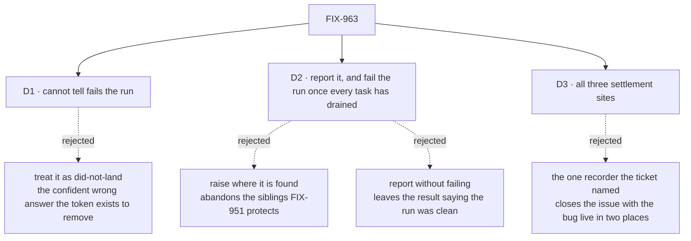

# FIX-963 · Decisions

[Spec](SPEC.md) · **Decisions** · [Rules](BUSINESS-RULES.md) · [Plan](PLAN.md)

Three decisions are the sign-off surface. One is still open.

## The tree

Solid edges are what you're signing. Dashed edges lost, and the label says why.

## D1 · When the board cannot tell whether a task's result was saved, the run fails — live fork

| | |
|---|---|
| **Instead of** | Treating *cannot tell* as *nothing was saved* — today's behaviour, and free to keep |
| **Because** | A board that cannot say whether it saved your work has not done its job, and the people who get this answer run storage we know nothing about |
| **Locks in** | Anyone running their own task store gets a new failure on any storage error the board cannot attribute, and cannot turn it off. Nor can they make the answer definite: the stamp that records a write is internal to the stores we ship, deliberately |

**Plain terms.** After a save fails, the board now asks whether the write went through. On our own stores it gets a real yes or no. On a store somebody wrote themselves it gets "no way to know" — every time, because nothing there keeps the record the question is answered from.

**The trade-off.** Failing is safe and noisy. On our stores it costs nothing, because the answer is almost always definite. On somebody else's, every unattributable storage error now fails the whole batch, where today it is one recorded task failure and the batch continues.

**My recommendation: fail.** The issue is that the board reports success on a run it knows nothing about, and *cannot tell* is that situation wearing a different hat. Staying quiet ships a fix that works on our stores and leaves the original lie standing for the group with the least visibility into their own storage. Failing loses no work; worst case it stops a batch that would have finished, which is obvious and recoverable. Staying quiet loses the signal, which is neither.

**What would change my mind:** if custom task stores are something people actually run, rather than a documented extension point nobody has taken up. I have no evidence either way. If you know of anyone, that flips me to reporting without failing — the saved entry still appears, which already beats today.

**Cost of being wrong: moderate, and it lands on a small group loudly.** They see a batch fail on their first storage hiccup after upgrading and say so immediately; softening it later is a small change, not a contract we are stuck with.

## D2 · The run reports failure, and only once every task has drained

| | |
|---|---|
| **Instead of** | Raising where the failure is found, or reporting it without failing the run |
| **Because** | Loud and contained pull against each other. Raising where it is found abandons every task that hadn't started — the bug FIX-951 shipped to fix. Reporting without failing leaves the result saying the run was clean, which is the lie this issue is about |
| **Locks in** | Runs that report success today will report failure, and `onError: "skip"` stops meaning "nothing stops this batch". The failure also lands on a saved stream entry — a shape callers read, so one we owe compatibility on |

Order matters more than the raise. Everything still running finishes first, so a caller gets the honest verdict *and* the work that completed. `onError` is not consulted: it is a policy about a task going wrong, and the substrate falling over is not a task outcome.

## D3 · All three places a board settles a task are in scope

| | |
|---|---|
| **Instead of** | The one recorder the ticket named |
| **Because** | The same two recorder blocks settle a task in three places and all three are silent the same way. The error recorder is worse than the filed one — its failure escapes and strands every task that hadn't started. The hand-off gate is a third site the earlier spec did not know existed |
| **Locks in** | Wider than the filed report, so FIX-951's containment becomes a live regression bar rather than a formality. Two runtimes gain a new failure: the inline batch, and the child run a hand-off dispatches |

The hand-off gate wraps the same recorders around a task entry in a child run, with no batch around it and no tail to report at — so the honest answer there is to fail that child run. An implementer following the earlier spec would have fixed one site of three.

## Decided, not asked

- **The write token, not a read-back of the task.** FIX-989 shipped a token minted before the write and recorded inside the same save. It survives another worker claiming the task; inferring from the task afterwards cannot.
- **The report is awaited, and its own failure never swallowed.** The obvious emit discards the promise, which would make a failing report invisible — this issue's defect inside its own fix.
- **A new entry type, and per-task attribution learns to ignore it.** Anything stamped with a task counts as that worker's output unless named as an exception.
- **No count on the board's completion summary.** Derivable from the entries already saved.
- **Neither store changes, nor the shared write helper.** One mechanism at the recorders covers all of them.

## Considered and dropped

| Alternative | Why not |
|---|---|
| Read the task back and infer what happened | Three review rounds each found a history it misreads, and the fourth established it cannot be made exact: a later transition overwrites the evidence |
| Inspect the error to tell storage failure from work failure | Guessing. The pipeline had the provenance and discarded it a step earlier |
| Move the success recorder outside the safety net | Simpler, and it buys loudness by giving up containment |
| Record the failure onto the task itself | Writes the report through the chain that just failed |
| Add a count to the completion summary | Leaves the result saying the run was clean, and does nothing for the sibling-abandoning half |
| Carry the signal on the board's own run state | Scoped to the request, not to one batch; two overlapping batches share one slot |

## Settled

- **Both halves are still live** — **CONFIRMED** against `origin/main` @ `89a5809f`, three runs each. Success path: the run reports completed with no error, and the failure appears only on entries that are never saved. Error path: the run fails with one task left mid-flight, never finished and never released. Control: a genuine worker failure with no announcement error leaves the batch reporting success, so the escape is specific to the recorder's own failure.
- **FIX-964 does not swallow this** — **CONFIRMED** from its own contract: it contains only what a good store would have refused *before* saving. It moved where the silence happens, not whether.
- **FIX-989's primitive is unused** — **CONFIRMED**: shipped, exported, documented, tested, no caller outside its own tests. Its documented example is this issue's recorder, written out.

## How it got here

- **Draft** — framed as a write that saved and then threw; classified by reading the task back; found an unfiled second half where the error recorder abandons siblings.
- **Review, three rounds** — replaced the read-back rule twice as each round found a history it misread; required the report to be awaited; forced the attribution exception once both cheaper remedies were refuted.
- **Closed on a documented limit** — reading the task back can never be exact, and what would remove the ceiling is a record of the write itself, durable enough to survive the next claim.
- **Revision** — that record shipped as FIX-989 and has no caller, so the answer is read rather than inferred, and the read-back rule and its ceiling are gone. Scope grew by one settlement site nobody had found. And *cannot tell* is a question the old design never had to ask, so it is now D1.

**Open: D1.**
