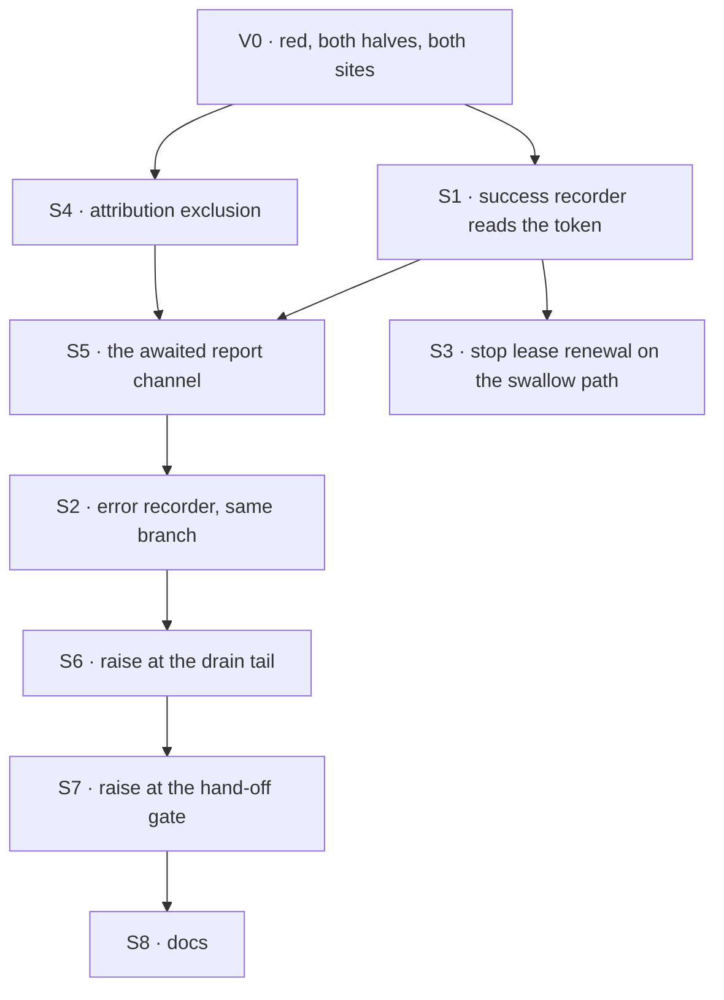

# FIX-963 · Plan

[Spec](SPEC.md) · [Decisions](DECISIONS.md) · [Rules](BUSINESS-RULES.md) · **Plan**

For the implementing agent. IDs cross-reference [BUSINESS-RULES.md](BUSINESS-RULES.md) (BR-n) and [DECISIONS.md](DECISIONS.md) (D-n). `diagnose`. One PR. Every file:line was read on `origin/main` @ `89a5809f`; **re-check before citing** — they drift.

## Surfaces

| ID | Package · role | Change | Rules |
|---|---|---|---|
| S1 | `orchestration` · `task-board/blocks/record-result.ts`, `createRecordSuccess` (~:157) | Mint `beginTaskWrite(collection.get(claim.taskId))` before the write, pass it as `write` on the existing options bag (~:188), branch on `didWriteLand` in a `catch`: `false` rethrows, `true`/`undefined` report and return. **`undefined` must also release the row** — the rethrow it replaces is what used to hand the task to the rescue's fenced `fail()`, and nothing else settles it. An advisory fenced write is declined harmlessly if the row did commit, so the same write serves both halves of the uncertainty; another shape is fine, the outcome is the requirement | BR-1 BR-2 BR-3 BR-3b BR-6 BR-7 BR-7b |
| S2 | same file · `createRecordError` (~:234) | Same branch around `advisoryFail` (~:262). `true`/`undefined` report, then take `onError`'s **return** rather than its throw (~:274–277). Same release requirement as S1, and here it is sharper: nothing follows this recorder at all | BR-1 BR-2 BR-3 BR-3b BR-9 |
| S3 | same file · `stopLeaseRenewal` (~:91) and its contract comment (~:53–93) | On the swallow path the recorder settles the row and **no `.rescue()` follows**, so renewal must stop there. Today `recordSuccess` deliberately leaves the driver running when the write throws (~:196–206) because `recordError` is about to make a fenced write — a premise this path breaks. Update the comment with the code. Ordering follows that contract: the release write is fenced, so renewal stops **after** it, not before | BR-1 BR-3 BR-3b |
| S4 | `contracts` · `src/items/task-attribution.ts`, the exclusion set (~:31–32) | Add the new component type beside `task-change` and `task-board-meta`, with its tests and `docs/architecture/items.md` | BR-17 BR-18 |
| S5 | `orchestration` · the report channel | An **awaited** emit carrying the task, which recorder, the verdict, the error text and a per-run stamp. `ctx.emit.component` can't carry it: `createEmitComponent` (`engine/src/context/createExecutionContext.ts` ~:215) is `=> void` and `void`s both emitter calls (~:269–270). The seam is one level down — `emitItemAdded`/`emitItemDone` are `Promise<unknown>` (~:149–150), already chained in that file (~:391–394). Requirements: awaited · outside the worker rescue · its own failure tested | BR-1 BR-3 BR-13 BR-16 |
| S6 | `orchestration` · `task-board/index.ts`, the drain tail | Raise after the fan-out, reading this run's report entries off the response's item buffer. **Place it after `.tap(boardExitsConnector, boardMetaCompleted)` (~:1204), not between that and the `forEach`** — FIX-1238 made the adjacency a compile-checked rule (~:1178–1203) — and before `.tap(teardownFlowState)` (~:1209), whose sibling `.rescue` (~:1210) still tears down when it throws | BR-8 BR-9 BR-10 BR-12 |
| S7 | `orchestration` · `task-board/task-entry.ts`, the hand-off gate (~:300–301) | Second settlement site: same recorders, no fan-out, no tail. The raise leaves the gate sequencer and fails the child run. Two acceptable shapes — a step after the rescued region, or rethrowing for this one class here. The requirement is the outcome | BR-14 BR-15 |
| S8 | Docs | Two EXTENDs plus `docs/architecture/items.md` — below | — |

**Nothing is removed.** No path is superseded, so say so in the PR rather than leaving the tenet-3 question unanswered. If S6 makes an `onError` branch unreachable for a bookkeeping failure, delete it.

## Sequence



No PR plan: single node.

## Checks

| ID | After | Passes when |
|---|---|---|
| V0 | — | Both halves fail against `main` with today's symptoms, at **both** sites; the FIX-951 containment scenario still passes. The harnesses that reproduced this were thrown away — this re-establishes them |
| V1 | S1 | BR-1, BR-2, BR-6, BR-7 on both built-in backings |
| V2 | S1 | BR-3 against a ref keeping no provenance. **Assert *undetermined* is its own value**, distinct from both neighbours |
| V2b | S1, S2 | BR-3b at both recorders. Red state: take the release out and assert the row is still `in_progress` with renewal stopped after the batch ends — the check has to fail before it can be trusted |
| V2c | S1 | BR-7b: a task row carrying no `incarnationId`, on a built-in backing, answers *undetermined* and not `false`. This is the case a fixture built by the board's own add path cannot produce |
| V3 | S3 | The lease driver stops on the swallow path. Red state: leave it running, assert the row keeps renewing after the batch ends |
| V4 | S4 | BR-17, BR-18 — absent from that task's item view, no extra board card, completion card intact |
| V5 | S5 | BR-13: make the reporting seam reject; the run surfaces it, including under `onError: "skip"` |
| V6 | S6 | BR-8, BR-9, BR-10, BR-16. Siblings carry a held-out value in their output, so a run that abandoned them can't pass on a status alone |
| V7 | S6 | BR-12: two sequential batches in one request, first failing, second clean and reporting success |
| V8 | S7 | BR-14: the same failure on a handed-off task fails the child run |
| V9 | S2, S6 | BR-4, BR-5 — a declined write and a parked row produce no entry and no failure. The second paths (BP-035) |

**No real-model goal check applies**, and the reason is specific rather than a punt: the behaviour is a storage failure with no model in the path, and reproducing it needs an injected announcement failure. The integration tier is where the escape emerges — FIX-951's own coverage uses the same justification.

## Pinned names

| Where | Name | Why pinned |
|---|---|---|
| The entry's verdict field | `committed` / `undetermined` | D1 turns on these being two values, not one. A reader branches on it |

Everything else is yours, including the component type's name.

## Guardrails

| Rule | Because |
|---|---|
| Mint the token **before** the write, from the task you hold; never reconstruct it afterwards | The baseline it records is what makes the answer mean anything, and the primitive says so in its own contract |
| Surface `undefined` as its own condition; never collapse it into either boolean | Collapsing restores the confident wrong answer the primitive exists to remove, and it is the permanent answer for every custom store — so the collapse would be silent and total |
| A path that stops rethrowing owes the row whatever the rethrow used to buy it | The rethrow's real job was not loudness, it was reaching the fenced write that settles the task. Dropping it silently drops that too, and the row is stuck until a lease expires |
| The fix lives in the two recorder blocks. Editing either backing means stop | That is the signal it drifted below the point where all three stores converge (tenet 5) |
| Every settlement site goes through the same branch | An invariant enforced at one of three is the review class that costs most: the reviewer finds the others for you |
| The report is awaited, and its own failure escapes every safety net | An unawaited report is not a report, and getting it wrong reproduces this bug inside its own fix |
| Assert visibility against something that survives the run, and prove containment at composition level | A diagnostic entry is where the bug has been hiding, and the escape only emerges from the full worker → rescue → fan-out composition (tenet 7) |

## Docs

- **EXTEND** `apps/docs/docs/orchestration/task-board.md` → after *"Concurrency and error handling"*: a task failing and the board failing to record it are different events, `onError` governs only the first, the board finishes draining first, and on your own store — or on rows that were already in the database before you upgraded — it will say it cannot tell. *Voice risk:* match that section's dense register and introduce "recorder" in plain terms.
- **EXTEND** `apps/docs/docs/orchestration/task-substrate.md` → *"Recording a result that may no longer apply"* and the write-provenance section below it (~:305). One paragraph: the advisory options cover a *declined* write, not one saved and then not announced.
- **UPDATE** `docs/architecture/items.md` with S4 — which types attribution excludes and **why** this one joins them. The *why* stops the next author adding a type in task scope.
- `packages/orchestration/README.md` — check only. **No new page.**

## Sketch · pseudocode, illustrative, react to the shape

```
in each recorder, around its existing advisory write:

    token ← begin a correlated write, from the task as it reads now
    try:
        write the result, presenting the token alongside the claim
    catch err:
        switch (did that write land?):
            false     → rethrow err            unchanged from today
            true      → report "committed"
            undefined → report "undetermined"  ← D1
                        AND release the row, since no rescue follows
        stop lease renewal, clear the claim, return without rethrowing

at the drain tail, after the exits tap:
    if any report entry belongs to THIS run → raise, naming them all

at the hand-off gate, which has no tail:
    the same report, and the failure leaves the gate
```

**No POC.** Both premises one would settle are settled: the bug is reproduced, and the primitive is read from its own source and tests.

## At implement time

- **Read `packages/orchestration/src/tasks/write-provenance.ts` whole, first.** Most of its 390 lines are the contract you depend on, and its header is this recorder written out.
- **Verify the token survives the advisory seam.** It rides `TaskTransitionOptions` and both wrappers pass options through unchanged — everything rests on it, so check.
- `stampWrite` is package-internal by design (`tasks/index.ts` ~:44–48). **Do not export it** to let a custom store opt in; that constraint is what D1 prices.
- **A row that predates FIX-989 answers *undetermined* forever on the not-committed path.** `incarnationId` is minted only in `buildInitialTask` (`tasks/collection/internal.ts` ~:84) and a claim carries it forward without adding one (~:838–845), so `didWriteLand`'s incarnation arm withholds before the revision arms are reached. Its own contract names this case (BP-030); do not "fix" it by backfilling a nonce onto an existing row — a manufactured identity is the confident wrong answer the field exists to prevent. If D1 lands on *fail*, this is the population that feels it on upgrade.
- Check whether a per-run stamp already exists for S5. Entries live on the per-*request* buffer and a request can run several batches. A high-water mark is not equivalent — two overlapping batches take theirs before either reports.

## Notes from review

Carried from the earlier spec, verbatim. **Inputs, not instructions.**

- "There's an existing precedent for a distinct component type here: `GOAL_SEEK_LOOP_TERMINATION_COMPONENT_TYPE` in `goal-seek-loop.ts` uses a distinct type, a `${collectionId}:...` key suffix, and sets `itemVisibility`. Worth mirroring that shape rather than inventing a new convention." — Cursor ([PR #992](https://github.com/fixpoint-labs/flow-state-dev/pull/992)) *(Still live: `goal-seek-loop.ts` ~:159, ~:456.)*
- "Co-locate the classifier next to `attemptOwnsTask` in `collection/internal.ts` rather than in the task-board layer, so the ownership rule and its inverse live together." — Cursor ([PR #992](https://github.com/fixpoint-labs/flow-state-dev/pull/992)) *(Moot — no classifier remains.)*
- "Reuse the existing scaffolding in `task-board-drain-containment.test.ts` rather than standing up a parallel harness — the two scenarios are siblings." — Cursor ([PR #992](https://github.com/fixpoint-labs/flow-state-dev/pull/992))
- "The spec carries roughly 20–30% redundant prose between Part I and Part II; several points are made twice." — Cursor ([PR #992](https://github.com/fixpoint-labs/flow-state-dev/pull/992)) *(Addressed by the revision.)*
- "read-back alone cannot distinguish these histories; preserve an atomic write outcome/version that survives the next claim." — Codex, line 215 ([PR #992](https://github.com/fixpoint-labs/flow-state-dev/pull/992)) *(**Resolved** — that is FIX-989, and consuming it is this revision.)*

## Follow-ups

- **The two recorder blocks have converged in shape** — both diagnostic, both reading the same worker state, both write-then-cleanup, and now both taking the same branch. A shared recorder seam; `improve-codebase-architecture`.
- **Two overlapping batches of one board in one request still interfere**, whatever this change does: their shared run state is scoped to the request, under one slot keyed by board name (`flow-policy-wiring.ts` ~:59, written ~:203, deleted ~:279). That is **FIX-1236**, already related here; the overlapping-batch assertion is sequenced behind it and is **not** part of this issue. *(The earlier spec sequenced it behind FIX-987, since closed as a duplicate of FIX-1236 — whose own description still calls the state per-*definition*, which FIX-1244 narrowed to per-request.)*
- **A failed announcement is still not recoverable.** This makes it visible; nothing retries it.
