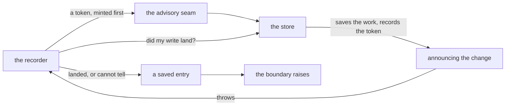

# FIX-963 · Recorder failure after a task commits is swallowed; the drain reports success

**Spec** · [Decisions](DECISIONS.md) · [Rules](BUSINESS-RULES.md) · [Plan](PLAN.md)

Bug · `orchestration` + `contracts` · medium · 1 PR · epic [FIX-980 — Honest task substrate](https://linear.app/fixpoint-labs/issue/FIX-980)

## Five people, before and after

| Someone who… | Today | After |
|---|---|---|
| **runs a batch of work and reads the result** | The work finished, the board saved it, announcing it fell over — and the result says the run completed with no error | The result says the run failed, and names the task |
| **uses `onError: "skip"` so one bad task can't stop a batch** | The same failure on the *error* path takes the board down and strands every task that hadn't started | Every task drains. Only then does the board report |
| **reads the stream to find out what went wrong** | Nothing. The failure survives only on breadcrumbs that are never saved | A saved entry naming the task and which recorder fell over |
| **hands a task off to a child run instead of draining inline** | The same silence, in a second place | The same report, and the child run fails |
| **plugs in their own task store** | Same silence | The board says it cannot tell whether the result was saved, and fails ([D1](DECISIONS.md#d1)) |

This is reachable in ordinary use, not a contrived case: announcing a task's result runs the framework's reactive dispatch and resource-change hooks inline, so any block reacting to task changes can make the announcement throw. The save already happened. Nobody is told.

**Scope grew.** The ticket describes one recorder. Two more places have the same defect and are in: the error recorder, where it is worse because it abandons siblings, and the hand-off gate, which settles a task in a child run through the same two recorders and was not known to exist when this was first specced.

## What changes


The fence is the moment the work is durably saved. Left of it, a failed write is already handled. Right of it is this issue: saved, then silent. The three rows are what the board can now find out, and the bottom one is the row being decided ([D1](DECISIONS.md#d1)).

**Nothing a caller writes changes.** No new option, no changed signature, no new call. What changes is what comes back:

```diff
  const result = await runAction("run", { userId });

- // a run whose bookkeeping fell over after saving the work:
- //   result.status === "completed"
- //   result.error  === undefined
+ //   result.status === "failed"
+ //   result.error  names the task and which recorder fell over
+ //   ...and every sibling task drained to completion first
```

## How the board finds out



The token is minted before the write and recorded inside the same save, so it survives whatever happens next, including another worker claiming the task. That is what lets the board answer instead of guessing. The primitive shipped in FIX-989 and has had no caller until now.

## What stays as it is

- **A result that legitimately arrives late stays quiet.** A worker whose task was cancelled, reclaimed or already settled is declined, not reported — FIX-951's containment property, and a hard bar here.
- **A worker that parks its own task for a human.** Neither recorder writes to it, so there is nothing to report.
- **Both stores**, and the shared write helper the epic constrains.
- **The announcement chain.** This makes a failed announcement visible. It does not retry it.

## Sign off

1. **[D1](DECISIONS.md#d1) · When the board cannot tell whether a task's result was saved, the run fails.** If wrong: anyone running their own task store gets a failed run on an ordinary storage hiccup, where today they get one recorded task failure and a batch that carries on. A live fork; the full ask is on the card.
2. **[D2](DECISIONS.md#d2) · A run whose bookkeeping fell over reports failure, and reports it only once every task has drained.** If wrong: runs that quietly succeeded today start failing, and `onError: "skip"` stops meaning "nothing stops this batch".
3. **[D3](DECISIONS.md#d3) · All three places a board settles a task are in scope, not the one the ticket named.** If wrong: the issue closes with the bug live in two of three places.

**Open: number 1.** It is also the one to weigh. What was considered and what each locks in: [DECISIONS.md](DECISIONS.md). The cases: [BUSINESS-RULES.md](BUSINESS-RULES.md).
