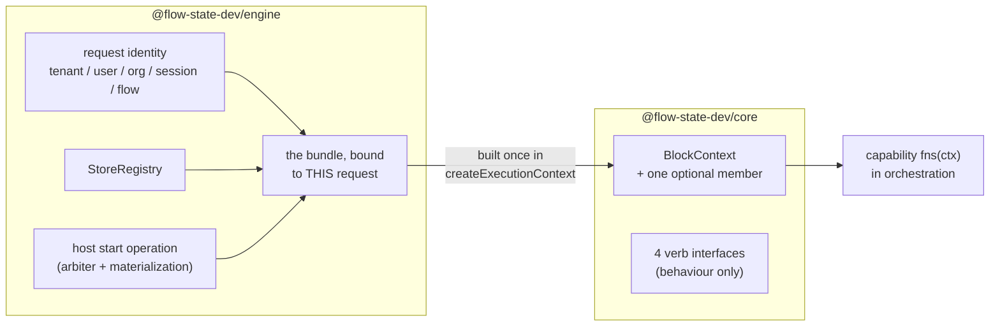

# FIX-999: Public injection seam — a capability cannot legally reach `stores` or `flow` from `BlockContext` — Implementation Spec

## Part I — The Case *(for the human)*

### 1. Problem — why it matters, why now

A capability is how FSD packages reusable behaviour: a block writes `uses: [cap]` and gets that capability's tools, context, resources, and helper functions. The helpers receive the block's context.

Some helpers need to reach the runtime executing them — to start a child session, to settle a durable row that lives in another session, to interrupt a request. Those facilities live on the *engine's* context type. A capability's helpers are typed against the context `@flow-state-dev/core` declares, and `core` must not depend on `engine`. The facilities are there at runtime and unnameable in the type.

So the only route today is to cast the context to a shape TypeScript says it doesn't have. That is fine in a throwaway and unshippable in the framework: **the cast is the only thing holding the package boundary together, and a cast holds nothing.** Nothing warns when the shape it asserts stops being true.

**Why now.** [FIX-982](https://linear.app/fixpoint-labs/issue/FIX-982) — running a claimed task outside the request that claimed it — is **Spec Approved** and blocked on this. It is this seam's **only** consumer, and it has already decided, in an approved document, exactly what it needs and in what shape. This spec's job is to supply that and stop.

The premise is verified rather than asserted: the epic's `@ts-expect-error` probe over the exported context type is satisfied today, and a control run flipping the probed keys to public ones reports the directive as unused. That probe lives in a file no type-checker visits — a small problem this spec fixes, because the issue's own success criterion is that the absence be checked by CI.

### 2. Solution in plain terms

Give the framework **one deliberate, named way** for the runtime to hand a capability the few things only the runtime can do — and make what crosses it **behaviour, not handles.**

The engine builds a small bundle of request-bound operations and attaches it to the context under a single member `core` declares. A capability reads it through the context it already gets. No cast, and the package graph is untouched: `core` names an interface, `engine` implements it.

**Four verbs ship, and the seam is closed at four.** The first three are FIX-982's, named from its approved spec rather than generalized from it; the fourth is the owner's resolution of open question 1 (§12):

1. **Start-or-adopt a detached request** — derive a child session, create it if absent or adopt it if it already exists, and start a request in it.
2. **Settle on the parent board** — read and settle *the one task row this request was dispatched for*, on the board in the session that dispatched it.
3. **Interrupt a request** — record abort intent for a descendant request, and signal it when it runs in this process.
4. **Ask whether descendant requests are still alive** — a narrow, identity-bound liveness read over requests this caller already owns.

**And one guard rail: a ceiling on concurrent detached fan-out.** This seam makes "a running request starts another request" expressible from inside a block for the first time, and FSD has no budget primitive. A configurable maximum, with a safe default, refuses the spawn that would cross it. The owner's framing is **"ceiling now, cancel later"**: stopping runaway spend is this issue's job; cross-process *cancellation* is [FIX-1026](https://linear.app/fixpoint-labs/issue/FIX-1026)'s.

**The rule that makes it safe, and the reason this is not "put `stores` on the context":** every operation closes over the running request's identity — tenant, user, org, session, flow — and exposes no parameter that can override it. A capability supplies the *target* of an operation and never the *authority* for it. The caller cannot even name a session id: it hands over a routing seed and the seam derives the key from that seed plus the running request's own identity — principal **and** parent session.

**Admission is not this seam's invention.** FIX-982's approved spec already specifies it: a transport-set `source` the caller cannot forge resolves **one fixed pre-assembled workstream core** on the current flow. This spec adopts that shape verbatim and adds one invariant it was missing — the branch **must not fall through** to `flow.actions`.

**Philosophy.** **Tenet 5 (fix at the owning layer)** — the boundary is between `core` and `engine`, so the seam belongs there, once, not at each capability that hits it. **Tenet 3 (earn every addition)** sets the size: four verbs, no speculative fifth — three earned by a named consumer with an approved spec, the fourth by an explicit owner decision that priced the alternative (§12). **Tenet 2 (composition)** — no new primitive; this injection pattern already ships twice (§3).

### 3. Tradeoffs & alternatives

**The alternative the issue proposed: expose `stores` and `flow`.** Rejected on a measured property, not a preference. `SessionStore.get(id)` takes no tenant argument — tenancy is a *convention*: build the key with `resolveSessionStorageKey`, check it with `tenantMatches`. The predicate's own doc comment enumerates who must remember. An invariant with N writers, held by discipline at each. Exposing the store layer to capability authors multiplies those writers into code the framework never reviews — and a capability's arguments are routinely model-authored (BP-031).

**The simpler approach: declaration merging.** `engine` could augment the context type from its own module, as instance settings are augmented today. No new member, no wiring, one file. Insufficient twice over: it is global and unnarrowable — every block in every app gets the store layer — and it makes `core`'s public type shape depend on whether `engine` is in the type graph, turning a locked boundary into an accident of module resolution.

**The alternative this spec supersedes, and why it failed.** The previous spec (PR [#1082](https://github.com/fixpoint-labs/flow-state-dev/pull/1082), closed unmerged) answered admission with `internalEntries` — a **fourth action form**: a per-flow map of dispatchable entries outside `flow.actions`. It was sound in isolation and wrong in context. It cost roughly eleven wiring sites (`defineFlow` block aggregation and flow-tool application, `requiresOrg` validation, concurrency classification, session-schema defaulting, three public re-entry routes, and a docs surface), it made a new app-author-facing declaration out of a framework-internal seam, and **FIX-982's approved spec had already rejected a per-coordinate dispatch lookup on record** — its Decision 2 resolves to one fixed core precisely so there is no route from dispatch to a bare block. The previous spec never read that document. Adopting FIX-982's shape deletes the form, the eleven sites, and the docs surface at once.

**Where the complexity actually is:** not the type, which is short. It is **where the seam gets constructed.** `runAction` receives the stores and the runtime config and **never a flow registry**, and seven call sites start a request — one of which, `worker-only`, deliberately has no dispatcher at all. §7.3 and §9 are mostly about that.

**Liveness: what changed, and why the narrow form survives the objection that killed the wide one.** A previous draft carried *is-this-request-alive* / *which-of-these-sessions-are-live* reads; a later draft **deleted** them, because review showed the signal unimplementable as specified — the registry advertises no sharedness, the default backing is per-process memory, and the session-keyed query had no store verb behind it. **The owner has since resolved that open question the other way** (§12): a narrow liveness verb ships here, mirroring `ActiveRequestRegistry.get(requestId)`.

The review objection was never "liveness is a bad idea" — it was "**this signal silently lies.**" Deletion answered it by removing the signal; this design answers it by making the lie **unreachable**, which is the stronger form and the one the owner asked for:

- **It is not a passthrough.** `stores.activeRequests` is not exposed, and the verb does **not** default to `listAll()` — a cross-tenant enumeration is not a shape the seam can produce. The caller asks about requests it already owns; identity filters the answer before it is built.
- **It refuses rather than guesses.** The two conditions that make the signal lie — a per-process registry, and heartbeats too slow (or off) relative to the stale threshold — are checked **at construction**, and liveness is refused when either fails. Today neither is checked: `stale-request-sweeper.ts` only *warns* that a threshold "may be too low", and it deliberately does not consult a flow's `heartbeatIntervalMs` at all. A `heartbeatIntervalMs` of `0` is supported and creates no timer (`runAction.ts:631`), so a perfectly healthy request stops heartbeating and the sweeper reaps it — the signal would report a live request dead. **That is the failure this gate exists to make impossible, and it is enforced, not documented** (Decision 3).
- **Sharedness stops being a guess.** The registry contract gains a declaration and each adapter answers it (Decision 10). Absent ⇒ *not shared*, so an adapter that says nothing gets liveness refused rather than silently wrong.

**Cost, stated:** a fourth verb, a contract addition across four adapters, and a construction-time gate that will refuse liveness in the default in-memory deployment. FIX-982's reconciler (its Decision 9) is the beneficiary — it can now ask this seam instead of naming `ActiveRequestRegistry` from `orchestration`, which it cannot legally do (§12).

### 4. Focus practices (1–5)

1. **BP-031 (never route or authorize from caller-controllable input)** — an injection seam is exactly where authorization goes wrong. The answer is structural, not validating: identity is closed over, the caller cannot name a session id, and the dispatch `source` is stamped by the seam. The unsafe call has no spelling.
2. **BP-004 (public boundary first)** — the shape of the member *is* the deliverable; the rest is wiring.
3. **Tenet 5 / one convergence point** — two of them: the seam's *construction* sits where every request-start path passes through, and its *identity binding* lives inside the operations rather than at each capability.
4. **BP-035 (second paths)** — named individually in §9: the seam absent, a host that never wired it, the `worker-only` process, an enqueue that fails after the child exists, and the *off* state (a flow with no workstream core).
5. **Tenet 3** — nothing goes on the seam without a named consumer blocked without it, **or an owner decision that overrides the count on record.** Three verbs take the first route (FIX-982, approved spec); the liveness verb and the fan-out ceiling take the second, and §12 says so rather than retro-fitting a consumer.

### 5. What using it looks like

*(None of this compiles today. Names are illustrative — the surface is the implementer's.)*

**Writing a capability that reaches the runtime — the whole point:**

```ts
const spawnCapability = defineCapability({
  name: "spawn",
  fns: (ctx) => ({
    spawn: async (args: { seed: RoutingSeed; input: unknown }) => {
      const runtime = requireRuntime(ctx);            // named error if no host wired one
      return runtime.startDetached({
        seed: args.seed,        // routing tuple; the seam derives the session id from it
        input: args.input,
        record: { topic: args.seed.topic }            // caller's own bookkeeping
      });
      // → { sessionId, requestId, adopted: boolean }
      //   or a named refusal:
      //   "key-occupied" | "no-workstream-core" | "no-start-operation" | "fan-out-ceiling"
    }
  })
});
```

**Settling the row this request was dispatched for:**

```ts
await runtime.settleParentTask({ outcome: "complete", output });
// Resolves the board in the PARENT session, addresses exactly one row — the one
// this request carries — and writes. `runtime.parentTask()` reads that same row.
//
// NOTE there is no `claim` parameter. The fence ticket is stamped into this
// child request at spawn and closed over, exactly as the parent session and the
// board coordinate are. A caller cannot name it, so it cannot be forged from a
// row read (round-4 correction; §12, S4-3).
```

**What a capability cannot write, and why that is the feature:**

```
before   ctx.stores.session.get(`${someTenant}:${someId}`)   // reachable via a cast today
after    // there is no `stores`, and no verb takes a session id. The seam DERIVES the
         // child key from the seed plus THIS request's principal AND parent session.
         // Another user's session is not a value a capability can produce — and
         // neither is another parent session's child.

before   runtime.start({ flowKind: "other-flow", actionName: "someAction" })
after    // neither parameter exists. Dispatch enters the CURRENT flow's workstream
         // core or is refused by name. `flow.actions` is not reachable at all.

before   runtime.isRequestAlive(requestId)          // and ctx.stores.activeRequests.listAll()
after    runtime.livenessOf([requestId, ...])       // BATCH, and identity-filtered: it
         // answers only for requests descended from this one, under this principal.
         // There is no `stores.activeRequests`, no `listAll()`, and no session id.
         // Refused at CONSTRUCTION — not at call time, and not silently — when the
         // registry is per-process or heartbeats cannot keep pace with the stale
         // threshold, because that is when the answer would be a lie (§7.2(d)).
```

**What an app author writes: nothing.** There is no opt-in declaration and no new flow config. A host built through the shipped entry points supplies the seam's inputs already. The one exception is a deployment running dispatching capabilities in a **`worker-only`** process, which must wire a start producer there — a construction-time error, not a surprise at the first spawn.

**What happens with no host** (a unit test, a mock context):

```
ctx.cap.spawn.spawn({...})
  → throws by name: this capability needs a runtime host; none is wired.
     Not `undefined is not a function`, and not a silent no-op.
```

### 6. Decisions & rules — the sign-off surface

1. **What crosses the seam is behaviour, not handles. No `core` type ever names a store, a flow instance, a session record, or a task row.**
   *Rejected:* `stores` / `flow` on the context (the issue's own sketch); module augmentation from `engine`; returning a `SessionRecord` on a conflict.
   *Locks in:* every future addition is a named verb someone reviews, rather than a surface that grew by transitivity. The cost is real and stated: a consumer needing something the seam doesn't expose comes back here for a verb instead of composing one itself. Anything the seam returns from another session is a narrow, **untyped** value the consumer parses with its own schema — `core` cannot name `orchestration`'s types either.

2. **Every operation closes over the running request's identity at construction. Identity is never a parameter — and neither is a session id.**
   *Rejected:* accepting `tenantId` / `userId` / `orgId` and validating them; accepting a `childKey` the caller names; **accepting the claim ticket as a settlement argument** — round 4 found that one and it was this decision's own rule being broken in the one place it matters most (§7.2(b), §12 S4-3). The ticket is stamped into the child request at spawn and closed over, like the parent session and the board coordinate.
   *Locks in:* BP-031 structurally. The caller hands over a **routing seed**; the seam derives the child session id by hashing that seed together with the running request's full server-derived identity — **the principal and the parent session**. So two users cannot land on one child even when a model authors the same topic, and neither can one user's two parent sessions. This is the structural form of the defect [FIX-1022](https://linear.app/fixpoint-labs/issue/FIX-1022) fixes generally, and it holds on this path **whether or not FIX-1022 has landed** (§12).
   **Why the parent session is part of the *identity* rather than part of the *target*.** Every other verb here is authorised by descent, not by name: settle resolves the board in the session that dispatched this request, and interrupt and liveness answer only for a session whose parent chain reaches the current one. A child is therefore unreachable except *through* the parent that owns it — so the parent is part of what the child **is**, and a key that omits it names a child two different owners can both claim. Round 3 found that hole and it was real, not cosmetic: hashing `[principal, seed]` alone let one user's second parent session **adopt the first session's child**, after which the adopted work settled onto the first board and was invisible to the second one's interrupt and liveness checks — both of which walk the parent chain. Putting the parent in the derivation makes the collision inexpressible rather than rejected, which is the same posture as the cross-user case (§12, S3-1).

3. **The seam carries exactly four verbs, and is closed at four: start-or-adopt a detached request · settle on the parent board · interrupt a request · read liveness for descendants you own.**
   *Rejected:* a passthrough liveness read (`ctx.stores.activeRequests`) and a `listAll()`-shaped one — **both still rejected**, and the second is why this verb is batch-and-filtered rather than an enumeration; **deriving liveness by complementing `listStale()`** — see below, it cannot answer the question; **lease renewal as the fallback signal** — it stays a rejected alternative in [FIX-1005](https://linear.app/fixpoint-labs/issue/FIX-1005) §3 and is not adopted here; a `flows.get(kind)` accessor; a general cross-session resource read (the epic's OQ-F, still deferred); a fifth verb of any kind.
   *Locks in:* three of the four are FIX-982's, read off its approved spec rather than generalized from it. **Start-or-adopt is one verb** because the child's creation and its request cannot disagree, and because a transient enqueue failure must not permanently occupy a derived key — adoption starts a request in an existing child, which is also the *normal* path when a second task reuses a topic. **Settle is read-then-write on one row** — the row this request was dispatched for — because the fence (FIX-982's claim ticket) is minted from the row the same operation verifies; splitting them would make the ticket caller-carried, the shape FIX-981 rejects.

   **Interrupt** targets a request in a session descended from the current one, same principal; nothing else is addressable. **Its contract is what the engine actually delivers today, not what a previous draft claimed.** Review found — and the code confirms — that persisting `abortRequested` does not deliver an abort: the heartbeat timer calls only `registry.heartbeat(requestId)` (`runAction.ts:631-638`) and never reads the flag; the flag is read once, inside the terminal `catch`, *after* `composedSignal` already fired, purely to tell an intentional abort from a dropped connection (`runAction.ts:1561-1570`); and `abort-routes.ts:59-61` fires the in-process controller only when the target runs in the same instance. So the verb promises exactly two things and reports which happened: it **records** durable intent, and it **signals** when the target is in this process. **It records that intent through [FIX-1026](https://linear.app/fixpoint-labs/issue/FIX-1026)'s conditional field write, not through a full-record `set`** — writing the flag the way `abort-routes.ts:37-57` does would let a target that finished between the read and the write be **resurrected as `in_progress`**, and `expectedVersion` cannot express the status predicate because terminal writes persist `version` unchanged (`runAction.ts:222-244`). A third outcome follows and is stated rather than hidden: if the target is already terminal the predicate fails, nothing is written, and the verb **refuses by name**. That is an outcome, not a delivery state, so the `signalled`/`recorded` split FIX-1026 relies on is unchanged (§7.2(c), §12). **Cross-process delivery is not promised here — it is [FIX-1026](https://linear.app/fixpoint-labs/issue/FIX-1026)'s, and that issue now has its own approved spec** ([PR #1095](https://github.com/fixpoint-labs/flow-state-dev/pull/1095)): the running process reads the flag on the heartbeat tick it already runs and fires the same local controller, so this verb's `recorded` becomes a delivered abort without its result shape changing. This is the same deferral the owner made when choosing "ceiling now, cancel later" (Decision 11), and it is now a scheduled piece of work rather than an open question. A verb that claimed cross-process cancellation *today* would be the one kind of lie this seam cannot afford: a caller that believes runaway work was stopped, and stops watching.

   **Liveness** is the owner's resolution of open question 1, and it ships in the one shape that cannot lie. It **takes a batch** of request ids — the caller-facing shape the owner asked for, and what keeps FIX-1005's reconciler from an N+1 round trip through the seam — answers only for requests descended from the caller under the same principal, and returns a plain alive/not answer per id: never an entry, never another tenant's row.

   **Its backing read is `ActiveRequestRegistry.get(requestId)`, bounded by the ids the caller passed — not `listStale()`.** Round 3 caught this and it was a genuine defect: `listStale(thresholdMs)` returns *registered* entries older than the cutoff, and a terminal request is **deregistered** (`stores/types.ts:576` — *"Remove a request from the registry. Called on terminal (success/failure)"*; `runAction.ts:1304`, `:1542`, `:1698`). So a completed request and a freshly-registered healthy one are **both absent from the stale set**, and neither reading of that set answers the question: complementing it reports finished work as **alive**, and treating membership as alive reports healthy work as **dead**. The first of those is the one wrong answer this whole milestone exists to prevent — a consumer that believes work is still running when it has finished will wait forever, and one that re-reads it the other way will run it twice. `get()` is what Decision 3 always said this verb mirrors; using it per id, bounded by the caller's own set, is that mirror rather than a departure from it. The cost is stated in §7.2(d): the number of registry reads is bounded by the caller's set, not by one.

   **And the semantics are stated rather than implied: absence means "no live registration was found", never "definitely dead."** A request that has finished, one that was never registered, and one whose registration was lost are indistinguishable to this verb, by construction. Every consumer must treat *not-live* as permission to stop waiting, **never** as proof that work did not happen — re-dispatching on a not-live answer alone is how double execution gets shipped. FIX-1005's reconciler therefore corroborates against durable board state before it re-runs anything (§12).

   **The enablement gate is enforced at construction, not documented, and it has four arms — all in one place.** Liveness refuses to enable unless **(i)** the request registry **declares itself shared across processes** (Decision 10), **(ii)** the flow's `heartbeatIntervalMs` is non-zero and fast enough for the sweeper's stale threshold, **(iii)** **a stale-request sweeper is actually running at a non-zero cadence**, and **(iv)** **the dispatch path has an observable claim handoff** — which externally-dispatched deployments do not, because `FlowDispatchHandle` exposes only `requestId` / `finished` / `abort` and the queue adapter resolves at enqueue (`transports/dispatcher.ts:41-59`, `bullmq/src/dispatcher.ts:36-75`), so nothing can keep an enqueued entry honestly warm (round 5; §7.2(d)). All four are load-bearing against real code, and each corresponds to a supported configuration that makes the signal lie in a different direction. Arm (ii): `heartbeatIntervalMs: 0` is supported and creates no timer, yet the sweeper still reaps the healthy request — and the sweeper deliberately never consults the per-flow interval (`stale-request-sweeper.ts:40-42`), so nothing today relates the two; the signal reports live work **dead**. Arm (iii) is round 4's addition and is the mirror image: `staleSweepIntervalMs: 0` is a supported option (`flowstate/types.ts:177` → `createFlowApiRouter.ts:353-365` → `intervalMs`), and `createStaleRequestSweeper` then returns `{ dispose: () => {} }` and starts nothing at all. Nothing ever removes a crashed worker's entry from a *shared* registry, so `get()` reports it **live forever** — reconciliation blocks and the fan-out ceiling holds capacity for a dead request, permanently. **Arm (iii) is the one whose failure deadlocks rather than overspends**, which is why it is a hard gate arm and not a documented caveat.
   **Cost, stated:** the default in-memory deployment gets liveness refused by name at construction; so does any deployment that has deliberately turned sweeping off; and so does any deployment that dispatches to an external worker. That last one is the widest of the three and it is named rather than worked around. It is the intended outcome — a refusal an operator can see beats a boolean that is wrong under load. Keeping all four arms in the gate, rather than pushing (iii) into a per-read staleness check or (iv) into a per-call branch, is deliberate: one place answers *"can this signal be trusted here?"*, and the read stays a plain lookup.

4. **Admission is FIX-982's shape, adopted verbatim: the transport-set `source` resolves one fixed pre-assembled workstream core. The branch does NOT fall through.**
   *Rejected:* `internalEntries` — a fourth action form, ~11 wiring sites, already rejected on record by FIX-982's Decision 2; a source gate that falls through, which is **unsound** (`resolve-action-core.ts:107` returns `flow.actions[actionName]` for any unrecognized source, so a stamped source admits everything).
   *Locks in:* the security boundary, as one invariant instead of a form. FIX-982's P2 declares the branch; this spec states the rule it must satisfy — **absent core ⇒ named refusal, never `flow.actions`** — and ships the test that fails if it ever falls through. There is no route from the seam to a caller-addressed action, so no admission model is invented and none is bypassed. **Still the widest point of the seam and where to push hardest.**

5. **The seam names no flow. It dispatches into the flow the current request is already running.**
   *Rejected:* a `flowKind` parameter and cross-flow dispatch (the previous spec's Decision 4).
   *Locks in:* four problem classes at once, because they were all consequences of targeting a *different* flow — binding the child to the wrong flow kind, validating the target's `requiresOrg` on a path the host never validates, applying a foreign flow's session-state defaults, and resolving concurrency against a foreign action map. **The evidence is FIX-982's own approved shape:** its workstream core is assembled *"once per flow at definition time"* from bindings the board's drain sequencer stamps, and the board is declared in the flow whose action drains it — so the target flow *is* the current flow. The epic's earlier "a Workstream may run a different flow" measurement predates that fold and described the per-coordinate binding FIX-982 replaced. **If a future consumer genuinely needs a cross-flow target, that is a new decision on this seam, not a parameter to add.** This is the decision to challenge if you think FIX-982's core can sit in a flow other than its board's.

6. **Hosts supply *construction inputs*; `createExecutionContext` builds the bundle once. A process that executes requests but cannot start one fails at construction, by name.**
   *Rejected:* the optional-and-absent shape the durability provider uses (`ctx.suspend`); passing a pre-built bundle at each call site.
   *Locks in:* seven request-start sites forward dependencies they mostly already hold, and exactly one place constructs; nested scopes inherit the same object reference, as `stores` already does. **The premise that every process can start a request is false:** `createFlowState.#buildRuntime` skips `worker.createDispatcher(runtime)` when `mode === "worker-only"` (`createFlowState.ts:304-305`), and the queue worker calls `runAction` with registry, stores and runtime config only. So capability-initiated dispatch is a **declared deployment property** — a deployment whose capabilities dispatch must supply the start operation in every process that executes them, `worker-only` included. **Cost, stated:** `worker-only` gains a wiring obligation it does not have today, and that is a change to a shipped mode.

7. **Dispatch composes the *host-level* start operation, and start is not reported until the dispatcher has accepted it.**
   *Rejected:* calling `FlowDispatcher.dispatch` directly; awaiting `finished`.
   *Locks in:* the arbiter is host-owned and singular (`createInboundTransportHost.ts:121`), and enqueue-time materialization writes the `in_progress` record *before* the worker picks the job up, deregistering on a failed hand-off. Bypassing the host skips every action's concurrency policy and returns a request id that 404s under queue latency. The verb therefore awaits the host's `accepted` promise — an enqueue that rejects after the child was created must surface as a failure, not as a `Started` with nothing running.

   **Correction from review, and it is a real hole rather than wording.** A previous draft said the verb awaits `accepted` *"where one exists"*. It does not exist where it is most needed. `accepted` is assigned **only** on the external-dispatcher branch (`:335`); the code leaves it `undefined` for in-process and says so (`:205-208`). But the in-process **queued** branch (`decision.policy === "queue"`) performs exactly the same enqueue-time materialization (`:237-260`) and hands back a handle whose `accepted` is `undefined` — so "await where one exists" degrades to "don't await" on the one in-process path that can defer a start. A detached spawn there would report Started before the record is discoverable, and before a failed materialization is known. **So this spec requires the host to expose acceptance for that branch too:** the `materialized` promise already exists at `:237` and simply is not surfaced, so this is a narrow change, and `accepted` becomes non-optional wherever a start is deferred. Awaiting an absent promise is not a weaker guarantee, it is no guarantee — and it would have shipped looking like one.

8. **The *member* is framework-facing and undocumented in `apps/docs`. The *fan-out ceiling* and the *liveness gate* are operator-facing and documented.**
   *Rejected:* a documented app-author surface for the seam; and — after the owner's answers — the previous draft's flat "no `apps/docs` change", which is no longer true.
   *Locks in:* the boundary is legal (the whole issue) while the seam's contract stays cheap to change. There is still **nothing an app author declares** to use the seam, so "framework-facing" remains a true description of the member rather than a withheld doc page. But Decision 11 adds a spend brake with a default an operator will eventually raise, and Decision 3's gate will refuse liveness by name on the default in-memory registry — both are deployment behaviour someone hits without ever writing a capability, and an undocumented refusal reads as a bug. §11 splits them accordingly. Promoting the member itself later stays additive.

9. **The absence of the runtime facilities from the public context type is pinned by a type test CI actually runs.**
   *Rejected:* leaving the probe in a file no type-checker visits, which is where it lives today.
   *Locks in:* the issue's own success criterion. The premise this seam rests on — that `stores` and `flow` are not on `BlockContext` — is currently asserted by an `@ts-expect-error` that nothing checks, so it can go stale silently. Pinning it is small and is the difference between a verified premise and a remembered one.

10. **Every request registry declares whether it is shared across processes. Absent ⇒ not shared. FIX-999 owns this flag; it does not get its own issue.**
   *Rejected:* inferring sharedness from the adapter's identity (a `postgres` name is not a contract); documenting the requirement and trusting the operator — the thing the owner explicitly ruled out; parking the flag in FIX-1005.
   *Locks in:* `ActiveRequestRegistry` (`stores/types.ts:567-585`) exposes `register` / `heartbeat` / `deregister` / `listStale` / `listAll` / `get` and **advertises nothing about sharedness** — which is precisely why review called the liveness signal unimplementable. One declaration on the contract, answered by each of the four shipped adapters (in-memory, filesystem, SQLite, Postgres), turns Decision 3's gate from a hope into a check.
   **Default is fail-closed:** an adapter that does not declare is treated as **per-process**, so a third-party registry gets liveness *refused* rather than *wrong* (BP-030 — `== null`-guard the new field; BP-031's posture on unverifiable input). In-memory declares not shared. SQLite and filesystem back onto a shared path in some deployments and a per-process temp dir in others, so where the adapter cannot know from its own construction, **it declares not shared.**
   **The declaration is a property of the *constructed store*, not of the adapter's name** — a correction round 3 forced, and the rule above already implied it. `createPostgresStores` accepts three shapes, and one of them is `{ executor }`, documented as *"a QueryExecutor-compatible client (e.g. PGlite for testing)"* (`store-postgres/src/index.ts:49`) — process-local by construction, which the adapter already knows and already branches on (`:78-82`, where it disables `LISTEN` for exactly that reason). A flat *"Postgres declares shared"* would therefore enable liveness on a registry no other worker can see, which is precisely the false answer this gate exists to prevent. So Postgres declares shared on the pooled and connection-string shapes, and **not shared** when handed an executor it cannot vouch for. Same rule, applied at construction rather than at the package name.
   **The ownership call, since the owner flagged it as unassigned between FIX-999 and FIX-1005:** it belongs **here**, in this PR, because *this* issue is the one that cannot be correct without it — Decision 3's gate is required to be enforced, and its predicate is unknowable until adapters answer it, so shipping the flag elsewhere reduces FIX-999's hard requirement to documentation, the exact outcome that was rejected. FIX-1005 is `Backlog` with no spec; making an in-flight hard requirement wait on an unspecced issue inverts the dependency. **And it does not want its own issue:** a boolean plus four adapter answers is roughly thirty lines, it has no meaning without a consumer to gate on it, and splitting it would buy a cross-PR merge dependency for nothing. *If* it turns out to ripple — a migration, or third-party adapters we need to shepherd — that is the signal to split it, and the implementer should raise it rather than absorb it.

11. **A configurable ceiling on concurrent detached fan-out ships here, with a safe default. Cross-process cancellation does not.**
   *Rejected:* shipping no bound and filing a follow-up (the previous draft's lean, now overridden on record); a *depth* bound, which does not bound spend — one level of runaway breadth costs the same as ten of depth; blocking this seam on FIX-1026. **And three remedies round 3 proposed for the degraded mode below, all declined on the owner's call:** a **durable lineage-wide counter** — a new persisted primitive, which is a budget system built sideways; **refusing detached spawning outright wherever liveness is unavailable** — that is every default in-memory deployment, i.e. the setup most people try first; and an **atomic lineage reservation** with release on failure, which the registry contract cannot express today (`stores/types.ts:567-585` offers `register` / `heartbeat` / `deregister` / `listStale` / `listAll` / `get`, and nothing compare-and-set).
   *Locks in:* the owner's **"ceiling now, cancel later."** This seam is what makes in-block spawn expressible for the first time, and FSD has no budget primitive, so the brake ships with the mechanism rather than after the first bill.

   **What it bounds, stated once and without qualification: a single request's own detached descendants. In every mode.** Not a lineage, not a tree, not a deployment. At spawn the seam counts the live detached children **this request** started and refuses by name (`fan-out-ceiling`) at the ceiling. **Default: 32** — high enough that FIX-982's use, bounded by its board width, never reaches it; low enough that one runaway loop stops in seconds. The implementer confirms that number against FIX-982's actual board width before shipping it.

   **Round 5 narrowed this from "lineage-wide", and the narrowing is the honest part.** A previous draft claimed the ceiling was scoped to the caller's descendant *lineage* and treated `32^depth` as a degraded-mode caveat. It is not a caveat — it is the general case. The liveness verb answers only for requests descended from **the caller** (§7.2(d), and that bound is Decision 2's authority model, not an implementation shortcut), so a spawning child **cannot see its siblings or any other branch of the same root**. Each child therefore gets a fresh effective quota of 32, and breadth reaches `32^depth` **with a shared registry too**. The document was advertising a bound it does not deliver, which is precisely what Decision 11 had been rewritten to stop doing.

   **So the guarantee is narrowed rather than the mechanism grown.** *Rejected, deliberately:* stamping a lineage-root identity into descendants and counting against it. That is a distributed counter in everything but name — it needs an atomic reservation the registry contract cannot express (`stores/types.ts:567-585` has nothing compare-and-set), and it is **[FIX-933](https://linear.app/fixpoint-labs/issue/FIX-933)'s** job, not this seam's.

   **What this buys, in one line: one runaway request is stopped at 32; a runaway *tree* is not bounded by this mechanism at all.** Say that in the docs, say it in the refusal, and do not let a reader infer more. The real spend brake is a cost/token budget — FIX-933, *Cost/budget ceiling for delegated work* — which bounds the thing that actually costs money. This count-based ceiling is an explicit proxy, shipped now because this seam ships now.

   **The remaining mode difference is smaller than it was, and it is concurrent-vs-cumulative.** Where liveness is available the seam counts this request's **live** children, so completed work frees capacity. Where the gate refuses it (Decision 3), liveness is uncountable and the ceiling falls back to **spawns issued** by this request, never decremented — the same number, a stricter reading of it. Neither is lineage-wide. **Both modes are announced by name at construction**, so an operator learns which reading is in force when the host is built rather than from a bill; that construction signal is the same posture as the gate's own refusal, one step down in severity because the seam still works.
   **And the ceiling is advisory, not a hard maximum.** It is check-then-create against a count, with no atomic reservation to make it otherwise, so spawns arriving together near the limit can each observe a below-ceiling count and overshoot. Round 3 raised this and it holds. It is stated as best-effort rather than engineered away, for the same reason as the paragraph above: a hard maximum needs the durable reservation primitive that FIX-933 is the right home for. A brake occasionally exceeded by a few still stops a runaway loop; a brake nobody can see does not.
   **Cost, stated:** the ceiling refuses, it does not cancel. Work already running above the line keeps running. **FIX-1026 owns cross-process cancel** — now with its own approved spec ([PR #1095](https://github.com/fixpoint-labs/flow-state-dev/pull/1095)) — and until it lands the ceiling is the only brake.

**Non-goals** — the spawn capability itself and everything it composes (FIX-982); **populating** the workstream core (FIX-982 P2 — this spec declares the property and the terminal branch that reads it, per §7.4, but ships no core); `ctx.parentSession`; a workstream-management capability; a result-read surface (FIX-1008, cancelled); a general cross-session resource read (the epic's OQ-F); **cross-process abort delivery and cross-process cancellation (FIX-1026)** — the interrupt verb records intent and signals in-process only (Decision 3); the general fixes for [FIX-1021](https://linear.app/fixpoint-labs/issue/FIX-1021) / [FIX-1022](https://linear.app/fixpoint-labs/issue/FIX-1022), which are live defects on `main` with their own issues; any change to how capabilities are declared, resolved, merged, or memoized.

**Size:** **Large — one PR.** The owner's two answers moved this off Medium, and the honest accounting is: four verbs rather than three, a contract addition across four store adapters, a construction-time enablement gate, the fan-out ceiling, and the minimal `flow.workstream` property plus its terminal resolver branch. The dominant cost — construction wiring across the seven request-start sites — does not grow, which is why this stays **one PR** rather than becoming a PR plan.

**Round 4 added two things to that accounting; round 5 shrank one of them.** The scope item is the **queued-state heartbeat**, and round 5 confirmed it is only implementable on the **in-process queued branch** — the externally-dispatched path has no claim event to stop on and is handled by a gate arm instead (§7.2(d)). So it is a change to a shipped path, but a narrower one: the same file and the same branch as Decision 7's `accepted` change, with a stop event the host already holds. It is not optional — without it the fan-out count under-reports during a burst, which is when the ceiling matters. The other item is a **landing dependency rather than work**: the interrupt verb consumes [FIX-1026](https://linear.app/fixpoint-labs/issue/FIX-1026)'s conditional field write and cannot ship before it (§12). Still **Large, one PR** — the seam's own surface is unchanged and the ordering is a wait, not a split.

Three flags for the implementer to raise rather than absorb: if the adapter declaration ripples into a migration (Decision 10); if the per-request fan-out count cannot be made a single call into the seam; or if the in-process queued heartbeat turns out to reach beyond that branch — that last one is the likeliest of the three to be bigger than it looks, and it is the one that would justify splitting a PR. **A fourth thing is explicitly not a flag but a refusal:** if the ceiling looks like it should bound a tree, do not build that here (Decision 11, §13 item 12).

---

## Part II — The Build Plan *(for the implementing agent)*

### 7. Technical design

#### 7.1 The shape

One member and its supply chain. Today a capability's helpers see the context `core` declares; the engine's additions are on a type it cannot name. After this, one member on the declared type carries request-bound operations the engine builds.



The member is **optional** on `BlockContext`, matching the shipped precedents (`_markTaskScope?`, `_writeToolObservation?`, `suspend?` — `packages/core/src/types/block.ts`). Optional in the *type* is not optional in *deployment*: Decision 6 makes a host that executes requests without it a construction failure. The optionality exists so a hand-built test context still type-checks, and the consumer's accessor throws by name when the member is absent.

#### 7.2 The four verbs

**(a) Start-or-adopt a detached request.** Takes a routing seed and an input. Derives the child session id as a hash of `[principal, parent session, seed]` — the caller never names it, and never supplies any of the three. Then:

- **Absent** → create the child (create-if-absent, [FIX-1007](https://linear.app/fixpoint-labs/issue/FIX-1007)'s `expectedVersion: "absent"`), applying the flow's session-state defaults before the conditional write, and start.
- **Present and the stored routing tuple matches the seed** → adopt and start. This is the ordinary second-task-same-topic path, and it is also what makes a failed enqueue recoverable rather than permanently occupying the key.
- **Present and the tuple does not match** → named refusal (`key-occupied`). No record crosses the seam; the discrimination happens inside, and the consumer gets a name.

**The parent session is in the key, not just on the record — round-3 correction (§12, S3-1).** A derivation over `[principal, seed]` alone collides across *one user's* two parent sessions: a model that authors the same topic twice, from two boards, derives one key. The adopt branch then matches on the routing tuple and hands session B's task the child that session A owns, whose `parentSessionId` still points at A. Everything downstream follows the wrong lineage — settle writes to A's board (§7.2(b) resolves the parent from the server-stamped parent session), and interrupt and liveness both refuse for B because their descendant checks walk a parent chain that never reaches it (§7.2(c), §7.2(d)). B's work becomes unsettleable, uninterruptible and invisible. With the parent in the derivation, B derives its own key and the two lineages never meet — inexpressible rather than rejected, exactly as the two-users case is (Decision 2).

The child inherits tenant, user, org and flow kind from the current request, and records the current session as its parent. Start goes through the host operation (Decision 7) and awaits acceptance.

**Session-state defaults are not optional.** `session-routes.ts` parses initial state through the flow's session state schema *before* persisting, precisely so typed block reads never observe missing keys, and execution does not retroactively initialize an existing record. A child created by this verb bypasses that route, so the verb must apply the same defaulting.

**(b) Settle on the parent board.** The request carries, server-stamped at spawn, the parent session id and the board/task coordinate. The verb resolves the collection **in the parent session's scope** and exposes exactly two operations against **one row**: read it, and settle it (complete or fail) presenting the caller's fence.

The bound is the point: this is not a cross-session resource browser. One coordinate, one row, both server-derived. The read exists because FIX-982's worker body needs the row it is working — its content, its status, its attempt — and settling is the same operation's other half, against the same coordinate.

**The claim ticket is stamped, not passed — round-4 correction (§12, S4-3).** A previous draft took `claim` as an argument to the settle operation, which contradicted Decision 2 in the one place it matters most. `claim-ticket.ts` is explicit that tickets are *"server-derived and never caller-supplied (BP-031)"* and that *"a hand-assembled ticket is an ownership assertion nobody checked"* — and every one of the ticket's four fields (`collectionId`, `taskId`, `attempt`, `createdAt`) is **readable off the task row this very verb exposes.** So a displaced child — one whose lease was reclaimed and handed to a successor — could read the row, observe the successor's `attempt`, reconstruct that attempt's ticket, and settle over work it no longer owns. That is the defect shape [FIX-981](https://linear.app/fixpoint-labs/issue/FIX-981) shipped a fix for, reintroduced one layer up by a parameter.

So: **the ticket joins the set of things the server stamps into the child request at spawn** — beside the parent session id and the board/task coordinate — and the settle operation **has no `claim` input at all.** The mint point does not move: the parent's start gate still mints it from the claim the substrate just committed, exactly as FIX-982 specifies. What changes is that it travels in the request envelope rather than through a capability's arguments, so the child holds authority it cannot restate. Read and settle remain one verb because they address one coordinate, not because the read supplies the fence.

`scopeIdentityId` resolves `session` to the *current* session key, which is why the ordinary resource path cannot do this and a seam is required at all (the epic's N66/N68). The value returned is untyped (Decision 1); `orchestration` parses it with its own task schema.

**(c) Interrupt a request.** Marks a request for abort. Authority is closed over: the target must be a request in a session whose parent chain reaches the current session, under the same principal. The seam performs that check with facts it reads itself; there is no parameter that widens it.

**Delivery is the part a previous draft got wrong**, and the correction narrows the contract rather than adding machinery (Decision 3). The verb does two things and **returns which one happened**:

| Target | What the verb does | What the caller is told |
|---|---|---|
| Runs in **this** process | Persists `abortRequested` **conditionally on the target still being `in_progress`**, then fires the in-process controller | `"signalled"` — the run is being torn down |
| Runs in **another** process, or is queued | The same conditional persist, and nothing else | `"recorded"` — intent is durable, **delivery is not promised** |
| **Already terminal when the write lands** | Nothing. The predicate fails and no field is applied | A **named refusal** — the request finished on its own |

**The write is conditional, and the primitive already exists — round-4 correction (§12, S4-1).** A previous draft said this verb mirrors `abort-routes.ts`. That route reads the record, checks `status !== "in_progress"` and returns 409, then writes `set(requestId, { ...record, abortRequested: true }, "any")` (`abort-routes.ts:37-57`) — an **unconditional** full-record write against a copy read earlier. Between the read and the write the target can finish and commit its terminal record; the interrupt then writes its stale `in_progress` copy back over that result, **resurrecting a dead request as `in_progress` after its registry entry is already gone.** Mirroring the route means inheriting the race.

**`expectedVersion` is not the fix.** Terminal writes go through `patchRequestRecord(..., "any")`, which spreads the record it just read and persists `version` **unchanged** (`runAction.ts:222-244`, whose own comment states the `"any"` last-write-wins intent). So the version an interrupt read is still current after a terminal commit, and a version-checked write validates and lands anyway. The predicate this needs is about **status**, and no version arithmetic reaches it.

So this verb **consumes [FIX-1026](https://linear.app/fixpoint-labs/issue/FIX-1026)'s conditional field write** rather than inventing one: *apply these named fields to this request if its current status is one of these*, evaluated and applied atomically inside the adapter, returning whether the predicate held. That verb is deliberately general rather than abort-shaped, and FIX-1026's own §12 names **this issue** as one of the two reasons it was built that way. Two consequences worth stating: FIX-1026 also takes `abortRequested` **off `set`'s surface entirely** — a full record handed to `set` cannot change it in either direction — so once that lands there is no other legal way for this verb to record intent; and the predicate failing is **not** a delivery distinction, so FIX-1026's promise that this verb's `signalled`/`recorded` shape is unchanged still holds. The refusal is a third *outcome*, not a third delivery state. Dependency recorded in §12.

The reason is mechanical: the heartbeat timer calls only `registry.heartbeat(requestId)` (`runAction.ts:631-638`), nothing polls the flag, and `runAction` reads it exclusively inside its terminal `catch` once `composedSignal` has already fired — to label an abort that some *other* mechanism caused. A flag nobody reads is not a delivery path. Closing that is [FIX-1026](https://linear.app/fixpoint-labs/issue/FIX-1026)'s, and **it now has its own approved spec — [PR #1095](https://github.com/fixpoint-labs/flow-state-dev/pull/1095)** — which takes exactly the shape this seam declined to build on its way past: the poll rides `runAction`'s existing heartbeat tick and converges on the same in-process controller, so no new status and no second teardown path appear. **This verb's result shape does not change when that lands** — `"recorded"` simply starts being delivered within one heartbeat interval on a deployment that meets FIX-1026's two requirements. Until then the honest verb reports `"recorded"`, and the fan-out ceiling (§7.5) is what actually bounds the damage.

**(d) Liveness for descendants you own.** Takes a **batch** of request ids and returns, for each, whether it is still live — nothing else. Not an entry, not a record, not another tenant's row (Decision 1). Identity filters *before* the answer is built: an id outside the caller's descendant chain, or under a different principal, comes back indistinguishable from an unknown id, for the same reason interrupt uses a not-found shape.

**What "not live" means, stated so nothing has to infer it.** A `false` answer means **no live registration was found for that id** — nothing more. A request that completed, one that never registered, and one whose registration was lost are indistinguishable here by construction, because terminal requests are **deregistered** (`stores/types.ts:576`; `runAction.ts:1304`, `:1542`, `:1698`). So *not live* is permission to **stop waiting**; it is never proof that work did not run, and re-dispatching on it alone is how double execution ships. Any consumer that re-runs work must corroborate against durable state it owns — for FIX-1005's reconciler that is the board row, which it needs anyway (§12).

Three implementation notes that are constraints rather than taste:

- **Batch at the seam; `get()` underneath — and *not* `listStale()`.** The caller passes a set and gets a set back, which is the shape the owner asked for and what keeps FIX-1005's reconciler from an N+1 through the seam. The **backing read is `ActiveRequestRegistry.get(requestId)`, issued for the ids the caller supplied.** A `listStale(threshold)`-backed read was the previous draft's preference and **cannot answer the question**: `listStale` returns *registered* entries older than the cutoff, and terminal requests are deregistered — so a completed request and a freshly-registered healthy one are **both absent** from it. Complementing the stale set reports finished work as **alive** (the double-execution answer); treating membership as alive reports healthy work as **dead**. Neither is usable, so the set-shaped read is not an optimisation of this verb, it is a different and wrong verb. `listAll()` remains rejected for a separate reason: it enumerates across tenants.
- **The read count is bounded by the caller's set, and that bound is the honest cost.** Up to N registry reads for N ids the caller already holds — never a scan, never a read whose size is the registry's. The caller's set is itself bounded by the fan-out ceiling (§7.5), so N is small by construction. This is a real cost the stale-set shape appeared to avoid, and it is the price of an answer that is correct.
- **The enablement gate runs at construction, and it has four arms** (Decision 3). Liveness is wired only when **(i)** the registry declares itself shared (§7.6), **(ii)** `flow.request?.heartbeatIntervalMs` is non-zero and comfortably below the sweeper's stale threshold — the sweeper's own guidance is `staleThresholdMs >= 2 * heartbeatIntervalMs` (`stale-request-sweeper.ts:13`), which is the ratio to enforce rather than warn about — **(iii)** a stale-request sweeper is running at a non-zero cadence, **and (iv)** the dispatch path has an **observable claim handoff**, which externally-dispatched deployments do not. Arm (iii) is round 4's addition: `staleSweepIntervalMs: 0` is a supported option and `createStaleRequestSweeper` short-circuits to `{ dispose: () => {} }` before it creates any timer, so on a shared registry a crashed worker's entry is never removed and `get()` reports it live forever. Arm (iv) is round 5's, and it exists because the queued heartbeat below has no stop event on that path — see the two bullets after this one. Whichever arm fails, the verb is **absent and named** at construction, exactly as a missing host is (§9). It must not be present-but-lying. **Both the sweeper cadence and the dispatch mode are construction inputs** like the registry and the start operation (§7.3) — the sweeper is built by the router (`createFlowApiRouter.ts:361-365`) and the gate sits in `createExecutionContext`, so the facts have to travel, and a host that cannot answer either one is treated as *not sweeping* / *not observable* (fail-closed, as Decision 10's flag is).

- **A queued request has no heartbeat, and that has to be fixed at its source — round-4 correction (§12, S4-4).** Enqueue-time registration stamps `lastHeartbeatAt` and then nothing touches it until a worker claims the job and re-registers. The host's own comment says the consequence out loud: the recovery sweeper reaps the entry *"if the worker never starts — but also if a backed-up queue delays worker-start past the sweeper's staleness threshold (default 30s). That false-positive window is the accepted tradeoff of enqueue-time registration"* (`transports/host/createInboundTransportHost.ts:285-290`). It was an acceptable tradeoff while nothing read the registry as an authority. This seam reads it as one, and the consequence is not symmetric with the others: a perfectly valid queued job is deregistered, the `get()`-backed read reports it **not live**, and the fan-out count **omits** it — under-counting precisely during a burst of spawns, which is the one moment the ceiling exists for.

  **The fix is a queued-state heartbeat, and it works only where the handoff is observable — round-5 correction (§12, S5-2).** The rule it restores is *"whoever owns the entry keeps it warm"*: the host performed the enqueue-time registration, so the host keeps it heartbeating until the run starts and `runAction`'s own timer takes over. That requires a stop event, and **exactly one of the two queued paths has one.**

  - **In-process queued** (`decision.policy === "queue"`): the host holds the continuation and starts the run itself — `finished = materialized.then(() => gateStart(startRun)…)` (`createInboundTransportHost.ts:225-262`). It knows precisely when the run begins because it begins it. The heartbeat stops there. **Implementable, and this is where the fold applies.**
  - **Externally dispatched**: there is no such event, and round 5 is right that this is fresh evidence rather than a restatement. `FlowDispatcher.dispatch()` returns `Promise<FlowDispatchHandle>` and resolves after enqueue; `FlowDispatchHandle` exposes **only** `requestId`, `finished` and `abort()` (`transports/dispatcher.ts:41-59`); and the BullMQ dispatcher `await queue.add(...)` then returns immediately, with `finished` wired to the bridge subscriber's `completed` (`bullmq/src/dispatcher.ts:36-75`). There is no claim acknowledgement to stop on. Stopping at enqueue recreates the premature-reaping bug; heartbeating to `finished` masks a worker crash indefinitely and holds ceiling capacity for a corpse.

  **So liveness is refused where there is no observable claim handoff** — a fourth arm on the construction gate (Decision 3), not a new mechanism.

  **Round 4 rejected exactly this option, and its stated reason was wrong.** It said refusing liveness for queued dispatch "would disable the verb precisely on the external-dispatcher deployments that are the only ones with a shared registry." That conflated two independent sets. **A shared registry does not imply an external dispatcher:** a multi-instance HTTP deployment on Postgres stores has a shared registry and runs `runAction` in-process — `createFlowState` builds an in-process dispatcher for every mode except `worker-only` (`createFlowState.ts:304-305`), and `store-postgres` has no dependency on the queue adapter. So the set that loses liveness is *externally-dispatched* deployments, not *shared-registry* ones, and the in-process-queued deployments keep both the verb and the heartbeat. The correction is recorded rather than quietly replaced, because the reasoning was load-bearing when it was wrong.

  **Cost, stated.** *(a)* It still changes a **shipped path**, but a narrower one than round 4 implied — only the in-process queued branch, the same branch and file as Decision 7's `accepted` change. *(b)* It widens what *live* means on that branch: **"someone is responsible for this"**, not "work is progressing". *(c)* Externally-dispatched deployments lose the liveness verb entirely, and with it the concurrent reading of the ceiling — they fall back to spawns-issued (§7.5). Named at construction, documented in §11. *Rejected:* **adding a claim acknowledgement to the dispatcher contract** — it is the right shape if a hard bound is ever needed, and it is recorded in §13 pointing at FIX-933, but growing this issue into the `FlowDispatcher` contract and the BullMQ adapter to serve a bound we are explicitly replacing is the wrong trade.

#### 7.3 Construction, and the seven sites

The gap is not "nobody builds the bundle" — it is that the **flow registry never reaches `runAction`** today. Hosts pass construction inputs (the registry, the stores, the host-level start operation) on the runtime config / run options; `createExecutionContext` builds the bundle once; nested scopes inherit the same reference.

Seven production paths start a request: the in-process dispatcher, request recovery, request continuation, the two CLI entry points, the BullMQ worker, and `testFlow`. Each forwards inputs it mostly already holds. The one that is a real change is `worker-only`, which today constructs no dispatcher at all — Decision 6 makes that a construction-time failure when capabilities in that process dispatch.

#### 7.4 Admission: what this spec owns and what it requires

**Ownership, stated once, because a previous draft split it two ways and neither reviewer could tell who lands what.** The rule is:

| Artifact | Owner | Why |
|---|---|---|
| The source constant the seam stamps | **FIX-999** | The seam is the only thing that stamps it |
| The `flow.workstream` **property** — declared, and `undefined` until something populates it | **FIX-999** | See below: without it this PR does not compile |
| The terminal `resolveActionCore` branch | **FIX-999** | It is the security invariant, and it is meaningless without the property |
| The arbiter classification for the new source | **FIX-999** | Same hunk-collision argument |
| The workstream core itself — **populating** `flow.workstream` | **FIX-982 P2** | It is assembled from that issue's drain-sequencer bindings |

**This is a correction, not a restatement.** The previous draft assigned both the property *and* the branch to FIX-982 in its non-goals while requiring both in §8 — and review was right that the result cannot be built: `FlowInstance` has no `workstream` member anywhere in the repo today, FIX-982 is itself blocked on this seam, so a one-PR FIX-999 could neither compile the branch nor exercise behaviour 7 ("a flow with no workstream core refuses by name"). Declaring the property here makes the *off* state real and testable — which is exactly the state behaviour 7 asserts — and leaves FIX-982 nothing to do but fill it in. It also removes the duplicate-hunk risk both reviewers flagged: only one issue edits `resolve-action-core.ts`.

This spec therefore ships the **source constant**, the **property**, and the **invariant the branch must satisfy**:

```
if (source === TASKBOARD_SOURCE) {
  return flow.workstream;        // may be undefined — a NAMED refusal upstream
}
return flow.actions[actionName]; // unreachable for this source
```

The current code returns `flow.actions[actionName]` at `resolve-action-core.ts:107` for any unrecognized source. A branch that merely *prefers* the workstream core and falls through when it is absent reintroduces exactly the hole review round 1 found. The branch must be terminal for this source.

Two neighbouring paths enumerate forms and need the new source classified with the other three:

- **Concurrency.** `arbiter.ts:143-147` classifies webhook / chat / scheduled as events and otherwise reads `flow.actions[actionName]?.concurrency`. Add the new source, so a detached request takes the flow default rather than inheriting an unrelated action's `queue`/`reject` policy by name collision.
- **Public re-entry.** `recovery-routes.ts` (retry, continue) and `resume-routes.ts:97` are **deny-lists naming only `webhook`**, and retry accepts a caller-supplied `inputOverride` while preserving the original source. Any new source inherits the hole by default.

  **The merge order is fixed here rather than left as a fork**, because the previous draft's "compose FIX-1021's allow-list, *or* add the refusal directly" let an implementer ship the one thing this spec says must not survive — a deny-list. The rule: **this PR introduces `isPublicReentryAllowed(source)` as an allow-list** and routes all three call sites through it, admitting today's public sources and omitting this seam's. **FIX-1021 then generalizes that predicate** rather than replacing it. This does not wait on FIX-1021 (it is `Todo`, and this seam must not ship re-enterable), it does not ship a one-off guard, and it leaves FIX-1021 strictly less work than it has now. If FIX-1021 lands first, this PR consumes its predicate unchanged and the step is deleted.

#### 7.5 The fan-out ceiling

A configurable maximum on concurrent detached fan-out, checked inside the start-or-adopt verb before anything is created (Decision 11).

- **What is counted:** the live detached children **this request** started, under the same principal — **including ones still waiting in an in-process queue**, which is what the queued-state heartbeat (§7.2(d)) makes true. Without that the count omits exactly the requests a burst of spawns has just enqueued, and the ceiling admits more work at the moment it is supposed to refuse.
  **Not a lineage, not a tree, and round 5 corrected the document on this.** The liveness verb answers only for requests descended from the caller, so a child cannot see its siblings or any other branch of the same root — each child gets its own quota of 32 and breadth reaches `32^depth` in **every** mode, shared registry included. Counting against a stamped lineage root would fix that and is **deliberately not done**: it is a distributed counter needing an atomic reservation the registry cannot express, and it belongs to [FIX-933](https://linear.app/fixpoint-labs/issue/FIX-933) (Decision 11). A deployment-wide total is separately unreachable — it needs the `listAll()` Decision 3 forbids.
- **How it is counted:** the liveness verb (§7.2(d)) over the request ids this request recorded when it spawned them — one call into the seam, reads bounded by that id set. This is the second reason the batch *shape* is a constraint rather than a preference; it is not a claim about a single registry query.
- **On the ceiling:** refuse by name (`fan-out-ceiling`) before the child session is derived or created. Refusing after creation would leave a derived key occupied by a child that never ran — the failure mode start-or-adopt exists to avoid.
- **Configuration:** one number on the runtime config, default **32**, overridable per deployment. The default is chosen to sit above FIX-982's board width and far below anything that survives a runaway loop; confirm it against that width before shipping.
- **It is advisory, not a hard maximum.** Check-then-create against a count, with no atomic reservation available on the registry contract, so concurrent spawns near the limit can each read a below-ceiling count and overshoot. Say *best-effort bound* in the docs and the error text; do not say *hard maximum*. Engineering it into one is FIX-933's job, not this seam's (Decision 11).
- **When liveness is not enabled** (the gate refused it — any of its four arms), concurrency is not countable and the count falls back to **spawns issued by this request**, never decremented. Same per-request scope, stricter reading: completed children no longer free capacity. `32^depth` is unchanged by this — it is true in both modes (Decision 11).
- **Both modes are announced at construction.** The ceiling's construction emits a **named** signal saying which reading is in force — a warning rather than a refusal, because the seam still functions either way (the gate itself refuses; this only degrades). The refusal at call time also names which bound refused it. Between them there is no path where an operator gets the weaker reading without being told, which is the whole point of folding this as honesty instead of machinery.

#### 7.6 The registry sharedness declaration

`ActiveRequestRegistry` (`stores/types.ts:567-585`) gains one declaration answering whether its entries are visible across processes. Four shipped adapters answer it: the in-memory and filesystem registries (`stores/memory/`, `stores/filesystem/`), SQLite, and Postgres.

Read it with a `== null` guard and treat absent as **not shared** (BP-030) — an out-of-tree adapter compiled against the old contract keeps working and simply does not get liveness. The gate consumes this at construction; nothing else reads it.

**Each adapter answers from its own construction, not from its package name** (Decision 10). Postgres is the case that makes the distinction load-bearing: `createPostgresStores` takes `{ pool }`, connection config, **or** `{ executor }` — the last documented as *"a QueryExecutor-compatible client (e.g. PGlite for testing)"* (`store-postgres/src/index.ts:49`), which is process-local. The adapter already branches on that shape for a related reason (`:78-82`, disabling `LISTEN` because an injected executor cannot service it), so the answer is available where it is needed: **shared** on the pooled and connection-string shapes, **not shared** on an injected executor it cannot vouch for. An adapter that cannot tell says not shared.

### 8. Implementation sequence

One PR. Order matters — nothing can dispatch until admission is terminal and re-entry is closed.

1. **`core`:** the optional member and the **four** verb interfaces. Behaviour only; no store, flow, session or task type named.
2. **`engine`, admission first:** the source constant; the `flow.workstream` property, declared and unpopulated (§7.4); the `resolveActionCore` branch, terminal for this source; the arbiter classification; `isPublicReentryAllowed(source)` as an allow-list, with all three re-entry call sites routed through it.
3. **`engine`, the sharedness declaration:** the `ActiveRequestRegistry` field and the four adapter answers, absent ⇒ not shared (§7.6). Before the gate, because the gate reads it.
4. **`engine`, construction:** construction inputs on the runtime config / run options — including **whether a stale sweeper is running** and **whether dispatch has an observable claim handoff**, both fail-closed when a host cannot answer; the bundle built once in `createExecutionContext`; the seven sites forwarding; the `worker-only` construction-time failure; **the liveness enablement gate, all four arms in one place** — shared registry, heartbeat/stale ratio, non-zero sweep cadence, observable claim handoff — refusing by name otherwise; **and the ceiling's mode signal**, emitted by name in the same place, so which reading is in force is announced rather than discovered (§7.5).
5. **`engine`, host acceptance and the in-process queued heartbeat:** expose `accepted` on the in-process queued branch of `createInboundTransportHost` from the `materialized` promise that already exists at `:237` (Decision 7); **and keep that branch's enqueue-time registry entry heartbeating until the host starts the run** — it holds the continuation (`gateStart(startRun)`, `:225-262`), so the stop event is local and exact (§7.2(d)). **This applies to the in-process queued branch only.** The externally-dispatched path gets no heartbeat, because no claim event exists to stop on; it is handled by gate arm (iv) instead. Both changes are in the same file and the same branch. Before the verbs, because start-or-adopt awaits acceptance and the ceiling counts queued children.
6. **`engine`, the verbs:** child-key derivation over **principal + parent session + seed** (§7.2(a)); the fan-out ceiling checked **before** the child is derived (§7.5); create-if-absent with session-state defaults, adopt-on-match, named refusal on mismatch; host-level start awaiting acceptance; **the claim ticket stamped into the child request envelope at spawn**, beside the parent session and board coordinate; parent-board read/settle bounded to one row **with no `claim` argument** (§7.2(b)); interrupt with the descendant check, recording intent through **FIX-1026's conditional field write** under a `status === "in_progress"` predicate and returning `signalled` / `recorded` / named refusal (§7.2(c)); batch liveness over the caller's lineage, **backed by `get()` per supplied id — never by complementing `listStale()`** (§7.2(d)).

   **Ordering note:** step 6's interrupt verb cannot land before FIX-1026's conditional field write exists on `RequestStore`. Everything else in this list is independent of it (§12).
7. **The type test:** pin the absence of `stores` / `flow` from `BlockContext` in a project CI type-checks.

**Removals** (tenet 3): the epic's `@ts-expect-error` probe file, once step 7 supersedes it — a probe nothing runs is worse than none, because it reads as coverage. Delete it in the same change rather than leaving two.

### 9. Edge cases & error handling

| Case | Behaviour |
|---|---|
| Host wired no seam | Consumer's accessor throws **by name**. Not `undefined is not a function`, not a silent no-op. |
| `worker-only` process executing a dispatching capability | **Construction-time** failure, by name. Not a failure at the first spawn. |
| Flow has no workstream core (the *off* state) | Named refusal. **Never** falls through to `flow.actions`. Asserted against a flow that *has* an action of the same name, or the test passes with the fall-through intact. |
| Enqueue rejects after the child was created | The verb reports failure, not `Started`. The child record is **left in place**; a retry adopts it and starts. Deleting it would race a concurrent adopter. |
| Derived key occupied by a non-matching record | Named refusal (`key-occupied`). No record crosses the seam. Same-principal only, since the principal is in the derivation. |
| Two users, same seed | **Different child keys by construction.** Not "rejected" — not expressible. |
| **One user, same seed, two different parent sessions** | **Also different child keys**, because the parent session is in the derivation (§7.2(a)). Without it the second session adopts the first's child and its work settles onto the wrong board. Not expressible, not rejected. |
| Public retry / continue / resume of a detached request | Refused. The seam's source is not on the re-entry allow-list. |
| Interrupt naming a request outside the caller's descendant chain | Refused. Not-found shape, so it is indistinguishable from a missing request. |
| Target flow's session schema has defaults | Applied before the conditional write, matching the create route. |
| Nested block reads a memoized capability helper | Same bundle reference as the root scope, as `stores` already propagates. |
| Out-of-process worker | Reconstructs the bundle from its own runtime config and the request envelope. Nothing ambient (Decision: no ALS). |
| Registry does not declare itself shared (incl. the default in-memory one) | Liveness verb **absent, named at construction**. Not present-and-wrong. The other three verbs are unaffected. |
| `heartbeatIntervalMs: 0`, or too slow for the stale threshold | Same: liveness refused at construction. This is the case that reads healthy-as-dead today, since no timer is created (`runAction.ts:631`) but the sweeper still reaps. |
| **`staleSweepIntervalMs: 0`, or a host that cannot say whether it sweeps** | Liveness refused at construction — gate arm (iii). `createStaleRequestSweeper` returns a no-op handle before creating any timer, so on a shared registry a crashed worker's entry is **never** removed and `get()` reports it live forever. Unknown ⇒ treated as not sweeping (fail-closed). |
| **Detached child sits in a backed-up *in-process* queue past the stale threshold** | Stays registered and stays counted — the host heartbeats its own enqueue-time entry until it starts the run, which it does itself (§7.2(d)). Without that it is reaped, read as not-live, and dropped from the fan-out count during exactly the burst the ceiling exists for. |
| **Deployment dispatches to an external worker** | Liveness refused at construction — gate arm (iv). There is no claim acknowledgement on `FlowDispatchHandle` to stop a producer heartbeat on, so an enqueued entry cannot be kept honestly warm: stopping at enqueue reaps valid work, and heartbeating to `finished` masks a crashed worker forever. The other three verbs are unaffected; the ceiling falls back to spawns-issued. |
| **Interrupt whose target goes terminal between the read and the write** | The conditional write's predicate fails, **nothing is applied**, and the verb refuses by name. The terminal record is never overwritten and the request is not resurrected as `in_progress`. |
| **A displaced child calls settle after its lease was reclaimed** | Refused by the substrate's fence. The child holds the ticket stamped at *its* spawn and has no way to restate one — `claim` is not an input, so reading the row's current `attempt` buys nothing. |
| Liveness asked about a request outside the caller's lineage | Answered as not-live — **indistinguishable from an unknown id.** No enumeration, no existence oracle. |
| **Liveness asked about a request that already completed** | Answered **not live** — it was deregistered on terminal. *Not live* means "no live registration found", never "definitely dead" (§7.2(d)); a consumer must not re-dispatch on this answer alone. |
| **Postgres registry constructed with an injected `{ executor }`** (e.g. PGlite) | Declares **not shared**, so liveness is refused. Sharedness is a property of the construction, not the adapter name (§7.6). |
| Interrupt whose target runs in another process | Persists intent, returns **`"recorded"`**, does not claim delivery. FIX-1026 owns the delivery path, and now has an approved spec (PR #1095) that delivers it without changing this result shape. |
| Fan-out ceiling reached | Named refusal (`fan-out-ceiling`) **before** the child key is derived, so no key is occupied by a child that never ran. |
| **Concurrent spawns arriving together at the ceiling** | May overshoot it. The bound is **advisory**, not a hard maximum — no atomic reservation exists (Decision 11). Documented and worded as best-effort; not engineered away here. |
| Ceiling reached with liveness unavailable | Falls back to a per-request branching bound and **says which bound refused it**. The weaker guarantee is never reported as the stronger one. |
| **A child spawns children of its own** | Each request gets its **own** quota of 32 — the ceiling is per-request in every mode, so a tree reaches `32^depth`. Not a defect to work around at this layer: bounding the tree needs FIX-933's budget, and the docs and the refusal say so (Decision 11). |
| **Host constructed with liveness unavailable** | The ceiling's fallback reading is announced **by name at construction**: spawns-issued rather than live-children, same per-request scope. The operator is told when the host is built, not by a bill. |
| In-process **queued** start (`policy === "queue"`) | Awaits acceptance like the external branch, via the newly exposed `accepted` (Decision 7). Previously this path awaited nothing. |

### 10. Testing strategy

Feature → TDD, vertical slices. Behaviours, each failing against today's code:

1. A capability's helper reaches the runtime **with no type assertion in the file** — the compile-time deliverable.
2. `stores` and `flow` are **absent** from the public `BlockContext`, pinned by a type test CI runs. *Falsification:* flipping the probed keys to public ones must report the directive as unused.
3. Start-or-adopt creates a child bound to the current flow, with session-state defaults applied, and returns only after the host has **accepted** the dispatch.
4. A second call with the same seed **adopts and starts** rather than refusing.
5. A dispatch rejected at enqueue reports failure and **leaves the child adoptable** — a retry succeeds. *Falsification:* remove the adopt path and confirm the retry now refuses forever.
6. Two principals with an identical seed get **different child sessions** — and so do **one principal's two parent sessions** with an identical seed. *Falsification for the second half:* derive with `[principal, seed]` only and show the second parent session **adopts** the first's child, after which its settle targets the first board and its interrupt/liveness calls refuse. That is the round-3 defect (§12, S3-1) and it must fail before the fix.
7. A flow with **no workstream core** refuses by name and **does not reach `flow.actions`**. *Falsification:* run it against a flow that has an action matching the dispatched name; a test using an unknown name passes with the fall-through intact.
8. The detached source is **refused** by public retry, continue and resume — including with an `inputOverride`.
9. A detached request's concurrency resolves to the **flow default**, not to a same-named public action's `queue`/`reject` policy.
10. Interrupt refuses a request outside the caller's descendant chain; inside it, an in-process target returns **`"signalled"`** and is actually torn down, while an out-of-process target returns **`"recorded"`** and persists the flag. *Falsification:* assert the out-of-process case is **not** reported as `signalled` — the pre-correction contract would have claimed delivery here.
10b. **A target that goes terminal mid-interrupt is not resurrected.** Interleave a completion between the interrupt's read and its write; assert the stored record stays terminal, `abortRequested` was not applied, and the verb refused by name. *Falsification:* implement it as `abort-routes.ts` does — an unconditional `set(..., "any")` of the record read earlier — and show the request comes back as `in_progress` with its registry entry already deregistered. Also assert `expectedVersion` does **not** save it: `patchRequestRecord(..., "any")` persists `version` unchanged (`runAction.ts:222-244`), so a version-checked write validates after the terminal commit and lands.
11. Settle addresses **one row in the parent session's board** and cannot address another — **and takes no `claim` argument.** *Falsification:* give a child the row-read verb, reclaim its lease so a successor holds the current attempt, and show it cannot settle: with `claim` as an input the same test passes by reconstructing the successor's ticket from the row it just read (`collectionId` / `taskId` / `attempt` / `createdAt` are all on it). That is the round-4 defect (§12, S4-3).
12. A `worker-only` process wired without a start producer fails **at construction**. *Falsification:* the pre-fix shape must be shown to reach a spawn before failing.
13. No host wired → named throw.
14. A registry that does not declare itself shared → the liveness verb is **absent, named, at construction**, and the other three verbs still work. Asserted against the default in-memory registry, which is the shipped case.
15. `heartbeatIntervalMs: 0` (or a ratio below the sweeper's threshold) → liveness refused at construction. *Falsification:* with the gate removed, drive a healthy request past the stale threshold with no timer running and show liveness reports it **dead** — the lie the gate exists to prevent.
15b. **`staleSweepIntervalMs: 0` → liveness refused at construction** (gate arm iii), and a host that cannot report its sweep cadence is refused too. *Falsification:* with the arm removed, register a request on a shared registry, kill its executor, and show liveness reports it **live indefinitely** — the mirror lie, and the one that deadlocks reconciliation rather than merely overspending.
15c. **A detached child queued past the stale threshold on the *in-process* queued branch is still live and still counted.** *Falsification:* against the pre-fix host, the same test shows the entry reaped, the liveness read reporting not-live, and the fan-out count one short — which is how a burst of spawns walks through the ceiling. **Scope this test to the in-process branch**; the external path has no heartbeat by design (behaviour 19b).
16. Liveness answers only for the caller's lineage; an id outside it is **indistinguishable** from an unknown id.
17. **A completed (deregistered) request is reported not live, and a fresh live one is reported live.** `listAll()` is never called, and reads are bounded by the ids the caller supplied — never by the registry's size. *Falsification, and this is the important one:* implement the verb by complementing `listStale()` and show it reports the **completed** request as **alive**. Both requests are absent from the stale set, so that implementation cannot tell them apart — the answer that causes double execution (§7.2(d)). Assert on the registry spy for the read-shape half, not on the returned value.
18. The fan-out ceiling refuses by name **before** any child session is derived, once **this request** has 32 live detached children. *Falsification:* assert no session record exists for the derived key afterwards. **Two things this behaviour must NOT assert** (both would encode guarantees the design does not make, per Decision 11): that the ceiling is never exceeded under concurrent spawns — it is advisory, with no atomic reservation behind it; and that a *tree* is bounded — a child that spawns its own children gets its own quota of 32, in every mode. If a test would pass only under a lineage-wide bound, the test is wrong, not the code.
19. With liveness unavailable, the ceiling still refuses, the refusal **names which reading is in force** (spawns-issued rather than live-children), **and construction has already emitted that named signal**. *Falsification:* build the host on the default in-memory registry and assert the signal is present — a silent downgrade passes every other test in this list. **Also not asserted:** any difference in *scope* between the two modes; both are per-request, and only the decrementing differs.
19b. **An externally-dispatched deployment gets liveness refused at construction** (gate arm iv), by name, with the other three verbs still working. *Falsification:* wire a queue dispatcher, assert the verb is absent, and assert the ceiling reports the spawns-issued reading — the pre-fix shape would instead have promised a producer heartbeat with no event to stop it on.
20. An in-process **queued** start does not report Started until the request record is discoverable. *Falsification:* against the pre-fix host, the same test must show a `Started` whose `requestId` 404s on the stream route.

**Evidence path (BP-003):** `pnpm test` for the unit slices; `pnpm typecheck` for behaviours 1–2. **Pass criteria** are the twenty-four behaviours above, each failing before its slice and passing after. Behaviour 10b needs FIX-1026's conditional write in the tree before it can pass (§12). Full cross-process proof is FIX-982's tracer bullet, not this seam's — an out-of-process test here would rebuild that harness to prove a wiring property.

### 11. Documentation plan

**The seam itself stays framework-facing — but the owner's two answers added surface that is not, so the previous draft's "no `apps/docs` change" no longer holds.** Two things are now operator-facing and get documented: the **fan-out ceiling**, which is a configurable spend brake with a default someone will eventually need to raise, and the **liveness enablement gate**, which will refuse by name on the default in-memory registry and must not read as a bug. Everything else is internal.

| File | Change | Notes |
|---|---|---|
| `apps/docs` — deployment/config page | **Extend** | The fan-out ceiling: what it bounds, the default, when to raise it, that reaching it refuses rather than queues, and that it is a **best-effort** bound rather than a hard maximum. **Lead with what it does NOT bound**, in one sentence an operator cannot misread: *it stops one runaway request at 32; it does not bound a runaway tree, because each spawned request gets its own budget.* Written to the outsider rule — no issue numbers, no "this used to be unbounded". |
| `apps/docs` — same page | **Extend** | Why liveness-dependent behaviour is unavailable on some deployments, framed as requirements rather than apology — **four of them: a shared registry, heartbeats on, stale sweeping on, and in-process dispatch.** Each is a supported configuration whose other setting turns the verb off, and an operator should meet that here rather than in a construction refusal. Also: on the in-process queued path a waiting request counts as live, so *live* means **someone is responsible**, not *work is progressing*. And the **two readings of the ceiling** — live-children where liveness is available, spawns-issued where it is not. Both are per-request; neither bounds a tree. |
| `docs/architecture/action-forms.md` | **Extend** | **Round-4 retarget — the file the previous draft named (`docs/architecture/execution.md`) does not exist.** This is the canonical reference for the shared action model, so the new transport source and its **terminal** resolution belong here, beside the caller and event forms. Must say the branch does not fall through for this source. |
| `docs/contributing/architecture-reference.md` | **Update** | Its locked one-liner currently ends *"else falls back to `flow.actions[name]`"* (`:31`) — an unconditional statement this spec makes untrue for the new source. Left alone, the locked contract keeps describing the fallback this spec removes. |
| `docs/architecture/execution-and-errors.md` | Extend | The construction-inputs rule (now including the sweeper-cadence input); the `worker-only` obligation; the interrupt verb's `signalled` / `recorded` / refusal outcomes, why cross-process delivery is not promised, and that intent is recorded through a status-predicated conditional write rather than a full-record `set`. Internal contract. |
| `packages/core/README.md` | Extend | One line: the optional context member exists, is framework-facing, and is not an app-author surface. |
| `packages/engine/README.md` | Extend | Host construction inputs, the `worker-only` requirement, and the liveness gate's two preconditions. |
| `packages/store-sqlite/README.md`, `packages/store-postgres/README.md` | Extend | The new sharedness declaration and each adapter's answer — **including that Postgres answers from its construction shape**, so an injected `{ executor }` (PGlite) is not shared (§7.6). Both READMEs already document their `ActiveRequestRegistry` support, so this lands beside it. |
| `agents/skills/add-store-adapter` | Extend | A new adapter must answer the declaration. A skill that omits it produces adapters that silently disable liveness — the fail-closed default is right, but a silent default is a bad teacher. |

Promoting the *seam* to a documented capability-authoring surface later is still additive: a page and a stability note. Nothing outside this repo has been told to build on it.

### 12. Dependencies, open questions & follow-ups

**Carried-forward verification checklist — every finding from PR #1082's three review rounds.** The narrowed seam dissolves most of them; the rest are live obligations. Nothing is dropped silently.

| # | Finding (PR #1082) | Status under this spec |
|---|---|---|
| R1-1 | Source gate unsound — `resolve-action-core.ts:107` falls through | **Live.** Decision 4: the branch is terminal for this source. Behaviour 7. |
| R1-2 | Child must bind to the target flow kind | **Dissolved.** Decision 5 — there is no target flow; the child binds to the current one. |
| R1-3 | `worker-only` has no dispatcher | **Live.** Decision 6; behaviour 12. |
| R1-4 | Dispatch composed the wrong layer (arbiter, materialization) | **Live.** Decision 7; §7.2(a). |
| R1-5 | Tracking metadata above the problem | **Applied.** This document opens on §1. |
| R2-1 | `internalEntries` not integrated into `defineFlow` aggregation | **Dissolved with the form** — but **verify**: the workstream core's blocks must have their resources aggregated and flow-level tools applied. FIX-982 §7.3 argues they do, via the drain sequencer's accumulation. Confirm before building. |
| R2-2 | Target flow's `requiresOrg` never validated by `host.dispatch` | **Dissolved by Decision 5** — same flow, already validated at the parent's transport boundary — **conditional on** the workers' `requiresOrg` ORing up into the flow. Same verification as R2-1. |
| R2-3 | Child state must be initialized through the session schema | **Live.** §7.2(a); behaviour 3. |
| R2-4 | Must await `accepted` before reporting Started | **Live.** Decision 7; behaviour 3. |
| R2-5 | Internal entry inherits a public action's concurrency policy | **Live.** §7.4; behaviour 9. |
| R3-1 | Public retry/continue/resume re-enter the new source | **Live.** §7.4; behaviour 8; composes FIX-1021. |
| R3-2 | Conflict returns another user's `SessionRecord` | **Dissolved.** Decision 2 (principal — **and, since round 3, the parent session** — in the derivation) + Decision 1 (a name, not a record). Behaviour 6. |
| R3-3 | A failed launch permanently occupies the derived key | **Dissolved.** Decision 3 — start-or-adopt. Behaviour 5. |
| R3-4 | `isAuthoritative()` unimplementable — no sharedness contract | **Answered, no longer deleted.** The owner re-scoped liveness (OQ-1 below). The finding was right and is now *fixed at its cause*: Decision 10 adds the sharedness contract the registry never had, and Decision 3's gate refuses rather than guesses. Behaviours 14–15. |
| R3-5 | `sessionsWithLive` has no session-keyed store verb | **Answered — with a round-3 correction to *how*.** The re-scoped verb is **request-batch** shaped, not session-keyed, so no new store verb is needed. But the backing read is `get()` per supplied id, **not** `listStale`: round 3 showed a stale-set read cannot distinguish a completed request from a live one, because terminal requests are deregistered (§7.2(d)). The scope answer stands; the query answer was wrong. Behaviour 17. |
| R3-6 | The `internalEntries` opt-in needs documenting | **Dissolved with the form.** §11. |
| C1–C5 | cursor's five non-blocking notes | Two are now decisions (one verb; construction inputs); the rest are in §13. |

**This spec's own review — round 2.** The HARD STOP declared on the PR (escalate rather than re-spec if the narrowed seam drew **structural** findings) **did not fire**: no finding challenged the `core`/`engine` boundary or the injection mechanism, and cursor's verdict was explicitly "direction sound". The three above-the-bar findings were all *within* the approach, and each was verified against real code before folding rather than taken on assertion.

| # | Finding | Disposition |
|---|---|---|
| S2-1 | Interrupt's claimed delivery path does not exist — the heartbeat never reads `abortRequested` | **Folded, contract narrowed.** Confirmed: `runAction.ts:631-638` heartbeats only; the flag is read post-hoc at `:1561-1570`; `abort-routes.ts:59-61` is same-instance only. Decision 3, §7.2(c). Cross-process delivery → FIX-1026, matching the owner's own "cancel later". |
| S2-2 | `accepted` is `undefined` on the in-process queued branch, so Decision 7's protection is absent where it is needed | **Folded.** Confirmed at `createInboundTransportHost.ts:205-208` (explicit) and `:335` (external-only), while `:237-260` materializes on the queued in-process path. The host now exposes acceptance there. Decision 7, §8 step 5, behaviour 20. |
| S2-3 | Admission ownership split — `flow.workstream` does not exist, so the one-PR scope cannot compile or test behaviour 7 | **Folded.** Confirmed: no `workstream` member anywhere in `packages/`. FIX-999 now owns the property and the branch; FIX-982 populates. §7.4 ownership table. Raised independently by both reviewers. |
| S2-4 | The FIX-1021 fork lets an implementer ship the deny-list the spec forbids | **Folded as a rule**, not left as a choice: this PR introduces the allow-list predicate; FIX-1021 generalizes it. §7.4. |
| S2-5 | Member naming (`asRuntime` collision), §12/§13 length, reuse pointers, single-bundle-vs-three-interfaces | **Below the bar → §13**, verbatim. Names and file layout are the implementer's by this PR's own reviewer contract. |

**This spec's own review — round 3, after owner approval.** The owner approved the direction; this round closed defects rather than re-opening decisions. codex reviewed `bbd9efae85` and raised five findings, four P1 and one P2. **All five held against real code and all five are folded** — nothing was rebutted and nothing was left below the bar, which is itself the signal that the round was worth running. cursor did not re-review.

| # | Finding (codex, `bbd9efae85`) | Disposition |
|---|---|---|
| S3-1 | Child session keys collide across a **single user's** two parent sessions — hashing `[principal, seed]` alone lets session B adopt session A's child, and B's work then settles onto A's board and is invisible to B's interrupt and liveness checks (line 219) | **Folded.** Verified against the spec's own §7.2(a) derivation and the descent checks in §7.2(b)–(d) that consume it: the adopt branch matches on the routing tuple while `parentSessionId` still points at A, so every downstream verb follows the wrong lineage. The parent session joins the key material. Decision 2, §7.2(a), §9, behaviour 6. |
| S3-2 | `listStale()` cannot answer alive-or-dead: terminal requests are deregistered, so a completed request and a fresh live one are **both absent**, and complementing the stale set reports finished work as alive (line 250) | **Folded — and this was the dangerous one.** Verified against `ActiveRequestRegistry` (`stores/types.ts:567-585`) and the deregister-on-terminal calls (`runAction.ts:1304`, `:1542`, `:1698`). The verb stays batch-shaped for the caller; its backing read becomes `get()` bounded by the supplied ids, which is the mirror Decision 3 always named. Absence semantics are now stated explicitly: **"no live registration", never "definitely dead."** Decision 3, §7.2(d), §7.5, §8 step 6, §9, behaviour 17. |
| S3-3 | The ceiling's fallback is per-request, so recursive children each get a fresh quota and breadth grows as `32^depth` with no lineage-wide bound in the default deployment (line 299) | **Folded as a named limitation, on the owner's call — not re-engineered.** The finding is correct. The three remedies proposed (a durable lineage-wide counter, refusing detached spawn wherever liveness is unavailable, an atomic reservation) are declined and recorded as rejected in Decision 11: the real spend brake is a token budget, [FIX-933](https://linear.app/fixpoint-labs/issue/FIX-933), and this count-based ceiling is an explicit stopgap. What changed is honesty and visibility — the degraded mode is named as weaker and **announced at construction**. Decision 11, §7.5, §9, §11, behaviour 19. |
| S3-4 | The ceiling is check-before-create, so concurrent spawns near the limit can all pass and overshoot the advertised maximum (line 293) | **Folded as the same honesty fix** — the reviewer's own second option. The registry exposes no atomic reservation (`stores/types.ts:567-585`), so the contract is narrowed to a **best-effort advisory bound** and worded that way in the docs and the refusal. Behaviour 18 explicitly does **not** assert a hard maximum. Decision 11, §7.5, §9. |
| S3-5 | Postgres declaring itself shared unconditionally is wrong when constructed with a process-local `{ executor }` (PGlite), recreating the false-liveness result the gate exists to prevent (line 177, P2) | **Folded as a one-clause correction**, because Decision 10 already carried the rule — *"where the adapter cannot know from its own construction, it declares not shared"* — and only the flat "Postgres declares shared" contradicted it. Verified: `store-postgres/src/index.ts:49` documents the `{ executor }` shape as PGlite-capable and `:78-82` already branches on it to disable `LISTEN`. Sharedness now answers from the construction shape. Decision 10, §7.6, §9, §11. |

**This spec's own review — round 4.** codex reviewed `f7ba372d3` (the round-3 fold); cursor did not re-review. Five findings, four P1 and one P2. **None of them attacked anything round 3 changed** — they are defects in the original design that three rounds had not reached, which is what made a fourth round worth running rather than a chase. All five held against real code and **all five are folded; nothing was rebutted.**

| # | Finding (codex, `f7ba372d3`) | Disposition |
|---|---|---|
| S4-1 | The interrupt write mirrors `abort-routes.ts`'s unconditional `set(..., "any")`, so a target that finishes between the read and the write is **resurrected as `in_progress`** over its terminal record, after its registry entry is gone (line 256) | **Folded by consuming FIX-1026's verb — no mechanism invented.** Confirmed at `abort-routes.ts:37-57` (read, 409-check, then unconditional full-record `set`). Confirmed that `expectedVersion` cannot substitute: `patchRequestRecord(..., "any")` spreads the record and persists `version` **unchanged** (`runAction.ts:222-244`), so a version-checked write validates *after* a terminal commit. FIX-1026's **conditional field write** — *apply these fields if the status matches, atomically, returning whether the predicate held* — is exactly the primitive, and that spec's §12 names FIX-999 as one of the two consumers it was generalized for. Decision 3, §7.2(c), §8 steps 6, §9, behaviour 10b. **New dependency, recorded below.** |
| S4-2 | The liveness gate checks sharedness and the heartbeat ratio but not whether **sweeping** is on; `staleSweepIntervalMs: 0` leaves a crashed worker's entry in a shared registry forever and `get()` reports it live (line 269) | **Folded as a third gate arm**, kept in the gate rather than pushed into the read, so one place answers *"can this signal be trusted here?"*. Confirmed: `staleSweepIntervalMs` is a real public option (`flowstate/types.ts:177` → `createFlowApiRouter.ts:353-365` → the sweeper's `intervalMs`), and `createStaleRequestSweeper` returns `{ dispose: () => {} }` before creating any timer when it is `<= 0`. **This arm's failure deadlocks** (reconciliation blocks, ceiling capacity is held by a dead request) rather than merely overspending, which is why it is a hard arm. Sweep cadence becomes a construction input, fail-closed. Decision 3, §7.2(d), §8 step 4, §9, behaviour 15b. |
| S4-3 | The settlement operation takes `claim` as an argument, contradicting Decision 2 — and since the seam also exposes the row, a displaced child can reconstruct the successor attempt's ticket and settle over it (line 94) | **Folded by removing the parameter.** Confirmed against `packages/orchestration/src/tasks/claim-ticket.ts`, whose header states tickets are *"server-derived and never caller-supplied (BP-031)"* and that *"a hand-assembled ticket is an ownership assertion nobody checked"* — and all four ticket fields (`collectionId`, `taskId`, `attempt`, `createdAt`) are readable off the row this verb exposes. Same defect shape FIX-981 fixed, reintroduced a layer up. The ticket is now **stamped into the child request at spawn** beside the parent session and board coordinate; the operation has **no `claim` input**. The mint point does not move. Decision 2, §7.2(a)–(b), §5, §9, behaviour 11. |
| S4-4 | A queued request has no heartbeat until a worker claims it, so a valid queued job is reaped, reads as **not live**, and is **omitted from the fan-out count** (line 154) | **Folded as a queued-state heartbeat** — the host keeps the entry it registered warm until the worker takes over. Confirmed verbatim in the tree: *"nothing heartbeats until the worker claims the job… a backed-up queue delays worker-start past the sweeper's staleness threshold… that false-positive window is the accepted tradeoff of enqueue-time registration"* (`transports/host/createInboundTransportHost.ts:285-290`). It was an acceptable tradeoff until this seam started reading the registry as an authority. *Rejected:* a sweeper exemption for unstarted requests (reintroduces S4-2's never-reaped hazard) and refusing liveness for queued dispatch modes (disables the verb on the only deployments that have a shared registry). **Costs stated in §7.2(d):** it touches a shipped path, and *live* now means "someone is responsible", not "work is progressing". §7.5, §8 step 5, §9, §11, behaviour 15c. |
| S4-5 | §11 targets `docs/architecture/execution.md`, which does not exist; the contracts this changes live in `action-forms.md` and are locked in `architecture-reference.md` (line 406, P2) | **Folded as a retarget.** Confirmed: no `execution.md` in `docs/architecture/`, and `docs/contributing/architecture-reference.md:31` locks the resolution seam with the words *"else falls back to `flow.actions[name]`"* — an unconditional claim this spec makes untrue for its source. §11 now names `action-forms.md` (the new form and its terminal resolution), `architecture-reference.md` (the locked line), and `execution-and-errors.md` (construction inputs, `worker-only`, the interrupt contract). |

**This spec's own review — round 5, and both findings attacked round 4's folds.** codex reviewed `8bde28779`; two P1s, both correct. That is the pattern worth naming: rounds spent hardening a mechanism the owner has already scoped as a **stopgap** are rounds spent on the wrong thing. So **both folds are narrowings of what the document promises. Nothing new was built**, and the two remedies that would have required new mechanism are declined on record.

| # | Finding (codex, `8bde28779`) | Disposition |
|---|---|---|
| S5-1 | The ceiling is not lineage-wide even with a shared registry: §7.2(d) scopes liveness to requests descended from **the caller**, so a spawning child cannot see siblings or other branches of the same root. Each child gets a fresh quota and breadth reaches `32^depth` in shared mode too — contradicting the advertised lineage-wide bound (line 341) | **Folded by narrowing the promise, per the owner's standing call.** The finding is right and the scoping is not an implementation shortcut — it *is* Decision 2's authority model, so the verb cannot answer more broadly without a different authority story. Decision 11 now says the ceiling bounds **a single request's own detached descendants, in every mode**, and the `32^depth` acknowledgement moves out of the degraded-mode caveat and up into the decision as the general case. The remaining mode difference is only concurrent-vs-cumulative. *Rejected:* stamping a lineage-root identity and counting against it — a distributed counter in all but name, needing the atomic reservation the registry cannot express, and **FIX-933's** job. Decision 11, §7.5, §9, §11, behaviours 18–19. |
| S5-2 | The queued-state heartbeat is not implementable for externally-queued dispatch: `dispatch()` resolves after enqueue, `FlowDispatchHandle` exposes only `finished`/`abort`, and BullMQ has no claim acknowledgement — so *"until the worker claims"* has no event to stop at (line 294) | **Folded by refusing liveness where the handoff is unobservable — the option round 4 rejected, on a premise that was wrong.** Verified: `transports/dispatcher.ts:41-59` (the handle is `requestId` / `finished` / `abort`) and `bullmq/src/dispatcher.ts:36-75` (`await queue.add(...)`, then return). **But the two queued paths differ**, and round 4 collapsed them: the *in-process* queued branch keeps the continuation itself (`finished = materialized.then(() => gateStart(startRun)…)`, `createInboundTransportHost.ts:225-262`), so its stop event is local and exact. So the heartbeat **stays, scoped to the in-process branch**, and a **fourth gate arm** refuses liveness where dispatch is external. **Round 4's stated reason for rejecting this was factually wrong and is corrected on record:** a shared registry does not imply an external dispatcher — `createFlowState` builds an in-process dispatcher for every mode but `worker-only` (`createFlowState.ts:304-305`) and `store-postgres` has no queue dependency — so the set that loses the verb is *externally-dispatched* deployments, not *shared-registry* ones. *Rejected:* adding a claim acknowledgement to the dispatcher contract — recorded in §13 as the right shape if a hard bound is ever needed, pointing at FIX-933. Decision 3, §7.2(d), §8 steps 4–5, §9, §11, behaviours 15c and 19b. |

**The new cross-issue edge, stated once.** FIX-999's **interrupt verb** now depends on **FIX-1026 landing the conditional field write on `RequestStore`.** This is the only new dependency round 4 created — S4-2 through S4-5 are all internal to this spec's own scope. Two things make it a hard edge rather than a preference: the primitive cannot be simulated (`expectedVersion` validates after a terminal commit, per S4-1), and FIX-1026 also removes `abortRequested` from `set`'s surface entirely — a full record handed to `set` will not change it in either direction — so once that lands there is **no other legal way** for this verb to record intent. The other three verbs are unaffected and can be built while it is in flight; §8's ordering note carries this.

**Blockers and neighbours.**

| Issue | Relationship | State |
|---|---|---|
| **FIX-982** | The only consumer. This spec adopts its approved admission shape; it declares the workstream core and the `resolveActionCore` branch (its P2) that this seam requires. | **Spec Approved.** Neither blocks the other's *spec*; the seam's dispatch verb refuses every flow until P2 populates a core, which is a testable state (behaviour 7). |
| **FIX-1021** | The public re-entry allow-list this seam's source must sit outside. | `Todo`, live defect on `main`. **Not a blocker, and no longer a fork:** this PR introduces `isPublicReentryAllowed(source)` as an allow-list and routes the three call sites through it; FIX-1021 generalizes that predicate. If it lands first, this PR consumes it unchanged. §7.4. |
| **FIX-1026** | Two things now: cross-process abort **delivery**, and — after round 4 — the **conditional field write** this seam's interrupt verb records intent through. | Approved, [PR #1095](https://github.com/fixpoint-labs/flow-state-dev/pull/1095), in implementation. **Delivery stays a non-blocking neighbour** — it polls the flag on `runAction`'s existing heartbeat tick and converges on the same in-process controller, so `recorded` starts being delivered without this verb's result shape changing. **The conditional field write is a landing dependency** (S4-1): the interrupt verb cannot be built correctly before it, because the predicate is about *status* and `expectedVersion` validates after a terminal commit, and because that issue takes `abortRequested` off `set`'s surface. The two specs overlap in `stores/types.ts` — this one changes the **registry** interface, that one the **request-store** interface, so the edits do not collide. |
| **FIX-1022** | The principal-less session storage key. | `Todo`, live defect on `main`. **Not a blocker:** Decision 2 puts the principal **and the parent session** in *this seam's* derivation, so neither the cross-user nor the cross-parent-session collision is expressible on this path regardless. FIX-1022 still owns the general fix. |
| **FIX-1007** | Create-if-absent (`expectedVersion: "absent"`). | Consumed by §7.2(a). FIX-982 owns the `createExecutionContext` adopt-on-conflict rewire. |
| **FIX-933** | *Cost/budget ceiling for delegated work* — the spend cap the fan-out ceiling is a proxy for. | `Backlog`. **Not a blocker, and this is deliberate:** the owner's call is a count-based stopgap now and a real budget later. Round 3 showed the stopgap's degraded mode is materially weaker than its enabled mode (`32^depth`, no lineage-wide bound) — that is named in Decision 11 and §11 rather than engineered away, and **FIX-933 is where the durable counter / reservation primitive belongs** if it is ever built. |

**Consequences this spec creates and does not resolve — named so they are not discovered later.**

1. **FIX-982's reconciler (its Decision 9) now has a liveness route, but it is conditional *and* it is not proof of death.** It currently reads `ActiveRequestRegistry.listAll()` from `orchestration`, which it cannot legally name; it should call this seam's batch verb instead. **Two conditions carry forward, and round 3 sharpened the second into the important one.** *(i)* On a deployment whose registry is not shared, or whose heartbeats are off, the verb is absent by construction (Decision 3). *(ii)* Even when present, **a not-live answer means "no live registration found", never "definitely dead"** (§7.2(d)) — a completed request and a lost one look identical. So the reconciler needs a **durable** predicate from board state (the task row's recorded `{sessionId, requestId}` plus its own age/lease) **before it re-runs anything**, not merely as a fallback when the gate refuses. Liveness tells it when to stop waiting; the board tells it whether the work happened. Re-dispatching on liveness alone is the double-execution bug this milestone exists to prevent. **FIX-982's call, raised on its PR.**
2. **[FIX-1005](https://linear.app/fixpoint-labs/issue/FIX-1005) named a liveness read as a dependency, and it is now satisfiable — with one expectation corrected.** The batch shape keeps the reconciler from an N+1 **through the seam**: it asks once for a set and gets a set back. What round 3 established is that the *registry* reads underneath are not one query — they are `get()` per supplied id, because the set-shaped read cannot distinguish completed from live (§7.2(d)). The reads are bounded by the caller's own id set, which the fan-out ceiling bounds in turn, so this is small; but FIX-1005 should size it as "N cheap primary-key reads", not "one". Two other things it should know: the verb is gated (same condition as above), and **lease renewal is not the fallback** — the owner kept it a rejected alternative in that issue's §3, so it should not resurface as the answer when the gate refuses. FIX-1005 is `Backlog` with no spec, so the cost of telling it now is zero.
3. **The epic's N68 attributes the parent-board settlement seam to FIX-982.** Its *engine-side* half lands here instead, because `orchestration` cannot resolve another session's scope. FIX-982 still composes it. **Non-blocking; raised on the epic PR.**

**Open questions — both resolved by the owner, and the spec is approved. None.**

1. **Liveness — RESOLVED (option A).** A narrow, **identity-bound** liveness capability ships on this seam, mirroring `ActiveRequestRegistry.get(requestId)`. It must not expose `stores.activeRequests` and must not default to `listAll()` (cross-tenant enumeration); a **batch / stale-set read is acceptable and preferred** where it avoids FIX-1005's N+1. **Lease renewal is not the fallback** — it stays a rejected alternative in FIX-1005 §3. Two hard requirements, taken as requirements and not follow-ups: **(a)** the enablement gate is **enforced, not documented** — refuse to enable unless the registry is genuinely shared *and* heartbeats are on and frequent enough relative to the stale threshold; **(b)** each store adapter must **declare** whether its request registry is shared across processes. → Decisions 3 and 10, §7.2(d), §7.6, behaviours 14–17.
   *The ownership the owner flagged as unassigned:* **FIX-999 owns the declaration flag, in this PR, and it does not want its own issue.** Reasoning in Decision 10 — the short version is that requirement (a) is unenforceable until adapters answer it, so parking the flag elsewhere would turn the enforced gate back into documentation.
   *Round-3 note on the half of this that was unbuildable:* the **stale-set** option in the answer above cannot produce an alive/not answer at all, because terminal requests are deregistered (§12, S3-2). The parts of the decision that survive are the ones that were load-bearing — batch-shaped, identity-bound, no `stores.activeRequests`, no `listAll()`, gate enforced. The backing query is `get()` per supplied id. **This resolves the answer's own preference against its own constraint; it does not reopen the decision.**

2. **The fan-out ceiling — RESOLVED: it belongs in this spec.** A configurable maximum on concurrent detached fan-out with a safe default ships here ("ceiling now, cancel later"); cross-process **cancel** is deferred to [FIX-1026](https://linear.app/fixpoint-labs/issue/FIX-1026) rather than blocking this. → Decision 11, §7.5, behaviours 18–19. The one thing derived rather than given: the ceiling counts the caller's **descendant lineage**, because a deployment-wide count needs the `listAll()` that answer 1 forbids.
   *Round-3 note:* the ceiling is confirmed to be a **stopgap with a materially weaker degraded mode** — per-request only where liveness is unavailable, so lineage breadth can reach `32^depth`, and advisory rather than hard even where it is. The owner's call stands: name it, make it visible at construction, and let **[FIX-933](https://linear.app/fixpoint-labs/issue/FIX-933)** (*Cost/budget ceiling for delegated work*, `Backlog`) carry the real brake. **Not reopened, not re-engineered.**
   *Round-5 note on the "descendant lineage" phrase in the answer above:* it does not survive contact with the seam, and the correction goes the safe way. The liveness verb answers only for the **caller's own** descendants — Decision 2's authority model — so no request can count a lineage it does not sit at the root of, and `32^depth` holds in **every** mode rather than only the degraded one. The parts of the answer that were load-bearing all stand: the ceiling ships here, with a safe default, as "ceiling now, cancel later", scoped as narrowly as the authorized reads allow, and **without** the `listAll()` answer 1 forbids. What changed is the adjective, from *lineage* to *per-request*, and the document now says what it delivers. **This resolves the answer against its own constraint; it does not reopen the decision** (§12, S5-1).

**Follow-ups (not in scope):** [FIX-1026](https://linear.app/fixpoint-labs/issue/FIX-1026) — cross-process abort **delivery** (nothing polls `abortRequested` today) and cross-process cancel, **now specced and approved on [PR #1095](https://github.com/fixpoint-labs/flow-state-dev/pull/1095)**; **[FIX-933](https://linear.app/fixpoint-labs/issue/FIX-933) — a cost/token budget rather than a concurrency count**, which is where a durable lineage-wide counter or an atomic reservation belongs if either is ever built, and the reason Decision 11 declines to build one here; promoting the member to a documented capability-authoring surface once a second consumer exists; a checklist for what a new transport source must wire, since webhook, chat and scheduled each paid the same edits and nobody wrote it down.

### 13. Review notes for the implementer

**These are inputs, not instructions.** Everything here was raised by a reviewer, judged below the direction bar (or declined at spec altitude), and is recorded verbatim so you can weigh it against real code with the tree in front of you. Nothing in this section is a requirement; the requirements are §6 through §11. Names, file paths, signatures, test structure and micro-optimizations are explicitly yours by this PR's own reviewer contract.

Carried from PR #1082's review, still below the direction bar and still worth weighing against real code.

1. **From cursor, round 1 — keep the per-request bundle, not a contract-token registry.**
   > "Per-request service bundle over contract-token registry is the right call with one consumer and no DI precedent in the repo. A token registry buys extensibility no one has asked for and adds collision/resolution rules. Keep the bundle. Revisit only if a third consumer needs a verb that doesn't fit."

   *Why a note:* it agrees with the direction and names the trade. Nothing to decide at spec altitude.

2. **From cursor, round 1 — stamp the source as a named constant and test callee admission, not just "dispatch returned an id."**

   *Why a note:* §7.4 and behaviour 7 already do both; the specific test shape is the implementer's.

3. **From cursor, round 1 — an out-of-process falsification test may be heavier than this issue needs.**
   > "In-process service tests + nested-context propagation cover the implementation risks; FIX-982's P3a tracer bullet is the real cross-process proof."

   *Why a note:* §10 takes this position, but whether a cheap out-of-process smoke test is worth adding is visible only with the harness in front of you.

4. **From cursor, round 1 — spec length.** The previous spec ran 534 lines for a change now sized Medium. This one is deliberately shorter; if it still reads long while you are implementing, that is worth telling `distill-lessons`.

*Added in round 2. Below the direction bar by this PR's own reviewer contract — names, file layout and test structure are yours — but all of it is concrete and worth having in front of you.*

5. **From cursor, round 2 — the member name collides.** The examples say `requireRuntime(ctx)` and §7.1 never commits to a name.
   > "`asRuntime` already exists in `@flow-state-dev/core` for `BlockDefinition → BlockRuntime` (substrate BP-011 boundary). Consider a distinct member name (`requestRuntime?`, `capabilityHost?`, etc.) and state whether `core` exports one `assert*` helper or each capability narrows locally — avoids collision and drift across orchestration capabilities."

   *Why a note:* the collision is real and worth avoiding, but naming is explicitly the implementer's here. The one part that is *not* naming — **one shared accessor vs. per-capability narrowing** — is worth deciding once when you write the second consumer, not now.

6. **From cursor, round 2 — reuse already in the repo.** Verbatim, because each is a concrete pointer:
   > "Extend `RuntimeConfig` + `createExecutionContext` like `durabilityProvider` → `suspend` (named throw when absent). Share session-state defaulting with `session-routes.ts` (extract helper; don't fork a third copy). Transport source: export constant + duplicate literal in `resolve-action-core` / `arbiter` per existing cycle workaround. Type test: `packages/core/src/types/tests/block-context-boundary.type-test.ts` under `src/**/*` (orchestration's `task-caps.type-test.ts` documents why `test/` is insufficient for `tsc`)."

   *Why a note:* all four are implementation-level and all four look right. The session-state defaulting one matters most — §7.2(a) requires the behaviour and a third copy is how it drifts.

7. **From cursor, round 2 — one bundle interface vs. four verb interfaces.** Rated a minor simplification that trades away the compile-time "closed at N" signal. *Why a note:* the signal is worth more than the simplification while the count is a decision (Decision 3), but it is a fair call to revisit if the interfaces turn out to be one-line each.

8. **From cursor, round 2 — spec artifact length, again.** Asked to collapse §12's dissolved rows, drop §13, and shorten Spec evolution. *Why a note rather than an edit:* §12's "nothing dropped silently" is a deliberate property — the dissolved rows are how a reader confirms a finding was answered rather than lost — and §13 is the record this very section exists to keep. The Spec evolution replay **was** redundant and has been shortened. If the document still reads long from inside the implementation, tell `distill-lessons` (see item 4).

*Added in round 3. All five of that round's findings were above the bar and all five were folded (§12, S3-1…S3-5), so nothing new landed here as a below-the-bar note. What is recorded instead is the set of **remedies the spec declined** — each one a reasonable engineering suggestion the owner's decision rules out. They are here so you can see what was considered and why it is not yours to build, not so you can build it.*

9. **From codex, round 3, line 299 — the two remedies declined for the ceiling's degraded mode.** Verbatim:
   > "Refuse detached spawning without authoritative capacity or use a durable lineage-wide counter rather than a per-request branching limit."

   *Why declined, not folded:* refusing outright would disable detached spawn on every default in-memory deployment, which is the setup most people try first; a durable counter is a persisted budget primitive, and building one sideways here is exactly what [FIX-933](https://linear.app/fixpoint-labs/issue/FIX-933) exists to do properly. The owner's call is a visible stopgap (Decision 11). **If, while implementing, the degraded mode turns out to be reachable by ordinary FIX-982 use rather than only by a runaway loop, that is worth raising rather than absorbing** — it would mean the stopgap is load-bearing sooner than assumed.

10. **From codex, round 3, line 293 — the atomic reservation.** Verbatim:
    > "Specify an atomic reservation with release on failure or terminal completion, or narrow the contract to a best-effort advisory bound."

    The spec took the second option (Decision 11). The first is recorded because it is the right shape *if* a hard bound is ever required: it needs a compare-and-set the registry contract does not have today (`stores/types.ts:567-585`), so it is a store-layer change, not a seam change. **Do not add it to this PR.**

12. **From codex, round 5, line 294 — a claim acknowledgement on the dispatcher contract.** Verbatim:
    > "the BullMQ dispatcher has no claim acknowledgement to transfer this ownership; add one or specify another observable handoff."

    The spec takes the *other* half of that sentence — it refuses liveness where no handoff is observable (gate arm iv). **Adding one is declined and is not yours to build in this PR.** It is nevertheless the right shape if a hard fan-out bound is ever required: a `FlowDispatchHandle` that reports "claimed" would let a producer heartbeat stop exactly, would make an externally-dispatched request countable, and would close the last gap between the two dispatch modes. It reaches the `FlowDispatcher` contract and every adapter implementing it, so it belongs with **[FIX-933](https://linear.app/fixpoint-labs/issue/FIX-933)** — the issue that would actually need a hard bound — not here, where the bound it would serve is an explicit stopgap being replaced. **If you find yourself wanting it while implementing, that is the signal to raise it, not to add it.**

*Round 4 added nothing here, and round 5 added only item 12. All of round 4's findings and both of round 5's were above the bar and folded (§12, S4-1…S4-5 and S5-1…S5-2) — apart from item 12 above, none offered a sub-remedy worth carrying separately, because each round's rejected alternatives are recorded inline with their finding. If you are reading this section for what was considered and rejected, items 9–11 below are round 3's; §12's S4 table carries round 4's rejected alternatives inline with each finding.*

11. **From codex, round 3, line 250 — the alternative to the `get()`-backed read.** Verbatim:
    > "Add an ID-bounded batch lookup or relax the one-read/no-`listAll()` constraint."

    §7.2(d) takes the first half — ID-bounded, via `get()` per supplied id. The second half stays rejected (`listAll()` enumerates across tenants). **If the registry ever grows a genuine ID-bounded batch primitive**, this verb is its first consumer and the change is additive: same semantics, fewer round trips. That is an adapter-contract conversation, not a spec one.

---

## Spec evolution

- **Drafted, superseding PR [#1082](https://github.com/fixpoint-labs/flow-state-dev/pull/1082) (closed unmerged)** — re-framed around the seam's one consumer. Adopts FIX-982's approved admission shape in place of `internalEntries`, which made Decision 5 possible and dissolved four finding classes. Liveness deleted. Size **Large → Medium, one PR.** Rationale in §3; per-finding status in §12.

- **Round 5 — two P1s, both against round 4's folds, both answered by narrowing rather than building.** This is where the spec stops hardening its stopgap. **The ceiling was never lineage-wide.** Liveness answers only for the caller's own descendants — that scoping is Decision 2's authority model, not a shortcut — so a spawning child cannot see its siblings, every child gets a fresh quota, and `32^depth` is the general case rather than a degraded-mode caveat. Decision 11 now says plainly what it bounds: **one request's own detached descendants, in every mode.** One runaway request stops at 32; a runaway tree is not bounded by this mechanism at all, and the docs and the refusal say so. Counting against a stamped lineage root is declined — it is a distributed counter needing an atomic reservation the registry cannot express, and it is [FIX-933](https://linear.app/fixpoint-labs/issue/FIX-933)'s. **And round 4's queued-state heartbeat was half-unimplementable:** `FlowDispatchHandle` exposes only `requestId`/`finished`/`abort` and the queue adapter resolves at enqueue, so *"until the worker claims"* has no event to stop on. It survives on the **in-process queued** branch, where the host holds the continuation itself, and a **fourth gate arm** refuses liveness where dispatch is external. Round 4 had rejected that option on a premise that was simply wrong — a shared registry does not imply an external dispatcher — and the correction is recorded rather than quietly swapped. Adding a claim acknowledgement to the dispatcher contract is declined and parked in §13 against FIX-933. Size: unchanged **Large, one PR**, with the scope item slightly smaller than round 4 stated.

- **Round 4 — the convergence round, and it found four P1s nobody had reached.** None of them touched round 3's folds; all four were defects in the original design that earlier rounds had walked past. **The interrupt write was unsafe**: mirroring `abort-routes.ts`'s unconditional `set(..., "any")` lets a target that finishes mid-interrupt be resurrected as `in_progress` over its terminal record, and `expectedVersion` cannot fix it because terminal writes persist `version` unchanged. The verb now records intent through **[FIX-1026](https://linear.app/fixpoint-labs/issue/FIX-1026)'s conditional field write** — the primitive that issue built general *because this one was named as a consumer* — which is the round's **one new cross-issue dependency** (Decision 3, §7.2(c)). **The liveness gate gained a third arm**: `staleSweepIntervalMs: 0` is supported and makes the sweeper a no-op, so a crashed worker's entry lives forever in a shared registry and `get()` reports it live — the failure that deadlocks rather than overspends (§7.2(d)). **The claim ticket stopped being a parameter**: `claim` as a settlement argument contradicted Decision 2, and since the seam exposes the row, all four ticket fields were reconstructible by a displaced child — it is now stamped into the child request at spawn and the operation has no `claim` input (§7.2(b)). **Queued requests stopped reading as dead**: nothing heartbeats an enqueue-time registration until a worker claims it, so valid queued children were reaped and dropped from the fan-out count during exactly the bursts the ceiling exists for; the host now keeps its own entry warm, which is this round's one piece of **scope growth** into a shipped path (§7.2(d)). And §11 was retargeted off a **file that does not exist** onto `action-forms.md` and the locked line in `architecture-reference.md`. Nothing rebutted. Size unchanged: **Large, one PR**, now with an ordering wait on FIX-1026's verb.

- **Round 3 — approved, then hardened.** The owner approved the direction, so this round closed defects rather than revisiting decisions. Five findings, all verified against real code, all folded (§12, S3-1…S3-5). Two were holes in the design: the child-session key omitted the **parent session**, so one user's second board could adopt the first's child and lose it (Decision 2, §7.2(a)); and the liveness verb's `listStale`-backed read **cannot distinguish a completed request from a live one**, because terminal requests are deregistered — the one wrong answer that causes double execution, now fixed by reading `get()` per supplied id and by stating that absence means *no live registration*, never *definitely dead* (Decision 3, §7.2(d)). Two were honesty rather than machinery: the fan-out ceiling's degraded mode is per-request only, so breadth can reach `32^depth` with no lineage-wide bound, and the ceiling is advisory rather than hard — both **named as weaker and announced at construction**, with the real spend brake left to [FIX-933](https://linear.app/fixpoint-labs/issue/FIX-933) on the owner's call (Decision 11, §7.5). One was a one-clause correction: Postgres answers sharedness from its **construction shape**, not its package name, so an injected PGlite executor is not shared (Decision 10, §7.6). Nothing was rebutted. Size unchanged: **Large, one PR.**

- **Round 2 — the owner resolved both open questions, and review found three things that were wrong rather than unclear.** Liveness returns as a fourth verb, narrow and identity-bound, with an **enforced** enablement gate and a new sharedness declaration across four store adapters (Decisions 3, 10) — the earlier deletion answered "this signal lies" by removing the signal; this answers it by making the lie unreachable. The fan-out ceiling moves in-scope as a spend brake (Decision 11), with cross-process cancel deferred to FIX-1026. Three code-verified corrections: the interrupt verb never had a cross-process delivery path, so its contract now reports `signalled` vs `recorded`; `accepted` is absent on the in-process queued branch, so Decision 7's guarantee was hollow exactly where it mattered; and `flow.workstream` does not exist, so ownership of the property and the terminal branch moves here or the PR cannot compile. The FIX-1021 fork is closed as a fixed merge order. Size: **Medium → Large, one PR.** The PR's declared HARD STOP did not fire — nothing structural was raised.
