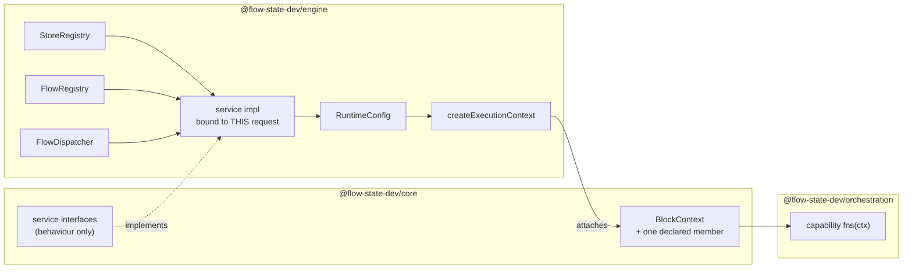

# FIX-999: Public injection seam — a capability cannot legally reach `stores` or `flow` from `BlockContext` — Implementation Spec

## Part I — The Case *(for the human)*

### 1. Problem — why it matters, why now

A capability is how FSD packages reusable behaviour: a block writes `uses: [cap]` and gets that capability's tools, context, resources, and helper functions. The helpers receive the block's context.

Two things a capability sometimes needs are **present on that context at runtime and absent from its type**: the store layer, and the flow the request is running. Both live on the engine's own context type; the helpers are typed against the one `core` declares, and `core` cannot name either, because it must not depend on `engine`.

So the only way a capability reaches the runtime today is to cast its context to a shape TypeScript says it doesn't have. Fine in a throwaway, unshippable in the framework: **the cast is the only thing holding the package boundary together, and a cast holds nothing.** Nothing warns when the shape it asserts stops being true.

**Why now.** [FIX-982](https://linear.app/fixpoint-labs/issue/FIX-982) — running a claimed task outside the request that claimed it — is Spec Approved and blocked on this. Its spawn arrives as a capability, and the board declaring it lives in a package with `engine` as a devDependency only, so injection is the only route that keeps the boundary intact.

The premise is verified rather than asserted: a `@ts-expect-error` probe over the exported context type is satisfied today, and a control run flipping the probed keys to public ones reports the directive as unused. That probe lives in a file no type-checker visits — a small problem, fixed here.

### 2. Solution in plain terms

Give the framework **one deliberate, named way** for the runtime to hand a capability the few things only the runtime can do — and make what crosses it **behaviour, not handles.**

The engine builds one request-bound operation and attaches it to the context under a single member `core` declares. A capability reads it through the context it already gets. No cast, and the package graph is untouched: `core` names an interface, `engine` implements it.

**The rule that makes it safe, and the reason this is not just "put `stores` on the context":** the operation closes over the running request's identity — tenant, user, org, session, flow — and exposes no parameter that can override it. A capability supplies the *target* of an operation and never the *authority* for it.

**Two things ship on it.** A **spawn** verb — create-or-adopt a child session bound to a target flow, and start a request in it. Review established these can't be two independent services: the child's flow kind is the *target's*, and a session is later resolved by that field (§7.2). And a **liveness read** — *is this request alive, does this session have a live request* — which two consumers need and neither can reach today, because the registry that answers it is engine-only (§7.3).

**And a flow has to opt in to being a target.** The seam cannot address a flow's ordinary caller-facing actions at all; a flow declares an internal entry, the same way webhook and chat handlers already live outside `flow.actions`. That is what makes the widest part of this seam safe, and the first draft got it wrong (§6 Decision 4).

**Philosophy.** **Tenet 5 (fix at the owning layer)** — the boundary is between `core` and `engine`, so the seam belongs there, once, not at each capability that hits it. That is also why the liveness read lands here rather than becoming a second clock in `orchestration`. **Tenet 3 (earn every addition)** sets the size: each thing on the seam has a named consumer that is blocked without it, and nothing else is here (§12). **Tenet 2 (composition)** — no new primitive; this pattern already ships twice (§3).

### 3. Tradeoffs & alternatives

**The alternative the issue proposed, and FIX-982 assumed: expose `stores` and `flow`.** Rejected on a measured property, not a preference. `SessionStore.get(id)` takes no tenant argument — tenancy is a *convention*: build the key with `resolveSessionStorageKey`, check it with `tenantMatches`. The predicate's own doc comment enumerates who must remember: *"the session binding guard, the route session loader, the `latestRequestId` update, and resource/debug reads."* An invariant with N writers, held by discipline at each. Exposing the store layer to capability authors multiplies those writers into code the framework never reviews — and a capability's arguments are routinely model-authored (BP-031, tenet 5).

**The simpler approach: declaration merging.** `engine` could augment the context type from its own module, exactly as instance settings are augmented today. No new member, no wiring, one file. Insufficient twice over: it is global and unnarrowable — every block in every app gets the store layer, with no way to scope it per consumer — and it makes `core`'s public type shape depend on whether `engine` is in the type graph, turning a locked boundary into an accident of module resolution.

**This is not a new pattern, and saying so is the point — though only one of the two precedents is an exact match.** The task-scope mark is the clean one: declared in `core`, implemented by the engine's execution context, called from the orchestration package. The tool-observation hook is *core*-declared but **orchestration**-wired, through a cast into a hidden request-state bag (`RESOLVER_BAG_KEY`, `flow-policy-wiring.ts:63`) rather than an engine implementation — so it is the same *shape* with a different producer, and calling the two "the same pattern" implies more uniformity than exists. This issue isn't inventing a mechanism — it gives the third instance a **name, a home, and a rule**, because it's the first one large enough that "add another member when someone needs it" stops being an answer.

**Where the complexity actually is:** not the type, which is short. It is **where the seam gets constructed.** `runAction` receives the stores and the runtime config and **never a flow registry** — that plumbing doesn't exist — and seven call sites start a request. A seam wired at some and not others gives you detached work that runs in the HTTP host and silently doesn't in the queue worker. §7 and §9 are mostly about that.

### 4. Focus practices (1–5)

1. **BP-031** — an injection seam is exactly where authorization goes wrong. The answer is structural, not validating: identity is closed over at construction, so a cross-tenant reach is *not expressible* rather than rejected. The dispatch `source` is stamped by the seam, never accepted.
2. **BP-004 (public boundary first)** — the shape of the member *is* the deliverable; the rest is wiring.
3. **Tenet 5 / one convergence point** — two of them: the seam's *construction* must sit where every request-start path passes through, and its *identity binding* inside the services rather than at each capability.
4. **BP-035 (second paths)** — named individually in §9: the seam absent, a host that never wired it, the out-of-process worker, and a memoized helper read from a nested block.
5. **Tenet 3** — nothing goes on the seam without a named consumer that is blocked without it. Two issues qualify today, and §12 keeps the count honest rather than inheriting the issue's original four.

### 5. What using it looks like

*(None of this compiles today.)*

**Writing a capability that reaches the runtime — the whole point:**

```ts
const spawnCapability = defineCapability({
  name: "spawn",
  fns: (ctx) => ({
    spawn: async (args: { childKey: string; flowKind: string; input: unknown }) => {
      const runtime = requireRuntime(ctx);          // named error if no host wired one
      const result = await runtime.spawn({
        childKey: args.childKey,
        flowKind: args.flowKind,                    // the child binds to THIS kind
        entryKey: "run",                            // must be a declared internal entry
        input: args.input,
        childFields: { metadata: { topic: "FIX-982" } }   // caller's own bookkeeping
      });
      if (result.kind === "conflict") return adopt(result.existing);  // caller decides
      return result;                                // { sessionId, requestId }
    }
  })
});
```

**Declaring a flow as a dispatch target — the opt-in, and the whole of Decision 4:**

```ts
defineFlow({
  kind: "worker",
  actions: { /* caller-facing; the seam can NEVER reach these */ },
  internalEntries: { run: { block: workerBlock } }   // only this is dispatchable
});
```

**What a capability cannot write, and why that is the feature:**

```
before   ctx.stores.session.get(`${someTenant}:${someId}`)   // reachable via a cast today
after    // there is no `stores`. `spawn` takes a child key, not a tenant.
         // The child carries THIS request's tenant/user/org and THIS session as
         // its parent, and the TARGET flow's kind. No argument can change any of it.

before   runtime.spawn({ flowKind: "worker", entryKey: "someAction" })
after    // named error. `someAction` is in `flow.actions`, which the seam does not
         // resolve at all — not "resolves but is rejected".
```

**What an app author writes: nothing, unless they want to be a target.** A host built through the shipped entry points supplies the seam's inputs already. The one exception is a deployment running capabilities that dispatch from a **`worker-only`** process, which must wire a start producer there (Decision 6b) — a construction-time error, not a surprise at the first spawn.

**What happens with no host** (a unit test, a mock context):

```
ctx.cap.spawn.spawn({...})
  → throws by name: this capability needs a runtime host; none is wired.
     Not `undefined is not a function`, and not a silent no-op.
```

### 6. Decisions & rules — the sign-off surface

1. **What crosses the seam is behaviour, not handles. No `core` type ever names a store or a flow instance.**
   *Rejected:* `stores` / `flow` on the context (the issue's own sketch, and what FIX-982 §7.2 assumes); module augmentation from `engine`.
   *Locks in:* every future addition to the seam is a named verb someone reviews, rather than a surface that grew by transitivity. The cost is real and stated: a consumer needing something the seam doesn't expose comes back here for a verb instead of composing one itself.

2. **Every service closes over the running request's identity at construction. Identity is never a parameter.**
   *Rejected:* accepting `tenantId` / `userId` / `orgId` as arguments and validating them against the context.
   *Locks in:* BP-031 structurally rather than by discipline — the unsafe call has no spelling. It also fixes what the seam may *not* carry: a service that legitimately needs to name another tenant cannot be built on this seam at all, and would need its own decision.

3. **The seam exposes exactly two things: one *spawn* verb, and one *liveness* read. Nothing else.**
   *Rejected:* two independent spawn services (`sessions.getOrCreateChild` + `dispatch.start`) — the shape this spec carried into review; a `flows.get(kind)` accessor; and exposing `stores.activeRequests` for the liveness half, which Decision 1 forbids.

   **(a) Spawn is one verb** — create-or-adopt the child session *bound to the target flow kind* and dispatch into it, as a single operation. **The two halves cannot be independent, because the child's `flowKind` is the dispatch target's, not the caller's.** `SessionRecord.flowKind` is required, and eight sites in `resource-routes.ts` resolve a session's flow with `ctx.registry.get(session.flowKind)` — so a child bound to the *current* flow, then dispatched into another, is later resolved and exposed under the wrong flow. A separate `getOrCreateChild` would have to take the target kind anyway, at which point it is dispatch's argument on the wrong verb. **Conflict handling survives the merge:** a lost create race returns `conflict(existing)` **without dispatching**, so the consumer keeps the discriminator FIX-982 needs (its Decision 12 tells *our* child from a squatter).

   **(b) Liveness is a read, and it answers two questions** — *is this request still alive?* and *does this session have any live request?* Both are needed, by different consumers, and neither subsumes the other: a session with a second live request would wrongly answer "alive" for a specific dead one, and a never-claimed task row has no request id to ask about. **This is not a re-split of (a)** — it is a different shape entirely, a read rather than a request-start, and it changes nothing about why (a) is merged.

   *Locks in:* the flow instance never becomes a value `core` has to name, and neither does the registry. **What earns (b) is two verified consumers, not one** (§12): [FIX-1005](https://linear.app/fixpoint-labs/issue/FIX-1005) blocks its PR c on it, and **FIX-982's Decision 9 already depends on it without knowing** — it reads `ActiveRequestRegistry.listAll()` from a reconciler that runs inside the board's drain, in `orchestration`, which cannot legally name that type. **Cost of getting (b) wrong in the other direction:** FIX-1005's stated fallback is a lease-renewal timer in `orchestration`, which puts a second liveness clock beside the request heartbeat where neither is authoritative — a parallel mechanism at the call site, which is the thing this seam exists to prevent (tenet 5).

4. **The seam cannot address `flow.actions` at all. A flow opts into being a dispatch target by declaring an internal entry, resolved on the seam's own `source` with no fall-through.**
   *Rejected:* the shape this spec carried into review — "admission is the callee's problem, gated on a `source` the seam stamps" — **which does not work, and the review was right to attack it**; also restricting dispatch to the current flow kind, which breaks the one consumer.
   *Locks in:* the rejected version was unsound as stated. `resolveActionCore` (`resolve-action-core.ts:79-107`) uses a recognized `source` only to *select a transport map*; a source it does not recognize — which is what a new seam stamp is — falls through to `return flow.actions[actionName]` at line 107. So stamping a source produced **no admission whatsoever**, and any capability holding the verb could enter any registered flow's named action, with the principal inherited rather than resolved by that flow's own `authentication.resolvePrincipal`. The fix is to copy the event transports properly instead of partially: they are unreachable from HTTP/MCP because their handlers **are not in `flow.actions`**, not because a check guards them. So the seam resolves an internal-entry declaration that lives outside `flow.actions`, and its branch **returns `undefined` rather than falling through**.

   **This makes an internal entry a fourth action form, and round 2 found five wiring paths that don't know about it. That cost is accepted deliberately, not discovered** — see Decision 9, which is where the obligation lives.

   *Why not the cheaper shape:* an `internal: true` flag on an ordinary `flow.actions` entry would inherit all five wirings for free, and it is **rejected on failure asymmetry.** Forget a wiring path for a *form* and the entry runs degraded — missing resources, the wrong concurrency default — which is bad and visible. Forget a *refusal* for a flag, in the HTTP route or the MCP adapter or the next caller transport someone adds, and an "internal" action is publicly callable. One direction degrades, the other escalates. The architecture reference already records the framework reaching this conclusion for the event forms: *"no `internal` flag — the structural fact is the boundary."* **Still the widest point of the seam, and still where to push hardest.**

5. **The member is framework-facing: on the public type so a sibling package names it without a cast, but not documented in `apps/docs` as an app-author surface.**
   *Rejected:* a documented public capability-authoring surface now; a contract-token registry with runtime lookup.
   *Locks in:* the boundary is legal (which is the whole issue) while the contract stays cheap to change, because nothing outside this repo has been told to build on it. Promoting it later is additive — a docs page and a stability note. This is the decision most worth disagreeing with if you think the four-consumer argument still holds (§12).

6. **Every request-start path supplies the seam's *construction inputs*; `createExecutionContext` builds the bundle once. A process that executes requests but cannot start one is a construction-time failure, not a runtime surprise — and `worker-only` is exactly that process today.**
   *Rejected:* the optional-and-absent shape the durability provider uses (`ctx.suspend` exists only when a provider is configured); and this spec's own review-round-1 shape, which said "constructed at every entry point" and **assumed every process could construct it**.
   *Locks in:* two corrections, and the second is the one that nearly repeated Decision 7's mistake one layer up. **(a)** Hosts pass inputs — the flow registry, the stores, the host-level start operation — rather than a pre-built bundle, so seven call sites forward dependencies they mostly already hold and exactly one place constructs. Nested scopes inherit the same object reference, as `stores` already does. **(b) The premise that every process can start a request is false.** `createFlowState.#buildRuntime` skips `worker.createDispatcher(runtime)` when `mode === "worker-only"` (`createFlowState.ts:304-306`), and a queue worker calls `runAction` with only registry, stores and runtime config — no host, no dispatcher. So a capability in that process could create a child and then have nothing to dispatch it with. The rule: **capability-initiated dispatch is a declared deployment property.** A deployment whose capabilities dispatch must supply the start operation in *every* process that executes them — `worker-only` included, which means constructing a producer there rather than skipping it — and a process that cannot fails **at construction, by name**, rather than at the first spawn. **Cost, stated:** `worker-only` gains a wiring obligation it does not have today, and that is a real change to a shipped mode rather than a spec-only one.

7. **The seam is a per-request value on the execution context. It carries no ambient per-process state, and nothing may be put on it that a second process cannot reconstruct from the runtime config plus the request envelope.**
   *Rejected:* an `AsyncLocalStorage` carrier — the shape the board's per-worker claim scope uses.
   *Locks in:* the seam works identically in-process and in a queue worker, because the worker constructs its own store registry and calls the same entry point in its own process. An ALS value would not, and would not fail loudly. This rule is written as a rule rather than an observation because a neighbouring spec shipped exactly that defect: an ALS carrier assumed across a process boundary it cannot cross. Anything later added to this seam is checked against it.

8. **`ctx.parentSession` is not built here — and the schema question it raises is answered as a rule rather than deferred: anything this seam ever exposes from another session is untyped.**
   *Rejected:* resolving the parent flow's session-state schema from its kind, and requiring the two flows to share one.
   *Locks in:* the question the issue asks ("pick one explicitly") has an answer that falls out of Decision 1 rather than being a preference. Typed access to another flow's session state would require `core` to name that flow's schema, which means naming a flow instance — the exact leak this issue exists to close. So the answer holds whether or not `parentSession` is ever built, and the implicit answer the issue warned about cannot happen.

9. **An internal entry is a full action form, and this spec wires it into every path that enumerates forms — aggregation, org validation, concurrency, and session defaults — with a test per path.**
   *Rejected:* shipping the map and letting the wiring follow, which is what round 2 caught this spec doing; and narrowing the entry to "an action core we execute directly", which is the same omission said more quietly.
   *Locks in:* five paths enumerate action forms today and none knows about a fourth — `defineFlow`'s block aggregation and flow-tools application (`defineFlow.ts:324-334`, `:640-644`), `validateDispatch`'s `requiresOrg` check, which the host's own `dispatch` never calls (`createInboundTransportHost.ts:400-407`, called only from `action-routes.ts:158`), the concurrency arbiter's `isEvent` discrimination (`arbiter.ts:143-147`), and the session-schema defaulting the create route performs (`session-routes.ts:151-161`). **The obligation is named in §7.5 and each path gets a behaviour in §10**, because the failure mode is uniform and quiet: an entry that executes with something missing. *Consequence, stated:* this is the largest single cost in the issue and it is what moves the size. It is also **a debt this spec pays rather than creates** — webhook, chat and scheduled each paid the same five edits, and nobody wrote the checklist down (§12 follow-up).

**Non-goals** — the spawn capability itself and everything it composes (FIX-982); parent-side board settlement (dissolved: FIX-982 settles from inside the child, where a live context exists); a workstream-management capability (unfiled, no consumer); a result-read surface (FIX-1008, cancelled); a general cross-session *resource* read (the epic's OQ-F, still deferred); a bound on request fan-out (open question 1); refactoring the five-way form enumeration itself (§12 follow-up); any change to how capabilities are declared, resolved, merged, or memoized.

**Size:** **Large** — revised up from Medium in round 2. Two packages, the request-start call sites, and five form-enumeration paths each with a test. **Still no PR plan, deliberately:** every split ships a form that is half-wired, which is exactly the failure Decision 9 exists to prevent. §8's ordering — every wiring path lands before anything can dispatch — is the safety property a DAG would otherwise buy.

---

## Part II — The Build Plan *(for the implementing agent)*

### 7. Technical design

#### 7.1 The shape

The change is one member and its supply chain. Today a capability's helpers see the context `core` declares; the engine's additions are on a type it can't name. After this, one member on the declared type carries request-bound services the engine builds.



Read the dotted edge as the whole issue: `engine` implements an interface `core` declares, and the consuming package depends on neither direction it isn't allowed to.

- **`@flow-state-dev/core`** — declares the verb's interface and the one context member. Names no store, no registry, no flow instance. This is the deliverable; everything below is wiring.
- **`@flow-state-dev/engine`** — implements the verb over the store registry, the flow registry, and the host-level start operation; carries the *inputs* on the internal runtime config; builds the bundle in `createExecutionContext`.
- **Untouched:** capability declaration, resolution, merging, and the `ctx.cap` construction path. The four block kinds. Every store adapter.

#### 7.2 The spawn verb, and what binds it

One operation, constructed **per request**, closing over the identity the execution context already resolved. It does three things that cannot be separated:

1. **Resolve the target flow by kind** against the host registry. Unregistered is a named error *before* anything is written.
2. **Create-or-adopt the child session**, bound to the **target** flow's kind, using the conditional-write sentinel the scope stores already ship. `parentSessionId` is **this** request's session; tenant, user and org are **this** request's. The caller supplies the child key and its own bookkeeping fields, nothing else. **Initial state is parsed through the *target* flow's `session.stateSchema` before the write** — the create route does exactly this (`session-routes.ts:151-161`) and its comment says why: execution does not retroactively initialize an existing record, so a block reading `ctx.session.state.foo` would observe `undefined` instead of the declared default, forever. The target's schema, not the caller's, because the child runs the target's blocks.
3. **Start the request** into the child, through the host-level start operation (§7.4), **and await its acceptance before returning `Started`.** `dispatch` returns synchronously; `DispatchHandle.accepted` is what resolves *"the durable record has committed AND the dispatcher has accepted the job"* (`transports/types.ts:155-165`). Awaiting `finished` instead would block until the child completes, defeating the point; awaiting nothing makes `Started` a claim the verb hasn't checked.

**Why this is one verb and not two services.** The child's `flowKind` is the *target's*, and `SessionRecord.flowKind` is required. Eight sites in `resource-routes.ts` resolve a session's flow with `ctx.registry.get(session.flowKind)`, so a child bound to the caller's flow and dispatched into another is later resolved and exposed under the wrong flow — silently, and only in the cross-flow case, which is the one case the consumer actually needs. Splitting the verb would mean handing the target kind to session creation anyway.

**The conflict outcome survives the merge, and it has to.** A lost create race returns `conflict(existing)` **and does not dispatch**. Whether an occupant is "ours" is domain knowledge the seam doesn't have — FIX-982's Decision 12 discriminates on a routing tuple — so the verb reports and stops rather than adopting silently. The consumer inspects and decides.

**Why the identity binding lives here and not at each capability.** The tenant key is assembled by convention at every engine call site today (§3). Inside the verb there is exactly one assembly site and one predicate, so the invariant holds for every consumer the seam ever gets — the tenet 5 convergence point. Put it at the capability and it holds for the capabilities that remembered.

#### 7.3 The liveness read

Two questions, both point reads, both **tenant-bound like everything else on the seam** — a caller can only ask about requests and sessions in its own tenant, so this is not a cross-tenant existence oracle:

- **Is request R alive?** [FIX-1005](https://linear.app/fixpoint-labs/issue/FIX-1005)'s reclamation needs this: a task row records the `{sessionId, requestId}` that claimed it, and reclaiming is only safe once that specific request is gone.
- **Does session S have any live request?** FIX-982's reconciler needs this and cannot use the first one: it sweeps `pending` rows, and a task that was admitted and never claimed has no request id to ask about. It derives the Workstream's session id from the routing tuple and asks whether anything is already running there.

**Neither subsumes the other, which is why two reads rather than one.** A session with a second live request answers "alive" for a specific dead one, so FIX-1005 cannot use the session form; and a never-claimed row has nothing to put in the request form. Each read exists because a named consumer asks that exact question — not because a general query surface is tidier.

**Both take a set and return a set, not one id.** Both consumers are *sweeps* — FIX-1005 over stale claimed rows, FIX-982 over pending ones — so a per-row `isAlive` would be an N+1 by construction, which FIX-1005 flagged. The reads are `which of these requests are alive?` and `which of these sessions have a live request?`. A single-id call is the one-element case, not a second verb.

**Semantics, because a liveness read is easy to specify wrongly:** absence means *"no live registration"*, which is **not** proof of death — a registration can lag, and the registry is a liveness hint, not a tombstone. Consumers must treat absence as permission to *act on their own fence* (FIX-1005's claim ticket, FIX-982's claim race), never as a settled verdict. Stated here because a consumer that reads it as "definitely dead" will double-run work, and that failure looks like a seam bug.

**Both are backed by verbs the registry already has** — `get(requestId)` and `listAll()` (`engine/src/stores/types.ts:567-585`) — so this costs **no store-contract change and no adapter work.** The gap is reachability, not capability.

**On the implementation, per cursor's constraint:** the request read mirrors `get()`, identity-bound, and `stores.activeRequests` is never exposed. `listAll()` is explicitly **not** the default shape — the batch reads should compose `get()` per id, which is bounded by the caller's set, rather than scanning the fleet.

**And this is where Decision 1 pays for itself.** FIX-982's Decision 9 names its own scale breakpoint: filtering `listAll()` is O(*global* in-flight requests) per scan, not O(board pending), and its §12 wants a narrower `listBySessionId` it declines to build because that *is* a four-adapter contract change. Behind a **verb**, the cost profile is engine-internal and can be narrowed later with **no consumer changing a line**. Behind a handle, every consumer writes the filter itself and the narrowing is a breaking change.

#### 7.4 What spawn dispatches *through*, and what a flow must declare to be a target

**Two things the first draft got wrong, both found in review, both load-bearing.**

**(a) The start goes through the host dispatch path, not the raw dispatcher.** `createInboundTransportHost` owns more than a hand-off: one concurrency arbiter governs every in-process dispatch (`createInboundTransportHost.ts:121`), per-flow runtime overrides are merged there, and with an external dispatcher it materializes the `activeRequests` entry and the `in_progress` request record **at enqueue time**, with cleanup when the enqueue fails (`:237-344`). Calling `FlowDispatcher.dispatch` directly skips all of it — the returned request id can 404 until the worker picks the job up, and a failed enqueue leaves nothing to sweep. So the seam composes the **host-level start operation**, which is also what makes Decision 6's per-process obligation concrete: the thing that must exist in every executing process is that operation, not a queue handle.

**(b) A flow must opt in to being a target, because `source` alone admits nothing.** `resolveActionCore` gates each event branch on a recognized source, and then **falls through to `flow.actions[actionName]`** (`resolve-action-core.ts:107`) for anything else. A new seam source is "anything else". So the seam resolves a flow-level **internal entry** declaration — outside `flow.actions`, exactly as the webhook / chat / scheduled maps are — and its branch returns `undefined` instead of falling through. A flow that declares no internal entry is not addressable by any capability, and a caller-addressed action is never addressable by one. This is the same structural privacy the event transports get, rather than a check that can be forgotten.

#### 7.5 What a fourth action form obliges — the round-2 checklist

Decision 4's internal entry executes like an action, so **every path that enumerates action forms has to learn about it.** Five do, and none does today. This is the largest cost in the issue; it is listed as a table because the failure mode is uniform and quiet — an entry that runs with something missing, in a way no error names.

| Path | What it enumerates | What breaks if the entry isn't added |
|---|---|---|
| `defineFlow.ts:324-334` (`actionBlocks`) → `collectBlockResources` / `collectRequiresOrg` at `:644` | actions, webhooks, chat, schedules | The entry's block-declared **resources are never installed**, so a worker reads an empty resource registry. Also its `requiresOrg` never bubbles up. |
| `defineFlow.ts:640-642` (`withFlowTools*`) | the three event forms, each with its own mirror function | Flow-level **`tools` defaults and observers don't reach** the entry's block — an entry behaves differently from the identical action beside it. |
| `createInboundTransportHost.ts:400-407` (`validateDispatch`) | called from `action-routes.ts:158`, **not** from the host's own `dispatch` | **`flow.requiresOrg` is not enforced.** Decision 4 stops *reachability*; it does nothing for this check, and the seam composes `dispatch`, which skips it. |
| `arbiter.ts:143-147` (`isEvent`) | `webhook` / `chat` / `scheduled` only, else `flow.actions[actionName]?.concurrency` | An entry key that **collides with a public action name inherits that action's concurrency policy** — a queue or reject policy applied to something it was never written for. |
| `session-routes.ts:151-161` | the create route parses initial state through `flow.session.stateSchema` | The child session persists **without the target flow's schema defaults**, and execution does not retroactively initialize an existing record — so typed block reads observe `undefined` where a default was declared. |

**Two rules follow, and §8 enforces the first by ordering.** Every one of these lands *before* anything can dispatch. And each gets its own behaviour in §10 — a form wired in four places out of five is the failure this table exists to prevent, and only a per-path test distinguishes four from five.

**The deeper finding, recorded rather than fixed:** one fact — "what are the action forms?" — is restated in five places, so adding a form costs five edits and forgetting one is silent. That is tenet 5's arithmetic exactly, and webhook, chat and scheduled each paid it before this issue existed. Consolidating the enumeration is a real improvement and it is **not** this issue's to make (§12).

#### 7.6 Where the construction inputs come from

`RunActionOptions` carries the store registry and the runtime config. It carries **no flow registry**, and resolution-by-kind needs one. That plumbing is the real work.

Hosts pass **inputs**, not a pre-built bundle: the flow registry, the stores, and the host-level start operation ride the internal runtime config — *"instance-level options forwarded verbatim through the execution chain"*, which is what BP-026 says to do — and `createExecutionContext` builds the per-request bundle **once**. Nested scopes inherit the same object reference, as `stores` already does (§10 behaviour 8 pins it). Seven sites forward dependencies they mostly already hold; one place constructs.

| Where | Note |
|---|---|
| the HTTP router / flow-state entry points | already hold registry + stores where they build the config |
| the in-process dispatcher | inside the transport host, which holds all three |
| request recovery, request continuation | re-entry paths; must not resolve a *different* seam than the original run |
| the two CLI run paths | usually a single flow — a one-entry registry is trivially constructible |
| the queue worker | holds registry, stores and its own runtime config — **but not necessarily a start operation** (§7.5) |
| the test harness | the one place a genuinely absent seam is correct (§9) |

#### 7.7 The process boundary — and the premise review corrected

The seam is a **value on the execution context**, constructed by whichever process runs the request. Nothing is carried across a process boundary, so there is no serialization question. That half holds.

**The half that did not hold:** the first draft said the seam "is present there identically" in a queue worker. It is not, for the dispatch half. `createFlowState.#buildRuntime` skips `worker.createDispatcher(runtime)` when `mode === "worker-only"` (`createFlowState.ts:304-306`), and the queue worker calls `runAction` with registry, stores and runtime config only — no host, no dispatcher. A capability there could create a child and have nothing to start it with. That is the same class of error Decision 7 exists to prevent, one layer up: an assumption about what a second process has, unverified. Review caught it; the correction is Decision 6(b) — capability-initiated dispatch is a **declared deployment property**, `worker-only` must construct a producer rather than skip it, and a process that cannot fails at construction by name.

This remains deliberately *not* the shape the board's per-worker claim scope uses. That one is an `AsyncLocalStorage` value: per-process, per-async-chain, unable to reach another process — which is why FIX-982 re-mints the claim ticket inside the child rather than forwarding it. **That re-mint stays FIX-982's**; this seam neither carries the ticket nor needs to.

#### 7.8 Keeping the premise honest

The `@ts-expect-error` probe that establishes "these keys are absent from the declared context" currently lives where the package tsconfig doesn't reach and vitest transpiles without checking. Move it into a project CI type-checks, so that if someone later puts a store handle on the public type, a build fails instead of an assertion quietly becoming vacuous. Small, and named in the issue.

#### 7.9 Solution sketch

> **Pseudocode. Illustrative, not the contract. React to the shape, not the names.**

```
in core — declared, names nothing from engine:

    interface RuntimeAccess {
        spawn({ childKey, flowKind, entryKey, input, childFields })
            -> Started({ sessionId, requestId })  |  Conflict(existingRecord)

        liveness: {                          ← set in, set out: both consumers sweep
            liveRequests(requestIds[])  -> Set    ← FIX-1005
            sessionsWithLive(sessionIds[]) -> Set ← FIX-982's reconciler
        }
    }

    on the block context:  runtime?: RuntimeAccess          ← the whole public surface

    on a flow:  internalEntries: { [entryKey]: ActionCore } ← opt-in; NOT flow.actions

in engine — built ONCE per request, at context construction:

    buildRuntimeAccess({ stores, flowRegistry, hostStart, identity }) =>
        spawn(args):
            flow = flowRegistry.get(args.flowKind)   or  throw unknown-flow-kind
            entry = flow.internalEntries[args.entryKey]
                                                     or  throw not-an-internal-entry
                    ← never falls through to flow.actions (Decision 4)

            child = { ...args.childFields,
                      flowKind:        args.flowKind,        ← the TARGET's, not ours
                      parentSessionId: identity.sessionId,   ← not a parameter
                      tenantId, userId, orgId: identity.…    ← not parameters
                      state: flow.session.stateSchema.parse({…})
                                                             ← the TARGET's defaults,
                                                               or blocks read undefined
                                                               forever }
            write create-if-absent at the tenant-namespaced key
            on conflict: return Conflict(existing)  and DO NOT dispatch

            handle = hostStart({ sessionId: child.id, entry, input: args.input,
                        source: THE SEAM'S OWN CONSTANT,     ← not a parameter
                        tenantId, userId, orgId: identity.… })
                    ← the HOST path: arbiter + per-flow overrides + enqueue-time
                      record materialization, none of which the raw dispatcher does
            await handle.accepted        ← NOT .finished. Without this, Started is a
                                           claim we never checked.
            return Started(…)

resolution, in engine:
    resolveActionCore(... source === SEAM_SOURCE ...):
        return flow.internalEntries[entryKey]     ← undefined, NOT flow.actions[name]

for a capability:
    requireRuntime(ctx) = ctx.runtime  or  throw "no runtime host wired"
```

What this asks a reviewer: **is `internalEntries` the right opt-in shape, or should a flow declare dispatchability some other way?** The alternative worth weighing is reusing an existing transport map rather than adding a fourth — but the three that exist are each owned by a transport, and a capability is not a transport. It is deliberately impossible to tell from this sketch what anything is named; that is the implementer's.

### 8. Implementation sequence

**The ordering rule that matters more than the steps:** everything that teaches the framework about the new action form (steps 2–3) lands **before** anything can dispatch into one (step 4). A form that is reachable before it is wired is the quiet-failure class §7.5 exists to prevent, and this ordering is what replaces the PR plan a Large issue would otherwise get.

1. **Declare the surface in `core`** — the verb and liveness interfaces, the context member, and the flow-level internal-entry declaration, with the identity fields conspicuously absent from every argument type. **Test:** a type-level assertion that the argument types cannot express a tenant, plus the existing capability type tests still pass. *Depends on:* nothing. **BP-004's step; get it right before anything below exists.**
2. **Wire the form into all five enumeration paths** (§7.5) — aggregation and flow-tools in `defineFlow`, `requiresOrg` at the seam that composes `dispatch`, the arbiter's non-caller discrimination, and target-flow session defaults. **Test:** behaviours 12–16, one per path. *Depends on:* 1. **Nothing dispatches yet.**
3. **Admission** — the `resolveActionCore` branch for the seam's source, resolving `internalEntries` and returning `undefined` rather than falling through to `flow.actions`. **Test:** behaviours 4 and 5. *Depends on:* 1. **Still nothing dispatches: this builds the gate before the thing that walks through it.**
4. **Implement the spawn verb in `engine`**, bound to one request's identity, composing the host-level start operation and awaiting `accepted`. **Test:** behaviours 1–3, 6, 17. *Depends on:* 2, 3.
5. **Implement the liveness reads** — batch in, set out, composing the registry's `get`. **Test:** behaviours 18–19. *Depends on:* 1.
6. **Thread the construction inputs** — registry, stores and the host start operation onto the internal config; `createExecutionContext` builds the bundle once; then each of §7.6's call sites, the test harness last. **Test:** behaviours 7 and 9. *Depends on:* 4, 5.
7. **The worker-only obligation** (Decision 6b) — construct a start producer in `worker-only` mode, and fail by name at construction where one cannot exist. **Test:** behaviour 8. *Depends on:* 6. **Touches a shipped mode, so it is the step most likely to surface something the spec missed.**
8. **The no-host path** — a named error from the capability-side helper rather than an `undefined` call. **Test:** behaviour 10. *Depends on:* 1.
9. **Move the premise probe into a type-checked project** (§7.8), and add the changeset (`minor` for `core` and `engine`; the context type and `FlowInstance` each gain a member). **Test:** behaviour 11. *Depends on:* 1.

**Removals** (tenet 3): none, and that is deliberate rather than an omission. The two existing single-purpose members this seam resembles — the task-scope mark and the tool-observation hook — are *not* runtime-service reaches: one marks a scope, the other installs a sink, and neither is reachable through a store. Folding them in would grow this seam's meaning to "any cross-package context member", which is a different and worse contract. They stay; §11 says why, so the next reader doesn't re-open it.

**No PR plan.** One node — the surface, its implementation, and its wiring are not independently reviewable, and splitting them would ship a declared member nothing populates.

### 9. Edge cases & error handling

| Case | Behaviour |
|---|---|
| No seam on the context (unit test, mock context) | The capability-side helper throws **by name**. Never `undefined is not a function`, never a silent no-op. This is the only context where absence is correct. |
| A host entry point that never wired it | Does not compile (Decision 6). If it somehow reaches runtime, it degrades to the row above rather than to a partly-working seam. |
| Out-of-process (queue worker) | The worker builds its own bundle from its own stores and registry. Nothing crosses the boundary (§7.5). Asserted, not assumed — the in-process case passes trivially either way. |
| **`worker-only` mode, which has no dispatcher today** | **Construction-time failure by name, not a first-spawn failure.** `createFlowState.ts:304-306` skips `worker.createDispatcher` in that mode, so a deployment whose capabilities dispatch must construct a start producer there (Decision 6b). This row is the one review found; the first draft asserted the opposite. |
| The verb names an unregistered flow kind | Named error, synchronously, before any record is written. Matches the host's shipped contract for the same case. |
| The verb names a flow that declares **no** internal entry, or an unknown entry key | Named error. **Never a fall-through to `flow.actions`** — `resolve-action-core.ts:107` is what would otherwise make a caller-addressed action reachable from a capability (Decision 4). |
| A flow declares an internal entry whose key collides with an action name | Irrelevant by construction — the two live in different maps and the seam reads only one. Worth a test precisely because it *looks* like it should collide. |
| Child-session key already occupied | Reported as a conflict **carrying the existing record, with no dispatch**. The seam does not adopt, does not overwrite, and does not decide whether the occupant is legitimate — that discriminator is the consumer's (FIX-982 Decision 12). |
| Child created, then the start fails | **The verb learns this and does not report `Started`** — it awaits `DispatchHandle.accepted` (`transports/types.ts:155-165`), which resolves only once the durable record has committed and the dispatcher has taken the job. The child record survives: the verb is **not** atomic across the two writes and doesn't pretend to be, so a retry finds it and returns `conflict(existing)`, which the consumer already handles. Deleting the child on a failed start is rejected — it races a concurrent adopter. |
| An internal entry key collides with a public action name | Legal — different maps, and only one is read for admission. But the **concurrency arbiter** reads `flow.actions[actionName]` for any non-event source (`arbiter.ts:143-147`), so without §7.5's wiring the entry silently inherits that action's policy. Behaviour 15. |
| A liveness read finds no registration | Means *"no live registration"*, **not** "definitely dead" — registrations can lag. Consumers act on their own fence (a claim ticket, a claim race), never on this alone (§7.3). |
| Two requests race on the same child key | One wins the conditional write, the other gets the conflict result. The seam adds no lock; the store sentinel is the fence. |
| Two tenants, identical child key | Different records by construction — the key is tenant-namespaced inside the service, and the tenant is not an argument. **This is the assertion that proves Decision 2**, and it must be written as two tenants reading each other's absence, not as one tenant's happy path. |
| A capability's `fns` result is memoized and read from a **nested** block | Correct **only because the seam closes over request-level facts.** A service that closed over block-level state (block name, attempt, scope) would carry a stale identity into every descendant. Stated as a constraint on what may go on the seam, and pinned by a test that reads a memoized helper from a nested block. |
| Request recovery / same-request continuation | Re-entry must resolve a seam equivalent to the original run's — same stores, same registry — or a recovered request dispatches into a different graph than the one it started in. |
| A capability tries to reach a tenant other than its own | Not expressible. There is no argument for it (Decision 2). If one is ever needed, that is a new decision, not a new parameter. |

**Taxonomy.** Everything here is fatal and loud. There is no degraded mode: a seam that is half-present is the failure this issue exists to eliminate, so every absence throws by name rather than returning `undefined`.

### 10. Testing strategy

**Discipline:** `tdd`. The seam is reachable from a vitest spec through the shipped in-memory stores and a one-flow registry, so every behaviour below is a tracer bullet with no HTTP server involved.

**Goal check.** A real-model goal check does not apply and the reason is specific rather than a shrug: this issue ships **no user-observable behaviour** — it makes a boundary legal so that FIX-982 can ship one. The end-to-end proof belongs to FIX-982's tracer bullet (a foreground turn returning while its detached work keeps running), which is its P3a and cannot run before this lands. Stated here so nobody records a missing goal check as an omission.

**Behaviours to test** (each fails against today's code):

1. A capability's helper reaches the runtime access **with no cast anywhere in the file** — the cast being removable is the whole deliverable, so the test is written to fail if one is reintroduced.
2. A child session created through the seam carries the **current** request's tenant, user, org and parent session, and the **target's** `flowKind` — none of which the caller passed, and the last of which is the finding review caught.
3. **Two tenants using the same child key do not see each other's record.** The mirror assertion (each reads *absence*) is the one that matters; asserting only that both succeed passes under a broken implementation.
4. **A flow that declares no internal entry cannot be dispatched into**, and the attempt does **not** resolve `flow.actions`. *Falsification:* point the same call at a flow with a matching action name and confirm it still fails — a test that only asserts "unknown entry errors" passes even if the fall-through is intact, which is the actual defect.
5. **A caller-addressed action is not reachable through the seam** even when its name is known and it exists. This and 4 are the two halves of Decision 4, and neither alone is sufficient.
6. The verb starts a request in another registered flow kind, with the seam's `source` on the record, and **returns before the child finishes**. Asserted through the **host** path, so the arbiter and the enqueue-time record materialization are exercised rather than bypassed.
7. A request-start construction site that omits the construction inputs **does not compile** (a type-level test, since a runtime test cannot observe this).
8. **A `worker-only` deployment either dispatches or fails at construction** — never reaches a first spawn and throws there. *Falsification:* the pre-fix shape must be shown to reach a spawn before failing.
9. A memoized helper read from a **nested** block still resolves the correct request identity, and the nested scope holds the **same bundle reference** rather than a rebuilt one.
10. With no host wired, the helper throws a **named** error.
11. The premise probe reports the directive as **unused** when the probed keys are made public — the control run that makes it a live check rather than a comment.

**One per form-enumeration path (§7.5).** These are listed separately because they share a failure signature — something missing, no error — and only a per-path assertion tells four-of-five from five-of-five:

12. An internal entry's block-declared **resources are installed** when it runs. *Falsification:* the same assertion against an entry omitted from aggregation must return an empty registry, or the test is reading the parent's resources.
13. Flow-level **`tools` defaults reach** an internal entry's block, identically to an action's.
14. An internal entry on a flow with `requiresOrg` and **no org is refused** — the check the seam's dispatch path skips today.
15. An internal entry whose key **collides with a public action name does not inherit that action's concurrency policy.** The collision is the whole test; a non-colliding key passes under the bug.
16. A child session is created with the **target** flow's `session.stateSchema` defaults applied, asserted by a block reading a defaulted key it never wrote.

**And the two round-2 correctness behaviours:**

17. **`Started` is never returned for a child that did not launch.** *Falsification:* fail the enqueue and assert the verb does **not** report `Started` — under the pre-fix shape it does, and the child record is left behind.
18. Liveness takes a **set and returns a set**, in one call per sweep rather than one per row.
19. A liveness read **cannot observe another tenant's** request or session, asserted as absence rather than as an error.

**Out-of-process coverage — scoped down deliberately.** An earlier draft required proving the seam works in a queue worker with an ALS-falsification control. Cursor is right that this is heavy for a wiring seam, and behaviour 8 now covers the part that actually bit: `worker-only` is the case the premise was wrong about, and it is checkable at construction without standing up a queue. **Full cross-process proof moves to FIX-982's P3a tracer bullet**, which has to run out-of-process anyway. Recorded rather than dropped silently, because §7.5's rule is still what makes that safe to defer.

### 11. Documentation plan

The seam is framework-facing (Decision 5), so this is an internal-contract change, not a site change. **If Decision 5 is reversed at the gate, the site page that gains a section is `apps/docs/docs/advanced/capabilities-authoring.md`, after "ctx.cap"** — recorded here so the reversal doesn't need a second scoping pass.

| File | Change | Placement / notes |
|---|---|---|
| `docs/architecture/capabilities.md` | **Extend** | A new section, "What a capability may reach at runtime", after "What capabilities can contribute". Covers: the member, the verb, the identity-binding rule, and — load-bearing — **what may not go on it**, so the next addition is judged against a written rule instead of a precedent. Also names the two existing single-purpose members and why they stay separate (§8 Removals). |
| `docs/architecture/action-forms.md` | **Extend** | The internal-entry declaration is a **fourth action form**, and this doc is canonical for the set. Without it the seam's admission rule lives only in a closed spec, and the next person to touch `resolveActionCore` sees three forms and a branch they can't account for. |
| `docs/contributing/architecture-reference.md` | **Extend** | One entry under Locked Contracts: the seam's name, that it carries behaviour only, and that identity is closed over. This file is where a reviewer checks a boundary claim, so a seam absent from it reads as not locked. |
| `packages/core/README.md` | **Extend** | One line on the context member under the capability surface. |
| `packages/engine/README.md` | **Extend** | One line: the runtime-config input and which entry points supply it. |
| `apps/docs/**` | **No change** | Per Decision 5. Justified rather than skipped: nothing an app author writes changes, and documenting a framework-facing surface on the site is how it becomes one we can't move. |

**Voice note:** none of these are site pages, so the site voice rules don't bind — but the architecture doc is read by agents as authority, so it states the *rule* ("identity is closed over, never a parameter") rather than describing the implementation.

### 12. Dependencies, open questions & follow-ups

**Dependencies:** none blocking. The conditional-write sentinel the verb uses is shipped ([FIX-1007](https://linear.app/fixpoint-labs/issue/FIX-1007), Done), as is the parentage predicate ([FIX-1009](https://linear.app/fixpoint-labs/issue/FIX-1009), Done). Nothing here waits on [FIX-981](https://linear.app/fixpoint-labs/issue/FIX-981): this seam neither carries nor reads the claim ticket, and it is written against a world where `expectAttempt` no longer exists (§7.5).

**The consumer count, because the scope argument rests on it — and it has moved twice.** The issue was filed naming four consumers; the first draft of this spec found one; the cross-spec pass against [FIX-1005](https://linear.app/fixpoint-labs/issue/FIX-1005) ([#1083](https://github.com/fixpoint-labs/flow-state-dev/pull/1083)) found a second, for a capability this spec wasn't shipping. Current state, per capability rather than per issue:

| Capability | Consumers | Status |
|---|---|---|
| **Spawn** (Decision 3a) | FIX-982 | **One.** Real, blocking, Spec Approved. |
| **Liveness read** (Decision 3b) | **FIX-1005 and FIX-982** | **Two.** FIX-1005 blocks its PR c on it and names it OQ-1. FIX-982's Decision 9 depends on it *already*, without either spec noticing — see below. |
| *(not shipped)* a workstream-management capability | — | **Unfiled.** No issue exists. |
| *(not shipped)* `ctx.parentSession` | — | **Unfiled**, and no capability asks for it. Decision 8 answers its schema question anyway. |
| *(not shipped)* parent-side board settlement | — | **Dissolved.** FIX-982 settles from inside the child, where a live context exists. |

**So the honest count is two consuming issues across two capabilities, not one and not four** — and the correction matters because "one consumer" is the argument that set this spec's minimum surface, including the round-1 decision to merge two spawn services into one verb. That merge still stands (it rests on a `flowKind` correctness argument, not on the count), but the count itself can no longer be quoted as one.

**A defect in FIX-982's approved spec, surfaced by this and not yet folded there.** Its Decision 9 states: *"Liveness comes from `ActiveRequestRegistry.listAll()` filtered by the derived session id — no new store verb."* That reconciler runs as a step in the board's own drain, which lives in `orchestration`, and `ActiveRequestRegistry` is declared in `engine/src/stores/types.ts:567-585`. **`orchestration` cannot name it** — the same package-boundary problem FIX-982's own §7.2 identifies for the spawn, in a different decision, unnoticed by both specs. "No new store verb" was true and beside the point: the missing thing was never a verb, it was reachability. Decision 3b supplies it. **This is FIX-982's to fold, not mine** — recorded here so it is not rediscovered, and it strengthens open question 2 below.

**Open questions for the owner:**

1. **Does a request started through this seam need a fan-out bound, or is that a follow-up?** This seam makes "a running request starts another request" expressible for the first time from inside a block. FIX-982's use is bounded by construction (one task, one request), but the seam is general, and FSD has no budget or depth primitive to fall back on — so a capability with a loop is unbounded model spend with nothing to stop it. Options: **(a)** ship no bound and rely on the consumer, on the argument that the only consumer is bounded and a cap invented without a real load profile is guesswork; **(b)** a depth counter on the dispatched envelope with a low default, which is cheap here and impossible to add later without a migration; **(c)** file it as a follow-up against the first unbounded consumer. I lean **(a)** with (c) filed, because the bound that is actually wanted is probably a cost bound rather than a depth bound and this is the wrong issue to invent one — **but this is a spend-risk call and it is yours, not mine.**

2. **FIX-982 is Spec Approved and its §7.2 names the seam as exposing "`stores`" and "`flow`". This spec exposes neither — and after review round 1 the divergence is materially larger than when the question was first asked.** Three things moved, and the owner should judge item 2 against the new size rather than the old one:
   - **One verb, not two services** (Decision 3). FIX-982's P3a still composes the same three operations, but through one call that returns `Started | Conflict` rather than by sequencing two.
   - **A flow must declare an internal entry to be dispatched into** (Decision 4). FIX-982 already planned a non-`flow.actions` surface for detached work, so this *agrees* with its design — but the declaration is now FIX-999's contract rather than FIX-982's private arrangement, and its P2 gains a dependency on that shape.
   - **`worker-only` gains a wiring obligation** (Decision 6b), which touches a shipped mode and is visible to FIX-982's Decision 3 (out-of-process dispatch in scope).

   FIX-982's own §12 item 3 anticipated *"if FIX-999 exposes something narrower, the spawn capability may need a second seam entry"*, and those three changes are still inside that sentence.

   **Round 2 adds a fourth item that is not, and it changes my answer.** FIX-982's **Decision 9 is defective as approved** — it reads `ActiveRequestRegistry.listAll()` from a reconciler running in `orchestration`, which cannot name that type (§12 above). That is not a narrowing FIX-982 anticipated; it is a reach its own approved text asserts and cannot make. It is repaired by consuming Decision 3b rather than by redesigning anything, so the fix is small — but *"your approved spec has a defect"* is different in kind from *"the seam you'll build is narrower than you assumed"*.

   **So my reading has moved: I now think FIX-982 needs an amendment, not just a note.** Whether that amendment requires re-approval, or is a fold its own review round absorbs, is still the owner's call and I am not making it.

**Follow-ups (flagged, not built):**

- **A fan-out or cost bound**, per open question 1, against the first consumer that needs one.
- **Promoting the seam to an app-author surface** — a docs page and a stability commitment — when a third-party capability author asks for it (Decision 5). Additive; nothing here forecloses it.
- **The two pre-existing type-test files in `core` that no command type-checks.** §7.6 wires *one* project for the premise probe; the same gap covers those. Not this issue's to fix — worth an `improve-codebase-architecture` pass once a type-test project exists.
- **Full cross-process proof of the seam**, folded into FIX-982's P3a tracer bullet rather than built here (§10).
- **Consolidate the action-form enumeration.** "What are the action forms?" is restated in five places (§7.5), so adding one costs five edits and forgetting one is silent — tenet 5's arithmetic, and a debt webhook, chat and scheduled each paid before this issue existed. This spec pays it a fourth time rather than fixing it, because fixing it is a refactor of `defineFlow` plus the dispatch path and would swallow the issue. Worth an `improve-codebase-architecture` pass, and **the strongest argument for it is that a fourth form found five holes in one review round.**
- **A narrower registry read** (`listBySessionId`), which FIX-982's §12 also wants. Behind the liveness verb this is now an engine-internal optimization no consumer sees (§7.3), which is why it can wait.

### 13. Review notes for the implementer

Below-the-bar spec-PR feedback, recorded verbatim and **not** folded into the design. Each is one reviewer's guess at code they haven't read — adopt, adapt, or discard; §6's Decisions bind you, these don't.

**From the cursor "Simplify" review, round 1 (approving):**

1. **Stamp the source as a named constant, and test admission rather than success.**
   > "when implementing, make the seam's stamped `source` a **named constant** and add a test that exercises callee admission — not just 'dispatch returns a request id.'"

   *Why it's a note:* the admission half became Decision 4 and behaviours 4–5, so that part is folded. The *named constant* is a local-structure call the spec shouldn't pin.

2. **Nested scopes should inherit the same object reference.**
   > "Nested scopes should inherit the **same object reference** (mirror `stores`), which behaviour 8 already implies."

   *Why it's a note:* correct, and now explicit in behaviour 9 — but whether that falls out of the existing scope-construction path or needs a line is only visible with the code open.

3. **Decision 8 could be a footnote rather than a locked decision.**
   > "No consumer asks for this… Could be a footnote under Decision 1 rather than a locked decision — unless you want to prevent someone from building `parentSession` on this seam without re-opening the spec."

   *Why it's a note:* the parenthetical is exactly why it stays a Decision. Keeping it numbered is deliberate, not an oversight.

4. **The spec is longer than the change.**
   > "339 lines for a medium one-PR change… the rest could be ~40% shorter without losing anything a reviewer needs."

   *Why it's a note:* fair, and round 1 made it longer rather than shorter — four folds each needed their evidence. Worth a trim pass, but not at the cost of the file:line citations that make the Decisions checkable.

5. **Behaviour 6 (out-of-process) is heavy for this PR.**
   > "In-process service tests + nested-context propagation test (behaviour 8) may suffice here; FIX-982's tracer bullet is the real end-to-end proof."

   *Why it's here rather than folded silently:* partly **taken** — §10 now scopes it to the `worker-only` construction case (behaviour 8) and moves full cross-process proof to FIX-982. Recorded so the reduction is visible rather than looking like it was dropped.

---

## Spec evolution

- **Spec drafted** — reframed from the issue's "expose `stores` and `flow`" to **behaviour, not handles**, on a measured property: the store layer carries no tenant argument, so tenancy is a convention held at ~6 named engine call sites, and exposing it to capability authors multiplies those writers into unreviewed code (tenet 5 / BP-031). Scope set by the consumer count, which has moved from the issue's four to one — the other three are dissolved or unfiled — so two services ship, not a general passthrough. Named the pattern as the third instance of one the framework already runs twice, and wrote the process-boundary rule (Decision 7) as a rule rather than an observation, because a neighbouring spec shipped exactly that defect.
- **After spec review (round 1)** — three of the eight Decisions changed, all four folds verified against source before folding. **Decision 4 was unsound and is rewritten:** stamping a `source` produced no admission at all, because `resolveActionCore` falls through to `flow.actions[actionName]` for any source it doesn't recognize (`resolve-action-core.ts:107`), so a capability could have entered any registered flow's named action — the seam now resolves an opt-in internal entry outside `flow.actions` and never falls through, which is the structural privacy the event transports already have. **Decision 3 collapses two services into one verb**, because a child session's `flowKind` is the dispatch target's and `SessionRecord.flowKind` is required, so the cross-flow case would have bound the child to the wrong flow and `resource-routes.ts` resolves sessions by that field at eight sites; the conflict outcome survives so FIX-982 keeps its discriminator. **Decision 6 gains the correction it existed to prevent, one layer up** — the claim that every process can construct the seam was false for `worker-only`, which skips `worker.createDispatcher` (`createFlowState.ts:304-306`), so capability-initiated dispatch becomes a declared deployment property that fails at construction; it also adopts the reviewer's shape of supplying construction *inputs* and building the bundle once. §7.3 now composes the **host** start path rather than the raw dispatcher, which owns the arbiter, per-flow overrides, and enqueue-time record materialization. The `_writeToolObservation` precedent claim is corrected inline — it is orchestration-wired through a hidden request bag, not engine-implemented, so the two precedents are the same shape with different producers.
- **After the cross-spec conflict with FIX-1005** — the seam gains a **liveness read** (Decision 3b), because two consumers need one and neither can reach `ActiveRequestRegistry` from `orchestration`. FIX-1005 blocks its PR c on it; **FIX-982's Decision 9 already depended on it without either spec noticing**, reading `listAll()` from a reconciler that runs in a package which cannot name the type. The alternative — a lease-renewal timer in `orchestration` — is rejected because it puts a second liveness clock beside the request heartbeat where neither is authoritative, which is the parallel mechanism this seam exists to prevent. The reads take a set and return a set rather than one id, because both consumers are sweeps and a per-row probe is an N+1 by construction. §12's consumer count is corrected from one to two.
- **After spec review (round 2)** — the round-1 fold made an internal entry a **fourth action form**, and review found **five** paths that enumerate forms and don't know about it: block/resource aggregation and flow-tools in `defineFlow` (`:324-334`, `:640-644`), `requiresOrg` in `validateDispatch` — which the host's own `dispatch` never calls (`createInboundTransportHost.ts:400-407` vs `action-routes.ts:158`) — the concurrency arbiter's `isEvent` discrimination (`arbiter.ts:143-147`), and target-flow session defaults (`session-routes.ts:151-161`). **The form is kept and the wiring is committed to** (new Decision 9, §7.5), on failure asymmetry rather than conformance: forgetting a wiring path *degrades* an entry, while forgetting a refusal for the cheaper `internal: true` flag makes an internal action *publicly callable* — and the architecture reference already records the framework rejecting that flag for the event forms. Two correctness folds land with it: the verb applies the **target** flow's session-schema defaults before the conditional write, and it **awaits `DispatchHandle.accepted`** so `Started` is never returned for a child that never launched. Size moves Medium → **Large**, still with no PR plan, because every split ships a half-wired form. The five-way enumeration itself is recorded as a follow-up rather than fixed.
