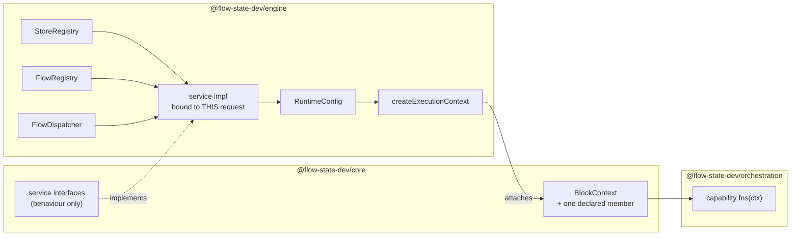

# FIX-999: Public injection seam — a capability cannot legally reach `stores` or `flow` from `BlockContext` — Implementation Spec

**Linear:** [FIX-999](https://linear.app/fixpoint-labs/issue/FIX-999) · **Blocks:** [FIX-982](https://linear.app/fixpoint-labs/issue/FIX-982) (Spec Approved, [#1063](https://github.com/fixpoint-labs/flow-state-dev/pull/1063)) · **Epic context:** [FIX-939](https://linear.app/fixpoint-labs/issue/FIX-939) ([#993](https://github.com/fixpoint-labs/flow-state-dev/pull/993), finding N18)

---

## Part I — The Case *(for the human)*

### 1. Problem — why it matters, why now

A capability is how FSD packages reusable behaviour: a block writes `uses: [cap]` and gets that capability's tools, context, resources, and helper functions. The helpers receive the block's context.

Two things a capability sometimes needs are **present on that context at runtime and absent from its type**: the store layer, and the flow the request is running. Both live on the engine's own context type; the helpers are typed against the one `core` declares, and `core` cannot name either, because it must not depend on `engine`.

So the only way a capability reaches the runtime today is to cast its context to a shape TypeScript says it doesn't have. Fine in a throwaway, unshippable in the framework: **the cast is the only thing holding the package boundary together, and a cast holds nothing.** Nothing warns when the shape it asserts stops being true.

**Why now.** [FIX-982](https://linear.app/fixpoint-labs/issue/FIX-982) — running a claimed task outside the request that claimed it — is Spec Approved and blocked on this. Its spawn arrives as a capability, and the board declaring it lives in a package with `engine` as a devDependency only, so injection is the only route that keeps the boundary intact.

The premise is verified rather than asserted: a `@ts-expect-error` probe over the exported context type is satisfied today, and a control run flipping the probed keys to public ones reports the directive as unused. That probe lives in a file no type-checker visits — a small problem, fixed here.

### 2. Solution in plain terms

Give the framework **one deliberate, named way** for the runtime to hand a capability the few things only the runtime can do — and make what crosses it **behaviour, not handles.**

The engine builds a small set of services and attaches them to the context under a single member `core` declares. A capability reads them through the context it already gets. No cast, and the package graph is untouched: `core` names an interface, `engine` implements it.

**The rule that makes it safe, and the reason this is not just "put `stores` on the context":** every service closes over the running request's identity — tenant, user, org, session, flow — and exposes no parameter that can override it. A capability supplies the *target* of an operation and never the *authority* for it.

Two services ship, because one consumer needs exactly two: get-or-create a child session, and start a request. Flow-resolution-by-kind happens *inside* the second, so no flow instance crosses into `core`.

**Philosophy.** **Tenet 5 (fix at the owning layer)** — the boundary is between `core` and `engine`, so the seam belongs there, once, not at each capability that hits it. **Tenet 3 (earn every addition)** sets the size: one member, two services, for the one consumer that exists rather than the four the issue was filed with (§12). **Tenet 2 (composition)** — no new primitive; this pattern already ships twice (§3).

### 3. Tradeoffs & alternatives

**The alternative the issue proposed, and FIX-982 assumed: expose `stores` and `flow`.** Rejected on a measured property, not a preference. `SessionStore.get(id)` takes no tenant argument — tenancy is a *convention*: build the key with `resolveSessionStorageKey`, check it with `tenantMatches`. The predicate's own doc comment enumerates who must remember: *"the session binding guard, the route session loader, the `latestRequestId` update, and resource/debug reads."* An invariant with N writers, held by discipline at each. Exposing the store layer to capability authors multiplies those writers into code the framework never reviews — and a capability's arguments are routinely model-authored (BP-031, tenet 5).

**The simpler approach: declaration merging.** `engine` could augment the context type from its own module, exactly as instance settings are augmented today. No new member, no wiring, one file. Insufficient twice over: it is global and unnarrowable — every block in every app gets the store layer, with no way to scope it per consumer — and it makes `core`'s public type shape depend on whether `engine` is in the type graph, turning a locked boundary into an accident of module resolution.

**This is not a new pattern, and saying so is the point.** The framework already does this twice: the task-scope mark is declared in `core`, implemented by the engine's context, and called from the orchestration package; the tool-observation hook runs the same way in the other direction. This issue isn't inventing a mechanism — it gives the third instance a **name, a home, and a rule**, because it's the first one large enough that "add another member when someone needs it" stops being an answer.

**Where the complexity actually is:** not the type, which is short. It is **where the seam gets constructed.** `runAction` receives the stores and the runtime config and **never a flow registry** — that plumbing doesn't exist — and seven call sites start a request. A seam wired at some and not others gives you detached work that runs in the HTTP host and silently doesn't in the queue worker. §7 and §9 are mostly about that.

### 4. Focus practices (1–5)

1. **BP-031** — an injection seam is exactly where authorization goes wrong. The answer is structural, not validating: identity is closed over at construction, so a cross-tenant reach is *not expressible* rather than rejected. The dispatch `source` is stamped by the seam, never accepted.
2. **BP-004 (public boundary first)** — the shape of the member *is* the deliverable; the rest is wiring.
3. **Tenet 5 / one convergence point** — two of them: the seam's *construction* must sit where every request-start path passes through, and its *identity binding* inside the services rather than at each capability.
4. **BP-035 (second paths)** — named individually in §9: the seam absent, a host that never wired it, the out-of-process worker, and a memoized helper read from a nested block.
5. **Tenet 3** — one consumer exists (§12), and it sets the scope.

### 5. What using it looks like

*(None of this compiles today.)*

**Writing a capability that reaches the runtime — the whole point:**

```ts
const spawnCapability = defineCapability({
  name: "spawn",
  fns: (ctx) => ({
    spawn: async (args: { childKey: string; flowKind: string; input: unknown }) => {
      const runtime = requireRuntime(ctx);            // named error if no host wired one
      const child = await runtime.sessions.getOrCreateChild(args.childKey, {
        metadata: { topic: "FIX-982" }                // caller's own bookkeeping
      });
      return runtime.dispatch.start({
        sessionId: child.id,
        flowKind: args.flowKind,
        actionName: "…",
        input: args.input
      });
    }
  })
});
```

**What a capability cannot write, and why that is the feature:**

```
before   ctx.stores.session.get(`${someTenant}:${someId}`)   // reachable via a cast today
after    // there is no `stores`. `getOrCreateChild` takes a key, not a tenant.
         // The record it creates carries THIS request's tenant/user/org and
         // THIS session as its parent. No argument can change that.
```

**What an app author writes: nothing.** A host built through the shipped entry points wires the seam already; nothing new appears in `createFlowState` or the router's options.

**What happens with no host** (a unit test, a mock context):

```
ctx.cap.spawn.spawn({...})
  → throws by name: this capability needs a runtime host; none is wired.
     Not `undefined is not a function`, and not a silent no-op.
```

### 6. Decisions & rules — the sign-off surface

1. **What crosses the seam is behaviour, not handles. No `core` type ever names a store or a flow instance.**
   *Rejected:* `stores` / `flow` on the context (the issue's own sketch, and what FIX-982 §7.2 assumes); module augmentation from `engine`.
   *Locks in:* every future addition to the seam is a named verb someone reviews, rather than a surface that grew by transitivity. The cost is real and stated: a consumer needing something the seam doesn't expose comes back here for a verb instead of composing one itself.

2. **Every service closes over the running request's identity at construction. Identity is never a parameter.**
   *Rejected:* accepting `tenantId` / `userId` / `orgId` as arguments and validating them against the context.
   *Locks in:* BP-031 structurally rather than by discipline — the unsafe call has no spelling. It also fixes what the seam may *not* carry: a service that legitimately needs to name another tenant cannot be built on this seam at all, and would need its own decision.

3. **Two services ship — child-session get-or-create, and request dispatch. Flow-resolution-by-kind lives inside dispatch.**
   *Rejected:* a `flows.get(kind)` accessor beside them.
   *Locks in:* the flow instance never becomes a value `core` has to name. A kind that isn't registered is a named error from `start`, not an `undefined` the caller checks. The two services are the minimum FIX-982's spawn composes; nothing is added against a second consumer that doesn't exist.

4. **Dispatch may target any registered flow kind. Admission is the callee's problem, gated on a transport `source` the seam stamps and a caller cannot forge.**
   *Rejected:* restricting dispatch to the current flow kind (which breaks the one consumer — a Workstream legitimately runs a different flow, measured end-to-end by the epic); and a per-target allowlist on the seam.
   *Locks in:* this seam does not invent an authorization model. It reuses the one the framework already has — the `source`-gated action-core resolution every event transport goes through — and it is the *callee* that decides whether a `source` may enter it. **This is the widest point of the seam and the place a reviewer should push hardest.**

5. **The member is framework-facing: on the public type so a sibling package names it without a cast, but not documented in `apps/docs` as an app-author surface.**
   *Rejected:* a documented public capability-authoring surface now; a contract-token registry with runtime lookup.
   *Locks in:* the boundary is legal (which is the whole issue) while the contract stays cheap to change, because nothing outside this repo has been told to build on it. Promoting it later is additive — a docs page and a stability note. This is the decision most worth disagreeing with if you think the four-consumer argument still holds (§12).

6. **The seam is constructed at every engine entry point that can start a request, and a host that omits it is a compile error — not an optional member that is absent in one process.**
   *Rejected:* the optional-and-absent shape the durability provider uses (`ctx.suspend` exists only when a provider is configured).
   *Locks in:* the failure mode that shape would produce here is the dangerous one — detached work that runs in the HTTP host and silently doesn't in the queue worker, discovered in production. Durability can be optional because it is opt-in per deployment; this is not, because whether it is present would depend on which process picked up the job. **Cost, stated:** the internal runtime-config builder gains required inputs, and every request-start call site must supply them (§7.3 enumerates them), the test harness included.

7. **The seam is a per-request value on the execution context. It carries no ambient per-process state, and nothing may be put on it that a second process cannot reconstruct from the runtime config plus the request envelope.**
   *Rejected:* an `AsyncLocalStorage` carrier — the shape the board's per-worker claim scope uses.
   *Locks in:* the seam works identically in-process and in a queue worker, because the worker constructs its own store registry and calls the same entry point in its own process. An ALS value would not, and would not fail loudly. This rule is written as a rule rather than an observation because a neighbouring spec shipped exactly that defect: an ALS carrier assumed across a process boundary it cannot cross. Anything later added to this seam is checked against it.

8. **`ctx.parentSession` is not built here — and the schema question it raises is answered as a rule rather than deferred: anything this seam ever exposes from another session is untyped.**
   *Rejected:* resolving the parent flow's session-state schema from its kind, and requiring the two flows to share one.
   *Locks in:* the question the issue asks ("pick one explicitly") has an answer that falls out of Decision 1 rather than being a preference. Typed access to another flow's session state would require `core` to name that flow's schema, which means naming a flow instance — the exact leak this issue exists to close. So the answer holds whether or not `parentSession` is ever built, and the implicit answer the issue warned about cannot happen.

**Non-goals** — the spawn capability itself and everything it composes (FIX-982); parent-side board settlement (dissolved: FIX-982 settles from inside the child, where a live context exists); a workstream-management capability (unfiled, no consumer); a result-read surface (FIX-1008, cancelled); a general cross-session *resource* read (the epic's OQ-F, still deferred); a bound on request fan-out (open question 2); any change to how capabilities are declared, resolved, merged, or memoized.

**Size:** Medium — two packages plus the request-start call sites, one PR, no PR plan.

---

## Part II — The Build Plan *(for the implementing agent)*

### 7. Technical design

#### 7.1 The shape

The change is one member and its supply chain. Today a capability's helpers see the context `core` declares; the engine's additions are on a type it can't name. After this, one member on the declared type carries request-bound services the engine builds.



Read the dotted edge as the whole issue: `engine` implements an interface `core` declares, and the consuming package depends on neither direction it isn't allowed to.

- **`@flow-state-dev/core`** — declares the service interfaces and the one context member. Names no store, no registry, no flow instance. This is the deliverable; everything below is wiring.
- **`@flow-state-dev/engine`** — implements the services over the store registry, the flow registry, and the dispatcher; carries them on the internal runtime config; attaches them in `createExecutionContext`.
- **Untouched:** capability declaration, resolution, merging, and the `ctx.cap` construction path. The four block kinds. Every store adapter.

#### 7.2 The two services, and what binds them

Both are constructed **per request**, closing over the identity the execution context already resolved.

- **Child sessions.** Get-or-create a session record at a caller-supplied key, using the conditional-write sentinel the scope stores already ship (create-if-absent). The record's `parentSessionId` is **this** request's session; its tenant, user, and org are **this** request's. The caller supplies the key and its own bookkeeping fields, and nothing else. On a lost create race the service **reports the conflict with the existing record** rather than deciding what it means — whether an occupant is "ours" is domain knowledge the seam does not have, and FIX-982 owns that discriminator.
- **Dispatch.** Resolve a flow by kind against the host registry, then start a request in it through the shipped dispatcher. Fire-and-forget: it returns immediately with the request id while the child runs. The seam stamps the transport `source`; the caller cannot set it. Tenant, user, and org are inherited, not passed.

**Why the identity binding lives here and not at each capability.** The tenant key is assembled by convention at every engine call site today (§3). Inside the service there is exactly one assembly site and one predicate, so the invariant holds for every consumer the seam ever gets — the tenet 5 convergence point. Put it at the capability and it holds for the capabilities that remembered.

#### 7.3 Where the seam is constructed — the real work

`RunActionOptions` carries the store registry and the runtime config. It carries **no flow registry**, and the flow registry is what dispatch-by-kind needs. So the plumbing has to be added, and the question is where it converges.

The internal runtime config is the shipped answer for exactly this shape — *"instance-level options forwarded verbatim through the execution chain"* — and BP-026 says to bundle rather than add parameters. So the seam travels there, and its builder takes the registry, the stores, and the dispatcher as **required** inputs (Decision 6), which turns a forgotten host into a type error.

The call sites that start a request and must therefore supply it:

| Where | Note |
|---|---|
| the HTTP router / flow-state entry points | already hold registry + stores at the same point they build the config |
| the in-process dispatcher | inside the transport host, which holds all three |
| request recovery, request continuation | re-entry paths; must not resolve a *different* seam than the original run |
| the two CLI run paths | usually a single flow — a one-entry registry is trivially constructible |
| the queue worker | already holds registry, stores, and its own runtime config in its own process |
| the test harness | the one place a genuinely absent seam is correct (§9) |

That list is the convergence surface. Missing one is the failure Decision 6 exists to prevent, and it is why the builder requires rather than defaults.

#### 7.4 The process boundary — stated, because a neighbour got it wrong

The seam is a **value on the execution context**, constructed by whichever process runs the request. The queue worker builds its own store registry and calls the same entry point with its own runtime config, so the seam is present there identically and **nothing is carried across the boundary at all**. There is no serialization question because there is nothing serialized.

This is deliberately *not* the shape the board's per-worker claim scope uses. That one is an `AsyncLocalStorage` value: per-process, per-async-chain, and unable to reach another process — which is why FIX-982 re-mints the claim ticket inside the child rather than forwarding it. **That re-mint stays FIX-982's**; this seam neither carries the ticket nor needs to. Decision 7 generalizes the lesson into a rule the next addition is checked against.

#### 7.5 Keeping the premise honest

The `@ts-expect-error` probe that establishes "these keys are absent from the declared context" currently lives where the package tsconfig doesn't reach and vitest transpiles without checking. Move it into a project CI type-checks, so that if someone later puts a store handle on the public type, a build fails instead of an assertion quietly becoming vacuous. Small, and named in the issue.

#### 7.6 Solution sketch

> **Pseudocode. Illustrative, not the contract. React to the shape, not the names.**

```
in core — declared, names nothing from engine:

    interface RuntimeServices {
        sessions: { getOrCreateChild(key, fields) -> Created | Conflicted(record) }
        dispatch: { start({ sessionId, flowKind, actionName, input, metadata }) -> { requestId } }
    }

    on the block context:  runtime?: RuntimeServices        ← the whole public surface

in engine — built once per request, at context construction:

    buildRuntimeServices({ stores, flowRegistry, dispatcher, identity }) =>
        sessions.getOrCreateChild(key, fields):
            record = { ...fields,
                       parentSessionId: identity.sessionId,     ← not a parameter
                       tenantId:        identity.tenantId,      ← not a parameter
                       userId, orgId:   identity.…    }
            write it create-if-absent at the tenant-namespaced key
            on conflict: return Conflicted(existing)   ← caller decides what that means

        dispatch.start(args):
            flow = flowRegistry.get(args.flowKind)  or  throw unknown-flow-kind
            dispatcher.dispatch({ ...args,
                                  source:   THE SEAM'S OWN CONSTANT,   ← not a parameter
                                  tenantId, userId, orgId: identity.… })

for a capability:

    requireRuntime(ctx) = ctx.runtime  or  throw "no runtime host wired"
```

What this asks a reviewer: **is a per-request service bundle the right shape, or should the engine instead register named contract implementations that a capability resolves by token?** The bundle is one member and one interface; the registry is a lookup table with a name-collision rule and a resolution order, and it buys extensibility no second consumer has asked for. It is deliberately impossible to tell from this sketch what the member is called or what a conflict result is named — that is the implementer's.

### 8. Implementation sequence

1. **Declare the surface in `core`** — the service interfaces and the context member, with the identity fields conspicuously absent from every argument type. **Test:** a type-level assertion that the member's argument types cannot express a tenant, plus the existing capability type tests still pass. *Depends on:* nothing. **This is BP-004's step and the one worth getting right before anything below it exists.**
2. **Implement the services in `engine`**, constructed from stores + registry + dispatcher and bound to one request's identity. **Test:** the §10 behaviours 1–4, against the in-memory stores. *Depends on:* 1.
3. **Thread the seam to every request-start path** — required inputs on the internal config builder, then each of §7.3's call sites, the test harness last. **Test:** behaviour 5 (a construction site that omits it does not compile) and behaviour 6 (the queue-worker path resolves a seam of its own). *Depends on:* 2.
4. **The no-host path** — a named error from the capability-side helper rather than an `undefined` call. **Test:** behaviour 7. *Depends on:* 1.
5. **Move the premise probe into a type-checked project** (§7.5), and add the changeset (`minor` for `core` and `engine`; the context type gains a member). **Test:** the probe fails when the probed keys are made public. *Depends on:* 1.

**Removals** (tenet 3): none, and that is deliberate rather than an omission. The two existing single-purpose members this seam resembles — the task-scope mark and the tool-observation hook — are *not* runtime-service reaches: one marks a scope, the other installs a sink, and neither is reachable through a store. Folding them in would grow this seam's meaning to "any cross-package context member", which is a different and worse contract. They stay; §11 says why, so the next reader doesn't re-open it.

**No PR plan.** One node — the surface, its implementation, and its wiring are not independently reviewable, and splitting them would ship a declared member nothing populates.

### 9. Edge cases & error handling

| Case | Behaviour |
|---|---|
| No seam on the context (unit test, mock context) | The capability-side helper throws **by name**. Never `undefined is not a function`, never a silent no-op. This is the only context where absence is correct. |
| A host entry point that never wired it | Does not compile (Decision 6). If it somehow reaches runtime, it degrades to the row above rather than to a partly-working seam. |
| Out-of-process (queue worker) | The worker constructs its own seam from its own stores and registry. Nothing crosses the boundary (§7.4). Asserted, not assumed — the in-process case passes trivially either way. |
| `dispatch.start` names an unregistered flow kind | Named error, synchronously, before any record exists. Matches the dispatcher's shipped contract for the same case. |
| Child-session key already occupied | Reported as a conflict **carrying the existing record**. The seam does not adopt, does not overwrite, and does not decide whether the occupant is legitimate — that discriminator is the consumer's (FIX-982 Decision 12). |
| Two requests race on the same child key | One wins the conditional write, the other gets the conflict result. The seam adds no lock; the store sentinel is the fence. |
| Two tenants, identical child key | Different records by construction — the key is tenant-namespaced inside the service, and the tenant is not an argument. **This is the assertion that proves Decision 2**, and it must be written as two tenants reading each other's absence, not as one tenant's happy path. |
| A capability's `fns` result is memoized and read from a **nested** block | Correct **only because the seam closes over request-level facts.** A service that closed over block-level state (block name, attempt, scope) would carry a stale identity into every descendant. Stated as a constraint on what may go on the seam, and pinned by a test that reads a memoized helper from a nested block. |
| Request recovery / same-request continuation | Re-entry must resolve a seam equivalent to the original run's — same stores, same registry — or a recovered request dispatches into a different graph than the one it started in. |
| A capability tries to reach a tenant other than its own | Not expressible. There is no argument for it (Decision 2). If one is ever needed, that is a new decision, not a new parameter. |

**Taxonomy.** Everything here is fatal and loud. There is no degraded mode: a seam that is half-present is the failure this issue exists to eliminate, so every absence throws by name rather than returning `undefined`.

### 10. Testing strategy

**Discipline:** `tdd`. The seam is reachable from a vitest spec through the shipped in-memory stores and a one-flow registry, so every behaviour below is a tracer bullet with no HTTP server involved.

**Goal check.** A real-model goal check does not apply and the reason is specific rather than a shrug: this issue ships **no user-observable behaviour** — it makes a boundary legal so that FIX-982 can ship one. The end-to-end proof belongs to FIX-982's tracer bullet (a foreground turn returning while its detached work keeps running), which is its P3a and cannot run before this lands. Stated here so nobody records a missing goal check as an omission.

**Behaviours to test** (each fails against today's code):

1. A capability's helper reaches the runtime services **with no cast anywhere in the file** — the cast being removable is the whole deliverable, so the test is written to fail if one is reintroduced.
2. A child session created through the seam carries the **current** request's tenant, user, org, and parent session — none of which the caller passed.
3. **Two tenants using the same child key do not see each other's record.** The mirror assertion (each reads *absence*) is the one that matters; asserting only that both succeed passes under a broken implementation.
4. `dispatch.start` starts a request in another registered flow kind, with the seam's `source` on the record, and **returns before the child finishes**.
5. A request-start construction site that omits the seam **does not compile** (a type-level test, since a runtime test cannot observe this).
6. The same capability call works **out of process**, exercised through the queue-worker path. *Falsification:* it must be possible to show the in-process variant passing while an ALS-carried equivalent fails — otherwise the test proves nothing about the boundary.
7. With no host wired, the helper throws a **named** error.
8. A memoized helper read from a **nested** block still resolves the correct request identity.
9. The premise probe reports the directive as **unused** when the probed keys are made public — the control run that makes it a live check rather than a comment.

### 11. Documentation plan

The seam is framework-facing (Decision 5), so this is an internal-contract change, not a site change. **If Decision 5 is reversed at the gate, the site page that gains a section is `apps/docs/docs/advanced/capabilities-authoring.md`, after "ctx.cap"** — recorded here so the reversal doesn't need a second scoping pass.

| File | Change | Placement / notes |
|---|---|---|
| `docs/architecture/capabilities.md` | **Extend** | A new section, "What a capability may reach at runtime", after "What capabilities can contribute". Covers: the member, the two services, the identity-binding rule, and — load-bearing — **what may not go on it**, so the next addition is judged against a written rule instead of a precedent. Also names the two existing single-purpose members and why they stay separate (§8 Removals). |
| `docs/contributing/architecture-reference.md` | **Extend** | One entry under Locked Contracts: the seam's name, that it carries behaviour only, and that identity is closed over. This file is where a reviewer checks a boundary claim, so a seam absent from it reads as not locked. |
| `packages/core/README.md` | **Extend** | One line on the context member under the capability surface. |
| `packages/engine/README.md` | **Extend** | One line: the runtime-config input and which entry points supply it. |
| `apps/docs/**` | **No change** | Per Decision 5. Justified rather than skipped: nothing an app author writes changes, and documenting a framework-facing surface on the site is how it becomes one we can't move. |

**Voice note:** none of these are site pages, so the site voice rules don't bind — but the architecture doc is read by agents as authority, so it states the *rule* ("identity is closed over, never a parameter") rather than describing the implementation.

### 12. Dependencies, open questions & follow-ups

**Dependencies:** none blocking. The conditional-write sentinel the child-session service uses is shipped ([FIX-1007](https://linear.app/fixpoint-labs/issue/FIX-1007), Done), as is the parentage predicate ([FIX-1009](https://linear.app/fixpoint-labs/issue/FIX-1009), Done). Nothing here waits on [FIX-981](https://linear.app/fixpoint-labs/issue/FIX-981): this seam neither carries nor reads the claim ticket, and it is written against a world where `expectAttempt` no longer exists (§7.4).

**The consumer count, because the issue's scope argument rests on it.** The issue was filed naming four consumers. As of today:

| Consumer | Status |
|---|---|
| FIX-982's spawn capability | **Real, blocking, Spec Approved.** The one this is scoped to. |
| A workstream-management capability | **Unfiled.** No issue exists. |
| `ctx.parentSession` | **Unfiled**, and no capability asks for it — the parent-to-child read work in the epic is a route and a client hook, not a capability reach. Decision 8 answers its schema question anyway, so it is not left implicit. |
| Parent-side board settlement | **Dissolved.** FIX-982 settles from inside the child, where a live context exists, so the store-level board-mutation seam it needed no longer has a caller. |

So the "build it once for four consumers" argument is now a **one-consumer** argument, and that is what sets the scope (tenet 3). It does not weaken the case — one blocking consumer with a locked package boundary is sufficient — but it does change what gets built, and the owner should see that the scope moved.

**Open questions for the owner:**

1. **Does a request started through this seam need a fan-out bound, or is that a follow-up?** This seam makes "a running request starts another request" expressible for the first time from inside a block. FIX-982's use is bounded by construction (one task, one request), but the seam is general, and FSD has no budget or depth primitive to fall back on — so a capability with a loop is unbounded model spend with nothing to stop it. Options: **(a)** ship no bound and rely on the consumer, on the argument that the only consumer is bounded and a cap invented without a real load profile is guesswork; **(b)** a depth counter on the dispatched envelope with a low default, which is cheap here and impossible to add later without a migration; **(c)** file it as a follow-up against the first unbounded consumer. I lean **(a)** with (c) filed, because the bound that is actually wanted is probably a cost bound rather than a depth bound and this is the wrong issue to invent one — **but this is a spend-risk call and it is yours, not mine.**

2. **FIX-982 is Spec Approved and its §7.2 names the seam as exposing "`stores`" and "`flow`". This spec deliberately exposes neither. Does FIX-982's spec get amended, or does its own §12 item 3 cover it?** That item already says *"if FIX-999 exposes something narrower, the spawn capability may need a second seam entry"* — so the divergence is inside what that spec anticipated, and its P3a composes the same three operations either way (child session, flow resolution, dispatch); what changes is that it composes them from two named verbs instead of assembling them from raw handles. **My reading is that no re-approval is needed and a one-line note on its spec PR is enough.** But it is an approved spec, and whether an approved direction gets re-opened is not a call I should make quietly.

**Follow-ups (flagged, not built):**

- **A fan-out or cost bound**, per open question 1, against the first consumer that needs one.
- **Promoting the seam to an app-author surface** — a docs page and a stability commitment — when a third-party capability author asks for it (Decision 5). Additive; nothing here forecloses it.
- **The two pre-existing type-test files in `core` that no command type-checks.** §7.5 wires *one* project for the premise probe; the same gap covers those. Not this issue's to fix — worth an `improve-codebase-architecture` pass once a type-test project exists.

---

## Spec evolution

- **Spec drafted** — reframed from the issue's "expose `stores` and `flow`" to **behaviour, not handles**, on a measured property: the store layer carries no tenant argument, so tenancy is a convention held at ~6 named engine call sites, and exposing it to capability authors multiplies those writers into unreviewed code (tenet 5 / BP-031). Scope set by the consumer count, which has moved from the issue's four to one — the other three are dissolved or unfiled — so two services ship, not a general passthrough. Named the pattern as the third instance of one the framework already runs twice, and wrote the process-boundary rule (Decision 7) as a rule rather than an observation, because a neighbouring spec shipped exactly that defect.
