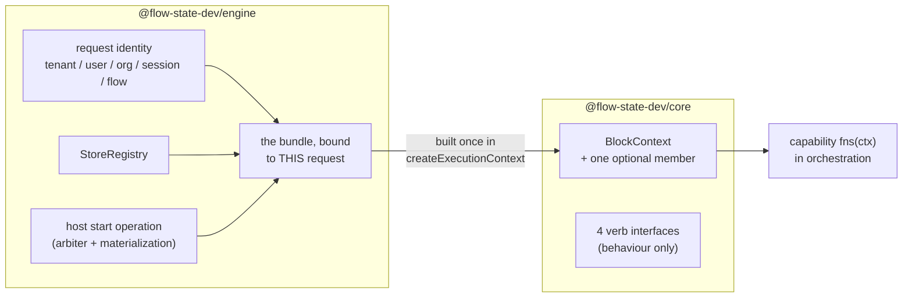

# FIX-999: Public injection seam — a capability cannot legally reach `stores` or `flow` from `BlockContext` — Implementation Spec

## Part I — The Case *(for the human)*

### 1. Problem — why it matters, why now

A capability is how FSD packages reusable behaviour: a block writes `uses: [cap]` and gets that capability's tools, context, resources, and helper functions. The helpers receive the block's context.

Some helpers need to reach the runtime executing them — to start a child session, to settle a durable row that lives in another session, to interrupt a request. Those facilities live on the *engine's* context type. A capability's helpers are typed against the context `@flow-state-dev/core` declares, and `core` must not depend on `engine`. The facilities are there at runtime and unnameable in the type.

So the only route today is to cast the context to a shape TypeScript says it doesn't have. That is fine in a throwaway and unshippable in the framework: **the cast is the only thing holding the package boundary together, and a cast holds nothing.** Nothing warns when the shape it asserts stops being true.

**Why now.** [FIX-982](https://linear.app/fixpoint-labs/issue/FIX-982) — running a claimed task outside the request that claimed it — is **Spec Approved** and blocked on this. It is this seam's **only** consumer, and it has already decided, in an approved document, exactly what it needs and in what shape. This spec's job is to supply that and stop.

The premise is verified rather than asserted: the epic's `@ts-expect-error` probe over the exported context type is satisfied today, and a control run flipping the probed keys to public ones reports the directive as unused. That probe lives in a file no type-checker visits — a small problem this spec fixes, because the issue's own success criterion is that the absence be checked by CI.

### 2. Solution in plain terms

Give the framework **one deliberate, named way** for the runtime to hand a capability the few things only the runtime can do — and make what crosses it **behaviour, not handles.**

The engine builds a small bundle of request-bound operations and attaches it to the context under a single member `core` declares. A capability reads it through the context it already gets. No cast, and the package graph is untouched: `core` names an interface, `engine` implements it.

**Four verbs ship, and the seam is closed at four.** The first three are FIX-982's, named from its approved spec rather than generalized from it; the fourth is the owner's resolution of open question 1 (§12):

1. **Start-or-adopt a detached request** — derive a child session, create it if absent or adopt it if it already exists, and start a request in it.
2. **Settle on the parent board** — read and settle *the one task row this request was dispatched for*, on the board in the session that dispatched it.
3. **Interrupt a request** — record abort intent for a descendant request, and signal it when it runs in this process.
4. **Ask whether descendant requests are still alive** — a narrow, identity-bound liveness read over requests this caller already owns.

**And one guard rail: a ceiling on concurrent detached fan-out.** This seam makes "a running request starts another request" expressible from inside a block for the first time, and FSD has no budget primitive. A configurable maximum, with a safe default, refuses the spawn that would cross it. The owner's framing is **"ceiling now, cancel later"**: stopping runaway spend is this issue's job; cross-process *cancellation* is [FIX-1026](https://linear.app/fixpoint-labs/issue/FIX-1026)'s.

**The rule that makes it safe, and the reason this is not "put `stores` on the context":** every operation closes over the running request's identity — tenant, user, org, session, flow — and exposes no parameter that can override it. A capability supplies the *target* of an operation and never the *authority* for it. The caller cannot even name a session id: it hands over a routing seed and the seam derives the key, principal included.

**Admission is not this seam's invention.** FIX-982's approved spec already specifies it: a transport-set `source` the caller cannot forge resolves **one fixed pre-assembled workstream core** on the current flow. This spec adopts that shape verbatim and adds one invariant it was missing — the branch **must not fall through** to `flow.actions`.

**Philosophy.** **Tenet 5 (fix at the owning layer)** — the boundary is between `core` and `engine`, so the seam belongs there, once, not at each capability that hits it. **Tenet 3 (earn every addition)** sets the size: four verbs, no speculative fifth — three earned by a named consumer with an approved spec, the fourth by an explicit owner decision that priced the alternative (§12). **Tenet 2 (composition)** — no new primitive; this injection pattern already ships twice (§3).

### 3. Tradeoffs & alternatives

**The alternative the issue proposed: expose `stores` and `flow`.** Rejected on a measured property, not a preference. `SessionStore.get(id)` takes no tenant argument — tenancy is a *convention*: build the key with `resolveSessionStorageKey`, check it with `tenantMatches`. The predicate's own doc comment enumerates who must remember. An invariant with N writers, held by discipline at each. Exposing the store layer to capability authors multiplies those writers into code the framework never reviews — and a capability's arguments are routinely model-authored (BP-031).

**The simpler approach: declaration merging.** `engine` could augment the context type from its own module, as instance settings are augmented today. No new member, no wiring, one file. Insufficient twice over: it is global and unnarrowable — every block in every app gets the store layer — and it makes `core`'s public type shape depend on whether `engine` is in the type graph, turning a locked boundary into an accident of module resolution.

**The alternative this spec supersedes, and why it failed.** The previous spec (PR [#1082](https://github.com/fixpoint-labs/flow-state-dev/pull/1082), closed unmerged) answered admission with `internalEntries` — a **fourth action form**: a per-flow map of dispatchable entries outside `flow.actions`. It was sound in isolation and wrong in context. It cost roughly eleven wiring sites (`defineFlow` block aggregation and flow-tool application, `requiresOrg` validation, concurrency classification, session-schema defaulting, three public re-entry routes, and a docs surface), it made a new app-author-facing declaration out of a framework-internal seam, and **FIX-982's approved spec had already rejected a per-coordinate dispatch lookup on record** — its Decision 2 resolves to one fixed core precisely so there is no route from dispatch to a bare block. The previous spec never read that document. Adopting FIX-982's shape deletes the form, the eleven sites, and the docs surface at once.

**Where the complexity actually is:** not the type, which is short. It is **where the seam gets constructed.** `runAction` receives the stores and the runtime config and **never a flow registry**, and seven call sites start a request — one of which, `worker-only`, deliberately has no dispatcher at all. §7.3 and §9 are mostly about that.

**Liveness: what changed, and why the narrow form survives the objection that killed the wide one.** A previous draft carried *is-this-request-alive* / *which-of-these-sessions-are-live* reads; a later draft **deleted** them, because review showed the signal unimplementable as specified — the registry advertises no sharedness, the default backing is per-process memory, and the session-keyed query had no store verb behind it. **The owner has since resolved that open question the other way** (§12): a narrow liveness verb ships here, mirroring `ActiveRequestRegistry.get(requestId)`.

The review objection was never "liveness is a bad idea" — it was "**this signal silently lies.**" Deletion answered it by removing the signal; this design answers it by making the lie **unreachable**, which is the stronger form and the one the owner asked for:

- **It is not a passthrough.** `stores.activeRequests` is not exposed, and the verb does **not** default to `listAll()` — a cross-tenant enumeration is not a shape the seam can produce. The caller asks about requests it already owns; identity filters the answer before it is built.
- **It refuses rather than guesses.** The two conditions that make the signal lie — a per-process registry, and heartbeats too slow (or off) relative to the stale threshold — are checked **at construction**, and liveness is refused when either fails. Today neither is checked: `stale-request-sweeper.ts` only *warns* that a threshold "may be too low", and it deliberately does not consult a flow's `heartbeatIntervalMs` at all. A `heartbeatIntervalMs` of `0` is supported and creates no timer (`runAction.ts:631`), so a perfectly healthy request stops heartbeating and the sweeper reaps it — the signal would report a live request dead. **That is the failure this gate exists to make impossible, and it is enforced, not documented** (Decision 3).
- **Sharedness stops being a guess.** The registry contract gains a declaration and each adapter answers it (Decision 10). Absent ⇒ *not shared*, so an adapter that says nothing gets liveness refused rather than silently wrong.

**Cost, stated:** a fourth verb, a contract addition across four adapters, and a construction-time gate that will refuse liveness in the default in-memory deployment. FIX-982's reconciler (its Decision 9) is the beneficiary — it can now ask this seam instead of naming `ActiveRequestRegistry` from `orchestration`, which it cannot legally do (§12).

### 4. Focus practices (1–5)

1. **BP-031 (never route or authorize from caller-controllable input)** — an injection seam is exactly where authorization goes wrong. The answer is structural, not validating: identity is closed over, the caller cannot name a session id, and the dispatch `source` is stamped by the seam. The unsafe call has no spelling.
2. **BP-004 (public boundary first)** — the shape of the member *is* the deliverable; the rest is wiring.
3. **Tenet 5 / one convergence point** — two of them: the seam's *construction* sits where every request-start path passes through, and its *identity binding* lives inside the operations rather than at each capability.
4. **BP-035 (second paths)** — named individually in §9: the seam absent, a host that never wired it, the `worker-only` process, an enqueue that fails after the child exists, and the *off* state (a flow with no workstream core).
5. **Tenet 3** — nothing goes on the seam without a named consumer blocked without it, **or an owner decision that overrides the count on record.** Three verbs take the first route (FIX-982, approved spec); the liveness verb and the fan-out ceiling take the second, and §12 says so rather than retro-fitting a consumer.

### 5. What using it looks like

*(None of this compiles today. Names are illustrative — the surface is the implementer's.)*

**Writing a capability that reaches the runtime — the whole point:**

```ts
const spawnCapability = defineCapability({
  name: "spawn",
  fns: (ctx) => ({
    spawn: async (args: { seed: RoutingSeed; input: unknown }) => {
      const runtime = requireRuntime(ctx);            // named error if no host wired one
      return runtime.startDetached({
        seed: args.seed,        // routing tuple; the seam derives the session id from it
        input: args.input,
        record: { topic: args.seed.topic }            // caller's own bookkeeping
      });
      // → { sessionId, requestId, adopted: boolean }
      //   or a named refusal:
      //   "key-occupied" | "no-workstream-core" | "no-start-operation" | "fan-out-ceiling"
    }
  })
});
```

**Settling the row this request was dispatched for:**

```ts
await runtime.settleParentTask({ outcome: "complete", output, claim });
// Resolves the board in the PARENT session, addresses exactly one row — the one
// this request carries — and writes. `runtime.parentTask()` reads that same row.
```

**What a capability cannot write, and why that is the feature:**

```
before   ctx.stores.session.get(`${someTenant}:${someId}`)   // reachable via a cast today
after    // there is no `stores`, and no verb takes a session id. The seam DERIVES the
         // child key from the seed plus THIS request's principal. Another user's
         // session is not a value a capability can produce.

before   runtime.start({ flowKind: "other-flow", actionName: "someAction" })
after    // neither parameter exists. Dispatch enters the CURRENT flow's workstream
         // core or is refused by name. `flow.actions` is not reachable at all.

before   runtime.isRequestAlive(requestId)          // and ctx.stores.activeRequests.listAll()
after    runtime.livenessOf([requestId, ...])       // BATCH, and identity-filtered: it
         // answers only for requests descended from this one, under this principal.
         // There is no `stores.activeRequests`, no `listAll()`, and no session id.
         // Refused at CONSTRUCTION — not at call time, and not silently — when the
         // registry is per-process or heartbeats cannot keep pace with the stale
         // threshold, because that is when the answer would be a lie (§7.2(d)).
```

**What an app author writes: nothing.** There is no opt-in declaration and no new flow config. A host built through the shipped entry points supplies the seam's inputs already. The one exception is a deployment running dispatching capabilities in a **`worker-only`** process, which must wire a start producer there — a construction-time error, not a surprise at the first spawn.

**What happens with no host** (a unit test, a mock context):

```
ctx.cap.spawn.spawn({...})
  → throws by name: this capability needs a runtime host; none is wired.
     Not `undefined is not a function`, and not a silent no-op.
```

### 6. Decisions & rules — the sign-off surface

1. **What crosses the seam is behaviour, not handles. No `core` type ever names a store, a flow instance, a session record, or a task row.**
   *Rejected:* `stores` / `flow` on the context (the issue's own sketch); module augmentation from `engine`; returning a `SessionRecord` on a conflict.
   *Locks in:* every future addition is a named verb someone reviews, rather than a surface that grew by transitivity. The cost is real and stated: a consumer needing something the seam doesn't expose comes back here for a verb instead of composing one itself. Anything the seam returns from another session is a narrow, **untyped** value the consumer parses with its own schema — `core` cannot name `orchestration`'s types either.

2. **Every operation closes over the running request's identity at construction. Identity is never a parameter — and neither is a session id.**
   *Rejected:* accepting `tenantId` / `userId` / `orgId` and validating them; accepting a `childKey` the caller names.
   *Locks in:* BP-031 structurally. The caller hands over a **routing seed**; the seam derives the child session id by hashing the principal together with that seed, so two users cannot land on one child even when a model authors the same topic. This is the structural form of the defect [FIX-1022](https://linear.app/fixpoint-labs/issue/FIX-1022) fixes generally, and it holds on this path **whether or not FIX-1022 has landed** (§12).

3. **The seam carries exactly four verbs, and is closed at four: start-or-adopt a detached request · settle on the parent board · interrupt a request · read liveness for descendants you own.**
   *Rejected:* a passthrough liveness read (`ctx.stores.activeRequests`) and a `listAll()`-shaped one — **both still rejected**, and the second is why this verb is batch-and-filtered rather than an enumeration; **lease renewal as the fallback signal** — it stays a rejected alternative in [FIX-1005](https://linear.app/fixpoint-labs/issue/FIX-1005) §3 and is not adopted here; a `flows.get(kind)` accessor; a general cross-session resource read (the epic's OQ-F, still deferred); a fifth verb of any kind.
   *Locks in:* three of the four are FIX-982's, read off its approved spec rather than generalized from it. **Start-or-adopt is one verb** because the child's creation and its request cannot disagree, and because a transient enqueue failure must not permanently occupy a derived key — adoption starts a request in an existing child, which is also the *normal* path when a second task reuses a topic. **Settle is read-then-write on one row** — the row this request was dispatched for — because the fence (FIX-982's claim ticket) is minted from the row the same operation verifies; splitting them would make the ticket caller-carried, the shape FIX-981 rejects.

   **Interrupt** targets a request in a session descended from the current one, same principal; nothing else is addressable. **Its contract is what the engine actually delivers today, not what a previous draft claimed.** Review found — and the code confirms — that persisting `abortRequested` does not deliver an abort: the heartbeat timer calls only `registry.heartbeat(requestId)` (`runAction.ts:631-638`) and never reads the flag; the flag is read once, inside the terminal `catch`, *after* `composedSignal` already fired, purely to tell an intentional abort from a dropped connection (`runAction.ts:1561-1570`); and `abort-routes.ts:59-61` fires the in-process controller only when the target runs in the same instance. So the verb promises exactly two things and reports which happened: it **records** durable intent, and it **signals** when the target is in this process. **Cross-process delivery is not promised and is [FIX-1026](https://linear.app/fixpoint-labs/issue/FIX-1026)'s** — the same deferral the owner made when choosing "ceiling now, cancel later" (Decision 11). A verb that claimed cross-process cancellation would be the one kind of lie this seam cannot afford: a caller that believes runaway work was stopped, and stops watching.

   **Liveness** is the owner's resolution of open question 1, and it ships in the one shape that cannot lie. It mirrors `ActiveRequestRegistry.get(requestId)`, takes a **batch** of request ids (a stale-set read is the preferred implementation — it is what keeps FIX-1005's reconciler from an N+1), answers only for requests descended from the caller under the same principal, and returns a plain alive/not answer — never an entry, never another tenant's row. **The enablement gate is enforced at construction, not documented:** liveness refuses to enable unless the request registry **declares itself shared across processes** (Decision 10) **and** the flow's `heartbeatIntervalMs` is non-zero and fast enough for the sweeper's stale threshold. Both halves are load-bearing against real code: `heartbeatIntervalMs: 0` is supported and creates no timer, yet the stale sweeper still reaps the healthy request — and the sweeper deliberately never consults the per-flow interval (`stale-request-sweeper.ts:40-42`), so nothing today relates the two. **Cost, stated:** the default in-memory deployment gets liveness refused by name at construction. That is the intended outcome — a refusal an operator can see beats a boolean that is wrong under load.

4. **Admission is FIX-982's shape, adopted verbatim: the transport-set `source` resolves one fixed pre-assembled workstream core. The branch does NOT fall through.**
   *Rejected:* `internalEntries` — a fourth action form, ~11 wiring sites, already rejected on record by FIX-982's Decision 2; a source gate that falls through, which is **unsound** (`resolve-action-core.ts:107` returns `flow.actions[actionName]` for any unrecognized source, so a stamped source admits everything).
   *Locks in:* the security boundary, as one invariant instead of a form. FIX-982's P2 declares the branch; this spec states the rule it must satisfy — **absent core ⇒ named refusal, never `flow.actions`** — and ships the test that fails if it ever falls through. There is no route from the seam to a caller-addressed action, so no admission model is invented and none is bypassed. **Still the widest point of the seam and where to push hardest.**

5. **The seam names no flow. It dispatches into the flow the current request is already running.**
   *Rejected:* a `flowKind` parameter and cross-flow dispatch (the previous spec's Decision 4).
   *Locks in:* four problem classes at once, because they were all consequences of targeting a *different* flow — binding the child to the wrong flow kind, validating the target's `requiresOrg` on a path the host never validates, applying a foreign flow's session-state defaults, and resolving concurrency against a foreign action map. **The evidence is FIX-982's own approved shape:** its workstream core is assembled *"once per flow at definition time"* from bindings the board's drain sequencer stamps, and the board is declared in the flow whose action drains it — so the target flow *is* the current flow. The epic's earlier "a Workstream may run a different flow" measurement predates that fold and described the per-coordinate binding FIX-982 replaced. **If a future consumer genuinely needs a cross-flow target, that is a new decision on this seam, not a parameter to add.** This is the decision to challenge if you think FIX-982's core can sit in a flow other than its board's.

6. **Hosts supply *construction inputs*; `createExecutionContext` builds the bundle once. A process that executes requests but cannot start one fails at construction, by name.**
   *Rejected:* the optional-and-absent shape the durability provider uses (`ctx.suspend`); passing a pre-built bundle at each call site.
   *Locks in:* seven request-start sites forward dependencies they mostly already hold, and exactly one place constructs; nested scopes inherit the same object reference, as `stores` already does. **The premise that every process can start a request is false:** `createFlowState.#buildRuntime` skips `worker.createDispatcher(runtime)` when `mode === "worker-only"` (`createFlowState.ts:304-305`), and the queue worker calls `runAction` with registry, stores and runtime config only. So capability-initiated dispatch is a **declared deployment property** — a deployment whose capabilities dispatch must supply the start operation in every process that executes them, `worker-only` included. **Cost, stated:** `worker-only` gains a wiring obligation it does not have today, and that is a change to a shipped mode.

7. **Dispatch composes the *host-level* start operation, and start is not reported until the dispatcher has accepted it.**
   *Rejected:* calling `FlowDispatcher.dispatch` directly; awaiting `finished`.
   *Locks in:* the arbiter is host-owned and singular (`createInboundTransportHost.ts:121`), and enqueue-time materialization writes the `in_progress` record *before* the worker picks the job up, deregistering on a failed hand-off. Bypassing the host skips every action's concurrency policy and returns a request id that 404s under queue latency. The verb therefore awaits the host's `accepted` promise — an enqueue that rejects after the child was created must surface as a failure, not as a `Started` with nothing running.

   **Correction from review, and it is a real hole rather than wording.** A previous draft said the verb awaits `accepted` *"where one exists"*. It does not exist where it is most needed. `accepted` is assigned **only** on the external-dispatcher branch (`:335`); the code leaves it `undefined` for in-process and says so (`:205-208`). But the in-process **queued** branch (`decision.policy === "queue"`) performs exactly the same enqueue-time materialization (`:237-260`) and hands back a handle whose `accepted` is `undefined` — so "await where one exists" degrades to "don't await" on the one in-process path that can defer a start. A detached spawn there would report Started before the record is discoverable, and before a failed materialization is known. **So this spec requires the host to expose acceptance for that branch too:** the `materialized` promise already exists at `:237` and simply is not surfaced, so this is a narrow change, and `accepted` becomes non-optional wherever a start is deferred. Awaiting an absent promise is not a weaker guarantee, it is no guarantee — and it would have shipped looking like one.

8. **The *member* is framework-facing and undocumented in `apps/docs`. The *fan-out ceiling* and the *liveness gate* are operator-facing and documented.**
   *Rejected:* a documented app-author surface for the seam; and — after the owner's answers — the previous draft's flat "no `apps/docs` change", which is no longer true.
   *Locks in:* the boundary is legal (the whole issue) while the seam's contract stays cheap to change. There is still **nothing an app author declares** to use the seam, so "framework-facing" remains a true description of the member rather than a withheld doc page. But Decision 11 adds a spend brake with a default an operator will eventually raise, and Decision 3's gate will refuse liveness by name on the default in-memory registry — both are deployment behaviour someone hits without ever writing a capability, and an undocumented refusal reads as a bug. §11 splits them accordingly. Promoting the member itself later stays additive.

9. **The absence of the runtime facilities from the public context type is pinned by a type test CI actually runs.**
   *Rejected:* leaving the probe in a file no type-checker visits, which is where it lives today.
   *Locks in:* the issue's own success criterion. The premise this seam rests on — that `stores` and `flow` are not on `BlockContext` — is currently asserted by an `@ts-expect-error` that nothing checks, so it can go stale silently. Pinning it is small and is the difference between a verified premise and a remembered one.

10. **Every request registry declares whether it is shared across processes. Absent ⇒ not shared. FIX-999 owns this flag; it does not get its own issue.**
   *Rejected:* inferring sharedness from the adapter's identity (a `postgres` name is not a contract); documenting the requirement and trusting the operator — the thing the owner explicitly ruled out; parking the flag in FIX-1005.
   *Locks in:* `ActiveRequestRegistry` (`stores/types.ts:567-585`) exposes `register` / `heartbeat` / `deregister` / `listStale` / `listAll` / `get` and **advertises nothing about sharedness** — which is precisely why review called the liveness signal unimplementable. One declaration on the contract, answered by each of the four shipped adapters (in-memory, filesystem, SQLite, Postgres), turns Decision 3's gate from a hope into a check.
   **Default is fail-closed:** an adapter that does not declare is treated as **per-process**, so a third-party registry gets liveness *refused* rather than *wrong* (BP-030 — `== null`-guard the new field; BP-031's posture on unverifiable input). Postgres declares shared; in-memory declares not. SQLite and filesystem back onto a shared path in some deployments and a per-process temp dir in others, so where the adapter cannot know from its own construction, **it declares not shared.**
   **The ownership call, since the owner flagged it as unassigned between FIX-999 and FIX-1005:** it belongs **here**, in this PR, because *this* issue is the one that cannot be correct without it — Decision 3's gate is required to be enforced, and its predicate is unknowable until adapters answer it, so shipping the flag elsewhere reduces FIX-999's hard requirement to documentation, the exact outcome that was rejected. FIX-1005 is `Backlog` with no spec; making an in-flight hard requirement wait on an unspecced issue inverts the dependency. **And it does not want its own issue:** a boolean plus four adapter answers is roughly thirty lines, it has no meaning without a consumer to gate on it, and splitting it would buy a cross-PR merge dependency for nothing. *If* it turns out to ripple — a migration, or third-party adapters we need to shepherd — that is the signal to split it, and the implementer should raise it rather than absorb it.

11. **A configurable ceiling on concurrent detached fan-out ships here, with a safe default. Cross-process cancellation does not.**
   *Rejected:* shipping no bound and filing a follow-up (the previous draft's lean, now overridden on record); a *depth* bound, which does not bound spend — one level of runaway breadth costs the same as ten of depth; blocking this seam on FIX-1026.
   *Locks in:* the owner's **"ceiling now, cancel later."** This seam is what makes in-block spawn expressible for the first time, and FSD has no budget primitive, so the brake ships with the mechanism rather than after the first bill. **The ceiling is scoped to the caller's descendant lineage, and that is derived rather than chosen:** a deployment-wide count would require exactly the `listAll()` enumeration Decision 3 forbids, so lineage scope is the only one reachable through the seam the owner authorized. The two answers compose — the liveness verb is what makes "concurrent" countable, and its batch/stale-set shape is what keeps the check one query instead of N.
   At spawn the seam counts live detached descendants of this request's lineage and refuses by name (`fan-out-ceiling`) at the ceiling. **Default: 32** — high enough that FIX-982's use, bounded by its board width, never reaches it; low enough that recursive spawn stops in seconds. The implementer confirms that number against FIX-982's actual board width before shipping it.
   **Cost, stated:** the ceiling refuses, it does not cancel. Work already running above the line keeps running, and a deployment whose registry does not support liveness (Decision 10) cannot count concurrency at all — there, the ceiling degrades to a per-request branching bound, which is weaker and must be named as such rather than reported as the same guarantee. **FIX-1026 owns cross-process cancel**, and until it lands the ceiling is the only brake.

**Non-goals** — the spawn capability itself and everything it composes (FIX-982); **populating** the workstream core (FIX-982 P2 — this spec declares the property and the terminal branch that reads it, per §7.4, but ships no core); `ctx.parentSession`; a workstream-management capability; a result-read surface (FIX-1008, cancelled); a general cross-session resource read (the epic's OQ-F); **cross-process abort delivery and cross-process cancellation (FIX-1026)** — the interrupt verb records intent and signals in-process only (Decision 3); the general fixes for [FIX-1021](https://linear.app/fixpoint-labs/issue/FIX-1021) / [FIX-1022](https://linear.app/fixpoint-labs/issue/FIX-1022), which are live defects on `main` with their own issues; any change to how capabilities are declared, resolved, merged, or memoized.

**Size:** **Large — one PR.** The owner's two answers moved this off Medium, and the honest accounting is: four verbs rather than three, a contract addition across four store adapters, a construction-time enablement gate, the fan-out ceiling, and the minimal `flow.workstream` property plus its terminal resolver branch. The dominant cost — construction wiring across the seven request-start sites — does not grow, which is why this stays **one PR** rather than becoming a PR plan. Two flags for the implementer to raise rather than absorb: if the adapter declaration ripples into a migration (Decision 10), or if the ceiling's lineage count cannot be made a single query, the split conversation is worth having then.

---

## Part II — The Build Plan *(for the implementing agent)*

### 7. Technical design

#### 7.1 The shape

One member and its supply chain. Today a capability's helpers see the context `core` declares; the engine's additions are on a type it cannot name. After this, one member on the declared type carries request-bound operations the engine builds.



The member is **optional** on `BlockContext`, matching the shipped precedents (`_markTaskScope?`, `_writeToolObservation?`, `suspend?` — `packages/core/src/types/block.ts`). Optional in the *type* is not optional in *deployment*: Decision 6 makes a host that executes requests without it a construction failure. The optionality exists so a hand-built test context still type-checks, and the consumer's accessor throws by name when the member is absent.

#### 7.2 The four verbs

**(a) Start-or-adopt a detached request.** Takes a routing seed and an input. Derives the child session id as a hash of `[principal, seed]` — the caller never names it. Then:

- **Absent** → create the child (create-if-absent, [FIX-1007](https://linear.app/fixpoint-labs/issue/FIX-1007)'s `expectedVersion: "absent"`), applying the flow's session-state defaults before the conditional write, and start.
- **Present and the stored routing tuple matches the seed** → adopt and start. This is the ordinary second-task-same-topic path, and it is also what makes a failed enqueue recoverable rather than permanently occupying the key.
- **Present and the tuple does not match** → named refusal (`key-occupied`). No record crosses the seam; the discrimination happens inside, and the consumer gets a name.

The child inherits tenant, user, org and flow kind from the current request, and records the current session as its parent. Start goes through the host operation (Decision 7) and awaits acceptance.

**Session-state defaults are not optional.** `session-routes.ts` parses initial state through the flow's session state schema *before* persisting, precisely so typed block reads never observe missing keys, and execution does not retroactively initialize an existing record. A child created by this verb bypasses that route, so the verb must apply the same defaulting.

**(b) Settle on the parent board.** The request carries, server-stamped at spawn, the parent session id and the board/task coordinate. The verb resolves the collection **in the parent session's scope** and exposes exactly two operations against **one row**: read it, and settle it (complete or fail) presenting the caller's fence.

The bound is the point: this is not a cross-session resource browser. One coordinate, one row, both server-derived. The read exists because FIX-982's start gate re-reads the row to verify staleness, select the worker, and mint the claim ticket — and the ticket must come from the row the settlement will fence against, which is why read and write are one verb rather than two.

`scopeIdentityId` resolves `session` to the *current* session key, which is why the ordinary resource path cannot do this and a seam is required at all (the epic's N66/N68). The value returned is untyped (Decision 1); `orchestration` parses it with its own task schema.

**(c) Interrupt a request.** Marks a request for abort. Authority is closed over: the target must be a request in a session whose parent chain reaches the current session, under the same principal. The seam performs that check with facts it reads itself; there is no parameter that widens it.

**Delivery is the part a previous draft got wrong**, and the correction narrows the contract rather than adding machinery (Decision 3). The verb does two things and **returns which one happened**:

| Target | What the verb does | What the caller is told |
|---|---|---|
| Runs in **this** process | Persists `abortRequested`, then fires the in-process controller — the same two steps `abort-routes.ts:53-61` takes | `"signalled"` — the run is being torn down |
| Runs in **another** process, or is queued | Persists `abortRequested` only | `"recorded"` — intent is durable, **delivery is not promised** |

The reason is mechanical: the heartbeat timer calls only `registry.heartbeat(requestId)` (`runAction.ts:631-638`), nothing polls the flag, and `runAction` reads it exclusively inside its terminal `catch` once `composedSignal` has already fired — to label an abort that some *other* mechanism caused. A flag nobody reads is not a delivery path. Closing that is [FIX-1026](https://linear.app/fixpoint-labs/issue/FIX-1026)'s (a poll on the existing heartbeat tick is the obvious shape, and it is a change to `runAction`'s hot loop that this seam should not make on its way past). Until then the honest verb reports `"recorded"`, and the fan-out ceiling (§7.5) is what actually bounds the damage.

**(d) Liveness for descendants you own.** Takes a **batch** of request ids and returns, for each, whether it is still live — nothing else. Not an entry, not a record, not another tenant's row (Decision 1). Identity filters *before* the answer is built: an id outside the caller's descendant chain, or under a different principal, comes back indistinguishable from an unknown id, for the same reason interrupt uses a not-found shape.

Two implementation notes that are constraints rather than taste:

- **Batch, not per-id.** `ActiveRequestRegistry.get(requestId)` is the mirror for *semantics*; it is not the query shape. FIX-1005's reconciler asks about a set, and a per-id loop is the N+1 the owner asked to avoid — so a single `listStale(threshold)`-backed read, intersected with the caller's set, is the preferred implementation. `listAll()` is **not** an acceptable fallback: it enumerates across tenants.
- **The enablement gate runs at construction** (Decision 3). Liveness is wired only when the registry declares itself shared (§7.6) **and** `flow.request?.heartbeatIntervalMs` is non-zero and comfortably below the sweeper's stale threshold — the sweeper's own guidance is `staleThresholdMs >= 2 * heartbeatIntervalMs` (`stale-request-sweeper.ts:13`), which is the ratio to enforce rather than warn about. When either fails, the verb is **absent and named** at construction, exactly as a missing host is (§9). It must not be present-but-lying.

#### 7.3 Construction, and the seven sites

The gap is not "nobody builds the bundle" — it is that the **flow registry never reaches `runAction`** today. Hosts pass construction inputs (the registry, the stores, the host-level start operation) on the runtime config / run options; `createExecutionContext` builds the bundle once; nested scopes inherit the same reference.

Seven production paths start a request: the in-process dispatcher, request recovery, request continuation, the two CLI entry points, the BullMQ worker, and `testFlow`. Each forwards inputs it mostly already holds. The one that is a real change is `worker-only`, which today constructs no dispatcher at all — Decision 6 makes that a construction-time failure when capabilities in that process dispatch.

#### 7.4 Admission: what this spec owns and what it requires

**Ownership, stated once, because a previous draft split it two ways and neither reviewer could tell who lands what.** The rule is:

| Artifact | Owner | Why |
|---|---|---|
| The source constant the seam stamps | **FIX-999** | The seam is the only thing that stamps it |
| The `flow.workstream` **property** — declared, and `undefined` until something populates it | **FIX-999** | See below: without it this PR does not compile |
| The terminal `resolveActionCore` branch | **FIX-999** | It is the security invariant, and it is meaningless without the property |
| The arbiter classification for the new source | **FIX-999** | Same hunk-collision argument |
| The workstream core itself — **populating** `flow.workstream` | **FIX-982 P2** | It is assembled from that issue's drain-sequencer bindings |

**This is a correction, not a restatement.** The previous draft assigned both the property *and* the branch to FIX-982 in its non-goals while requiring both in §8 — and review was right that the result cannot be built: `FlowInstance` has no `workstream` member anywhere in the repo today, FIX-982 is itself blocked on this seam, so a one-PR FIX-999 could neither compile the branch nor exercise behaviour 7 ("a flow with no workstream core refuses by name"). Declaring the property here makes the *off* state real and testable — which is exactly the state behaviour 7 asserts — and leaves FIX-982 nothing to do but fill it in. It also removes the duplicate-hunk risk both reviewers flagged: only one issue edits `resolve-action-core.ts`.

This spec therefore ships the **source constant**, the **property**, and the **invariant the branch must satisfy**:

```
if (source === TASKBOARD_SOURCE) {
  return flow.workstream;        // may be undefined — a NAMED refusal upstream
}
return flow.actions[actionName]; // unreachable for this source
```

The current code returns `flow.actions[actionName]` at `resolve-action-core.ts:107` for any unrecognized source. A branch that merely *prefers* the workstream core and falls through when it is absent reintroduces exactly the hole review round 1 found. The branch must be terminal for this source.

Two neighbouring paths enumerate forms and need the new source classified with the other three:

- **Concurrency.** `arbiter.ts:143-147` classifies webhook / chat / scheduled as events and otherwise reads `flow.actions[actionName]?.concurrency`. Add the new source, so a detached request takes the flow default rather than inheriting an unrelated action's `queue`/`reject` policy by name collision.
- **Public re-entry.** `recovery-routes.ts` (retry, continue) and `resume-routes.ts:97` are **deny-lists naming only `webhook`**, and retry accepts a caller-supplied `inputOverride` while preserving the original source. Any new source inherits the hole by default.

  **The merge order is fixed here rather than left as a fork**, because the previous draft's "compose FIX-1021's allow-list, *or* add the refusal directly" let an implementer ship the one thing this spec says must not survive — a deny-list. The rule: **this PR introduces `isPublicReentryAllowed(source)` as an allow-list** and routes all three call sites through it, admitting today's public sources and omitting this seam's. **FIX-1021 then generalizes that predicate** rather than replacing it. This does not wait on FIX-1021 (it is `Todo`, and this seam must not ship re-enterable), it does not ship a one-off guard, and it leaves FIX-1021 strictly less work than it has now. If FIX-1021 lands first, this PR consumes its predicate unchanged and the step is deleted.

#### 7.5 The fan-out ceiling

A configurable maximum on concurrent detached fan-out, checked inside the start-or-adopt verb before anything is created (Decision 11).

- **What is counted:** live detached requests in the caller's descendant lineage, under the same principal. Not a deployment-wide total — that needs `listAll()`, which Decision 3 forbids, so the reachable scope and the authorized scope are the same scope.
- **How it is counted:** the liveness verb's batch read (§7.2(d)) over the lineage's recorded request ids, one query. This is the second reason the batch shape is a constraint rather than a preference.
- **On the ceiling:** refuse by name (`fan-out-ceiling`) before the child session is derived or created. Refusing after creation would leave a derived key occupied by a child that never ran — the failure mode start-or-adopt exists to avoid.
- **Configuration:** one number on the runtime config, default **32**, overridable per deployment. The default is chosen to sit above FIX-982's board width and far below anything that survives a runaway loop; confirm it against that width before shipping.
- **When liveness is not enabled** (Decision 10's gate refused it), concurrency is not countable. The ceiling then degrades to a **per-request branching bound** — how many spawns *this* request may issue — which is weaker, and the refusal names which of the two is in force. Reporting the weaker bound as the stronger one is the failure to avoid here.

#### 7.6 The registry sharedness declaration

`ActiveRequestRegistry` (`stores/types.ts:567-585`) gains one declaration answering whether its entries are visible across processes. Four shipped adapters answer it: the in-memory and filesystem registries (`stores/memory/`, `stores/filesystem/`), SQLite, and Postgres.

Read it with a `== null` guard and treat absent as **not shared** (BP-030) — an out-of-tree adapter compiled against the old contract keeps working and simply does not get liveness. The gate consumes this at construction; nothing else reads it.

### 8. Implementation sequence

One PR. Order matters — nothing can dispatch until admission is terminal and re-entry is closed.

1. **`core`:** the optional member and the **four** verb interfaces. Behaviour only; no store, flow, session or task type named.
2. **`engine`, admission first:** the source constant; the `flow.workstream` property, declared and unpopulated (§7.4); the `resolveActionCore` branch, terminal for this source; the arbiter classification; `isPublicReentryAllowed(source)` as an allow-list, with all three re-entry call sites routed through it.
3. **`engine`, the sharedness declaration:** the `ActiveRequestRegistry` field and the four adapter answers, absent ⇒ not shared (§7.6). Before the gate, because the gate reads it.
4. **`engine`, construction:** construction inputs on the runtime config / run options; the bundle built once in `createExecutionContext`; the seven sites forwarding; the `worker-only` construction-time failure; **the liveness enablement gate** — wire the verb only when the registry is shared and the heartbeat/stale ratio holds, and refuse by name otherwise.
5. **`engine`, host acceptance:** expose `accepted` on the in-process queued branch of `createInboundTransportHost` from the `materialized` promise that already exists at `:237` (Decision 7). Before the verbs, because start-or-adopt awaits it.
6. **`engine`, the verbs:** child-key derivation with the principal; the fan-out ceiling checked **before** the child is derived (§7.5); create-if-absent with session-state defaults, adopt-on-match, named refusal on mismatch; host-level start awaiting acceptance; parent-board read/settle bounded to one row; interrupt with the descendant check, returning `signalled` / `recorded`; batch liveness intersected with the caller's lineage.
7. **The type test:** pin the absence of `stores` / `flow` from `BlockContext` in a project CI type-checks.

**Removals** (tenet 3): the epic's `@ts-expect-error` probe file, once step 7 supersedes it — a probe nothing runs is worse than none, because it reads as coverage. Delete it in the same change rather than leaving two.

### 9. Edge cases & error handling

| Case | Behaviour |
|---|---|
| Host wired no seam | Consumer's accessor throws **by name**. Not `undefined is not a function`, not a silent no-op. |
| `worker-only` process executing a dispatching capability | **Construction-time** failure, by name. Not a failure at the first spawn. |
| Flow has no workstream core (the *off* state) | Named refusal. **Never** falls through to `flow.actions`. Asserted against a flow that *has* an action of the same name, or the test passes with the fall-through intact. |
| Enqueue rejects after the child was created | The verb reports failure, not `Started`. The child record is **left in place**; a retry adopts it and starts. Deleting it would race a concurrent adopter. |
| Derived key occupied by a non-matching record | Named refusal (`key-occupied`). No record crosses the seam. Same-principal only, since the principal is in the derivation. |
| Two users, same seed | **Different child keys by construction.** Not "rejected" — not expressible. |
| Public retry / continue / resume of a detached request | Refused. The seam's source is not on the re-entry allow-list. |
| Interrupt naming a request outside the caller's descendant chain | Refused. Not-found shape, so it is indistinguishable from a missing request. |
| Target flow's session schema has defaults | Applied before the conditional write, matching the create route. |
| Nested block reads a memoized capability helper | Same bundle reference as the root scope, as `stores` already propagates. |
| Out-of-process worker | Reconstructs the bundle from its own runtime config and the request envelope. Nothing ambient (Decision: no ALS). |
| Registry does not declare itself shared (incl. the default in-memory one) | Liveness verb **absent, named at construction**. Not present-and-wrong. The other three verbs are unaffected. |
| `heartbeatIntervalMs: 0`, or too slow for the stale threshold | Same: liveness refused at construction. This is the case that reads healthy-as-dead today, since no timer is created (`runAction.ts:631`) but the sweeper still reaps. |
| Liveness asked about a request outside the caller's lineage | Answered as not-live — **indistinguishable from an unknown id.** No enumeration, no existence oracle. |
| Interrupt whose target runs in another process | Persists intent, returns **`"recorded"`**, does not claim delivery. FIX-1026 owns the delivery path. |
| Fan-out ceiling reached | Named refusal (`fan-out-ceiling`) **before** the child key is derived, so no key is occupied by a child that never ran. |
| Ceiling reached with liveness unavailable | Falls back to a per-request branching bound and **says which bound refused it**. The weaker guarantee is never reported as the stronger one. |
| In-process **queued** start (`policy === "queue"`) | Awaits acceptance like the external branch, via the newly exposed `accepted` (Decision 7). Previously this path awaited nothing. |

### 10. Testing strategy

Feature → TDD, vertical slices. Behaviours, each failing against today's code:

1. A capability's helper reaches the runtime **with no type assertion in the file** — the compile-time deliverable.
2. `stores` and `flow` are **absent** from the public `BlockContext`, pinned by a type test CI runs. *Falsification:* flipping the probed keys to public ones must report the directive as unused.
3. Start-or-adopt creates a child bound to the current flow, with session-state defaults applied, and returns only after the host has **accepted** the dispatch.
4. A second call with the same seed **adopts and starts** rather than refusing.
5. A dispatch rejected at enqueue reports failure and **leaves the child adoptable** — a retry succeeds. *Falsification:* remove the adopt path and confirm the retry now refuses forever.
6. Two principals with an identical seed get **different child sessions**.
7. A flow with **no workstream core** refuses by name and **does not reach `flow.actions`**. *Falsification:* run it against a flow that has an action matching the dispatched name; a test using an unknown name passes with the fall-through intact.
8. The detached source is **refused** by public retry, continue and resume — including with an `inputOverride`.
9. A detached request's concurrency resolves to the **flow default**, not to a same-named public action's `queue`/`reject` policy.
10. Interrupt refuses a request outside the caller's descendant chain; inside it, an in-process target returns **`"signalled"`** and is actually torn down, while an out-of-process target returns **`"recorded"`** and persists the flag. *Falsification:* assert the out-of-process case is **not** reported as `signalled` — the pre-correction contract would have claimed delivery here.
11. Settle addresses **one row in the parent session's board** and cannot address another.
12. A `worker-only` process wired without a start producer fails **at construction**. *Falsification:* the pre-fix shape must be shown to reach a spawn before failing.
13. No host wired → named throw.
14. A registry that does not declare itself shared → the liveness verb is **absent, named, at construction**, and the other three verbs still work. Asserted against the default in-memory registry, which is the shipped case.
15. `heartbeatIntervalMs: 0` (or a ratio below the sweeper's threshold) → liveness refused at construction. *Falsification:* with the gate removed, drive a healthy request past the stale threshold with no timer running and show liveness reports it **dead** — the lie the gate exists to prevent.
16. Liveness answers only for the caller's lineage; an id outside it is **indistinguishable** from an unknown id.
17. A liveness call over N ids issues **one** registry read, and `listAll()` is never called. *Falsification:* assert on the registry spy, not on the returned value — an N+1 returns the same answer.
18. The fan-out ceiling refuses by name **before** any child session is derived. *Falsification:* assert no session record exists for the derived key afterwards.
19. With liveness unavailable, the ceiling still refuses, and the refusal **names the per-request bound** rather than the concurrency bound.
20. An in-process **queued** start does not report Started until the request record is discoverable. *Falsification:* against the pre-fix host, the same test must show a `Started` whose `requestId` 404s on the stream route.

**Evidence path (BP-003):** `pnpm test` for the unit slices; `pnpm typecheck` for behaviours 1–2. **Pass criteria** are the twenty behaviours, each failing before its slice and passing after. Full cross-process proof is FIX-982's tracer bullet, not this seam's — an out-of-process test here would rebuild that harness to prove a wiring property.

### 11. Documentation plan

**The seam itself stays framework-facing — but the owner's two answers added surface that is not, so the previous draft's "no `apps/docs` change" no longer holds.** Two things are now operator-facing and get documented: the **fan-out ceiling**, which is a configurable spend brake with a default someone will eventually need to raise, and the **liveness enablement gate**, which will refuse by name on the default in-memory registry and must not read as a bug. Everything else is internal.

| File | Change | Notes |
|---|---|---|
| `apps/docs` — deployment/config page | **Extend** | The fan-out ceiling: what it bounds, the default, when to raise it, and that reaching it refuses rather than queues. Written to the outsider rule — no issue numbers, no "this used to be unbounded". |
| `apps/docs` — same page | **Extend** | Why liveness-dependent behaviour is unavailable on a per-process registry, framed as a deployment requirement (a shared registry plus heartbeats), not as a limitation to apologize for. |
| `docs/architecture/execution.md` | Extend | The new transport source and its terminal resolution branch; the construction-inputs rule; the `worker-only` obligation; the interrupt verb's `signalled` / `recorded` split and why cross-process delivery is not promised. Internal contract. |
| `packages/core/README.md` | Extend | One line: the optional context member exists, is framework-facing, and is not an app-author surface. |
| `packages/engine/README.md` | Extend | Host construction inputs, the `worker-only` requirement, and the liveness gate's two preconditions. |
| `packages/store-sqlite/README.md`, `packages/store-postgres/README.md` | Extend | The new sharedness declaration and each adapter's answer. Both READMEs already document their `ActiveRequestRegistry` support, so this lands beside it. |
| `agents/skills/add-store-adapter` | Extend | A new adapter must answer the declaration. A skill that omits it produces adapters that silently disable liveness — the fail-closed default is right, but a silent default is a bad teacher. |

Promoting the *seam* to a documented capability-authoring surface later is still additive: a page and a stability note. Nothing outside this repo has been told to build on it.

### 12. Dependencies, open questions & follow-ups

**Carried-forward verification checklist — every finding from PR #1082's three review rounds.** The narrowed seam dissolves most of them; the rest are live obligations. Nothing is dropped silently.

| # | Finding (PR #1082) | Status under this spec |
|---|---|---|
| R1-1 | Source gate unsound — `resolve-action-core.ts:107` falls through | **Live.** Decision 4: the branch is terminal for this source. Behaviour 7. |
| R1-2 | Child must bind to the target flow kind | **Dissolved.** Decision 5 — there is no target flow; the child binds to the current one. |
| R1-3 | `worker-only` has no dispatcher | **Live.** Decision 6; behaviour 12. |
| R1-4 | Dispatch composed the wrong layer (arbiter, materialization) | **Live.** Decision 7; §7.2(a). |
| R1-5 | Tracking metadata above the problem | **Applied.** This document opens on §1. |
| R2-1 | `internalEntries` not integrated into `defineFlow` aggregation | **Dissolved with the form** — but **verify**: the workstream core's blocks must have their resources aggregated and flow-level tools applied. FIX-982 §7.3 argues they do, via the drain sequencer's accumulation. Confirm before building. |
| R2-2 | Target flow's `requiresOrg` never validated by `host.dispatch` | **Dissolved by Decision 5** — same flow, already validated at the parent's transport boundary — **conditional on** the workers' `requiresOrg` ORing up into the flow. Same verification as R2-1. |
| R2-3 | Child state must be initialized through the session schema | **Live.** §7.2(a); behaviour 3. |
| R2-4 | Must await `accepted` before reporting Started | **Live.** Decision 7; behaviour 3. |
| R2-5 | Internal entry inherits a public action's concurrency policy | **Live.** §7.4; behaviour 9. |
| R3-1 | Public retry/continue/resume re-enter the new source | **Live.** §7.4; behaviour 8; composes FIX-1021. |
| R3-2 | Conflict returns another user's `SessionRecord` | **Dissolved.** Decision 2 (principal in the derivation) + Decision 1 (a name, not a record). Behaviour 6. |
| R3-3 | A failed launch permanently occupies the derived key | **Dissolved.** Decision 3 — start-or-adopt. Behaviour 5. |
| R3-4 | `isAuthoritative()` unimplementable — no sharedness contract | **Answered, no longer deleted.** The owner re-scoped liveness (OQ-1 below). The finding was right and is now *fixed at its cause*: Decision 10 adds the sharedness contract the registry never had, and Decision 3's gate refuses rather than guesses. Behaviours 14–15. |
| R3-5 | `sessionsWithLive` has no session-keyed store verb | **Answered.** The re-scoped verb is **request-batch** shaped, not session-keyed, so `listStale` backs it and no new store verb is needed. This is why the shape matters, not just the scope. Behaviour 17. |
| R3-6 | The `internalEntries` opt-in needs documenting | **Dissolved with the form.** §11. |
| C1–C5 | cursor's five non-blocking notes | Two are now decisions (one verb; construction inputs); the rest are in §13. |

**This spec's own review — round 2.** The HARD STOP declared on the PR (escalate rather than re-spec if the narrowed seam drew **structural** findings) **did not fire**: no finding challenged the `core`/`engine` boundary or the injection mechanism, and cursor's verdict was explicitly "direction sound". The three above-the-bar findings were all *within* the approach, and each was verified against real code before folding rather than taken on assertion.

| # | Finding | Disposition |
|---|---|---|
| S2-1 | Interrupt's claimed delivery path does not exist — the heartbeat never reads `abortRequested` | **Folded, contract narrowed.** Confirmed: `runAction.ts:631-638` heartbeats only; the flag is read post-hoc at `:1561-1570`; `abort-routes.ts:59-61` is same-instance only. Decision 3, §7.2(c). Cross-process delivery → FIX-1026, matching the owner's own "cancel later". |
| S2-2 | `accepted` is `undefined` on the in-process queued branch, so Decision 7's protection is absent where it is needed | **Folded.** Confirmed at `createInboundTransportHost.ts:205-208` (explicit) and `:335` (external-only), while `:237-260` materializes on the queued in-process path. The host now exposes acceptance there. Decision 7, §8 step 5, behaviour 20. |
| S2-3 | Admission ownership split — `flow.workstream` does not exist, so the one-PR scope cannot compile or test behaviour 7 | **Folded.** Confirmed: no `workstream` member anywhere in `packages/`. FIX-999 now owns the property and the branch; FIX-982 populates. §7.4 ownership table. Raised independently by both reviewers. |
| S2-4 | The FIX-1021 fork lets an implementer ship the deny-list the spec forbids | **Folded as a rule**, not left as a choice: this PR introduces the allow-list predicate; FIX-1021 generalizes it. §7.4. |
| S2-5 | Member naming (`asRuntime` collision), §12/§13 length, reuse pointers, single-bundle-vs-three-interfaces | **Below the bar → §13**, verbatim. Names and file layout are the implementer's by this PR's own reviewer contract. |

**Blockers and neighbours.**

| Issue | Relationship | State |
|---|---|---|
| **FIX-982** | The only consumer. This spec adopts its approved admission shape; it declares the workstream core and the `resolveActionCore` branch (its P2) that this seam requires. | **Spec Approved.** Neither blocks the other's *spec*; the seam's dispatch verb refuses every flow until P2 populates a core, which is a testable state (behaviour 7). |
| **FIX-1021** | The public re-entry allow-list this seam's source must sit outside. | `Todo`, live defect on `main`. **Not a blocker, and no longer a fork:** this PR introduces `isPublicReentryAllowed(source)` as an allow-list and routes the three call sites through it; FIX-1021 generalizes that predicate. If it lands first, this PR consumes it unchanged. §7.4. |
| **FIX-1026** | Cross-process abort **delivery** and cross-process cancel. | Owns what the interrupt verb deliberately does not promise (Decision 3), and is the "cancel later" half of the owner's ceiling decision. **Not a blocker** — the ceiling is the brake until it lands. |
| **FIX-1022** | The principal-less session storage key. | `Todo`, live defect on `main`. **Not a blocker:** Decision 2 puts the principal in *this seam's* derivation, so the cross-user collision is not expressible on this path regardless. FIX-1022 still owns the general fix. |
| **FIX-1007** | Create-if-absent (`expectedVersion: "absent"`). | Consumed by §7.2(a). FIX-982 owns the `createExecutionContext` adopt-on-conflict rewire. |

**Consequences this spec creates and does not resolve — named so they are not discovered later.**

1. **FIX-982's reconciler (its Decision 9) now has a liveness route, but it is conditional.** It currently reads `ActiveRequestRegistry.listAll()` from `orchestration`, which it cannot legally name; it should call this seam's batch verb instead. **The condition is the part to carry forward:** on a deployment whose registry is not shared, or whose heartbeats are off, the verb is absent by construction (Decision 3) — so the reconciler still needs a **durable** fallback predicate from board state (the task row's recorded `{sessionId, requestId}` plus its own age/lease). Liveness makes the reconciler *better* where it is available; it does not remove the need for the fallback. **FIX-982's call, raised on its PR.**
2. **[FIX-1005](https://linear.app/fixpoint-labs/issue/FIX-1005) named a liveness read as a dependency, and it is now satisfiable.** The batch shape is chosen specifically to avoid the N+1 that issue was worried about (§7.2(d)). Two things it should know: the verb is gated (same condition as above), and **lease renewal is not the fallback** — the owner kept it a rejected alternative in that issue's §3, so it should not resurface as the answer when the gate refuses. FIX-1005 is `Backlog` with no spec, so the cost of telling it now is zero.
3. **The epic's N68 attributes the parent-board settlement seam to FIX-982.** Its *engine-side* half lands here instead, because `orchestration` cannot resolve another session's scope. FIX-982 still composes it. **Non-blocking; raised on the epic PR.**

**Open questions — both resolved by the owner. No open questions remain.**

1. **Liveness — RESOLVED (option A).** A narrow, **identity-bound** liveness capability ships on this seam, mirroring `ActiveRequestRegistry.get(requestId)`. It must not expose `stores.activeRequests` and must not default to `listAll()` (cross-tenant enumeration); a **batch / stale-set read is acceptable and preferred** where it avoids FIX-1005's N+1. **Lease renewal is not the fallback** — it stays a rejected alternative in FIX-1005 §3. Two hard requirements, taken as requirements and not follow-ups: **(a)** the enablement gate is **enforced, not documented** — refuse to enable unless the registry is genuinely shared *and* heartbeats are on and frequent enough relative to the stale threshold; **(b)** each store adapter must **declare** whether its request registry is shared across processes. → Decisions 3 and 10, §7.2(d), §7.6, behaviours 14–17.
   *The ownership the owner flagged as unassigned:* **FIX-999 owns the declaration flag, in this PR, and it does not want its own issue.** Reasoning in Decision 10 — the short version is that requirement (a) is unenforceable until adapters answer it, so parking the flag elsewhere would turn the enforced gate back into documentation.

2. **The fan-out ceiling — RESOLVED: it belongs in this spec.** A configurable maximum on concurrent detached fan-out with a safe default ships here ("ceiling now, cancel later"); cross-process **cancel** is deferred to [FIX-1026](https://linear.app/fixpoint-labs/issue/FIX-1026) rather than blocking this. → Decision 11, §7.5, behaviours 18–19. The one thing derived rather than given: the ceiling counts the caller's **descendant lineage**, because a deployment-wide count needs the `listAll()` that answer 1 forbids.

**Follow-ups (not in scope):** [FIX-1026](https://linear.app/fixpoint-labs/issue/FIX-1026) — cross-process abort **delivery** (nothing polls `abortRequested` today) and cross-process cancel; a **cost** bound rather than a concurrency bound, if spend shows the ceiling is measuring the wrong thing; promoting the member to a documented capability-authoring surface once a second consumer exists; a checklist for what a new transport source must wire, since webhook, chat and scheduled each paid the same edits and nobody wrote it down.

### 13. Review notes for the implementer

Carried from PR #1082's review, still below the direction bar and still worth weighing against real code.

1. **From cursor, round 1 — keep the per-request bundle, not a contract-token registry.**
   > "Per-request service bundle over contract-token registry is the right call with one consumer and no DI precedent in the repo. A token registry buys extensibility no one has asked for and adds collision/resolution rules. Keep the bundle. Revisit only if a third consumer needs a verb that doesn't fit."

   *Why a note:* it agrees with the direction and names the trade. Nothing to decide at spec altitude.

2. **From cursor, round 1 — stamp the source as a named constant and test callee admission, not just "dispatch returned an id."**

   *Why a note:* §7.4 and behaviour 7 already do both; the specific test shape is the implementer's.

3. **From cursor, round 1 — an out-of-process falsification test may be heavier than this issue needs.**
   > "In-process service tests + nested-context propagation cover the implementation risks; FIX-982's P3a tracer bullet is the real cross-process proof."

   *Why a note:* §10 takes this position, but whether a cheap out-of-process smoke test is worth adding is visible only with the harness in front of you.

4. **From cursor, round 1 — spec length.** The previous spec ran 534 lines for a change now sized Medium. This one is deliberately shorter; if it still reads long while you are implementing, that is worth telling `distill-lessons`.

*Added in round 2. Below the direction bar by this PR's own reviewer contract — names, file layout and test structure are yours — but all of it is concrete and worth having in front of you.*

5. **From cursor, round 2 — the member name collides.** The examples say `requireRuntime(ctx)` and §7.1 never commits to a name.
   > "`asRuntime` already exists in `@flow-state-dev/core` for `BlockDefinition → BlockRuntime` (substrate BP-011 boundary). Consider a distinct member name (`requestRuntime?`, `capabilityHost?`, etc.) and state whether `core` exports one `assert*` helper or each capability narrows locally — avoids collision and drift across orchestration capabilities."

   *Why a note:* the collision is real and worth avoiding, but naming is explicitly the implementer's here. The one part that is *not* naming — **one shared accessor vs. per-capability narrowing** — is worth deciding once when you write the second consumer, not now.

6. **From cursor, round 2 — reuse already in the repo.** Verbatim, because each is a concrete pointer:
   > "Extend `RuntimeConfig` + `createExecutionContext` like `durabilityProvider` → `suspend` (named throw when absent). Share session-state defaulting with `session-routes.ts` (extract helper; don't fork a third copy). Transport source: export constant + duplicate literal in `resolve-action-core` / `arbiter` per existing cycle workaround. Type test: `packages/core/src/types/tests/block-context-boundary.type-test.ts` under `src/**/*` (orchestration's `task-caps.type-test.ts` documents why `test/` is insufficient for `tsc`)."

   *Why a note:* all four are implementation-level and all four look right. The session-state defaulting one matters most — §7.2(a) requires the behaviour and a third copy is how it drifts.

7. **From cursor, round 2 — one bundle interface vs. four verb interfaces.** Rated a minor simplification that trades away the compile-time "closed at N" signal. *Why a note:* the signal is worth more than the simplification while the count is a decision (Decision 3), but it is a fair call to revisit if the interfaces turn out to be one-line each.

8. **From cursor, round 2 — spec artifact length, again.** Asked to collapse §12's dissolved rows, drop §13, and shorten Spec evolution. *Why a note rather than an edit:* §12's "nothing dropped silently" is a deliberate property — the dissolved rows are how a reader confirms a finding was answered rather than lost — and §13 is the record this very section exists to keep. The Spec evolution replay **was** redundant and has been shortened. If the document still reads long from inside the implementation, tell `distill-lessons` (see item 4).

---

## Spec evolution

- **Drafted, superseding PR [#1082](https://github.com/fixpoint-labs/flow-state-dev/pull/1082) (closed unmerged)** — re-framed around the seam's one consumer. Adopts FIX-982's approved admission shape in place of `internalEntries`, which made Decision 5 possible and dissolved four finding classes. Liveness deleted. Size **Large → Medium, one PR.** Rationale in §3; per-finding status in §12.

- **Round 2 — the owner resolved both open questions, and review found three things that were wrong rather than unclear.** Liveness returns as a fourth verb, narrow and identity-bound, with an **enforced** enablement gate and a new sharedness declaration across four store adapters (Decisions 3, 10) — the earlier deletion answered "this signal lies" by removing the signal; this answers it by making the lie unreachable. The fan-out ceiling moves in-scope as a spend brake (Decision 11), with cross-process cancel deferred to FIX-1026. Three code-verified corrections: the interrupt verb never had a cross-process delivery path, so its contract now reports `signalled` vs `recorded`; `accepted` is absent on the in-process queued branch, so Decision 7's guarantee was hollow exactly where it mattered; and `flow.workstream` does not exist, so ownership of the property and the terminal branch moves here or the PR cannot compile. The FIX-1021 fork is closed as a fixed merge order. Size: **Medium → Large, one PR.** The PR's declared HARD STOP did not fire — nothing structural was raised.
