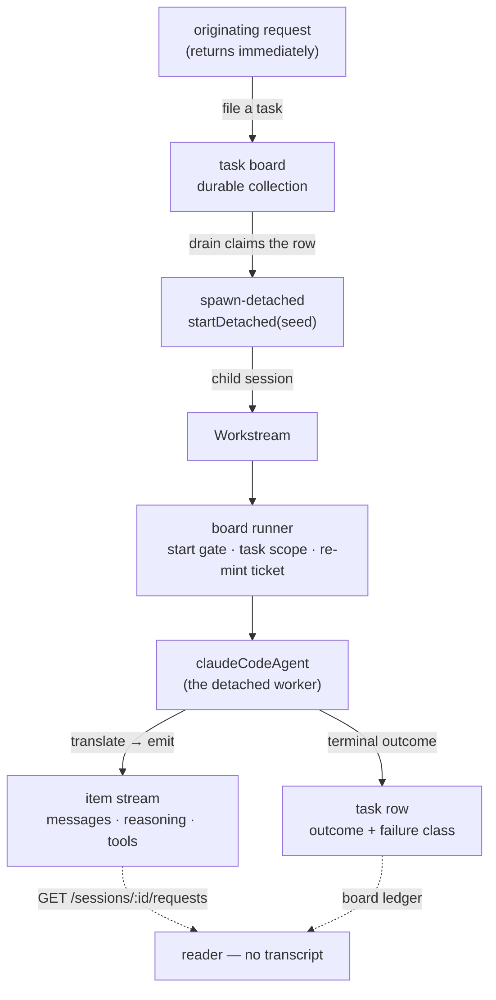

# LAB-133: Mirror a Claude Code run as an FSD workstream — Implementation Spec

## Part I — The Case *(for the human)*

### 1. Problem — why it matters, why now

When we hand a coding job to a Claude Code agent today, we get back one line: it worked, or
it didn't. Everything the agent did on the way — what it decided its job was, which files it
touched, where it got stuck, what it asked — is thrown away as it happens. Nobody can check a
run except by opening the transcript and reading it.

That is fine when a person is watching one run. It stops working the moment anything else has
to act on the result: route the next step, decide whether to retry, notice that the agent
asked a question and never got an answer, or grade whether the run did what it was asked.

**Why now.** This is the bottom of the epic. Every layer above it reads state this layer
produces — grading a run, filing what came back, deciding what happens next. Build those first
and they read nothing, which is precisely the sequencing mistake the epic exists to avoid. It
is also the easiest layer to skip, because a blocking call that returns a summary *looks* like
it works.

The kill line sits here too: if state alone can't say what a run did, nothing above it stands.

### 2. Solution in plain terms

Give a coding run its own place in the system instead of hiding it inside the request that
started it.

The originating request starts the run as a **workstream** — a child session dedicated to that
one job — and then returns. The run keeps going. As the agent works, its top-level messages
land in that workstream's stream, in order, as they happen. When the run ends, how it ended is
written onto the task it was started for: finished, or failed and sorted into one of four
kinds — *the tool flaked*, *the environment was wrong*, *we didn't say enough*, *it can't be
done*. Asking "what did that run do?" then means reading FSD state, not reading a transcript.

Almost all of this already exists and is unused. The agent block that turns a Claude Code run
into stream items has been in the repo since the harness work and nothing dispatches through
it. The task board already knows how to run a worker outside the request that claimed it. The
routes that list a session's background jobs and read one job's history already ship. **The
work is the composition, plus two things standing in its way** — both of which are in the
framework, not in our orchestration code:

- The agent block insists on keeping its "resume this conversation" handle in session state. The
  task board **refuses** a detached worker that does that, by name, at construction. So the two
  pieces cannot currently be connected at all.
- Nothing sorts how a run ended. Today it is `completed` or `errored`, which is not enough for
  anything downstream to act on.

**On the question the issue asked us to answer rather than route around** — is a harness
dispatch a detached session or a job? **It is a false fork, and the answer is already in the
repo.** They are the same call. `startDetached` produces a workstream either way; whether that
workstream survives the process is decided entirely by the deployment's dispatcher. In-process:
it dies with the process, and the shutdown drain gives it **30 seconds** — two orders of
magnitude short of a coding run. On a queue: the same dispatch is a durable job that survives.
So the epic does not need a new events substrate to make coding runs durable; it needs a
deployment choice. §7 carries the detail and the one gap this does leave open.

**Philosophy.** Tenet 2 (composition over features) — four primitives already exist and this
composes them; the only genuinely new surface is where a run's resume handle lives and a
four-value failure vocabulary. Tenet 4 (the framework absorbs infrastructure, not knowledge) —
workstreams, leases and boards are FSD's; the Claude-shaped mapping stays inside the vendor
package. Tenet 7 (prove the goal, not the mock) — the proof is a real coding task read back
from state with the transcript closed.

### 6. Decisions & rules — the sign-off surface

1. **The agent block stops insisting on where a run's resume handle lives; the caller can point
   it somewhere else. Detached runs point it at the task they were started for.** Callers who
   say nothing keep today's behaviour exactly.
   *Rejected:* moving the handle behind a capability, which is the one channel the board's
   check cannot see. It would pass the check without answering the question the check is
   asking, and the first two harness workers to collide would do so silently and at runtime.
   *Rejected:* a built-in "put it on the task" mode. The runtime seam a worker reaches the
   framework through is deliberately closed at four verbs and can *read* its task but not
   *write* it, so a built-in mode would mean prising that seam open — a much larger change
   than this issue should make (§7).
   *Locks in:* a shipped package gains one seam, and existing users see no change. Where a
   coding run's identity lives becomes the caller's call rather than ours, which is what lets
   the next harness reuse this without us guessing for it. What we cannot cheaply undo is
   having made continuity a public extension point: once someone wires one, the shape is a
   contract.

2. **A run that fails is a *finished* job that reports why. Only a run we *lost* gets retried.**
   The board's automatic-retry machinery stays for the case it was built for — the process
   died, the lease lapsed, nobody was on it. An agent that ran and could not do the job settles
   its own row and records which of the four kinds of failure it was.
   *Rejected:* letting a failed run fall through to the board's retry. Re-running a coding
   agent that has already written files and pushed commits is not a retry; it is a second,
   partly-informed attempt at a job whose state has already moved.
   *Locks in:* nothing above this layer gets free retries. Anything that wants a failed run
   tried again has to decide that deliberately, which is the behaviour we want but it is work
   somebody has to do later.

3. **We prove the mirror on the plain in-process deployment, and report durability as a
   deployment choice instead of building for it.**
   *Rejected:* standing up a Redis-backed queued deployment inside this issue so the goal check
   proves durability too.
   *Locks in:* the epic gets its answer on events architecture this week and pays for it with a
   known hole — we will have run this end to end without ever having survived a restart
   mid-run. If durability turns out to behave differently in practice from what the topology
   matrix says, we find out one issue later than we could have.

**Non-goals** — sub-agent internals as their own workstreams (they already nest under a
container in the stream and a reader filters them out; nothing to build). Anything the epic
already excluded: an event bus, `waitForEvent`, change signals, a Vercel or HarnessAgent
abstraction. File writes and todos as state — that is LAB-134. Grading the run — that is
LAB-135. Resuming a run that was interrupted mid-flight.

**Size:** Small–Medium — 4 production files · 9 test behaviours · 2 doc surfaces · 1 PR.

---

### 3. Tradeoffs & alternatives

**Alternative: dispatch a workstream without a task board.** Today `startDetached` is
board-only — the routing table it resolves against is assembled purely from bindings that a
board's drain stamps. Adding a board-free path would be a framework change of real size.
Rejected, and not reluctantly: a coding job *is* a task, and going through the board buys the
lease, the abandonment counting and the recovery-after-a-dead-process behaviour for free. If a
later layer genuinely needs board-free detachment, that is an FSD issue to file (§12), not
bespoke machinery to grow here.

**The simpler approach: don't detach at all.** Run the agent inline and let its messages land
in the session that asked for the work. This is genuinely tempting — it is a fraction of the
work and the mirroring already functions. Insufficient for two reasons. The originating request
would have to stay open for the whole run, minutes to an hour, which is the same black box with
a longer timeout rather than a different shape. And a stream that only exists while one HTTP
request is alive is not something a later block can attach to, which is the property that makes
real-time processing of a harness's output a next step instead of a rewrite.

**Where the complexity is.** Not the mirroring — that part already works and is not being
rewritten. It is the boundary between *the run failed* and *we lost the run*. Those look
similar from the outside, they are settled by different machinery, and getting them confused
produces either a coding agent that re-runs itself over its own half-finished work, or a row
that sits `in_progress` forever with nobody on it. §9 is mostly that boundary.

### 4. Focus practices (1–5)

1. **BP-030 (tolerate the old shape)** — a caller using the agent block the way it works today
   must see byte-identical behaviour. The new continuity path is opt-in and the default stays
   session state.
2. **Tenet 4 (absorb infrastructure, not knowledge)** — the four-value failure vocabulary is
   framework-shaped, but the mapping from Claude's own terminal signals onto it is vendor
   knowledge and stays inside `@flow-state-dev/claude-code`. **Do not add a shared failure enum
   to `contracts` or `core` in this issue.** One vendor is not normalization (tenet 3); the
   second harness is what earns a shared type, and LAB-134/135 will say whether one is wanted.
3. **Tenet 7 / BP-003 — a check that cannot fire is not a check.** Every one of the four
   failure classes must be reachable by something. A classifier tested only against
   hand-written subtype strings proves the switch statement, not the signal.
4. **Tenet 5 (fix at the owning layer)** — the board refuses this composition for a real
   reason. Satisfy the reason; do not find the channel the check happens not to inspect.

### 5. What using it looks like (1–5 examples)

**Declaring a coding run as detached work** *(what this spec proposes; today the board throws
at construction on the last line):*

```ts
const codingBoard = taskBoard({
  name: "coding",
  boardId: "coding",
  collection: codingTasks,            // a defineTaskCollection() — durable
  workers: {
    // Detached: the request that claims the task returns; the run keeps going.
    implement: { worker: codingRun, dispatch: { mode: "detached" } },
  },
});
```

**Making the agent block legal as a detached worker** *(before / after):*

```ts
// before — the block owns continuity and declares session state for it,
// so the board refuses it by name at construction
const codingRun = claudeCodeAgent({ model: "…" });

// after — the caller says where continuity lives. Given a place, the block
// declares no session state, and the board accepts it.
const codingRun = claudeCodeAgent({
  model: "…",
  continuity: taskRowContinuity(codingTasks),   // wired in the composition
});

// unchanged for everyone else: say nothing, get today's behaviour
const chatAgent = claudeCodeAgent({ model: "…" });
```

**Reading the run back, with the transcript closed:**

```ts
// which background jobs did this conversation start, and how did they end?
GET /api/flows/sessions/:sessionId/workstreams
// → [{ id: "sess_…", topic: "LAB-129", status: "completed", … }]

// what happened inside one of them
GET /api/flows/sessions/sess_…/requests
// → the run's top-level messages, tool calls and reasoning, in order
```

**What a failed run leaves behind:**

```
task "LAB-129"  status: completed
  outcome: { ok: false, failure: "underspecified",
             detail: "hit the turn limit without reaching a result" }
```

---

## Part II — The Build Plan *(for the implementing agent)*

### 7. Technical design

Four existing pieces, one new option, one new classifier. Nothing here invents a substrate.



- **`@flow-state-dev/claude-code` (the only production changes).** The agent block gains a
  **continuity seam** — somewhere the caller can point it at to read and write the SDK resume
  handle. Absent, it behaves exactly as today (session state, same keys, same schema). Present,
  the block **declares no `sessionStateSchema` at all** — that declaration is what the board
  refuses, and suppressing only the *write* while keeping the declaration would still be
  refused. The block also gains a **terminal-state classifier** mapping the SDK's own signals
  onto the four-value vocabulary, and returns it on the run handle.

  A seam rather than a built-in "put it on the task" mode, because the block must not learn
  what a task board is: `@flow-state-dev/claude-code` cannot depend on
  `@flow-state-dev/orchestration`, and the framework-side route that *is* available to any
  block — the request host — is deliberately closed at four verbs. It can `parentTask()` (read
  the row this run was dispatched for) but has **no verb to write one back**, by design. So the
  read half could have been built in and the write half could not, and a seam that only works
  in one direction is worse than no seam. The caller already holds the board's collection, so
  it is the right party to own both halves.
- **`@flow-state-dev/orchestration` — untouched.** The board, the runner, the start gate, the
  lease and the refusal all stay exactly as they are. The refusal is correct; we are satisfying
  it, not relaxing it.
- **`@flow-state-dev/engine` — untouched.** `startDetached`, the workstream listing route and
  the per-session request history all already do what this needs.
- **The composition itself lives in the goal check**, not in a package. `goals/` scripts define
  their flow inline against real stores, which is exactly the prototype posture this epic
  asked for: the learning ships, the scaffolding does not.

**Two findings the implementer must not re-derive, and must not route around.**

**(a) The refusal is real and is the first thing to pin.** `assertDetachedBoardSupported` in
`orchestration/src/task-board/detached.ts` walks a detached worker *and every composed block
under it* for an authored `sessionStateSchema` and throws by name; `claudeCodeAgent` declares
one (`claudeAgentSessionStateSchema`, holding `sdkSessionId` and `sdkAgentRuns`). The refusal's
own prescription — *"Keep the worker's state on the task instead"* — is the design. There is a
loophole: a schema contributed through a **capability** is never written onto the block's
config, so the walk cannot see it. **That loophole is not the fix.** The reason behind the
refusal (detached workers share one workstream flow, where two routes choosing one key with
different shapes corrupt each other with no error) applies just as much through a capability.

**(b) Detached-vs-job, answered.** Per `docs/architecture/detached-work.md`, locality is decided
by `isInProcessDispatcher` over the *effective* dispatcher, not by anything the caller writes.
No dispatcher, or one exposing `dispatchLocal` → the child runs here and does not survive the
process; `dispose()` drains it against `detachedDrainTimeoutMs`, whose default is **30 s**
(tuned to a serverless SIGTERM grace period). A queue dispatcher (`colocated` / `dispatch-only`)
→ the same dispatch is enqueued, and it survives. Both arms are already covered by tests in
`engine/test/flowstate/runtime-detached-start.test.ts`, including launching a workstream from
inside a colocated queue worker and cancelling an in-flight in-process child at the drain
budget. **So the substrate exists on both arms and the choice is a deployment one.** What
neither arm gives us is **run resumption**: a queue re-delivers a lost job and a lapsed lease is
re-claimed, but nothing replays a half-finished coding run — the workstream re-enters at the
prompt. That, not durability, is the real gap, and it is the thing to carry up to the epic
(§12).

> **Sketch — pseudocode. Illustrative, not the contract. React to the shape.**
>
> ```
> in the agent block:
>     the place ← the caller's continuity seam, else the built-in session-state one
>     declare session state ONLY for the built-in one   ← what unblocks the board
>
>     before the run:  resume handle ← the place, read
>     after it ends, including after it throws:
>                      the place, write ← resume handle   (decision 1)
>
> in the composition (the goal script), the place is:
>     read   → the row this run was dispatched for
>     write  → the same row, fenced by the ticket the runner re-minted
>
> classifying how it ended, inside the vendor package (focus practice 2):
>     the SDK threw mid-stream        → transient | environmental
>                                        (split on whether it looks like the
>                                         host/credentials or the network)
>     terminal subtype, not success   → underspecified | blocked
>     terminal subtype = success      → ok
>
> settling:
>     always RETURN the outcome; never throw for an agent-side failure  (decision 2)
>     the board completes the row with it — retries stay for lost runs
> ```
>
> What this asks a reviewer: *is a caller-supplied place the right shape, or should the block
> take the resume handle as plain input and return the new one, leaving persistence entirely
> outside it?* The second is smaller still and makes every caller wire two ends; the first
> keeps the common case a one-liner. Whether the option is called `continuity` or something
> else, and whether it is one object or two functions, is the implementer's.

### 8. Implementation sequence

1. **Pin the refusal.** A characterization test that builds a board with `claudeCodeAgent` as a
   detached worker and asserts it throws, naming `sessionStateSchema`. Its second half — the
   same board, with a continuity place supplied, constructing cleanly — is red until step 2.
   *Depends on:* nothing.
2. **The continuity seam** in `@flow-state-dev/claude-code`. With a caller-supplied place the
   block declares no session-state schema and reads/writes the resume handle there; with none
   it behaves as today. *Test:* both paths resume correctly across two runs; the default path
   is unchanged; the board now accepts the block. *Depends on:* 1.
3. **The terminal-state classifier.** Four values plus success, derived from the SDK's own
   terminal signals and from a mid-stream throw. Returned on the run handle. *Test:* each class
   reachable, including from a thrown run rather than only a subtype string. *Depends on:*
   nothing (parallel with 2).
4. **Settle, don't throw** (decision 2). The worker returns its outcome; an agent-side failure
   never propagates as an exception, so the board completes the row carrying the classification.
   *Test:* a failed run leaves a settled row with the class on it and no retry. *Depends on:* 3.
5. **The goal check** — the composition, end to end, on a real coding task, in-process, with the
   drain budget raised past the run (see §9). *Depends on:* 2, 3, 4.
6. **Docs** (§11).

**No removals.** Nothing here supersedes existing code; the CLI path and the default session-
state path both stay. If step 2 lands and `sdkAgentRuns` turns out to be redundant with the
item stream for the detached path, say so in the PR rather than deleting it here — it is still
load-bearing for the non-detached path.

### 9. Edge cases & error handling

| Case | Expected |
|---|---|
| Run outlives the drain budget on the in-process topology | It is cancelled at 30 s by default. The goal check **must** raise `detachedDrainTimeoutMs` past the expected run, and say in a comment that this is the finding, not a workaround |
| Process dies mid-run | The row's lease lapses; the next claim hands it back and advances `abandonments`. Past the allowance it settles `errored`. This is the *lost* case in decision 2 and is deliberately not the failure classification |
| The board hands off, then the child waits longer than the lease before starting | Known framework gap (FIX-1070): nothing renews between hand-off and the child's first breath. The start gate rejects the stale claim and the row recovers. Do not attempt to close it here |
| Agent asks a question and stops | Not a failure. A question is a top-level message and is already in the stream; the run's terminal state is whatever the SDK reported. Nothing special to build — verify it, don't handle it |
| SDK reports a terminal subtype this version doesn't recognise | Treat as a failure, never as silent success. Classify it as the most conservative class rather than inventing a fifth |
| Sub-agent activity | Already nests under a container item via `ownedBy`. Top-level reconstruction filters on that. No change |
| Two detached workers on one board both want continuity | Out of scope — there is one worker. But the row-scoped handle is what makes this not a future collision, which is the point of decision 1 |
| A run that produced no assistant text at all | A legitimate outcome, not an error. The handle's final message is nullable already |

**Taxonomy.** Everything the agent does is non-fatal to the request — the run settles its own
row and the workstream ends normally. The only genuinely fatal paths are construction-time: the
board's refusals (which fire before anything runs) and a missing request host.

### 10. Testing strategy

**Goal:** dispatch a real, small coding task, let the workstream run it to completion, then
reconstruct what it did **reading only FSD state** — the workstream row, its item stream, and
the task's settled outcome — with the harness transcript never opened. Pass when the
reconstruction names the job the run was given and the shape of what it did, and when the
task's terminal state is present and classified. `goals/harness-workstream/<it>/run.mts`, real
model, real path, real stores.

*Anti-game:* the check must not read the SDK's own transcript, the working tree, or git. It must
also not assert on whether the coding agent did a **good** job — that is LAB-135's question and
this instrument must not answer it. A run that completes with an empty item stream is a fail,
not a pass.

**CI specs** (the behaviours, not the test names):

- one behaviour per decision in §6, in observable terms
- **the refusal, pinned both ways** — the board rejects the block as it is today, and accepts it
  under the task-continuity choice
- **what must not change** (BP-030): the default continuity path behaves exactly as today,
  including that it still declares its session-state schema and still resumes across requests
- **every failure class is reachable**, and at least one of them arrives via a thrown run rather
  than a terminal subtype — a classifier exercised only through hand-written subtype strings is
  a check that cannot fire on the path that matters (tenet 7)
- **the lost-vs-failed split**: a classified failure leaves a settled row and no new attempt; an
  abandoned claim leaves an unsettled row that a later claim picks up. Asserting only the first
  passes an implementation that quietly retries

**Discipline:** `tdd`. The seams are the agent block's `execute` (reachable from vitest with the
mock context and a scripted fake `query`, exactly as the existing sdk specs do it) and the
board's construction-time assertion — both reachable without a server, so every behaviour above
is a tracer bullet.

**One thing that will otherwise cost a cycle:** the goal check needs a **runtime**, not a bare
`runAction`. The detached start operation is installed by `createFlowState`; a script that only
calls `runAction` has no request host and the first `startDetached` throws by name. One goal
already builds a runtime this way (`goals/personal-knowledge-mcp/…`) — follow it. Raise
`detachedDrainTimeoutMs` on that runtime past the expected run length (§9).

### 11. Documentation plan

- **EXTEND** `apps/docs/docs/tools/claude-code-sdk.md` — two existing sections, no new page.
  Under **"Session continuity"**, a short subsection on running the agent as detached work: why
  continuity has to move off session state, and the seam. Under **"Error handling"**, the four
  failure classes in plain terms and the rule that a failed run settles rather than retries. One
  minimal example each (the §5 board declaration, and the settled-row shape). Cross-link → to
  `apps/docs/docs/server/background-work.md` for reading a job's history, ← from that page's
  "Related" list.
  *Voice risks:* do not write "seamless" or "first-class"; introduce **workstream** in plain
  terms on first use on this page (it is a server concept and a tools-page reader may not have
  met it); no Linear ids anywhere under `apps/docs/`.
- **EXTEND** `packages/claude-code/README.md` — the "Session state" section gains the continuity
  seam, and the `/cli` vs `/sdk` comparison table gains a row for detached use. Terse; BP-009.
- **No new page**, and **no architecture-doc change.** `docs/architecture/detached-work.md`
  describes the topology this uses and nothing about that contract changes — the finding in §7
  is a *reading* of that doc, not an amendment to it.

### 12. Dependencies, open questions & follow-ups

**Dependencies:** none blocking. LAB-134 and LAB-135 both depend on this; neither is required
by it. `@anthropic-ai/claude-agent-sdk` is already an optional peer of the package.

**Open questions:** none. The one question the issue flagged — detached session or job — is
answered in §7 from the architecture doc and the existing engine tests, so it is a finding
rather than a fork. It is reported up to the epic below.

**Reported to the epic (LAB-68), not decided here:**

- **The events-architecture answer.** Detached and job are one call under two topologies, so no
  new substrate is needed for a run to survive a restart — only a queue dispatcher. The epic can
  keep the event-bus / `waitForEvent` work in "not doing" on the strength of this.
- **The gap that is real.** Neither topology gives **run resumption**. A lost run is
  re-dispatched from the prompt, not resumed from where it stopped. If a later layer needs
  resumption, that is a framework issue to file, and the natural seam is the resume handle that
  decision 1 puts on the task row: it is already durable and already re-read at start.
- **Board-free detachment.** `startDetached` is board-only today, by construction. That is the
  right shape for a coding task and may not be for whatever L3 turns out to need. FSD issue if
  and when, per the epic's standing rule.

**Follow-ups (flagged, not built):**

- **Framework gap, existing:** FIX-1070 — nothing renews a detached row's lease between hand-off
  and the child's first breath, so a deferred start longer than the lease starts on a row the
  substrate counts as free. Bounded and safe per occurrence; can starve under sustained backlog.
  Not this issue's to close.
- **Deepening:** the `sessionStateSchema` refusal walks composed blocks but cannot see a
  capability's contribution — the same separate-channel problem `tools` has. Noted in that
  module's own header already. Out of scope; follow up via `improve-codebase-architecture`.
- **`@flow-state-dev/claude-code` has zero consumers** anywhere in the repo, kitchen-sink
  included. After this lands it has one, in `goals/`. Whether it earns a kitchen-sink surface is
  a question for after LAB-135, not before.

---

## Spec evolution *(the change story, not an audit log)*

- **Spec drafted** — framed as "give a coding run its own place in the system" rather than as a
  streaming feature; chose to compose the four existing primitives (agent block, task board,
  detached workstream, session-history routes) over building anything new; found that the board
  refuses the agent block as a detached worker because it declares session state, and made
  satisfying that refusal the first build step; landed on a caller-supplied continuity seam
  rather than a built-in task mode once the request host turned out to be able to read a task
  but not write one; answered detached-vs-job from the architecture doc and the engine's
  existing tests rather than leaving it open, and reported the one real gap (run resumption) up
  to the epic instead of absorbing it.
