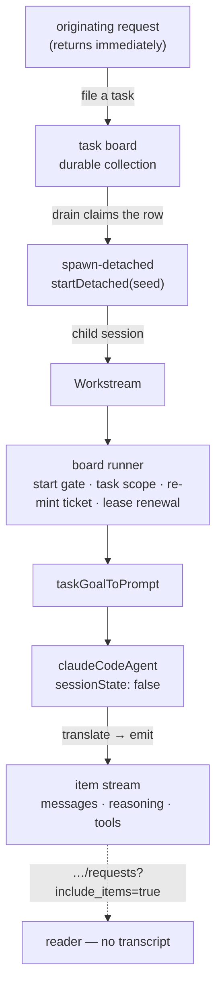

# LAB-133: Mirror a Claude Code run as an FSD workstream — Implementation Spec

## Part I — The Case *(for the human)*

### 1. Problem — why it matters, why now

When we hand a coding job to a Claude Code agent today, we get back one line: it worked, or
it didn't. Everything the agent did on the way — what it decided its job was, which files it
touched, where it got stuck, what it asked — is thrown away as it happens. Nobody can check a
run except by opening the transcript and reading it.

That is fine when a person is watching one run. It stops working the moment anything else has
to act on the result: route the next step, notice that the agent asked a question and never got
an answer, or grade whether the run did what it was asked.

**Why now.** This is the bottom of the epic. Every layer above it reads state this layer
produces — grading a run, filing what came back, deciding what happens next. Build those first
and they read nothing, which is precisely the sequencing mistake the epic exists to avoid. It
is also the easiest layer to skip, because a blocking call that returns a summary *looks* like
it works.

The kill line sits here too: if state alone can't say what a run did, nothing above it stands.

### 2. Solution in plain terms

Give a coding run its own place in the system instead of hiding it inside the request that
started it.

The originating request starts the run as a **workstream** — a child session dedicated to that
one job — and then returns. The run keeps going. As the agent works, its top-level messages
land in that workstream's stream, in order, as they happen. Asking "what did that run do?"
then means reading FSD state, not reading a transcript.

Almost all of this already exists and is unused. The agent block that turns a Claude Code run
into stream items has been in the repo since the harness work and nothing dispatches through
it. The task board already knows how to run a worker outside the request that claimed it. The
routes that list a session's background jobs and read one job's history already ship.

**So the work is the composition and one small removal.**

The removal: the agent block declares a slice of conversation state for itself, and the task
board refuses a detached worker that does that, by name, at construction. The block does not
need that state when it runs as background work — each job is one run — so the fix is to let it
**stop declaring it**, not to find the state a new home. A flag and a conditional.

**What this issue does not do: settle the run.** How a finished, failed or lost run should be
recorded is a harder problem than it looks, it is where every defect in this design has landed,
and it is now [FIX-1182](https://linear.app/fixpoint-labs/issue/FIX-1182). This issue takes the
board's default behaviour and neither specifies nor proves it — see decision 2.

**On the question the issue asked us to answer rather than route around** — is a harness
dispatch a detached session or a job? **It is a false fork, and the repo already answers it:
the same call produces both, and which one you get is decided by the deployment's dispatcher.**
§7b carries the argument and the evidence; §12 carries what the epic should take from it.

**Philosophy.** Tenet 3 (earn every addition) did most of the work: review turned up a
resume-handle home, a fenced write and a failure taxonomy, and **none survived contact with "who
reads this?"** — each is cut. Tenet 7 (prove the goal, not the mock) did the rest, and earned it
twice: it refuted five readings of the settlement design by execution, and then the sixth and
seventh defects said the shape was wrong rather than the fix — so settlement left this issue
entirely. Tenet 2 (composition over features) — what remains composes four primitives that
already exist.

### 6. Decisions & rules — the sign-off surface

1. **The agent block gets an opt-out that stops it declaring conversation state, and detached
   runs use it.** Nothing else moves. Callers who don't set it are unaffected in every respect.
   *Rejected:* giving the state a new home — a caller-supplied place, or the task row via the
   runtime's own task verbs. Both were drafted and both were cut for the same reason: on this
   path **nothing reads the value back.** A background job is one run in one workstream, so the
   resume handle it would carry is never consulted. Building a home for a value nobody reads,
   and then a fence to protect writing it, is two mechanisms in service of nothing.
   *Locks in:* a detached run does not resume a prior Claude conversation — a second task
   addressed to the same workstream starts the agent fresh, while the workstream's own item
   history continues as normal. That is the right trade at one-run-per-job, and it is the same
   ground [FIX-1179](https://linear.app/fixpoint-labs/issue/FIX-1179) covers if it ever matters.

2. **Settlement is whatever the board does by default. This issue neither specifies nor proves
   it**, and the work moved to [FIX-1182](https://linear.app/fixpoint-labs/issue/FIX-1182),
   which carries the evidence for why.
   *What the default is:* coding tasks carry **no retry allowance** (`maxAttempts` undefined, so
   `shouldRetryOnFail` returns false) and the board keeps `onError: "skip"`. Every throw
   therefore settles the row terminally, on the first attempt.
   *Why that is the safe default rather than a shrug:* the one genuine harm in this area is an
   agent re-running over its own commits, and a retry allowance is what produces it — with a
   throwing worker and `maxAttempts: 3`, one task dispatched **three separate real detached
   child sessions**. No allowance, no re-run.
   *What it costs, stated rather than hidden:* a run we **lost** — a shutdown, an aborted
   request, a lapsed lease — is **written off** instead of staying recoverable. At prototype
   posture a lost run is re-dispatched by hand. The goal check says so in the same words.
   *Locks in:* nothing above this layer may read a run's ending from the task row or the
   workstream request and expect it to mean anything yet. LAB-135 reads the item stream, which
   this issue does prove.

3. **We prove the mirror on the plain in-process deployment, and report durability as a
   deployment choice instead of building for it.**
   *Rejected:* standing up a Redis-backed queued deployment inside this issue so the goal check
   proves durability too.
   *Locks in:* the epic gets its answer on events architecture this week and pays for it with a
   known hole — we will have run this end to end without ever having survived a restart mid-run.
   If durability behaves differently in practice from what the topology matrix says, we find out
   one issue later than we could have.

**Non-goals** — sub-agent internals as their own workstreams (they already nest under a
container item). Anything about how a run's ending is recorded — FIX-1182. A failure taxonomy —
§7d; the signals do not support one. Resuming a prior Claude conversation on the detached path —
decision 1. Anything the epic already excluded: an event bus, `waitForEvent`, change signals, a
Vercel or HarnessAgent abstraction. File writes and todos — LAB-134. Grading the run — LAB-135.

**Size:** Small — 2 production files in one package · 6 test behaviours · 2 doc surfaces ·
3 manifest edits (§8) · 1 PR.

---

### 3. Tradeoffs & alternatives

**Alternative: dispatch a workstream without a task board.** Someone went looking to cut the
board and could not. `buildWorkstreamCore` assembles a core *only* from board-stamped bindings,
and `startDetached` refuses `no-workstream-core` without one — so board-free detachment is a
real framework change, not a shortcut we declined. Going through the board is therefore forced,
and it is also right: a coding job *is* a task, and the board brings the lease, the abandonment
counting and the dead-process recovery.

**The simpler approach: don't detach at all.** Run the agent inline and let its messages land in
the session that asked. Genuinely tempting — a fraction of the work, and the mirroring already
functions. Insufficient for two reasons. The originating request would have to stay open for the
whole run, minutes to an hour, which is the same black box with a longer timeout. And a stream
that exists only while one HTTP request is alive is not something a later block can attach to —
the property that makes real-time processing of a harness's output a next step rather than a
rewrite.

**Where the complexity was, and where it went.** Not the mirroring; that already works and is
not being rewritten. It was the boundary between *the run failed* and *we lost the run*. Seven
review rounds landed seven distinct defects there and none of them touched the mirror, which is
the signal that took it out of this issue and into FIX-1182.

### 4. Focus practices (1–5)

1. **Tenet 3, applied to review feedback itself.** Three rounds proposed three mechanisms and
   each dissolved under "who reads this?". Ask it again of anything added during implementation
   before building it.
2. **BP-030 (tolerate the old shape)** — the opt-out defaults off and an unset caller keeps
   today's behaviour exactly, including that a mid-stream failure still throws.
3. **Tenet 5 (fix at the owning layer)** — the board refuses this for a real reason. Satisfy it
   by not declaring the state; do not route around it through the capability channel, which the
   board's walk cannot see (§8).
4. **Tenet 7 — a check that cannot fire is not a check.** The live example here is the SDK
   `resume`: suppressing the declared schema leaves the resume path intact, and every
   schema-shaped assertion stays green while a custom session provider silently keeps resuming.
   Assert on the options handed to the SDK.

### 5. What using it looks like (1–5 examples)

**Declaring a coding run as detached work** *(what this spec proposes; today the board throws
at construction on the worker line):*

```ts
const codingBoard = taskBoard({
  name: "coding",
  boardId: "coding",
  collection: codingTasks,            // a defineTaskCollection() — durable
  workers: {
    implement: { worker: codingRun, dispatch: { mode: "detached" } },
  },
  // No `maxAttempts` on the tasks and no `onError` here: the board's defaults.
  // Settlement is deliberately out of scope — decision 2, FIX-1182.
});
```

**The worker — an adapter plus the block, with the opt-out set** *(§7e):*

```ts
// The board hands a worker { goal, taskId, … }; the agent block wants a prompt.
const codingRun = sequencer({ name: "coding-run" })
  .step(taskGoalToPrompt)                       // goal + context → { prompt }
  .step(claudeCodeAgent({ model: "…", sessionState: false }));
```

**Nothing changes for anyone else** *(before / after — the point is that there is no diff):*

```ts
// before and after, identical: the opt-out is absent, so today's behaviour
const chatAgent = claudeCodeAgent({ model: "…" });
```

**Reading the run back, with the transcript closed:**

```ts
// which background jobs did this conversation start?
GET /api/flows/sessions/:sessionId/workstreams
// → { workstreams: [{ id: "sess_…", topic: "LAB-129", status: "active", … }] }
//   note the envelope — the rows are under `workstreams`, not at the top level

// what happened inside one of them — include_items is required; without it
// this returns summaries and cannot reconstruct the run
GET /api/flows/sessions/sess_…/requests?include_items=true
// → { requests: [{ …, items: [ the run's top-level messages, in order ] }] }
```

---

## Part II — The Build Plan *(for the implementing agent)*

### 7. Technical design



**Packages touched: `@flow-state-dev/claude-code` only**, and within it two files —
`sdk/agent.ts` and `sdk/capability.ts`. `@flow-state-dev/orchestration` and
`@flow-state-dev/engine` are both untouched: the board, its recorders, the start gate, the
lease, `startDetached`, the workstream listing route and the per-session request history all
already do what this needs. The composition and the prompt adapter live in the goal check;
**export nothing for one caller.**

**(a) The blocker is a declaration, and the fix is to stop making it.** The board's refusal
requires only that a detached worker (and every block under it) not author a
`sessionStateSchema`. `claudeCodeAgent` authors one holding `sdkSessionId` and `sdkAgentRuns`. On
the detached path neither is wanted: a background job is one run in one workstream, so the resume
handle is never read back, and the run history it would accumulate is the item stream's job —
which is this layer's entire point. So the opt-out suppresses the declaration **and the reads and
writes that go with it**; a value written under an undeclared key is not a smaller version of the
same behaviour.

**And it must also stop the resume, which is a separate path.** Suppressing the schema and the
`ctx.session` access is not enough: the block still resolves its `sessionProvider` and forwards
whatever id comes back as the SDK's `resume` option. A caller supplying a provider whose
`resolve("")` returns a saved session therefore gets a **resumed** run while every declared-schema
assertion still passes. The default provider returns nothing for an empty key, which is exactly
why this hides — the obvious tests and the goal check would both stay green while a custom
provider silently breaks the one-run-per-job behaviour decision 1 locks in. That is a check aimed
at a neighbour of the claim (tenet 7). Disabled mode must **bypass provider resolution, or force
`resume` absent**, and the test for it inspects the **query options handed to the SDK**, not the
declared schema.

**The opt-out has to be a construction-time flag, and that is not a preference.** An earlier
draft had the block decide at runtime — ask whether it is running for a task, and declare state
or not accordingly. **It could not have worked.** `claudeCodeAgent()` attaches
`sessionStateSchema` while building its static handler definition, and
`assertDetachedBoardSupported()` inspects that definition and rejects the board *before any
`execute` callback ever receives a context*. There is no runtime moment early enough. Recorded
here so nobody re-proposes the branch.

**Two earlier drafts also proposed a new home for the handle** — a caller-supplied place, then
the runtime's own `parentTask()` / `settleParentTask()` verbs. Both are cut. Recorded so nobody
re-derives them: the runtime's verbs *are* a real fenced write, **and** they are terminal-only
with no mid-run patch verb; both readings argued in review are correct and neither matters,
because there is no value that needs writing. If a future issue does need mid-run continuity,
those verbs are where it belongs and `ParentTaskBinding` is declared-but-unconstructed — that is
the seam, and connecting it is not this issue's work.

**(b) Detached-vs-job, answered.** Locality is decided by `isInProcessDispatcher` over the
*effective* dispatcher, not by anything the caller writes
(`docs/architecture/detached-work.md`). No dispatcher, or one exposing `dispatchLocal` → the
child runs here and does not survive the process; `dispose()` drains it against
`detachedDrainTimeoutMs`, default **30 s**, a figure tuned to a serverless SIGTERM grace period
rather than to a coding run. A queue dispatcher (`colocated` / `dispatch-only`) → the same
dispatch is enqueued and survives. Both arms are already covered in
`packages/engine/test/flowstate/runtime-detached-start.test.ts` (~23 tests, both arms, including
the drain budget). So the substrate exists on both arms and the choice is a deployment one.
**The SLA that follows:** an in-process host raises `detachedDrainTimeoutMs` past its longest
expected run or accepts that any shutdown kills one; a queued host instead sizes its platform
kill timeout for the longest job, because a claimed job holds `Worker.close()` open with no
framework budget over it. What neither arm gives is **run resumption** — §12.

**(c) Settlement is not this issue's, and the block does not change for it.** Under decision 2
the block's error behaviour is exactly today's: a terminal SDK error subtype already returns an
errored handle, and a mid-stream throw already rethrows. Both are unchanged, on both the
foreground and the detached path — which is also what makes practice 2 (BP-030) trivially true
rather than something to test around. A rethrow on the detached path reaches the board's
`recordError`, which calls `fail()`, which with no retry allowance settles the row terminally.
That is the default, it is not proven here, and it is FIX-1182's to design.

**(d) What the ending records — the handle as returned, no vocabulary.** The SDK distinguishes
terminal subtypes and nothing else, and they do not carve at the joint a router would want:
`error_max_turns` and `error_max_budget_usd` are both *budget exhaustion*, neither
"underspecified" nor "can't be done". An agent can also return a **successful** terminal result
whose text explains it cannot proceed. So a four-value map would be lossy rather than
classifying. LAB-135 enumerates what it reads — the workstream's items, the resources, the todo
state — and a failure class is not among them. Ship the handle as it already is, carrying its
existing `resultSubtype` and errored verdict, and let LAB-135 define classes from real failures
rather than from guesses made before the first run.

**(e-bis) `include_items` is adapter-dependent, and the goal check must name its adapter.**
`RequestListOptions.withItems` is documented as advisory: *"adapters that store items inline
ignore the flag."* The in-memory store does exactly that, so it returns items whether or not the
flag is set — meaning a readback assertion that passes there proves nothing about the route.
`@flow-state-dev/store-sqlite` keeps items in a separate table and does branch on the flag. **The
goal check must state which adapter it runs against**, and if the point is to prove the readback
contract it has to be one that honours the flag.

**(e) The board's payload is not the block's input.** The drain hands every worker a
`TaskWorkerInput` (`goal`, `taskId`, …); `claudeCodeAgent` validates a required
`{ prompt: string }` *before* its prompt callback runs. Wiring the block in directly rejects
every detached task before the SDK is invoked. An explicit adapter from the task's goal and
context to the agent's prompt is required, and the goal check must cover it — this is the first
thing that breaks and it breaks silently early.

**Reference pointers** (read before building; none is a template to copy wholesale):

- `apps/kitchen-sink/flows/chat-agent/run/thinking-styles/pipelines/background-work.ts` — a
  shipped detached-work composition.
- `packages/integration-tests/src/scenarios/task-board-detached-{handoff,child-death,on-error,shared-key}.test.ts`
  — the four detached scenarios already characterized.
- `packages/engine/test/workstream-listing-route.test.ts` — what the read surface actually
  returns, so the goal check asserts real shape.
- `goals/personal-knowledge-mcp/persists-a-concept-across-stateless-calls/run.mts` — a goal that
  stands up a real `createFlowState` runtime and drives real HTTP; closest starting point, and
  the runtime part matters (§10).

> **Sketch — pseudocode. Illustrative, not the contract. React to the shape.**
>
> ```
> in the agent block:
>     declare conversation state ONLY when the opt-out is absent   ← the blocker
>     skip the reads and writes that go with it when it is set
>     skip the session-provider resolve, so no `resume` reaches the SDK
>     everything else — including how failures surface — is unchanged
>
> in the goal check's worker and board:
>     goal + context → { prompt }                                       (§7e)
>     board defaults: no retry allowance, no onError override            (§6.2)
> ```
>
> What this asks a reviewer: *is an opt-out the right shape, or should the block detect it is
> running as background work and decide for itself?* Detection needs no flag and cannot be
> forgotten; a flag is greppable and does not make behaviour depend on where a block is wired.
> This spec takes the flag.

### 8. Implementation sequence

1. **Pin the refusal's *accepting* half.** A characterization test that a board with
   `claudeCodeAgent` as a detached worker constructs cleanly **once the opt-out is set**. Red
   until step 2. The rejecting half is *not* re-pinned — `task-board-detached-config.test.ts`
   already covers that refusal with six tests, including one naming `sessionStateSchema`
   explicitly; re-asserting it here would characterize someone else's guarantee. *Depends on:*
   nothing.
2. **The opt-out** (§7a): suppress the declaration, the reads/writes that go with it, **and the
   resume** — bypass provider resolution or force `resume` absent.
   **It must be honoured in two places** — the block, and `createClaudeCodeAgentCapability`,
   which declares the same schema separately and forwards all agent options. Missing the second
   would let the capability re-contribute the schema through the exact channel the board's walk
   cannot see, which is the loophole practice 3 rules out — and it would *appear* to work.
   *Test:* with the opt-out set no schema is declared and no session write happens; absent, one
   still is. *Depends on:* 1.
3. **The adapter and the composition** in the goal check (§7e): task goal/context → prompt, then
   the agent. *Depends on:* 2.
4. **The goal check** end to end — a real coding task, in-process, drain budget raised past the
   run (§9), on a store adapter that honours `withItems` (§7e-bis). *Depends on:* 3.
5. **Docs** (§11) and the **changeset** (BP-022 — user-facing: a new public option and a
   documented behaviour change in a published package, so not `--empty`).

**Two manifest deliverables, neither optional and both easy to plan around wrongly.** `goals/` is
deliberately thin, so a goal needing a new package needs a manifest change — never assume "the
goal will just import it". This is the second time in this epic that bit (LAB-136 hit the same
shape on `@flow-state-dev/testing`).

- **`goals/package.json` gains `@flow-state-dev/claude-code`** and the Agent SDK. There is no way
  to dispatch a coding run from a goal without them.
- **The workspace must resolve ONE copy of `@anthropic-ai/claude-agent-sdk`.** The package
  declares it as an optional peer at `"*"`, which the lockfile had pinned to an old version while
  a new consumer resolved the current one — two copies in one tree, with which one you got
  decided by the importing file's location. The old copy's bundled CLI fails, and it surfaces as
  a bare `process exited with code 1` that reads like a broken dispatch rather than a version
  skew. A root `pnpm.overrides` entry fixes it; the published peer range stays `"*"`.

**Where the board-acceptance test lives, and why not the two obvious places.** Not
`packages/claude-code` — that would put an `@flow-state-dev/orchestration` dev dependency into a
published vendor package for one test, and §7 puts the composition in the goal check rather than
the package. Not *only* the goal check either, tempting as it is (the board has to exist there
anyway): the goal needs a real model and the optional SDK peer, so it does not run in CI, and a
construction refusal that started firing again would be invisible until somebody ran the goal by
hand. It goes in `packages/integration-tests`, which is private, already depends on orchestration,
and already hosts the four other detached-board scenarios.

**No removals in this issue** — but one note so a false justification is not carried forward:
`sdkAgentRuns` has **zero production readers** repo-wide (written in the block, read only by tests
and one docs example). Removing it is not this issue's job; do not claim it is load-bearing.

### 9. Edge cases & error handling

| Case | Expected |
|---|---|
| Run outlives the drain budget | Whatever the board does by default (FIX-1182). The goal check **must** raise `detachedDrainTimeoutMs` past the expected run, with a comment saying this is the finding, not a workaround |
| Context aborted mid-run, process dies mid-run, worker throws | All settle terminally on the first attempt, because no retry allowance is set. A **lost** run is therefore written off rather than re-claimed — the known gap decision 2 states in the open, and FIX-1182's to fix |
| Second task on the same workstream | Starts the agent fresh — no prior Claude conversation is resumed (decision 1). The workstream's item history still continues |
| Agent asks a question and stops | Not a failure. A question is a top-level message, already in the stream. Verify it; don't handle it |
| Agent returns *success* whose text says it cannot proceed | Recorded as success. Reading intent out of prose is a later layer's job (§7d); guessing here would be worse than not guessing |
| Unrecognized terminal subtype | A failure, never a silent success — `isErroredSubtype` already treats it so |
| Sub-agent activity | Already nests under a container item via `ownedBy`. Top-level reconstruction filters on it. No change |
| A run producing no assistant text | A legitimate outcome for the block, and a **goal-check failure**: an empty item stream is exactly what this issue exists to rule out |

**Taxonomy.** Everything the agent does is non-fatal to the request — the workstream ends and
the board settles the row its default way. The only fatal paths are construction-time: the
board's refusal, which fires before anything runs, and a missing request host.

### 10. Testing strategy

**Goal:** dispatch a real, small coding task, let the workstream run it, then reconstruct what
it did **reading only FSD state** — the workstream row and its item stream (via
`include_items=true`) — with the harness transcript never opened. Pass when the reconstruction
carries the run's top-level messages, in order, and names the job the run was given.
`goals/harness-workstream/<it>/run.mts`, real model, real path, real stores, on
`@flow-state-dev/store-sqlite` (named in the runner, because the in-memory store ignores
`include_items` by documented contract — §7e-bis).

*Anti-game:* must not read the SDK transcript, the working tree, or git. Must not assert on
whether the coding agent did a **good** job — that is LAB-135's question. Must not assert on how
the run was settled — that is FIX-1182's, and this goal states the lost-run gap rather than
testing around it. A run that completes with an empty item stream is a fail, not a pass.

**CI specs — six behaviours.** Short on purpose: everything settlement-shaped left with
FIX-1182, and four further candidates are covered by existing suites, each named below so
nobody re-adds it.

- **The board accepts the block once the opt-out is set** (§8 step 1).
- **The opt-out suppresses the declaration in the block** (§8 step 2).
- **The opt-out suppresses the declaration in the capability too** — the half that fails
  silently if missed, because the board's walk cannot see a capability's contribution.
- **What must not change** (practice 2): with the opt-out absent, the schema is still declared.
  One assertion — cross-request resume is already `agent.spec.ts:205`/`:222` and those fail on
  regression today.
- **The opt-out stops the session writes** (§7a): a disabled run calls no `patchState`. Writing
  under a key nothing declared is the silent-corruption shape the refusal exists to prevent.
- **The opt-out stops the resume** (§7a): with a `sessionProvider` that returns a saved id for an
  empty key, a disabled run must hand the SDK **no `resume`**. Assert on the **query options**,
  not on the declared schema — the schema assertion passes either way, which is why this hole
  exists.

*Cut, with the coverage that replaces them:* decision 3 has no behaviour of its own (it is a
deployment choice; `runtime-detached-start.test.ts` covers both topologies). The abandonment path
is `lease-recovery.test.ts` and `collection/recovery.test.ts`. Cross-request resume is
`agent.spec.ts`.

*One kept that was going to be cut:* the board still **refusing** the agent with conversation
state ON, asserted beside the acceptance test. `task-board-detached-config.test.ts:155` covers
the refusal in general, but with a synthetic worker — so without this row the acceptance test
would keep passing if the refusal were deleted outright, and would prove nothing about the
opt-out.

**Discipline:** `tdd`. The seam is the agent block's `execute` (vitest with the mock context and
a scripted fake `query`, as the existing sdk specs do) plus the board's construction-time
assertion — both reachable without a server, so every behaviour above is a tracer bullet.

**One thing that will otherwise cost a cycle:** the goal check needs a **runtime**, not a bare
`runAction`. The detached start operation is installed by `createFlowState`; a script that only
calls `runAction` has no request host and the first `startDetached` throws by name. One goal
already builds a runtime this way (`goals/personal-knowledge-mcp/…`).

### 11. Documentation plan

- **EXTEND** `apps/docs/docs/tools/claude-code-sdk.md` — one existing section, no new page.
  Under **"Session continuity"**, that running the agent as background work turns the
  conversation state off, and what that means (each job is one run; the job's own history is the
  item stream). One minimal example. Cross-link → `apps/docs/docs/server/background-work.md`,
  ← from that page's "Related" list.
  *Voice risks:* no "seamless" or "first-class"; introduce **workstream** in plain terms on first
  use here (a tools-page reader may not have met it); no Linear ids under `apps/docs/`.
- **EXTEND** `packages/claude-code/README.md` — the "Session state" section covers the opt-out;
  the `/cli` vs `/sdk` table gains a row for background use. Terse; BP-009.
- **No new page, and no architecture-doc change.** `docs/architecture/detached-work.md` describes
  the topology this uses and nothing about that contract changes — §7b is a *reading* of it.
- **Nothing about failure or retry semantics** is documented here. Under decision 2 there is no
  contract to state, and writing one would be the drift FIX-1182 exists to stop.

### 12. Dependencies, open questions & follow-ups

**Dependencies:** none blocking. LAB-134 and LAB-135 depend on this; neither is required by it.
`@anthropic-ai/claude-agent-sdk` is already an optional peer.

**Open questions:** none.

**Reported to the epic (LAB-68), not decided here:**

- **The events-architecture answer.** Detached and job are one call under two topologies, so no
  new substrate is needed for a run to survive a restart — only a queue dispatcher. The epic can
  keep event-bus / `waitForEvent` in "not doing" on the strength of this (§7b).
- **The gap that is real:** run resumption — [FIX-1179](https://linear.app/fixpoint-labs/issue/FIX-1179).
  Filed; do not re-file.
- **Board-free detachment.** `startDetached` is board-only by construction. Right for a coding
  task; may not be for whatever L3 needs. FSD issue if and when.

**Follow-ups (flagged, not built):**

- **Settlement, entire:** [FIX-1182](https://linear.app/fixpoint-labs/issue/FIX-1182) — the board
  cannot express the three endings of a side-effecting job (failed on its own terms / lost /
  succeeded). It carries all seven defects with their evidence, and it records where this issue
  landed: the board's default, no retry allowance, every throw settling terminally, lost runs
  written off as a known gap. [FIX-1181](https://linear.app/fixpoint-labs/issue/FIX-1181) — the
  board having no verb for "settle terminally with a reason" — is the framework half of it.
- **Framework gap, existing:** FIX-1070 — nothing renews a detached row's lease between hand-off
  and the child's first breath. Bounded per occurrence; can starve under sustained backlog.

**Settled by POC** — recorded so a later reviewer with no memory of the thread cannot reopen them
blind. The harness (`LAB-133-decision-2-state-space`) was run but is **not committed to this
branch**, so these entries are the record of it; its settlement findings moved with the design to
FIX-1182. What remains load-bearing here:

- **`include_items` behaviour is adapter-dependent** — **CONFIRMED**: the in-memory store ignores
  the flag by documented contract; `store-sqlite` branches on it (§7e-bis). This corrected §5's
  readback shape.
- **Framework seam, unconstructed:** `ParentTaskBinding` is declared and threaded but built
  nowhere, so `parentTask()` / `settleParentTask()` refuse by name. Not needed here (§7a); it is
  where mid-run task continuity belongs when something needs it.
- **Dead surface:** `sdkAgentRuns` has zero production readers. A removal candidate for a later
  pass, not this one.
- **Deepening:** the `sessionStateSchema` refusal walks composed blocks but cannot see a
  capability's contribution — the same separate-channel problem `tools` has. Follow up via
  `improve-codebase-architecture`.
- **`@flow-state-dev/claude-code` has zero consumers** anywhere in the repo. After this it has one,
  in `goals/`. Whether it earns a kitchen-sink surface is a question for after LAB-135.

---

## Spec evolution *(the change story, not an audit log)*

- **Spec drafted** — framed as "give a coding run its own place in the system" rather than as a
  streaming feature; chose to compose the four existing primitives over building anything new;
  found that the board refuses the agent block as a detached worker because it declares session
  state, and made satisfying that refusal the first build step; answered detached-vs-job from the
  architecture doc and the engine's existing tests rather than leaving it open.
- **After spec review** — the issue got substantially **smaller**, and the same question did it
  each time: *who reads this?* Review first proposed giving the agent's resume handle a
  caller-supplied home, then the runtime's fenced task verbs, and then a fence to protect the
  write — until a restraint pass established that on this path **nothing ever reads the handle
  back.** All three were cut for a plain opt-out that stops the block declaring the state at all,
  which drops the framework wiring the second draft had taken on and returns the change to one
  package. The failure taxonomy went the same way: cut to the handle the SDK already returns,
  because `error_max_turns` and `error_max_budget_usd` are both budget exhaustion and the
  four-value map was lossy rather than classifying.
- **Three smaller corrections that stuck** — the opt-out must also stop the SDK **resume**, or a
  custom session provider silently keeps resuming while every schema assertion passes; a
  task-goal-to-prompt adapter was missing, without which every detached task is rejected before
  the SDK is invoked; and the opt-out was confirmed to require a construction-time flag, since
  the board inspects the block's static definition before any context exists — the runtime branch
  an earlier draft proposed could not have worked.
- **Then settlement was cut out of the issue entirely.** Decision 2 — how a finished, failed or
  lost run gets recorded — was revised seven times across seven *different* surfaces: the task
  row's status, the retry budget, dependency satisfaction, the workstream request's status, drain
  timing, foreground scoping, and finally the discovery that `runAction` prioritises an aborted
  signal over a thrown board error, so a shutdown-lost run records `interrupted` and an explicit
  abort records `aborted` — meaning the request-status contract the sixth revision promised is
  not expressible at all. Six of the seven were found by reading and one by executing the whole
  state space against a real board. **Not one of the seven touched the mirror**, which is the
  signal that mattered: the shape was wrong, not the fix. Settlement is now
  [FIX-1182](https://linear.app/fixpoint-labs/issue/FIX-1182), and this issue takes the board's
  default — no retry allowance, so no agent ever re-runs over its own commits, and a lost run is
  written off as a stated gap. What is left is the mirror and only the mirror, at two production
  files.
